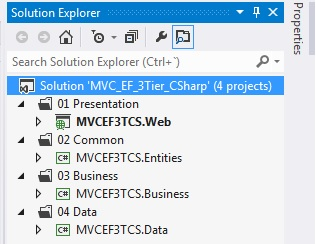

# MVC + Entity Framework on a 3 Tier Architecture
## Requires
- Visual Studio 2012
## License
- Apache License, Version 2.0
## Technologies
- Entity Framework
- MVC
- MVC Scaffolding
## Topics
- 3 Tier Architecture
## Updated
- 06/06/2014
## Description

<h1>Introduction</h1>

<em>This sample is an idea for develop web applications with MVC and Entity Framework on a 3 Tier Architecture. I have considered the classic functionality for two joined entities, in this case Product and Category.</em>

<em>The following screenshots show the functionality:</em>

<em> 
</em>

<h1></h1>

<h1></h1>

&nbsp;

<h1>Building the Sample</h1>

<em>For run this solution, you need SQL Server with local databases support, the
<strong>web.config</strong> file indicates a connectionstring using a local database (this database should be created automatically)</em>

<em>

XML

Edit|Remove

xml

<pre class="xml">&lt;connectionStrings&gt;&nbsp;
&nbsp;&nbsp;&nbsp;&nbsp;&lt;add&nbsp;name=&quot;DefaultConnection&quot;&nbsp;connectionString=&quot;Data&nbsp;Source=(LocalDb)\v11.0;Initial&nbsp;Catalog=aspnet-MVCEF3TCS.Web-20140604134240;Integrated&nbsp;Security=SSPI;AttachDBFilename=|DataDirectory|\aspnet-MVCEF3TCS.Web-20140604134240.mdf&quot;&nbsp;providerName=&quot;System.Data.SqlClient&quot;&nbsp;/&gt;&nbsp;
&nbsp;&nbsp;&lt;/connectionStrings&gt;</pre>

<em>If you dont have idea about local databases, you can use a specific database only modifying the
<strong>web.config</strong>, something like:</em>

</em>

<em>

XML

Edit|Remove

xml

<pre class="xml">&lt;connectionStrings&gt;&nbsp;&nbsp;
&nbsp;&nbsp;&nbsp;&nbsp;&lt;add&nbsp;name=&quot;DefaultConnection&quot;&nbsp;&nbsp;&nbsp;
&nbsp;&nbsp;&nbsp;&nbsp;&nbsp;&nbsp;&nbsp;&nbsp;&nbsp;connectionString=&quot;Data&nbsp;Source=(Your&nbsp;server);Initial&nbsp;Catalog=(Your&nbsp;database);User&nbsp;ID=(Your&nbsp;user);Password=(Your&nbsp;password)&quot;&nbsp;&nbsp;&nbsp;
&nbsp;&nbsp;&nbsp;&nbsp;&nbsp;&nbsp;&nbsp;&nbsp;&nbsp;providerName=&quot;System.Data.SqlClient&quot;/&gt;&nbsp;&nbsp;
&nbsp;&nbsp;&lt;/connectionStrings&gt;</pre>

&nbsp;* The parameter &quot;name&quot; of connectionstring must be the same as the DatabaseContext constructor (DatabaseContext.cs file from Data Access Layer)

</em>

<em>C#</em>

<em>Edit|Remove</em>

<em>csharp

<pre class="csharp">namespace&nbsp;MVCEF3TCS.Data&nbsp;
{&nbsp;
&nbsp;&nbsp;&nbsp;&nbsp;using&nbsp;<a class="libraryLink" href="http://msdn.microsoft.com/en-US/library/System.Data.Entity.aspx" target="_blank" title="Auto generated link to System.Data.Entity">System.Data.Entity</a>;&nbsp;
&nbsp;&nbsp;&nbsp;&nbsp;using&nbsp;MVCEF3TCS.Entities;&nbsp;
&nbsp;&nbsp;&nbsp;&nbsp;&nbsp;
&nbsp;&nbsp;&nbsp;&nbsp;public&nbsp;class&nbsp;DatabaseContext&nbsp;:&nbsp;DbContext&nbsp;
&nbsp;&nbsp;&nbsp;&nbsp;{&nbsp;
&nbsp;&nbsp;&nbsp;&nbsp;&nbsp;&nbsp;&nbsp;&nbsp;public&nbsp;DatabaseContext()&nbsp;
&nbsp;&nbsp;&nbsp;&nbsp;&nbsp;&nbsp;&nbsp;&nbsp;&nbsp;&nbsp;&nbsp;&nbsp;:&nbsp;base(&quot;<strong>DefaultConnection</strong>&quot;)&nbsp;
&nbsp;&nbsp;&nbsp;&nbsp;&nbsp;&nbsp;&nbsp;&nbsp;{&nbsp;
&nbsp;&nbsp;&nbsp;&nbsp;&nbsp;&nbsp;&nbsp;&nbsp;}&nbsp;
&nbsp;
&nbsp;&nbsp;&nbsp;&nbsp;&nbsp;&nbsp;&nbsp;&nbsp;public&nbsp;DbSet&lt;Product&gt;&nbsp;ProductList&nbsp;{&nbsp;get;&nbsp;set;&nbsp;}&nbsp;
&nbsp;&nbsp;&nbsp;&nbsp;&nbsp;&nbsp;&nbsp;&nbsp;public&nbsp;DbSet&lt;Category&gt;&nbsp;CategoryList&nbsp;{&nbsp;get;&nbsp;set;&nbsp;}&nbsp;
&nbsp;&nbsp;&nbsp;&nbsp;}&nbsp;
}</pre>

</em>

<em>&nbsp;</em><strong style="font-size:medium">Note:&nbsp;</strong>

If you have error when trying to create database, maybe you need to add this lines in DatabaseContext.cs file:&nbsp;

C#

Edit|Remove

csharp

<pre class="csharp">protected&nbsp;override&nbsp;void&nbsp;OnModelCreating(DbModelBuilder&nbsp;modelBuilder)&nbsp;
&nbsp;&nbsp;&nbsp;&nbsp;&nbsp;&nbsp;&nbsp;&nbsp;{&nbsp;
&nbsp;&nbsp;&nbsp;&nbsp;&nbsp;&nbsp;&nbsp;&nbsp;&nbsp;&nbsp;&nbsp;&nbsp;Database.SetInitializer&lt;DatabaseContext&gt;(new&nbsp;DropCreateDatabaseIfModelChanges&lt;DatabaseContext&gt;());&nbsp;
&nbsp;&nbsp;&nbsp;&nbsp;&nbsp;&nbsp;&nbsp;&nbsp;}</pre>

If you will use scaffold tool for add more entities, you should erase or comment this lines,
because&nbsp;could cause an error.

&nbsp;

Description

<strong><em>Solution Structure</em></strong>

<em></em>

<em>01 Presentation Layer</em>

<em>02 Croscutting Layer</em>

<em>03 Business Layer (Logic)</em>

<em>04 Data Access Layer</em>

&nbsp;

<strong>Projects List</strong>

[01 Presentation]

&gt; Web [ASP.NET MVC 4 Web Application Project]

[02 Common, 03 Business, 04 Data]

&gt; Entities, Business, Data [Class Library Project]

<h1>Source Code Files</h1>
<ul>
<li><em>[04] DatabaseContext.cs - Data Access with Entity Framework.</em>
</li><li><em><em>[03] ProductManager.cs - Product Data Handler, data access layer consumer.</em></em>
</li><li><em>[03] CategoryManager.cs - Category Data Handler, data access layer consumer.</em>
</li><li><em><em>[02] Product.cs - Entity definition for Product (Model)</em></em>
</li><li><em>[02] Category.cs -&nbsp;<em><em>Entity definition for Category (Model)</em></em></em>
</li><li><em><em>[01] Controllers/ProductController.cs - Controller for Product Entity, this controller use the Product Data Handler from Business Layer.</em></em>
</li></ul>
