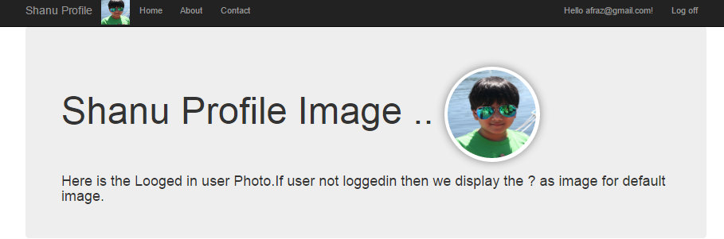
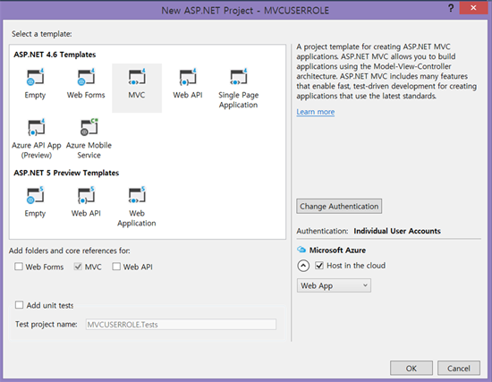
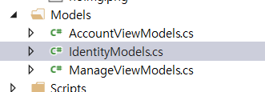
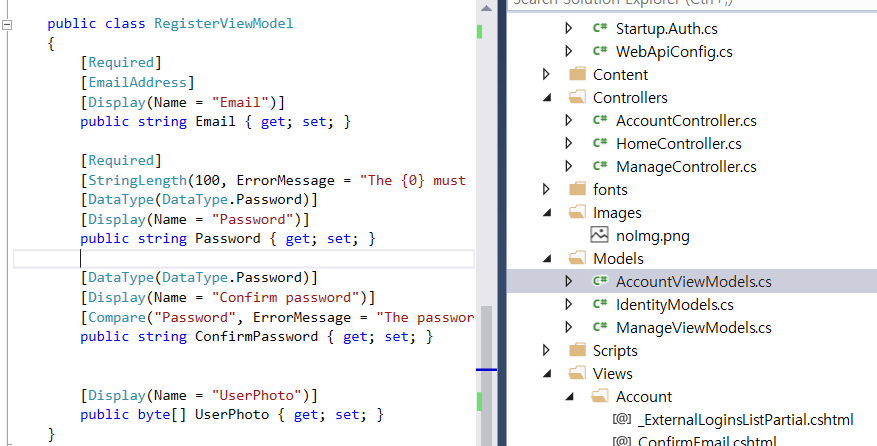
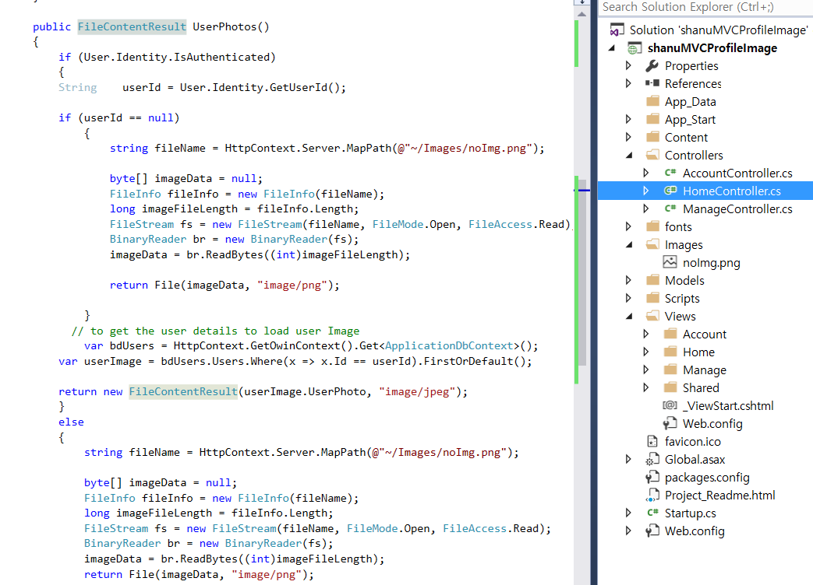

# MVC ASP.NET Identity customizing for adding profile image
## Requires
- Visual Studio 2015
## License
- MIT
## Technologies
- ASP.NET MVC
- ASP.NET Identity
## Topics
- ASP.NET MVC
- ASP.NET Identity
## Updated
- 08/09/2016
## Description

<h1>Introduction</h1>

<ol>
<li>In our previous article wehave explained about how to customizing <a href="https://code.msdn.microsoft.com/ASPNET-MVC-5-Security-And-44cbdb97">
ASP.NET MVC 5 Security and Creating User Role</a> and <a href="https://code.msdn.microsoft.com/ASPNET-MVC-User-Role-Base-e874e7ea" target="_blank">
User Role base Menu Management (Dynamic menu using MVC and AngularJS)</a> </li></ol>

In this article we will see in detail about using ASP.NET Identity in MVC Application

1)&nbsp;&nbsp;&nbsp;&nbsp; To upload and store User Profile Image to AspNetUsers table in SQL Server.

2)&nbsp;&nbsp;&nbsp;&nbsp; Display the authenticated Logged in users Uploaded profile Image in home page and in Title bar.

<em> 
</em>

<h1>Building the Sample</h1>

<strong>Prerequisites</strong>

<strong>Visual Studio 2015:</strong>&nbsp;You can download it from&nbsp;<a href="https://www.visualstudio.com/en-us/downloads/visual-studio-2015-downloads-vs.aspx" target="_blank">here</a>.

<h1>Description</h1>
<h2><strong>Step 1: Creating Database</strong></h2>

First we create a database to store all our ASP.NET&nbsp;Identity&nbsp;details to be stored in our Local SQL Server. Here we have used SQL Server 2014.Run the below script in your SQL Server to create a Database.&nbsp;

&nbsp;

SQL

Edit|Remove

mysql

<pre class="js">----&nbsp;=============================================&nbsp;&nbsp;&nbsp;&nbsp;&nbsp;&nbsp;&nbsp;&nbsp;&nbsp;&nbsp;&nbsp;&nbsp;&nbsp;&nbsp;&nbsp;&nbsp;&nbsp;&nbsp;&nbsp;&nbsp;&nbsp;&nbsp;&nbsp;&nbsp;&nbsp;&nbsp;&nbsp;&nbsp;&nbsp;&nbsp;&nbsp;&nbsp;
----&nbsp;Author&nbsp;&nbsp;&nbsp;&nbsp;&nbsp;&nbsp;:&nbsp;Shanu&nbsp;&nbsp;&nbsp;&nbsp;&nbsp;&nbsp;&nbsp;&nbsp;&nbsp;&nbsp;&nbsp;&nbsp;&nbsp;&nbsp;&nbsp;&nbsp;&nbsp;&nbsp;&nbsp;&nbsp;&nbsp;&nbsp;&nbsp;&nbsp;&nbsp;&nbsp;&nbsp;&nbsp;&nbsp;&nbsp;
----&nbsp;Create&nbsp;date&nbsp;:&nbsp;2016-05-30&nbsp;&nbsp;&nbsp;&nbsp;&nbsp;&nbsp;&nbsp;&nbsp;&nbsp;&nbsp;&nbsp;&nbsp;&nbsp;&nbsp;&nbsp;&nbsp;&nbsp;&nbsp;&nbsp;&nbsp;&nbsp;&nbsp;&nbsp;&nbsp;&nbsp;&nbsp;&nbsp;&nbsp;&nbsp;&nbsp;&nbsp;&nbsp;
----&nbsp;Description&nbsp;:&nbsp;To&nbsp;Create&nbsp;Database&nbsp;&nbsp;&nbsp;&nbsp;&nbsp;&nbsp;
----&nbsp;Latest&nbsp;&nbsp;&nbsp;&nbsp;&nbsp;&nbsp;&nbsp;&nbsp;&nbsp;&nbsp;&nbsp;&nbsp;&nbsp;&nbsp;&nbsp;&nbsp;&nbsp;&nbsp;&nbsp;&nbsp;&nbsp;&nbsp;&nbsp;&nbsp;&nbsp;&nbsp;&nbsp;&nbsp;&nbsp;&nbsp;&nbsp;&nbsp;
----&nbsp;Modifier&nbsp;&nbsp;&nbsp;&nbsp;:&nbsp;Shanu&nbsp;&nbsp;&nbsp;&nbsp;&nbsp;&nbsp;&nbsp;&nbsp;&nbsp;&nbsp;&nbsp;&nbsp;&nbsp;&nbsp;&nbsp;&nbsp;&nbsp;&nbsp;&nbsp;&nbsp;&nbsp;&nbsp;&nbsp;&nbsp;&nbsp;&nbsp;&nbsp;&nbsp;&nbsp;&nbsp;&nbsp;&nbsp;&nbsp;
----&nbsp;Modify&nbsp;date&nbsp;:&nbsp;2016-05-30&nbsp;&nbsp;&nbsp;&nbsp;&nbsp;&nbsp;&nbsp;&nbsp;&nbsp;&nbsp;&nbsp;&nbsp;&nbsp;&nbsp;&nbsp;&nbsp;&nbsp;&nbsp;&nbsp;&nbsp;
----&nbsp;=============================================&nbsp;&nbsp;&nbsp;
----Script&nbsp;to&nbsp;create&nbsp;DB&nbsp;&nbsp;&nbsp;
&nbsp;&nbsp;&nbsp;
USE&nbsp;MASTER&nbsp;&nbsp;&nbsp;
GO&nbsp;&nbsp;&nbsp;
&nbsp;&nbsp;&nbsp;
&nbsp;--1)&nbsp;Check&nbsp;for&nbsp;the&nbsp;Database&nbsp;Exists&nbsp;.If&nbsp;the&nbsp;database&nbsp;is&nbsp;exist&nbsp;then&nbsp;drop&nbsp;and&nbsp;create&nbsp;new&nbsp;DB&nbsp;&nbsp;&nbsp;
&nbsp;&nbsp;&nbsp;
IF&nbsp;EXISTS&nbsp;(SELECT&nbsp;[name]&nbsp;FROM&nbsp;sys.databases&nbsp;WHERE&nbsp;[name]&nbsp;=&nbsp;'UserProfileDB'&nbsp;)&nbsp;&nbsp;&nbsp;
DROP&nbsp;DATABASE&nbsp;UserProfileDB&nbsp;&nbsp;&nbsp;
&nbsp;&nbsp;&nbsp;
GO&nbsp;&nbsp;&nbsp;
&nbsp;&nbsp;&nbsp;
CREATE&nbsp;DATABASE&nbsp;UserProfileDB&nbsp;&nbsp;&nbsp;
GO&nbsp;&nbsp;&nbsp;
&nbsp;&nbsp;&nbsp;
USE&nbsp;UserProfileDB&nbsp;&nbsp;&nbsp;
GO&nbsp;&nbsp;</pre>

<h2 class="endscriptcode">&nbsp;<strong>Step 2: Create your Web Application in Visual Studio 2015</strong></h2>

After installing our Visual Studio 2015 click Start, then Programs and select Visual Studio 2015 - Click Visual Studio 2015. Click New, then Project, select Web and then select ASP.NET Web Application. Enter your project name and click OK.&nbsp;Select MVC
 and click OK.&nbsp;

&nbsp;

<strong>Step 3: Web.Config</strong> 
 
In web.config file we can find the&nbsp;DefaultConnection&nbsp;Connection string. By default ASP.NET MVC will use this connection string to create all ASP.NET Identity related tables like AspNetUsers, etc. Here in connection string we will be using our newly
 created DB name.

Here in connection string change your SQL Server Name, UID and PWD to create and store all user details in one database.&nbsp;

&nbsp;

XML

Edit|Remove

xml

<pre class="js">&lt;connectionStrings&gt;&nbsp;&nbsp;&nbsp;
&nbsp;&nbsp;&nbsp;&nbsp;&lt;add&nbsp;name=&quot;DefaultConnection&quot;&nbsp;connectionString=&quot;data&nbsp;source=YOURSERVERNAME;initial&nbsp;catalog=UserProfileDB;user&nbsp;id=UID;password=PWD;Integrated&nbsp;Security=True&quot;&nbsp;providerName=&quot;System.Data.SqlClient&quot;&nbsp;&nbsp;/&gt;&nbsp;&nbsp;&nbsp;&nbsp;
&nbsp;&lt;/connectionStrings&gt;&nbsp;
</pre>

&nbsp;

<h2><strong>Step 4: IdentityModels.cs</strong></h2>

In IdentityModels.cs we need to add the image property to be used for storing our image to database.Now here in ApplicationUser class we will be adding a new property to store the image here we declare the property type as byte like below

&nbsp;

C#

Edit|Remove

csharp

<pre class="js">public&nbsp;class&nbsp;ApplicationUser&nbsp;:&nbsp;IdentityUser&nbsp;
&nbsp;&nbsp;&nbsp;&nbsp;{&nbsp;
&nbsp;&nbsp;&nbsp;&nbsp;&nbsp;&nbsp;&nbsp;&nbsp;//&nbsp;Here&nbsp;we&nbsp;add&nbsp;a&nbsp;byte&nbsp;to&nbsp;Save&nbsp;the&nbsp;user&nbsp;Profile&nbsp;Pictuer&nbsp;
&nbsp;&nbsp;&nbsp;&nbsp;&nbsp;&nbsp;&nbsp;&nbsp;public&nbsp;byte[]&nbsp;UserPhoto&nbsp;{&nbsp;get;&nbsp;set;&nbsp;}&nbsp;
</pre>

&nbsp;We can find this class inside the In IdentityModels.cs in Model folder

&nbsp;

<h2><strong>Step 5: MVC </strong><strong>Model Part</strong></h2>

Next in&nbsp;<strong>AccountViewModel.cs</strong>&nbsp;check for the RegisterViewModel and add the properties like below.

&nbsp;

C#

Edit|Remove

csharp

<pre class="js">[Display(Name&nbsp;=&nbsp;&quot;UserPhoto&quot;)]&nbsp;
&nbsp;&nbsp;&nbsp;&nbsp;&nbsp;&nbsp;&nbsp;&nbsp;public&nbsp;byte[]&nbsp;UserPhoto&nbsp;{&nbsp;get;&nbsp;set;&nbsp;}&nbsp;
</pre>

&nbsp;

&nbsp;

<h2><strong>Step 6: Edit Register view to add our upload image</strong></h2>

In Register.cshtml we add the below code to upload images to AspNetUsers table in our DB.

First we add , enctype = &quot;multipart/form-data&quot; in begin form like below.

&nbsp;

HTML

Edit|Remove

html

<pre class="js">@using&nbsp;(Html.BeginForm(&quot;Register&quot;,&nbsp;&quot;Account&quot;,&nbsp;FormMethod.Post,&nbsp;new{&nbsp;@class&nbsp;=&nbsp;&quot;form-horizontal&quot;,&nbsp;role&nbsp;=&nbsp;&quot;form&quot;,&nbsp;enctype&nbsp;=&nbsp;&quot;multipart/form-data&quot;}))&nbsp;
{</pre>

&nbsp;

Next we need to customize our Register page to add the HTMl Image Tag for uploading the image.

&nbsp;

HTML

Edit|Remove

html

<pre class="js">&lt;div&nbsp;class=&quot;form-group&quot;&gt;&nbsp;
&nbsp;&nbsp;&nbsp;&nbsp;&nbsp;&nbsp;&nbsp;&nbsp;@Html.LabelFor(m&nbsp;=&gt;&nbsp;m.UserPhoto,&nbsp;new&nbsp;{&nbsp;@class&nbsp;=&nbsp;&quot;col-md-2&nbsp;control-label&quot;&nbsp;})&nbsp;
&nbsp;&nbsp;&nbsp;&nbsp;&nbsp;&nbsp;&nbsp;&nbsp;&lt;div&nbsp;class=&quot;col-md-10&quot;&gt;&nbsp;
&nbsp;&nbsp;&nbsp;&nbsp;&nbsp;&nbsp;&nbsp;&nbsp;&nbsp;&nbsp;&nbsp;&nbsp;
&nbsp;&nbsp;&nbsp;&nbsp;&nbsp;&nbsp;&nbsp;&nbsp;&nbsp;&nbsp;&nbsp;&nbsp;&lt;input&nbsp;type=&quot;file&quot;&nbsp;name=&quot;UserPhoto&quot;&nbsp;id=&quot;fileUpload&quot;&nbsp;accept=&quot;.png,.jpg,.jpeg,.gif,.tif&quot;&nbsp;/&gt;&nbsp;
&nbsp;&nbsp;&nbsp;&nbsp;&nbsp;&nbsp;&nbsp;&nbsp;&nbsp;&nbsp;&nbsp;&nbsp;&nbsp;&nbsp;
&nbsp;&nbsp;&nbsp;&nbsp;&nbsp;&nbsp;&nbsp;&nbsp;&lt;/div&gt;&nbsp;
&nbsp;&nbsp;&nbsp;&nbsp;&lt;/div&gt;&nbsp;
</pre>

&nbsp;

&nbsp;

<h2><strong>Step 7: MVC <strong>Controller Part</strong></strong> 
</h2>

Next in<strong>&nbsp;</strong><strong>AccountController.cs we will update the code in
</strong>Register <strong>post method to customize and store the uploaded user image</strong> in ASP.NET identity database.

In the Register post method we will save the uploaded image to the byte array and use this byte array result to be saved in our users table.

<h2>

C#

Edit|Remove

csharp

<pre class="js">if&nbsp;(ModelState.IsValid)&nbsp;
&nbsp;&nbsp;&nbsp;&nbsp;&nbsp;&nbsp;&nbsp;&nbsp;&nbsp;&nbsp;&nbsp;&nbsp;{//&nbsp;To&nbsp;convert&nbsp;the&nbsp;user&nbsp;uploaded&nbsp;Photo&nbsp;as&nbsp;Byte&nbsp;Array&nbsp;before&nbsp;save&nbsp;to&nbsp;DB&nbsp;
&nbsp;&nbsp;&nbsp;&nbsp;&nbsp;&nbsp;&nbsp;&nbsp;&nbsp;&nbsp;&nbsp;&nbsp;&nbsp;&nbsp;&nbsp;&nbsp;byte[]&nbsp;imageData&nbsp;=&nbsp;null;&nbsp;
&nbsp;&nbsp;&nbsp;&nbsp;&nbsp;&nbsp;&nbsp;&nbsp;&nbsp;&nbsp;&nbsp;&nbsp;&nbsp;&nbsp;&nbsp;&nbsp;if&nbsp;(Request.Files.Count&nbsp;&gt;&nbsp;0)&nbsp;
&nbsp;&nbsp;&nbsp;&nbsp;&nbsp;&nbsp;&nbsp;&nbsp;&nbsp;&nbsp;&nbsp;&nbsp;&nbsp;&nbsp;&nbsp;&nbsp;{&nbsp;
&nbsp;&nbsp;&nbsp;&nbsp;&nbsp;&nbsp;&nbsp;&nbsp;&nbsp;&nbsp;&nbsp;&nbsp;&nbsp;&nbsp;&nbsp;&nbsp;&nbsp;&nbsp;&nbsp;&nbsp;HttpPostedFileBase&nbsp;poImgFile&nbsp;=&nbsp;Request.Files[&quot;UserPhoto&quot;];&nbsp;
&nbsp;
&nbsp;&nbsp;&nbsp;&nbsp;&nbsp;&nbsp;&nbsp;&nbsp;&nbsp;&nbsp;&nbsp;&nbsp;&nbsp;&nbsp;&nbsp;&nbsp;&nbsp;&nbsp;&nbsp;&nbsp;using&nbsp;(var&nbsp;binary&nbsp;=&nbsp;new&nbsp;BinaryReader(poImgFile.InputStream))&nbsp;
&nbsp;&nbsp;&nbsp;&nbsp;&nbsp;&nbsp;&nbsp;&nbsp;&nbsp;&nbsp;&nbsp;&nbsp;&nbsp;&nbsp;&nbsp;&nbsp;&nbsp;&nbsp;&nbsp;&nbsp;{&nbsp;
&nbsp;&nbsp;&nbsp;&nbsp;&nbsp;&nbsp;&nbsp;&nbsp;&nbsp;&nbsp;&nbsp;&nbsp;&nbsp;&nbsp;&nbsp;&nbsp;&nbsp;&nbsp;&nbsp;&nbsp;&nbsp;&nbsp;&nbsp;&nbsp;imageData&nbsp;=&nbsp;binary.ReadBytes(poImgFile.ContentLength);&nbsp;
&nbsp;&nbsp;&nbsp;&nbsp;&nbsp;&nbsp;&nbsp;&nbsp;&nbsp;&nbsp;&nbsp;&nbsp;&nbsp;&nbsp;&nbsp;&nbsp;&nbsp;&nbsp;&nbsp;&nbsp;}}var&nbsp;user&nbsp;=&nbsp;new&nbsp;ApplicationUser&nbsp;{&nbsp;UserName&nbsp;=&nbsp;model.Email,&nbsp;Email&nbsp;=&nbsp;model.Email&nbsp;};&nbsp;
&nbsp;
&nbsp;&nbsp;&nbsp;&nbsp;&nbsp;&nbsp;&nbsp;&nbsp;&nbsp;&nbsp;&nbsp;&nbsp;&nbsp;&nbsp;&nbsp;&nbsp;//Here&nbsp;we&nbsp;pass&nbsp;the&nbsp;byte&nbsp;array&nbsp;to&nbsp;user&nbsp;context&nbsp;to&nbsp;store&nbsp;in&nbsp;db&nbsp;
&nbsp;&nbsp;&nbsp;&nbsp;&nbsp;&nbsp;&nbsp;&nbsp;&nbsp;&nbsp;&nbsp;&nbsp;&nbsp;&nbsp;&nbsp;&nbsp;user.UserPhoto&nbsp;=&nbsp;imageData;&nbsp;
</pre>

</h2>

Here is the complete code of the Register post method&nbsp;

<h2>

C#

Edit|Remove

csharp

<pre class="csharp">[HttpPost]&nbsp;
&nbsp;&nbsp;&nbsp;&nbsp;&nbsp;&nbsp;&nbsp;&nbsp;[AllowAnonymous]&nbsp;
&nbsp;&nbsp;&nbsp;&nbsp;&nbsp;&nbsp;&nbsp;&nbsp;[ValidateAntiForgeryToken]&nbsp;
&nbsp;&nbsp;&nbsp;&nbsp;&nbsp;&nbsp;&nbsp;&nbsp;public&nbsp;async&nbsp;Task&lt;ActionResult&gt;&nbsp;Register([Bind(Exclude&nbsp;=&nbsp;&quot;UserPhoto&quot;)]RegisterViewModel&nbsp;model)&nbsp;
&nbsp;&nbsp;&nbsp;&nbsp;&nbsp;&nbsp;&nbsp;&nbsp;{&nbsp;
&nbsp;&nbsp;&nbsp;&nbsp;&nbsp;&nbsp;&nbsp;&nbsp;&nbsp;&nbsp;&nbsp;&nbsp;if&nbsp;(ModelState.IsValid)&nbsp;
&nbsp;&nbsp;&nbsp;&nbsp;&nbsp;&nbsp;&nbsp;&nbsp;&nbsp;&nbsp;&nbsp;&nbsp;{&nbsp;
&nbsp;&nbsp;&nbsp;&nbsp;&nbsp;&nbsp;&nbsp;&nbsp;&nbsp;&nbsp;&nbsp;&nbsp;&nbsp;&nbsp;&nbsp;&nbsp;&nbsp;&nbsp;
&nbsp;&nbsp;&nbsp;&nbsp;&nbsp;&nbsp;&nbsp;&nbsp;&nbsp;&nbsp;&nbsp;&nbsp;&nbsp;&nbsp;&nbsp;&nbsp;//&nbsp;To&nbsp;convert&nbsp;the&nbsp;user&nbsp;uploaded&nbsp;Photo&nbsp;as&nbsp;Byte&nbsp;Array&nbsp;before&nbsp;save&nbsp;to&nbsp;DBbyte[]&nbsp;imageData&nbsp;=&nbsp;null;&nbsp;
&nbsp;&nbsp;&nbsp;&nbsp;&nbsp;&nbsp;&nbsp;&nbsp;&nbsp;&nbsp;&nbsp;&nbsp;&nbsp;&nbsp;&nbsp;&nbsp;if&nbsp;(Request.Files.Count&nbsp;&gt;&nbsp;0)&nbsp;
&nbsp;&nbsp;&nbsp;&nbsp;&nbsp;&nbsp;&nbsp;&nbsp;&nbsp;&nbsp;&nbsp;&nbsp;&nbsp;&nbsp;&nbsp;&nbsp;{&nbsp;
&nbsp;&nbsp;&nbsp;&nbsp;&nbsp;&nbsp;&nbsp;&nbsp;&nbsp;&nbsp;&nbsp;&nbsp;&nbsp;&nbsp;&nbsp;&nbsp;&nbsp;&nbsp;&nbsp;&nbsp;HttpPostedFileBase&nbsp;poImgFile&nbsp;=&nbsp;Request.Files[&quot;UserPhoto&quot;];&nbsp;
&nbsp;
&nbsp;&nbsp;&nbsp;&nbsp;&nbsp;&nbsp;&nbsp;&nbsp;&nbsp;&nbsp;&nbsp;&nbsp;&nbsp;&nbsp;&nbsp;&nbsp;&nbsp;&nbsp;&nbsp;&nbsp;using&nbsp;(var&nbsp;binary&nbsp;=&nbsp;new&nbsp;BinaryReader(poImgFile.InputStream))&nbsp;
&nbsp;&nbsp;&nbsp;&nbsp;&nbsp;&nbsp;&nbsp;&nbsp;&nbsp;&nbsp;&nbsp;&nbsp;&nbsp;&nbsp;&nbsp;&nbsp;&nbsp;&nbsp;&nbsp;&nbsp;{&nbsp;
&nbsp;&nbsp;&nbsp;&nbsp;&nbsp;&nbsp;&nbsp;&nbsp;&nbsp;&nbsp;&nbsp;&nbsp;&nbsp;&nbsp;&nbsp;&nbsp;&nbsp;&nbsp;&nbsp;&nbsp;&nbsp;&nbsp;&nbsp;&nbsp;imageData&nbsp;=&nbsp;binary.ReadBytes(poImgFile.ContentLength);&nbsp;
&nbsp;&nbsp;&nbsp;&nbsp;&nbsp;&nbsp;&nbsp;&nbsp;&nbsp;&nbsp;&nbsp;&nbsp;&nbsp;&nbsp;&nbsp;&nbsp;&nbsp;&nbsp;&nbsp;&nbsp;}&nbsp;
&nbsp;&nbsp;&nbsp;&nbsp;&nbsp;&nbsp;&nbsp;&nbsp;&nbsp;&nbsp;&nbsp;&nbsp;&nbsp;&nbsp;&nbsp;&nbsp;}&nbsp;
&nbsp;
&nbsp;
&nbsp;&nbsp;&nbsp;&nbsp;&nbsp;&nbsp;&nbsp;&nbsp;&nbsp;&nbsp;&nbsp;&nbsp;&nbsp;&nbsp;&nbsp;&nbsp;var&nbsp;user&nbsp;=&nbsp;new&nbsp;ApplicationUser&nbsp;{&nbsp;UserName&nbsp;=&nbsp;model.Email,&nbsp;Email&nbsp;=&nbsp;model.Email&nbsp;};&nbsp;
&nbsp;
&nbsp;&nbsp;&nbsp;&nbsp;&nbsp;&nbsp;&nbsp;&nbsp;&nbsp;&nbsp;&nbsp;&nbsp;&nbsp;&nbsp;&nbsp;&nbsp;//Here&nbsp;we&nbsp;pass&nbsp;the&nbsp;byte&nbsp;array&nbsp;to&nbsp;user&nbsp;context&nbsp;to&nbsp;store&nbsp;in&nbsp;db&nbsp;
&nbsp;&nbsp;&nbsp;&nbsp;&nbsp;&nbsp;&nbsp;&nbsp;&nbsp;&nbsp;&nbsp;&nbsp;&nbsp;&nbsp;&nbsp;&nbsp;user.UserPhoto&nbsp;=&nbsp;imageData;&nbsp;
&nbsp;
&nbsp;&nbsp;&nbsp;&nbsp;&nbsp;&nbsp;&nbsp;&nbsp;&nbsp;&nbsp;&nbsp;&nbsp;&nbsp;&nbsp;&nbsp;&nbsp;var&nbsp;result&nbsp;=&nbsp;await&nbsp;UserManager.CreateAsync(user,&nbsp;model.Password);&nbsp;
&nbsp;&nbsp;&nbsp;&nbsp;&nbsp;&nbsp;&nbsp;&nbsp;&nbsp;&nbsp;&nbsp;&nbsp;&nbsp;&nbsp;&nbsp;&nbsp;if&nbsp;(result.Succeeded)&nbsp;
&nbsp;&nbsp;&nbsp;&nbsp;&nbsp;&nbsp;&nbsp;&nbsp;&nbsp;&nbsp;&nbsp;&nbsp;&nbsp;&nbsp;&nbsp;&nbsp;{&nbsp;
&nbsp;&nbsp;&nbsp;&nbsp;&nbsp;&nbsp;&nbsp;&nbsp;&nbsp;&nbsp;&nbsp;&nbsp;&nbsp;&nbsp;&nbsp;&nbsp;&nbsp;&nbsp;&nbsp;&nbsp;await&nbsp;SignInManager.SignInAsync(user,&nbsp;isPersistent:false,&nbsp;rememberBrowser:false);&nbsp;
&nbsp;&nbsp;&nbsp;&nbsp;&nbsp;&nbsp;&nbsp;&nbsp;&nbsp;&nbsp;&nbsp;&nbsp;&nbsp;&nbsp;&nbsp;&nbsp;&nbsp;&nbsp;&nbsp;&nbsp;&nbsp;
&nbsp;&nbsp;&nbsp;&nbsp;&nbsp;&nbsp;&nbsp;&nbsp;&nbsp;&nbsp;&nbsp;&nbsp;&nbsp;&nbsp;&nbsp;&nbsp;&nbsp;&nbsp;&nbsp;&nbsp;//&nbsp;For&nbsp;more&nbsp;information&nbsp;on&nbsp;how&nbsp;to&nbsp;enable&nbsp;account&nbsp;confirmation&nbsp;and&nbsp;password&nbsp;reset&nbsp;please&nbsp;visit&nbsp;http://go.microsoft.com/fwlink/?LinkID=320771&nbsp;&nbsp;&nbsp;&nbsp;&nbsp;&nbsp;&nbsp;&nbsp;&nbsp;&nbsp;&nbsp;&nbsp;&nbsp;return&nbsp;RedirectToAction(&quot;Index&quot;,&nbsp;&quot;Home&quot;);&nbsp;
&nbsp;&nbsp;&nbsp;&nbsp;&nbsp;&nbsp;&nbsp;&nbsp;&nbsp;&nbsp;&nbsp;&nbsp;&nbsp;&nbsp;&nbsp;&nbsp;}&nbsp;
&nbsp;&nbsp;&nbsp;&nbsp;&nbsp;&nbsp;&nbsp;&nbsp;&nbsp;&nbsp;&nbsp;&nbsp;&nbsp;&nbsp;&nbsp;&nbsp;AddErrors(result);&nbsp;
&nbsp;&nbsp;&nbsp;&nbsp;&nbsp;&nbsp;&nbsp;&nbsp;&nbsp;&nbsp;&nbsp;&nbsp;}&nbsp;
&nbsp;
&nbsp;&nbsp;&nbsp;&nbsp;&nbsp;&nbsp;&nbsp;&nbsp;&nbsp;&nbsp;&nbsp;&nbsp;//&nbsp;If&nbsp;we&nbsp;got&nbsp;this&nbsp;far,&nbsp;something&nbsp;failed,&nbsp;redisplay&nbsp;formreturn&nbsp;View(model);&nbsp;
&nbsp;&nbsp;&nbsp;&nbsp;&nbsp;&nbsp;&nbsp;&nbsp;}&nbsp;
</pre>

</h2>

So now we have successfully completed the Image uploaded part to AspNetUsers Table in our local SQL Server Database.

Next we will see how to display the logged in user Image on home page and in menu bar.&nbsp;

<h2><strong>Step 8: </strong><strong>Display User Image in home page</strong></h2>

For displaying this we create a FileContentResult Method&nbsp; to display the image on user home and in menu bar.&nbsp;

Create FileContentResult method in Home controller as UserPhotos to display the image in home page and in Menu bar.

<h2></h2>

In home controller we create a method named as UserPhotos and return the image to View page for user profile display.

In this method we check for Authenticated (Logged in) users. If the user is not logged In to our web application then I will display he default image as &ldquo;?&rdquo; like below. Here we display the image in both top menu and in home page.

If the user is authenticated and successfully logged in to our system then we display the logged in user profile picture in home page like below.

Here is the complete code for check the Authenticated user and return the valid user&rsquo;s image to our View page .This method we created in our Home controller.

&nbsp;

C#

Edit|Remove

csharp

<pre class="js">public&nbsp;FileContentResult&nbsp;UserPhotos()&nbsp;
&nbsp;&nbsp;&nbsp;&nbsp;&nbsp;&nbsp;&nbsp;&nbsp;{if&nbsp;(User.Identity.IsAuthenticated)&nbsp;
&nbsp;&nbsp;&nbsp;&nbsp;&nbsp;&nbsp;&nbsp;&nbsp;&nbsp;&nbsp;&nbsp;&nbsp;{String&nbsp;&nbsp;&nbsp;&nbsp;userId&nbsp;=&nbsp;User.Identity.GetUserId();&nbsp;
&nbsp;
&nbsp;&nbsp;&nbsp;&nbsp;&nbsp;&nbsp;&nbsp;&nbsp;&nbsp;&nbsp;&nbsp;&nbsp;if&nbsp;(userId&nbsp;==&nbsp;null)&nbsp;
&nbsp;&nbsp;&nbsp;&nbsp;&nbsp;&nbsp;&nbsp;&nbsp;&nbsp;&nbsp;&nbsp;&nbsp;&nbsp;&nbsp;&nbsp;&nbsp;{&nbsp;
&nbsp;&nbsp;&nbsp;&nbsp;&nbsp;&nbsp;&nbsp;&nbsp;&nbsp;&nbsp;&nbsp;&nbsp;&nbsp;&nbsp;&nbsp;&nbsp;&nbsp;&nbsp;&nbsp;&nbsp;string&nbsp;fileName&nbsp;=&nbsp;HttpContext.Server.MapPath(@&quot;~/Images/noImg.png&quot;);&nbsp;
&nbsp;
&nbsp;&nbsp;&nbsp;&nbsp;&nbsp;&nbsp;&nbsp;&nbsp;&nbsp;&nbsp;&nbsp;&nbsp;&nbsp;&nbsp;&nbsp;&nbsp;&nbsp;&nbsp;&nbsp;&nbsp;byte[]&nbsp;imageData&nbsp;=&nbsp;null;&nbsp;
&nbsp;&nbsp;&nbsp;&nbsp;&nbsp;&nbsp;&nbsp;&nbsp;&nbsp;&nbsp;&nbsp;&nbsp;&nbsp;&nbsp;&nbsp;&nbsp;&nbsp;&nbsp;&nbsp;&nbsp;FileInfo&nbsp;fileInfo&nbsp;=&nbsp;new&nbsp;FileInfo(fileName);&nbsp;
&nbsp;&nbsp;&nbsp;&nbsp;&nbsp;&nbsp;&nbsp;&nbsp;&nbsp;&nbsp;&nbsp;&nbsp;&nbsp;&nbsp;&nbsp;&nbsp;&nbsp;&nbsp;&nbsp;&nbsp;long&nbsp;imageFileLength&nbsp;=&nbsp;fileInfo.Length;&nbsp;
&nbsp;&nbsp;&nbsp;&nbsp;&nbsp;&nbsp;&nbsp;&nbsp;&nbsp;&nbsp;&nbsp;&nbsp;&nbsp;&nbsp;&nbsp;&nbsp;&nbsp;&nbsp;&nbsp;&nbsp;FileStream&nbsp;fs&nbsp;=&nbsp;new&nbsp;FileStream(fileName,&nbsp;FileMode.Open,&nbsp;FileAccess.Read);&nbsp;
&nbsp;&nbsp;&nbsp;&nbsp;&nbsp;&nbsp;&nbsp;&nbsp;&nbsp;&nbsp;&nbsp;&nbsp;&nbsp;&nbsp;&nbsp;&nbsp;&nbsp;&nbsp;&nbsp;&nbsp;BinaryReader&nbsp;br&nbsp;=&nbsp;new&nbsp;BinaryReader(fs);&nbsp;
&nbsp;&nbsp;&nbsp;&nbsp;&nbsp;&nbsp;&nbsp;&nbsp;&nbsp;&nbsp;&nbsp;&nbsp;&nbsp;&nbsp;&nbsp;&nbsp;&nbsp;&nbsp;&nbsp;&nbsp;imageData&nbsp;=&nbsp;br.ReadBytes((int)imageFileLength);&nbsp;
&nbsp;&nbsp;&nbsp;&nbsp;&nbsp;&nbsp;&nbsp;&nbsp;&nbsp;&nbsp;&nbsp;&nbsp;&nbsp;&nbsp;&nbsp;&nbsp;&nbsp;&nbsp;&nbsp;&nbsp;&nbsp;
&nbsp;&nbsp;&nbsp;&nbsp;&nbsp;&nbsp;&nbsp;&nbsp;&nbsp;&nbsp;&nbsp;&nbsp;&nbsp;&nbsp;&nbsp;&nbsp;&nbsp;&nbsp;&nbsp;&nbsp;return&nbsp;File(imageData,&nbsp;&quot;image/png&quot;);&nbsp;
&nbsp;
&nbsp;&nbsp;&nbsp;&nbsp;&nbsp;&nbsp;&nbsp;&nbsp;&nbsp;&nbsp;&nbsp;&nbsp;&nbsp;&nbsp;&nbsp;&nbsp;}//&nbsp;to&nbsp;get&nbsp;the&nbsp;user&nbsp;details&nbsp;to&nbsp;load&nbsp;user&nbsp;Imagevar&nbsp;bdUsers&nbsp;=&nbsp;HttpContext.GetOwinContext().Get&lt;ApplicationDbContext&gt;();&nbsp;
&nbsp;&nbsp;&nbsp;&nbsp;&nbsp;&nbsp;&nbsp;&nbsp;&nbsp;&nbsp;&nbsp;&nbsp;var&nbsp;userImage&nbsp;=&nbsp;bdUsers.Users.Where(x&nbsp;=&gt;&nbsp;x.Id&nbsp;==&nbsp;userId).FirstOrDefault();&nbsp;
&nbsp;
&nbsp;&nbsp;&nbsp;&nbsp;&nbsp;&nbsp;&nbsp;&nbsp;&nbsp;&nbsp;&nbsp;&nbsp;returnnew&nbsp;FileContentResult(userImage.UserPhoto,&nbsp;&quot;image/jpeg&quot;);&nbsp;
&nbsp;&nbsp;&nbsp;&nbsp;&nbsp;&nbsp;&nbsp;&nbsp;&nbsp;&nbsp;&nbsp;&nbsp;}else{&nbsp;
&nbsp;&nbsp;&nbsp;&nbsp;&nbsp;&nbsp;&nbsp;&nbsp;&nbsp;&nbsp;&nbsp;&nbsp;&nbsp;&nbsp;&nbsp;&nbsp;string&nbsp;fileName&nbsp;=&nbsp;HttpContext.Server.MapPath(@&quot;~/Images/noImg.png&quot;);&nbsp;
&nbsp;
&nbsp;&nbsp;&nbsp;&nbsp;&nbsp;&nbsp;&nbsp;&nbsp;&nbsp;&nbsp;&nbsp;&nbsp;&nbsp;&nbsp;&nbsp;&nbsp;byte[]&nbsp;imageData&nbsp;=&nbsp;null;&nbsp;
&nbsp;&nbsp;&nbsp;&nbsp;&nbsp;&nbsp;&nbsp;&nbsp;&nbsp;&nbsp;&nbsp;&nbsp;&nbsp;&nbsp;&nbsp;&nbsp;FileInfo&nbsp;fileInfo&nbsp;=&nbsp;new&nbsp;FileInfo(fileName);&nbsp;
&nbsp;&nbsp;&nbsp;&nbsp;&nbsp;&nbsp;&nbsp;&nbsp;&nbsp;&nbsp;&nbsp;&nbsp;&nbsp;&nbsp;&nbsp;&nbsp;long&nbsp;imageFileLength&nbsp;=&nbsp;fileInfo.Length;&nbsp;
&nbsp;&nbsp;&nbsp;&nbsp;&nbsp;&nbsp;&nbsp;&nbsp;&nbsp;&nbsp;&nbsp;&nbsp;&nbsp;&nbsp;&nbsp;&nbsp;FileStream&nbsp;fs&nbsp;=&nbsp;new&nbsp;FileStream(fileName,&nbsp;FileMode.Open,&nbsp;FileAccess.Read);&nbsp;
&nbsp;&nbsp;&nbsp;&nbsp;&nbsp;&nbsp;&nbsp;&nbsp;&nbsp;&nbsp;&nbsp;&nbsp;&nbsp;&nbsp;&nbsp;&nbsp;BinaryReader&nbsp;br&nbsp;=&nbsp;new&nbsp;BinaryReader(fs);&nbsp;
&nbsp;&nbsp;&nbsp;&nbsp;&nbsp;&nbsp;&nbsp;&nbsp;&nbsp;&nbsp;&nbsp;&nbsp;&nbsp;&nbsp;&nbsp;&nbsp;imageData&nbsp;=&nbsp;br.ReadBytes((int)imageFileLength);&nbsp;&nbsp;&nbsp;&nbsp;&nbsp;&nbsp;&nbsp;&nbsp;&nbsp;&nbsp;&nbsp;&nbsp;&nbsp;&nbsp;&nbsp;&nbsp;&nbsp;&nbsp;
&nbsp;&nbsp;&nbsp;&nbsp;&nbsp;&nbsp;&nbsp;&nbsp;&nbsp;&nbsp;&nbsp;&nbsp;&nbsp;&nbsp;&nbsp;&nbsp;return&nbsp;File(imageData,&nbsp;&quot;image/png&quot;);&nbsp;
&nbsp;&nbsp;&nbsp;&nbsp;&nbsp;&nbsp;&nbsp;&nbsp;&nbsp;&nbsp;&nbsp;&nbsp;&nbsp;&nbsp;&nbsp;&nbsp;
&nbsp;&nbsp;&nbsp;&nbsp;&nbsp;&nbsp;&nbsp;&nbsp;&nbsp;&nbsp;&nbsp;&nbsp;}}</pre>

&nbsp;

<h2><strong>Step 9: MVC </strong><strong>View Part</strong></h2>

&nbsp;<strong>Home view Page:</strong>

In Home Index View we write the below code to display our logged in users profile picture.

&nbsp;

HTML

Edit|Remove

html

<pre class="js">&lt;h1&gt;Shanu&nbsp;Profile&nbsp;Image&nbsp;..&nbsp;
&nbsp;&nbsp;&nbsp;&nbsp;&nbsp;
&nbsp;&nbsp;&nbsp;&nbsp;&nbsp;&lt;img&nbsp;src=&quot;@Url.Action(&quot;UserPhotos&quot;,&nbsp;&quot;Home&quot;&nbsp;)&quot;&nbsp;&nbsp;style=&quot;width:160px;height:160px;&nbsp;background:&nbsp;#FFFFFF;&nbsp;&nbsp;&nbsp;
&nbsp;&nbsp;&nbsp;&nbsp;margin:&nbsp;auto;&nbsp;
&nbsp;&nbsp;&nbsp;&nbsp;-moz-border-radius:&nbsp;60px;&nbsp;
&nbsp;&nbsp;&nbsp;&nbsp;border-radius:&nbsp;100px;&nbsp;
&nbsp;&nbsp;&nbsp;&nbsp;padding:&nbsp;6px;&nbsp;
&nbsp;&nbsp;&nbsp;&nbsp;box-shadow:&nbsp;0px&nbsp;0px&nbsp;20px&nbsp;#888;&quot;&nbsp;/&gt;&nbsp;
&nbsp;&nbsp;&nbsp;&nbsp;&lt;/h1&gt;&nbsp;
</pre>

&nbsp;

<strong>_Layout.cshtml</strong>

To display our logged in user profile picture to be displayed at the top of our page we write the below code in _Layout.cshtml

&nbsp;

HTML

Edit|Remove

html

<pre class="js">&lt;div&nbsp;class=&quot;navbar-collapse&nbsp;collapse&quot;&gt;&nbsp;
&nbsp;&nbsp;&nbsp;&nbsp;&nbsp;&nbsp;&nbsp;&nbsp;&nbsp;&nbsp;&nbsp;&nbsp;&nbsp;&nbsp;&nbsp;&nbsp;&lt;ul&nbsp;class=&quot;nav&nbsp;navbar-nav&quot;&gt;&nbsp;
&nbsp;&nbsp;&nbsp;&nbsp;&nbsp;&nbsp;&nbsp;&nbsp;&nbsp;&nbsp;&nbsp;&nbsp;&nbsp;&nbsp;&nbsp;&nbsp;&nbsp;&nbsp;&nbsp;&nbsp;&lt;li&gt;&nbsp;&nbsp;
&nbsp;&nbsp;&nbsp;&nbsp;&nbsp;&nbsp;&nbsp;&nbsp;&nbsp;&nbsp;&nbsp;&nbsp;&nbsp;&nbsp;&nbsp;&nbsp;&nbsp;&nbsp;&nbsp;&nbsp;&nbsp;&nbsp;&nbsp;&nbsp;&lt;img&nbsp;src=&quot;@Url.Action(&quot;UserPhotos&quot;,&nbsp;&quot;Home&quot;&nbsp;)&quot;&nbsp;height=&quot;48&quot;&nbsp;width=&quot;48&quot;&nbsp;/&gt;&nbsp;
&nbsp;&nbsp;&nbsp;&nbsp;&nbsp;&nbsp;&nbsp;&nbsp;&nbsp;&nbsp;&nbsp;&nbsp;&nbsp;&nbsp;&nbsp;&nbsp;&nbsp;&nbsp;&nbsp;
&nbsp;&nbsp;&nbsp;&nbsp;&nbsp;&nbsp;&nbsp;&nbsp;&nbsp;&nbsp;&nbsp;&nbsp;&nbsp;&nbsp;&nbsp;&nbsp;&nbsp;&nbsp;&nbsp;&nbsp;&lt;/li&gt;&nbsp;
&nbsp;&nbsp;&nbsp;&nbsp;&nbsp;&nbsp;&nbsp;&nbsp;&nbsp;&nbsp;&nbsp;&nbsp;&nbsp;&nbsp;&nbsp;&nbsp;&nbsp;&nbsp;&nbsp;&nbsp;&lt;li&gt;@Html.ActionLink(&quot;Home&quot;,&nbsp;&quot;Index&quot;,&nbsp;&quot;Home&quot;)&lt;/li&gt;&nbsp;
&nbsp;&nbsp;&nbsp;&nbsp;&nbsp;&nbsp;&nbsp;&nbsp;&nbsp;&nbsp;&nbsp;&nbsp;&nbsp;&nbsp;&nbsp;&nbsp;&nbsp;&nbsp;&nbsp;&nbsp;&lt;li&gt;@Html.ActionLink(&quot;About&quot;,&nbsp;&quot;About&quot;,&nbsp;&quot;Home&quot;)&lt;/li&gt;&nbsp;
&nbsp;&nbsp;&nbsp;&nbsp;&nbsp;&nbsp;&nbsp;&nbsp;&nbsp;&nbsp;&nbsp;&nbsp;&nbsp;&nbsp;&nbsp;&nbsp;&nbsp;&nbsp;&nbsp;&nbsp;&lt;li&gt;@Html.ActionLink(&quot;Contact&quot;,&nbsp;&quot;Contact&quot;,&nbsp;&quot;Home&quot;)&lt;/li&gt;&nbsp;
&nbsp;&nbsp;&nbsp;&nbsp;&nbsp;&nbsp;&nbsp;&nbsp;&nbsp;&nbsp;&nbsp;&nbsp;&nbsp;&nbsp;&nbsp;&nbsp;&lt;/ul&gt;&nbsp;
&nbsp;&nbsp;&nbsp;&nbsp;&nbsp;&nbsp;&nbsp;&nbsp;&nbsp;&nbsp;&nbsp;&nbsp;&nbsp;&nbsp;&nbsp;&nbsp;@Html.Partial(&quot;_LoginPartial&quot;)&nbsp;
&nbsp;&nbsp;&nbsp;&nbsp;&nbsp;&nbsp;&nbsp;&nbsp;&nbsp;&nbsp;&nbsp;&nbsp;&lt;/div&gt;&nbsp;
</pre>

&nbsp;

<strong>Step 10: Run the Application</strong>

So now we have completed both upload and display part. Let&rsquo;s start run our application and register new user with Image and check for output.

<h1>Source Code Files</h1>
<ul>
<li>shanuMVCProfileImage.zip </li></ul>
<h1>More Information</h1>

<em>Update the Web.Config Connection String with your Local DB Connection.Run the SQL Script to create a Database in our SQL server.</em>

