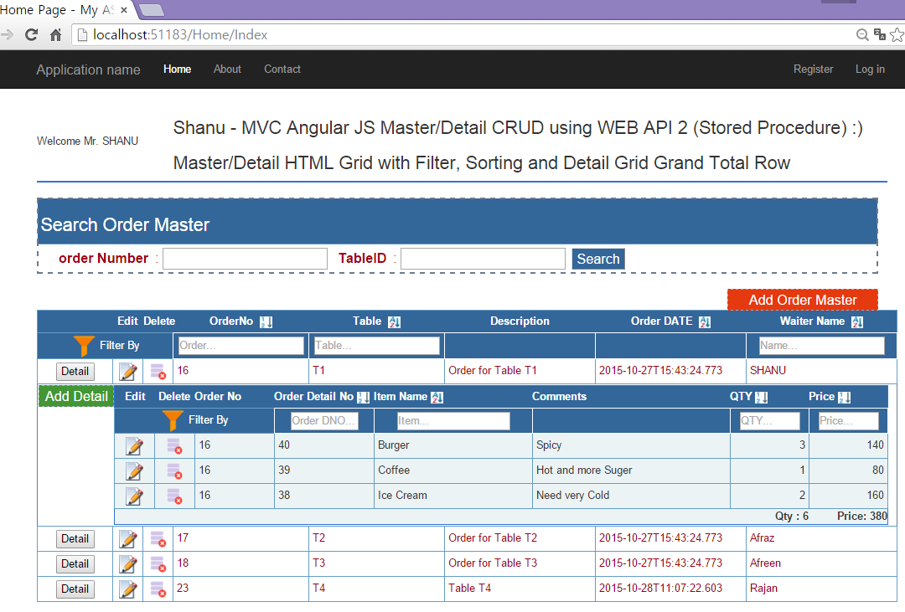
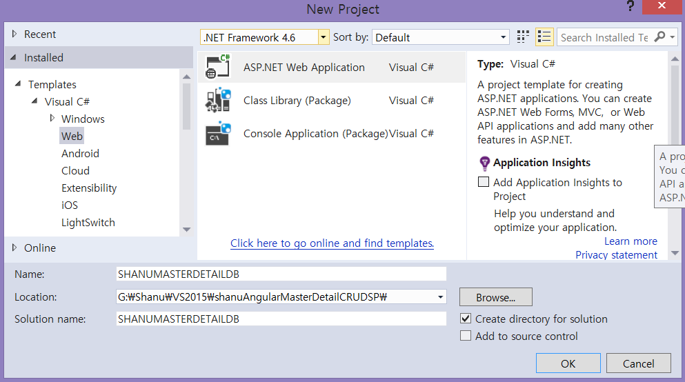
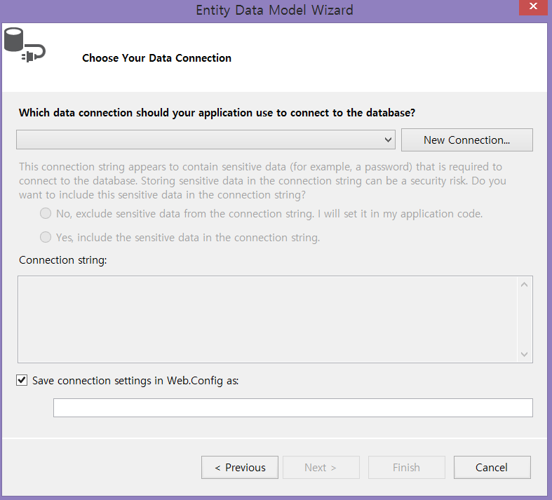
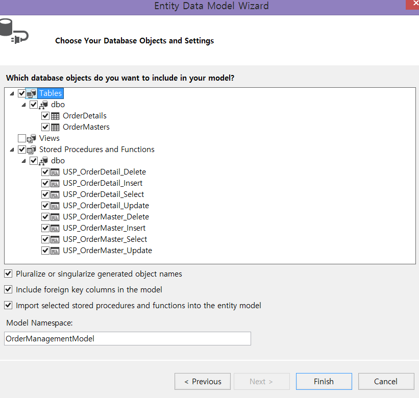
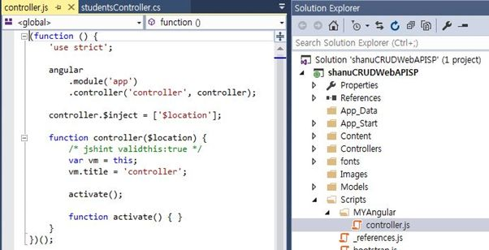
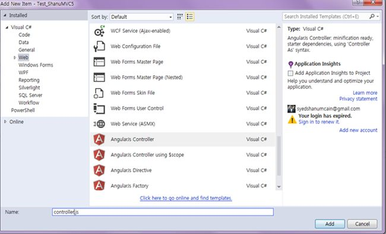
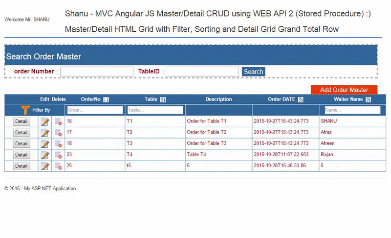
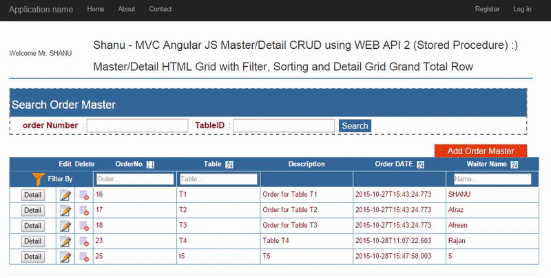
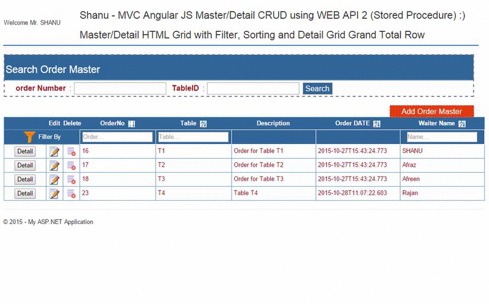
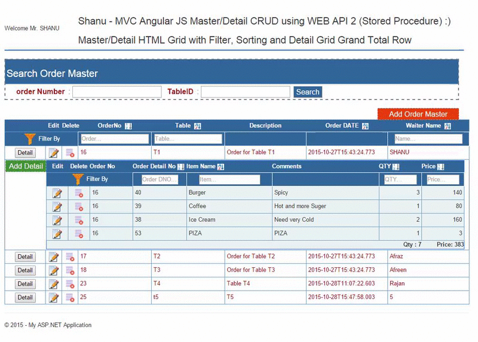

# MVC AngularJS Master/Detail CRUD, Filter And Sorting Using WEB API 2 With Stored
## Requires
- Visual Studio 2015
## License
- MIT
## Technologies
- ASP.NET MVC
- ASP.NET Web API
- AngularJS
## Topics
- ASP.NET MVC
- ASP.NET Web API
- AngularJS
## Updated
- 08/31/2016
## Description

<h1>Introduction</h1>

In one of my article I explained about&nbsp;<a href="http://www.codeproject.com/Articles/995737/MVC-Angular-JS-and-WCF-Rest-Service-for-Master-Det">how to create a Master/Detail HTML GRID</a>&nbsp;using MVC and AngularJS. Few members requested
 me to write an article for Master/Detail html grid with CRUD (Insert, Update, Select and Delete) for both Master and Detail grid. As a result here I have created a simple demo program with the following features.

This article will explain:

<ul>
<li>How to Create Order Master and Order Detail table with sample records inserted.
</li><li>Create Stored Procedure to perform Insert/Update/Select and Delete both Order Master and Order Detail table.
</li><li>Create Entity Framework and add all the Stored Procedures. </li><li>Create a separate WEB API for both Order Master and Order Detail to execute all our Stored Procedures from AngularJS Controller.
</li><li>Create AngularJS Controller to perform all business logic part to display our Master/Detail HTML grid.
</li><li>Add Sorting /Filtering features for both Master and Detail HTML grid.
</li><li>Display Total Row for each Child Detail Grid. </li><li>Add/Edit/ and Delete each Order Master and Order Detail from grid.
</li><li>Search Order Master Details.&nbsp; </li></ul>
<h1>Building the Sample</h1>

<strong>Prerequisites</strong>

<strong>Visual Studio 2015</strong>&nbsp;- You can download it from&nbsp;<a href="https://www.visualstudio.com/en-us/downloads/visual-studio-2015-downloads-vs.aspx">here</a>.

You can also view my previous articles related to AngularJs using MVC and the WCF Rest Serice.

<ul>
<li><em><a href="https://code.msdn.microsoft.com/Dynamic-scheduling-using-35328360" target="_blank">https://code.msdn.microsoft.com/Dynamic-scheduling-using-35328360</a></em>
</li><li><a href="https://code.msdn.microsoft.com/MVC-Angular-JS-CRUD-using-b4845edc" target="_blank">https://code.msdn.microsoft.com/MVC-Angular-JS-CRUD-using-b4845edc</a>
</li><li><a href="https://code.msdn.microsoft.com/AngularJS-Shopping-Cart-8d4dde90" target="_blank">https://code.msdn.microsoft.com/AngularJS-Shopping-Cart-8d4dde90</a>
</li><li><a href="https://code.msdn.microsoft.com/MVC-AngularJS-and-WCF-Rest-27d239b4" target="_blank">https://code.msdn.microsoft.com/MVC-AngularJS-and-WCF-Rest-27d239b4</a>
</li><li><a href="https://code.msdn.microsoft.com/MVC-Web-API-and-Angular-JS-36302919" target="_blank">https://code.msdn.microsoft.com/MVC-Web-API-and-Angular-JS-36302919</a>
</li><li><a href="https://code.msdn.microsoft.com/AngularJS-Filter-Sorting-1fe023c3" target="_blank">https://code.msdn.microsoft.com/MVC-Web-API-and-Angular-JS-36302919</a>
</li><li><a href="https://code.msdn.microsoft.com/Image-Preview-using-MVC-792d881c" target="_blank">https://code.msdn.microsoft.com/Image-Preview-using-MVC-792d881c</a>
</li></ul>

 

Description

<strong>1. Create Database and Table</strong>

We will create an Order Master and Order Detail table to be used for the Master and Detail Grid data binding.&nbsp;The following is the script to create a database, table and sample insert query.&nbsp;Run this script in your
 SQL Server. I have used SQL Server 2014.&nbsp;

SQL

Edit|Remove

mysql
<pre class="hidden">use master
--create DataBase
-- 1) Check for the Database Exists .If the database is exist then drop and create new DB
IF EXISTS (SELECT [name] FROM sys.databases WHERE [name] = 'OrderManagement' )
DROP DATABASE OrderManagement
GO

CREATE DATABASE OrderManagement
GO

USE OrderManagement
GO

-- Create OrderMasters Table

CREATE TABLE [dbo].[OrderMasters](
[Order_No] INT IDENTITY PRIMARY KEY,
[Table_ID] [varchar](20) NOT NULL,
[Description] [varchar](200) NOT NULL,
[Order_DATE] [datetime] NOT NULL,
[Waiter_Name] [varchar](20) NOT NULL
)

-- Insert OrderMasters sample data

INSERT INTO [OrderMasters]
          ([Table_ID] ,[Description],[Order_DATE],[Waiter_Name])
    VALUES
          ('T1','Order for Table T1',GETDATE(),'SHANU' )   

INSERT INTO [OrderMasters]
          ([Table_ID] ,[Description],[Order_DATE],[Waiter_Name])
    VALUES
           ('T2','Order for Table T2',GETDATE(),'Afraz' )        

INSERT INTO [OrderMasters]
          ([Table_ID] ,[Description],[Order_DATE],[Waiter_Name])
     VALUES
             ('T3','Order for Table T3',GETDATE(),'Afreen')       
         

CREATE TABLE [dbo].[OrderDetails](
  [Order_Detail_No] INT IDENTITY PRIMARY KEY,
 [Order_No] INT,
 [Item_Name] [varchar](20) NOT NULL, 
 [Notes] [varchar](200) NOT NULL,
[QTY]  INT NOT NULL,
 [Price] INT NOT NULL
 )

--Now let&amp;rsquo;s insert the 3 items for the above Order No 'Ord_001'.

INSERT INTO [OrderDetails]
          ( [Order_No],[Item_Name],[Notes],[QTY] ,[Price])
   VALUES
          (1,'Ice Cream','Need very Cold',2 ,160)

INSERT INTO [OrderDetails]
          ([Order_No],[Item_Name],[Notes],[QTY] ,[Price])
   VALUES
          (1,'Coffee','Hot and more Suger',1 ,80)
        
          INSERT INTO [OrderDetails]
          ([Order_No],[Item_Name],[Notes],[QTY] ,[Price])
   VALUES
          (1,'Burger','Spicy',3 ,140)
        
          INSERT INTO [OrderDetails]
          ([Order_No],[Item_Name],[Notes],[QTY] ,[Price])
   VALUES
          (2,'Pizza','More Chees and Large',1 ,350)        

          INSERT INTO [OrderDetails]
          ([Order_No],[Item_Name],[Notes],[QTY] ,[Price])
   VALUES
          (2,'Cola','Need very Cold',3 ,50)
        
          INSERT INTO [OrderDetails]
          ([Order_No],[Item_Name],[Notes],[QTY] ,[Price])
   VALUES
          (3,'IDLY','Hot',3 ,40)

          INSERT INTO [OrderDetails]
          ([Order_No],[Item_Name],[Notes],[QTY] ,[Price])
   VALUES
          (3,'Thosa','Hot',3 ,50)

-- To Select and test Order Master and Details

Select * FROM OrderMasters
Select * From OrderDetails</pre>

<pre class="mysql">use&nbsp;master&nbsp;
--create&nbsp;DataBase&nbsp;
--&nbsp;1)&nbsp;Check&nbsp;for&nbsp;the&nbsp;Database&nbsp;Exists&nbsp;.If&nbsp;the&nbsp;database&nbsp;is&nbsp;exist&nbsp;then&nbsp;drop&nbsp;and&nbsp;create&nbsp;new&nbsp;DB&nbsp;
IF&nbsp;EXISTS&nbsp;(SELECT&nbsp;[name]&nbsp;FROM&nbsp;sys.databases&nbsp;WHERE&nbsp;[name]&nbsp;=&nbsp;'OrderManagement'&nbsp;)&nbsp;
DROP&nbsp;DATABASE&nbsp;OrderManagement&nbsp;
GO&nbsp;
&nbsp;
CREATE&nbsp;DATABASE&nbsp;OrderManagement&nbsp;
GO&nbsp;
&nbsp;
USE&nbsp;OrderManagement&nbsp;
GO&nbsp;
&nbsp;
--&nbsp;Create&nbsp;OrderMasters&nbsp;Table&nbsp;
&nbsp;
CREATE&nbsp;TABLE&nbsp;[dbo].[OrderMasters](&nbsp;
[Order_No]&nbsp;INT&nbsp;IDENTITY&nbsp;PRIMARY&nbsp;KEY,&nbsp;
[Table_ID]&nbsp;[varchar](20)&nbsp;NOT&nbsp;NULL,&nbsp;
[Description]&nbsp;[varchar](200)&nbsp;NOT&nbsp;NULL,&nbsp;
[Order_DATE]&nbsp;[datetime]&nbsp;NOT&nbsp;NULL,&nbsp;
[Waiter_Name]&nbsp;[varchar](20)&nbsp;NOT&nbsp;NULL&nbsp;
)&nbsp;
&nbsp;
--&nbsp;Insert&nbsp;OrderMasters&nbsp;sample&nbsp;data&nbsp;
&nbsp;
INSERT&nbsp;INTO&nbsp;[OrderMasters]&nbsp;
&nbsp;&nbsp;&nbsp;&nbsp;&nbsp;&nbsp;&nbsp;&nbsp;&nbsp;&nbsp;([Table_ID]&nbsp;,[Description],[Order_DATE],[Waiter_Name])&nbsp;
&nbsp;&nbsp;&nbsp;&nbsp;VALUES&nbsp;
&nbsp;&nbsp;&nbsp;&nbsp;&nbsp;&nbsp;&nbsp;&nbsp;&nbsp;&nbsp;('T1','Order&nbsp;for&nbsp;Table&nbsp;T1',GETDATE(),'SHANU'&nbsp;)&nbsp;&nbsp;&nbsp;&nbsp;
&nbsp;
INSERT&nbsp;INTO&nbsp;[OrderMasters]&nbsp;
&nbsp;&nbsp;&nbsp;&nbsp;&nbsp;&nbsp;&nbsp;&nbsp;&nbsp;&nbsp;([Table_ID]&nbsp;,[Description],[Order_DATE],[Waiter_Name])&nbsp;
&nbsp;&nbsp;&nbsp;&nbsp;VALUES&nbsp;
&nbsp;&nbsp;&nbsp;&nbsp;&nbsp;&nbsp;&nbsp;&nbsp;&nbsp;&nbsp;&nbsp;('T2','Order&nbsp;for&nbsp;Table&nbsp;T2',GETDATE(),'Afraz'&nbsp;)&nbsp;&nbsp;&nbsp;&nbsp;&nbsp;&nbsp;&nbsp;&nbsp;&nbsp;
&nbsp;
INSERT&nbsp;INTO&nbsp;[OrderMasters]&nbsp;
&nbsp;&nbsp;&nbsp;&nbsp;&nbsp;&nbsp;&nbsp;&nbsp;&nbsp;&nbsp;([Table_ID]&nbsp;,[Description],[Order_DATE],[Waiter_Name])&nbsp;
&nbsp;&nbsp;&nbsp;&nbsp;&nbsp;VALUES&nbsp;
&nbsp;&nbsp;&nbsp;&nbsp;&nbsp;&nbsp;&nbsp;&nbsp;&nbsp;&nbsp;&nbsp;&nbsp;&nbsp;('T3','Order&nbsp;for&nbsp;Table&nbsp;T3',GETDATE(),'Afreen')&nbsp;&nbsp;&nbsp;&nbsp;&nbsp;&nbsp;&nbsp;&nbsp;
&nbsp;&nbsp;&nbsp;&nbsp;&nbsp;&nbsp;&nbsp;&nbsp;&nbsp;&nbsp;
&nbsp;
CREATE&nbsp;TABLE&nbsp;[dbo].[OrderDetails](&nbsp;
&nbsp;&nbsp;[Order_Detail_No]&nbsp;INT&nbsp;IDENTITY&nbsp;PRIMARY&nbsp;KEY,&nbsp;
&nbsp;[Order_No]&nbsp;INT,&nbsp;
&nbsp;[Item_Name]&nbsp;[varchar](20)&nbsp;NOT&nbsp;NULL,&nbsp;&nbsp;
&nbsp;[Notes]&nbsp;[varchar](200)&nbsp;NOT&nbsp;NULL,&nbsp;
[QTY]&nbsp;&nbsp;INT&nbsp;NOT&nbsp;NULL,&nbsp;
&nbsp;[Price]&nbsp;INT&nbsp;NOT&nbsp;NULL&nbsp;
&nbsp;)&nbsp;
&nbsp;
--Now&nbsp;let&amp;rsquo;s&nbsp;insert&nbsp;the&nbsp;3&nbsp;items&nbsp;for&nbsp;the&nbsp;above&nbsp;Order&nbsp;No&nbsp;'Ord_001'.&nbsp;
&nbsp;
INSERT&nbsp;INTO&nbsp;[OrderDetails]&nbsp;
&nbsp;&nbsp;&nbsp;&nbsp;&nbsp;&nbsp;&nbsp;&nbsp;&nbsp;&nbsp;(&nbsp;[Order_No],[Item_Name],[Notes],[QTY]&nbsp;,[Price])&nbsp;
&nbsp;&nbsp;&nbsp;VALUES&nbsp;
&nbsp;&nbsp;&nbsp;&nbsp;&nbsp;&nbsp;&nbsp;&nbsp;&nbsp;&nbsp;(1,'Ice&nbsp;Cream','Need&nbsp;very&nbsp;Cold',2&nbsp;,160)&nbsp;
&nbsp;
INSERT&nbsp;INTO&nbsp;[OrderDetails]&nbsp;
&nbsp;&nbsp;&nbsp;&nbsp;&nbsp;&nbsp;&nbsp;&nbsp;&nbsp;&nbsp;([Order_No],[Item_Name],[Notes],[QTY]&nbsp;,[Price])&nbsp;
&nbsp;&nbsp;&nbsp;VALUES&nbsp;
&nbsp;&nbsp;&nbsp;&nbsp;&nbsp;&nbsp;&nbsp;&nbsp;&nbsp;&nbsp;(1,'Coffee','Hot&nbsp;and&nbsp;more&nbsp;Suger',1&nbsp;,80)&nbsp;
&nbsp;&nbsp;&nbsp;&nbsp;&nbsp;&nbsp;&nbsp;&nbsp;&nbsp;
&nbsp;&nbsp;&nbsp;&nbsp;&nbsp;&nbsp;&nbsp;&nbsp;&nbsp;&nbsp;INSERT&nbsp;INTO&nbsp;[OrderDetails]&nbsp;
&nbsp;&nbsp;&nbsp;&nbsp;&nbsp;&nbsp;&nbsp;&nbsp;&nbsp;&nbsp;([Order_No],[Item_Name],[Notes],[QTY]&nbsp;,[Price])&nbsp;
&nbsp;&nbsp;&nbsp;VALUES&nbsp;
&nbsp;&nbsp;&nbsp;&nbsp;&nbsp;&nbsp;&nbsp;&nbsp;&nbsp;&nbsp;(1,'Burger','Spicy',3&nbsp;,140)&nbsp;
&nbsp;&nbsp;&nbsp;&nbsp;&nbsp;&nbsp;&nbsp;&nbsp;&nbsp;
&nbsp;&nbsp;&nbsp;&nbsp;&nbsp;&nbsp;&nbsp;&nbsp;&nbsp;&nbsp;INSERT&nbsp;INTO&nbsp;[OrderDetails]&nbsp;
&nbsp;&nbsp;&nbsp;&nbsp;&nbsp;&nbsp;&nbsp;&nbsp;&nbsp;&nbsp;([Order_No],[Item_Name],[Notes],[QTY]&nbsp;,[Price])&nbsp;
&nbsp;&nbsp;&nbsp;VALUES&nbsp;
&nbsp;&nbsp;&nbsp;&nbsp;&nbsp;&nbsp;&nbsp;&nbsp;&nbsp;&nbsp;(2,'Pizza','More&nbsp;Chees&nbsp;and&nbsp;Large',1&nbsp;,350)&nbsp;&nbsp;&nbsp;&nbsp;&nbsp;&nbsp;&nbsp;&nbsp;&nbsp;
&nbsp;
&nbsp;&nbsp;&nbsp;&nbsp;&nbsp;&nbsp;&nbsp;&nbsp;&nbsp;&nbsp;INSERT&nbsp;INTO&nbsp;[OrderDetails]&nbsp;
&nbsp;&nbsp;&nbsp;&nbsp;&nbsp;&nbsp;&nbsp;&nbsp;&nbsp;&nbsp;([Order_No],[Item_Name],[Notes],[QTY]&nbsp;,[Price])&nbsp;
&nbsp;&nbsp;&nbsp;VALUES&nbsp;
&nbsp;&nbsp;&nbsp;&nbsp;&nbsp;&nbsp;&nbsp;&nbsp;&nbsp;&nbsp;(2,'Cola','Need&nbsp;very&nbsp;Cold',3&nbsp;,50)&nbsp;
&nbsp;&nbsp;&nbsp;&nbsp;&nbsp;&nbsp;&nbsp;&nbsp;&nbsp;
&nbsp;&nbsp;&nbsp;&nbsp;&nbsp;&nbsp;&nbsp;&nbsp;&nbsp;&nbsp;INSERT&nbsp;INTO&nbsp;[OrderDetails]&nbsp;
&nbsp;&nbsp;&nbsp;&nbsp;&nbsp;&nbsp;&nbsp;&nbsp;&nbsp;&nbsp;([Order_No],[Item_Name],[Notes],[QTY]&nbsp;,[Price])&nbsp;
&nbsp;&nbsp;&nbsp;VALUES&nbsp;
&nbsp;&nbsp;&nbsp;&nbsp;&nbsp;&nbsp;&nbsp;&nbsp;&nbsp;&nbsp;(3,'IDLY','Hot',3&nbsp;,40)&nbsp;
&nbsp;
&nbsp;&nbsp;&nbsp;&nbsp;&nbsp;&nbsp;&nbsp;&nbsp;&nbsp;&nbsp;INSERT&nbsp;INTO&nbsp;[OrderDetails]&nbsp;
&nbsp;&nbsp;&nbsp;&nbsp;&nbsp;&nbsp;&nbsp;&nbsp;&nbsp;&nbsp;([Order_No],[Item_Name],[Notes],[QTY]&nbsp;,[Price])&nbsp;
&nbsp;&nbsp;&nbsp;VALUES&nbsp;
&nbsp;&nbsp;&nbsp;&nbsp;&nbsp;&nbsp;&nbsp;&nbsp;&nbsp;&nbsp;(3,'Thosa','Hot',3&nbsp;,50)&nbsp;
&nbsp;
--&nbsp;To&nbsp;Select&nbsp;and&nbsp;test&nbsp;Order&nbsp;Master&nbsp;and&nbsp;Details&nbsp;
&nbsp;
Select&nbsp;*&nbsp;FROM&nbsp;OrderMasters&nbsp;
Select&nbsp;*&nbsp;From&nbsp;OrderDetails</pre>

&nbsp;After creating our Table we will create a Stored Procedure to do our CRUD Operations.

First we create stored procedure for Order Master Table to perform CRUD.

&nbsp;

SQL

Edit|Remove

mysql
<pre class="hidden">-- 1) Stored procedure to Select OrderMaster
-- Author      : Shanu                                                             
-- Create date : 2015-10-26                                                              
-- Description : Order Master                                              
-- Tables used :  OrderMaster                                                              
-- Modifier    : Shanu                                                               
-- Modify date : 2015-10-26                                                               
-- =============================================  
-- exec USP_OrderMaster_Select '',''
-- =============================================                                                          
Create PROCEDURE [dbo].[USP_OrderMaster_Select]                                            
   (                          
     @OrderNo           VARCHAR(100)     = '',
     @Table_ID               VARCHAR(100)     = ''  
      )                                                      
AS                                                              
BEGIN      
         Select [Order_No],
                [Table_ID],
                [Description],
                [Order_DATE],
                [Waiter_Name]
            FROM
                OrderMasters
            WHERE
                Order_No like  @OrderNo &#43;'%'
                AND Table_ID like @Table_ID &#43;'%'
            ORDER BY
                Table_ID  
END

-- 2) Stored procedure to insert OrderMaster
-- Author      : Shanu                                                              
-- Create date : 2015-10-26                                                             
-- Description : Order Master                                             
-- Tables used :  OrderMaster                                                              
-- Modifier    : Shanu                                                               
-- Modify date : 2015-10-26                                                                 
-- =============================================   
-- exec USP_OrderMaster_Insert 'T4','Table 4','SHANU'
-- =============================================                                                          
Create PROCEDURE [dbo].[USP_OrderMaster_Insert]                                             
   (                      
     @Table_ID           VARCHAR(100)     = '',
     @Description               VARCHAR(100)     = '',
     @Waiter_Name               VARCHAR(20)     = ''
      )                                                       
AS                                                               
BEGIN       
        IF NOT EXISTS (SELECT Table_ID FROM OrderMasters WHERE Table_ID=@Table_ID)
            BEGIN
                  INSERT INTO [OrderMasters]
          ([Table_ID] ,[Description],[Order_DATE],[Waiter_Name])
    VALUES
          (@Table_ID,@Description,GETDATE(),@Waiter_Name )                           

                  Select 'Inserted' as results                     
         END
         ELSE
             BEGIN
                     Select 'Exists' as results
              END
END

-- 3) Stored procedure to Update OrderMaster
   
-- Author      : Shanu                                                               
-- Create date : 2015-10-26                                                              
-- Description : Order Master                                             
-- Tables used :  OrderMaster                                                              
-- Modifier    : Shanu                                                               
-- Modify date : 2015-10-26                                                               
-- =============================================     
-- exec USP_OrderMaster_Update 4,'T4','Table 4 wer','SHANU'
-- =============================================                                                          
CREATE PROCEDURE [dbo].[USP_OrderMaster_Update]                                             
   (  @OrderNo               Int=0,                          
      @Table_ID           VARCHAR(100)     = '',
      @Description               VARCHAR(100)     = '',
      @Waiter_Name               VARCHAR(20)     = ''
      )                                                       
AS                                                               
BEGIN      
        IF NOT EXISTS (SELECT Table_ID FROM OrderMasters WHERE Order_No!=@OrderNo AND Table_ID=@Table_ID)
            BEGIN
                    UPDATE OrderMasters
                    SET    [Table_ID]=@Table_ID ,
                                                                  [Description]=@Description,
                                                                   [Order_DATE]=GETDATE(),
                                                                   [Waiter_Name]=@Waiter_Name

                    WHERE
                        Order_No=@OrderNo                             
                    Select 'updated' as results                       
            END
         ELSE
             BEGIN
                     Select 'Exists' as results
              END
END

-- 4) Stored procedure to Delete OrderMaster 

-- Author      : Shanu                                                               
-- Create date : 2015-10-26                                                              
-- Description : Order Master                                             
-- Tables used :  OrderMaster                                                               
-- Modifier    : Shanu                                                               
-- Modify date : 2015-10-26                                                                
-- ============================================= 
-- exec USP_OrderMaster_Delete '3'
-- =============================================                                                          
CREATE PROCEDURE [dbo].[USP_OrderMaster_Delete]                                             

   (  @OrderNo               Int=0 )                                                        
AS                                                               
BEGIN       
        DELETE FROM OrderMasters WHERE           Order_No=@OrderNo            
                           DELETE from OrderDetails WHERE  Order_No=@OrderNo    

                            Select 'Deleted' as results

END</pre>

<pre class="mysql">--&nbsp;1)&nbsp;Stored&nbsp;procedure&nbsp;to&nbsp;Select&nbsp;OrderMaster&nbsp;
--&nbsp;Author&nbsp;&nbsp;&nbsp;&nbsp;&nbsp;&nbsp;:&nbsp;Shanu&nbsp;&nbsp;&nbsp;&nbsp;&nbsp;&nbsp;&nbsp;&nbsp;&nbsp;&nbsp;&nbsp;&nbsp;&nbsp;&nbsp;&nbsp;&nbsp;&nbsp;&nbsp;&nbsp;&nbsp;&nbsp;&nbsp;&nbsp;&nbsp;&nbsp;&nbsp;&nbsp;&nbsp;&nbsp;&nbsp;&nbsp;&nbsp;&nbsp;&nbsp;&nbsp;&nbsp;&nbsp;&nbsp;&nbsp;&nbsp;&nbsp;&nbsp;&nbsp;&nbsp;&nbsp;&nbsp;&nbsp;&nbsp;&nbsp;&nbsp;&nbsp;&nbsp;&nbsp;&nbsp;&nbsp;&nbsp;&nbsp;&nbsp;&nbsp;&nbsp;&nbsp;&nbsp;
--&nbsp;Create&nbsp;date&nbsp;:&nbsp;2015-10-26&nbsp;&nbsp;&nbsp;&nbsp;&nbsp;&nbsp;&nbsp;&nbsp;&nbsp;&nbsp;&nbsp;&nbsp;&nbsp;&nbsp;&nbsp;&nbsp;&nbsp;&nbsp;&nbsp;&nbsp;&nbsp;&nbsp;&nbsp;&nbsp;&nbsp;&nbsp;&nbsp;&nbsp;&nbsp;&nbsp;&nbsp;&nbsp;&nbsp;&nbsp;&nbsp;&nbsp;&nbsp;&nbsp;&nbsp;&nbsp;&nbsp;&nbsp;&nbsp;&nbsp;&nbsp;&nbsp;&nbsp;&nbsp;&nbsp;&nbsp;&nbsp;&nbsp;&nbsp;&nbsp;&nbsp;&nbsp;&nbsp;&nbsp;&nbsp;&nbsp;&nbsp;&nbsp;&nbsp;
--&nbsp;Description&nbsp;:&nbsp;Order&nbsp;Master&nbsp;&nbsp;&nbsp;&nbsp;&nbsp;&nbsp;&nbsp;&nbsp;&nbsp;&nbsp;&nbsp;&nbsp;&nbsp;&nbsp;&nbsp;&nbsp;&nbsp;&nbsp;&nbsp;&nbsp;&nbsp;&nbsp;&nbsp;&nbsp;&nbsp;&nbsp;&nbsp;&nbsp;&nbsp;&nbsp;&nbsp;&nbsp;&nbsp;&nbsp;&nbsp;&nbsp;&nbsp;&nbsp;&nbsp;&nbsp;&nbsp;&nbsp;&nbsp;&nbsp;&nbsp;&nbsp;&nbsp;
--&nbsp;Tables&nbsp;used&nbsp;:&nbsp;&nbsp;OrderMaster&nbsp;&nbsp;&nbsp;&nbsp;&nbsp;&nbsp;&nbsp;&nbsp;&nbsp;&nbsp;&nbsp;&nbsp;&nbsp;&nbsp;&nbsp;&nbsp;&nbsp;&nbsp;&nbsp;&nbsp;&nbsp;&nbsp;&nbsp;&nbsp;&nbsp;&nbsp;&nbsp;&nbsp;&nbsp;&nbsp;&nbsp;&nbsp;&nbsp;&nbsp;&nbsp;&nbsp;&nbsp;&nbsp;&nbsp;&nbsp;&nbsp;&nbsp;&nbsp;&nbsp;&nbsp;&nbsp;&nbsp;&nbsp;&nbsp;&nbsp;&nbsp;&nbsp;&nbsp;&nbsp;&nbsp;&nbsp;&nbsp;&nbsp;&nbsp;&nbsp;&nbsp;&nbsp;&nbsp;
--&nbsp;Modifier&nbsp;&nbsp;&nbsp;&nbsp;:&nbsp;Shanu&nbsp;&nbsp;&nbsp;&nbsp;&nbsp;&nbsp;&nbsp;&nbsp;&nbsp;&nbsp;&nbsp;&nbsp;&nbsp;&nbsp;&nbsp;&nbsp;&nbsp;&nbsp;&nbsp;&nbsp;&nbsp;&nbsp;&nbsp;&nbsp;&nbsp;&nbsp;&nbsp;&nbsp;&nbsp;&nbsp;&nbsp;&nbsp;&nbsp;&nbsp;&nbsp;&nbsp;&nbsp;&nbsp;&nbsp;&nbsp;&nbsp;&nbsp;&nbsp;&nbsp;&nbsp;&nbsp;&nbsp;&nbsp;&nbsp;&nbsp;&nbsp;&nbsp;&nbsp;&nbsp;&nbsp;&nbsp;&nbsp;&nbsp;&nbsp;&nbsp;&nbsp;&nbsp;&nbsp;&nbsp;
--&nbsp;Modify&nbsp;date&nbsp;:&nbsp;2015-10-26&nbsp;&nbsp;&nbsp;&nbsp;&nbsp;&nbsp;&nbsp;&nbsp;&nbsp;&nbsp;&nbsp;&nbsp;&nbsp;&nbsp;&nbsp;&nbsp;&nbsp;&nbsp;&nbsp;&nbsp;&nbsp;&nbsp;&nbsp;&nbsp;&nbsp;&nbsp;&nbsp;&nbsp;&nbsp;&nbsp;&nbsp;&nbsp;&nbsp;&nbsp;&nbsp;&nbsp;&nbsp;&nbsp;&nbsp;&nbsp;&nbsp;&nbsp;&nbsp;&nbsp;&nbsp;&nbsp;&nbsp;&nbsp;&nbsp;&nbsp;&nbsp;&nbsp;&nbsp;&nbsp;&nbsp;&nbsp;&nbsp;&nbsp;&nbsp;&nbsp;&nbsp;&nbsp;&nbsp;&nbsp;
--&nbsp;=============================================&nbsp;&nbsp;&nbsp;
--&nbsp;exec&nbsp;USP_OrderMaster_Select&nbsp;'',''&nbsp;
--&nbsp;=============================================&nbsp;&nbsp;&nbsp;&nbsp;&nbsp;&nbsp;&nbsp;&nbsp;&nbsp;&nbsp;&nbsp;&nbsp;&nbsp;&nbsp;&nbsp;&nbsp;&nbsp;&nbsp;&nbsp;&nbsp;&nbsp;&nbsp;&nbsp;&nbsp;&nbsp;&nbsp;&nbsp;&nbsp;&nbsp;&nbsp;&nbsp;&nbsp;&nbsp;&nbsp;&nbsp;&nbsp;&nbsp;&nbsp;&nbsp;&nbsp;&nbsp;&nbsp;&nbsp;&nbsp;&nbsp;&nbsp;&nbsp;&nbsp;&nbsp;&nbsp;&nbsp;&nbsp;&nbsp;&nbsp;&nbsp;&nbsp;&nbsp;&nbsp;&nbsp;
Create&nbsp;PROCEDURE&nbsp;[dbo].[USP_OrderMaster_Select]&nbsp;&nbsp;&nbsp;&nbsp;&nbsp;&nbsp;&nbsp;&nbsp;&nbsp;&nbsp;&nbsp;&nbsp;&nbsp;&nbsp;&nbsp;&nbsp;&nbsp;&nbsp;&nbsp;&nbsp;&nbsp;&nbsp;&nbsp;&nbsp;&nbsp;&nbsp;&nbsp;&nbsp;&nbsp;&nbsp;&nbsp;&nbsp;&nbsp;&nbsp;&nbsp;&nbsp;&nbsp;&nbsp;&nbsp;&nbsp;&nbsp;&nbsp;&nbsp;&nbsp;&nbsp;
&nbsp;&nbsp;&nbsp;(&nbsp;&nbsp;&nbsp;&nbsp;&nbsp;&nbsp;&nbsp;&nbsp;&nbsp;&nbsp;&nbsp;&nbsp;&nbsp;&nbsp;&nbsp;&nbsp;&nbsp;&nbsp;&nbsp;&nbsp;&nbsp;&nbsp;&nbsp;&nbsp;&nbsp;&nbsp;&nbsp;
&nbsp;&nbsp;&nbsp;&nbsp;&nbsp;@OrderNo&nbsp;&nbsp;&nbsp;&nbsp;&nbsp;&nbsp;&nbsp;&nbsp;&nbsp;&nbsp;&nbsp;VARCHAR(100)&nbsp;&nbsp;&nbsp;&nbsp;&nbsp;=&nbsp;'',&nbsp;
&nbsp;&nbsp;&nbsp;&nbsp;&nbsp;@Table_ID&nbsp;&nbsp;&nbsp;&nbsp;&nbsp;&nbsp;&nbsp;&nbsp;&nbsp;&nbsp;&nbsp;&nbsp;&nbsp;&nbsp;&nbsp;VARCHAR(100)&nbsp;&nbsp;&nbsp;&nbsp;&nbsp;=&nbsp;''&nbsp;&nbsp;&nbsp;
&nbsp;&nbsp;&nbsp;&nbsp;&nbsp;&nbsp;)&nbsp;&nbsp;&nbsp;&nbsp;&nbsp;&nbsp;&nbsp;&nbsp;&nbsp;&nbsp;&nbsp;&nbsp;&nbsp;&nbsp;&nbsp;&nbsp;&nbsp;&nbsp;&nbsp;&nbsp;&nbsp;&nbsp;&nbsp;&nbsp;&nbsp;&nbsp;&nbsp;&nbsp;&nbsp;&nbsp;&nbsp;&nbsp;&nbsp;&nbsp;&nbsp;&nbsp;&nbsp;&nbsp;&nbsp;&nbsp;&nbsp;&nbsp;&nbsp;&nbsp;&nbsp;&nbsp;&nbsp;&nbsp;&nbsp;&nbsp;&nbsp;&nbsp;&nbsp;&nbsp;&nbsp;
AS&nbsp;&nbsp;&nbsp;&nbsp;&nbsp;&nbsp;&nbsp;&nbsp;&nbsp;&nbsp;&nbsp;&nbsp;&nbsp;&nbsp;&nbsp;&nbsp;&nbsp;&nbsp;&nbsp;&nbsp;&nbsp;&nbsp;&nbsp;&nbsp;&nbsp;&nbsp;&nbsp;&nbsp;&nbsp;&nbsp;&nbsp;&nbsp;&nbsp;&nbsp;&nbsp;&nbsp;&nbsp;&nbsp;&nbsp;&nbsp;&nbsp;&nbsp;&nbsp;&nbsp;&nbsp;&nbsp;&nbsp;&nbsp;&nbsp;&nbsp;&nbsp;&nbsp;&nbsp;&nbsp;&nbsp;&nbsp;&nbsp;&nbsp;&nbsp;&nbsp;&nbsp;&nbsp;&nbsp;
BEGIN&nbsp;&nbsp;&nbsp;&nbsp;&nbsp;&nbsp;&nbsp;
&nbsp;&nbsp;&nbsp;&nbsp;&nbsp;&nbsp;&nbsp;&nbsp;&nbsp;Select&nbsp;[Order_No],&nbsp;
&nbsp;&nbsp;&nbsp;&nbsp;&nbsp;&nbsp;&nbsp;&nbsp;&nbsp;&nbsp;&nbsp;&nbsp;&nbsp;&nbsp;&nbsp;&nbsp;[Table_ID],&nbsp;
&nbsp;&nbsp;&nbsp;&nbsp;&nbsp;&nbsp;&nbsp;&nbsp;&nbsp;&nbsp;&nbsp;&nbsp;&nbsp;&nbsp;&nbsp;&nbsp;[Description],&nbsp;
&nbsp;&nbsp;&nbsp;&nbsp;&nbsp;&nbsp;&nbsp;&nbsp;&nbsp;&nbsp;&nbsp;&nbsp;&nbsp;&nbsp;&nbsp;&nbsp;[Order_DATE],&nbsp;
&nbsp;&nbsp;&nbsp;&nbsp;&nbsp;&nbsp;&nbsp;&nbsp;&nbsp;&nbsp;&nbsp;&nbsp;&nbsp;&nbsp;&nbsp;&nbsp;[Waiter_Name]&nbsp;
&nbsp;&nbsp;&nbsp;&nbsp;&nbsp;&nbsp;&nbsp;&nbsp;&nbsp;&nbsp;&nbsp;&nbsp;FROM&nbsp;
&nbsp;&nbsp;&nbsp;&nbsp;&nbsp;&nbsp;&nbsp;&nbsp;&nbsp;&nbsp;&nbsp;&nbsp;&nbsp;&nbsp;&nbsp;&nbsp;OrderMasters&nbsp;
&nbsp;&nbsp;&nbsp;&nbsp;&nbsp;&nbsp;&nbsp;&nbsp;&nbsp;&nbsp;&nbsp;&nbsp;WHERE&nbsp;
&nbsp;&nbsp;&nbsp;&nbsp;&nbsp;&nbsp;&nbsp;&nbsp;&nbsp;&nbsp;&nbsp;&nbsp;&nbsp;&nbsp;&nbsp;&nbsp;Order_No&nbsp;like&nbsp;&nbsp;@OrderNo&nbsp;&#43;'%'&nbsp;
&nbsp;&nbsp;&nbsp;&nbsp;&nbsp;&nbsp;&nbsp;&nbsp;&nbsp;&nbsp;&nbsp;&nbsp;&nbsp;&nbsp;&nbsp;&nbsp;AND&nbsp;Table_ID&nbsp;like&nbsp;@Table_ID&nbsp;&#43;'%'&nbsp;
&nbsp;&nbsp;&nbsp;&nbsp;&nbsp;&nbsp;&nbsp;&nbsp;&nbsp;&nbsp;&nbsp;&nbsp;ORDER&nbsp;BY&nbsp;
&nbsp;&nbsp;&nbsp;&nbsp;&nbsp;&nbsp;&nbsp;&nbsp;&nbsp;&nbsp;&nbsp;&nbsp;&nbsp;&nbsp;&nbsp;&nbsp;Table_ID&nbsp;&nbsp;&nbsp;
END&nbsp;
&nbsp;
--&nbsp;2)&nbsp;Stored&nbsp;procedure&nbsp;to&nbsp;insert&nbsp;OrderMaster&nbsp;
--&nbsp;Author&nbsp;&nbsp;&nbsp;&nbsp;&nbsp;&nbsp;:&nbsp;Shanu&nbsp;&nbsp;&nbsp;&nbsp;&nbsp;&nbsp;&nbsp;&nbsp;&nbsp;&nbsp;&nbsp;&nbsp;&nbsp;&nbsp;&nbsp;&nbsp;&nbsp;&nbsp;&nbsp;&nbsp;&nbsp;&nbsp;&nbsp;&nbsp;&nbsp;&nbsp;&nbsp;&nbsp;&nbsp;&nbsp;&nbsp;&nbsp;&nbsp;&nbsp;&nbsp;&nbsp;&nbsp;&nbsp;&nbsp;&nbsp;&nbsp;&nbsp;&nbsp;&nbsp;&nbsp;&nbsp;&nbsp;&nbsp;&nbsp;&nbsp;&nbsp;&nbsp;&nbsp;&nbsp;&nbsp;&nbsp;&nbsp;&nbsp;&nbsp;&nbsp;&nbsp;&nbsp;&nbsp;
--&nbsp;Create&nbsp;date&nbsp;:&nbsp;2015-10-26&nbsp;&nbsp;&nbsp;&nbsp;&nbsp;&nbsp;&nbsp;&nbsp;&nbsp;&nbsp;&nbsp;&nbsp;&nbsp;&nbsp;&nbsp;&nbsp;&nbsp;&nbsp;&nbsp;&nbsp;&nbsp;&nbsp;&nbsp;&nbsp;&nbsp;&nbsp;&nbsp;&nbsp;&nbsp;&nbsp;&nbsp;&nbsp;&nbsp;&nbsp;&nbsp;&nbsp;&nbsp;&nbsp;&nbsp;&nbsp;&nbsp;&nbsp;&nbsp;&nbsp;&nbsp;&nbsp;&nbsp;&nbsp;&nbsp;&nbsp;&nbsp;&nbsp;&nbsp;&nbsp;&nbsp;&nbsp;&nbsp;&nbsp;&nbsp;&nbsp;&nbsp;&nbsp;
--&nbsp;Description&nbsp;:&nbsp;Order&nbsp;Master&nbsp;&nbsp;&nbsp;&nbsp;&nbsp;&nbsp;&nbsp;&nbsp;&nbsp;&nbsp;&nbsp;&nbsp;&nbsp;&nbsp;&nbsp;&nbsp;&nbsp;&nbsp;&nbsp;&nbsp;&nbsp;&nbsp;&nbsp;&nbsp;&nbsp;&nbsp;&nbsp;&nbsp;&nbsp;&nbsp;&nbsp;&nbsp;&nbsp;&nbsp;&nbsp;&nbsp;&nbsp;&nbsp;&nbsp;&nbsp;&nbsp;&nbsp;&nbsp;&nbsp;&nbsp;&nbsp;
--&nbsp;Tables&nbsp;used&nbsp;:&nbsp;&nbsp;OrderMaster&nbsp;&nbsp;&nbsp;&nbsp;&nbsp;&nbsp;&nbsp;&nbsp;&nbsp;&nbsp;&nbsp;&nbsp;&nbsp;&nbsp;&nbsp;&nbsp;&nbsp;&nbsp;&nbsp;&nbsp;&nbsp;&nbsp;&nbsp;&nbsp;&nbsp;&nbsp;&nbsp;&nbsp;&nbsp;&nbsp;&nbsp;&nbsp;&nbsp;&nbsp;&nbsp;&nbsp;&nbsp;&nbsp;&nbsp;&nbsp;&nbsp;&nbsp;&nbsp;&nbsp;&nbsp;&nbsp;&nbsp;&nbsp;&nbsp;&nbsp;&nbsp;&nbsp;&nbsp;&nbsp;&nbsp;&nbsp;&nbsp;&nbsp;&nbsp;&nbsp;&nbsp;&nbsp;&nbsp;
--&nbsp;Modifier&nbsp;&nbsp;&nbsp;&nbsp;:&nbsp;Shanu&nbsp;&nbsp;&nbsp;&nbsp;&nbsp;&nbsp;&nbsp;&nbsp;&nbsp;&nbsp;&nbsp;&nbsp;&nbsp;&nbsp;&nbsp;&nbsp;&nbsp;&nbsp;&nbsp;&nbsp;&nbsp;&nbsp;&nbsp;&nbsp;&nbsp;&nbsp;&nbsp;&nbsp;&nbsp;&nbsp;&nbsp;&nbsp;&nbsp;&nbsp;&nbsp;&nbsp;&nbsp;&nbsp;&nbsp;&nbsp;&nbsp;&nbsp;&nbsp;&nbsp;&nbsp;&nbsp;&nbsp;&nbsp;&nbsp;&nbsp;&nbsp;&nbsp;&nbsp;&nbsp;&nbsp;&nbsp;&nbsp;&nbsp;&nbsp;&nbsp;&nbsp;&nbsp;&nbsp;&nbsp;
--&nbsp;Modify&nbsp;date&nbsp;:&nbsp;2015-10-26&nbsp;&nbsp;&nbsp;&nbsp;&nbsp;&nbsp;&nbsp;&nbsp;&nbsp;&nbsp;&nbsp;&nbsp;&nbsp;&nbsp;&nbsp;&nbsp;&nbsp;&nbsp;&nbsp;&nbsp;&nbsp;&nbsp;&nbsp;&nbsp;&nbsp;&nbsp;&nbsp;&nbsp;&nbsp;&nbsp;&nbsp;&nbsp;&nbsp;&nbsp;&nbsp;&nbsp;&nbsp;&nbsp;&nbsp;&nbsp;&nbsp;&nbsp;&nbsp;&nbsp;&nbsp;&nbsp;&nbsp;&nbsp;&nbsp;&nbsp;&nbsp;&nbsp;&nbsp;&nbsp;&nbsp;&nbsp;&nbsp;&nbsp;&nbsp;&nbsp;&nbsp;&nbsp;&nbsp;&nbsp;&nbsp;&nbsp;
--&nbsp;=============================================&nbsp;&nbsp;&nbsp;&nbsp;
--&nbsp;exec&nbsp;USP_OrderMaster_Insert&nbsp;'T4','Table&nbsp;4','SHANU'&nbsp;
--&nbsp;=============================================&nbsp;&nbsp;&nbsp;&nbsp;&nbsp;&nbsp;&nbsp;&nbsp;&nbsp;&nbsp;&nbsp;&nbsp;&nbsp;&nbsp;&nbsp;&nbsp;&nbsp;&nbsp;&nbsp;&nbsp;&nbsp;&nbsp;&nbsp;&nbsp;&nbsp;&nbsp;&nbsp;&nbsp;&nbsp;&nbsp;&nbsp;&nbsp;&nbsp;&nbsp;&nbsp;&nbsp;&nbsp;&nbsp;&nbsp;&nbsp;&nbsp;&nbsp;&nbsp;&nbsp;&nbsp;&nbsp;&nbsp;&nbsp;&nbsp;&nbsp;&nbsp;&nbsp;&nbsp;&nbsp;&nbsp;&nbsp;&nbsp;&nbsp;&nbsp;
Create&nbsp;PROCEDURE&nbsp;[dbo].[USP_OrderMaster_Insert]&nbsp;&nbsp;&nbsp;&nbsp;&nbsp;&nbsp;&nbsp;&nbsp;&nbsp;&nbsp;&nbsp;&nbsp;&nbsp;&nbsp;&nbsp;&nbsp;&nbsp;&nbsp;&nbsp;&nbsp;&nbsp;&nbsp;&nbsp;&nbsp;&nbsp;&nbsp;&nbsp;&nbsp;&nbsp;&nbsp;&nbsp;&nbsp;&nbsp;&nbsp;&nbsp;&nbsp;&nbsp;&nbsp;&nbsp;&nbsp;&nbsp;&nbsp;&nbsp;&nbsp;&nbsp;&nbsp;
&nbsp;&nbsp;&nbsp;(&nbsp;&nbsp;&nbsp;&nbsp;&nbsp;&nbsp;&nbsp;&nbsp;&nbsp;&nbsp;&nbsp;&nbsp;&nbsp;&nbsp;&nbsp;&nbsp;&nbsp;&nbsp;&nbsp;&nbsp;&nbsp;&nbsp;&nbsp;
&nbsp;&nbsp;&nbsp;&nbsp;&nbsp;@Table_ID&nbsp;&nbsp;&nbsp;&nbsp;&nbsp;&nbsp;&nbsp;&nbsp;&nbsp;&nbsp;&nbsp;VARCHAR(100)&nbsp;&nbsp;&nbsp;&nbsp;&nbsp;=&nbsp;'',&nbsp;
&nbsp;&nbsp;&nbsp;&nbsp;&nbsp;@Description&nbsp;&nbsp;&nbsp;&nbsp;&nbsp;&nbsp;&nbsp;&nbsp;&nbsp;&nbsp;&nbsp;&nbsp;&nbsp;&nbsp;&nbsp;VARCHAR(100)&nbsp;&nbsp;&nbsp;&nbsp;&nbsp;=&nbsp;'',&nbsp;
&nbsp;&nbsp;&nbsp;&nbsp;&nbsp;@Waiter_Name&nbsp;&nbsp;&nbsp;&nbsp;&nbsp;&nbsp;&nbsp;&nbsp;&nbsp;&nbsp;&nbsp;&nbsp;&nbsp;&nbsp;&nbsp;VARCHAR(20)&nbsp;&nbsp;&nbsp;&nbsp;&nbsp;=&nbsp;''&nbsp;
&nbsp;&nbsp;&nbsp;&nbsp;&nbsp;&nbsp;)&nbsp;&nbsp;&nbsp;&nbsp;&nbsp;&nbsp;&nbsp;&nbsp;&nbsp;&nbsp;&nbsp;&nbsp;&nbsp;&nbsp;&nbsp;&nbsp;&nbsp;&nbsp;&nbsp;&nbsp;&nbsp;&nbsp;&nbsp;&nbsp;&nbsp;&nbsp;&nbsp;&nbsp;&nbsp;&nbsp;&nbsp;&nbsp;&nbsp;&nbsp;&nbsp;&nbsp;&nbsp;&nbsp;&nbsp;&nbsp;&nbsp;&nbsp;&nbsp;&nbsp;&nbsp;&nbsp;&nbsp;&nbsp;&nbsp;&nbsp;&nbsp;&nbsp;&nbsp;&nbsp;&nbsp;&nbsp;
AS&nbsp;&nbsp;&nbsp;&nbsp;&nbsp;&nbsp;&nbsp;&nbsp;&nbsp;&nbsp;&nbsp;&nbsp;&nbsp;&nbsp;&nbsp;&nbsp;&nbsp;&nbsp;&nbsp;&nbsp;&nbsp;&nbsp;&nbsp;&nbsp;&nbsp;&nbsp;&nbsp;&nbsp;&nbsp;&nbsp;&nbsp;&nbsp;&nbsp;&nbsp;&nbsp;&nbsp;&nbsp;&nbsp;&nbsp;&nbsp;&nbsp;&nbsp;&nbsp;&nbsp;&nbsp;&nbsp;&nbsp;&nbsp;&nbsp;&nbsp;&nbsp;&nbsp;&nbsp;&nbsp;&nbsp;&nbsp;&nbsp;&nbsp;&nbsp;&nbsp;&nbsp;&nbsp;&nbsp;&nbsp;
BEGIN&nbsp;&nbsp;&nbsp;&nbsp;&nbsp;&nbsp;&nbsp;&nbsp;
&nbsp;&nbsp;&nbsp;&nbsp;&nbsp;&nbsp;&nbsp;&nbsp;IF&nbsp;NOT&nbsp;EXISTS&nbsp;(SELECT&nbsp;Table_ID&nbsp;FROM&nbsp;OrderMasters&nbsp;WHERE&nbsp;Table_ID=@Table_ID)&nbsp;
&nbsp;&nbsp;&nbsp;&nbsp;&nbsp;&nbsp;&nbsp;&nbsp;&nbsp;&nbsp;&nbsp;&nbsp;BEGIN&nbsp;
&nbsp;&nbsp;&nbsp;&nbsp;&nbsp;&nbsp;&nbsp;&nbsp;&nbsp;&nbsp;&nbsp;&nbsp;&nbsp;&nbsp;&nbsp;&nbsp;&nbsp;&nbsp;INSERT&nbsp;INTO&nbsp;[OrderMasters]&nbsp;
&nbsp;&nbsp;&nbsp;&nbsp;&nbsp;&nbsp;&nbsp;&nbsp;&nbsp;&nbsp;([Table_ID]&nbsp;,[Description],[Order_DATE],[Waiter_Name])&nbsp;
&nbsp;&nbsp;&nbsp;&nbsp;VALUES&nbsp;
&nbsp;&nbsp;&nbsp;&nbsp;&nbsp;&nbsp;&nbsp;&nbsp;&nbsp;&nbsp;(@Table_ID,@Description,GETDATE(),@Waiter_Name&nbsp;)&nbsp;&nbsp;&nbsp;&nbsp;&nbsp;&nbsp;&nbsp;&nbsp;&nbsp;&nbsp;&nbsp;&nbsp;&nbsp;&nbsp;&nbsp;&nbsp;&nbsp;&nbsp;&nbsp;&nbsp;&nbsp;&nbsp;&nbsp;&nbsp;&nbsp;&nbsp;&nbsp;&nbsp;
&nbsp;
&nbsp;&nbsp;&nbsp;&nbsp;&nbsp;&nbsp;&nbsp;&nbsp;&nbsp;&nbsp;&nbsp;&nbsp;&nbsp;&nbsp;&nbsp;&nbsp;&nbsp;&nbsp;Select&nbsp;'Inserted'&nbsp;as&nbsp;results&nbsp;&nbsp;&nbsp;&nbsp;&nbsp;&nbsp;&nbsp;&nbsp;&nbsp;&nbsp;&nbsp;&nbsp;&nbsp;&nbsp;&nbsp;&nbsp;&nbsp;&nbsp;&nbsp;&nbsp;&nbsp;&nbsp;
&nbsp;&nbsp;&nbsp;&nbsp;&nbsp;&nbsp;&nbsp;&nbsp;&nbsp;END&nbsp;
&nbsp;&nbsp;&nbsp;&nbsp;&nbsp;&nbsp;&nbsp;&nbsp;&nbsp;ELSE&nbsp;
&nbsp;&nbsp;&nbsp;&nbsp;&nbsp;&nbsp;&nbsp;&nbsp;&nbsp;&nbsp;&nbsp;&nbsp;&nbsp;BEGIN&nbsp;
&nbsp;&nbsp;&nbsp;&nbsp;&nbsp;&nbsp;&nbsp;&nbsp;&nbsp;&nbsp;&nbsp;&nbsp;&nbsp;&nbsp;&nbsp;&nbsp;&nbsp;&nbsp;&nbsp;&nbsp;&nbsp;Select&nbsp;'Exists'&nbsp;as&nbsp;results&nbsp;
&nbsp;&nbsp;&nbsp;&nbsp;&nbsp;&nbsp;&nbsp;&nbsp;&nbsp;&nbsp;&nbsp;&nbsp;&nbsp;&nbsp;END&nbsp;
END&nbsp;
&nbsp;
--&nbsp;3)&nbsp;Stored&nbsp;procedure&nbsp;to&nbsp;Update&nbsp;OrderMaster&nbsp;
&nbsp;&nbsp;&nbsp;&nbsp;
--&nbsp;Author&nbsp;&nbsp;&nbsp;&nbsp;&nbsp;&nbsp;:&nbsp;Shanu&nbsp;&nbsp;&nbsp;&nbsp;&nbsp;&nbsp;&nbsp;&nbsp;&nbsp;&nbsp;&nbsp;&nbsp;&nbsp;&nbsp;&nbsp;&nbsp;&nbsp;&nbsp;&nbsp;&nbsp;&nbsp;&nbsp;&nbsp;&nbsp;&nbsp;&nbsp;&nbsp;&nbsp;&nbsp;&nbsp;&nbsp;&nbsp;&nbsp;&nbsp;&nbsp;&nbsp;&nbsp;&nbsp;&nbsp;&nbsp;&nbsp;&nbsp;&nbsp;&nbsp;&nbsp;&nbsp;&nbsp;&nbsp;&nbsp;&nbsp;&nbsp;&nbsp;&nbsp;&nbsp;&nbsp;&nbsp;&nbsp;&nbsp;&nbsp;&nbsp;&nbsp;&nbsp;&nbsp;&nbsp;
--&nbsp;Create&nbsp;date&nbsp;:&nbsp;2015-10-26&nbsp;&nbsp;&nbsp;&nbsp;&nbsp;&nbsp;&nbsp;&nbsp;&nbsp;&nbsp;&nbsp;&nbsp;&nbsp;&nbsp;&nbsp;&nbsp;&nbsp;&nbsp;&nbsp;&nbsp;&nbsp;&nbsp;&nbsp;&nbsp;&nbsp;&nbsp;&nbsp;&nbsp;&nbsp;&nbsp;&nbsp;&nbsp;&nbsp;&nbsp;&nbsp;&nbsp;&nbsp;&nbsp;&nbsp;&nbsp;&nbsp;&nbsp;&nbsp;&nbsp;&nbsp;&nbsp;&nbsp;&nbsp;&nbsp;&nbsp;&nbsp;&nbsp;&nbsp;&nbsp;&nbsp;&nbsp;&nbsp;&nbsp;&nbsp;&nbsp;&nbsp;&nbsp;&nbsp;
--&nbsp;Description&nbsp;:&nbsp;Order&nbsp;Master&nbsp;&nbsp;&nbsp;&nbsp;&nbsp;&nbsp;&nbsp;&nbsp;&nbsp;&nbsp;&nbsp;&nbsp;&nbsp;&nbsp;&nbsp;&nbsp;&nbsp;&nbsp;&nbsp;&nbsp;&nbsp;&nbsp;&nbsp;&nbsp;&nbsp;&nbsp;&nbsp;&nbsp;&nbsp;&nbsp;&nbsp;&nbsp;&nbsp;&nbsp;&nbsp;&nbsp;&nbsp;&nbsp;&nbsp;&nbsp;&nbsp;&nbsp;&nbsp;&nbsp;&nbsp;&nbsp;
--&nbsp;Tables&nbsp;used&nbsp;:&nbsp;&nbsp;OrderMaster&nbsp;&nbsp;&nbsp;&nbsp;&nbsp;&nbsp;&nbsp;&nbsp;&nbsp;&nbsp;&nbsp;&nbsp;&nbsp;&nbsp;&nbsp;&nbsp;&nbsp;&nbsp;&nbsp;&nbsp;&nbsp;&nbsp;&nbsp;&nbsp;&nbsp;&nbsp;&nbsp;&nbsp;&nbsp;&nbsp;&nbsp;&nbsp;&nbsp;&nbsp;&nbsp;&nbsp;&nbsp;&nbsp;&nbsp;&nbsp;&nbsp;&nbsp;&nbsp;&nbsp;&nbsp;&nbsp;&nbsp;&nbsp;&nbsp;&nbsp;&nbsp;&nbsp;&nbsp;&nbsp;&nbsp;&nbsp;&nbsp;&nbsp;&nbsp;&nbsp;&nbsp;&nbsp;&nbsp;
--&nbsp;Modifier&nbsp;&nbsp;&nbsp;&nbsp;:&nbsp;Shanu&nbsp;&nbsp;&nbsp;&nbsp;&nbsp;&nbsp;&nbsp;&nbsp;&nbsp;&nbsp;&nbsp;&nbsp;&nbsp;&nbsp;&nbsp;&nbsp;&nbsp;&nbsp;&nbsp;&nbsp;&nbsp;&nbsp;&nbsp;&nbsp;&nbsp;&nbsp;&nbsp;&nbsp;&nbsp;&nbsp;&nbsp;&nbsp;&nbsp;&nbsp;&nbsp;&nbsp;&nbsp;&nbsp;&nbsp;&nbsp;&nbsp;&nbsp;&nbsp;&nbsp;&nbsp;&nbsp;&nbsp;&nbsp;&nbsp;&nbsp;&nbsp;&nbsp;&nbsp;&nbsp;&nbsp;&nbsp;&nbsp;&nbsp;&nbsp;&nbsp;&nbsp;&nbsp;&nbsp;&nbsp;
--&nbsp;Modify&nbsp;date&nbsp;:&nbsp;2015-10-26&nbsp;&nbsp;&nbsp;&nbsp;&nbsp;&nbsp;&nbsp;&nbsp;&nbsp;&nbsp;&nbsp;&nbsp;&nbsp;&nbsp;&nbsp;&nbsp;&nbsp;&nbsp;&nbsp;&nbsp;&nbsp;&nbsp;&nbsp;&nbsp;&nbsp;&nbsp;&nbsp;&nbsp;&nbsp;&nbsp;&nbsp;&nbsp;&nbsp;&nbsp;&nbsp;&nbsp;&nbsp;&nbsp;&nbsp;&nbsp;&nbsp;&nbsp;&nbsp;&nbsp;&nbsp;&nbsp;&nbsp;&nbsp;&nbsp;&nbsp;&nbsp;&nbsp;&nbsp;&nbsp;&nbsp;&nbsp;&nbsp;&nbsp;&nbsp;&nbsp;&nbsp;&nbsp;&nbsp;&nbsp;
--&nbsp;=============================================&nbsp;&nbsp;&nbsp;&nbsp;&nbsp;&nbsp;
--&nbsp;exec&nbsp;USP_OrderMaster_Update&nbsp;4,'T4','Table&nbsp;4&nbsp;wer','SHANU'&nbsp;
--&nbsp;=============================================&nbsp;&nbsp;&nbsp;&nbsp;&nbsp;&nbsp;&nbsp;&nbsp;&nbsp;&nbsp;&nbsp;&nbsp;&nbsp;&nbsp;&nbsp;&nbsp;&nbsp;&nbsp;&nbsp;&nbsp;&nbsp;&nbsp;&nbsp;&nbsp;&nbsp;&nbsp;&nbsp;&nbsp;&nbsp;&nbsp;&nbsp;&nbsp;&nbsp;&nbsp;&nbsp;&nbsp;&nbsp;&nbsp;&nbsp;&nbsp;&nbsp;&nbsp;&nbsp;&nbsp;&nbsp;&nbsp;&nbsp;&nbsp;&nbsp;&nbsp;&nbsp;&nbsp;&nbsp;&nbsp;&nbsp;&nbsp;&nbsp;&nbsp;&nbsp;
CREATE&nbsp;PROCEDURE&nbsp;[dbo].[USP_OrderMaster_Update]&nbsp;&nbsp;&nbsp;&nbsp;&nbsp;&nbsp;&nbsp;&nbsp;&nbsp;&nbsp;&nbsp;&nbsp;&nbsp;&nbsp;&nbsp;&nbsp;&nbsp;&nbsp;&nbsp;&nbsp;&nbsp;&nbsp;&nbsp;&nbsp;&nbsp;&nbsp;&nbsp;&nbsp;&nbsp;&nbsp;&nbsp;&nbsp;&nbsp;&nbsp;&nbsp;&nbsp;&nbsp;&nbsp;&nbsp;&nbsp;&nbsp;&nbsp;&nbsp;&nbsp;&nbsp;&nbsp;
&nbsp;&nbsp;&nbsp;(&nbsp;&nbsp;@OrderNo&nbsp;&nbsp;&nbsp;&nbsp;&nbsp;&nbsp;&nbsp;&nbsp;&nbsp;&nbsp;&nbsp;&nbsp;&nbsp;&nbsp;&nbsp;Int=0,&nbsp;&nbsp;&nbsp;&nbsp;&nbsp;&nbsp;&nbsp;&nbsp;&nbsp;&nbsp;&nbsp;&nbsp;&nbsp;&nbsp;&nbsp;&nbsp;&nbsp;&nbsp;&nbsp;&nbsp;&nbsp;&nbsp;&nbsp;&nbsp;&nbsp;&nbsp;&nbsp;
&nbsp;&nbsp;&nbsp;&nbsp;&nbsp;&nbsp;@Table_ID&nbsp;&nbsp;&nbsp;&nbsp;&nbsp;&nbsp;&nbsp;&nbsp;&nbsp;&nbsp;&nbsp;VARCHAR(100)&nbsp;&nbsp;&nbsp;&nbsp;&nbsp;=&nbsp;'',&nbsp;
&nbsp;&nbsp;&nbsp;&nbsp;&nbsp;&nbsp;@Description&nbsp;&nbsp;&nbsp;&nbsp;&nbsp;&nbsp;&nbsp;&nbsp;&nbsp;&nbsp;&nbsp;&nbsp;&nbsp;&nbsp;&nbsp;VARCHAR(100)&nbsp;&nbsp;&nbsp;&nbsp;&nbsp;=&nbsp;'',&nbsp;
&nbsp;&nbsp;&nbsp;&nbsp;&nbsp;&nbsp;@Waiter_Name&nbsp;&nbsp;&nbsp;&nbsp;&nbsp;&nbsp;&nbsp;&nbsp;&nbsp;&nbsp;&nbsp;&nbsp;&nbsp;&nbsp;&nbsp;VARCHAR(20)&nbsp;&nbsp;&nbsp;&nbsp;&nbsp;=&nbsp;''&nbsp;
&nbsp;&nbsp;&nbsp;&nbsp;&nbsp;&nbsp;)&nbsp;&nbsp;&nbsp;&nbsp;&nbsp;&nbsp;&nbsp;&nbsp;&nbsp;&nbsp;&nbsp;&nbsp;&nbsp;&nbsp;&nbsp;&nbsp;&nbsp;&nbsp;&nbsp;&nbsp;&nbsp;&nbsp;&nbsp;&nbsp;&nbsp;&nbsp;&nbsp;&nbsp;&nbsp;&nbsp;&nbsp;&nbsp;&nbsp;&nbsp;&nbsp;&nbsp;&nbsp;&nbsp;&nbsp;&nbsp;&nbsp;&nbsp;&nbsp;&nbsp;&nbsp;&nbsp;&nbsp;&nbsp;&nbsp;&nbsp;&nbsp;&nbsp;&nbsp;&nbsp;&nbsp;&nbsp;
AS&nbsp;&nbsp;&nbsp;&nbsp;&nbsp;&nbsp;&nbsp;&nbsp;&nbsp;&nbsp;&nbsp;&nbsp;&nbsp;&nbsp;&nbsp;&nbsp;&nbsp;&nbsp;&nbsp;&nbsp;&nbsp;&nbsp;&nbsp;&nbsp;&nbsp;&nbsp;&nbsp;&nbsp;&nbsp;&nbsp;&nbsp;&nbsp;&nbsp;&nbsp;&nbsp;&nbsp;&nbsp;&nbsp;&nbsp;&nbsp;&nbsp;&nbsp;&nbsp;&nbsp;&nbsp;&nbsp;&nbsp;&nbsp;&nbsp;&nbsp;&nbsp;&nbsp;&nbsp;&nbsp;&nbsp;&nbsp;&nbsp;&nbsp;&nbsp;&nbsp;&nbsp;&nbsp;&nbsp;&nbsp;
BEGIN&nbsp;&nbsp;&nbsp;&nbsp;&nbsp;&nbsp;&nbsp;
&nbsp;&nbsp;&nbsp;&nbsp;&nbsp;&nbsp;&nbsp;&nbsp;IF&nbsp;NOT&nbsp;EXISTS&nbsp;(SELECT&nbsp;Table_ID&nbsp;FROM&nbsp;OrderMasters&nbsp;WHERE&nbsp;Order_No!=@OrderNo&nbsp;AND&nbsp;Table_ID=@Table_ID)&nbsp;
&nbsp;&nbsp;&nbsp;&nbsp;&nbsp;&nbsp;&nbsp;&nbsp;&nbsp;&nbsp;&nbsp;&nbsp;BEGIN&nbsp;
&nbsp;&nbsp;&nbsp;&nbsp;&nbsp;&nbsp;&nbsp;&nbsp;&nbsp;&nbsp;&nbsp;&nbsp;&nbsp;&nbsp;&nbsp;&nbsp;&nbsp;&nbsp;&nbsp;&nbsp;UPDATE&nbsp;OrderMasters&nbsp;
&nbsp;&nbsp;&nbsp;&nbsp;&nbsp;&nbsp;&nbsp;&nbsp;&nbsp;&nbsp;&nbsp;&nbsp;&nbsp;&nbsp;&nbsp;&nbsp;&nbsp;&nbsp;&nbsp;&nbsp;SET&nbsp;&nbsp;&nbsp;&nbsp;[Table_ID]=@Table_ID&nbsp;,&nbsp;
&nbsp;&nbsp;&nbsp;&nbsp;&nbsp;&nbsp;&nbsp;&nbsp;&nbsp;&nbsp;&nbsp;&nbsp;&nbsp;&nbsp;&nbsp;&nbsp;&nbsp;&nbsp;&nbsp;&nbsp;&nbsp;&nbsp;&nbsp;&nbsp;&nbsp;&nbsp;&nbsp;&nbsp;&nbsp;&nbsp;&nbsp;&nbsp;&nbsp;&nbsp;&nbsp;&nbsp;&nbsp;&nbsp;&nbsp;&nbsp;&nbsp;&nbsp;&nbsp;&nbsp;&nbsp;&nbsp;&nbsp;&nbsp;&nbsp;&nbsp;&nbsp;&nbsp;&nbsp;&nbsp;&nbsp;&nbsp;&nbsp;&nbsp;&nbsp;&nbsp;&nbsp;&nbsp;&nbsp;&nbsp;&nbsp;&nbsp;[Description]=@Description,&nbsp;
&nbsp;&nbsp;&nbsp;&nbsp;&nbsp;&nbsp;&nbsp;&nbsp;&nbsp;&nbsp;&nbsp;&nbsp;&nbsp;&nbsp;&nbsp;&nbsp;&nbsp;&nbsp;&nbsp;&nbsp;&nbsp;&nbsp;&nbsp;&nbsp;&nbsp;&nbsp;&nbsp;&nbsp;&nbsp;&nbsp;&nbsp;&nbsp;&nbsp;&nbsp;&nbsp;&nbsp;&nbsp;&nbsp;&nbsp;&nbsp;&nbsp;&nbsp;&nbsp;&nbsp;&nbsp;&nbsp;&nbsp;&nbsp;&nbsp;&nbsp;&nbsp;&nbsp;&nbsp;&nbsp;&nbsp;&nbsp;&nbsp;&nbsp;&nbsp;&nbsp;&nbsp;&nbsp;&nbsp;&nbsp;&nbsp;&nbsp;&nbsp;[Order_DATE]=GETDATE(),&nbsp;
&nbsp;&nbsp;&nbsp;&nbsp;&nbsp;&nbsp;&nbsp;&nbsp;&nbsp;&nbsp;&nbsp;&nbsp;&nbsp;&nbsp;&nbsp;&nbsp;&nbsp;&nbsp;&nbsp;&nbsp;&nbsp;&nbsp;&nbsp;&nbsp;&nbsp;&nbsp;&nbsp;&nbsp;&nbsp;&nbsp;&nbsp;&nbsp;&nbsp;&nbsp;&nbsp;&nbsp;&nbsp;&nbsp;&nbsp;&nbsp;&nbsp;&nbsp;&nbsp;&nbsp;&nbsp;&nbsp;&nbsp;&nbsp;&nbsp;&nbsp;&nbsp;&nbsp;&nbsp;&nbsp;&nbsp;&nbsp;&nbsp;&nbsp;&nbsp;&nbsp;&nbsp;&nbsp;&nbsp;&nbsp;&nbsp;&nbsp;&nbsp;[Waiter_Name]=@Waiter_Name&nbsp;
&nbsp;
&nbsp;&nbsp;&nbsp;&nbsp;&nbsp;&nbsp;&nbsp;&nbsp;&nbsp;&nbsp;&nbsp;&nbsp;&nbsp;&nbsp;&nbsp;&nbsp;&nbsp;&nbsp;&nbsp;&nbsp;WHERE&nbsp;
&nbsp;&nbsp;&nbsp;&nbsp;&nbsp;&nbsp;&nbsp;&nbsp;&nbsp;&nbsp;&nbsp;&nbsp;&nbsp;&nbsp;&nbsp;&nbsp;&nbsp;&nbsp;&nbsp;&nbsp;&nbsp;&nbsp;&nbsp;&nbsp;Order_No=@OrderNo&nbsp;&nbsp;&nbsp;&nbsp;&nbsp;&nbsp;&nbsp;&nbsp;&nbsp;&nbsp;&nbsp;&nbsp;&nbsp;&nbsp;&nbsp;&nbsp;&nbsp;&nbsp;&nbsp;&nbsp;&nbsp;&nbsp;&nbsp;&nbsp;&nbsp;&nbsp;&nbsp;&nbsp;&nbsp;&nbsp;
&nbsp;&nbsp;&nbsp;&nbsp;&nbsp;&nbsp;&nbsp;&nbsp;&nbsp;&nbsp;&nbsp;&nbsp;&nbsp;&nbsp;&nbsp;&nbsp;&nbsp;&nbsp;&nbsp;&nbsp;Select&nbsp;'updated'&nbsp;as&nbsp;results&nbsp;&nbsp;&nbsp;&nbsp;&nbsp;&nbsp;&nbsp;&nbsp;&nbsp;&nbsp;&nbsp;&nbsp;&nbsp;&nbsp;&nbsp;&nbsp;&nbsp;&nbsp;&nbsp;&nbsp;&nbsp;&nbsp;&nbsp;&nbsp;
&nbsp;&nbsp;&nbsp;&nbsp;&nbsp;&nbsp;&nbsp;&nbsp;&nbsp;&nbsp;&nbsp;&nbsp;END&nbsp;
&nbsp;&nbsp;&nbsp;&nbsp;&nbsp;&nbsp;&nbsp;&nbsp;&nbsp;ELSE&nbsp;
&nbsp;&nbsp;&nbsp;&nbsp;&nbsp;&nbsp;&nbsp;&nbsp;&nbsp;&nbsp;&nbsp;&nbsp;&nbsp;BEGIN&nbsp;
&nbsp;&nbsp;&nbsp;&nbsp;&nbsp;&nbsp;&nbsp;&nbsp;&nbsp;&nbsp;&nbsp;&nbsp;&nbsp;&nbsp;&nbsp;&nbsp;&nbsp;&nbsp;&nbsp;&nbsp;&nbsp;Select&nbsp;'Exists'&nbsp;as&nbsp;results&nbsp;
&nbsp;&nbsp;&nbsp;&nbsp;&nbsp;&nbsp;&nbsp;&nbsp;&nbsp;&nbsp;&nbsp;&nbsp;&nbsp;&nbsp;END&nbsp;
END&nbsp;
&nbsp;
--&nbsp;4)&nbsp;Stored&nbsp;procedure&nbsp;to&nbsp;Delete&nbsp;OrderMaster&nbsp;&nbsp;
&nbsp;
--&nbsp;Author&nbsp;&nbsp;&nbsp;&nbsp;&nbsp;&nbsp;:&nbsp;Shanu&nbsp;&nbsp;&nbsp;&nbsp;&nbsp;&nbsp;&nbsp;&nbsp;&nbsp;&nbsp;&nbsp;&nbsp;&nbsp;&nbsp;&nbsp;&nbsp;&nbsp;&nbsp;&nbsp;&nbsp;&nbsp;&nbsp;&nbsp;&nbsp;&nbsp;&nbsp;&nbsp;&nbsp;&nbsp;&nbsp;&nbsp;&nbsp;&nbsp;&nbsp;&nbsp;&nbsp;&nbsp;&nbsp;&nbsp;&nbsp;&nbsp;&nbsp;&nbsp;&nbsp;&nbsp;&nbsp;&nbsp;&nbsp;&nbsp;&nbsp;&nbsp;&nbsp;&nbsp;&nbsp;&nbsp;&nbsp;&nbsp;&nbsp;&nbsp;&nbsp;&nbsp;&nbsp;&nbsp;&nbsp;
--&nbsp;Create&nbsp;date&nbsp;:&nbsp;2015-10-26&nbsp;&nbsp;&nbsp;&nbsp;&nbsp;&nbsp;&nbsp;&nbsp;&nbsp;&nbsp;&nbsp;&nbsp;&nbsp;&nbsp;&nbsp;&nbsp;&nbsp;&nbsp;&nbsp;&nbsp;&nbsp;&nbsp;&nbsp;&nbsp;&nbsp;&nbsp;&nbsp;&nbsp;&nbsp;&nbsp;&nbsp;&nbsp;&nbsp;&nbsp;&nbsp;&nbsp;&nbsp;&nbsp;&nbsp;&nbsp;&nbsp;&nbsp;&nbsp;&nbsp;&nbsp;&nbsp;&nbsp;&nbsp;&nbsp;&nbsp;&nbsp;&nbsp;&nbsp;&nbsp;&nbsp;&nbsp;&nbsp;&nbsp;&nbsp;&nbsp;&nbsp;&nbsp;&nbsp;
--&nbsp;Description&nbsp;:&nbsp;Order&nbsp;Master&nbsp;&nbsp;&nbsp;&nbsp;&nbsp;&nbsp;&nbsp;&nbsp;&nbsp;&nbsp;&nbsp;&nbsp;&nbsp;&nbsp;&nbsp;&nbsp;&nbsp;&nbsp;&nbsp;&nbsp;&nbsp;&nbsp;&nbsp;&nbsp;&nbsp;&nbsp;&nbsp;&nbsp;&nbsp;&nbsp;&nbsp;&nbsp;&nbsp;&nbsp;&nbsp;&nbsp;&nbsp;&nbsp;&nbsp;&nbsp;&nbsp;&nbsp;&nbsp;&nbsp;&nbsp;&nbsp;
--&nbsp;Tables&nbsp;used&nbsp;:&nbsp;&nbsp;OrderMaster&nbsp;&nbsp;&nbsp;&nbsp;&nbsp;&nbsp;&nbsp;&nbsp;&nbsp;&nbsp;&nbsp;&nbsp;&nbsp;&nbsp;&nbsp;&nbsp;&nbsp;&nbsp;&nbsp;&nbsp;&nbsp;&nbsp;&nbsp;&nbsp;&nbsp;&nbsp;&nbsp;&nbsp;&nbsp;&nbsp;&nbsp;&nbsp;&nbsp;&nbsp;&nbsp;&nbsp;&nbsp;&nbsp;&nbsp;&nbsp;&nbsp;&nbsp;&nbsp;&nbsp;&nbsp;&nbsp;&nbsp;&nbsp;&nbsp;&nbsp;&nbsp;&nbsp;&nbsp;&nbsp;&nbsp;&nbsp;&nbsp;&nbsp;&nbsp;&nbsp;&nbsp;&nbsp;&nbsp;&nbsp;
--&nbsp;Modifier&nbsp;&nbsp;&nbsp;&nbsp;:&nbsp;Shanu&nbsp;&nbsp;&nbsp;&nbsp;&nbsp;&nbsp;&nbsp;&nbsp;&nbsp;&nbsp;&nbsp;&nbsp;&nbsp;&nbsp;&nbsp;&nbsp;&nbsp;&nbsp;&nbsp;&nbsp;&nbsp;&nbsp;&nbsp;&nbsp;&nbsp;&nbsp;&nbsp;&nbsp;&nbsp;&nbsp;&nbsp;&nbsp;&nbsp;&nbsp;&nbsp;&nbsp;&nbsp;&nbsp;&nbsp;&nbsp;&nbsp;&nbsp;&nbsp;&nbsp;&nbsp;&nbsp;&nbsp;&nbsp;&nbsp;&nbsp;&nbsp;&nbsp;&nbsp;&nbsp;&nbsp;&nbsp;&nbsp;&nbsp;&nbsp;&nbsp;&nbsp;&nbsp;&nbsp;&nbsp;
--&nbsp;Modify&nbsp;date&nbsp;:&nbsp;2015-10-26&nbsp;&nbsp;&nbsp;&nbsp;&nbsp;&nbsp;&nbsp;&nbsp;&nbsp;&nbsp;&nbsp;&nbsp;&nbsp;&nbsp;&nbsp;&nbsp;&nbsp;&nbsp;&nbsp;&nbsp;&nbsp;&nbsp;&nbsp;&nbsp;&nbsp;&nbsp;&nbsp;&nbsp;&nbsp;&nbsp;&nbsp;&nbsp;&nbsp;&nbsp;&nbsp;&nbsp;&nbsp;&nbsp;&nbsp;&nbsp;&nbsp;&nbsp;&nbsp;&nbsp;&nbsp;&nbsp;&nbsp;&nbsp;&nbsp;&nbsp;&nbsp;&nbsp;&nbsp;&nbsp;&nbsp;&nbsp;&nbsp;&nbsp;&nbsp;&nbsp;&nbsp;&nbsp;&nbsp;&nbsp;&nbsp;
--&nbsp;=============================================&nbsp;&nbsp;
--&nbsp;exec&nbsp;USP_OrderMaster_Delete&nbsp;'3'&nbsp;
--&nbsp;=============================================&nbsp;&nbsp;&nbsp;&nbsp;&nbsp;&nbsp;&nbsp;&nbsp;&nbsp;&nbsp;&nbsp;&nbsp;&nbsp;&nbsp;&nbsp;&nbsp;&nbsp;&nbsp;&nbsp;&nbsp;&nbsp;&nbsp;&nbsp;&nbsp;&nbsp;&nbsp;&nbsp;&nbsp;&nbsp;&nbsp;&nbsp;&nbsp;&nbsp;&nbsp;&nbsp;&nbsp;&nbsp;&nbsp;&nbsp;&nbsp;&nbsp;&nbsp;&nbsp;&nbsp;&nbsp;&nbsp;&nbsp;&nbsp;&nbsp;&nbsp;&nbsp;&nbsp;&nbsp;&nbsp;&nbsp;&nbsp;&nbsp;&nbsp;&nbsp;
CREATE&nbsp;PROCEDURE&nbsp;[dbo].[USP_OrderMaster_Delete]&nbsp;&nbsp;&nbsp;&nbsp;&nbsp;&nbsp;&nbsp;&nbsp;&nbsp;&nbsp;&nbsp;&nbsp;&nbsp;&nbsp;&nbsp;&nbsp;&nbsp;&nbsp;&nbsp;&nbsp;&nbsp;&nbsp;&nbsp;&nbsp;&nbsp;&nbsp;&nbsp;&nbsp;&nbsp;&nbsp;&nbsp;&nbsp;&nbsp;&nbsp;&nbsp;&nbsp;&nbsp;&nbsp;&nbsp;&nbsp;&nbsp;&nbsp;&nbsp;&nbsp;&nbsp;&nbsp;
&nbsp;
&nbsp;&nbsp;&nbsp;(&nbsp;&nbsp;@OrderNo&nbsp;&nbsp;&nbsp;&nbsp;&nbsp;&nbsp;&nbsp;&nbsp;&nbsp;&nbsp;&nbsp;&nbsp;&nbsp;&nbsp;&nbsp;Int=0&nbsp;)&nbsp;&nbsp;&nbsp;&nbsp;&nbsp;&nbsp;&nbsp;&nbsp;&nbsp;&nbsp;&nbsp;&nbsp;&nbsp;&nbsp;&nbsp;&nbsp;&nbsp;&nbsp;&nbsp;&nbsp;&nbsp;&nbsp;&nbsp;&nbsp;&nbsp;&nbsp;&nbsp;&nbsp;&nbsp;&nbsp;&nbsp;&nbsp;&nbsp;&nbsp;&nbsp;&nbsp;&nbsp;&nbsp;&nbsp;&nbsp;&nbsp;&nbsp;&nbsp;&nbsp;&nbsp;&nbsp;&nbsp;&nbsp;&nbsp;&nbsp;&nbsp;&nbsp;&nbsp;&nbsp;&nbsp;&nbsp;&nbsp;
AS&nbsp;&nbsp;&nbsp;&nbsp;&nbsp;&nbsp;&nbsp;&nbsp;&nbsp;&nbsp;&nbsp;&nbsp;&nbsp;&nbsp;&nbsp;&nbsp;&nbsp;&nbsp;&nbsp;&nbsp;&nbsp;&nbsp;&nbsp;&nbsp;&nbsp;&nbsp;&nbsp;&nbsp;&nbsp;&nbsp;&nbsp;&nbsp;&nbsp;&nbsp;&nbsp;&nbsp;&nbsp;&nbsp;&nbsp;&nbsp;&nbsp;&nbsp;&nbsp;&nbsp;&nbsp;&nbsp;&nbsp;&nbsp;&nbsp;&nbsp;&nbsp;&nbsp;&nbsp;&nbsp;&nbsp;&nbsp;&nbsp;&nbsp;&nbsp;&nbsp;&nbsp;&nbsp;&nbsp;&nbsp;
BEGIN&nbsp;&nbsp;&nbsp;&nbsp;&nbsp;&nbsp;&nbsp;&nbsp;
&nbsp;&nbsp;&nbsp;&nbsp;&nbsp;&nbsp;&nbsp;&nbsp;DELETE&nbsp;FROM&nbsp;OrderMasters&nbsp;WHERE&nbsp;&nbsp;&nbsp;&nbsp;&nbsp;&nbsp;&nbsp;&nbsp;&nbsp;&nbsp;&nbsp;Order_No=@OrderNo&nbsp;&nbsp;&nbsp;&nbsp;&nbsp;&nbsp;&nbsp;&nbsp;&nbsp;&nbsp;&nbsp;&nbsp;&nbsp;
&nbsp;&nbsp;&nbsp;&nbsp;&nbsp;&nbsp;&nbsp;&nbsp;&nbsp;&nbsp;&nbsp;&nbsp;&nbsp;&nbsp;&nbsp;&nbsp;&nbsp;&nbsp;&nbsp;&nbsp;&nbsp;&nbsp;&nbsp;&nbsp;&nbsp;&nbsp;&nbsp;DELETE&nbsp;from&nbsp;OrderDetails&nbsp;WHERE&nbsp;&nbsp;Order_No=@OrderNo&nbsp;&nbsp;&nbsp;&nbsp;&nbsp;
&nbsp;
&nbsp;&nbsp;&nbsp;&nbsp;&nbsp;&nbsp;&nbsp;&nbsp;&nbsp;&nbsp;&nbsp;&nbsp;&nbsp;&nbsp;&nbsp;&nbsp;&nbsp;&nbsp;&nbsp;&nbsp;&nbsp;&nbsp;&nbsp;&nbsp;&nbsp;&nbsp;&nbsp;&nbsp;Select&nbsp;'Deleted'&nbsp;as&nbsp;results&nbsp;
&nbsp;
END</pre>

Next we create stored procedure for Order Detail Table to perform CRUD.

SQL

Edit|Remove

mysql
<pre class="hidden">USE OrderManagement
GO

-- 1) Stored procedure to Select OrderDetails
-- Author      : Shanu                                                               
-- Create date : 2015-10-26                                                              
-- Description : OrderDetails                                           
-- Tables used :  OrderDetails                                                              
-- Modifier    : Shanu                                                               
-- Modify date : 2015-10-26                                                               
-- =============================================  
-- exec USP_OrderDetail_Select '1'
-- =============================================                                                          
Create PROCEDURE [dbo].[USP_OrderDetail_Select]                                              
   (                           
     @OrderNo           VARCHAR(100)     = '' 
      )                                                       
AS                                                               
BEGIN       
         Select Order_Detail_No,
                 [Order_No],
                [Item_Name],
                [Notes],
                [QTY],
                [Price]
            FROM
                OrderDetails
            WHERE
                Order_No like  @OrderNo &#43;'%'            
            ORDER BY
                Item_Name   
END

-- 2) Stored procedure to insert OrderDetail
-- Author      : Shanu                                                               
-- Create date : 2015-10-26                                                               
-- Description : Order Master                                             
-- Tables used :  OrderDetail                                                              
-- Modifier    : Shanu                                                                
-- Modify date : 2015-10-26                                                                 
-- =============================================   
-- exec USP_OrderDetail_Insert 4,'cadburys','cadburys Chocolate','50',50
-- =============================================                                                         
Create PROCEDURE [dbo].[USP_OrderDetail_Insert]                                             
   ( 
     @Order_No                                          VARCHAR(10),                    
     @Item_Name           VARCHAR(100)     = '',
     @Notes               VARCHAR(100)     = '',
     @QTY                 VARCHAR(20)     = '',
     @Price               VARCHAR(20)     = ''
      )                                                       
AS                                                              
BEGIN       
        IF NOT EXISTS (SELECT Item_Name FROM OrderDetails WHERE Order_No=@Order_No AND Item_Name=@Item_Name)
            BEGIN
                  INSERT INTO [OrderDetails]
          ( [Order_No],[Item_Name],[Notes],[QTY] ,[Price])
    VALUES
          ( @Order_No,@Item_Name,@Notes,@QTY ,@Price )
                    Select 'Inserted' as results                       
            END
         ELSE
             BEGIN
                     Select 'Exists' as results
              END
END

-- 3) Stored procedure to Update OrderDetail
  
-- Author      : Shanu                                                               
-- Create date : 2015-10-26                                                              
-- Description : Order Master                                             
-- Tables used :  OrderDetail                                                              
-- Modifier    : Shanu                                                               
-- Modify date : 2015-10-26                                                                
-- =============================================     
-- exec USP_OrderDetail_Update 8,4,'Cadburys','cadburys Chocolate','50',50
-- =============================================                                                          
ALTER PROCEDURE [dbo].[USP_OrderDetail_Update]                                             
   (  @Order_Detail_No   Int=0,                          
      @Order_No                                        VARCHAR(10),                    
      @Item_Name           VARCHAR(100)     = '',
      @Notes               VARCHAR(100)     = '',
      @QTY                 VARCHAR(20)     = '',
      @Price               VARCHAR(20)     = ''
      )                                                      
AS                                                                
BEGIN       
        IF NOT EXISTS (SELECT Item_Name FROM OrderDetails WHERE Order_Detail_No!=@Order_Detail_No AND Item_Name=@Item_Name)
            BEGIN
                    UPDATE OrderDetails
                    SET   [Item_Name]=@Item_Name,
                                                          [Notes]=@Notes,
                                                                   [QTY] =@QTY,
                                                                  [Price]=@Price
                    WHERE
                       Order_Detail_No=@Order_Detail_No
                            AND  Order_No=@Order_No
                    Select 'updated' as results                      
            END
         ELSE
             BEGIN
                     Select 'Exists' as results
              END
END
-- 4) Stored procedure to Delete OrderDetail
   
-- Author      : Shanu                                                               
-- Create date : 2015-10-26                                                              
-- Description : Order Master                                             
-- Tables used :  OrderDetail                                                              
-- Modifier    : Shanu                                                               
-- Modify date : 2015-10-26                                                                 
-- ============================================= 
-- exec USP_OrderDetail_Delete '8'
-- ============================================                                                          
CREATE PROCEDURE [dbo].[USP_OrderDetail_Delete]                                             
   (  @Order_Detail_No               Int=0 )                                                       
AS                                                               
BEGIN       
                             DELETE from OrderDetails WHERE  Order_Detail_No=@Order_Detail_No
                            Select 'Deleted' as results          

END</pre>

<pre class="mysql">USE&nbsp;OrderManagement&nbsp;
GO&nbsp;
&nbsp;
--&nbsp;1)&nbsp;Stored&nbsp;procedure&nbsp;to&nbsp;Select&nbsp;OrderDetails&nbsp;
--&nbsp;Author&nbsp;&nbsp;&nbsp;&nbsp;&nbsp;&nbsp;:&nbsp;Shanu&nbsp;&nbsp;&nbsp;&nbsp;&nbsp;&nbsp;&nbsp;&nbsp;&nbsp;&nbsp;&nbsp;&nbsp;&nbsp;&nbsp;&nbsp;&nbsp;&nbsp;&nbsp;&nbsp;&nbsp;&nbsp;&nbsp;&nbsp;&nbsp;&nbsp;&nbsp;&nbsp;&nbsp;&nbsp;&nbsp;&nbsp;&nbsp;&nbsp;&nbsp;&nbsp;&nbsp;&nbsp;&nbsp;&nbsp;&nbsp;&nbsp;&nbsp;&nbsp;&nbsp;&nbsp;&nbsp;&nbsp;&nbsp;&nbsp;&nbsp;&nbsp;&nbsp;&nbsp;&nbsp;&nbsp;&nbsp;&nbsp;&nbsp;&nbsp;&nbsp;&nbsp;&nbsp;&nbsp;&nbsp;
--&nbsp;Create&nbsp;date&nbsp;:&nbsp;2015-10-26&nbsp;&nbsp;&nbsp;&nbsp;&nbsp;&nbsp;&nbsp;&nbsp;&nbsp;&nbsp;&nbsp;&nbsp;&nbsp;&nbsp;&nbsp;&nbsp;&nbsp;&nbsp;&nbsp;&nbsp;&nbsp;&nbsp;&nbsp;&nbsp;&nbsp;&nbsp;&nbsp;&nbsp;&nbsp;&nbsp;&nbsp;&nbsp;&nbsp;&nbsp;&nbsp;&nbsp;&nbsp;&nbsp;&nbsp;&nbsp;&nbsp;&nbsp;&nbsp;&nbsp;&nbsp;&nbsp;&nbsp;&nbsp;&nbsp;&nbsp;&nbsp;&nbsp;&nbsp;&nbsp;&nbsp;&nbsp;&nbsp;&nbsp;&nbsp;&nbsp;&nbsp;&nbsp;&nbsp;
--&nbsp;Description&nbsp;:&nbsp;OrderDetails&nbsp;&nbsp;&nbsp;&nbsp;&nbsp;&nbsp;&nbsp;&nbsp;&nbsp;&nbsp;&nbsp;&nbsp;&nbsp;&nbsp;&nbsp;&nbsp;&nbsp;&nbsp;&nbsp;&nbsp;&nbsp;&nbsp;&nbsp;&nbsp;&nbsp;&nbsp;&nbsp;&nbsp;&nbsp;&nbsp;&nbsp;&nbsp;&nbsp;&nbsp;&nbsp;&nbsp;&nbsp;&nbsp;&nbsp;&nbsp;&nbsp;&nbsp;&nbsp;&nbsp;
--&nbsp;Tables&nbsp;used&nbsp;:&nbsp;&nbsp;OrderDetails&nbsp;&nbsp;&nbsp;&nbsp;&nbsp;&nbsp;&nbsp;&nbsp;&nbsp;&nbsp;&nbsp;&nbsp;&nbsp;&nbsp;&nbsp;&nbsp;&nbsp;&nbsp;&nbsp;&nbsp;&nbsp;&nbsp;&nbsp;&nbsp;&nbsp;&nbsp;&nbsp;&nbsp;&nbsp;&nbsp;&nbsp;&nbsp;&nbsp;&nbsp;&nbsp;&nbsp;&nbsp;&nbsp;&nbsp;&nbsp;&nbsp;&nbsp;&nbsp;&nbsp;&nbsp;&nbsp;&nbsp;&nbsp;&nbsp;&nbsp;&nbsp;&nbsp;&nbsp;&nbsp;&nbsp;&nbsp;&nbsp;&nbsp;&nbsp;&nbsp;&nbsp;&nbsp;&nbsp;
--&nbsp;Modifier&nbsp;&nbsp;&nbsp;&nbsp;:&nbsp;Shanu&nbsp;&nbsp;&nbsp;&nbsp;&nbsp;&nbsp;&nbsp;&nbsp;&nbsp;&nbsp;&nbsp;&nbsp;&nbsp;&nbsp;&nbsp;&nbsp;&nbsp;&nbsp;&nbsp;&nbsp;&nbsp;&nbsp;&nbsp;&nbsp;&nbsp;&nbsp;&nbsp;&nbsp;&nbsp;&nbsp;&nbsp;&nbsp;&nbsp;&nbsp;&nbsp;&nbsp;&nbsp;&nbsp;&nbsp;&nbsp;&nbsp;&nbsp;&nbsp;&nbsp;&nbsp;&nbsp;&nbsp;&nbsp;&nbsp;&nbsp;&nbsp;&nbsp;&nbsp;&nbsp;&nbsp;&nbsp;&nbsp;&nbsp;&nbsp;&nbsp;&nbsp;&nbsp;&nbsp;&nbsp;
--&nbsp;Modify&nbsp;date&nbsp;:&nbsp;2015-10-26&nbsp;&nbsp;&nbsp;&nbsp;&nbsp;&nbsp;&nbsp;&nbsp;&nbsp;&nbsp;&nbsp;&nbsp;&nbsp;&nbsp;&nbsp;&nbsp;&nbsp;&nbsp;&nbsp;&nbsp;&nbsp;&nbsp;&nbsp;&nbsp;&nbsp;&nbsp;&nbsp;&nbsp;&nbsp;&nbsp;&nbsp;&nbsp;&nbsp;&nbsp;&nbsp;&nbsp;&nbsp;&nbsp;&nbsp;&nbsp;&nbsp;&nbsp;&nbsp;&nbsp;&nbsp;&nbsp;&nbsp;&nbsp;&nbsp;&nbsp;&nbsp;&nbsp;&nbsp;&nbsp;&nbsp;&nbsp;&nbsp;&nbsp;&nbsp;&nbsp;&nbsp;&nbsp;&nbsp;&nbsp;
--&nbsp;=============================================&nbsp;&nbsp;&nbsp;
--&nbsp;exec&nbsp;USP_OrderDetail_Select&nbsp;'1'&nbsp;
--&nbsp;=============================================&nbsp;&nbsp;&nbsp;&nbsp;&nbsp;&nbsp;&nbsp;&nbsp;&nbsp;&nbsp;&nbsp;&nbsp;&nbsp;&nbsp;&nbsp;&nbsp;&nbsp;&nbsp;&nbsp;&nbsp;&nbsp;&nbsp;&nbsp;&nbsp;&nbsp;&nbsp;&nbsp;&nbsp;&nbsp;&nbsp;&nbsp;&nbsp;&nbsp;&nbsp;&nbsp;&nbsp;&nbsp;&nbsp;&nbsp;&nbsp;&nbsp;&nbsp;&nbsp;&nbsp;&nbsp;&nbsp;&nbsp;&nbsp;&nbsp;&nbsp;&nbsp;&nbsp;&nbsp;&nbsp;&nbsp;&nbsp;&nbsp;&nbsp;&nbsp;
Create&nbsp;PROCEDURE&nbsp;[dbo].[USP_OrderDetail_Select]&nbsp;&nbsp;&nbsp;&nbsp;&nbsp;&nbsp;&nbsp;&nbsp;&nbsp;&nbsp;&nbsp;&nbsp;&nbsp;&nbsp;&nbsp;&nbsp;&nbsp;&nbsp;&nbsp;&nbsp;&nbsp;&nbsp;&nbsp;&nbsp;&nbsp;&nbsp;&nbsp;&nbsp;&nbsp;&nbsp;&nbsp;&nbsp;&nbsp;&nbsp;&nbsp;&nbsp;&nbsp;&nbsp;&nbsp;&nbsp;&nbsp;&nbsp;&nbsp;&nbsp;&nbsp;&nbsp;&nbsp;
&nbsp;&nbsp;&nbsp;(&nbsp;&nbsp;&nbsp;&nbsp;&nbsp;&nbsp;&nbsp;&nbsp;&nbsp;&nbsp;&nbsp;&nbsp;&nbsp;&nbsp;&nbsp;&nbsp;&nbsp;&nbsp;&nbsp;&nbsp;&nbsp;&nbsp;&nbsp;&nbsp;&nbsp;&nbsp;&nbsp;&nbsp;
&nbsp;&nbsp;&nbsp;&nbsp;&nbsp;@OrderNo&nbsp;&nbsp;&nbsp;&nbsp;&nbsp;&nbsp;&nbsp;&nbsp;&nbsp;&nbsp;&nbsp;VARCHAR(100)&nbsp;&nbsp;&nbsp;&nbsp;&nbsp;=&nbsp;''&nbsp;&nbsp;
&nbsp;&nbsp;&nbsp;&nbsp;&nbsp;&nbsp;)&nbsp;&nbsp;&nbsp;&nbsp;&nbsp;&nbsp;&nbsp;&nbsp;&nbsp;&nbsp;&nbsp;&nbsp;&nbsp;&nbsp;&nbsp;&nbsp;&nbsp;&nbsp;&nbsp;&nbsp;&nbsp;&nbsp;&nbsp;&nbsp;&nbsp;&nbsp;&nbsp;&nbsp;&nbsp;&nbsp;&nbsp;&nbsp;&nbsp;&nbsp;&nbsp;&nbsp;&nbsp;&nbsp;&nbsp;&nbsp;&nbsp;&nbsp;&nbsp;&nbsp;&nbsp;&nbsp;&nbsp;&nbsp;&nbsp;&nbsp;&nbsp;&nbsp;&nbsp;&nbsp;&nbsp;&nbsp;
AS&nbsp;&nbsp;&nbsp;&nbsp;&nbsp;&nbsp;&nbsp;&nbsp;&nbsp;&nbsp;&nbsp;&nbsp;&nbsp;&nbsp;&nbsp;&nbsp;&nbsp;&nbsp;&nbsp;&nbsp;&nbsp;&nbsp;&nbsp;&nbsp;&nbsp;&nbsp;&nbsp;&nbsp;&nbsp;&nbsp;&nbsp;&nbsp;&nbsp;&nbsp;&nbsp;&nbsp;&nbsp;&nbsp;&nbsp;&nbsp;&nbsp;&nbsp;&nbsp;&nbsp;&nbsp;&nbsp;&nbsp;&nbsp;&nbsp;&nbsp;&nbsp;&nbsp;&nbsp;&nbsp;&nbsp;&nbsp;&nbsp;&nbsp;&nbsp;&nbsp;&nbsp;&nbsp;&nbsp;&nbsp;
BEGIN&nbsp;&nbsp;&nbsp;&nbsp;&nbsp;&nbsp;&nbsp;&nbsp;
&nbsp;&nbsp;&nbsp;&nbsp;&nbsp;&nbsp;&nbsp;&nbsp;&nbsp;Select&nbsp;Order_Detail_No,&nbsp;
&nbsp;&nbsp;&nbsp;&nbsp;&nbsp;&nbsp;&nbsp;&nbsp;&nbsp;&nbsp;&nbsp;&nbsp;&nbsp;&nbsp;&nbsp;&nbsp;&nbsp;[Order_No],&nbsp;
&nbsp;&nbsp;&nbsp;&nbsp;&nbsp;&nbsp;&nbsp;&nbsp;&nbsp;&nbsp;&nbsp;&nbsp;&nbsp;&nbsp;&nbsp;&nbsp;[Item_Name],&nbsp;
&nbsp;&nbsp;&nbsp;&nbsp;&nbsp;&nbsp;&nbsp;&nbsp;&nbsp;&nbsp;&nbsp;&nbsp;&nbsp;&nbsp;&nbsp;&nbsp;[Notes],&nbsp;
&nbsp;&nbsp;&nbsp;&nbsp;&nbsp;&nbsp;&nbsp;&nbsp;&nbsp;&nbsp;&nbsp;&nbsp;&nbsp;&nbsp;&nbsp;&nbsp;[QTY],&nbsp;
&nbsp;&nbsp;&nbsp;&nbsp;&nbsp;&nbsp;&nbsp;&nbsp;&nbsp;&nbsp;&nbsp;&nbsp;&nbsp;&nbsp;&nbsp;&nbsp;[Price]&nbsp;
&nbsp;&nbsp;&nbsp;&nbsp;&nbsp;&nbsp;&nbsp;&nbsp;&nbsp;&nbsp;&nbsp;&nbsp;FROM&nbsp;
&nbsp;&nbsp;&nbsp;&nbsp;&nbsp;&nbsp;&nbsp;&nbsp;&nbsp;&nbsp;&nbsp;&nbsp;&nbsp;&nbsp;&nbsp;&nbsp;OrderDetails&nbsp;
&nbsp;&nbsp;&nbsp;&nbsp;&nbsp;&nbsp;&nbsp;&nbsp;&nbsp;&nbsp;&nbsp;&nbsp;WHERE&nbsp;
&nbsp;&nbsp;&nbsp;&nbsp;&nbsp;&nbsp;&nbsp;&nbsp;&nbsp;&nbsp;&nbsp;&nbsp;&nbsp;&nbsp;&nbsp;&nbsp;Order_No&nbsp;like&nbsp;&nbsp;@OrderNo&nbsp;&#43;'%'&nbsp;&nbsp;&nbsp;&nbsp;&nbsp;&nbsp;&nbsp;&nbsp;&nbsp;&nbsp;&nbsp;&nbsp;&nbsp;
&nbsp;&nbsp;&nbsp;&nbsp;&nbsp;&nbsp;&nbsp;&nbsp;&nbsp;&nbsp;&nbsp;&nbsp;ORDER&nbsp;BY&nbsp;
&nbsp;&nbsp;&nbsp;&nbsp;&nbsp;&nbsp;&nbsp;&nbsp;&nbsp;&nbsp;&nbsp;&nbsp;&nbsp;&nbsp;&nbsp;&nbsp;Item_Name&nbsp;&nbsp;&nbsp;&nbsp;
END&nbsp;
&nbsp;
--&nbsp;2)&nbsp;Stored&nbsp;procedure&nbsp;to&nbsp;insert&nbsp;OrderDetail&nbsp;
--&nbsp;Author&nbsp;&nbsp;&nbsp;&nbsp;&nbsp;&nbsp;:&nbsp;Shanu&nbsp;&nbsp;&nbsp;&nbsp;&nbsp;&nbsp;&nbsp;&nbsp;&nbsp;&nbsp;&nbsp;&nbsp;&nbsp;&nbsp;&nbsp;&nbsp;&nbsp;&nbsp;&nbsp;&nbsp;&nbsp;&nbsp;&nbsp;&nbsp;&nbsp;&nbsp;&nbsp;&nbsp;&nbsp;&nbsp;&nbsp;&nbsp;&nbsp;&nbsp;&nbsp;&nbsp;&nbsp;&nbsp;&nbsp;&nbsp;&nbsp;&nbsp;&nbsp;&nbsp;&nbsp;&nbsp;&nbsp;&nbsp;&nbsp;&nbsp;&nbsp;&nbsp;&nbsp;&nbsp;&nbsp;&nbsp;&nbsp;&nbsp;&nbsp;&nbsp;&nbsp;&nbsp;&nbsp;&nbsp;
--&nbsp;Create&nbsp;date&nbsp;:&nbsp;2015-10-26&nbsp;&nbsp;&nbsp;&nbsp;&nbsp;&nbsp;&nbsp;&nbsp;&nbsp;&nbsp;&nbsp;&nbsp;&nbsp;&nbsp;&nbsp;&nbsp;&nbsp;&nbsp;&nbsp;&nbsp;&nbsp;&nbsp;&nbsp;&nbsp;&nbsp;&nbsp;&nbsp;&nbsp;&nbsp;&nbsp;&nbsp;&nbsp;&nbsp;&nbsp;&nbsp;&nbsp;&nbsp;&nbsp;&nbsp;&nbsp;&nbsp;&nbsp;&nbsp;&nbsp;&nbsp;&nbsp;&nbsp;&nbsp;&nbsp;&nbsp;&nbsp;&nbsp;&nbsp;&nbsp;&nbsp;&nbsp;&nbsp;&nbsp;&nbsp;&nbsp;&nbsp;&nbsp;&nbsp;&nbsp;
--&nbsp;Description&nbsp;:&nbsp;Order&nbsp;Master&nbsp;&nbsp;&nbsp;&nbsp;&nbsp;&nbsp;&nbsp;&nbsp;&nbsp;&nbsp;&nbsp;&nbsp;&nbsp;&nbsp;&nbsp;&nbsp;&nbsp;&nbsp;&nbsp;&nbsp;&nbsp;&nbsp;&nbsp;&nbsp;&nbsp;&nbsp;&nbsp;&nbsp;&nbsp;&nbsp;&nbsp;&nbsp;&nbsp;&nbsp;&nbsp;&nbsp;&nbsp;&nbsp;&nbsp;&nbsp;&nbsp;&nbsp;&nbsp;&nbsp;&nbsp;&nbsp;
--&nbsp;Tables&nbsp;used&nbsp;:&nbsp;&nbsp;OrderDetail&nbsp;&nbsp;&nbsp;&nbsp;&nbsp;&nbsp;&nbsp;&nbsp;&nbsp;&nbsp;&nbsp;&nbsp;&nbsp;&nbsp;&nbsp;&nbsp;&nbsp;&nbsp;&nbsp;&nbsp;&nbsp;&nbsp;&nbsp;&nbsp;&nbsp;&nbsp;&nbsp;&nbsp;&nbsp;&nbsp;&nbsp;&nbsp;&nbsp;&nbsp;&nbsp;&nbsp;&nbsp;&nbsp;&nbsp;&nbsp;&nbsp;&nbsp;&nbsp;&nbsp;&nbsp;&nbsp;&nbsp;&nbsp;&nbsp;&nbsp;&nbsp;&nbsp;&nbsp;&nbsp;&nbsp;&nbsp;&nbsp;&nbsp;&nbsp;&nbsp;&nbsp;&nbsp;&nbsp;
--&nbsp;Modifier&nbsp;&nbsp;&nbsp;&nbsp;:&nbsp;Shanu&nbsp;&nbsp;&nbsp;&nbsp;&nbsp;&nbsp;&nbsp;&nbsp;&nbsp;&nbsp;&nbsp;&nbsp;&nbsp;&nbsp;&nbsp;&nbsp;&nbsp;&nbsp;&nbsp;&nbsp;&nbsp;&nbsp;&nbsp;&nbsp;&nbsp;&nbsp;&nbsp;&nbsp;&nbsp;&nbsp;&nbsp;&nbsp;&nbsp;&nbsp;&nbsp;&nbsp;&nbsp;&nbsp;&nbsp;&nbsp;&nbsp;&nbsp;&nbsp;&nbsp;&nbsp;&nbsp;&nbsp;&nbsp;&nbsp;&nbsp;&nbsp;&nbsp;&nbsp;&nbsp;&nbsp;&nbsp;&nbsp;&nbsp;&nbsp;&nbsp;&nbsp;&nbsp;&nbsp;&nbsp;&nbsp;
--&nbsp;Modify&nbsp;date&nbsp;:&nbsp;2015-10-26&nbsp;&nbsp;&nbsp;&nbsp;&nbsp;&nbsp;&nbsp;&nbsp;&nbsp;&nbsp;&nbsp;&nbsp;&nbsp;&nbsp;&nbsp;&nbsp;&nbsp;&nbsp;&nbsp;&nbsp;&nbsp;&nbsp;&nbsp;&nbsp;&nbsp;&nbsp;&nbsp;&nbsp;&nbsp;&nbsp;&nbsp;&nbsp;&nbsp;&nbsp;&nbsp;&nbsp;&nbsp;&nbsp;&nbsp;&nbsp;&nbsp;&nbsp;&nbsp;&nbsp;&nbsp;&nbsp;&nbsp;&nbsp;&nbsp;&nbsp;&nbsp;&nbsp;&nbsp;&nbsp;&nbsp;&nbsp;&nbsp;&nbsp;&nbsp;&nbsp;&nbsp;&nbsp;&nbsp;&nbsp;&nbsp;&nbsp;
--&nbsp;=============================================&nbsp;&nbsp;&nbsp;&nbsp;
--&nbsp;exec&nbsp;USP_OrderDetail_Insert&nbsp;4,'cadburys','cadburys&nbsp;Chocolate','50',50&nbsp;
--&nbsp;=============================================&nbsp;&nbsp;&nbsp;&nbsp;&nbsp;&nbsp;&nbsp;&nbsp;&nbsp;&nbsp;&nbsp;&nbsp;&nbsp;&nbsp;&nbsp;&nbsp;&nbsp;&nbsp;&nbsp;&nbsp;&nbsp;&nbsp;&nbsp;&nbsp;&nbsp;&nbsp;&nbsp;&nbsp;&nbsp;&nbsp;&nbsp;&nbsp;&nbsp;&nbsp;&nbsp;&nbsp;&nbsp;&nbsp;&nbsp;&nbsp;&nbsp;&nbsp;&nbsp;&nbsp;&nbsp;&nbsp;&nbsp;&nbsp;&nbsp;&nbsp;&nbsp;&nbsp;&nbsp;&nbsp;&nbsp;&nbsp;&nbsp;&nbsp;
Create&nbsp;PROCEDURE&nbsp;[dbo].[USP_OrderDetail_Insert]&nbsp;&nbsp;&nbsp;&nbsp;&nbsp;&nbsp;&nbsp;&nbsp;&nbsp;&nbsp;&nbsp;&nbsp;&nbsp;&nbsp;&nbsp;&nbsp;&nbsp;&nbsp;&nbsp;&nbsp;&nbsp;&nbsp;&nbsp;&nbsp;&nbsp;&nbsp;&nbsp;&nbsp;&nbsp;&nbsp;&nbsp;&nbsp;&nbsp;&nbsp;&nbsp;&nbsp;&nbsp;&nbsp;&nbsp;&nbsp;&nbsp;&nbsp;&nbsp;&nbsp;&nbsp;&nbsp;
&nbsp;&nbsp;&nbsp;(&nbsp;&nbsp;
&nbsp;&nbsp;&nbsp;&nbsp;&nbsp;@Order_No&nbsp;&nbsp;&nbsp;&nbsp;&nbsp;&nbsp;&nbsp;&nbsp;&nbsp;&nbsp;&nbsp;&nbsp;&nbsp;&nbsp;&nbsp;&nbsp;&nbsp;&nbsp;&nbsp;&nbsp;&nbsp;&nbsp;&nbsp;&nbsp;&nbsp;&nbsp;&nbsp;&nbsp;&nbsp;&nbsp;&nbsp;&nbsp;&nbsp;&nbsp;&nbsp;&nbsp;&nbsp;&nbsp;&nbsp;&nbsp;&nbsp;&nbsp;VARCHAR(10),&nbsp;&nbsp;&nbsp;&nbsp;&nbsp;&nbsp;&nbsp;&nbsp;&nbsp;&nbsp;&nbsp;&nbsp;&nbsp;&nbsp;&nbsp;&nbsp;&nbsp;&nbsp;&nbsp;&nbsp;&nbsp;
&nbsp;&nbsp;&nbsp;&nbsp;&nbsp;@Item_Name&nbsp;&nbsp;&nbsp;&nbsp;&nbsp;&nbsp;&nbsp;&nbsp;&nbsp;&nbsp;&nbsp;VARCHAR(100)&nbsp;&nbsp;&nbsp;&nbsp;&nbsp;=&nbsp;'',&nbsp;
&nbsp;&nbsp;&nbsp;&nbsp;&nbsp;@Notes&nbsp;&nbsp;&nbsp;&nbsp;&nbsp;&nbsp;&nbsp;&nbsp;&nbsp;&nbsp;&nbsp;&nbsp;&nbsp;&nbsp;&nbsp;VARCHAR(100)&nbsp;&nbsp;&nbsp;&nbsp;&nbsp;=&nbsp;'',&nbsp;
&nbsp;&nbsp;&nbsp;&nbsp;&nbsp;@QTY&nbsp;&nbsp;&nbsp;&nbsp;&nbsp;&nbsp;&nbsp;&nbsp;&nbsp;&nbsp;&nbsp;&nbsp;&nbsp;&nbsp;&nbsp;&nbsp;&nbsp;VARCHAR(20)&nbsp;&nbsp;&nbsp;&nbsp;&nbsp;=&nbsp;'',&nbsp;
&nbsp;&nbsp;&nbsp;&nbsp;&nbsp;@Price&nbsp;&nbsp;&nbsp;&nbsp;&nbsp;&nbsp;&nbsp;&nbsp;&nbsp;&nbsp;&nbsp;&nbsp;&nbsp;&nbsp;&nbsp;VARCHAR(20)&nbsp;&nbsp;&nbsp;&nbsp;&nbsp;=&nbsp;''&nbsp;
&nbsp;&nbsp;&nbsp;&nbsp;&nbsp;&nbsp;)&nbsp;&nbsp;&nbsp;&nbsp;&nbsp;&nbsp;&nbsp;&nbsp;&nbsp;&nbsp;&nbsp;&nbsp;&nbsp;&nbsp;&nbsp;&nbsp;&nbsp;&nbsp;&nbsp;&nbsp;&nbsp;&nbsp;&nbsp;&nbsp;&nbsp;&nbsp;&nbsp;&nbsp;&nbsp;&nbsp;&nbsp;&nbsp;&nbsp;&nbsp;&nbsp;&nbsp;&nbsp;&nbsp;&nbsp;&nbsp;&nbsp;&nbsp;&nbsp;&nbsp;&nbsp;&nbsp;&nbsp;&nbsp;&nbsp;&nbsp;&nbsp;&nbsp;&nbsp;&nbsp;&nbsp;&nbsp;
AS&nbsp;&nbsp;&nbsp;&nbsp;&nbsp;&nbsp;&nbsp;&nbsp;&nbsp;&nbsp;&nbsp;&nbsp;&nbsp;&nbsp;&nbsp;&nbsp;&nbsp;&nbsp;&nbsp;&nbsp;&nbsp;&nbsp;&nbsp;&nbsp;&nbsp;&nbsp;&nbsp;&nbsp;&nbsp;&nbsp;&nbsp;&nbsp;&nbsp;&nbsp;&nbsp;&nbsp;&nbsp;&nbsp;&nbsp;&nbsp;&nbsp;&nbsp;&nbsp;&nbsp;&nbsp;&nbsp;&nbsp;&nbsp;&nbsp;&nbsp;&nbsp;&nbsp;&nbsp;&nbsp;&nbsp;&nbsp;&nbsp;&nbsp;&nbsp;&nbsp;&nbsp;&nbsp;&nbsp;
BEGIN&nbsp;&nbsp;&nbsp;&nbsp;&nbsp;&nbsp;&nbsp;&nbsp;
&nbsp;&nbsp;&nbsp;&nbsp;&nbsp;&nbsp;&nbsp;&nbsp;IF&nbsp;NOT&nbsp;EXISTS&nbsp;(SELECT&nbsp;Item_Name&nbsp;FROM&nbsp;OrderDetails&nbsp;WHERE&nbsp;Order_No=@Order_No&nbsp;AND&nbsp;Item_Name=@Item_Name)&nbsp;
&nbsp;&nbsp;&nbsp;&nbsp;&nbsp;&nbsp;&nbsp;&nbsp;&nbsp;&nbsp;&nbsp;&nbsp;BEGIN&nbsp;
&nbsp;&nbsp;&nbsp;&nbsp;&nbsp;&nbsp;&nbsp;&nbsp;&nbsp;&nbsp;&nbsp;&nbsp;&nbsp;&nbsp;&nbsp;&nbsp;&nbsp;&nbsp;INSERT&nbsp;INTO&nbsp;[OrderDetails]&nbsp;
&nbsp;&nbsp;&nbsp;&nbsp;&nbsp;&nbsp;&nbsp;&nbsp;&nbsp;&nbsp;(&nbsp;[Order_No],[Item_Name],[Notes],[QTY]&nbsp;,[Price])&nbsp;
&nbsp;&nbsp;&nbsp;&nbsp;VALUES&nbsp;
&nbsp;&nbsp;&nbsp;&nbsp;&nbsp;&nbsp;&nbsp;&nbsp;&nbsp;&nbsp;(&nbsp;@Order_No,@Item_Name,@Notes,@QTY&nbsp;,@Price&nbsp;)&nbsp;
&nbsp;&nbsp;&nbsp;&nbsp;&nbsp;&nbsp;&nbsp;&nbsp;&nbsp;&nbsp;&nbsp;&nbsp;&nbsp;&nbsp;&nbsp;&nbsp;&nbsp;&nbsp;&nbsp;&nbsp;Select&nbsp;'Inserted'&nbsp;as&nbsp;results&nbsp;&nbsp;&nbsp;&nbsp;&nbsp;&nbsp;&nbsp;&nbsp;&nbsp;&nbsp;&nbsp;&nbsp;&nbsp;&nbsp;&nbsp;&nbsp;&nbsp;&nbsp;&nbsp;&nbsp;&nbsp;&nbsp;&nbsp;&nbsp;
&nbsp;&nbsp;&nbsp;&nbsp;&nbsp;&nbsp;&nbsp;&nbsp;&nbsp;&nbsp;&nbsp;&nbsp;END&nbsp;
&nbsp;&nbsp;&nbsp;&nbsp;&nbsp;&nbsp;&nbsp;&nbsp;&nbsp;ELSE&nbsp;
&nbsp;&nbsp;&nbsp;&nbsp;&nbsp;&nbsp;&nbsp;&nbsp;&nbsp;&nbsp;&nbsp;&nbsp;&nbsp;BEGIN&nbsp;
&nbsp;&nbsp;&nbsp;&nbsp;&nbsp;&nbsp;&nbsp;&nbsp;&nbsp;&nbsp;&nbsp;&nbsp;&nbsp;&nbsp;&nbsp;&nbsp;&nbsp;&nbsp;&nbsp;&nbsp;&nbsp;Select&nbsp;'Exists'&nbsp;as&nbsp;results&nbsp;
&nbsp;&nbsp;&nbsp;&nbsp;&nbsp;&nbsp;&nbsp;&nbsp;&nbsp;&nbsp;&nbsp;&nbsp;&nbsp;&nbsp;END&nbsp;
END&nbsp;
&nbsp;
--&nbsp;3)&nbsp;Stored&nbsp;procedure&nbsp;to&nbsp;Update&nbsp;OrderDetail&nbsp;
&nbsp;&nbsp;&nbsp;
--&nbsp;Author&nbsp;&nbsp;&nbsp;&nbsp;&nbsp;&nbsp;:&nbsp;Shanu&nbsp;&nbsp;&nbsp;&nbsp;&nbsp;&nbsp;&nbsp;&nbsp;&nbsp;&nbsp;&nbsp;&nbsp;&nbsp;&nbsp;&nbsp;&nbsp;&nbsp;&nbsp;&nbsp;&nbsp;&nbsp;&nbsp;&nbsp;&nbsp;&nbsp;&nbsp;&nbsp;&nbsp;&nbsp;&nbsp;&nbsp;&nbsp;&nbsp;&nbsp;&nbsp;&nbsp;&nbsp;&nbsp;&nbsp;&nbsp;&nbsp;&nbsp;&nbsp;&nbsp;&nbsp;&nbsp;&nbsp;&nbsp;&nbsp;&nbsp;&nbsp;&nbsp;&nbsp;&nbsp;&nbsp;&nbsp;&nbsp;&nbsp;&nbsp;&nbsp;&nbsp;&nbsp;&nbsp;&nbsp;
--&nbsp;Create&nbsp;date&nbsp;:&nbsp;2015-10-26&nbsp;&nbsp;&nbsp;&nbsp;&nbsp;&nbsp;&nbsp;&nbsp;&nbsp;&nbsp;&nbsp;&nbsp;&nbsp;&nbsp;&nbsp;&nbsp;&nbsp;&nbsp;&nbsp;&nbsp;&nbsp;&nbsp;&nbsp;&nbsp;&nbsp;&nbsp;&nbsp;&nbsp;&nbsp;&nbsp;&nbsp;&nbsp;&nbsp;&nbsp;&nbsp;&nbsp;&nbsp;&nbsp;&nbsp;&nbsp;&nbsp;&nbsp;&nbsp;&nbsp;&nbsp;&nbsp;&nbsp;&nbsp;&nbsp;&nbsp;&nbsp;&nbsp;&nbsp;&nbsp;&nbsp;&nbsp;&nbsp;&nbsp;&nbsp;&nbsp;&nbsp;&nbsp;&nbsp;
--&nbsp;Description&nbsp;:&nbsp;Order&nbsp;Master&nbsp;&nbsp;&nbsp;&nbsp;&nbsp;&nbsp;&nbsp;&nbsp;&nbsp;&nbsp;&nbsp;&nbsp;&nbsp;&nbsp;&nbsp;&nbsp;&nbsp;&nbsp;&nbsp;&nbsp;&nbsp;&nbsp;&nbsp;&nbsp;&nbsp;&nbsp;&nbsp;&nbsp;&nbsp;&nbsp;&nbsp;&nbsp;&nbsp;&nbsp;&nbsp;&nbsp;&nbsp;&nbsp;&nbsp;&nbsp;&nbsp;&nbsp;&nbsp;&nbsp;&nbsp;&nbsp;
--&nbsp;Tables&nbsp;used&nbsp;:&nbsp;&nbsp;OrderDetail&nbsp;&nbsp;&nbsp;&nbsp;&nbsp;&nbsp;&nbsp;&nbsp;&nbsp;&nbsp;&nbsp;&nbsp;&nbsp;&nbsp;&nbsp;&nbsp;&nbsp;&nbsp;&nbsp;&nbsp;&nbsp;&nbsp;&nbsp;&nbsp;&nbsp;&nbsp;&nbsp;&nbsp;&nbsp;&nbsp;&nbsp;&nbsp;&nbsp;&nbsp;&nbsp;&nbsp;&nbsp;&nbsp;&nbsp;&nbsp;&nbsp;&nbsp;&nbsp;&nbsp;&nbsp;&nbsp;&nbsp;&nbsp;&nbsp;&nbsp;&nbsp;&nbsp;&nbsp;&nbsp;&nbsp;&nbsp;&nbsp;&nbsp;&nbsp;&nbsp;&nbsp;&nbsp;&nbsp;
--&nbsp;Modifier&nbsp;&nbsp;&nbsp;&nbsp;:&nbsp;Shanu&nbsp;&nbsp;&nbsp;&nbsp;&nbsp;&nbsp;&nbsp;&nbsp;&nbsp;&nbsp;&nbsp;&nbsp;&nbsp;&nbsp;&nbsp;&nbsp;&nbsp;&nbsp;&nbsp;&nbsp;&nbsp;&nbsp;&nbsp;&nbsp;&nbsp;&nbsp;&nbsp;&nbsp;&nbsp;&nbsp;&nbsp;&nbsp;&nbsp;&nbsp;&nbsp;&nbsp;&nbsp;&nbsp;&nbsp;&nbsp;&nbsp;&nbsp;&nbsp;&nbsp;&nbsp;&nbsp;&nbsp;&nbsp;&nbsp;&nbsp;&nbsp;&nbsp;&nbsp;&nbsp;&nbsp;&nbsp;&nbsp;&nbsp;&nbsp;&nbsp;&nbsp;&nbsp;&nbsp;&nbsp;
--&nbsp;Modify&nbsp;date&nbsp;:&nbsp;2015-10-26&nbsp;&nbsp;&nbsp;&nbsp;&nbsp;&nbsp;&nbsp;&nbsp;&nbsp;&nbsp;&nbsp;&nbsp;&nbsp;&nbsp;&nbsp;&nbsp;&nbsp;&nbsp;&nbsp;&nbsp;&nbsp;&nbsp;&nbsp;&nbsp;&nbsp;&nbsp;&nbsp;&nbsp;&nbsp;&nbsp;&nbsp;&nbsp;&nbsp;&nbsp;&nbsp;&nbsp;&nbsp;&nbsp;&nbsp;&nbsp;&nbsp;&nbsp;&nbsp;&nbsp;&nbsp;&nbsp;&nbsp;&nbsp;&nbsp;&nbsp;&nbsp;&nbsp;&nbsp;&nbsp;&nbsp;&nbsp;&nbsp;&nbsp;&nbsp;&nbsp;&nbsp;&nbsp;&nbsp;&nbsp;&nbsp;
--&nbsp;=============================================&nbsp;&nbsp;&nbsp;&nbsp;&nbsp;&nbsp;
--&nbsp;exec&nbsp;USP_OrderDetail_Update&nbsp;8,4,'Cadburys','cadburys&nbsp;Chocolate','50',50&nbsp;
--&nbsp;=============================================&nbsp;&nbsp;&nbsp;&nbsp;&nbsp;&nbsp;&nbsp;&nbsp;&nbsp;&nbsp;&nbsp;&nbsp;&nbsp;&nbsp;&nbsp;&nbsp;&nbsp;&nbsp;&nbsp;&nbsp;&nbsp;&nbsp;&nbsp;&nbsp;&nbsp;&nbsp;&nbsp;&nbsp;&nbsp;&nbsp;&nbsp;&nbsp;&nbsp;&nbsp;&nbsp;&nbsp;&nbsp;&nbsp;&nbsp;&nbsp;&nbsp;&nbsp;&nbsp;&nbsp;&nbsp;&nbsp;&nbsp;&nbsp;&nbsp;&nbsp;&nbsp;&nbsp;&nbsp;&nbsp;&nbsp;&nbsp;&nbsp;&nbsp;&nbsp;
ALTER&nbsp;PROCEDURE&nbsp;[dbo].[USP_OrderDetail_Update]&nbsp;&nbsp;&nbsp;&nbsp;&nbsp;&nbsp;&nbsp;&nbsp;&nbsp;&nbsp;&nbsp;&nbsp;&nbsp;&nbsp;&nbsp;&nbsp;&nbsp;&nbsp;&nbsp;&nbsp;&nbsp;&nbsp;&nbsp;&nbsp;&nbsp;&nbsp;&nbsp;&nbsp;&nbsp;&nbsp;&nbsp;&nbsp;&nbsp;&nbsp;&nbsp;&nbsp;&nbsp;&nbsp;&nbsp;&nbsp;&nbsp;&nbsp;&nbsp;&nbsp;&nbsp;&nbsp;
&nbsp;&nbsp;&nbsp;(&nbsp;&nbsp;@Order_Detail_No&nbsp;&nbsp;&nbsp;Int=0,&nbsp;&nbsp;&nbsp;&nbsp;&nbsp;&nbsp;&nbsp;&nbsp;&nbsp;&nbsp;&nbsp;&nbsp;&nbsp;&nbsp;&nbsp;&nbsp;&nbsp;&nbsp;&nbsp;&nbsp;&nbsp;&nbsp;&nbsp;&nbsp;&nbsp;&nbsp;&nbsp;
&nbsp;&nbsp;&nbsp;&nbsp;&nbsp;&nbsp;@Order_No&nbsp;&nbsp;&nbsp;&nbsp;&nbsp;&nbsp;&nbsp;&nbsp;&nbsp;&nbsp;&nbsp;&nbsp;&nbsp;&nbsp;&nbsp;&nbsp;&nbsp;&nbsp;&nbsp;&nbsp;&nbsp;&nbsp;&nbsp;&nbsp;&nbsp;&nbsp;&nbsp;&nbsp;&nbsp;&nbsp;&nbsp;&nbsp;&nbsp;&nbsp;&nbsp;&nbsp;&nbsp;&nbsp;&nbsp;&nbsp;VARCHAR(10),&nbsp;&nbsp;&nbsp;&nbsp;&nbsp;&nbsp;&nbsp;&nbsp;&nbsp;&nbsp;&nbsp;&nbsp;&nbsp;&nbsp;&nbsp;&nbsp;&nbsp;&nbsp;&nbsp;&nbsp;&nbsp;
&nbsp;&nbsp;&nbsp;&nbsp;&nbsp;&nbsp;@Item_Name&nbsp;&nbsp;&nbsp;&nbsp;&nbsp;&nbsp;&nbsp;&nbsp;&nbsp;&nbsp;&nbsp;VARCHAR(100)&nbsp;&nbsp;&nbsp;&nbsp;&nbsp;=&nbsp;'',&nbsp;
&nbsp;&nbsp;&nbsp;&nbsp;&nbsp;&nbsp;@Notes&nbsp;&nbsp;&nbsp;&nbsp;&nbsp;&nbsp;&nbsp;&nbsp;&nbsp;&nbsp;&nbsp;&nbsp;&nbsp;&nbsp;&nbsp;VARCHAR(100)&nbsp;&nbsp;&nbsp;&nbsp;&nbsp;=&nbsp;'',&nbsp;
&nbsp;&nbsp;&nbsp;&nbsp;&nbsp;&nbsp;@QTY&nbsp;&nbsp;&nbsp;&nbsp;&nbsp;&nbsp;&nbsp;&nbsp;&nbsp;&nbsp;&nbsp;&nbsp;&nbsp;&nbsp;&nbsp;&nbsp;&nbsp;VARCHAR(20)&nbsp;&nbsp;&nbsp;&nbsp;&nbsp;=&nbsp;'',&nbsp;
&nbsp;&nbsp;&nbsp;&nbsp;&nbsp;&nbsp;@Price&nbsp;&nbsp;&nbsp;&nbsp;&nbsp;&nbsp;&nbsp;&nbsp;&nbsp;&nbsp;&nbsp;&nbsp;&nbsp;&nbsp;&nbsp;VARCHAR(20)&nbsp;&nbsp;&nbsp;&nbsp;&nbsp;=&nbsp;''&nbsp;
&nbsp;&nbsp;&nbsp;&nbsp;&nbsp;&nbsp;)&nbsp;&nbsp;&nbsp;&nbsp;&nbsp;&nbsp;&nbsp;&nbsp;&nbsp;&nbsp;&nbsp;&nbsp;&nbsp;&nbsp;&nbsp;&nbsp;&nbsp;&nbsp;&nbsp;&nbsp;&nbsp;&nbsp;&nbsp;&nbsp;&nbsp;&nbsp;&nbsp;&nbsp;&nbsp;&nbsp;&nbsp;&nbsp;&nbsp;&nbsp;&nbsp;&nbsp;&nbsp;&nbsp;&nbsp;&nbsp;&nbsp;&nbsp;&nbsp;&nbsp;&nbsp;&nbsp;&nbsp;&nbsp;&nbsp;&nbsp;&nbsp;&nbsp;&nbsp;&nbsp;&nbsp;
AS&nbsp;&nbsp;&nbsp;&nbsp;&nbsp;&nbsp;&nbsp;&nbsp;&nbsp;&nbsp;&nbsp;&nbsp;&nbsp;&nbsp;&nbsp;&nbsp;&nbsp;&nbsp;&nbsp;&nbsp;&nbsp;&nbsp;&nbsp;&nbsp;&nbsp;&nbsp;&nbsp;&nbsp;&nbsp;&nbsp;&nbsp;&nbsp;&nbsp;&nbsp;&nbsp;&nbsp;&nbsp;&nbsp;&nbsp;&nbsp;&nbsp;&nbsp;&nbsp;&nbsp;&nbsp;&nbsp;&nbsp;&nbsp;&nbsp;&nbsp;&nbsp;&nbsp;&nbsp;&nbsp;&nbsp;&nbsp;&nbsp;&nbsp;&nbsp;&nbsp;&nbsp;&nbsp;&nbsp;&nbsp;&nbsp;
BEGIN&nbsp;&nbsp;&nbsp;&nbsp;&nbsp;&nbsp;&nbsp;&nbsp;
&nbsp;&nbsp;&nbsp;&nbsp;&nbsp;&nbsp;&nbsp;&nbsp;IF&nbsp;NOT&nbsp;EXISTS&nbsp;(SELECT&nbsp;Item_Name&nbsp;FROM&nbsp;OrderDetails&nbsp;WHERE&nbsp;Order_Detail_No!=@Order_Detail_No&nbsp;AND&nbsp;Item_Name=@Item_Name)&nbsp;
&nbsp;&nbsp;&nbsp;&nbsp;&nbsp;&nbsp;&nbsp;&nbsp;&nbsp;&nbsp;&nbsp;&nbsp;BEGIN&nbsp;
&nbsp;&nbsp;&nbsp;&nbsp;&nbsp;&nbsp;&nbsp;&nbsp;&nbsp;&nbsp;&nbsp;&nbsp;&nbsp;&nbsp;&nbsp;&nbsp;&nbsp;&nbsp;&nbsp;&nbsp;UPDATE&nbsp;OrderDetails&nbsp;
&nbsp;&nbsp;&nbsp;&nbsp;&nbsp;&nbsp;&nbsp;&nbsp;&nbsp;&nbsp;&nbsp;&nbsp;&nbsp;&nbsp;&nbsp;&nbsp;&nbsp;&nbsp;&nbsp;&nbsp;SET&nbsp;&nbsp;&nbsp;[Item_Name]=@Item_Name,&nbsp;
&nbsp;&nbsp;&nbsp;&nbsp;&nbsp;&nbsp;&nbsp;&nbsp;&nbsp;&nbsp;&nbsp;&nbsp;&nbsp;&nbsp;&nbsp;&nbsp;&nbsp;&nbsp;&nbsp;&nbsp;&nbsp;&nbsp;&nbsp;&nbsp;&nbsp;&nbsp;&nbsp;&nbsp;&nbsp;&nbsp;&nbsp;&nbsp;&nbsp;&nbsp;&nbsp;&nbsp;&nbsp;&nbsp;&nbsp;&nbsp;&nbsp;&nbsp;&nbsp;&nbsp;&nbsp;&nbsp;&nbsp;&nbsp;&nbsp;&nbsp;&nbsp;&nbsp;&nbsp;&nbsp;&nbsp;&nbsp;&nbsp;&nbsp;[Notes]=@Notes,&nbsp;
&nbsp;&nbsp;&nbsp;&nbsp;&nbsp;&nbsp;&nbsp;&nbsp;&nbsp;&nbsp;&nbsp;&nbsp;&nbsp;&nbsp;&nbsp;&nbsp;&nbsp;&nbsp;&nbsp;&nbsp;&nbsp;&nbsp;&nbsp;&nbsp;&nbsp;&nbsp;&nbsp;&nbsp;&nbsp;&nbsp;&nbsp;&nbsp;&nbsp;&nbsp;&nbsp;&nbsp;&nbsp;&nbsp;&nbsp;&nbsp;&nbsp;&nbsp;&nbsp;&nbsp;&nbsp;&nbsp;&nbsp;&nbsp;&nbsp;&nbsp;&nbsp;&nbsp;&nbsp;&nbsp;&nbsp;&nbsp;&nbsp;&nbsp;&nbsp;&nbsp;&nbsp;&nbsp;&nbsp;&nbsp;&nbsp;&nbsp;&nbsp;[QTY]&nbsp;=@QTY,&nbsp;
&nbsp;&nbsp;&nbsp;&nbsp;&nbsp;&nbsp;&nbsp;&nbsp;&nbsp;&nbsp;&nbsp;&nbsp;&nbsp;&nbsp;&nbsp;&nbsp;&nbsp;&nbsp;&nbsp;&nbsp;&nbsp;&nbsp;&nbsp;&nbsp;&nbsp;&nbsp;&nbsp;&nbsp;&nbsp;&nbsp;&nbsp;&nbsp;&nbsp;&nbsp;&nbsp;&nbsp;&nbsp;&nbsp;&nbsp;&nbsp;&nbsp;&nbsp;&nbsp;&nbsp;&nbsp;&nbsp;&nbsp;&nbsp;&nbsp;&nbsp;&nbsp;&nbsp;&nbsp;&nbsp;&nbsp;&nbsp;&nbsp;&nbsp;&nbsp;&nbsp;&nbsp;&nbsp;&nbsp;&nbsp;&nbsp;&nbsp;[Price]=@Price&nbsp;
&nbsp;&nbsp;&nbsp;&nbsp;&nbsp;&nbsp;&nbsp;&nbsp;&nbsp;&nbsp;&nbsp;&nbsp;&nbsp;&nbsp;&nbsp;&nbsp;&nbsp;&nbsp;&nbsp;&nbsp;WHERE&nbsp;
&nbsp;&nbsp;&nbsp;&nbsp;&nbsp;&nbsp;&nbsp;&nbsp;&nbsp;&nbsp;&nbsp;&nbsp;&nbsp;&nbsp;&nbsp;&nbsp;&nbsp;&nbsp;&nbsp;&nbsp;&nbsp;&nbsp;&nbsp;Order_Detail_No=@Order_Detail_No&nbsp;
&nbsp;&nbsp;&nbsp;&nbsp;&nbsp;&nbsp;&nbsp;&nbsp;&nbsp;&nbsp;&nbsp;&nbsp;&nbsp;&nbsp;&nbsp;&nbsp;&nbsp;&nbsp;&nbsp;&nbsp;&nbsp;&nbsp;&nbsp;&nbsp;&nbsp;&nbsp;&nbsp;&nbsp;AND&nbsp;&nbsp;Order_No=@Order_No&nbsp;
&nbsp;&nbsp;&nbsp;&nbsp;&nbsp;&nbsp;&nbsp;&nbsp;&nbsp;&nbsp;&nbsp;&nbsp;&nbsp;&nbsp;&nbsp;&nbsp;&nbsp;&nbsp;&nbsp;&nbsp;Select&nbsp;'updated'&nbsp;as&nbsp;results&nbsp;&nbsp;&nbsp;&nbsp;&nbsp;&nbsp;&nbsp;&nbsp;&nbsp;&nbsp;&nbsp;&nbsp;&nbsp;&nbsp;&nbsp;&nbsp;&nbsp;&nbsp;&nbsp;&nbsp;&nbsp;&nbsp;&nbsp;
&nbsp;&nbsp;&nbsp;&nbsp;&nbsp;&nbsp;&nbsp;&nbsp;&nbsp;&nbsp;&nbsp;&nbsp;END&nbsp;
&nbsp;&nbsp;&nbsp;&nbsp;&nbsp;&nbsp;&nbsp;&nbsp;&nbsp;ELSE&nbsp;
&nbsp;&nbsp;&nbsp;&nbsp;&nbsp;&nbsp;&nbsp;&nbsp;&nbsp;&nbsp;&nbsp;&nbsp;&nbsp;BEGIN&nbsp;
&nbsp;&nbsp;&nbsp;&nbsp;&nbsp;&nbsp;&nbsp;&nbsp;&nbsp;&nbsp;&nbsp;&nbsp;&nbsp;&nbsp;&nbsp;&nbsp;&nbsp;&nbsp;&nbsp;&nbsp;&nbsp;Select&nbsp;'Exists'&nbsp;as&nbsp;results&nbsp;
&nbsp;&nbsp;&nbsp;&nbsp;&nbsp;&nbsp;&nbsp;&nbsp;&nbsp;&nbsp;&nbsp;&nbsp;&nbsp;&nbsp;END&nbsp;
END&nbsp;
--&nbsp;4)&nbsp;Stored&nbsp;procedure&nbsp;to&nbsp;Delete&nbsp;OrderDetail&nbsp;
&nbsp;&nbsp;&nbsp;&nbsp;
--&nbsp;Author&nbsp;&nbsp;&nbsp;&nbsp;&nbsp;&nbsp;:&nbsp;Shanu&nbsp;&nbsp;&nbsp;&nbsp;&nbsp;&nbsp;&nbsp;&nbsp;&nbsp;&nbsp;&nbsp;&nbsp;&nbsp;&nbsp;&nbsp;&nbsp;&nbsp;&nbsp;&nbsp;&nbsp;&nbsp;&nbsp;&nbsp;&nbsp;&nbsp;&nbsp;&nbsp;&nbsp;&nbsp;&nbsp;&nbsp;&nbsp;&nbsp;&nbsp;&nbsp;&nbsp;&nbsp;&nbsp;&nbsp;&nbsp;&nbsp;&nbsp;&nbsp;&nbsp;&nbsp;&nbsp;&nbsp;&nbsp;&nbsp;&nbsp;&nbsp;&nbsp;&nbsp;&nbsp;&nbsp;&nbsp;&nbsp;&nbsp;&nbsp;&nbsp;&nbsp;&nbsp;&nbsp;&nbsp;
--&nbsp;Create&nbsp;date&nbsp;:&nbsp;2015-10-26&nbsp;&nbsp;&nbsp;&nbsp;&nbsp;&nbsp;&nbsp;&nbsp;&nbsp;&nbsp;&nbsp;&nbsp;&nbsp;&nbsp;&nbsp;&nbsp;&nbsp;&nbsp;&nbsp;&nbsp;&nbsp;&nbsp;&nbsp;&nbsp;&nbsp;&nbsp;&nbsp;&nbsp;&nbsp;&nbsp;&nbsp;&nbsp;&nbsp;&nbsp;&nbsp;&nbsp;&nbsp;&nbsp;&nbsp;&nbsp;&nbsp;&nbsp;&nbsp;&nbsp;&nbsp;&nbsp;&nbsp;&nbsp;&nbsp;&nbsp;&nbsp;&nbsp;&nbsp;&nbsp;&nbsp;&nbsp;&nbsp;&nbsp;&nbsp;&nbsp;&nbsp;&nbsp;&nbsp;
--&nbsp;Description&nbsp;:&nbsp;Order&nbsp;Master&nbsp;&nbsp;&nbsp;&nbsp;&nbsp;&nbsp;&nbsp;&nbsp;&nbsp;&nbsp;&nbsp;&nbsp;&nbsp;&nbsp;&nbsp;&nbsp;&nbsp;&nbsp;&nbsp;&nbsp;&nbsp;&nbsp;&nbsp;&nbsp;&nbsp;&nbsp;&nbsp;&nbsp;&nbsp;&nbsp;&nbsp;&nbsp;&nbsp;&nbsp;&nbsp;&nbsp;&nbsp;&nbsp;&nbsp;&nbsp;&nbsp;&nbsp;&nbsp;&nbsp;&nbsp;&nbsp;
--&nbsp;Tables&nbsp;used&nbsp;:&nbsp;&nbsp;OrderDetail&nbsp;&nbsp;&nbsp;&nbsp;&nbsp;&nbsp;&nbsp;&nbsp;&nbsp;&nbsp;&nbsp;&nbsp;&nbsp;&nbsp;&nbsp;&nbsp;&nbsp;&nbsp;&nbsp;&nbsp;&nbsp;&nbsp;&nbsp;&nbsp;&nbsp;&nbsp;&nbsp;&nbsp;&nbsp;&nbsp;&nbsp;&nbsp;&nbsp;&nbsp;&nbsp;&nbsp;&nbsp;&nbsp;&nbsp;&nbsp;&nbsp;&nbsp;&nbsp;&nbsp;&nbsp;&nbsp;&nbsp;&nbsp;&nbsp;&nbsp;&nbsp;&nbsp;&nbsp;&nbsp;&nbsp;&nbsp;&nbsp;&nbsp;&nbsp;&nbsp;&nbsp;&nbsp;&nbsp;
--&nbsp;Modifier&nbsp;&nbsp;&nbsp;&nbsp;:&nbsp;Shanu&nbsp;&nbsp;&nbsp;&nbsp;&nbsp;&nbsp;&nbsp;&nbsp;&nbsp;&nbsp;&nbsp;&nbsp;&nbsp;&nbsp;&nbsp;&nbsp;&nbsp;&nbsp;&nbsp;&nbsp;&nbsp;&nbsp;&nbsp;&nbsp;&nbsp;&nbsp;&nbsp;&nbsp;&nbsp;&nbsp;&nbsp;&nbsp;&nbsp;&nbsp;&nbsp;&nbsp;&nbsp;&nbsp;&nbsp;&nbsp;&nbsp;&nbsp;&nbsp;&nbsp;&nbsp;&nbsp;&nbsp;&nbsp;&nbsp;&nbsp;&nbsp;&nbsp;&nbsp;&nbsp;&nbsp;&nbsp;&nbsp;&nbsp;&nbsp;&nbsp;&nbsp;&nbsp;&nbsp;&nbsp;
--&nbsp;Modify&nbsp;date&nbsp;:&nbsp;2015-10-26&nbsp;&nbsp;&nbsp;&nbsp;&nbsp;&nbsp;&nbsp;&nbsp;&nbsp;&nbsp;&nbsp;&nbsp;&nbsp;&nbsp;&nbsp;&nbsp;&nbsp;&nbsp;&nbsp;&nbsp;&nbsp;&nbsp;&nbsp;&nbsp;&nbsp;&nbsp;&nbsp;&nbsp;&nbsp;&nbsp;&nbsp;&nbsp;&nbsp;&nbsp;&nbsp;&nbsp;&nbsp;&nbsp;&nbsp;&nbsp;&nbsp;&nbsp;&nbsp;&nbsp;&nbsp;&nbsp;&nbsp;&nbsp;&nbsp;&nbsp;&nbsp;&nbsp;&nbsp;&nbsp;&nbsp;&nbsp;&nbsp;&nbsp;&nbsp;&nbsp;&nbsp;&nbsp;&nbsp;&nbsp;&nbsp;&nbsp;
--&nbsp;=============================================&nbsp;&nbsp;
--&nbsp;exec&nbsp;USP_OrderDetail_Delete&nbsp;'8'&nbsp;
--&nbsp;============================================&nbsp;&nbsp;&nbsp;&nbsp;&nbsp;&nbsp;&nbsp;&nbsp;&nbsp;&nbsp;&nbsp;&nbsp;&nbsp;&nbsp;&nbsp;&nbsp;&nbsp;&nbsp;&nbsp;&nbsp;&nbsp;&nbsp;&nbsp;&nbsp;&nbsp;&nbsp;&nbsp;&nbsp;&nbsp;&nbsp;&nbsp;&nbsp;&nbsp;&nbsp;&nbsp;&nbsp;&nbsp;&nbsp;&nbsp;&nbsp;&nbsp;&nbsp;&nbsp;&nbsp;&nbsp;&nbsp;&nbsp;&nbsp;&nbsp;&nbsp;&nbsp;&nbsp;&nbsp;&nbsp;&nbsp;&nbsp;&nbsp;&nbsp;&nbsp;
CREATE&nbsp;PROCEDURE&nbsp;[dbo].[USP_OrderDetail_Delete]&nbsp;&nbsp;&nbsp;&nbsp;&nbsp;&nbsp;&nbsp;&nbsp;&nbsp;&nbsp;&nbsp;&nbsp;&nbsp;&nbsp;&nbsp;&nbsp;&nbsp;&nbsp;&nbsp;&nbsp;&nbsp;&nbsp;&nbsp;&nbsp;&nbsp;&nbsp;&nbsp;&nbsp;&nbsp;&nbsp;&nbsp;&nbsp;&nbsp;&nbsp;&nbsp;&nbsp;&nbsp;&nbsp;&nbsp;&nbsp;&nbsp;&nbsp;&nbsp;&nbsp;&nbsp;&nbsp;
&nbsp;&nbsp;&nbsp;(&nbsp;&nbsp;@Order_Detail_No&nbsp;&nbsp;&nbsp;&nbsp;&nbsp;&nbsp;&nbsp;&nbsp;&nbsp;&nbsp;&nbsp;&nbsp;&nbsp;&nbsp;&nbsp;Int=0&nbsp;)&nbsp;&nbsp;&nbsp;&nbsp;&nbsp;&nbsp;&nbsp;&nbsp;&nbsp;&nbsp;&nbsp;&nbsp;&nbsp;&nbsp;&nbsp;&nbsp;&nbsp;&nbsp;&nbsp;&nbsp;&nbsp;&nbsp;&nbsp;&nbsp;&nbsp;&nbsp;&nbsp;&nbsp;&nbsp;&nbsp;&nbsp;&nbsp;&nbsp;&nbsp;&nbsp;&nbsp;&nbsp;&nbsp;&nbsp;&nbsp;&nbsp;&nbsp;&nbsp;&nbsp;&nbsp;&nbsp;&nbsp;&nbsp;&nbsp;&nbsp;&nbsp;&nbsp;&nbsp;&nbsp;&nbsp;&nbsp;
AS&nbsp;&nbsp;&nbsp;&nbsp;&nbsp;&nbsp;&nbsp;&nbsp;&nbsp;&nbsp;&nbsp;&nbsp;&nbsp;&nbsp;&nbsp;&nbsp;&nbsp;&nbsp;&nbsp;&nbsp;&nbsp;&nbsp;&nbsp;&nbsp;&nbsp;&nbsp;&nbsp;&nbsp;&nbsp;&nbsp;&nbsp;&nbsp;&nbsp;&nbsp;&nbsp;&nbsp;&nbsp;&nbsp;&nbsp;&nbsp;&nbsp;&nbsp;&nbsp;&nbsp;&nbsp;&nbsp;&nbsp;&nbsp;&nbsp;&nbsp;&nbsp;&nbsp;&nbsp;&nbsp;&nbsp;&nbsp;&nbsp;&nbsp;&nbsp;&nbsp;&nbsp;&nbsp;&nbsp;&nbsp;
BEGIN&nbsp;&nbsp;&nbsp;&nbsp;&nbsp;&nbsp;&nbsp;&nbsp;
&nbsp;&nbsp;&nbsp;&nbsp;&nbsp;&nbsp;&nbsp;&nbsp;&nbsp;&nbsp;&nbsp;&nbsp;&nbsp;&nbsp;&nbsp;&nbsp;&nbsp;&nbsp;&nbsp;&nbsp;&nbsp;&nbsp;&nbsp;&nbsp;&nbsp;&nbsp;&nbsp;&nbsp;&nbsp;DELETE&nbsp;from&nbsp;OrderDetails&nbsp;WHERE&nbsp;&nbsp;Order_Detail_No=@Order_Detail_No&nbsp;
&nbsp;&nbsp;&nbsp;&nbsp;&nbsp;&nbsp;&nbsp;&nbsp;&nbsp;&nbsp;&nbsp;&nbsp;&nbsp;&nbsp;&nbsp;&nbsp;&nbsp;&nbsp;&nbsp;&nbsp;&nbsp;&nbsp;&nbsp;&nbsp;&nbsp;&nbsp;&nbsp;&nbsp;Select&nbsp;'Deleted'&nbsp;as&nbsp;results&nbsp;&nbsp;&nbsp;&nbsp;&nbsp;&nbsp;&nbsp;&nbsp;&nbsp;&nbsp;&nbsp;
&nbsp;
END</pre>

<strong>2.&nbsp;Create your MVC Web Application in Visual Studio 2015</strong>

After installing our Visual Studio 2015 click Start, then Programs and select Visual Studio 2015 - Click Visual Studio 2015. 
Click New, then Project, select Web and click ASP.NET Web Application. Select your project location and enter your web application name.

Click New, then Project, select Web and click ASP.NET Web Application. Select your project location and enter your web application name.

Select&nbsp;<em>MVC&nbsp;</em>and in&nbsp;<em>Add Folders and Core reference for s</em>elect the&nbsp;<em>Web API</em>&nbsp;and click&nbsp;<em>OK</em>.

<strong>Add Database using ADO.NET Entity Data Model</strong>

Right click our project and click&nbsp;<em>Add,&nbsp;</em>then&nbsp;<em>New Item</em>.

Select&nbsp;<em>Data</em>, then&nbsp;<em>ADO.NET Entity Data Model&nbsp;</em>and give the name for our EF and click&nbsp;<em>Add</em>.

Select EF Designer from the database and click&nbsp;<em>Next&nbsp;</em>&gt;

Here click New Connection and provide your SQL Server - Server Name and connect to your database.

Here we can see I have given my SQL server name, Id and PWD and after it connected I selected the database as&nbsp;OrderManagement as we have created the Database using my SQL Script.

Click next and select the tables and all Stored Procedures need to be used and click finish.

Here we can see now we have created our&nbsp;<em>OrderDetailModel</em>.

Once the Entity has been created the next step is to add a Web API to our controller and write function to Select/Insert/Update and Delete. 
 
<strong>Procedure to add our Web API Controller</strong> 
 
Right-click the Controllers folder, click Add and then click Controller.

&nbsp;

&nbsp;

Select Controller and add an Empty Web API 2 Controller. Provide your name to the Web API controller and click OK. Here for my Web API Controller I have given the name &ldquo;OrderAPIController&rdquo; .In this demo project I have created 2 different controller
 for Order master and order Detail. 
 
As we all know Web API is a simple and easy way to build HTTP Services for Browsers and Mobiles. 
Web API has the following four methods as&nbsp;<strong>Get/Post/Put and Delete</strong>&nbsp;where:

<ul>
<li><strong>Get</strong>&nbsp;is to request for the data. (Select) </li><li><strong>Post</strong>&nbsp;is to create a data. (Insert) </li><li><strong>Put</strong>&nbsp;is to update the data. </li><li><strong>Delete</strong>&nbsp;is to delete data. </li></ul>

 
<strong>Get Method</strong> 
 
In our example I have used only a Get method since I am using only a Stored Procedure. We need to create an object for our Entity and write our Get Method to do Select/Insert/Update and Delete operations.&nbsp; 
 
<strong>Select Operation</strong> 
We use a get method to get all the details of the&nbsp;<strong>OrderMasters</strong>&nbsp;table using an entity object and we return the result as an IEnumerable. We use this method in our AngularJs and display the result in an MVC page from the AngularJs controller.
 Using Ng-Repeat we can bind the details. 
 
Here we can see in the get method I have passed the search parameter to the USP_OrderMaster_Select Stored Procedure. In the Stored Procedure I used like &quot;%&quot; to return all the records if the search parameter is empty.

C#

Edit|Remove

csharp
<pre class="hidden">OrderManagementEntities objapi = new OrderManagementEntities();

                           // to Search Student Details and display the result
                           [HttpGet]
  public IEnumerable&lt;USP_OrderMaster_Select_Result&gt; Get(string OrderNO, string TableID)
      {
            if (OrderNO == null)
                   OrderNO = &quot;&quot;;
             if (TableID == null)
                   TableID = &quot;&quot;;
           return objapi.USP_OrderMaster_Select(OrderNO, TableID).AsEnumerable();
                           }</pre>

<pre class="csharp">OrderManagementEntities&nbsp;objapi&nbsp;=&nbsp;new&nbsp;OrderManagementEntities();&nbsp;
&nbsp;
&nbsp;&nbsp;&nbsp;&nbsp;&nbsp;&nbsp;&nbsp;&nbsp;&nbsp;&nbsp;&nbsp;&nbsp;&nbsp;&nbsp;&nbsp;&nbsp;&nbsp;&nbsp;&nbsp;&nbsp;&nbsp;&nbsp;&nbsp;&nbsp;&nbsp;&nbsp;&nbsp;//&nbsp;to&nbsp;Search&nbsp;Student&nbsp;Details&nbsp;and&nbsp;display&nbsp;the&nbsp;result&nbsp;
&nbsp;&nbsp;&nbsp;&nbsp;&nbsp;&nbsp;&nbsp;&nbsp;&nbsp;&nbsp;&nbsp;&nbsp;&nbsp;&nbsp;&nbsp;&nbsp;&nbsp;&nbsp;&nbsp;&nbsp;&nbsp;&nbsp;&nbsp;&nbsp;&nbsp;&nbsp;&nbsp;[HttpGet]&nbsp;
&nbsp;&nbsp;public&nbsp;IEnumerable&lt;USP_OrderMaster_Select_Result&gt;&nbsp;Get(string&nbsp;OrderNO,&nbsp;string&nbsp;TableID)&nbsp;
&nbsp;&nbsp;&nbsp;&nbsp;&nbsp;&nbsp;{&nbsp;
&nbsp;&nbsp;&nbsp;&nbsp;&nbsp;&nbsp;&nbsp;&nbsp;&nbsp;&nbsp;&nbsp;&nbsp;if&nbsp;(OrderNO&nbsp;==&nbsp;null)&nbsp;
&nbsp;&nbsp;&nbsp;&nbsp;&nbsp;&nbsp;&nbsp;&nbsp;&nbsp;&nbsp;&nbsp;&nbsp;&nbsp;&nbsp;&nbsp;&nbsp;&nbsp;&nbsp;&nbsp;OrderNO&nbsp;=&nbsp;&quot;&quot;;&nbsp;
&nbsp;&nbsp;&nbsp;&nbsp;&nbsp;&nbsp;&nbsp;&nbsp;&nbsp;&nbsp;&nbsp;&nbsp;&nbsp;if&nbsp;(TableID&nbsp;==&nbsp;null)&nbsp;
&nbsp;&nbsp;&nbsp;&nbsp;&nbsp;&nbsp;&nbsp;&nbsp;&nbsp;&nbsp;&nbsp;&nbsp;&nbsp;&nbsp;&nbsp;&nbsp;&nbsp;&nbsp;&nbsp;TableID&nbsp;=&nbsp;&quot;&quot;;&nbsp;
&nbsp;&nbsp;&nbsp;&nbsp;&nbsp;&nbsp;&nbsp;&nbsp;&nbsp;&nbsp;&nbsp;return&nbsp;objapi.USP_OrderMaster_Select(OrderNO,&nbsp;TableID).AsEnumerable();&nbsp;
&nbsp;&nbsp;&nbsp;&nbsp;&nbsp;&nbsp;&nbsp;&nbsp;&nbsp;&nbsp;&nbsp;&nbsp;&nbsp;&nbsp;&nbsp;&nbsp;&nbsp;&nbsp;&nbsp;&nbsp;&nbsp;&nbsp;&nbsp;&nbsp;&nbsp;&nbsp;&nbsp;}</pre>

&nbsp;Here in my example I have used the get method for Select/Insert/Update and Delete operations, since in my Stored Procedure after insert/update and delete I have returned the message from the database. 
 
<strong>Insert Operation</strong> 
The same as select I passed all the parameters to the insert procedure. This insert method will return the result from the database as a record is inserted or maybe not. I will get the result and display it from the AngularJs Controller to MVC application.

C#

Edit|Remove

csharp
<pre class="hidden">// To Insert new Student Details
               [HttpGet]
   public IEnumerable&lt;string&gt; insertOrderMaster(string Table_ID,string Description,string Waiter_Name)
      {
           return objapi.USP_OrderMaster_Insert( Table_ID, Description, Waiter_Name).AsEnumerable();
      }</pre>

<pre class="csharp">//&nbsp;To&nbsp;Insert&nbsp;new&nbsp;Student&nbsp;Details&nbsp;
&nbsp;&nbsp;&nbsp;&nbsp;&nbsp;&nbsp;&nbsp;&nbsp;&nbsp;&nbsp;&nbsp;&nbsp;&nbsp;&nbsp;&nbsp;[HttpGet]&nbsp;
&nbsp;&nbsp;&nbsp;public&nbsp;IEnumerable&lt;string&gt;&nbsp;insertOrderMaster(string&nbsp;Table_ID,string&nbsp;Description,string&nbsp;Waiter_Name)&nbsp;
&nbsp;&nbsp;&nbsp;&nbsp;&nbsp;&nbsp;{&nbsp;
&nbsp;&nbsp;&nbsp;&nbsp;&nbsp;&nbsp;&nbsp;&nbsp;&nbsp;&nbsp;&nbsp;return&nbsp;objapi.USP_OrderMaster_Insert(&nbsp;Table_ID,&nbsp;Description,&nbsp;Waiter_Name).AsEnumerable();&nbsp;
&nbsp;&nbsp;&nbsp;&nbsp;&nbsp;&nbsp;}</pre>

&nbsp;<strong>Update Operation</strong> 
 
The same as Insert I have passed all the parameter to the insert procedure. This Update method will return the result from the database as a record is updated or maybe not. I will pass the OrderNo to the update procedure to update the record for the OrderNo.
 I will get the result and display it from the AngularJs Controller to the MVC application.

C#

Edit|Remove

csharp
<pre class="hidden">//to Update Student Details
               [HttpGet]
    public IEnumerable&lt;string&gt; updateOrderMaster(int OrderNo, string Table_ID, string Description, string Waiter_Name)
      {
    return objapi.USP_OrderMaster_Update(OrderNo, Table_ID, Description, Waiter_Name).AsEnumerable();
       }</pre>

<pre class="csharp">//to&nbsp;Update&nbsp;Student&nbsp;Details&nbsp;
&nbsp;&nbsp;&nbsp;&nbsp;&nbsp;&nbsp;&nbsp;&nbsp;&nbsp;&nbsp;&nbsp;&nbsp;&nbsp;&nbsp;&nbsp;[HttpGet]&nbsp;
&nbsp;&nbsp;&nbsp;&nbsp;public&nbsp;IEnumerable&lt;string&gt;&nbsp;updateOrderMaster(int&nbsp;OrderNo,&nbsp;string&nbsp;Table_ID,&nbsp;string&nbsp;Description,&nbsp;string&nbsp;Waiter_Name)&nbsp;
&nbsp;&nbsp;&nbsp;&nbsp;&nbsp;&nbsp;{&nbsp;
&nbsp;&nbsp;&nbsp;&nbsp;return&nbsp;objapi.USP_OrderMaster_Update(OrderNo,&nbsp;Table_ID,&nbsp;Description,&nbsp;Waiter_Name).AsEnumerable();&nbsp;
&nbsp;&nbsp;&nbsp;&nbsp;&nbsp;&nbsp;&nbsp;}</pre>

&nbsp;<strong>Delete Operation</strong> 
 
The same as update I have passed the OrderNo to the procedure to delete the record.

C#

Edit|Remove

csharp
<pre class="hidden">//to Delete Student Details
   [HttpGet]
   public IEnumerable&lt;string&gt; deleteOrderMaster(int OrderNo)
    {
        return objapi.USP_OrderMaster_Delete(OrderNo).AsEnumerable();
    }</pre>

<pre class="js">//to&nbsp;Delete&nbsp;Student&nbsp;Details&nbsp;
&nbsp;&nbsp;&nbsp;[HttpGet]&nbsp;
&nbsp;&nbsp;&nbsp;public&nbsp;IEnumerable&lt;string&gt;&nbsp;deleteOrderMaster(int&nbsp;OrderNo)&nbsp;
&nbsp;&nbsp;&nbsp;&nbsp;{&nbsp;
&nbsp;&nbsp;&nbsp;&nbsp;&nbsp;&nbsp;&nbsp;&nbsp;return&nbsp;objapi.USP_OrderMaster_Delete(OrderNo).AsEnumerable();&nbsp;
&nbsp;&nbsp;&nbsp;&nbsp;}</pre>

&nbsp;Same like OrderMasterController I have created another controller as &ldquo;DetailAPI&rdquo; for Detail table CRUD Operations.Here is the complete code for detailController.

C#

Edit|Remove

csharp
<pre class="hidden">public class DetailAPIController : ApiController
    {
          OrderManagementEntities objapi = new OrderManagementEntities();
       // to Search Student Details and display the result
 [HttpGet]
   public IEnumerable&lt;USP_OrderDetail_Select_Result&gt; Get(string OrderNO)
   {
         if (OrderNO == null)
            OrderNO = &quot;0&quot;;
           return objapi.USP_OrderDetail_Select(OrderNO).AsEnumerable();
           }
             // To Insert new Student Details
               [HttpGet]
 public IEnumerable&lt;string&gt; insertOrderDetail(string Order_No, string Item_Name, string Notes, string QTY, string Price)
  {
  return objapi.USP_OrderDetail_Insert(Order_No, Item_Name, Notes, QTY, Price).AsEnumerable();
               }

               //to Update Student Details
               [HttpGet]
               public IEnumerable&lt;string&gt; updateOrderDetail(int Order_Detail_No, string Order_No, string Item_Name, string Notes, string QTY, string Price)
               {
          return objapi.USP_OrderDetail_Update(Order_Detail_No, Order_No, Item_Name, Notes, QTY, Price).AsEnumerable();
               }

               //to Delete Student Details
  [HttpGet]
   public IEnumerable&lt;string&gt; deleteOrderDetail(int Order_Detail_No)
         {
             return objapi.USP_OrderDetail_Delete(Order_Detail_No).AsEnumerable();
      }
       }</pre>

<pre class="js">public&nbsp;class&nbsp;DetailAPIController&nbsp;:&nbsp;ApiController&nbsp;
&nbsp;&nbsp;&nbsp;&nbsp;{&nbsp;
&nbsp;&nbsp;&nbsp;&nbsp;&nbsp;&nbsp;&nbsp;&nbsp;&nbsp;&nbsp;OrderManagementEntities&nbsp;objapi&nbsp;=&nbsp;new&nbsp;OrderManagementEntities();&nbsp;
&nbsp;&nbsp;&nbsp;&nbsp;&nbsp;&nbsp;&nbsp;//&nbsp;to&nbsp;Search&nbsp;Student&nbsp;Details&nbsp;and&nbsp;display&nbsp;the&nbsp;result&nbsp;
&nbsp;[HttpGet]&nbsp;
&nbsp;&nbsp;&nbsp;public&nbsp;IEnumerable&lt;USP_OrderDetail_Select_Result&gt;&nbsp;Get(string&nbsp;OrderNO)&nbsp;
&nbsp;&nbsp;&nbsp;{&nbsp;
&nbsp;&nbsp;&nbsp;&nbsp;&nbsp;&nbsp;&nbsp;&nbsp;&nbsp;if&nbsp;(OrderNO&nbsp;==&nbsp;null)&nbsp;
&nbsp;&nbsp;&nbsp;&nbsp;&nbsp;&nbsp;&nbsp;&nbsp;&nbsp;&nbsp;&nbsp;&nbsp;OrderNO&nbsp;=&nbsp;&quot;0&quot;;&nbsp;
&nbsp;&nbsp;&nbsp;&nbsp;&nbsp;&nbsp;&nbsp;&nbsp;&nbsp;&nbsp;&nbsp;return&nbsp;objapi.USP_OrderDetail_Select(OrderNO).AsEnumerable();&nbsp;
&nbsp;&nbsp;&nbsp;&nbsp;&nbsp;&nbsp;&nbsp;&nbsp;&nbsp;&nbsp;&nbsp;}&nbsp;
&nbsp;&nbsp;&nbsp;&nbsp;&nbsp;&nbsp;&nbsp;&nbsp;&nbsp;&nbsp;&nbsp;&nbsp;&nbsp;//&nbsp;To&nbsp;Insert&nbsp;new&nbsp;Student&nbsp;Details&nbsp;
&nbsp;&nbsp;&nbsp;&nbsp;&nbsp;&nbsp;&nbsp;&nbsp;&nbsp;&nbsp;&nbsp;&nbsp;&nbsp;&nbsp;&nbsp;[HttpGet]&nbsp;
&nbsp;public&nbsp;IEnumerable&lt;string&gt;&nbsp;insertOrderDetail(string&nbsp;Order_No,&nbsp;string&nbsp;Item_Name,&nbsp;string&nbsp;Notes,&nbsp;string&nbsp;QTY,&nbsp;string&nbsp;Price)&nbsp;
&nbsp;&nbsp;{&nbsp;
&nbsp;&nbsp;return&nbsp;objapi.USP_OrderDetail_Insert(Order_No,&nbsp;Item_Name,&nbsp;Notes,&nbsp;QTY,&nbsp;Price).AsEnumerable();&nbsp;
&nbsp;&nbsp;&nbsp;&nbsp;&nbsp;&nbsp;&nbsp;&nbsp;&nbsp;&nbsp;&nbsp;&nbsp;&nbsp;&nbsp;&nbsp;}&nbsp;
&nbsp;
&nbsp;&nbsp;&nbsp;&nbsp;&nbsp;&nbsp;&nbsp;&nbsp;&nbsp;&nbsp;&nbsp;&nbsp;&nbsp;&nbsp;&nbsp;//to&nbsp;Update&nbsp;Student&nbsp;Details&nbsp;
&nbsp;&nbsp;&nbsp;&nbsp;&nbsp;&nbsp;&nbsp;&nbsp;&nbsp;&nbsp;&nbsp;&nbsp;&nbsp;&nbsp;&nbsp;[HttpGet]&nbsp;
&nbsp;&nbsp;&nbsp;&nbsp;&nbsp;&nbsp;&nbsp;&nbsp;&nbsp;&nbsp;&nbsp;&nbsp;&nbsp;&nbsp;&nbsp;public&nbsp;IEnumerable&lt;string&gt;&nbsp;updateOrderDetail(int&nbsp;Order_Detail_No,&nbsp;string&nbsp;Order_No,&nbsp;string&nbsp;Item_Name,&nbsp;string&nbsp;Notes,&nbsp;string&nbsp;QTY,&nbsp;string&nbsp;Price)&nbsp;
&nbsp;&nbsp;&nbsp;&nbsp;&nbsp;&nbsp;&nbsp;&nbsp;&nbsp;&nbsp;&nbsp;&nbsp;&nbsp;&nbsp;&nbsp;{&nbsp;
&nbsp;&nbsp;&nbsp;&nbsp;&nbsp;&nbsp;&nbsp;&nbsp;&nbsp;&nbsp;return&nbsp;objapi.USP_OrderDetail_Update(Order_Detail_No,&nbsp;Order_No,&nbsp;Item_Name,&nbsp;Notes,&nbsp;QTY,&nbsp;Price).AsEnumerable();&nbsp;
&nbsp;&nbsp;&nbsp;&nbsp;&nbsp;&nbsp;&nbsp;&nbsp;&nbsp;&nbsp;&nbsp;&nbsp;&nbsp;&nbsp;&nbsp;}&nbsp;
&nbsp;
&nbsp;&nbsp;&nbsp;&nbsp;&nbsp;&nbsp;&nbsp;&nbsp;&nbsp;&nbsp;&nbsp;&nbsp;&nbsp;&nbsp;&nbsp;//to&nbsp;Delete&nbsp;Student&nbsp;Details&nbsp;
&nbsp;&nbsp;[HttpGet]&nbsp;
&nbsp;&nbsp;&nbsp;public&nbsp;IEnumerable&lt;string&gt;&nbsp;deleteOrderDetail(int&nbsp;Order_Detail_No)&nbsp;
&nbsp;&nbsp;&nbsp;&nbsp;&nbsp;&nbsp;&nbsp;&nbsp;&nbsp;{&nbsp;
&nbsp;&nbsp;&nbsp;&nbsp;&nbsp;&nbsp;&nbsp;&nbsp;&nbsp;&nbsp;&nbsp;&nbsp;&nbsp;return&nbsp;objapi.USP_OrderDetail_Delete(Order_Detail_No).AsEnumerable();&nbsp;
&nbsp;&nbsp;&nbsp;&nbsp;&nbsp;&nbsp;}&nbsp;
&nbsp;&nbsp;&nbsp;&nbsp;&nbsp;&nbsp;&nbsp;}</pre>

&nbsp;Now we have created our Web API Controller Class. The next step is to create our AngularJs Module and Controller. Let's see how to create our AngularJs Controller. In Visual Studio 2015 it's much easier to add our AngularJs
 Controller. Let's see step-by-step how to create and write our AngularJs Controller. 
 
<strong>Creating AngularJs Controller</strong> 
 
First create a folder inside the Script Folder and I have given the folder name as &ldquo;MyAngular&rdquo;.

Now add your Angular Controller inside the folder. 
 
Right-click the MyAngular folder and click Add and New Item. Select Web and then AngularJs Controller and provide a name for the Controller. I have named my AngularJs Controller &ldquo;Controller.js&rdquo;.

Once the AngularJs Controller is created, we can see by default the controller will have the code with the default module definition and all.&nbsp;

I have changed the preceding code like adding a Module and controller as in the following. 
 
If the AngularJs package is missing, then add the package to your project. 
 
Right-click your MVC project and click Manage NuGet Packages. Search for AngularJs and click Install.

<strong>Procedure to Create AngularJs Script Files</strong> 
 
<strong>Modules.js:</strong>&nbsp;Here we will add the reference to the AngularJs JavaScript and create an Angular Module named &ldquo;RESTClientModule&rdquo;

JavaScript

Edit|Remove

js
<pre class="hidden">// &lt;reference path=&quot;../angular.js&quot; /&gt; 
/// &lt;reference path=&quot;../angular.min.js&quot; /&gt;  
/// &lt;reference path=&quot;../angular-animate.js&quot; /&gt;  
/// &lt;reference path=&quot;../angular-animate.min.js&quot; /&gt; 
var app;
(function () {
    app = angular.module(&quot;RESTClientModule&quot;, ['ngAnimate']);
})();</pre>

<pre class="js">//&nbsp;&lt;reference&nbsp;path=&quot;../angular.js&quot;&nbsp;/&gt;&nbsp;///&nbsp;&lt;reference&nbsp;path=&quot;../angular.min.js&quot;&nbsp;/&gt;&nbsp;&nbsp;///&nbsp;&lt;reference&nbsp;path=&quot;../angular-animate.js&quot;&nbsp;/&gt;&nbsp;&nbsp;///&nbsp;&lt;reference&nbsp;path=&quot;../angular-animate.min.js&quot;&nbsp;/&gt;&nbsp;var&nbsp;app;&nbsp;
(function&nbsp;()&nbsp;{&nbsp;
&nbsp;&nbsp;&nbsp;&nbsp;app&nbsp;=&nbsp;angular.module(&quot;RESTClientModule&quot;,&nbsp;['ngAnimate']);&nbsp;
})();</pre>

<strong>Controllers:</strong>&nbsp;In AngularJs Controller I have done all the business logic and returned the data from Web API to our MVC HTML page.

<strong>1. Variable declarations</strong> 
 
First I declared all the local variables that need to be used.

JavaScript

Edit|Remove

js
<pre class="hidden">app.controller(&quot;AngularJs_studentsController&quot;, function ($scope, $timeout, $rootScope, $window, $http) {

    $scope.date = new Date();
    $scope.MyName = &quot;shanu&quot;;

    //For Order Master Search
    $scope.OrderNos = &quot;&quot;;
    $scope.Table_IDs = &quot;&quot;;  

    //This variable will be used for Insert/Edit/Delete OrderMasters Table.
    $scope.OrderNo = 0;
    $scope.Table_ID = &quot;&quot;;
    $scope.Description = &quot;&quot;;
    $scope.Waiter_Name = &quot;&quot;;
    //Show Hide OrderMaster Table

    $scope.showOrderMasterAdd = true;
    $scope.addEditOrderMaster = false;
    $scope.OrderMasterList = true;
    $scope.showItem = true;

    //This variable will be used for Insert/Edit/Delete OrderDetail Table.
    $scope.Order_Detail_No = 0;
    $scope.Item_Name =&quot;&quot;;
    $scope.Notes = &quot;&quot;;
    $scope.QTY = &quot;1&quot;;
    $scope.Price = &quot;0&quot;;  

    $scope.addEditOrderDetail = false;
    $scope.expandImg = &quot;expand.png&quot;;</pre>

<pre class="js">app.controller(&quot;AngularJs_studentsController&quot;,&nbsp;function&nbsp;($scope,&nbsp;$timeout,&nbsp;$rootScope,&nbsp;$window,&nbsp;$http)&nbsp;{&nbsp;
&nbsp;
&nbsp;&nbsp;&nbsp;&nbsp;$scope.date&nbsp;=&nbsp;newDate();&nbsp;
&nbsp;&nbsp;&nbsp;&nbsp;$scope.MyName&nbsp;=&nbsp;&quot;shanu&quot;;&nbsp;
&nbsp;
&nbsp;&nbsp;&nbsp;&nbsp;//For&nbsp;Order&nbsp;Master&nbsp;Search&nbsp;
&nbsp;&nbsp;&nbsp;&nbsp;$scope.OrderNos&nbsp;=&nbsp;&quot;&quot;;&nbsp;
&nbsp;&nbsp;&nbsp;&nbsp;$scope.Table_IDs&nbsp;=&nbsp;&quot;&quot;;&nbsp;&nbsp;&nbsp;
&nbsp;
&nbsp;&nbsp;&nbsp;&nbsp;//This&nbsp;variable&nbsp;will&nbsp;be&nbsp;used&nbsp;for&nbsp;Insert/Edit/Delete&nbsp;OrderMasters&nbsp;Table.&nbsp;
&nbsp;&nbsp;&nbsp;&nbsp;$scope.OrderNo&nbsp;=&nbsp;0;&nbsp;
&nbsp;&nbsp;&nbsp;&nbsp;$scope.Table_ID&nbsp;=&nbsp;&quot;&quot;;&nbsp;
&nbsp;&nbsp;&nbsp;&nbsp;$scope.Description&nbsp;=&nbsp;&quot;&quot;;&nbsp;
&nbsp;&nbsp;&nbsp;&nbsp;$scope.Waiter_Name&nbsp;=&nbsp;&quot;&quot;;&nbsp;
&nbsp;&nbsp;&nbsp;&nbsp;//Show&nbsp;Hide&nbsp;OrderMaster&nbsp;Table&nbsp;
&nbsp;
&nbsp;&nbsp;&nbsp;&nbsp;$scope.showOrderMasterAdd&nbsp;=&nbsp;true;&nbsp;
&nbsp;&nbsp;&nbsp;&nbsp;$scope.addEditOrderMaster&nbsp;=&nbsp;false;&nbsp;
&nbsp;&nbsp;&nbsp;&nbsp;$scope.OrderMasterList&nbsp;=&nbsp;true;&nbsp;
&nbsp;&nbsp;&nbsp;&nbsp;$scope.showItem&nbsp;=&nbsp;true;&nbsp;
&nbsp;
&nbsp;&nbsp;&nbsp;&nbsp;//This&nbsp;variable&nbsp;will&nbsp;be&nbsp;used&nbsp;for&nbsp;Insert/Edit/Delete&nbsp;OrderDetail&nbsp;Table.&nbsp;
&nbsp;&nbsp;&nbsp;&nbsp;$scope.Order_Detail_No&nbsp;=&nbsp;0;&nbsp;
&nbsp;&nbsp;&nbsp;&nbsp;$scope.Item_Name&nbsp;=&quot;&quot;;&nbsp;
&nbsp;&nbsp;&nbsp;&nbsp;$scope.Notes&nbsp;=&nbsp;&quot;&quot;;&nbsp;
&nbsp;&nbsp;&nbsp;&nbsp;$scope.QTY&nbsp;=&nbsp;&quot;1&quot;;&nbsp;
&nbsp;&nbsp;&nbsp;&nbsp;$scope.Price&nbsp;=&nbsp;&quot;0&quot;;&nbsp;&nbsp;&nbsp;
&nbsp;
&nbsp;&nbsp;&nbsp;&nbsp;$scope.addEditOrderDetail&nbsp;=&nbsp;false;&nbsp;
&nbsp;&nbsp;&nbsp;&nbsp;$scope.expandImg&nbsp;=&nbsp;&quot;expand.png&quot;;</pre>

<strong>2. Methods</strong>

Select Method&nbsp;

In the select method I have used $http.get to get the details from Web API. In the get method I will provide our API Controller name and method to get the details. Here we can see I have passed the search parameter of OrderNO and TableID using:

JavaScript

Edit|Remove

js
<pre class="hidden">{ params: { OrderNO: OrderNos, TableID: Table_IDs }</pre>

<pre class="js">{&nbsp;params:&nbsp;{&nbsp;OrderNO:&nbsp;OrderNos,&nbsp;TableID:&nbsp;Table_IDs&nbsp;}</pre>

&nbsp;The final result will be displayed to the MVC HTML page using&nbsp;<strong>data-ng-repeat.</strong>

JavaScript

Edit|Remove

js
<pre class="hidden">$http.get('/api/OrderAPI/', { params: { OrderNO: OrderNos, TableID: Table_IDs } }).success(function (data) {

            $scope.OrderMasters = data;
            $scope.showOrderMasterAdd = true;
            $scope.addEditOrderMaster = false;
            $scope.OrderMasterList = true;
            $scope.showItem = true;
            $scope.addEditOrderDetail = false;
            if ($scope.OrderMasters.length &gt; 0) {
            }
        })
   .error(function () {
       $scope.error = &quot;An Error has occured while loading posts!&quot;;
   });
    }</pre>

<pre class="js">$http.get('/api/OrderAPI/',&nbsp;{&nbsp;params:&nbsp;{&nbsp;OrderNO:&nbsp;OrderNos,&nbsp;TableID:&nbsp;Table_IDs&nbsp;}&nbsp;}).success(function&nbsp;(data)&nbsp;{&nbsp;
&nbsp;
&nbsp;&nbsp;&nbsp;&nbsp;&nbsp;&nbsp;&nbsp;&nbsp;&nbsp;&nbsp;&nbsp;&nbsp;$scope.OrderMasters&nbsp;=&nbsp;data;&nbsp;
&nbsp;&nbsp;&nbsp;&nbsp;&nbsp;&nbsp;&nbsp;&nbsp;&nbsp;&nbsp;&nbsp;&nbsp;$scope.showOrderMasterAdd&nbsp;=&nbsp;true;&nbsp;
&nbsp;&nbsp;&nbsp;&nbsp;&nbsp;&nbsp;&nbsp;&nbsp;&nbsp;&nbsp;&nbsp;&nbsp;$scope.addEditOrderMaster&nbsp;=&nbsp;false;&nbsp;
&nbsp;&nbsp;&nbsp;&nbsp;&nbsp;&nbsp;&nbsp;&nbsp;&nbsp;&nbsp;&nbsp;&nbsp;$scope.OrderMasterList&nbsp;=&nbsp;true;&nbsp;
&nbsp;&nbsp;&nbsp;&nbsp;&nbsp;&nbsp;&nbsp;&nbsp;&nbsp;&nbsp;&nbsp;&nbsp;$scope.showItem&nbsp;=&nbsp;true;&nbsp;
&nbsp;&nbsp;&nbsp;&nbsp;&nbsp;&nbsp;&nbsp;&nbsp;&nbsp;&nbsp;&nbsp;&nbsp;$scope.addEditOrderDetail&nbsp;=&nbsp;false;&nbsp;
&nbsp;&nbsp;&nbsp;&nbsp;&nbsp;&nbsp;&nbsp;&nbsp;&nbsp;&nbsp;&nbsp;&nbsp;if&nbsp;($scope.OrderMasters.length&nbsp;&gt;&nbsp;0)&nbsp;{&nbsp;
&nbsp;&nbsp;&nbsp;&nbsp;&nbsp;&nbsp;&nbsp;&nbsp;&nbsp;&nbsp;&nbsp;&nbsp;}&nbsp;
&nbsp;&nbsp;&nbsp;&nbsp;&nbsp;&nbsp;&nbsp;&nbsp;})&nbsp;
&nbsp;&nbsp;&nbsp;.error(function&nbsp;()&nbsp;{&nbsp;
&nbsp;&nbsp;&nbsp;&nbsp;&nbsp;&nbsp;&nbsp;$scope.error&nbsp;=&nbsp;&quot;An&nbsp;Error&nbsp;has&nbsp;occured&nbsp;while&nbsp;loading&nbsp;posts!&quot;;&nbsp;
&nbsp;&nbsp;&nbsp;});&nbsp;
&nbsp;&nbsp;&nbsp;&nbsp;}</pre>

&nbsp;<strong>Search Button Click</strong>

<strong>&nbsp;</strong> 

 
In the search button click I will call the SearchMethod to bind the result. Here we can see in the search text box I have used&nbsp;<strong>ng-model=&quot;</strong>OrderNos<strong>&quot;</strong>. Using&nbsp;<strong>ng-model</strong>&nbsp;in
 the AngularJs Controller we can get the TextBox input value or we can set the value to the TextBox.

HTML

Edit|Remove

html
<pre class="hidden">&lt;input type=&quot;text&quot; name=&quot;txtOrderNos&quot; ng-model=&quot;OrderNos&quot; value=&quot;&quot; /&gt;
&lt;input type=&quot;text&quot; name=&quot;txtTable_IDs&quot; ng-model=&quot;Table_IDs&quot; /&gt;&lt;input type=&quot;submit&quot; value=&quot;Search&quot; style=&quot;background-color:#336699;color:#FFFFFF&quot; ng-click=&quot;searchOrderMasters()&quot; /&gt;

//Search
    $scope.searchOrderMasters = function () {
        selectOrderMasters($scope.OrderNos, $scope.Table_IDs);
    }</pre>

<pre class="js">&lt;input&nbsp;type=&quot;text&quot;&nbsp;name=&quot;txtOrderNos&quot;&nbsp;ng-model=&quot;OrderNos&quot;&nbsp;value=&quot;&quot;&nbsp;/&gt;&nbsp;
&lt;input&nbsp;type=&quot;text&quot;&nbsp;name=&quot;txtTable_IDs&quot;&nbsp;ng-model=&quot;Table_IDs&quot;&nbsp;/&gt;&lt;input&nbsp;type=&quot;submit&quot;&nbsp;value=&quot;Search&quot;&nbsp;style=&quot;background-color:#336699;color:#FFFFFF&quot;&nbsp;ng-click=&quot;searchOrderMasters()&quot;&nbsp;/&gt;&nbsp;
&nbsp;
//Search&nbsp;
&nbsp;&nbsp;&nbsp;&nbsp;$scope.searchOrderMasters&nbsp;=&nbsp;function&nbsp;()&nbsp;{&nbsp;
&nbsp;&nbsp;&nbsp;&nbsp;&nbsp;&nbsp;&nbsp;&nbsp;selectOrderMasters($scope.OrderNos,&nbsp;$scope.Table_IDs);&nbsp;
&nbsp;&nbsp;&nbsp;&nbsp;}</pre>

&nbsp;<strong>Insert new Order Master</strong> 
 
In the ADD New Student Detail button click I will make visible the StudentAdd table details where the user can enter the new student information. For a new student I will make the Student ID as 0. In the New Student save button click I will call the save
 method.

JavaScript

Edit|Remove

js
<pre class="hidden">// New Student Add Details
    $scope.showOrderMasters = function () {
        cleardetails();
        $scope.addEditOrderDetail = false;
        $scope.showOrderMasterAdd = true;
        $scope.addEditOrderMaster = true;
        $scope.OrderMasterList = true;
        $scope.showItem = true;
    }</pre>

<pre class="js">//&nbsp;New&nbsp;Student&nbsp;Add&nbsp;Details&nbsp;
&nbsp;&nbsp;&nbsp;&nbsp;$scope.showOrderMasters&nbsp;=&nbsp;function&nbsp;()&nbsp;{&nbsp;
&nbsp;&nbsp;&nbsp;&nbsp;&nbsp;&nbsp;&nbsp;&nbsp;cleardetails();&nbsp;
&nbsp;&nbsp;&nbsp;&nbsp;&nbsp;&nbsp;&nbsp;&nbsp;$scope.addEditOrderDetail&nbsp;=&nbsp;false;&nbsp;
&nbsp;&nbsp;&nbsp;&nbsp;&nbsp;&nbsp;&nbsp;&nbsp;$scope.showOrderMasterAdd&nbsp;=&nbsp;true;&nbsp;
&nbsp;&nbsp;&nbsp;&nbsp;&nbsp;&nbsp;&nbsp;&nbsp;$scope.addEditOrderMaster&nbsp;=&nbsp;true;&nbsp;
&nbsp;&nbsp;&nbsp;&nbsp;&nbsp;&nbsp;&nbsp;&nbsp;$scope.OrderMasterList&nbsp;=&nbsp;true;&nbsp;
&nbsp;&nbsp;&nbsp;&nbsp;&nbsp;&nbsp;&nbsp;&nbsp;$scope.showItem&nbsp;=&nbsp;true;&nbsp;
&nbsp;&nbsp;&nbsp;&nbsp;}</pre>

&nbsp;In the Save method I will check for the OrderNo. If the OrderNo is &ldquo;0&rdquo; then it will insert the new Order Master details. Here I will call the Insert Web API method and if the OrderNo is &gt; 0 then that means
 that to update the Order record I will call the Update Web API method.

To the Insert Web API Method I will pass all the Input parameters. In my Stored Procedure I will check whether the Table Name for the Order already exists. If the Table name does not exist in the database then I will insert
 the records and return the success message as &ldquo;inserted&rdquo; and if the Table name already exists then I will return the message as &ldquo;Exists&rdquo;.

JavaScript

Edit|Remove

js
<pre class="hidden">//Save OrderMaster
    $scope.saveDetails = function () {
        $scope.IsFormSubmitted1 = true;
        if ($scope.IsFormValid1) {        
             if ($scope.OrderNo == 0) {
                $http.get('/api/OrderAPI/insertOrderMaster/', { params: { Table_ID: $scope.Table_ID, Description: $scope.Description, Waiter_Name: $scope.Waiter_Name } }).success(function (data) {
                    $scope.orderMasterInserted = data;
                    alert($scope.orderMasterInserted);
                    cleardetails();
                    selectOrderMasters('', '');
                })
         .error(function () {
             $scope.error = &quot;An Error has occured while loading posts!&quot;;
         });
            }
            else {  // to update to the student details
                $http.get('/api/OrderAPI/updateOrderMaster/', { params: { OrderNo: $scope.OrderNo, Table_ID: $scope.Table_ID, Description: $scope.Description, Waiter_Name: $scope.Waiter_Name } }).success(function (data) {
                    $scope.orderMasterUpdated = data;
                    alert($scope.orderMasterUpdated);
                    cleardetails();
                    selectOrderMasters('', '');
                })
        .error(function () {
            $scope.error = &quot;An Error has occured while loading posts!&quot;;
        });
            }
        }
        else {
            $scope.Message1 = &quot;All the fields are required.&quot;;
        }   
}</pre>

<pre class="js">//Save&nbsp;OrderMaster&nbsp;
&nbsp;&nbsp;&nbsp;&nbsp;$scope.saveDetails&nbsp;=&nbsp;function&nbsp;()&nbsp;{&nbsp;
&nbsp;&nbsp;&nbsp;&nbsp;&nbsp;&nbsp;&nbsp;&nbsp;$scope.IsFormSubmitted1&nbsp;=&nbsp;true;&nbsp;
&nbsp;&nbsp;&nbsp;&nbsp;&nbsp;&nbsp;&nbsp;&nbsp;if&nbsp;($scope.IsFormValid1)&nbsp;{&nbsp;&nbsp;&nbsp;&nbsp;&nbsp;&nbsp;&nbsp;&nbsp;&nbsp;
&nbsp;&nbsp;&nbsp;&nbsp;&nbsp;&nbsp;&nbsp;&nbsp;&nbsp;&nbsp;&nbsp;&nbsp;&nbsp;if&nbsp;($scope.OrderNo&nbsp;==&nbsp;0)&nbsp;{&nbsp;
&nbsp;&nbsp;&nbsp;&nbsp;&nbsp;&nbsp;&nbsp;&nbsp;&nbsp;&nbsp;&nbsp;&nbsp;&nbsp;&nbsp;&nbsp;&nbsp;$http.get('/api/OrderAPI/insertOrderMaster/',&nbsp;{&nbsp;params:&nbsp;{&nbsp;Table_ID:&nbsp;$scope.Table_ID,&nbsp;Description:&nbsp;$scope.Description,&nbsp;Waiter_Name:&nbsp;$scope.Waiter_Name&nbsp;}&nbsp;}).success(function&nbsp;(data)&nbsp;{&nbsp;
&nbsp;&nbsp;&nbsp;&nbsp;&nbsp;&nbsp;&nbsp;&nbsp;&nbsp;&nbsp;&nbsp;&nbsp;&nbsp;&nbsp;&nbsp;&nbsp;&nbsp;&nbsp;&nbsp;&nbsp;$scope.orderMasterInserted&nbsp;=&nbsp;data;&nbsp;
&nbsp;&nbsp;&nbsp;&nbsp;&nbsp;&nbsp;&nbsp;&nbsp;&nbsp;&nbsp;&nbsp;&nbsp;&nbsp;&nbsp;&nbsp;&nbsp;&nbsp;&nbsp;&nbsp;&nbsp;alert($scope.orderMasterInserted);&nbsp;
&nbsp;&nbsp;&nbsp;&nbsp;&nbsp;&nbsp;&nbsp;&nbsp;&nbsp;&nbsp;&nbsp;&nbsp;&nbsp;&nbsp;&nbsp;&nbsp;&nbsp;&nbsp;&nbsp;&nbsp;cleardetails();&nbsp;
&nbsp;&nbsp;&nbsp;&nbsp;&nbsp;&nbsp;&nbsp;&nbsp;&nbsp;&nbsp;&nbsp;&nbsp;&nbsp;&nbsp;&nbsp;&nbsp;&nbsp;&nbsp;&nbsp;&nbsp;selectOrderMasters('',&nbsp;'');&nbsp;
&nbsp;&nbsp;&nbsp;&nbsp;&nbsp;&nbsp;&nbsp;&nbsp;&nbsp;&nbsp;&nbsp;&nbsp;&nbsp;&nbsp;&nbsp;&nbsp;})&nbsp;
&nbsp;&nbsp;&nbsp;&nbsp;&nbsp;&nbsp;&nbsp;&nbsp;&nbsp;.error(function&nbsp;()&nbsp;{&nbsp;
&nbsp;&nbsp;&nbsp;&nbsp;&nbsp;&nbsp;&nbsp;&nbsp;&nbsp;&nbsp;&nbsp;&nbsp;&nbsp;$scope.error&nbsp;=&nbsp;&quot;An&nbsp;Error&nbsp;has&nbsp;occured&nbsp;while&nbsp;loading&nbsp;posts!&quot;;&nbsp;
&nbsp;&nbsp;&nbsp;&nbsp;&nbsp;&nbsp;&nbsp;&nbsp;&nbsp;});&nbsp;
&nbsp;&nbsp;&nbsp;&nbsp;&nbsp;&nbsp;&nbsp;&nbsp;&nbsp;&nbsp;&nbsp;&nbsp;}&nbsp;
&nbsp;&nbsp;&nbsp;&nbsp;&nbsp;&nbsp;&nbsp;&nbsp;&nbsp;&nbsp;&nbsp;&nbsp;else&nbsp;{&nbsp;&nbsp;//&nbsp;to&nbsp;update&nbsp;to&nbsp;the&nbsp;student&nbsp;details&nbsp;
&nbsp;&nbsp;&nbsp;&nbsp;&nbsp;&nbsp;&nbsp;&nbsp;&nbsp;&nbsp;&nbsp;&nbsp;&nbsp;&nbsp;&nbsp;&nbsp;$http.get('/api/OrderAPI/updateOrderMaster/',&nbsp;{&nbsp;params:&nbsp;{&nbsp;OrderNo:&nbsp;$scope.OrderNo,&nbsp;Table_ID:&nbsp;$scope.Table_ID,&nbsp;Description:&nbsp;$scope.Description,&nbsp;Waiter_Name:&nbsp;$scope.Waiter_Name&nbsp;}&nbsp;}).success(function&nbsp;(data)&nbsp;{&nbsp;
&nbsp;&nbsp;&nbsp;&nbsp;&nbsp;&nbsp;&nbsp;&nbsp;&nbsp;&nbsp;&nbsp;&nbsp;&nbsp;&nbsp;&nbsp;&nbsp;&nbsp;&nbsp;&nbsp;&nbsp;$scope.orderMasterUpdated&nbsp;=&nbsp;data;&nbsp;
&nbsp;&nbsp;&nbsp;&nbsp;&nbsp;&nbsp;&nbsp;&nbsp;&nbsp;&nbsp;&nbsp;&nbsp;&nbsp;&nbsp;&nbsp;&nbsp;&nbsp;&nbsp;&nbsp;&nbsp;alert($scope.orderMasterUpdated);&nbsp;
&nbsp;&nbsp;&nbsp;&nbsp;&nbsp;&nbsp;&nbsp;&nbsp;&nbsp;&nbsp;&nbsp;&nbsp;&nbsp;&nbsp;&nbsp;&nbsp;&nbsp;&nbsp;&nbsp;&nbsp;cleardetails();&nbsp;
&nbsp;&nbsp;&nbsp;&nbsp;&nbsp;&nbsp;&nbsp;&nbsp;&nbsp;&nbsp;&nbsp;&nbsp;&nbsp;&nbsp;&nbsp;&nbsp;&nbsp;&nbsp;&nbsp;&nbsp;selectOrderMasters('',&nbsp;'');&nbsp;
&nbsp;&nbsp;&nbsp;&nbsp;&nbsp;&nbsp;&nbsp;&nbsp;&nbsp;&nbsp;&nbsp;&nbsp;&nbsp;&nbsp;&nbsp;&nbsp;})&nbsp;
&nbsp;&nbsp;&nbsp;&nbsp;&nbsp;&nbsp;&nbsp;&nbsp;.error(function&nbsp;()&nbsp;{&nbsp;
&nbsp;&nbsp;&nbsp;&nbsp;&nbsp;&nbsp;&nbsp;&nbsp;&nbsp;&nbsp;&nbsp;&nbsp;$scope.error&nbsp;=&nbsp;&quot;An&nbsp;Error&nbsp;has&nbsp;occured&nbsp;while&nbsp;loading&nbsp;posts!&quot;;&nbsp;
&nbsp;&nbsp;&nbsp;&nbsp;&nbsp;&nbsp;&nbsp;&nbsp;});&nbsp;
&nbsp;&nbsp;&nbsp;&nbsp;&nbsp;&nbsp;&nbsp;&nbsp;&nbsp;&nbsp;&nbsp;&nbsp;}&nbsp;
&nbsp;&nbsp;&nbsp;&nbsp;&nbsp;&nbsp;&nbsp;&nbsp;}&nbsp;
&nbsp;&nbsp;&nbsp;&nbsp;&nbsp;&nbsp;&nbsp;&nbsp;else&nbsp;{&nbsp;
&nbsp;&nbsp;&nbsp;&nbsp;&nbsp;&nbsp;&nbsp;&nbsp;&nbsp;&nbsp;&nbsp;&nbsp;$scope.Message1&nbsp;=&nbsp;&quot;All&nbsp;the&nbsp;fields&nbsp;are&nbsp;required.&quot;;&nbsp;
&nbsp;&nbsp;&nbsp;&nbsp;&nbsp;&nbsp;&nbsp;&nbsp;}&nbsp;&nbsp;&nbsp;&nbsp;
}</pre>

&nbsp;<strong>Update Order Master</strong>

The same as Insert I will display the update details for the user to edit the details and save it. In the Edit method I will get all the details for the row where the user clicks on the Edit Icon and sets all the results to
 the appropriate TextBox. In the Save button click I will call the save method to save all the changes to the database like Insert.

JavaScript

Edit|Remove

js
<pre class="hidden">//Edit Order Details
 $scope.OrderMasterEdit = function OrderMasterEdit(OrderNoss, Table_IDss, Descriptionss, Waiter_Namess) {
        cleardetails();
        $scope.OrderNo = OrderNoss;
        $scope.Table_ID = Table_IDss
        $scope.Description = Descriptionss;
        $scope.Waiter_Name = Waiter_Namess;   

        $scope.addEditOrderDetail = false;
        $scope.showOrderMasterAdd = true;
        $scope.addEditOrderMaster = true;
        $scope.OrderMasterList = true;
        $scope.showItem = true;
    }</pre>

<pre class="js">//Edit&nbsp;Order&nbsp;Details&nbsp;
&nbsp;$scope.OrderMasterEdit&nbsp;=&nbsp;function&nbsp;OrderMasterEdit(OrderNoss,&nbsp;Table_IDss,&nbsp;Descriptionss,&nbsp;Waiter_Namess)&nbsp;{&nbsp;
&nbsp;&nbsp;&nbsp;&nbsp;&nbsp;&nbsp;&nbsp;&nbsp;cleardetails();&nbsp;
&nbsp;&nbsp;&nbsp;&nbsp;&nbsp;&nbsp;&nbsp;&nbsp;$scope.OrderNo&nbsp;=&nbsp;OrderNoss;&nbsp;
&nbsp;&nbsp;&nbsp;&nbsp;&nbsp;&nbsp;&nbsp;&nbsp;$scope.Table_ID&nbsp;=&nbsp;Table_IDss&nbsp;
&nbsp;&nbsp;&nbsp;&nbsp;&nbsp;&nbsp;&nbsp;&nbsp;$scope.Description&nbsp;=&nbsp;Descriptionss;&nbsp;
&nbsp;&nbsp;&nbsp;&nbsp;&nbsp;&nbsp;&nbsp;&nbsp;$scope.Waiter_Name&nbsp;=&nbsp;Waiter_Namess;&nbsp;&nbsp;&nbsp;&nbsp;
&nbsp;
&nbsp;&nbsp;&nbsp;&nbsp;&nbsp;&nbsp;&nbsp;&nbsp;$scope.addEditOrderDetail&nbsp;=&nbsp;false;&nbsp;
&nbsp;&nbsp;&nbsp;&nbsp;&nbsp;&nbsp;&nbsp;&nbsp;$scope.showOrderMasterAdd&nbsp;=&nbsp;true;&nbsp;
&nbsp;&nbsp;&nbsp;&nbsp;&nbsp;&nbsp;&nbsp;&nbsp;$scope.addEditOrderMaster&nbsp;=&nbsp;true;&nbsp;
&nbsp;&nbsp;&nbsp;&nbsp;&nbsp;&nbsp;&nbsp;&nbsp;$scope.OrderMasterList&nbsp;=&nbsp;true;&nbsp;
&nbsp;&nbsp;&nbsp;&nbsp;&nbsp;&nbsp;&nbsp;&nbsp;$scope.showItem&nbsp;=&nbsp;true;&nbsp;
&nbsp;&nbsp;&nbsp;&nbsp;}</pre>

&nbsp;<strong>Delete Order Master Details</strong>

In the Delete button click, I will display the confirmation message to the user as to whether to delete the Order or not. If the user clicks the OK button I will pass the OrderNo to the delete method of the Web API to delete
 the record from the database.

JavaScript

Edit|Remove

js
<pre class="hidden">//Delete Order master Detail
    $scope.OrderMasterDelete = function OrderMasterDelete(OrderNoss) {
        cleardetails();
        $scope.OrderNo = OrderNoss;
    var delConfirm = confirm(&quot;Are you sure you want to delete the Order Master &quot; &#43; OrderNoss &#43; &quot; ?&quot;);
        if (delConfirm == true) {
         //   alert($scope.OrderNo);
            $http.get('/api/OrderAPI/deleteOrderMaster/', { params: { OrderNo: $scope.OrderNo } }).success(function (data) {
               // alert(data);
                $scope.orderMasterDeleted= data;
                alert($scope.orderMasterDeleted);
                cleardetails();
                selectOrderMasters('', '');
            })
      .error(function () {
          $scope.error = &quot;An Error has occured while loading posts!&quot;;
      });
        }
    }</pre>

<pre class="js">//Delete&nbsp;Order&nbsp;master&nbsp;Detail&nbsp;
&nbsp;&nbsp;&nbsp;&nbsp;$scope.OrderMasterDelete&nbsp;=&nbsp;function&nbsp;OrderMasterDelete(OrderNoss)&nbsp;{&nbsp;
&nbsp;&nbsp;&nbsp;&nbsp;&nbsp;&nbsp;&nbsp;&nbsp;cleardetails();&nbsp;
&nbsp;&nbsp;&nbsp;&nbsp;&nbsp;&nbsp;&nbsp;&nbsp;$scope.OrderNo&nbsp;=&nbsp;OrderNoss;&nbsp;
&nbsp;&nbsp;&nbsp;&nbsp;var&nbsp;delConfirm&nbsp;=&nbsp;confirm(&quot;Are&nbsp;you&nbsp;sure&nbsp;you&nbsp;want&nbsp;to&nbsp;delete&nbsp;the&nbsp;Order&nbsp;Master&nbsp;&quot;&nbsp;&#43;&nbsp;OrderNoss&nbsp;&#43;&nbsp;&quot;&nbsp;?&quot;);&nbsp;
&nbsp;&nbsp;&nbsp;&nbsp;&nbsp;&nbsp;&nbsp;&nbsp;if&nbsp;(delConfirm&nbsp;==&nbsp;true)&nbsp;{&nbsp;
&nbsp;&nbsp;&nbsp;&nbsp;&nbsp;&nbsp;&nbsp;&nbsp;&nbsp;//&nbsp;&nbsp;&nbsp;alert($scope.OrderNo);&nbsp;
&nbsp;&nbsp;&nbsp;&nbsp;&nbsp;&nbsp;&nbsp;&nbsp;&nbsp;&nbsp;&nbsp;&nbsp;$http.get('/api/OrderAPI/deleteOrderMaster/',&nbsp;{&nbsp;params:&nbsp;{&nbsp;OrderNo:&nbsp;$scope.OrderNo&nbsp;}&nbsp;}).success(function&nbsp;(data)&nbsp;{&nbsp;
&nbsp;&nbsp;&nbsp;&nbsp;&nbsp;&nbsp;&nbsp;&nbsp;&nbsp;&nbsp;&nbsp;&nbsp;&nbsp;&nbsp;&nbsp;//&nbsp;alert(data);&nbsp;
&nbsp;&nbsp;&nbsp;&nbsp;&nbsp;&nbsp;&nbsp;&nbsp;&nbsp;&nbsp;&nbsp;&nbsp;&nbsp;&nbsp;&nbsp;&nbsp;$scope.orderMasterDeleted=&nbsp;data;&nbsp;
&nbsp;&nbsp;&nbsp;&nbsp;&nbsp;&nbsp;&nbsp;&nbsp;&nbsp;&nbsp;&nbsp;&nbsp;&nbsp;&nbsp;&nbsp;&nbsp;alert($scope.orderMasterDeleted);&nbsp;
&nbsp;&nbsp;&nbsp;&nbsp;&nbsp;&nbsp;&nbsp;&nbsp;&nbsp;&nbsp;&nbsp;&nbsp;&nbsp;&nbsp;&nbsp;&nbsp;cleardetails();&nbsp;
&nbsp;&nbsp;&nbsp;&nbsp;&nbsp;&nbsp;&nbsp;&nbsp;&nbsp;&nbsp;&nbsp;&nbsp;&nbsp;&nbsp;&nbsp;&nbsp;selectOrderMasters('',&nbsp;'');&nbsp;
&nbsp;&nbsp;&nbsp;&nbsp;&nbsp;&nbsp;&nbsp;&nbsp;&nbsp;&nbsp;&nbsp;&nbsp;})&nbsp;
&nbsp;&nbsp;&nbsp;&nbsp;&nbsp;&nbsp;.error(function&nbsp;()&nbsp;{&nbsp;
&nbsp;&nbsp;&nbsp;&nbsp;&nbsp;&nbsp;&nbsp;&nbsp;&nbsp;&nbsp;$scope.error&nbsp;=&nbsp;&quot;An&nbsp;Error&nbsp;has&nbsp;occured&nbsp;while&nbsp;loading&nbsp;posts!&quot;;&nbsp;
&nbsp;&nbsp;&nbsp;&nbsp;&nbsp;&nbsp;});&nbsp;
&nbsp;&nbsp;&nbsp;&nbsp;&nbsp;&nbsp;&nbsp;&nbsp;}&nbsp;
&nbsp;&nbsp;&nbsp;&nbsp;}</pre>

&nbsp;<strong>Filter and Sorting Order Master</strong>

The filters can be added with the ng-repeat using the pipe symbol.

Here we can see with ng-repeat we have added the filter and for the filter we have given the TextBox Model id. When the user presses the key on the TextBox the filter will be applied for the loop and display the appropriate value as in the following:

HTML

Edit|Remove

html
<pre class="hidden">&lt;/tr&gt;  
&lt;tr style=&quot;height: 30px; background-color:#336699 ; color:#FFFFFF ;border: solid 1px #659EC7;&quot;&gt;  
    &lt;td width=&quot;100&quot; align=&quot;center&quot; colspan=&quot;3&quot;&gt; &lt;img src=&quot;~/Images/filter.png&quot; /&gt; Filter By &lt;/td&gt;  
    &lt;td width=&quot;180&quot; align=&quot;center&quot; style=&quot;border: solid 1px #FFFFFF; padding: 5px;table-layout:fixed;&quot;&gt;  
        &lt;input ng-model=&quot;search.Order_No&quot; placeholder=&quot;Order...&quot; width=&quot;90&quot;&gt; &lt;/td&gt;  
    &lt;td width=&quot;180&quot; align=&quot;center&quot; style=&quot;border: solid 1px #FFFFFF; padding: 5px;table-layout:fixed;&quot;&gt;  
        &lt;input ng-model=&quot;search.Table_ID&quot; placeholder=&quot;Table...&quot;&gt; &lt;/td&gt;  
    &lt;td width=&quot;200&quot; align=&quot;center&quot; style=&quot;border: solid 1px #FFFFFF; padding: 5px;table-layout:fixed;&quot;&gt; &lt;/td&gt;  
    &lt;td width=&quot;200&quot; align=&quot;center&quot; style=&quot;border: solid 1px #FFFFFF; padding: 5px;table-layout:fixed;&quot;&gt; &lt;/td&gt;  
    &lt;td width=&quot;200&quot; align=&quot;center&quot; style=&quot;border: solid 1px #FFFFFF; padding: 5px;table-layout:fixed;&quot;&gt;  
        &lt;input ng-model=&quot;search.Waiter_Name&quot; placeholder=&quot;Name...&quot;&gt; &lt;/td&gt;  
&lt;/tr&gt;  </pre>

<pre class="js">&lt;/tr&gt;&nbsp;&nbsp;&nbsp;
&lt;tr&nbsp;style=&quot;height:&nbsp;30px;&nbsp;background-color:#336699&nbsp;;&nbsp;color:#FFFFFF&nbsp;;border:&nbsp;solid&nbsp;1px&nbsp;#659EC7;&quot;&gt;&nbsp;&nbsp;&nbsp;
&nbsp;&nbsp;&nbsp;&nbsp;&lt;td&nbsp;width=&quot;100&quot;&nbsp;align=&quot;center&quot;&nbsp;colspan=&quot;3&quot;&gt;&nbsp;&lt;img&nbsp;src=&quot;~/Images/filter.png&quot;&nbsp;/&gt;&nbsp;Filter&nbsp;By&nbsp;&lt;/td&gt;&nbsp;&nbsp;&nbsp;
&nbsp;&nbsp;&nbsp;&nbsp;&lt;td&nbsp;width=&quot;180&quot;&nbsp;align=&quot;center&quot;&nbsp;style=&quot;border:&nbsp;solid&nbsp;1px&nbsp;#FFFFFF;&nbsp;padding:&nbsp;5px;table-layout:fixed;&quot;&gt;&nbsp;&nbsp;&nbsp;
&nbsp;&nbsp;&nbsp;&nbsp;&nbsp;&nbsp;&nbsp;&nbsp;&lt;input&nbsp;ng-model=&quot;search.Order_No&quot;&nbsp;placeholder=&quot;Order...&quot;&nbsp;width=&quot;90&quot;&gt;&nbsp;&lt;/td&gt;&nbsp;&nbsp;&nbsp;
&nbsp;&nbsp;&nbsp;&nbsp;&lt;td&nbsp;width=&quot;180&quot;&nbsp;align=&quot;center&quot;&nbsp;style=&quot;border:&nbsp;solid&nbsp;1px&nbsp;#FFFFFF;&nbsp;padding:&nbsp;5px;table-layout:fixed;&quot;&gt;&nbsp;&nbsp;&nbsp;
&nbsp;&nbsp;&nbsp;&nbsp;&nbsp;&nbsp;&nbsp;&nbsp;&lt;input&nbsp;ng-model=&quot;search.Table_ID&quot;&nbsp;placeholder=&quot;Table...&quot;&gt;&nbsp;&lt;/td&gt;&nbsp;&nbsp;&nbsp;
&nbsp;&nbsp;&nbsp;&nbsp;&lt;td&nbsp;width=&quot;200&quot;&nbsp;align=&quot;center&quot;&nbsp;style=&quot;border:&nbsp;solid&nbsp;1px&nbsp;#FFFFFF;&nbsp;padding:&nbsp;5px;table-layout:fixed;&quot;&gt;&nbsp;&lt;/td&gt;&nbsp;&nbsp;&nbsp;
&nbsp;&nbsp;&nbsp;&nbsp;&lt;td&nbsp;width=&quot;200&quot;&nbsp;align=&quot;center&quot;&nbsp;style=&quot;border:&nbsp;solid&nbsp;1px&nbsp;#FFFFFF;&nbsp;padding:&nbsp;5px;table-layout:fixed;&quot;&gt;&nbsp;&lt;/td&gt;&nbsp;&nbsp;&nbsp;
&nbsp;&nbsp;&nbsp;&nbsp;&lt;td&nbsp;width=&quot;200&quot;&nbsp;align=&quot;center&quot;&nbsp;style=&quot;border:&nbsp;solid&nbsp;1px&nbsp;#FFFFFF;&nbsp;padding:&nbsp;5px;table-layout:fixed;&quot;&gt;&nbsp;&nbsp;&nbsp;
&nbsp;&nbsp;&nbsp;&nbsp;&nbsp;&nbsp;&nbsp;&nbsp;&lt;input&nbsp;ng-model=&quot;search.Waiter_Name&quot;&nbsp;placeholder=&quot;Name...&quot;&gt;&nbsp;&lt;/td&gt;&nbsp;&nbsp;&nbsp;
&lt;/tr&gt;&nbsp;&nbsp;</pre>

&nbsp;<strong>Sorting Order Master</strong>

The same as for a filter we add the orderBy with field and reverse value in ng-repat using the pipe symbol. 
The OrderBy can be added with the ng-repeat using the pipe symbol, for example let's consider the preceding example.

And in ng-repeat we will be giving the search by filter which will be filters all the textbox values which we enter and produce the filtered result.

HTML

Edit|Remove

html
<pre class="hidden">&lt;tbody data-ng-repeat=&quot;stds in OrderMasters | filter:search | orderBy:predicate:reverse&quot;&gt;</pre>

<pre class="js">&lt;tbody&nbsp;data-ng-repeat=&quot;stds&nbsp;in&nbsp;OrderMasters&nbsp;|&nbsp;filter:search&nbsp;|&nbsp;orderBy:predicate:reverse&quot;&gt;</pre>

&nbsp;

<strong>Displaying Order Detail</strong>

Here we can see how I have displayed the Order Detail grid inside the Order Master by clicking the Detail button click.

In each Order Master Row click I will check for the active row. And then I will detail button click I call the showNewOrderDetails() method to display the details.

HTML

Edit|Remove

html
<pre class="hidden">&lt;tr ng-show=&quot;activeRow==stds.Order_No&quot; &gt;</pre>

<pre class="js">&lt;tr&nbsp;ng-show=&quot;activeRow==stds.Order_No&quot;&nbsp;&gt;</pre>

In detail button click I call the

JavaScript

Edit|Remove

js
<pre class="hidden">&lt;input type=&quot;button&quot; value=&quot;Add Detail&quot; style=&quot;background-color:#439633;color:#FFFFFF;font-size:large;width:100px;border-color:#a2aabe;border-style:dashed;border-width:2px;&quot; ng-click=&quot;showNewOrderDetails()&quot; /&gt;

// New Detail Add
    $scope.showNewOrderDetails = function () {      
        clearOrderdetails();
        $scope.showOrderMasterAdd = false;
        $scope.addEditOrderMaster = false;
        $scope.OrderMasterList = true;
        $scope.showItem = true;
        $scope.addEditOrderDetail = true;
    }</pre>

<pre class="js">&lt;input&nbsp;type=&quot;button&quot;&nbsp;value=&quot;Add&nbsp;Detail&quot;&nbsp;style=&quot;background-color:#439633;color:#FFFFFF;font-size:large;width:100px;border-color:#a2aabe;border-style:dashed;border-width:2px;&quot;&nbsp;ng-click=&quot;showNewOrderDetails()&quot;&nbsp;/&gt;&nbsp;
&nbsp;
//&nbsp;New&nbsp;Detail&nbsp;Add&nbsp;
&nbsp;&nbsp;&nbsp;&nbsp;$scope.showNewOrderDetails&nbsp;=&nbsp;function&nbsp;()&nbsp;{&nbsp;&nbsp;&nbsp;&nbsp;&nbsp;&nbsp;&nbsp;
&nbsp;&nbsp;&nbsp;&nbsp;&nbsp;&nbsp;&nbsp;&nbsp;clearOrderdetails();&nbsp;
&nbsp;&nbsp;&nbsp;&nbsp;&nbsp;&nbsp;&nbsp;&nbsp;$scope.showOrderMasterAdd&nbsp;=&nbsp;false;&nbsp;
&nbsp;&nbsp;&nbsp;&nbsp;&nbsp;&nbsp;&nbsp;&nbsp;$scope.addEditOrderMaster&nbsp;=&nbsp;false;&nbsp;
&nbsp;&nbsp;&nbsp;&nbsp;&nbsp;&nbsp;&nbsp;&nbsp;$scope.OrderMasterList&nbsp;=&nbsp;true;&nbsp;
&nbsp;&nbsp;&nbsp;&nbsp;&nbsp;&nbsp;&nbsp;&nbsp;$scope.showItem&nbsp;=&nbsp;true;&nbsp;
&nbsp;&nbsp;&nbsp;&nbsp;&nbsp;&nbsp;&nbsp;&nbsp;$scope.addEditOrderDetail&nbsp;=&nbsp;true;&nbsp;
&nbsp;&nbsp;&nbsp;&nbsp;}</pre>

For order Detail CRUD, Sorting and Filtering the same logic as we have seen for Order master has been used .here we will see output of

<strong>Order Detail Add:</strong>

<strong>Order Detail Edit:</strong>

<strong>Order Detail Delete:</strong>

<strong>Order Detail Filtering and Sorting:</strong>

Source Code Files

<ul>
<li>MasterDetailCRUDV1.1.zip </li></ul>
<h1>More Information</h1>

<em>The main aim of this article is to create a simple MVC Web Based &nbsp;Master/Detail CRUD,Filtering and Sorting Operation using Angular JS WEB API 2 with Stored Procedure.</em>

