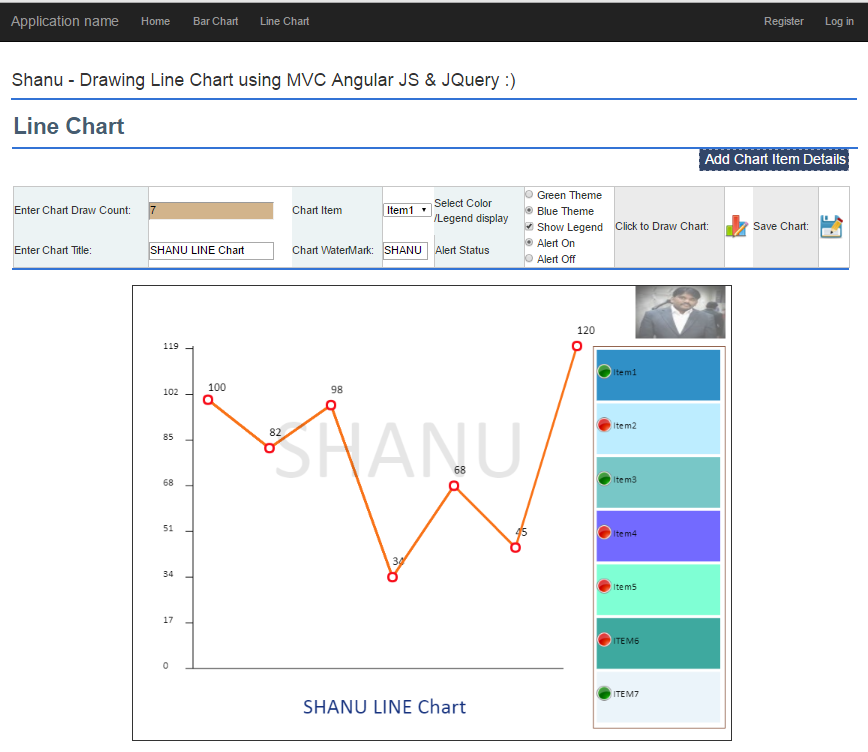
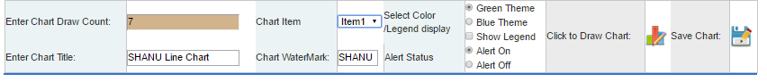
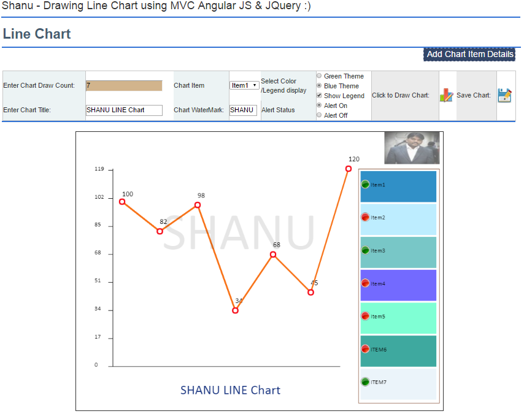
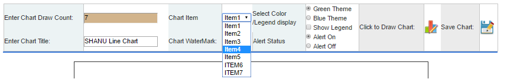
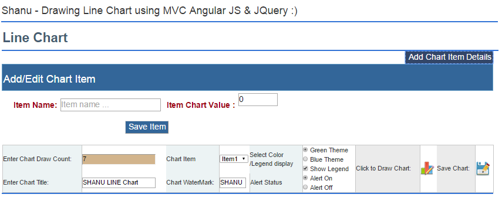

# MVC Dynamic Line Chart Using WEB API, AngularJS, and JQuery
## Requires
- Visual Studio 2015
## License
- MIT
## Technologies
- ASP.NET MVC
- jQuery
- ASP.NET Web API
- AngularJS
- Line Chart
## Topics
- ASP.NET MVC
- Web API
- AngularJS
- Line Chart
## Updated
- 04/14/2016
## Description

<h1>Introduction</h1>

In our previous article we have seen in detail about&nbsp;<a href="https://code.msdn.microsoft.com/MVC-Dynamic-Bar-Chart-743e47ce/edit?newSession=True" target="_blank">how to draw Bar Chart in MVC web Application</a>. In this
 article we will see how to draw Line Chart for MVC application using HTML5 Canvas, JQuery, WEB API, &nbsp;and&nbsp;AngularJS. 
 
In this series we will see one-by-one in detail starting from:

<ol>
<li><a title="MVC Dynamic Bar Chart using WEB API, AngularJS and JQuery" href="https://code.msdn.microsoft.com/MVC-Dynamic-Bar-Chart-743e47ce/edit?newSession=True">MVC Dynamic&nbsp;<strong>Bar Chart</strong>&nbsp;using WEB API, AngularJS and JQuery</a>
</li><li><a href="https://code.msdn.microsoft.com/MVC-Dynamic-Line-Chart-af5e907f">MVC Dynamic Line Chart using WEB API, AngularJS and JQuery
</a></li><li>MVC Dynamic&nbsp;<strong>Pie Chart</strong>&nbsp;using WEB API, AngularJS and JQuery
</li><li>MVC Dynamic&nbsp;<strong>Line</strong>&nbsp;&amp;&nbsp;<strong>Bar&nbsp;</strong>Chart using WEB API, AngularJS and JQuery
</li><li>MVC Dynamic&nbsp;<strong>Donut</strong><strong>&nbsp;Chart</strong>&nbsp;using WEB API, AngularJS and JQuery
</li><li>MVC Dynamic&nbsp;<strong>Bubble Chart</strong>&nbsp;using WEB API, AngularJS and JQuery&nbsp;
</li></ol>

<strong>Our Chart Features</strong>

<ol>
<li><strong>Chart Source Data:</strong>&nbsp;Using WEB API and AngularJS we will be loading chart data from database to a Combobox. In our JQuery we will be plotting chart details from the Combobox.
</li><li><strong>Chart Number of Category:</strong>&nbsp;Chart Items will be dynamically loaded from database. Here we will plot all the Items in Combobox. It&rsquo;s good to plot less than 12 Items per chart.
</li><li><strong>&nbsp;&nbsp;</strong><strong>Chart Title Text:&nbsp;</strong>User can add their own Chart Title and dynamically change the titles if required. Here in our example we will draw the Title Textbox text at the Bottom of the Chart. (User can redesign
 and customize as per your requirements if needed).<strong>&nbsp;</strong> </li><li><strong>Chart Water Mark Text:</strong>&nbsp;In some cases we need to add our Company name as Water Mark to our Chart. Here in our example we will draw the Water mark Textbox text at the center of the Chart. (User can redesign and customize as per your
 requirements if needed).<strong>&nbsp;</strong> </li><li><strong>Chart Company LOGO:</strong>&nbsp;User can add their own Company logo to the Chart.(Here for sample we have added my own image as a Logo at the Top left corner.( User can redesign and customize as per your requirements if needed.).<strong>&nbsp;</strong>
</li><li><strong>Chart Alert Image Display:</strong>&nbsp;If the &ldquo;Alert On&rdquo; radio button is checked we will display the Alert Image. If the &ldquo;Alert Off&rdquo; radio button is clicked then the Alert Image will not be displayed. In JQuery we have
 declared alertCheckValue = 90; and we check the plot data with this aleartcheckValue and if the plot value is greater than this check value then we will display the alert image in the legend.<strong>&nbsp;</strong>
</li></ol>

What is the use of Alert Image?

<strong>&nbsp;&nbsp;&nbsp;&nbsp;&nbsp;&nbsp;&nbsp;&nbsp;&nbsp;&nbsp;&nbsp;&nbsp;&nbsp;&nbsp;&nbsp;&nbsp;&nbsp;&nbsp;&nbsp;&nbsp;&nbsp;&nbsp;</strong>Let&rsquo;s consider a real time projects. For example we need to display the chart for a Manufacturing factory
 with production result as Good and Bad. For example if production result for each quality value is above 90 we need to display the Alert green Image and if the quality value is below 90 then we need to display the Red Image with label bars.

This Alert Image will be easy to identify each quality result with good or bad. (Here for a sample we have used for quality check and display green and red image, but users can customize as per your requirement and add your own image and logics.).

<strong>7.&nbsp;&nbsp;&nbsp;&nbsp;&nbsp;&nbsp;</strong><strong>Save Chart as Image:</strong>&nbsp;user can save the chart as Image.

<strong>8.&nbsp;&nbsp;&nbsp;&nbsp;&nbsp;&nbsp;</strong><strong>Chart Theme :</strong>

Here we have created 2 themes, Blue and Green for our Chart. We can see both theme output here. User can also add any numbers of theme as they required.

<strong>Blue Theme</strong>

<strong>Green Theme</strong>

In this Article we have 2 parts

<ul>
<li>&nbsp;Chart Item and Value Insert/Update to database, Select Chart Item and Value to Combobox from database using WEB API, AngularJS
</li><li>&nbsp;Using JQuery Draw our own Chart to HTML5 Canvas tag in our MVC page. </li></ul>
<h1>Building the Sample</h1>

<strong>Prerequisites</strong>

<strong>Visual Studio 2015:</strong>&nbsp;You can download it from&nbsp;<a href="https://www.visualstudio.com/en-us/downloads/visual-studio-2015-downloads-vs.aspx" target="_blank">here</a>.

Description

<h1><strong>Code Part</strong></h1>

In Code part we can see 3 Steps

<strong>Step 1:</strong>&nbsp;Explains about how to create a sample Database, Table, Stored procedure to select, Insert and Update Chart data to SQL Server.

<strong>Step 2:</strong>&nbsp;Explains about how to create a WEB API to get the data and bind the result to MVC page using AngularJS.

&nbsp;<strong>Step 3:</strong>&nbsp;Explains about how to draw our own Chart to our MVC Web application using JQuery.

<h1><strong>Step 1: Script to create Table and Stored Procedure</strong></h1>

We will create a ItemMaster&nbsp;table under the Database &lsquo;ItemsDB.&nbsp;The following is the script to create a database, table and sample insert query. Run this script in your SQL Server. I have used SQL Server 2014. &nbsp;

SQL

Edit|Remove

<pre class="js">USE&nbsp;MASTER&nbsp;&nbsp;&nbsp;
GO&nbsp;&nbsp;&nbsp;
&nbsp;&nbsp;&nbsp;
--&nbsp;1)&nbsp;Check&nbsp;for&nbsp;the&nbsp;Database&nbsp;Exists&nbsp;.If&nbsp;the&nbsp;database&nbsp;is&nbsp;exist&nbsp;then&nbsp;drop&nbsp;and&nbsp;create&nbsp;new&nbsp;DB&nbsp;&nbsp;&nbsp;
IF&nbsp;EXISTS&nbsp;(SELECT&nbsp;[name]&nbsp;FROM&nbsp;sys.databases&nbsp;WHERE&nbsp;[name]&nbsp;=&nbsp;'ItemsDB'&nbsp;)&nbsp;&nbsp;&nbsp;
DROP&nbsp;DATABASE&nbsp;ItemsDB&nbsp;&nbsp;&nbsp;
GO&nbsp;&nbsp;&nbsp;
&nbsp;&nbsp;&nbsp;
CREATE&nbsp;DATABASE&nbsp;ItemsDB&nbsp;&nbsp;&nbsp;
GO&nbsp;&nbsp;&nbsp;
&nbsp;&nbsp;&nbsp;
USE&nbsp;ItemsDB&nbsp;&nbsp;&nbsp;
GO&nbsp;&nbsp;&nbsp;
&nbsp;&nbsp;&nbsp;
&nbsp;&nbsp;&nbsp;
--&nbsp;1)&nbsp;////////////&nbsp;Item&nbsp;Masters&nbsp;&nbsp;&nbsp;
&nbsp;&nbsp;&nbsp;
IF&nbsp;EXISTS&nbsp;(&nbsp;SELECT&nbsp;[name]&nbsp;FROM&nbsp;sys.tables&nbsp;WHERE&nbsp;[name]&nbsp;=&nbsp;'ItemMaster'&nbsp;)&nbsp;&nbsp;&nbsp;
DROP&nbsp;TABLE&nbsp;ItemMaster&nbsp;&nbsp;&nbsp;
GO&nbsp;&nbsp;&nbsp;
&nbsp;&nbsp;&nbsp;
CREATE&nbsp;TABLE&nbsp;[dbo].[ItemMaster](&nbsp;&nbsp;&nbsp;
&nbsp;&nbsp;&nbsp;&nbsp;&nbsp;&nbsp;&nbsp;&nbsp;[ItemID]&nbsp;INT&nbsp;IDENTITY&nbsp;PRIMARY&nbsp;KEY,&nbsp;&nbsp;&nbsp;
&nbsp;&nbsp;&nbsp;&nbsp;&nbsp;&nbsp;&nbsp;&nbsp;[ItemName]&nbsp;[varchar](100)&nbsp;NOT&nbsp;NULL,&nbsp;&nbsp;&nbsp;&nbsp;&nbsp;&nbsp;
&nbsp;&nbsp;&nbsp;&nbsp;&nbsp;&nbsp;&nbsp;&nbsp;[SaleCount]&nbsp;&nbsp;[varchar](10)&nbsp;NOT&nbsp;NULL&nbsp;&nbsp;
)&nbsp;&nbsp;&nbsp;
&nbsp;&nbsp;&nbsp;
--&nbsp;insert&nbsp;sample&nbsp;data&nbsp;to&nbsp;Item&nbsp;Master&nbsp;table&nbsp;&nbsp;&nbsp;
INSERT&nbsp;INTO&nbsp;ItemMaster&nbsp;&nbsp;&nbsp;([ItemName],[SaleCount])&nbsp;&nbsp;&nbsp;
&nbsp;&nbsp;&nbsp;&nbsp;&nbsp;VALUES&nbsp;('Item1','100')&nbsp;&nbsp;&nbsp;
&nbsp;&nbsp;&nbsp;
INSERT&nbsp;INTO&nbsp;ItemMaster&nbsp;&nbsp;&nbsp;([ItemName],[SaleCount])&nbsp;&nbsp;&nbsp;
&nbsp;&nbsp;&nbsp;&nbsp;&nbsp;VALUES&nbsp;('Item2','82')&nbsp;&nbsp;&nbsp;
&nbsp;
INSERT&nbsp;INTO&nbsp;ItemMaster&nbsp;&nbsp;&nbsp;([ItemName],[SaleCount])&nbsp;&nbsp;&nbsp;
&nbsp;&nbsp;&nbsp;&nbsp;&nbsp;VALUES&nbsp;('Item3','98')&nbsp;&nbsp;&nbsp;
&nbsp;
INSERT&nbsp;INTO&nbsp;ItemMaster&nbsp;&nbsp;&nbsp;([ItemName],[SaleCount])&nbsp;&nbsp;&nbsp;
&nbsp;&nbsp;&nbsp;&nbsp;&nbsp;VALUES&nbsp;('Item4','34')&nbsp;&nbsp;&nbsp;
&nbsp;
INSERT&nbsp;INTO&nbsp;ItemMaster&nbsp;&nbsp;&nbsp;([ItemName],[SaleCount])&nbsp;&nbsp;&nbsp;
&nbsp;&nbsp;&nbsp;&nbsp;&nbsp;VALUES&nbsp;('Item5','68')&nbsp;&nbsp;&nbsp;
&nbsp;
select&nbsp;*&nbsp;from&nbsp;ItemMaster&nbsp;&nbsp;
&nbsp;
&nbsp;
--&nbsp;1)To&nbsp;Select&nbsp;Item&nbsp;Details&nbsp;&nbsp;&nbsp;&nbsp;&nbsp;&nbsp;&nbsp;&nbsp;
&nbsp;
--&nbsp;Author&nbsp;&nbsp;&nbsp;&nbsp;&nbsp;&nbsp;:&nbsp;Shanu&nbsp;&nbsp;&nbsp;&nbsp;&nbsp;&nbsp;&nbsp;&nbsp;&nbsp;&nbsp;&nbsp;&nbsp;&nbsp;&nbsp;&nbsp;&nbsp;&nbsp;&nbsp;&nbsp;&nbsp;&nbsp;&nbsp;&nbsp;&nbsp;&nbsp;&nbsp;&nbsp;&nbsp;&nbsp;&nbsp;&nbsp;&nbsp;&nbsp;&nbsp;&nbsp;&nbsp;&nbsp;&nbsp;&nbsp;&nbsp;&nbsp;&nbsp;&nbsp;&nbsp;&nbsp;&nbsp;&nbsp;&nbsp;&nbsp;&nbsp;&nbsp;&nbsp;&nbsp;&nbsp;&nbsp;&nbsp;&nbsp;&nbsp;&nbsp;&nbsp;&nbsp;&nbsp;&nbsp;&nbsp;&nbsp;
--&nbsp;Create&nbsp;date&nbsp;:&nbsp;&nbsp;2016-03-15&nbsp;&nbsp;&nbsp;&nbsp;&nbsp;&nbsp;&nbsp;&nbsp;&nbsp;&nbsp;&nbsp;&nbsp;&nbsp;&nbsp;&nbsp;&nbsp;&nbsp;&nbsp;&nbsp;&nbsp;&nbsp;&nbsp;&nbsp;&nbsp;&nbsp;&nbsp;&nbsp;&nbsp;&nbsp;&nbsp;&nbsp;&nbsp;&nbsp;&nbsp;&nbsp;&nbsp;&nbsp;&nbsp;&nbsp;&nbsp;&nbsp;&nbsp;&nbsp;&nbsp;&nbsp;&nbsp;&nbsp;&nbsp;&nbsp;&nbsp;&nbsp;&nbsp;&nbsp;&nbsp;&nbsp;&nbsp;&nbsp;&nbsp;&nbsp;&nbsp;&nbsp;&nbsp;&nbsp;&nbsp;&nbsp;
--&nbsp;Description&nbsp;:To&nbsp;Select&nbsp;Item&nbsp;Details&nbsp;&nbsp;&nbsp;&nbsp;&nbsp;&nbsp;&nbsp;&nbsp;&nbsp;&nbsp;&nbsp;&nbsp;&nbsp;&nbsp;&nbsp;&nbsp;&nbsp;&nbsp;&nbsp;&nbsp;&nbsp;&nbsp;&nbsp;&nbsp;&nbsp;&nbsp;&nbsp;&nbsp;&nbsp;&nbsp;&nbsp;&nbsp;&nbsp;&nbsp;&nbsp;&nbsp;&nbsp;&nbsp;&nbsp;&nbsp;&nbsp;&nbsp;&nbsp;&nbsp;
--&nbsp;Tables&nbsp;used&nbsp;:&nbsp;&nbsp;ItemMaster&nbsp;&nbsp;&nbsp;&nbsp;&nbsp;&nbsp;&nbsp;&nbsp;&nbsp;&nbsp;&nbsp;&nbsp;&nbsp;&nbsp;&nbsp;&nbsp;&nbsp;&nbsp;&nbsp;&nbsp;&nbsp;&nbsp;&nbsp;&nbsp;&nbsp;&nbsp;&nbsp;&nbsp;&nbsp;&nbsp;&nbsp;&nbsp;&nbsp;&nbsp;&nbsp;&nbsp;&nbsp;&nbsp;&nbsp;&nbsp;&nbsp;&nbsp;&nbsp;&nbsp;&nbsp;&nbsp;&nbsp;&nbsp;&nbsp;&nbsp;&nbsp;&nbsp;&nbsp;&nbsp;&nbsp;&nbsp;&nbsp;&nbsp;&nbsp;&nbsp;&nbsp;
--&nbsp;Modifier&nbsp;&nbsp;&nbsp;&nbsp;:&nbsp;Shanu&nbsp;&nbsp;&nbsp;&nbsp;&nbsp;&nbsp;&nbsp;&nbsp;&nbsp;&nbsp;&nbsp;&nbsp;&nbsp;&nbsp;&nbsp;&nbsp;&nbsp;&nbsp;&nbsp;&nbsp;&nbsp;&nbsp;&nbsp;&nbsp;&nbsp;&nbsp;&nbsp;&nbsp;&nbsp;&nbsp;&nbsp;&nbsp;&nbsp;&nbsp;&nbsp;&nbsp;&nbsp;&nbsp;&nbsp;&nbsp;&nbsp;&nbsp;&nbsp;&nbsp;&nbsp;&nbsp;&nbsp;&nbsp;&nbsp;&nbsp;&nbsp;&nbsp;&nbsp;&nbsp;&nbsp;&nbsp;&nbsp;&nbsp;&nbsp;&nbsp;&nbsp;&nbsp;&nbsp;&nbsp;&nbsp;
--&nbsp;Modify&nbsp;date&nbsp;:&nbsp;2016-03-15&nbsp;&nbsp;&nbsp;&nbsp;&nbsp;&nbsp;&nbsp;&nbsp;&nbsp;&nbsp;&nbsp;&nbsp;&nbsp;&nbsp;&nbsp;&nbsp;&nbsp;&nbsp;&nbsp;&nbsp;&nbsp;&nbsp;&nbsp;&nbsp;&nbsp;&nbsp;&nbsp;&nbsp;&nbsp;&nbsp;&nbsp;&nbsp;&nbsp;&nbsp;&nbsp;&nbsp;&nbsp;&nbsp;&nbsp;&nbsp;&nbsp;&nbsp;&nbsp;&nbsp;&nbsp;&nbsp;&nbsp;&nbsp;&nbsp;&nbsp;&nbsp;&nbsp;&nbsp;&nbsp;&nbsp;&nbsp;&nbsp;&nbsp;&nbsp;&nbsp;&nbsp;&nbsp;&nbsp;&nbsp;&nbsp;
--&nbsp;=============================================&nbsp;&nbsp;&nbsp;
--&nbsp;To&nbsp;Select&nbsp;Item&nbsp;Details&nbsp;
--&nbsp;EXEC&nbsp;USP_Item_Select&nbsp;''&nbsp;
--&nbsp;=============================================&nbsp;&nbsp;&nbsp;
CREATE&nbsp;PROCEDURE&nbsp;[dbo].[USP_Item_Select]&nbsp;&nbsp;&nbsp;&nbsp;
(&nbsp;&nbsp;&nbsp;
&nbsp;&nbsp;&nbsp;&nbsp;&nbsp;@ItemName&nbsp;&nbsp;&nbsp;&nbsp;&nbsp;&nbsp;&nbsp;&nbsp;&nbsp;&nbsp;&nbsp;&nbsp;&nbsp;&nbsp;&nbsp;VARCHAR(100)&nbsp;&nbsp;&nbsp;&nbsp;&nbsp;=&nbsp;''&nbsp;&nbsp;&nbsp;&nbsp;&nbsp;
&nbsp;&nbsp;&nbsp;&nbsp;&nbsp;&nbsp;)&nbsp;&nbsp;&nbsp;&nbsp;&nbsp;&nbsp;&nbsp;&nbsp;
AS&nbsp;&nbsp;&nbsp;&nbsp;&nbsp;&nbsp;&nbsp;&nbsp;&nbsp;&nbsp;&nbsp;&nbsp;&nbsp;&nbsp;&nbsp;&nbsp;&nbsp;&nbsp;&nbsp;&nbsp;&nbsp;&nbsp;&nbsp;&nbsp;&nbsp;&nbsp;&nbsp;&nbsp;&nbsp;&nbsp;&nbsp;&nbsp;&nbsp;&nbsp;&nbsp;&nbsp;&nbsp;&nbsp;&nbsp;&nbsp;&nbsp;&nbsp;&nbsp;&nbsp;&nbsp;&nbsp;&nbsp;&nbsp;&nbsp;&nbsp;&nbsp;&nbsp;&nbsp;&nbsp;&nbsp;&nbsp;&nbsp;&nbsp;&nbsp;&nbsp;&nbsp;&nbsp;&nbsp;&nbsp;&nbsp;
BEGIN&nbsp;&nbsp;&nbsp;&nbsp;&nbsp;&nbsp;&nbsp;&nbsp;&nbsp;
&nbsp;&nbsp;&nbsp;&nbsp;&nbsp;&nbsp;&nbsp;&nbsp;SELECT&nbsp;&nbsp;ItemName,&nbsp;
&nbsp;&nbsp;&nbsp;&nbsp;&nbsp;&nbsp;&nbsp;&nbsp;&nbsp;&nbsp;&nbsp;&nbsp;&nbsp;&nbsp;&nbsp;&nbsp;SaleCount&nbsp;
&nbsp;&nbsp;&nbsp;&nbsp;&nbsp;&nbsp;&nbsp;&nbsp;&nbsp;&nbsp;&nbsp;&nbsp;FROM&nbsp;ItemMaster&nbsp;
&nbsp;&nbsp;&nbsp;&nbsp;&nbsp;&nbsp;&nbsp;&nbsp;&nbsp;&nbsp;&nbsp;&nbsp;&nbsp;&nbsp;&nbsp;&nbsp;WHERE&nbsp;
&nbsp;&nbsp;&nbsp;&nbsp;&nbsp;&nbsp;&nbsp;&nbsp;&nbsp;&nbsp;&nbsp;&nbsp;&nbsp;&nbsp;&nbsp;&nbsp;ItemName&nbsp;like&nbsp;&nbsp;@ItemName&nbsp;&#43;'%'&nbsp;
&nbsp;&nbsp;&nbsp;&nbsp;&nbsp;&nbsp;&nbsp;&nbsp;&nbsp;Order&nbsp;BY&nbsp;ItemName&nbsp;
END&nbsp;
GO&nbsp;&nbsp;&nbsp;&nbsp;&nbsp;
&nbsp;
&nbsp;
&nbsp;
--&nbsp;2)&nbsp;To&nbsp;Insert/Update&nbsp;Item&nbsp;Details&nbsp;&nbsp;&nbsp;&nbsp;&nbsp;&nbsp;&nbsp;&nbsp;
&nbsp;
--&nbsp;Author&nbsp;&nbsp;&nbsp;&nbsp;&nbsp;&nbsp;:&nbsp;Shanu&nbsp;&nbsp;&nbsp;&nbsp;&nbsp;&nbsp;&nbsp;&nbsp;&nbsp;&nbsp;&nbsp;&nbsp;&nbsp;&nbsp;&nbsp;&nbsp;&nbsp;&nbsp;&nbsp;&nbsp;&nbsp;&nbsp;&nbsp;&nbsp;&nbsp;&nbsp;&nbsp;&nbsp;&nbsp;&nbsp;&nbsp;&nbsp;&nbsp;&nbsp;&nbsp;&nbsp;&nbsp;&nbsp;&nbsp;&nbsp;&nbsp;&nbsp;&nbsp;&nbsp;&nbsp;&nbsp;&nbsp;&nbsp;&nbsp;&nbsp;&nbsp;&nbsp;&nbsp;&nbsp;&nbsp;&nbsp;&nbsp;&nbsp;&nbsp;&nbsp;&nbsp;&nbsp;&nbsp;&nbsp;&nbsp;
--&nbsp;Create&nbsp;date&nbsp;:&nbsp;&nbsp;2016-03-15&nbsp;&nbsp;&nbsp;&nbsp;&nbsp;&nbsp;&nbsp;&nbsp;&nbsp;&nbsp;&nbsp;&nbsp;&nbsp;&nbsp;&nbsp;&nbsp;&nbsp;&nbsp;&nbsp;&nbsp;&nbsp;&nbsp;&nbsp;&nbsp;&nbsp;&nbsp;&nbsp;&nbsp;&nbsp;&nbsp;&nbsp;&nbsp;&nbsp;&nbsp;&nbsp;&nbsp;&nbsp;&nbsp;&nbsp;&nbsp;&nbsp;&nbsp;&nbsp;&nbsp;&nbsp;&nbsp;&nbsp;&nbsp;&nbsp;&nbsp;&nbsp;&nbsp;&nbsp;&nbsp;&nbsp;&nbsp;&nbsp;&nbsp;&nbsp;&nbsp;&nbsp;&nbsp;&nbsp;&nbsp;&nbsp;
--&nbsp;Description&nbsp;:To&nbsp;Insert/Update&nbsp;Item&nbsp;Details&nbsp;&nbsp;&nbsp;&nbsp;&nbsp;&nbsp;&nbsp;&nbsp;&nbsp;&nbsp;&nbsp;&nbsp;&nbsp;&nbsp;&nbsp;&nbsp;&nbsp;&nbsp;&nbsp;&nbsp;&nbsp;&nbsp;&nbsp;&nbsp;&nbsp;&nbsp;&nbsp;&nbsp;&nbsp;&nbsp;&nbsp;&nbsp;&nbsp;&nbsp;&nbsp;&nbsp;&nbsp;&nbsp;&nbsp;&nbsp;&nbsp;&nbsp;&nbsp;&nbsp;
--&nbsp;Tables&nbsp;used&nbsp;:&nbsp;&nbsp;ItemMaster&nbsp;&nbsp;&nbsp;&nbsp;&nbsp;&nbsp;&nbsp;&nbsp;&nbsp;&nbsp;&nbsp;&nbsp;&nbsp;&nbsp;&nbsp;&nbsp;&nbsp;&nbsp;&nbsp;&nbsp;&nbsp;&nbsp;&nbsp;&nbsp;&nbsp;&nbsp;&nbsp;&nbsp;&nbsp;&nbsp;&nbsp;&nbsp;&nbsp;&nbsp;&nbsp;&nbsp;&nbsp;&nbsp;&nbsp;&nbsp;&nbsp;&nbsp;&nbsp;&nbsp;&nbsp;&nbsp;&nbsp;&nbsp;&nbsp;&nbsp;&nbsp;&nbsp;&nbsp;&nbsp;&nbsp;&nbsp;&nbsp;&nbsp;&nbsp;&nbsp;&nbsp;
--&nbsp;Modifier&nbsp;&nbsp;&nbsp;&nbsp;:&nbsp;Shanu&nbsp;&nbsp;&nbsp;&nbsp;&nbsp;&nbsp;&nbsp;&nbsp;&nbsp;&nbsp;&nbsp;&nbsp;&nbsp;&nbsp;&nbsp;&nbsp;&nbsp;&nbsp;&nbsp;&nbsp;&nbsp;&nbsp;&nbsp;&nbsp;&nbsp;&nbsp;&nbsp;&nbsp;&nbsp;&nbsp;&nbsp;&nbsp;&nbsp;&nbsp;&nbsp;&nbsp;&nbsp;&nbsp;&nbsp;&nbsp;&nbsp;&nbsp;&nbsp;&nbsp;&nbsp;&nbsp;&nbsp;&nbsp;&nbsp;&nbsp;&nbsp;&nbsp;&nbsp;&nbsp;&nbsp;&nbsp;&nbsp;&nbsp;&nbsp;&nbsp;&nbsp;&nbsp;&nbsp;&nbsp;&nbsp;
--&nbsp;Modify&nbsp;date&nbsp;:&nbsp;2016-03-15&nbsp;&nbsp;&nbsp;&nbsp;&nbsp;&nbsp;&nbsp;&nbsp;&nbsp;&nbsp;&nbsp;&nbsp;&nbsp;&nbsp;&nbsp;&nbsp;&nbsp;&nbsp;&nbsp;&nbsp;&nbsp;&nbsp;&nbsp;&nbsp;&nbsp;&nbsp;&nbsp;&nbsp;&nbsp;&nbsp;&nbsp;&nbsp;&nbsp;&nbsp;&nbsp;&nbsp;&nbsp;&nbsp;&nbsp;&nbsp;&nbsp;&nbsp;&nbsp;&nbsp;&nbsp;&nbsp;&nbsp;&nbsp;&nbsp;&nbsp;&nbsp;&nbsp;&nbsp;&nbsp;&nbsp;&nbsp;&nbsp;&nbsp;&nbsp;&nbsp;&nbsp;&nbsp;&nbsp;&nbsp;&nbsp;
--&nbsp;=============================================&nbsp;&nbsp;&nbsp;
--&nbsp;To&nbsp;Insert/Update&nbsp;Item&nbsp;Details&nbsp;
--&nbsp;EXEC&nbsp;USP_Item_Edit&nbsp;''&nbsp;
--&nbsp;=============================================&nbsp;&nbsp;&nbsp;&nbsp;&nbsp;&nbsp;&nbsp;&nbsp;&nbsp;&nbsp;&nbsp;&nbsp;&nbsp;&nbsp;&nbsp;&nbsp;&nbsp;&nbsp;&nbsp;&nbsp;&nbsp;&nbsp;&nbsp;&nbsp;&nbsp;&nbsp;&nbsp;&nbsp;&nbsp;
CREATE&nbsp;PROCEDURE&nbsp;[dbo].[USP_Item_Edit]&nbsp;&nbsp;&nbsp;&nbsp;&nbsp;&nbsp;&nbsp;&nbsp;&nbsp;&nbsp;&nbsp;&nbsp;&nbsp;&nbsp;&nbsp;&nbsp;&nbsp;&nbsp;&nbsp;&nbsp;&nbsp;&nbsp;&nbsp;&nbsp;&nbsp;&nbsp;&nbsp;&nbsp;&nbsp;&nbsp;&nbsp;&nbsp;&nbsp;&nbsp;&nbsp;&nbsp;&nbsp;&nbsp;&nbsp;&nbsp;&nbsp;&nbsp;&nbsp;&nbsp;&nbsp;&nbsp;&nbsp;
&nbsp;&nbsp;&nbsp;(&nbsp;&nbsp;&nbsp;&nbsp;&nbsp;&nbsp;&nbsp;&nbsp;&nbsp;&nbsp;&nbsp;&nbsp;&nbsp;&nbsp;&nbsp;&nbsp;&nbsp;&nbsp;&nbsp;&nbsp;&nbsp;&nbsp;&nbsp;&nbsp;
&nbsp;&nbsp;&nbsp;&nbsp;&nbsp;@ItemName&nbsp;&nbsp;&nbsp;&nbsp;&nbsp;&nbsp;&nbsp;&nbsp;VARCHAR(100)&nbsp;&nbsp;&nbsp;&nbsp;&nbsp;=&nbsp;'',&nbsp;
&nbsp;&nbsp;&nbsp;&nbsp;&nbsp;@SaleCount&nbsp;&nbsp;&nbsp;&nbsp;&nbsp;&nbsp;&nbsp;&nbsp;&nbsp;&nbsp;&nbsp;&nbsp;VARCHAR(10)&nbsp;&nbsp;&nbsp;&nbsp;&nbsp;=&nbsp;''&nbsp;&nbsp;
&nbsp;&nbsp;&nbsp;&nbsp;&nbsp;
&nbsp;&nbsp;&nbsp;&nbsp;&nbsp;&nbsp;)&nbsp;&nbsp;&nbsp;&nbsp;&nbsp;&nbsp;&nbsp;&nbsp;&nbsp;&nbsp;&nbsp;&nbsp;&nbsp;&nbsp;&nbsp;&nbsp;&nbsp;&nbsp;&nbsp;&nbsp;&nbsp;&nbsp;&nbsp;&nbsp;&nbsp;&nbsp;&nbsp;&nbsp;&nbsp;&nbsp;&nbsp;&nbsp;&nbsp;&nbsp;&nbsp;&nbsp;&nbsp;&nbsp;&nbsp;&nbsp;&nbsp;&nbsp;&nbsp;&nbsp;&nbsp;&nbsp;&nbsp;&nbsp;&nbsp;&nbsp;&nbsp;&nbsp;&nbsp;&nbsp;&nbsp;&nbsp;&nbsp;
AS&nbsp;&nbsp;&nbsp;&nbsp;&nbsp;&nbsp;&nbsp;&nbsp;&nbsp;&nbsp;&nbsp;&nbsp;&nbsp;&nbsp;&nbsp;&nbsp;&nbsp;&nbsp;&nbsp;&nbsp;&nbsp;&nbsp;&nbsp;&nbsp;&nbsp;&nbsp;&nbsp;&nbsp;&nbsp;&nbsp;&nbsp;&nbsp;&nbsp;&nbsp;&nbsp;&nbsp;&nbsp;&nbsp;&nbsp;&nbsp;&nbsp;&nbsp;&nbsp;&nbsp;&nbsp;&nbsp;&nbsp;&nbsp;&nbsp;&nbsp;&nbsp;&nbsp;&nbsp;&nbsp;&nbsp;&nbsp;&nbsp;&nbsp;&nbsp;&nbsp;&nbsp;&nbsp;&nbsp;&nbsp;&nbsp;
BEGIN&nbsp;&nbsp;&nbsp;&nbsp;&nbsp;&nbsp;&nbsp;&nbsp;&nbsp;
&nbsp;&nbsp;&nbsp;&nbsp;&nbsp;&nbsp;&nbsp;&nbsp;IF&nbsp;NOT&nbsp;EXISTS&nbsp;(SELECT&nbsp;*&nbsp;FROM&nbsp;ItemMaster&nbsp;WHERE&nbsp;ItemName=@ItemName)&nbsp;
&nbsp;&nbsp;&nbsp;&nbsp;&nbsp;&nbsp;&nbsp;&nbsp;&nbsp;&nbsp;&nbsp;&nbsp;BEGIN&nbsp;
&nbsp;
&nbsp;&nbsp;&nbsp;&nbsp;&nbsp;&nbsp;&nbsp;&nbsp;&nbsp;&nbsp;&nbsp;&nbsp;&nbsp;&nbsp;&nbsp;&nbsp;INSERT&nbsp;INTO&nbsp;ItemMaster&nbsp;&nbsp;&nbsp;([ItemName],[SaleCount])&nbsp;&nbsp;&nbsp;
&nbsp;&nbsp;&nbsp;&nbsp;&nbsp;&nbsp;&nbsp;&nbsp;&nbsp;&nbsp;&nbsp;&nbsp;&nbsp;&nbsp;&nbsp;&nbsp;VALUES&nbsp;(@ItemName,@SaleCount)&nbsp;&nbsp;&nbsp;
&nbsp;&nbsp;&nbsp;&nbsp;&nbsp;&nbsp;&nbsp;&nbsp;&nbsp;&nbsp;&nbsp;&nbsp;&nbsp;&nbsp;&nbsp;&nbsp;&nbsp;&nbsp;&nbsp;&nbsp;&nbsp;&nbsp;&nbsp;&nbsp;&nbsp;&nbsp;&nbsp;&nbsp;&nbsp;&nbsp;&nbsp;&nbsp;
&nbsp;&nbsp;&nbsp;&nbsp;&nbsp;&nbsp;&nbsp;&nbsp;&nbsp;&nbsp;&nbsp;&nbsp;&nbsp;&nbsp;&nbsp;&nbsp;&nbsp;&nbsp;&nbsp;&nbsp;Select&nbsp;'Inserted'&nbsp;as&nbsp;results&nbsp;
&nbsp;&nbsp;&nbsp;&nbsp;&nbsp;&nbsp;&nbsp;&nbsp;&nbsp;&nbsp;&nbsp;&nbsp;&nbsp;&nbsp;&nbsp;&nbsp;&nbsp;&nbsp;&nbsp;&nbsp;return;&nbsp;&nbsp;&nbsp;&nbsp;&nbsp;
&nbsp;&nbsp;&nbsp;&nbsp;&nbsp;&nbsp;&nbsp;&nbsp;&nbsp;&nbsp;&nbsp;&nbsp;END&nbsp;
&nbsp;&nbsp;&nbsp;&nbsp;&nbsp;&nbsp;&nbsp;&nbsp;&nbsp;ELSE&nbsp;
&nbsp;&nbsp;&nbsp;&nbsp;&nbsp;&nbsp;&nbsp;&nbsp;&nbsp;&nbsp;&nbsp;&nbsp;&nbsp;BEGIN&nbsp;
&nbsp;&nbsp;&nbsp;&nbsp;&nbsp;&nbsp;&nbsp;&nbsp;&nbsp;&nbsp;&nbsp;&nbsp;&nbsp;&nbsp;&nbsp;&nbsp;&nbsp;&nbsp;&nbsp;&nbsp;Update&nbsp;ItemMaster&nbsp;SET&nbsp;
&nbsp;&nbsp;&nbsp;&nbsp;&nbsp;&nbsp;&nbsp;&nbsp;&nbsp;&nbsp;&nbsp;&nbsp;&nbsp;&nbsp;&nbsp;&nbsp;&nbsp;&nbsp;&nbsp;&nbsp;&nbsp;&nbsp;&nbsp;&nbsp;&nbsp;&nbsp;&nbsp;&nbsp;SaleCount=@SaleCount&nbsp;
&nbsp;&nbsp;&nbsp;&nbsp;&nbsp;&nbsp;&nbsp;&nbsp;&nbsp;&nbsp;&nbsp;&nbsp;&nbsp;&nbsp;&nbsp;&nbsp;&nbsp;&nbsp;&nbsp;&nbsp;&nbsp;&nbsp;&nbsp;&nbsp;&nbsp;&nbsp;&nbsp;&nbsp;&nbsp;&nbsp;&nbsp;&nbsp;WHERE&nbsp;ItemName=@ItemName&nbsp;
&nbsp;&nbsp;&nbsp;&nbsp;&nbsp;&nbsp;&nbsp;&nbsp;&nbsp;&nbsp;&nbsp;&nbsp;&nbsp;&nbsp;&nbsp;&nbsp;&nbsp;&nbsp;&nbsp;&nbsp;&nbsp;Select&nbsp;'Updated'&nbsp;as&nbsp;results&nbsp;
&nbsp;&nbsp;&nbsp;&nbsp;&nbsp;&nbsp;&nbsp;&nbsp;&nbsp;&nbsp;&nbsp;&nbsp;&nbsp;&nbsp;&nbsp;&nbsp;&nbsp;&nbsp;&nbsp;&nbsp;&nbsp;return;&nbsp;
&nbsp;&nbsp;&nbsp;&nbsp;&nbsp;&nbsp;&nbsp;&nbsp;&nbsp;&nbsp;&nbsp;&nbsp;&nbsp;&nbsp;END&nbsp;
&nbsp;&nbsp;&nbsp;&nbsp;&nbsp;&nbsp;&nbsp;&nbsp;&nbsp;&nbsp;&nbsp;&nbsp;&nbsp;&nbsp;Select&nbsp;'Error'&nbsp;as&nbsp;results&nbsp;
END&nbsp;
&nbsp;
&nbsp;
--&nbsp;3)To&nbsp;Max&nbsp;and&nbsp;Min&nbsp;Value&nbsp;
&nbsp;
--&nbsp;Author&nbsp;&nbsp;&nbsp;&nbsp;&nbsp;&nbsp;:&nbsp;Shanu&nbsp;&nbsp;&nbsp;&nbsp;&nbsp;&nbsp;&nbsp;&nbsp;&nbsp;&nbsp;&nbsp;&nbsp;&nbsp;&nbsp;&nbsp;&nbsp;&nbsp;&nbsp;&nbsp;&nbsp;&nbsp;&nbsp;&nbsp;&nbsp;&nbsp;&nbsp;&nbsp;&nbsp;&nbsp;&nbsp;&nbsp;&nbsp;&nbsp;&nbsp;&nbsp;&nbsp;&nbsp;&nbsp;&nbsp;&nbsp;&nbsp;&nbsp;&nbsp;&nbsp;&nbsp;&nbsp;&nbsp;&nbsp;&nbsp;&nbsp;&nbsp;&nbsp;&nbsp;&nbsp;&nbsp;&nbsp;&nbsp;&nbsp;&nbsp;&nbsp;&nbsp;&nbsp;&nbsp;&nbsp;&nbsp;
--&nbsp;Create&nbsp;date&nbsp;:&nbsp;&nbsp;2016-03-15&nbsp;&nbsp;&nbsp;&nbsp;&nbsp;&nbsp;&nbsp;&nbsp;&nbsp;&nbsp;&nbsp;&nbsp;&nbsp;&nbsp;&nbsp;&nbsp;&nbsp;&nbsp;&nbsp;&nbsp;&nbsp;&nbsp;&nbsp;&nbsp;&nbsp;&nbsp;&nbsp;&nbsp;&nbsp;&nbsp;&nbsp;&nbsp;&nbsp;&nbsp;&nbsp;&nbsp;&nbsp;&nbsp;&nbsp;&nbsp;&nbsp;&nbsp;&nbsp;&nbsp;&nbsp;&nbsp;&nbsp;&nbsp;&nbsp;&nbsp;&nbsp;&nbsp;&nbsp;&nbsp;&nbsp;&nbsp;&nbsp;&nbsp;&nbsp;&nbsp;&nbsp;&nbsp;&nbsp;&nbsp;&nbsp;
--&nbsp;Description&nbsp;:To&nbsp;Max&nbsp;and&nbsp;Min&nbsp;Value&nbsp;&nbsp;&nbsp;&nbsp;&nbsp;&nbsp;&nbsp;&nbsp;&nbsp;&nbsp;&nbsp;&nbsp;&nbsp;&nbsp;&nbsp;&nbsp;&nbsp;&nbsp;&nbsp;&nbsp;&nbsp;&nbsp;&nbsp;&nbsp;&nbsp;&nbsp;&nbsp;&nbsp;&nbsp;
--&nbsp;Tables&nbsp;used&nbsp;:&nbsp;&nbsp;ItemMaster&nbsp;&nbsp;&nbsp;&nbsp;&nbsp;&nbsp;&nbsp;&nbsp;&nbsp;&nbsp;&nbsp;&nbsp;&nbsp;&nbsp;&nbsp;&nbsp;&nbsp;&nbsp;&nbsp;&nbsp;&nbsp;&nbsp;&nbsp;&nbsp;&nbsp;&nbsp;&nbsp;&nbsp;&nbsp;&nbsp;&nbsp;&nbsp;&nbsp;&nbsp;&nbsp;&nbsp;&nbsp;&nbsp;&nbsp;&nbsp;&nbsp;&nbsp;&nbsp;&nbsp;&nbsp;&nbsp;&nbsp;&nbsp;&nbsp;&nbsp;&nbsp;&nbsp;&nbsp;&nbsp;&nbsp;&nbsp;&nbsp;&nbsp;&nbsp;&nbsp;&nbsp;
--&nbsp;Modifier&nbsp;&nbsp;&nbsp;&nbsp;:&nbsp;Shanu&nbsp;&nbsp;&nbsp;&nbsp;&nbsp;&nbsp;&nbsp;&nbsp;&nbsp;&nbsp;&nbsp;&nbsp;&nbsp;&nbsp;&nbsp;&nbsp;&nbsp;&nbsp;&nbsp;&nbsp;&nbsp;&nbsp;&nbsp;&nbsp;&nbsp;&nbsp;&nbsp;&nbsp;&nbsp;&nbsp;&nbsp;&nbsp;&nbsp;&nbsp;&nbsp;&nbsp;&nbsp;&nbsp;&nbsp;&nbsp;&nbsp;&nbsp;&nbsp;&nbsp;&nbsp;&nbsp;&nbsp;&nbsp;&nbsp;&nbsp;&nbsp;&nbsp;&nbsp;&nbsp;&nbsp;&nbsp;&nbsp;&nbsp;&nbsp;&nbsp;&nbsp;&nbsp;&nbsp;&nbsp;&nbsp;
--&nbsp;Modify&nbsp;date&nbsp;:&nbsp;2016-03-15&nbsp;&nbsp;&nbsp;&nbsp;&nbsp;&nbsp;&nbsp;&nbsp;&nbsp;&nbsp;&nbsp;&nbsp;&nbsp;&nbsp;&nbsp;&nbsp;&nbsp;&nbsp;&nbsp;&nbsp;&nbsp;&nbsp;&nbsp;&nbsp;&nbsp;&nbsp;&nbsp;&nbsp;&nbsp;&nbsp;&nbsp;&nbsp;&nbsp;&nbsp;&nbsp;&nbsp;&nbsp;&nbsp;&nbsp;&nbsp;&nbsp;&nbsp;&nbsp;&nbsp;&nbsp;&nbsp;&nbsp;&nbsp;&nbsp;&nbsp;&nbsp;&nbsp;&nbsp;&nbsp;&nbsp;&nbsp;&nbsp;&nbsp;&nbsp;&nbsp;&nbsp;&nbsp;&nbsp;&nbsp;&nbsp;
--&nbsp;=============================================&nbsp;&nbsp;&nbsp;
--&nbsp;To&nbsp;Max&nbsp;and&nbsp;Min&nbsp;Value&nbsp;
--&nbsp;EXEC&nbsp;USP_ItemMaxMin_Select&nbsp;''&nbsp;
--&nbsp;=============================================&nbsp;&nbsp;&nbsp;
CREATE&nbsp;PROCEDURE&nbsp;[dbo].[USP_ItemMaxMin_Select]&nbsp;&nbsp;&nbsp;&nbsp;
(&nbsp;&nbsp;&nbsp;
&nbsp;&nbsp;&nbsp;&nbsp;&nbsp;@ItemName&nbsp;&nbsp;&nbsp;&nbsp;&nbsp;&nbsp;&nbsp;&nbsp;&nbsp;&nbsp;&nbsp;&nbsp;&nbsp;&nbsp;&nbsp;VARCHAR(100)&nbsp;&nbsp;&nbsp;&nbsp;&nbsp;=&nbsp;''&nbsp;&nbsp;&nbsp;&nbsp;&nbsp;
&nbsp;&nbsp;&nbsp;&nbsp;&nbsp;&nbsp;)&nbsp;&nbsp;&nbsp;&nbsp;&nbsp;&nbsp;&nbsp;&nbsp;
AS&nbsp;&nbsp;&nbsp;&nbsp;&nbsp;&nbsp;&nbsp;&nbsp;&nbsp;&nbsp;&nbsp;&nbsp;&nbsp;&nbsp;&nbsp;&nbsp;&nbsp;&nbsp;&nbsp;&nbsp;&nbsp;&nbsp;&nbsp;&nbsp;&nbsp;&nbsp;&nbsp;&nbsp;&nbsp;&nbsp;&nbsp;&nbsp;&nbsp;&nbsp;&nbsp;&nbsp;&nbsp;&nbsp;&nbsp;&nbsp;&nbsp;&nbsp;&nbsp;&nbsp;&nbsp;&nbsp;&nbsp;&nbsp;&nbsp;&nbsp;&nbsp;&nbsp;&nbsp;&nbsp;&nbsp;&nbsp;&nbsp;&nbsp;&nbsp;&nbsp;&nbsp;&nbsp;&nbsp;&nbsp;&nbsp;
BEGIN&nbsp;&nbsp;&nbsp;&nbsp;&nbsp;&nbsp;&nbsp;&nbsp;&nbsp;
&nbsp;&nbsp;&nbsp;&nbsp;&nbsp;&nbsp;&nbsp;&nbsp;SELECT&nbsp;&nbsp;&nbsp;MIN(convert(int,SaleCount))&nbsp;as&nbsp;MinValue,&nbsp;
&nbsp;&nbsp;&nbsp;&nbsp;&nbsp;&nbsp;&nbsp;&nbsp;&nbsp;&nbsp;&nbsp;&nbsp;&nbsp;&nbsp;&nbsp;&nbsp;&nbsp;MAX(convert(int,SaleCount))&nbsp;as&nbsp;MaxValue&nbsp;&nbsp;&nbsp;&nbsp;&nbsp;&nbsp;&nbsp;&nbsp;&nbsp;&nbsp;&nbsp;&nbsp;&nbsp;&nbsp;&nbsp;&nbsp;&nbsp;
&nbsp;&nbsp;&nbsp;&nbsp;&nbsp;&nbsp;&nbsp;&nbsp;&nbsp;&nbsp;&nbsp;&nbsp;FROM&nbsp;ItemMaster&nbsp;
&nbsp;&nbsp;&nbsp;&nbsp;&nbsp;&nbsp;&nbsp;&nbsp;&nbsp;&nbsp;&nbsp;&nbsp;&nbsp;&nbsp;&nbsp;&nbsp;WHERE&nbsp;
&nbsp;&nbsp;&nbsp;&nbsp;&nbsp;&nbsp;&nbsp;&nbsp;&nbsp;&nbsp;&nbsp;&nbsp;&nbsp;&nbsp;&nbsp;&nbsp;ItemName&nbsp;like&nbsp;&nbsp;@ItemName&nbsp;&#43;'%'&nbsp;
&nbsp;&nbsp;&nbsp;&nbsp;&nbsp;&nbsp;&nbsp;&nbsp;&nbsp;&nbsp;
END&nbsp;
GO&nbsp;
</pre>

<strong>Step 2:&nbsp;</strong><strong>Create your MVC Web Application in Visual Studio 2015</strong>

After installing our Visual Studio 2015 click Start, then Programs and select&nbsp;<strong>Visual Studio 2015</strong>&nbsp;- Click&nbsp;<strong>Visual Studio 2015</strong>. Click New, then Project, select Web and then select&nbsp;<strong>ASP.NET Web Application</strong>.
 Enter your project name and click OK.

Select MVC, WEB API and click OK.

Now we have created our MVC Application as a next step we add our SQL server database as Entity Data Model to our application.

<strong>Add Database using ADO.NET Entity Data Model</strong>

Right click our project and click Add -&gt; New Item.

Select Data-&gt;Select ADO.NET Entity Data Model&gt; Give the name for our EF and click Add

Select EF Designer from database and click next.

Here click New Connection and provide your SQL-Server Server Name and connect to your database.<strong>&nbsp;</strong>

Here we can see we have given our SQL server name, Id and PWD and after it connected we have selected the data base as ItemsDB as we have created the Database using my SQL Script.

Click next and select our Tables and SP need to be used and click finish.

Once Entity has been created next step we add WEB API to our controller and write function to select/Insert/Update and Delete.

<strong>Steps to add our WEB API Controller.</strong>

Right Click Controllers folder-&gt; Click Add-&gt; Click Controller.

As we are going to create our WEB API Controller. Select Controller and Add Empty WEB API 2 Controller. Give your Name to Web API controller and click ok.&nbsp;

&nbsp;

As we all know Web API is a simple and easy to build HTTP Services for Browsers and Mobiles

Web API has four methods as&nbsp;<strong>Get/Post/Put and Delete&nbsp;</strong>where

<strong>Get</strong>&nbsp;is to request for the data. (Select)

<strong>Post&nbsp;</strong>is to create a data. (Insert)

<strong>Put&nbsp;</strong>is to update the data.

<strong>Delete</strong>&nbsp;is to delete data.

In our example we will use both&nbsp;<strong>Get</strong>&nbsp;and&nbsp;<strong>Post</strong>&nbsp;as we need to get all image name and descriptions from database and to insert new Image Name and Image Description to database.&nbsp;

<strong>Get Method</strong>

In our example I have used only Get method as I am using only Stored Procedure. We need to create object for our Entity and write our Get Method to perform Select/Insert/Update and Delete operations.

<strong>Select Operation</strong>

We use get Method to get all the details of itemMaster table using entity object and we return the result as IEnumerable .We use this method in our AngularJS and bind the result in ComboBox and insert the new chart Item to Database using the Insert Method.

C#

Edit|Remove

<pre class="csharp">publicclass&nbsp;ItemAPIController&nbsp;:&nbsp;ApiController&nbsp;
&nbsp;&nbsp;&nbsp;&nbsp;{&nbsp;
&nbsp;&nbsp;&nbsp;&nbsp;&nbsp;&nbsp;&nbsp;&nbsp;ItemsDBEntities&nbsp;objapi&nbsp;=&nbsp;new&nbsp;ItemsDBEntities();&nbsp;
&nbsp;
&nbsp;&nbsp;&nbsp;&nbsp;&nbsp;&nbsp;&nbsp;&nbsp;//&nbsp;To&nbsp;get&nbsp;all&nbsp;Item&nbsp;chart&nbsp;detaiuls&nbsp;
&nbsp;&nbsp;&nbsp;&nbsp;&nbsp;&nbsp;&nbsp;&nbsp;[HttpGet]&nbsp;
&nbsp;&nbsp;&nbsp;&nbsp;&nbsp;&nbsp;&nbsp;&nbsp;public&nbsp;IEnumerable&lt;USP_Item_Select_Result&gt;&nbsp;getItemDetails(string&nbsp;ItemName)&nbsp;
&nbsp;&nbsp;&nbsp;&nbsp;&nbsp;&nbsp;&nbsp;&nbsp;{&nbsp;
&nbsp;&nbsp;&nbsp;&nbsp;&nbsp;&nbsp;&nbsp;&nbsp;&nbsp;&nbsp;&nbsp;&nbsp;if&nbsp;(ItemName&nbsp;==&nbsp;null)&nbsp;
&nbsp;&nbsp;&nbsp;&nbsp;&nbsp;&nbsp;&nbsp;&nbsp;&nbsp;&nbsp;&nbsp;&nbsp;&nbsp;&nbsp;&nbsp;&nbsp;ItemName&nbsp;=&nbsp;&quot;&quot;;&nbsp;
&nbsp;&nbsp;&nbsp;&nbsp;&nbsp;&nbsp;&nbsp;&nbsp;&nbsp;&nbsp;&nbsp;&nbsp;return&nbsp;objapi.USP_Item_Select(ItemName).AsEnumerable();&nbsp;
&nbsp;&nbsp;&nbsp;&nbsp;&nbsp;&nbsp;&nbsp;&nbsp;}&nbsp;
&nbsp;
&nbsp;&nbsp;&nbsp;&nbsp;&nbsp;&nbsp;&nbsp;&nbsp;//&nbsp;To&nbsp;get&nbsp;maximum&nbsp;and&nbsp;Minimum&nbsp;value&nbsp;
&nbsp;&nbsp;&nbsp;&nbsp;&nbsp;&nbsp;&nbsp;&nbsp;[HttpGet]&nbsp;
&nbsp;&nbsp;&nbsp;&nbsp;&nbsp;&nbsp;&nbsp;&nbsp;public&nbsp;IEnumerable&lt;USP_ItemMaxMin_Select_Result&gt;&nbsp;getItemMaxMinDetails(string&nbsp;ItemNM)&nbsp;
&nbsp;&nbsp;&nbsp;&nbsp;&nbsp;&nbsp;&nbsp;&nbsp;{&nbsp;
&nbsp;&nbsp;&nbsp;&nbsp;&nbsp;&nbsp;&nbsp;&nbsp;&nbsp;&nbsp;&nbsp;&nbsp;if&nbsp;(ItemNM&nbsp;==&nbsp;null)&nbsp;
&nbsp;&nbsp;&nbsp;&nbsp;&nbsp;&nbsp;&nbsp;&nbsp;&nbsp;&nbsp;&nbsp;&nbsp;&nbsp;&nbsp;&nbsp;&nbsp;ItemNM&nbsp;=&nbsp;&quot;&quot;;&nbsp;
&nbsp;&nbsp;&nbsp;&nbsp;&nbsp;&nbsp;&nbsp;&nbsp;&nbsp;&nbsp;&nbsp;&nbsp;return&nbsp;objapi.USP_ItemMaxMin_Select(ItemNM).AsEnumerable();&nbsp;
&nbsp;&nbsp;&nbsp;&nbsp;&nbsp;&nbsp;&nbsp;&nbsp;}&nbsp;
&nbsp;
&nbsp;&nbsp;&nbsp;&nbsp;&nbsp;&nbsp;&nbsp;&nbsp;//&nbsp;To&nbsp;Insert/Update&nbsp;Item&nbsp;Details&nbsp;
&nbsp;&nbsp;&nbsp;&nbsp;&nbsp;&nbsp;&nbsp;&nbsp;[HttpGet]&nbsp;
&nbsp;&nbsp;&nbsp;&nbsp;&nbsp;&nbsp;&nbsp;&nbsp;public&nbsp;IEnumerable&lt;string&gt;&nbsp;insertItem(string&nbsp;itemName,&nbsp;string&nbsp;SaleCount)&nbsp;
&nbsp;&nbsp;&nbsp;&nbsp;&nbsp;&nbsp;&nbsp;&nbsp;{&nbsp;
&nbsp;&nbsp;&nbsp;&nbsp;&nbsp;&nbsp;&nbsp;&nbsp;&nbsp;&nbsp;&nbsp;&nbsp;return&nbsp;objapi.USP_Item_Edit(itemName,SaleCount).AsEnumerable();&nbsp;
&nbsp;&nbsp;&nbsp;&nbsp;&nbsp;&nbsp;&nbsp;&nbsp;}&nbsp;
&nbsp;
&nbsp;&nbsp;&nbsp;&nbsp;}&nbsp;
</pre>

Now we have created our Web API Controller Class. Next step we need to create our AngularJs Module and Controller. Let&rsquo;s see how to create our AngularJS Controller. In Visual Studio 2015 it&rsquo;s much easy to add our AngularJs Controller. Let&rsquo;s
 see step by Step on how to create and write our AngularJs Controller.&nbsp;

<h2><strong>Creating AngularJS Controller</strong></h2>

First create a folder inside the Script Folder and we give the folder name as &ldquo;MyAngular&rdquo;

First create a folder inside the Script Folder and I given the folder name as &ldquo;MyAngular&rdquo;

Now add your Angular Controller inside the folder.

Right Click the MyAngular Folder and click Add and New Item &gt; Select Web&nbsp; &gt; Select AngularJs Controller and give name to Controller.We have given my AngularJs Controller as &ldquo;Controller.js&rdquo;

If the Angular JS package is missing then add the package to your project.

Right Click your MVC project and Click-&gt; Manage NuGet Packages. Search for AngularJs and click Install.

<strong>Modules.js:</strong>&nbsp;Here we will add the reference to the AngularJS JavaScript and create an Angular Module named &ldquo;<strong>AngularJs_Module</strong>&rdquo;.&nbsp;

JavaScript

Edit|Remove

<pre class="js">//&nbsp;&lt;reference&nbsp;path=&quot;../angular.js&quot;&nbsp;/&gt;&nbsp;&nbsp;///&nbsp;&lt;reference&nbsp;path=&quot;../angular.min.js&quot;&nbsp;/&gt;&nbsp;&nbsp;&nbsp;///&nbsp;&lt;reference&nbsp;path=&quot;../angular-animate.js&quot;&nbsp;/&gt;&nbsp;&nbsp;&nbsp;///&nbsp;&lt;reference&nbsp;path=&quot;../angular-animate.min.js&quot;&nbsp;/&gt;&nbsp;&nbsp;&nbsp;var&nbsp;app;&nbsp;
(function&nbsp;()&nbsp;{&nbsp;
&nbsp;&nbsp;&nbsp;&nbsp;app&nbsp;=&nbsp;angular.module(&quot;AngularJs_Module&quot;,&nbsp;['ngAnimate']);&nbsp;
})();&nbsp;
</pre>

<strong>Controllers:</strong>&nbsp;In AngularJS Controller I have done all the business logic and returned the data from Web API to our MVC HTML page.

<strong>1. Variable declarations 
</strong> 
Firstly, we declared all the local variables need to be used.&nbsp;

JavaScript

Edit|Remove

<pre class="js">app.controller(&quot;AngularJs_Controller&quot;,&nbsp;function&nbsp;($scope,&nbsp;$timeout,&nbsp;$rootScope,&nbsp;$window,&nbsp;$http,&nbsp;FileUploadService)&nbsp;{&nbsp;
&nbsp;&nbsp;&nbsp;&nbsp;$scope.date&nbsp;=&nbsp;newDate();&nbsp;
//&nbsp;&lt;reference&nbsp;path=&quot;../angular.js&quot;&nbsp;/&gt;&nbsp;&nbsp;///&nbsp;&lt;reference&nbsp;path=&quot;../angular.min.js&quot;&nbsp;/&gt;&nbsp;&nbsp;&nbsp;///&nbsp;&lt;reference&nbsp;path=&quot;../angular-animate.js&quot;&nbsp;/&gt;&nbsp;&nbsp;&nbsp;///&nbsp;&lt;reference&nbsp;path=&quot;../angular-animate.min.js&quot;&nbsp;/&gt;&nbsp;&nbsp;&nbsp;var&nbsp;app;&nbsp;
(function&nbsp;()&nbsp;{&nbsp;
&nbsp;&nbsp;&nbsp;&nbsp;app&nbsp;=&nbsp;angular.module(&quot;RESTClientModule&quot;,&nbsp;['ngAnimate']);&nbsp;
})();&nbsp;
&nbsp;
&nbsp;
app.controller(&quot;AngularJs_Controller&quot;,&nbsp;function&nbsp;($scope,&nbsp;$timeout,&nbsp;$rootScope,&nbsp;$window,&nbsp;$http)&nbsp;{&nbsp;
&nbsp;&nbsp;&nbsp;&nbsp;$scope.date&nbsp;=&nbsp;newDate();&nbsp;
&nbsp;&nbsp;&nbsp;&nbsp;$scope.MyName&nbsp;=&nbsp;&quot;shanu&quot;;&nbsp;
&nbsp;&nbsp;&nbsp;&nbsp;$scope.sItemName&nbsp;=&nbsp;&quot;&quot;;&nbsp;
&nbsp;&nbsp;&nbsp;&nbsp;$scope.itemCount&nbsp;=&nbsp;5;&nbsp;
&nbsp;&nbsp;&nbsp;&nbsp;$scope.selectedItem&nbsp;=&nbsp;&quot;&quot;;&nbsp;
&nbsp;&nbsp;&nbsp;&nbsp;$scope.chartTitle&nbsp;=&nbsp;&quot;SHANU&nbsp;Bar&nbsp;Chart&quot;;&nbsp;
&nbsp;&nbsp;&nbsp;&nbsp;$scope.waterMark&nbsp;=&nbsp;&quot;SHANU&quot;;&nbsp;
&nbsp;&nbsp;&nbsp;&nbsp;$scope.ItemValues&nbsp;=&nbsp;0;&nbsp;
&nbsp;&nbsp;&nbsp;&nbsp;$scope.ItemNames&nbsp;=&nbsp;&quot;&quot;;&nbsp;
&nbsp;&nbsp;&nbsp;&nbsp;$scope.showItemAdd&nbsp;=&nbsp;false;&nbsp;
&nbsp;
&nbsp;&nbsp;&nbsp;&nbsp;$scope.minsnew&nbsp;=&nbsp;0;&nbsp;
&nbsp;&nbsp;&nbsp;&nbsp;$scope.maxnew&nbsp;=0;&nbsp;
</pre>

<strong>2. Methods</strong>

<strong>Select Method&nbsp;</strong>

Here we get all the data from WEB API and bind the result to our ComboBox and we have used another method to get the maximum and Minimum Value of Chart Value and bind in hidden field.

JavaScript

Edit|Remove

<pre class="js">//&nbsp;This&nbsp;method&nbsp;is&nbsp;to&nbsp;get&nbsp;all&nbsp;the&nbsp;Item&nbsp;&nbsp;Details&nbsp;to&nbsp;bind&nbsp;in&nbsp;Combobox&nbsp;for&nbsp;plotting&nbsp;in&nbsp;Graph&nbsp;
&nbsp;&nbsp;&nbsp;&nbsp;selectuerRoleDetails($scope.sItemName);&nbsp;
&nbsp;&nbsp;&nbsp;&nbsp;//&nbsp;This&nbsp;method&nbsp;is&nbsp;to&nbsp;get&nbsp;all&nbsp;the&nbsp;Item&nbsp;&nbsp;Details&nbsp;to&nbsp;bind&nbsp;in&nbsp;Combobox&nbsp;for&nbsp;plotting&nbsp;in&nbsp;Graphfunction&nbsp;selectuerRoleDetails(ItemName)&nbsp;{&nbsp;&nbsp;
&nbsp;&nbsp;&nbsp;&nbsp;&nbsp;&nbsp;&nbsp;&nbsp;$http.get('/api/ItemAPI/getItemDetails/',&nbsp;{&nbsp;params:&nbsp;{&nbsp;ItemName:&nbsp;ItemName&nbsp;}}).success(function&nbsp;(data)&nbsp;{&nbsp;
&nbsp;&nbsp;&nbsp;&nbsp;&nbsp;&nbsp;&nbsp;&nbsp;&nbsp;&nbsp;&nbsp;&nbsp;$scope.itemData&nbsp;=&nbsp;data;&nbsp;
&nbsp;&nbsp;&nbsp;&nbsp;&nbsp;&nbsp;&nbsp;&nbsp;&nbsp;&nbsp;&nbsp;&nbsp;$scope.itemCount&nbsp;=&nbsp;$scope.itemData.length;&nbsp;
&nbsp;&nbsp;&nbsp;&nbsp;&nbsp;&nbsp;&nbsp;&nbsp;&nbsp;&nbsp;&nbsp;&nbsp;$scope.selectedItem&nbsp;=&nbsp;$scope.itemData[0].SaleCount;&nbsp;&nbsp;&nbsp;&nbsp;&nbsp;
&nbsp;
&nbsp;&nbsp;&nbsp;&nbsp;&nbsp;&nbsp;&nbsp;&nbsp;})&nbsp;
&nbsp;&nbsp;.error(function&nbsp;()&nbsp;{&nbsp;
&nbsp;&nbsp;&nbsp;&nbsp;&nbsp;&nbsp;$scope.error&nbsp;=&nbsp;&quot;An&nbsp;Error&nbsp;has&nbsp;occured&nbsp;while&nbsp;loading&nbsp;posts!&quot;;&nbsp;
&nbsp;&nbsp;});&nbsp;
&nbsp;
&nbsp;&nbsp;&nbsp;&nbsp;&nbsp;&nbsp;&nbsp;&nbsp;$http.get('/api/ItemAPI/getItemMaxMinDetails/',&nbsp;{&nbsp;params:&nbsp;{&nbsp;ItemNM:&nbsp;$scope.sItemName&nbsp;}}).success(function&nbsp;(data)&nbsp;{&nbsp;
&nbsp;&nbsp;&nbsp;&nbsp;&nbsp;&nbsp;&nbsp;&nbsp;&nbsp;&nbsp;&nbsp;&nbsp;$scope.itemDataMaxMin&nbsp;=&nbsp;data;&nbsp;
&nbsp;&nbsp;&nbsp;&nbsp;&nbsp;&nbsp;&nbsp;&nbsp;&nbsp;&nbsp;&nbsp;&nbsp;$scope.minsnew&nbsp;=&nbsp;$scope.itemDataMaxMin[0].MinValue;&nbsp;
&nbsp;&nbsp;&nbsp;&nbsp;&nbsp;&nbsp;&nbsp;&nbsp;&nbsp;&nbsp;&nbsp;&nbsp;$scope.maxnew&nbsp;=&nbsp;$scope.itemDataMaxMin[0].MaxValue;&nbsp;
&nbsp;
&nbsp;
&nbsp;&nbsp;&nbsp;&nbsp;&nbsp;&nbsp;&nbsp;&nbsp;})&nbsp;
&nbsp;&nbsp;&nbsp;&nbsp;&nbsp;&nbsp;&nbsp;.error(function&nbsp;()&nbsp;{&nbsp;
&nbsp;&nbsp;&nbsp;&nbsp;&nbsp;&nbsp;&nbsp;&nbsp;&nbsp;&nbsp;&nbsp;$scope.error&nbsp;=&nbsp;&quot;An&nbsp;Error&nbsp;has&nbsp;occured&nbsp;while&nbsp;loading&nbsp;posts!&quot;;&nbsp;
&nbsp;&nbsp;&nbsp;&nbsp;&nbsp;&nbsp;&nbsp;});&nbsp;
&nbsp;&nbsp;&nbsp;&nbsp;&nbsp;&nbsp;&nbsp;&nbsp;
&nbsp;&nbsp;&nbsp;&nbsp;}</pre>

<strong>Insert Method</strong>

User can Insert or update Chart Item value by clicking Add Chart Item Details. After validation we pass the Chart Item name and Value to WEB API method to insert in to our database.

JavaScript

Edit|Remove

<pre class="js">//Save&nbsp;File&nbsp;
&nbsp;&nbsp;&nbsp;&nbsp;$scope.saveDetails&nbsp;=&nbsp;function&nbsp;()&nbsp;{&nbsp;
&nbsp;&nbsp;&nbsp;&nbsp;&nbsp;&nbsp;&nbsp;&nbsp;
&nbsp;&nbsp;&nbsp;&nbsp;&nbsp;&nbsp;&nbsp;&nbsp;$scope.IsFormSubmitted&nbsp;=&nbsp;true;&nbsp;
&nbsp;
&nbsp;&nbsp;&nbsp;&nbsp;&nbsp;&nbsp;&nbsp;&nbsp;$scope.Message&nbsp;=&nbsp;&quot;&quot;;&nbsp;
&nbsp;&nbsp;&nbsp;&nbsp;&nbsp;&nbsp;&nbsp;&nbsp;if&nbsp;($scope.ItemNames&nbsp;==&nbsp;&quot;&quot;)&nbsp;
&nbsp;&nbsp;&nbsp;&nbsp;&nbsp;&nbsp;&nbsp;&nbsp;{&nbsp;
&nbsp;&nbsp;&nbsp;&nbsp;&nbsp;&nbsp;&nbsp;&nbsp;&nbsp;&nbsp;&nbsp;&nbsp;alert(&quot;Enter&nbsp;Item&nbsp;Name&quot;);&nbsp;
&nbsp;&nbsp;&nbsp;&nbsp;&nbsp;&nbsp;&nbsp;&nbsp;&nbsp;&nbsp;&nbsp;&nbsp;return;&nbsp;
&nbsp;&nbsp;&nbsp;&nbsp;&nbsp;&nbsp;&nbsp;&nbsp;}if&nbsp;($scope.ItemValues&nbsp;==&nbsp;&quot;&quot;)&nbsp;{&nbsp;
&nbsp;&nbsp;&nbsp;&nbsp;&nbsp;&nbsp;&nbsp;&nbsp;&nbsp;&nbsp;&nbsp;&nbsp;alert(&quot;Enter&nbsp;Item&nbsp;Value&quot;);&nbsp;
&nbsp;&nbsp;&nbsp;&nbsp;&nbsp;&nbsp;&nbsp;&nbsp;&nbsp;&nbsp;&nbsp;&nbsp;return;&nbsp;
&nbsp;&nbsp;&nbsp;&nbsp;&nbsp;&nbsp;&nbsp;&nbsp;}if&nbsp;($scope.IsFormValid)&nbsp;{&nbsp;
&nbsp;&nbsp;&nbsp;&nbsp;&nbsp;&nbsp;&nbsp;&nbsp;&nbsp;&nbsp;&nbsp;&nbsp;alert($scope.ItemNames);&nbsp;
&nbsp;&nbsp;&nbsp;&nbsp;&nbsp;&nbsp;&nbsp;&nbsp;&nbsp;&nbsp;&nbsp;&nbsp;$http.get('/api/ItemAPI/insertItem/',&nbsp;{&nbsp;params:&nbsp;{&nbsp;itemName:&nbsp;$scope.ItemNames,&nbsp;SaleCount:&nbsp;$scope.ItemValues&nbsp;}}).success(function&nbsp;(data)&nbsp;{&nbsp;
&nbsp;
&nbsp;&nbsp;&nbsp;&nbsp;&nbsp;&nbsp;&nbsp;&nbsp;&nbsp;&nbsp;&nbsp;&nbsp;&nbsp;&nbsp;&nbsp;&nbsp;$scope.CharDataInserted&nbsp;=&nbsp;data;&nbsp;
&nbsp;&nbsp;&nbsp;&nbsp;&nbsp;&nbsp;&nbsp;&nbsp;&nbsp;&nbsp;&nbsp;&nbsp;&nbsp;&nbsp;&nbsp;&nbsp;alert($scope.CharDataInserted);&nbsp;
&nbsp;
&nbsp;&nbsp;&nbsp;&nbsp;&nbsp;&nbsp;&nbsp;&nbsp;&nbsp;&nbsp;&nbsp;&nbsp;&nbsp;&nbsp;&nbsp;&nbsp;cleardetails();&nbsp;
&nbsp;&nbsp;&nbsp;&nbsp;&nbsp;&nbsp;&nbsp;&nbsp;&nbsp;&nbsp;&nbsp;&nbsp;&nbsp;&nbsp;&nbsp;&nbsp;selectuerRoleDetails($scope.sItemName);&nbsp;
&nbsp;&nbsp;&nbsp;&nbsp;&nbsp;&nbsp;&nbsp;&nbsp;&nbsp;&nbsp;&nbsp;&nbsp;})&nbsp;
&nbsp;&nbsp;&nbsp;&nbsp;&nbsp;&nbsp;&nbsp;&nbsp;&nbsp;&nbsp;&nbsp;&nbsp;&nbsp;.error(function&nbsp;()&nbsp;{&nbsp;
&nbsp;&nbsp;&nbsp;&nbsp;&nbsp;&nbsp;&nbsp;&nbsp;&nbsp;&nbsp;&nbsp;&nbsp;&nbsp;&nbsp;&nbsp;&nbsp;&nbsp;$scope.error&nbsp;=&nbsp;&quot;An&nbsp;Error&nbsp;has&nbsp;occured&nbsp;while&nbsp;loading&nbsp;posts!&quot;;&nbsp;
&nbsp;&nbsp;&nbsp;&nbsp;&nbsp;&nbsp;&nbsp;&nbsp;&nbsp;&nbsp;&nbsp;&nbsp;&nbsp;});&nbsp;
&nbsp;&nbsp;&nbsp;&nbsp;&nbsp;&nbsp;&nbsp;&nbsp;}else{&nbsp;
&nbsp;&nbsp;&nbsp;&nbsp;&nbsp;&nbsp;&nbsp;&nbsp;&nbsp;&nbsp;&nbsp;&nbsp;$scope.Message&nbsp;=&nbsp;&quot;All&nbsp;the&nbsp;fields&nbsp;are&nbsp;required.&quot;;&nbsp;
&nbsp;&nbsp;&nbsp;&nbsp;&nbsp;&nbsp;&nbsp;&nbsp;}};&nbsp;
&nbsp;
});&nbsp;
</pre>

<h1><strong>Step 3: To draw our Chart using JQuery to our MVC page Canvas Tag</strong></h1>

Here we will see in detail about how to draw our Line Chart on our MVC Web Application using JQuery.

Inside the java Script declare the global variables and initialize the Canvas in JavaScript. In the code I have used comments to easily understand the declarations.

<strong>Script Detail Explanations</strong>

<strong>Script Global variable</strong>

<h2><strong>Chart Category Color Add</strong></h2>

Adding the Chart category colors to array .Here we have fixed to 12 colors and 12 data&rsquo;s to add with Line Chart. If you want you can add more from here. Here we have 2 set of color combination one with Green base and one with Blue base. User can add
 as per your requirement here.

JavaScript

Edit|Remove

<pre class="js">var&nbsp;pirChartColor&nbsp;=&nbsp;[&quot;#6CBB3C&quot;,&nbsp;&quot;#F87217&quot;,&nbsp;&quot;#EAC117&quot;,&nbsp;&quot;#EDDA74&quot;,&nbsp;&quot;#CD7F32&quot;,&nbsp;&quot;#CCFB5D&quot;,&nbsp;&quot;#FDD017&quot;,&nbsp;&quot;#9DC209&quot;,&nbsp;&quot;#E67451&quot;,&nbsp;&quot;#728C00&quot;,&nbsp;&quot;#617C58&quot;,&nbsp;&quot;#64E986&quot;];&nbsp;//&nbsp;green&nbsp;Color&nbsp;Combinations//&nbsp;var&nbsp;pirChartColor&nbsp;=&nbsp;[&quot;#3090C7&quot;,&nbsp;&quot;#BDEDFF&quot;,&nbsp;&quot;#78C7C7&quot;,&nbsp;&quot;#736AFF&quot;,&nbsp;&quot;#7FFFD4&quot;,&nbsp;&quot;#3EA99F&quot;,&nbsp;&quot;#EBF4FA&quot;,&nbsp;&quot;#F9B7FF&quot;,&nbsp;&quot;#8BB381&quot;,&nbsp;&quot;#BDEDFF&quot;,&nbsp;&quot;#B048B5&quot;,&nbsp;&quot;#4E387E&quot;];&nbsp;//&nbsp;Blue&nbsp;Color&nbsp;Combinations//This&nbsp;method&nbsp;will&nbsp;be&nbsp;used&nbsp;to&nbsp;check&nbsp;for&nbsp;user&nbsp;selected&nbsp;Color&nbsp;Theme&nbsp;and&nbsp;Change&nbsp;the&nbsp;colorfunction&nbsp;ChangeChartColor()&nbsp;{if&nbsp;($('#rdoColorGreen:checked').val()&nbsp;==&nbsp;&quot;Green&nbsp;Theme&quot;)&nbsp;{&nbsp;
&nbsp;&nbsp;&nbsp;&nbsp;&nbsp;&nbsp;&nbsp;&nbsp;&nbsp;&nbsp;&nbsp;&nbsp;&nbsp;&nbsp;&nbsp;&nbsp;pirChartColor&nbsp;=&nbsp;[&quot;#6CBB3C&quot;,&nbsp;&quot;#F87217&quot;,&nbsp;&quot;#EAC117&quot;,&nbsp;&quot;#EDDA74&quot;,&nbsp;&quot;#CD7F32&quot;,&nbsp;&quot;#CCFB5D&quot;,&nbsp;&quot;#FDD017&quot;,&nbsp;&quot;#9DC209&quot;,&nbsp;&quot;#E67451&quot;,&nbsp;&quot;#728C00&quot;,&nbsp;&quot;#617C58&quot;,&nbsp;&quot;#64E986&quot;];&nbsp;//&nbsp;green&nbsp;Color&nbsp;Combinations&nbsp;
&nbsp;&nbsp;&nbsp;&nbsp;&nbsp;&nbsp;&nbsp;&nbsp;&nbsp;&nbsp;&nbsp;&nbsp;&nbsp;&nbsp;&nbsp;&nbsp;lineColor&nbsp;=&nbsp;&quot;#3090C7&quot;;&nbsp;//&nbsp;Blue&nbsp;Color&nbsp;for&nbsp;Line&nbsp;
&nbsp;&nbsp;&nbsp;&nbsp;&nbsp;&nbsp;&nbsp;&nbsp;&nbsp;&nbsp;&nbsp;&nbsp;&nbsp;&nbsp;&nbsp;&nbsp;lineOuterCircleColor&nbsp;=&nbsp;&quot;#6CBB3C&quot;;&nbsp;//&nbsp;Green&nbsp;Color&nbsp;for&nbsp;Outer&nbsp;Circle}else{&nbsp;
&nbsp;&nbsp;&nbsp;&nbsp;&nbsp;&nbsp;&nbsp;&nbsp;&nbsp;&nbsp;&nbsp;&nbsp;&nbsp;&nbsp;&nbsp;&nbsp;pirChartColor&nbsp;=&nbsp;[&quot;#3090C7&quot;,&nbsp;&quot;#BDEDFF&quot;,&nbsp;&quot;#78C7C7&quot;,&nbsp;&quot;#736AFF&quot;,&nbsp;&quot;#7FFFD4&quot;,&nbsp;&quot;#3EA99F&quot;,&nbsp;&quot;#EBF4FA&quot;,&nbsp;&quot;#F9B7FF&quot;,&nbsp;&quot;#8BB381&quot;,&nbsp;&quot;#BDEDFF&quot;,&nbsp;&quot;#B048B5&quot;,&nbsp;&quot;#4E387E&quot;];&nbsp;//&nbsp;Blue&nbsp;Color&nbsp;Combinations&nbsp;
&nbsp;&nbsp;&nbsp;&nbsp;&nbsp;&nbsp;&nbsp;&nbsp;&nbsp;&nbsp;&nbsp;&nbsp;&nbsp;&nbsp;&nbsp;&nbsp;lineColor&nbsp;=&nbsp;&quot;#F87217&quot;;&nbsp;&nbsp;//&nbsp;Orange&nbsp;Color&nbsp;for&nbsp;the&nbsp;Line&nbsp;
&nbsp;&nbsp;&nbsp;&nbsp;&nbsp;&nbsp;&nbsp;&nbsp;&nbsp;&nbsp;&nbsp;&nbsp;&nbsp;&nbsp;&nbsp;&nbsp;lineOuterCircleColor&nbsp;=&nbsp;&quot;#F70D1A&nbsp;&quot;;&nbsp;//&nbsp;Red&nbsp;Color&nbsp;for&nbsp;the&nbsp;outer&nbsp;circle}}</pre>

<h2><strong>Draw Legend:</strong></h2>

<strong>&nbsp;</strong>If the Show Legend radio button is clicked then we draw a Legend for our Chart item inside Canvas Tag and also in this method we check to display Alert Image or not.

JavaScript

Edit|Remove

<pre class="js">//&nbsp;This&nbsp;function&nbsp;is&nbsp;used&nbsp;to&nbsp;draw&nbsp;the&nbsp;Legendfunction&nbsp;drawLengends()&nbsp;{&nbsp;
&nbsp;&nbsp;&nbsp;&nbsp;&nbsp;&nbsp;&nbsp;&nbsp;&nbsp;&nbsp;&nbsp;&nbsp;ctx.fillStyle&nbsp;=&nbsp;&quot;#7F462C&quot;;&nbsp;
&nbsp;&nbsp;&nbsp;&nbsp;&nbsp;&nbsp;&nbsp;&nbsp;&nbsp;&nbsp;&nbsp;&nbsp;ctx.fillRect(rect.startX,&nbsp;rect.startY,&nbsp;rect.w,&nbsp;rect.h);&nbsp;
&nbsp;&nbsp;&nbsp;&nbsp;&nbsp;&nbsp;&nbsp;&nbsp;&nbsp;&nbsp;&nbsp;&nbsp;//Drawing&nbsp;Inner&nbsp;White&nbsp;color&nbsp;Rectange&nbsp;with&nbsp;in&nbsp;Above&nbsp;brown&nbsp;rectangle&nbsp;to&nbsp;plot&nbsp;all&nbsp;the&nbsp;Lables&nbsp;with&nbsp;color,Text&nbsp;and&nbsp;Value.&nbsp;
&nbsp;&nbsp;&nbsp;&nbsp;&nbsp;&nbsp;&nbsp;&nbsp;&nbsp;&nbsp;&nbsp;&nbsp;ctx.fillStyle&nbsp;=&nbsp;&quot;#FFFFFF&quot;;&nbsp;
&nbsp;&nbsp;&nbsp;&nbsp;&nbsp;&nbsp;&nbsp;&nbsp;&nbsp;&nbsp;&nbsp;&nbsp;rectInner.startX&nbsp;=&nbsp;rect.startX&nbsp;&#43;&nbsp;1;&nbsp;
&nbsp;&nbsp;&nbsp;&nbsp;&nbsp;&nbsp;&nbsp;&nbsp;&nbsp;&nbsp;&nbsp;&nbsp;rectInner.startY&nbsp;=&nbsp;rect.startY&nbsp;&#43;&nbsp;1;&nbsp;
&nbsp;&nbsp;&nbsp;&nbsp;&nbsp;&nbsp;&nbsp;&nbsp;&nbsp;&nbsp;&nbsp;&nbsp;rectInner.w&nbsp;=&nbsp;rect.w&nbsp;-&nbsp;2;&nbsp;
&nbsp;&nbsp;&nbsp;&nbsp;&nbsp;&nbsp;&nbsp;&nbsp;&nbsp;&nbsp;&nbsp;&nbsp;rectInner.h&nbsp;=&nbsp;rect.h&nbsp;-&nbsp;2;&nbsp;
&nbsp;&nbsp;&nbsp;&nbsp;&nbsp;&nbsp;&nbsp;&nbsp;&nbsp;&nbsp;&nbsp;&nbsp;ctx.fillRect(rectInner.startX,&nbsp;rectInner.startY,&nbsp;rectInner.w,&nbsp;rectInner.h);&nbsp;
&nbsp;
&nbsp;
&nbsp;&nbsp;&nbsp;&nbsp;&nbsp;&nbsp;&nbsp;&nbsp;&nbsp;&nbsp;&nbsp;&nbsp;labelBarX&nbsp;=&nbsp;rectInner.startX&nbsp;&#43;&nbsp;4;&nbsp;
&nbsp;&nbsp;&nbsp;&nbsp;&nbsp;&nbsp;&nbsp;&nbsp;&nbsp;&nbsp;&nbsp;&nbsp;labelBarY&nbsp;=&nbsp;rectInner.startY&nbsp;&#43;&nbsp;4;&nbsp;
&nbsp;&nbsp;&nbsp;&nbsp;&nbsp;&nbsp;&nbsp;&nbsp;&nbsp;&nbsp;&nbsp;&nbsp;labelBarWidth&nbsp;=&nbsp;rectInner.w&nbsp;-&nbsp;10;&nbsp;
&nbsp;&nbsp;&nbsp;&nbsp;&nbsp;&nbsp;&nbsp;&nbsp;&nbsp;&nbsp;&nbsp;&nbsp;labelBarHeight&nbsp;=&nbsp;(rectInner.h&nbsp;/&nbsp;noOfPlots)&nbsp;-&nbsp;5;&nbsp;
&nbsp;&nbsp;&nbsp;&nbsp;&nbsp;&nbsp;&nbsp;&nbsp;&nbsp;&nbsp;&nbsp;&nbsp;colorval&nbsp;=&nbsp;0;&nbsp;
&nbsp;&nbsp;&nbsp;&nbsp;&nbsp;&nbsp;&nbsp;&nbsp;&nbsp;&nbsp;&nbsp;&nbsp;//&nbsp;here&nbsp;to&nbsp;draw&nbsp;all&nbsp;the&nbsp;rectangle&nbsp;for&nbsp;Lables&nbsp;with&nbsp;Image&nbsp;display&nbsp;
&nbsp;&nbsp;&nbsp;&nbsp;&nbsp;&nbsp;&nbsp;&nbsp;&nbsp;&nbsp;&nbsp;&nbsp;$('#DropDownList1&nbsp;option').each(function&nbsp;()&nbsp;{&nbsp;
&nbsp;&nbsp;&nbsp;&nbsp;&nbsp;&nbsp;&nbsp;&nbsp;&nbsp;&nbsp;&nbsp;&nbsp;&nbsp;&nbsp;&nbsp;&nbsp;ctx.fillStyle&nbsp;=&nbsp;pirChartColor[colorval];&nbsp;
&nbsp;
&nbsp;&nbsp;&nbsp;&nbsp;&nbsp;&nbsp;&nbsp;&nbsp;&nbsp;&nbsp;&nbsp;&nbsp;&nbsp;&nbsp;&nbsp;&nbsp;ctx.fillRect(labelBarX,&nbsp;labelBarY,&nbsp;labelBarWidth,&nbsp;labelBarHeight);&nbsp;
&nbsp;&nbsp;&nbsp;&nbsp;&nbsp;&nbsp;&nbsp;&nbsp;&nbsp;&nbsp;&nbsp;&nbsp;&nbsp;&nbsp;&nbsp;&nbsp;//&nbsp;Here&nbsp;we&nbsp;check&nbsp;for&nbsp;the&nbsp;rdoAlert&nbsp;Status&nbsp;is&nbsp;On&nbsp;-&nbsp;If&nbsp;the&nbsp;Alert&nbsp;is&nbsp;on&nbsp;then&nbsp;we&nbsp;display&nbsp;the&nbsp;Alert&nbsp;Image&nbsp;as&nbsp;per&nbsp;the&nbsp;&nbsp;Alert&nbsp;check&nbsp;value.if&nbsp;($('#rdoAlaramOn:checked').val()&nbsp;==&nbsp;&quot;Alert&nbsp;On&quot;)&nbsp;{//&nbsp;Here&nbsp;we&nbsp;can&nbsp;see&nbsp;fo&nbsp;ever&nbsp;chart&nbsp;value&nbsp;we&nbsp;check&nbsp;with&nbsp;the&nbsp;condition&nbsp;.we&nbsp;have&nbsp;initially&nbsp;declare&nbsp;the&nbsp;alertCheckValue&nbsp;as&nbsp;300.//so&nbsp;if&nbsp;the&nbsp;Chart&nbsp;Plot&nbsp;value&nbsp;is&nbsp;Greater&nbsp;then&nbsp;or&nbsp;equal&nbsp;to&nbsp;the&nbsp;check&nbsp;value&nbsp;then&nbsp;we&nbsp;display&nbsp;the&nbsp;Green&nbsp;Image&nbsp;else&nbsp;we&nbsp;display&nbsp;the&nbsp;Red&nbsp;Image.//user&nbsp;can&nbsp;change&nbsp;this&nbsp;to&nbsp;your&nbsp;requiremnt&nbsp;if&nbsp;needed.This&nbsp;is&nbsp;optioan&nbsp;function&nbsp;for&nbsp;the&nbsp;Pie&nbsp;Chart.if&nbsp;(parseInt($(this).val())&nbsp;&gt;=&nbsp;alertCheckValue)&nbsp;{&nbsp;
&nbsp;&nbsp;&nbsp;&nbsp;&nbsp;&nbsp;&nbsp;&nbsp;&nbsp;&nbsp;&nbsp;&nbsp;&nbsp;&nbsp;&nbsp;&nbsp;&nbsp;&nbsp;&nbsp;&nbsp;&nbsp;&nbsp;&nbsp;&nbsp;ctx.drawImage(greenImage,&nbsp;labelBarX,&nbsp;labelBarY&nbsp;&#43;&nbsp;(labelBarHeight&nbsp;/&nbsp;3)&nbsp;-&nbsp;4,&nbsp;imagesize,&nbsp;imagesize);&nbsp;
&nbsp;&nbsp;&nbsp;&nbsp;&nbsp;&nbsp;&nbsp;&nbsp;&nbsp;&nbsp;&nbsp;&nbsp;&nbsp;&nbsp;&nbsp;&nbsp;&nbsp;&nbsp;&nbsp;&nbsp;}else{&nbsp;
&nbsp;&nbsp;&nbsp;&nbsp;&nbsp;&nbsp;&nbsp;&nbsp;&nbsp;&nbsp;&nbsp;&nbsp;&nbsp;&nbsp;&nbsp;&nbsp;&nbsp;&nbsp;&nbsp;&nbsp;&nbsp;&nbsp;&nbsp;&nbsp;ctx.drawImage(redImage,&nbsp;labelBarX,&nbsp;labelBarY&nbsp;&#43;&nbsp;(labelBarHeight&nbsp;/&nbsp;3)&nbsp;-&nbsp;4,&nbsp;imagesize,&nbsp;imagesize);&nbsp;
&nbsp;&nbsp;&nbsp;&nbsp;&nbsp;&nbsp;&nbsp;&nbsp;&nbsp;&nbsp;&nbsp;&nbsp;&nbsp;&nbsp;&nbsp;&nbsp;&nbsp;&nbsp;&nbsp;&nbsp;}}//Draw&nbsp;the&nbsp;Pie&nbsp;Chart&nbsp;Label&nbsp;text&nbsp;and&nbsp;Value&nbsp;
&nbsp;&nbsp;&nbsp;&nbsp;&nbsp;&nbsp;&nbsp;&nbsp;&nbsp;&nbsp;&nbsp;&nbsp;&nbsp;&nbsp;&nbsp;&nbsp;ctx.fillStyle&nbsp;=&nbsp;&quot;#000000&quot;;&nbsp;
&nbsp;&nbsp;&nbsp;&nbsp;&nbsp;&nbsp;&nbsp;&nbsp;&nbsp;&nbsp;&nbsp;&nbsp;&nbsp;&nbsp;&nbsp;&nbsp;ctx.font&nbsp;=&nbsp;'10pt&nbsp;Calibri';&nbsp;
&nbsp;&nbsp;&nbsp;&nbsp;&nbsp;&nbsp;&nbsp;&nbsp;&nbsp;&nbsp;&nbsp;&nbsp;&nbsp;&nbsp;&nbsp;&nbsp;ctx.fillText($(this).text(),&nbsp;labelBarX&nbsp;&#43;&nbsp;imagesize&nbsp;&#43;&nbsp;2,&nbsp;labelBarY&nbsp;&#43;&nbsp;(labelBarHeight&nbsp;/&nbsp;2));&nbsp;
&nbsp;
&nbsp;&nbsp;&nbsp;&nbsp;&nbsp;&nbsp;&nbsp;&nbsp;&nbsp;&nbsp;&nbsp;&nbsp;&nbsp;&nbsp;&nbsp;&nbsp;//&nbsp;To&nbsp;Increment&nbsp;and&nbsp;draw&nbsp;the&nbsp;next&nbsp;bar&nbsp;,label&nbsp;Text&nbsp;and&nbsp;Alart&nbsp;Image.&nbsp;
&nbsp;
&nbsp;&nbsp;&nbsp;&nbsp;&nbsp;&nbsp;&nbsp;&nbsp;&nbsp;&nbsp;&nbsp;&nbsp;&nbsp;&nbsp;&nbsp;&nbsp;labelBarY&nbsp;=&nbsp;labelBarY&nbsp;&#43;&nbsp;labelBarHeight&nbsp;&#43;&nbsp;4;&nbsp;
&nbsp;&nbsp;&nbsp;&nbsp;&nbsp;&nbsp;&nbsp;&nbsp;&nbsp;&nbsp;&nbsp;&nbsp;&nbsp;&nbsp;&nbsp;&nbsp;//&nbsp;&nbsp;labelTextYXVal&nbsp;=&nbsp;labelBarY&nbsp;&#43;&nbsp;labelBarHeight&nbsp;-&nbsp;4;&nbsp;
&nbsp;
&nbsp;&nbsp;&nbsp;&nbsp;&nbsp;&nbsp;&nbsp;&nbsp;&nbsp;&nbsp;&nbsp;&nbsp;&nbsp;&nbsp;&nbsp;&nbsp;colorval&nbsp;=&nbsp;colorval&nbsp;&#43;&nbsp;1;&nbsp;
&nbsp;
&nbsp;&nbsp;&nbsp;&nbsp;&nbsp;&nbsp;&nbsp;&nbsp;&nbsp;&nbsp;&nbsp;&nbsp;});&nbsp;
&nbsp;&nbsp;&nbsp;&nbsp;&nbsp;&nbsp;&nbsp;&nbsp;}</pre>

<h2><strong>Draw Chart:</strong></h2>

<strong>&nbsp;</strong>This is our main Function .Here we get all the details to draw our Line Chart. In this function we will draw Chart Titile, Chart Water Mark text, Chart Logo Image and finally call draw Line chart Method to draw our Line chart inside
 Canvas Tag.

JavaScript

Edit|Remove

<pre class="js">//&nbsp;This&nbsp;is&nbsp;the&nbsp;main&nbsp;function&nbsp;to&nbsp;darw&nbsp;the&nbsp;Chartsfunction&nbsp;drawChart()&nbsp;{&nbsp;
&nbsp;
&nbsp;&nbsp;&nbsp;&nbsp;&nbsp;&nbsp;&nbsp;&nbsp;ChangeChartColor();&nbsp;
&nbsp;
&nbsp;&nbsp;&nbsp;&nbsp;&nbsp;&nbsp;&nbsp;&nbsp;//&nbsp;asign&nbsp;the&nbsp;images&nbsp;path&nbsp;for&nbsp;both&nbsp;Alert&nbsp;images&nbsp;
&nbsp;&nbsp;&nbsp;&nbsp;&nbsp;&nbsp;&nbsp;&nbsp;greenImage.src&nbsp;=&nbsp;'../images/Green.png';&nbsp;
&nbsp;&nbsp;&nbsp;&nbsp;&nbsp;&nbsp;&nbsp;&nbsp;redImage.src&nbsp;=&nbsp;'../images/Red.png';&nbsp;
&nbsp;
&nbsp;&nbsp;&nbsp;&nbsp;&nbsp;&nbsp;&nbsp;&nbsp;LogoImage.src&nbsp;=&nbsp;'../images/shanu.jpg';&nbsp;
&nbsp;
&nbsp;&nbsp;&nbsp;&nbsp;&nbsp;&nbsp;&nbsp;&nbsp;//&nbsp;Get&nbsp;the&nbsp;minumum&nbsp;and&nbsp;maximum&nbsp;value.here&nbsp;i&nbsp;have&nbsp;used&nbsp;the&nbsp;hidden&nbsp;filed&nbsp;from&nbsp;code&nbsp;behind&nbsp;wich&nbsp;will&nbsp;stored&nbsp;the&nbsp;Maximum&nbsp;and&nbsp;Minimum&nbsp;value&nbsp;of&nbsp;the&nbsp;Drop&nbsp;down&nbsp;list&nbsp;box.&nbsp;
&nbsp;&nbsp;&nbsp;&nbsp;&nbsp;&nbsp;&nbsp;&nbsp;
&nbsp;&nbsp;&nbsp;&nbsp;&nbsp;&nbsp;&nbsp;&nbsp;minDataVal&nbsp;=&nbsp;$('input:text[name=hidListMin]').val();&nbsp;
&nbsp;&nbsp;&nbsp;&nbsp;&nbsp;&nbsp;&nbsp;&nbsp;maxDataVal&nbsp;=&nbsp;$('input:text[name=hidListMax]').val();&nbsp;
&nbsp;&nbsp;&nbsp;&nbsp;&nbsp;&nbsp;&nbsp;&nbsp;
&nbsp;&nbsp;&nbsp;&nbsp;&nbsp;&nbsp;&nbsp;&nbsp;//&nbsp;Total&nbsp;no&nbsp;of&nbsp;plots&nbsp;we&nbsp;are&nbsp;going&nbsp;to&nbsp;draw.&nbsp;
&nbsp;&nbsp;&nbsp;&nbsp;&nbsp;&nbsp;&nbsp;&nbsp;noOfPlots&nbsp;=&nbsp;$(&quot;#DropDownList1&nbsp;option&quot;).length;&nbsp;
&nbsp;&nbsp;&nbsp;&nbsp;&nbsp;
&nbsp;&nbsp;&nbsp;&nbsp;&nbsp;&nbsp;&nbsp;&nbsp;maxValdivValue&nbsp;=&nbsp;Math.round((maxDataVal&nbsp;/&nbsp;noOfPlots));&nbsp;
&nbsp;
&nbsp;
&nbsp;&nbsp;&nbsp;&nbsp;&nbsp;&nbsp;&nbsp;&nbsp;//storing&nbsp;the&nbsp;Canvas&nbsp;Context&nbsp;to&nbsp;local&nbsp;variable&nbsp;ctx.This&nbsp;variable&nbsp;will&nbsp;be&nbsp;used&nbsp;to&nbsp;draw&nbsp;the&nbsp;Pie&nbsp;Chart&nbsp;
&nbsp;&nbsp;&nbsp;&nbsp;&nbsp;&nbsp;&nbsp;&nbsp;canvas&nbsp;=&nbsp;document.getElementById(&quot;canvas&quot;);&nbsp;
&nbsp;&nbsp;&nbsp;&nbsp;&nbsp;&nbsp;&nbsp;&nbsp;ctx&nbsp;=&nbsp;canvas.getContext(&quot;2d&quot;);&nbsp;
&nbsp;&nbsp;&nbsp;&nbsp;&nbsp;&nbsp;&nbsp;&nbsp;//globalAlpha&nbsp;-&nbsp;&gt;&nbsp;is&nbsp;used&nbsp;to&nbsp;display&nbsp;the&nbsp;100%&nbsp;opoacity&nbsp;of&nbsp;chart&nbsp;.because&nbsp;at&nbsp;the&nbsp;bottom&nbsp;of&nbsp;the&nbsp;code&nbsp;I&nbsp;have&nbsp;used&nbsp;the&nbsp;opacity&nbsp;to&nbsp;0.1&nbsp;to&nbsp;display&nbsp;the&nbsp;water&nbsp;mark&nbsp;text&nbsp;with&nbsp;fade&nbsp;effect.&nbsp;
&nbsp;&nbsp;&nbsp;&nbsp;&nbsp;&nbsp;&nbsp;&nbsp;ctx.globalAlpha&nbsp;=&nbsp;1;&nbsp;
&nbsp;&nbsp;&nbsp;&nbsp;&nbsp;&nbsp;&nbsp;&nbsp;ctx.fillStyle&nbsp;=&nbsp;&quot;#000000&quot;;&nbsp;
&nbsp;&nbsp;&nbsp;&nbsp;&nbsp;&nbsp;&nbsp;&nbsp;ctx.strokeStyle&nbsp;=&nbsp;'#000000';&nbsp;
&nbsp;&nbsp;&nbsp;&nbsp;&nbsp;&nbsp;&nbsp;&nbsp;//Every&nbsp;time&nbsp;we&nbsp;clear&nbsp;the&nbsp;canvas&nbsp;and&nbsp;draw&nbsp;the&nbsp;chart&nbsp;
&nbsp;&nbsp;&nbsp;&nbsp;&nbsp;&nbsp;&nbsp;&nbsp;ctx.clearRect(0,&nbsp;0,&nbsp;canvas.width,&nbsp;canvas.height);&nbsp;
&nbsp;
&nbsp;&nbsp;&nbsp;&nbsp;&nbsp;&nbsp;&nbsp;&nbsp;//If&nbsp;need&nbsp;to&nbsp;draw&nbsp;with&nbsp;out&nbsp;legend&nbsp;for&nbsp;the&nbsp;Line&nbsp;Chart&nbsp;
&nbsp;&nbsp;&nbsp;&nbsp;&nbsp;&nbsp;&nbsp;&nbsp;chartWidth&nbsp;=&nbsp;canvas.width&nbsp;-&nbsp;xSpace;&nbsp;
&nbsp;&nbsp;&nbsp;&nbsp;&nbsp;&nbsp;&nbsp;&nbsp;chartHeight&nbsp;=&nbsp;canvas.height&nbsp;-&nbsp;ySpace;&nbsp;
&nbsp;
&nbsp;&nbsp;&nbsp;&nbsp;&nbsp;
&nbsp;&nbsp;&nbsp;&nbsp;&nbsp;&nbsp;&nbsp;&nbsp;//&nbsp;&nbsp;step&nbsp;1)&nbsp;Draw&nbsp;legend&nbsp;$$$$$$$$$$$$$$$$$$$$$$$$$$$$$$$$$$$$$$$$$########################if&nbsp;($('#chkLegend:checked').val()&nbsp;==&nbsp;&quot;Show&nbsp;Legend&quot;)&nbsp;{&nbsp;
&nbsp;
&nbsp;&nbsp;&nbsp;&nbsp;&nbsp;&nbsp;&nbsp;&nbsp;&nbsp;&nbsp;&nbsp;&nbsp;chartWidth&nbsp;=&nbsp;canvas.width&nbsp;-&nbsp;((canvas.width&nbsp;/&nbsp;3)&nbsp;-&nbsp;(xSpace&nbsp;/&nbsp;2));&nbsp;
&nbsp;&nbsp;&nbsp;&nbsp;&nbsp;&nbsp;&nbsp;&nbsp;&nbsp;&nbsp;&nbsp;&nbsp;chartHeight&nbsp;=&nbsp;canvas.height&nbsp;-&nbsp;ySpace&nbsp;-&nbsp;10;&nbsp;
&nbsp;
&nbsp;&nbsp;&nbsp;&nbsp;&nbsp;&nbsp;&nbsp;&nbsp;&nbsp;&nbsp;&nbsp;&nbsp;legendWidth&nbsp;=&nbsp;canvas.width&nbsp;-&nbsp;((canvas.width&nbsp;/&nbsp;3)&nbsp;-&nbsp;xSpace);&nbsp;
&nbsp;&nbsp;&nbsp;&nbsp;&nbsp;&nbsp;&nbsp;&nbsp;&nbsp;&nbsp;&nbsp;&nbsp;legendHeight&nbsp;=&nbsp;ySpace;&nbsp;
&nbsp;
&nbsp;&nbsp;&nbsp;&nbsp;&nbsp;&nbsp;&nbsp;&nbsp;&nbsp;&nbsp;&nbsp;&nbsp;rect.startX&nbsp;=&nbsp;legendWidth;&nbsp;
&nbsp;&nbsp;&nbsp;&nbsp;&nbsp;&nbsp;&nbsp;&nbsp;&nbsp;&nbsp;&nbsp;&nbsp;rect.startY&nbsp;=&nbsp;legendHeight;&nbsp;
&nbsp;&nbsp;&nbsp;&nbsp;&nbsp;&nbsp;&nbsp;&nbsp;&nbsp;&nbsp;&nbsp;&nbsp;rect.w&nbsp;=&nbsp;canvas.width&nbsp;/&nbsp;3&nbsp;-&nbsp;xSpace&nbsp;-&nbsp;10;&nbsp;
&nbsp;&nbsp;&nbsp;&nbsp;&nbsp;&nbsp;&nbsp;&nbsp;&nbsp;&nbsp;&nbsp;&nbsp;rect.h&nbsp;=&nbsp;canvas.height&nbsp;-&nbsp;ySpace&nbsp;-&nbsp;10;&nbsp;
&nbsp;
&nbsp;&nbsp;&nbsp;&nbsp;&nbsp;&nbsp;&nbsp;&nbsp;&nbsp;&nbsp;&nbsp;&nbsp;//In&nbsp;this&nbsp;method&nbsp;i&nbsp;will&nbsp;draw&nbsp;the&nbsp;legend&nbsp;with&nbsp;the&nbsp;Alert&nbsp;Image.&nbsp;
&nbsp;&nbsp;&nbsp;&nbsp;&nbsp;&nbsp;&nbsp;&nbsp;&nbsp;&nbsp;&nbsp;&nbsp;drawLengends();&nbsp;
&nbsp;
&nbsp;&nbsp;&nbsp;&nbsp;&nbsp;&nbsp;&nbsp;&nbsp;}//&nbsp;end&nbsp;step&nbsp;1)&nbsp;$$$$$$$$$$$$$$$$$$$$$$$$$$$$$$$$$$$var&nbsp;chartMidPosition&nbsp;=&nbsp;chartWidth&nbsp;/&nbsp;2&nbsp;-&nbsp;60;&nbsp;
&nbsp;
&nbsp;&nbsp;&nbsp;&nbsp;&nbsp;&nbsp;&nbsp;&nbsp;////&nbsp;&nbsp;&nbsp;&nbsp;&nbsp;&nbsp;&nbsp;&nbsp;//If&nbsp;need&nbsp;to&nbsp;draw&nbsp;with&nbsp;legend////&nbsp;&nbsp;&nbsp;&nbsp;&nbsp;&nbsp;&nbsp;&nbsp;chartWidth&nbsp;=&nbsp;canvas.width&nbsp;-&nbsp;((canvas.width&nbsp;/&nbsp;3)&nbsp;-&nbsp;(xSpace&nbsp;/&nbsp;2));////&nbsp;&nbsp;&nbsp;&nbsp;&nbsp;&nbsp;&nbsp;&nbsp;chartHeight&nbsp;=&nbsp;canvas.height&nbsp;-&nbsp;ySpace&nbsp;-&nbsp;10;//&nbsp;Step&nbsp;2&nbsp;)&nbsp;&#43;&#43;&#43;&#43;&#43;&#43;&#43;&#43;&#43;&#43;&#43;&#43;&#43;&nbsp;To&nbsp;Add&nbsp;Chart&nbsp;Titel&nbsp;and&nbsp;&nbsp;Company&nbsp;Logo//To&nbsp;Add&nbsp;Logo&nbsp;to&nbsp;Chartvar&nbsp;logoXVal&nbsp;=&nbsp;canvas.width&nbsp;-&nbsp;LogoImgWidth&nbsp;-&nbsp;10;&nbsp;
&nbsp;&nbsp;&nbsp;&nbsp;&nbsp;&nbsp;&nbsp;&nbsp;var&nbsp;logolYVal&nbsp;=&nbsp;0;&nbsp;
&nbsp;
&nbsp;&nbsp;&nbsp;&nbsp;&nbsp;&nbsp;&nbsp;&nbsp;//here&nbsp;we&nbsp;draw&nbsp;the&nbsp;Logo&nbsp;for&nbsp;teh&nbsp;chart&nbsp;and&nbsp;i&nbsp;have&nbsp;used&nbsp;the&nbsp;alpha&nbsp;to&nbsp;fade&nbsp;and&nbsp;display&nbsp;the&nbsp;Logo.&nbsp;
&nbsp;&nbsp;&nbsp;&nbsp;&nbsp;&nbsp;&nbsp;&nbsp;ctx.globalAlpha&nbsp;=&nbsp;0.6;&nbsp;
&nbsp;
&nbsp;&nbsp;&nbsp;&nbsp;&nbsp;&nbsp;&nbsp;&nbsp;ctx.drawImage(LogoImage,&nbsp;logoXVal,&nbsp;logolYVal,&nbsp;LogoImgWidth,&nbsp;LogoImgHeight);&nbsp;
&nbsp;
&nbsp;&nbsp;&nbsp;&nbsp;&nbsp;&nbsp;&nbsp;&nbsp;ctx.globalAlpha&nbsp;=&nbsp;1;&nbsp;
&nbsp;
&nbsp;&nbsp;&nbsp;&nbsp;&nbsp;&nbsp;&nbsp;&nbsp;ctx.font&nbsp;=&nbsp;'22pt&nbsp;Calibri';&nbsp;
&nbsp;&nbsp;&nbsp;&nbsp;&nbsp;&nbsp;&nbsp;&nbsp;ctx.fillStyle&nbsp;=&nbsp;&quot;#15317E&quot;;&nbsp;
&nbsp;
&nbsp;&nbsp;&nbsp;&nbsp;&nbsp;&nbsp;&nbsp;&nbsp;var&nbsp;titletxt&nbsp;=&nbsp;$('input:text[name=txtTitle]').val();&nbsp;
&nbsp;&nbsp;&nbsp;&nbsp;&nbsp;&nbsp;&nbsp;&nbsp;&nbsp;
&nbsp;&nbsp;&nbsp;&nbsp;&nbsp;&nbsp;&nbsp;&nbsp;ctx.fillText(titletxt,&nbsp;chartMidPosition,&nbsp;chartHeight&nbsp;&#43;&nbsp;60);&nbsp;
&nbsp;
&nbsp;
&nbsp;&nbsp;&nbsp;&nbsp;&nbsp;&nbsp;&nbsp;&nbsp;ctx.fillStyle&nbsp;=&nbsp;&quot;#000000&quot;;&nbsp;
&nbsp;&nbsp;&nbsp;&nbsp;&nbsp;&nbsp;&nbsp;&nbsp;ctx.font&nbsp;=&nbsp;'10pt&nbsp;Calibri';&nbsp;
&nbsp;
&nbsp;&nbsp;&nbsp;&nbsp;&nbsp;&nbsp;&nbsp;&nbsp;//&nbsp;end&nbsp;step&nbsp;2)&nbsp;&#43;&#43;&#43;&#43;&#43;&#43;&#43;&#43;&#43;&#43;&#43;&nbsp;End&nbsp;of&nbsp;Title&nbsp;and&nbsp;Company&nbsp;Logo&nbsp;Add//&nbsp;Step&nbsp;3&nbsp;)&nbsp;&#43;&#43;&#43;&#43;&#43;&#43;&#43;&#43;&#43;&#43;&#43;&#43;&#43;&nbsp;toDraw&nbsp;the&nbsp;X-Axis&nbsp;and&nbsp;Y-Axis//&nbsp;&nbsp;&gt;&gt;&gt;&gt;&gt;&gt;&gt;&gt;&gt;&nbsp;Draw&nbsp;Y-Axis&nbsp;and&nbsp;X-Axis&nbsp;Line(Horizontal&nbsp;Line)//&nbsp;Draw&nbsp;the&nbsp;axises&nbsp;
&nbsp;&nbsp;&nbsp;&nbsp;&nbsp;&nbsp;&nbsp;&nbsp;ctx.beginPath();&nbsp;
&nbsp;&nbsp;&nbsp;&nbsp;&nbsp;&nbsp;&nbsp;&nbsp;ctx.moveTo(xSpace,&nbsp;ySpace);&nbsp;
&nbsp;&nbsp;&nbsp;&nbsp;&nbsp;&nbsp;&nbsp;&nbsp;//&nbsp;first&nbsp;Draw&nbsp;Y&nbsp;Axis&nbsp;
&nbsp;&nbsp;&nbsp;&nbsp;&nbsp;&nbsp;&nbsp;&nbsp;ctx.lineTo(xSpace,&nbsp;chartHeight);&nbsp;
&nbsp;
&nbsp;&nbsp;&nbsp;&nbsp;&nbsp;&nbsp;&nbsp;&nbsp;//&nbsp;Next&nbsp;draw&nbsp;the&nbsp;X-Axis&nbsp;
&nbsp;&nbsp;&nbsp;&nbsp;&nbsp;&nbsp;&nbsp;&nbsp;ctx.lineTo(chartWidth,&nbsp;chartHeight);&nbsp;
&nbsp;&nbsp;&nbsp;&nbsp;&nbsp;&nbsp;&nbsp;&nbsp;ctx.stroke();&nbsp;
&nbsp;&nbsp;&nbsp;&nbsp;&nbsp;&nbsp;&nbsp;&nbsp;//&nbsp;&nbsp;&gt;&gt;&gt;&gt;&gt;&gt;&gt;&gt;&gt;&gt;&gt;&gt;&gt;&nbsp;End&nbsp;of&nbsp;X-Axis&nbsp;Line&nbsp;Draw//end&nbsp;step&nbsp;3)&nbsp;&#43;&#43;&#43;&#43;&#43;&#43;&#43;&#43;&#43;&#43;&#43;&#43;&#43;&#43;&#43;&#43;&#43;&#43;&#43;&#43;&#43;&#43;&#43;//&nbsp;Step&nbsp;4)&nbsp;&lt;&lt;&lt;&lt;&lt;&lt;&lt;&lt;&lt;&lt;&lt;&lt;&lt;&lt;&lt;&lt;&lt;&lt;&lt;&lt;&lt;&lt;&lt;&nbsp;To&nbsp;Draw&nbsp;X&nbsp;-&nbsp;Axis&nbsp;Plot&nbsp;Values&nbsp;&lt;&lt;&lt;&lt;&lt;&lt;&lt;&lt;&lt;&lt;&lt;&lt;&lt;&nbsp;}}}}}}//&nbsp;Draw&nbsp;the&nbsp;X&nbsp;value&nbsp;texts//&nbsp;---&gt;&gt;&gt;&gt;&gt;&gt;&gt;&gt;&gt;&gt;&gt;&gt;&nbsp;&nbsp;for&nbsp;the&nbsp;Line&nbsp;Chart&nbsp;i&nbsp;have&nbsp;draw&nbsp;the&nbsp;X-Axis&nbsp;plot&nbsp;in&nbsp;with&nbsp;drawLineChart//&nbsp;&nbsp;&lt;&lt;&lt;&lt;&lt;&lt;&lt;&lt;&lt;&lt;&lt;&lt;&lt;&lt;&lt;&lt;&lt;&lt;&lt;&lt;&lt;&lt;&lt;&nbsp;End&nbsp;of&nbsp;X&nbsp;Axis&nbsp;Draw//&nbsp;end&nbsp;Step&nbsp;4)&nbsp;&lt;&lt;&lt;&lt;&lt;&lt;&lt;&lt;&lt;&lt;&lt;&lt;&lt;&lt;&lt;&lt;&lt;&lt;&lt;&lt;&lt;&lt;&lt;//&nbsp;Step&nbsp;5){{{{{{{{{{{{//&nbsp;{{{{{{{{{{{{{To&nbsp;Draw&nbsp;the&nbsp;Y&nbsp;Axis&nbsp;Plot&nbsp;Values}}}}}}}}}}}}}}var&nbsp;vAxisPoints&nbsp;=&nbsp;0;&nbsp;
&nbsp;&nbsp;&nbsp;&nbsp;&nbsp;&nbsp;&nbsp;&nbsp;var&nbsp;max&nbsp;=&nbsp;maxDataVal;&nbsp;
&nbsp;&nbsp;&nbsp;&nbsp;&nbsp;&nbsp;&nbsp;&nbsp;max&nbsp;&#43;=&nbsp;10&nbsp;-&nbsp;max&nbsp;%&nbsp;10;&nbsp;
&nbsp;&nbsp;&nbsp;&nbsp;&nbsp;&nbsp;&nbsp;&nbsp;for&nbsp;(var&nbsp;i&nbsp;=&nbsp;0;&nbsp;i&nbsp;&lt;=&nbsp;maxDataVal;&nbsp;i&nbsp;&#43;=&nbsp;maxValdivValue)&nbsp;{&nbsp;
&nbsp;
&nbsp;&nbsp;&nbsp;&nbsp;&nbsp;&nbsp;&nbsp;&nbsp;&nbsp;&nbsp;&nbsp;&nbsp;ctx.fillStyle&nbsp;=&nbsp;fotnColor;&nbsp;
&nbsp;&nbsp;&nbsp;&nbsp;&nbsp;&nbsp;&nbsp;&nbsp;&nbsp;&nbsp;&nbsp;&nbsp;ctx.font&nbsp;=&nbsp;axisfontSize&nbsp;&#43;&nbsp;'pt&nbsp;Calibri';&nbsp;
&nbsp;&nbsp;&nbsp;&nbsp;&nbsp;&nbsp;&nbsp;&nbsp;&nbsp;&nbsp;&nbsp;&nbsp;ctx.fillText(i,&nbsp;xSpace&nbsp;-&nbsp;40,&nbsp;getYPlotVale(i));&nbsp;
&nbsp;
&nbsp;&nbsp;&nbsp;&nbsp;&nbsp;&nbsp;&nbsp;&nbsp;&nbsp;&nbsp;&nbsp;&nbsp;//Here&nbsp;we&nbsp;draw&nbsp;the&nbsp;Y-Axis&nbsp;point&nbsp;line&nbsp;
&nbsp;&nbsp;&nbsp;&nbsp;&nbsp;&nbsp;&nbsp;&nbsp;&nbsp;&nbsp;&nbsp;&nbsp;ctx.beginPath();&nbsp;
&nbsp;&nbsp;&nbsp;&nbsp;&nbsp;&nbsp;&nbsp;&nbsp;&nbsp;&nbsp;&nbsp;&nbsp;ctx.moveTo(xSpace,&nbsp;getYPlotVale(i));&nbsp;
&nbsp;
&nbsp;&nbsp;&nbsp;&nbsp;&nbsp;&nbsp;&nbsp;&nbsp;&nbsp;&nbsp;&nbsp;&nbsp;ctx.lineTo(xSpace&nbsp;-&nbsp;10,&nbsp;getYPlotVale(i));&nbsp;
&nbsp;&nbsp;&nbsp;&nbsp;&nbsp;&nbsp;&nbsp;&nbsp;&nbsp;&nbsp;&nbsp;&nbsp;ctx.stroke();&nbsp;
&nbsp;&nbsp;&nbsp;&nbsp;&nbsp;&nbsp;&nbsp;&nbsp;&nbsp;&nbsp;&nbsp;&nbsp;vAxisPoints&nbsp;=&nbsp;vAxisPoints&nbsp;&#43;&nbsp;maxValdivValue;&nbsp;
&nbsp;
&nbsp;
&nbsp;&nbsp;&nbsp;&nbsp;&nbsp;&nbsp;&nbsp;&nbsp;}//}}}}}}}}}}}}}}}}}}}}}}}}}}}}}}}}}}}}}}&nbsp;&nbsp;&nbsp;&nbsp;&nbsp;&nbsp;&nbsp;&nbsp;//Step&nbsp;5)&nbsp;*********************************************************//Function&nbsp;to&nbsp;Draw&nbsp;our&nbsp;Chart&nbsp;here&nbsp;we&nbsp;can&nbsp;Call/Line&nbsp;Chart/Line&nbsp;Chart&nbsp;or&nbsp;Pie&nbsp;Chart&nbsp;
&nbsp;
&nbsp;&nbsp;&nbsp;&nbsp;&nbsp;&nbsp;&nbsp;&nbsp;drawLineChart();&nbsp;
&nbsp;
&nbsp;&nbsp;&nbsp;&nbsp;&nbsp;&nbsp;&nbsp;&nbsp;//&nbsp;end&nbsp;step&nbsp;6)&nbsp;**************//Step&nbsp;7)&nbsp;&nbsp;::::::::::::::::::::&nbsp;to&nbsp;add&nbsp;the&nbsp;Water&nbsp;mark&nbsp;Textvar&nbsp;waterMarktxt&nbsp;=&nbsp;$('input:text[name=txtWatermark]').val();&nbsp;
&nbsp;
&nbsp;&nbsp;
&nbsp;&nbsp;&nbsp;&nbsp;&nbsp;&nbsp;&nbsp;&nbsp;//&nbsp;Here&nbsp;add&nbsp;the&nbsp;Water&nbsp;mark&nbsp;text&nbsp;at&nbsp;center&nbsp;of&nbsp;the&nbsp;chart&nbsp;
&nbsp;&nbsp;&nbsp;&nbsp;&nbsp;&nbsp;&nbsp;&nbsp;ctx.globalAlpha&nbsp;=&nbsp;0.1;&nbsp;
&nbsp;&nbsp;&nbsp;&nbsp;&nbsp;&nbsp;&nbsp;&nbsp;ctx.font&nbsp;=&nbsp;'86pt&nbsp;Calibri';&nbsp;
&nbsp;&nbsp;&nbsp;&nbsp;&nbsp;&nbsp;&nbsp;&nbsp;ctx.fillStyle&nbsp;=&nbsp;&quot;#000000&quot;;&nbsp;
&nbsp;&nbsp;&nbsp;&nbsp;&nbsp;&nbsp;&nbsp;&nbsp;ctx.fillText(waterMarktxt,&nbsp;chartMidPosition&nbsp;-&nbsp;40,&nbsp;chartHeight&nbsp;/&nbsp;2);&nbsp;
&nbsp;
&nbsp;&nbsp;&nbsp;&nbsp;&nbsp;&nbsp;&nbsp;&nbsp;ctx.font&nbsp;=&nbsp;'10pt&nbsp;Calibri';&nbsp;
&nbsp;&nbsp;&nbsp;&nbsp;&nbsp;&nbsp;&nbsp;&nbsp;ctx.globalAlpha&nbsp;=&nbsp;1;&nbsp;
&nbsp;&nbsp;&nbsp;&nbsp;&nbsp;&nbsp;&nbsp;&nbsp;///&nbsp;end&nbsp;step&nbsp;7)&nbsp;::::::::::::::::::::::::::::::::::::::}</pre>

<h2><strong>Draw Line Chart:</strong></h2>

<strong></strong>In this function we get loop the ComboBox items and get all item Name and Value and draw Line chart and plot values one by one in our Canvas Tag.

JavaScript

Edit|Remove

js
<pre class="hidden">function drawLineChart()  
{  
    // For Drawing Line  
    ctx.lineWidth = 3;  
    var value = $('select#DropDownList1 option:selected').val();  
    ctx.beginPath();  
    // *************** To Draw the Line and Plot Value in Line  
    ctx.fillStyle = &quot;#FFFFFF&quot;;  
    ctx.strokeStyle = '#FFFFFF';  
    ctx.moveTo(getXPlotvalue(0), getYPlotVale(value));  
    ctx.fillStyle = &quot;#000000&quot;;  
    ctx.font = '12pt Calibri';  
    ctx.fillText(value, getXPlotvalue(0), getYPlotVale(value) - 12);  
    var ival = 0;  
    $('#DropDownList1').val($('#DropDownList1 option').eq(0).val());  
    $('#DropDownList1 option').each(function(i)  
    {  
        if (ival &gt; 0)  
        {  
            ctx.lineTo(getXPlotvalue(ival), getYPlotVale($(this).val()));  
            ctx.stroke();  
            ctx.fillStyle = &quot;#000000&quot;;  
            ctx.font = '12pt Calibri';  
            ctx.fillText($(this).val(), getXPlotvalue(ival), getYPlotVale($(this).val()) - 16);  
        }  
        ival = ival &#43; 1;  
        ctx.fillStyle = lineColor;  
        ctx.strokeStyle = lineColor;  
    });  
    // *************** To Draw the Line Dot Cericle  
    //For Outer Blue Dot  
    ival = 0;  
    $('#DropDownList1 option').each(function(i)  
    {  
        ctx.fillStyle = lineOuterCircleColor;  
        ctx.strokeStyle = lineOuterCircleColor;  
        ctx.beginPath();  
        ctx.arc(getXPlotvalue(ival), getYPlotVale($(this).val()), 7, 0, Math.PI * 2, true);  
        ctx.fill();  
        ctx.fillStyle = lineInnerCircleColor;  
        ctx.strokeStyle = lineInnerCircleColor;  
        ctx.beginPath();  
        ctx.arc(getXPlotvalue(ival), getYPlotVale($(this).val()), 4, 0, Math.PI * 2, true);  
        ctx.fill();  
        ival = ival &#43; 1;  
    });  
    ctx.lineWidth = 1;  
}  </pre>

<pre class="js">function&nbsp;drawLineChart()&nbsp;&nbsp;&nbsp;
{&nbsp;&nbsp;&nbsp;
&nbsp;&nbsp;&nbsp;&nbsp;//&nbsp;For&nbsp;Drawing&nbsp;Line&nbsp;&nbsp;&nbsp;
&nbsp;&nbsp;&nbsp;&nbsp;ctx.lineWidth&nbsp;=&nbsp;3;&nbsp;&nbsp;&nbsp;
&nbsp;&nbsp;&nbsp;&nbsp;var&nbsp;value&nbsp;=&nbsp;$('select#DropDownList1&nbsp;option:selected').val();&nbsp;&nbsp;&nbsp;
&nbsp;&nbsp;&nbsp;&nbsp;ctx.beginPath();&nbsp;&nbsp;&nbsp;
&nbsp;&nbsp;&nbsp;&nbsp;//&nbsp;***************&nbsp;To&nbsp;Draw&nbsp;the&nbsp;Line&nbsp;and&nbsp;Plot&nbsp;Value&nbsp;in&nbsp;Line&nbsp;&nbsp;&nbsp;
&nbsp;&nbsp;&nbsp;&nbsp;ctx.fillStyle&nbsp;=&nbsp;&quot;#FFFFFF&quot;;&nbsp;&nbsp;&nbsp;
&nbsp;&nbsp;&nbsp;&nbsp;ctx.strokeStyle&nbsp;=&nbsp;'#FFFFFF';&nbsp;&nbsp;&nbsp;
&nbsp;&nbsp;&nbsp;&nbsp;ctx.moveTo(getXPlotvalue(0),&nbsp;getYPlotVale(value));&nbsp;&nbsp;&nbsp;
&nbsp;&nbsp;&nbsp;&nbsp;ctx.fillStyle&nbsp;=&nbsp;&quot;#000000&quot;;&nbsp;&nbsp;&nbsp;
&nbsp;&nbsp;&nbsp;&nbsp;ctx.font&nbsp;=&nbsp;'12pt&nbsp;Calibri';&nbsp;&nbsp;&nbsp;
&nbsp;&nbsp;&nbsp;&nbsp;ctx.fillText(value,&nbsp;getXPlotvalue(0),&nbsp;getYPlotVale(value)&nbsp;-&nbsp;12);&nbsp;&nbsp;&nbsp;
&nbsp;&nbsp;&nbsp;&nbsp;var&nbsp;ival&nbsp;=&nbsp;0;&nbsp;&nbsp;&nbsp;
&nbsp;&nbsp;&nbsp;&nbsp;$('#DropDownList1').val($('#DropDownList1&nbsp;option').eq(0).val());&nbsp;&nbsp;&nbsp;
&nbsp;&nbsp;&nbsp;&nbsp;$('#DropDownList1&nbsp;option').each(function(i)&nbsp;&nbsp;&nbsp;
&nbsp;&nbsp;&nbsp;&nbsp;{&nbsp;&nbsp;&nbsp;
&nbsp;&nbsp;&nbsp;&nbsp;&nbsp;&nbsp;&nbsp;&nbsp;if&nbsp;(ival&nbsp;&gt;&nbsp;0)&nbsp;&nbsp;&nbsp;
&nbsp;&nbsp;&nbsp;&nbsp;&nbsp;&nbsp;&nbsp;&nbsp;{&nbsp;&nbsp;&nbsp;
&nbsp;&nbsp;&nbsp;&nbsp;&nbsp;&nbsp;&nbsp;&nbsp;&nbsp;&nbsp;&nbsp;&nbsp;ctx.lineTo(getXPlotvalue(ival),&nbsp;getYPlotVale($(this).val()));&nbsp;&nbsp;&nbsp;
&nbsp;&nbsp;&nbsp;&nbsp;&nbsp;&nbsp;&nbsp;&nbsp;&nbsp;&nbsp;&nbsp;&nbsp;ctx.stroke();&nbsp;&nbsp;&nbsp;
&nbsp;&nbsp;&nbsp;&nbsp;&nbsp;&nbsp;&nbsp;&nbsp;&nbsp;&nbsp;&nbsp;&nbsp;ctx.fillStyle&nbsp;=&nbsp;&quot;#000000&quot;;&nbsp;&nbsp;&nbsp;
&nbsp;&nbsp;&nbsp;&nbsp;&nbsp;&nbsp;&nbsp;&nbsp;&nbsp;&nbsp;&nbsp;&nbsp;ctx.font&nbsp;=&nbsp;'12pt&nbsp;Calibri';&nbsp;&nbsp;&nbsp;
&nbsp;&nbsp;&nbsp;&nbsp;&nbsp;&nbsp;&nbsp;&nbsp;&nbsp;&nbsp;&nbsp;&nbsp;ctx.fillText($(this).val(),&nbsp;getXPlotvalue(ival),&nbsp;getYPlotVale($(this).val())&nbsp;-&nbsp;16);&nbsp;&nbsp;&nbsp;
&nbsp;&nbsp;&nbsp;&nbsp;&nbsp;&nbsp;&nbsp;&nbsp;}&nbsp;&nbsp;&nbsp;
&nbsp;&nbsp;&nbsp;&nbsp;&nbsp;&nbsp;&nbsp;&nbsp;ival&nbsp;=&nbsp;ival&nbsp;&#43;&nbsp;1;&nbsp;&nbsp;&nbsp;
&nbsp;&nbsp;&nbsp;&nbsp;&nbsp;&nbsp;&nbsp;&nbsp;ctx.fillStyle&nbsp;=&nbsp;lineColor;&nbsp;&nbsp;&nbsp;
&nbsp;&nbsp;&nbsp;&nbsp;&nbsp;&nbsp;&nbsp;&nbsp;ctx.strokeStyle&nbsp;=&nbsp;lineColor;&nbsp;&nbsp;&nbsp;
&nbsp;&nbsp;&nbsp;&nbsp;});&nbsp;&nbsp;&nbsp;
&nbsp;&nbsp;&nbsp;&nbsp;//&nbsp;***************&nbsp;To&nbsp;Draw&nbsp;the&nbsp;Line&nbsp;Dot&nbsp;Cericle&nbsp;&nbsp;&nbsp;
&nbsp;&nbsp;&nbsp;&nbsp;//For&nbsp;Outer&nbsp;Blue&nbsp;Dot&nbsp;&nbsp;&nbsp;
&nbsp;&nbsp;&nbsp;&nbsp;ival&nbsp;=&nbsp;0;&nbsp;&nbsp;&nbsp;
&nbsp;&nbsp;&nbsp;&nbsp;$('#DropDownList1&nbsp;option').each(function(i)&nbsp;&nbsp;&nbsp;
&nbsp;&nbsp;&nbsp;&nbsp;{&nbsp;&nbsp;&nbsp;
&nbsp;&nbsp;&nbsp;&nbsp;&nbsp;&nbsp;&nbsp;&nbsp;ctx.fillStyle&nbsp;=&nbsp;lineOuterCircleColor;&nbsp;&nbsp;&nbsp;
&nbsp;&nbsp;&nbsp;&nbsp;&nbsp;&nbsp;&nbsp;&nbsp;ctx.strokeStyle&nbsp;=&nbsp;lineOuterCircleColor;&nbsp;&nbsp;&nbsp;
&nbsp;&nbsp;&nbsp;&nbsp;&nbsp;&nbsp;&nbsp;&nbsp;ctx.beginPath();&nbsp;&nbsp;&nbsp;
&nbsp;&nbsp;&nbsp;&nbsp;&nbsp;&nbsp;&nbsp;&nbsp;ctx.arc(getXPlotvalue(ival),&nbsp;getYPlotVale($(this).val()),&nbsp;7,&nbsp;0,&nbsp;Math.PI&nbsp;*&nbsp;2,&nbsp;true);&nbsp;&nbsp;&nbsp;
&nbsp;&nbsp;&nbsp;&nbsp;&nbsp;&nbsp;&nbsp;&nbsp;ctx.fill();&nbsp;&nbsp;&nbsp;
&nbsp;&nbsp;&nbsp;&nbsp;&nbsp;&nbsp;&nbsp;&nbsp;ctx.fillStyle&nbsp;=&nbsp;lineInnerCircleColor;&nbsp;&nbsp;&nbsp;
&nbsp;&nbsp;&nbsp;&nbsp;&nbsp;&nbsp;&nbsp;&nbsp;ctx.strokeStyle&nbsp;=&nbsp;lineInnerCircleColor;&nbsp;&nbsp;&nbsp;
&nbsp;&nbsp;&nbsp;&nbsp;&nbsp;&nbsp;&nbsp;&nbsp;ctx.beginPath();&nbsp;&nbsp;&nbsp;
&nbsp;&nbsp;&nbsp;&nbsp;&nbsp;&nbsp;&nbsp;&nbsp;ctx.arc(getXPlotvalue(ival),&nbsp;getYPlotVale($(this).val()),&nbsp;4,&nbsp;0,&nbsp;Math.PI&nbsp;*&nbsp;2,&nbsp;true);&nbsp;&nbsp;&nbsp;
&nbsp;&nbsp;&nbsp;&nbsp;&nbsp;&nbsp;&nbsp;&nbsp;ctx.fill();&nbsp;&nbsp;&nbsp;
&nbsp;&nbsp;&nbsp;&nbsp;&nbsp;&nbsp;&nbsp;&nbsp;ival&nbsp;=&nbsp;ival&nbsp;&#43;&nbsp;1;&nbsp;&nbsp;&nbsp;
&nbsp;&nbsp;&nbsp;&nbsp;});&nbsp;&nbsp;&nbsp;
&nbsp;&nbsp;&nbsp;&nbsp;ctx.lineWidth&nbsp;=&nbsp;1;&nbsp;&nbsp;&nbsp;
}&nbsp;&nbsp;</pre>

&nbsp;

&nbsp;Source Code Files

<ul>
<li>shanuMVCAngularJSChart.zip </li></ul>
<h1>More Information</h1>

<strong>Note:&nbsp;</strong>Run the SQL Script in your SQL Server to created DB, Table and stored procedure. In web.config change the connection string to your local SQL Server connection. In the attached zip file you can find code for both Bar Chart
 and for Line chart.

<strong>Tested Browsers:</strong>

&sup2;&nbsp; Chrome

&sup2;&nbsp; Firefox

&sup2;&nbsp; IE10<strong>&nbsp;</strong>

