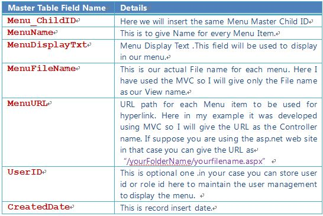
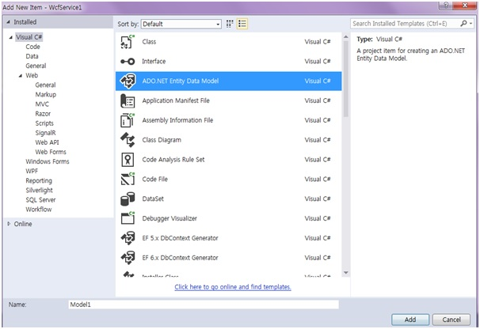
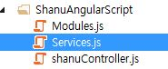
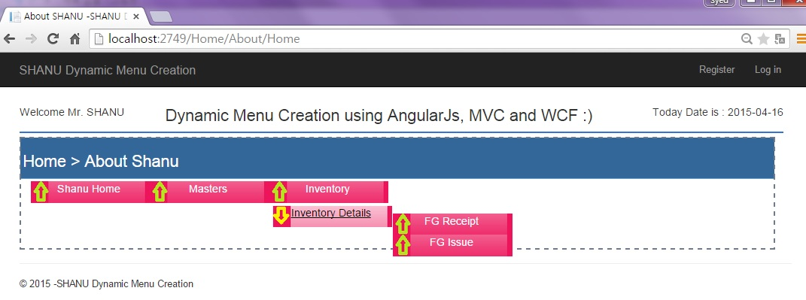
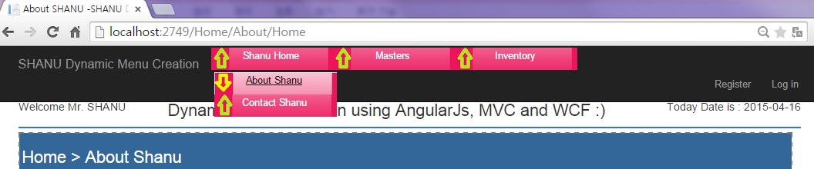

# MVC Dynamic Menu Creation Using AngularJS and WCF Rest
## Requires
- Visual Studio 2013
## License
- MIT
## Technologies
- WCF
- ASP.NET MVC
- AngularJS
## Topics
- WCF
- ASP.NET MVC
- AngularJS
- WCF Rest Service
## Updated
- 01/06/2016
## Description

<h1>Introduction</h1>

<em></em>

<em>&nbsp;&nbsp;This article shows how to create a menu dynamically from a database using AngularJS, MVC and WCF Rest service.</em>

<h4 style="outline:0px; color:#333333; text-transform:none; line-height:21px; text-indent:0px; letter-spacing:normal; font-family:Roboto,sans-serif; font-size:14px; font-style:normal; font-variant:normal; word-spacing:0px; white-space:normal; widows:1; background-color:#ffffff">
<strong style="outline:0px">Why we need to create a Dynamic Menu</strong></h4>

If we are working on a simple web site creation with very few pages and only one programmer is working to create a website then in that case we can create a static menu and use it in our web site.

Let's now consider we need to work for a big web application project. Let's consider development of an ERP Web application.

However if more than two developers are working and perhaps the number&nbsp;of pages is greater than 50 to 100 then it will be hard to maintain a static menu.

And also there will be a greater chance of removing and adding a new menu item to the web project, for example our client can ask to add 5 more new menus or remove 1 menu item.

In this case it will be a hard and difficult task to remove the menu Items that are live now.

And also for large web projects like ERP we need to display the menu depending on the user roles. If we use a static menu then it will be very difficult to manage the users for the menu.

To avoid all this we create a Menu Management with a user role setting.

<strong style="outline:0px">Who can manage the Menu</strong>

This is a very important part since an Admin or Super user can Add/Edit/Delete a menu and a user.

When an Admin is logged in he can add a new menu, edit an existing menu and delete a menu item to be displayed.

This article is not focused on menu management but in this article we will see in detail how to create a Menu Master and Menu Detail Table. Insert a sample Menu Item to our Database Tables. Display the Menu from the database dynamically to our MVC Web page
 using AngularJS and WCF Rest Service.&nbsp;This article will explain:

<ol style="font:14px/21px Roboto,sans-serif; outline:0px; color:#333333; text-transform:none; text-indent:0px; letter-spacing:normal; word-spacing:0px; white-space:normal; widows:1; background-color:#ffffff">
<li style="outline:0px">How to create a WCF Rest service and retrieve data from a database.
</li><li style="outline:0px">How to install the AngularJS Package into a MVC application.
</li><li style="outline:0px">How to create our AngularJS application for Dynamic Menu Creation.
</li><li style="outline:0px">How to use a WCS service in AngularJS to display dynamic Menu.
</li></ol>

<strong style="outline:0px">Note:</strong>&nbsp;the prerequisites are Visual Studio 2013 (if you don't have Visual Studio 2013, you can download it from&nbsp;<a href="http://www.visualstudio.com/en-us/products/visual-studio-community-vs" target="_blank" style="outline:0px; text-decoration:none">Microsoft</a>.(You
 can download latest Visual Studio 2015 and use for the same). 
Here we can see some basics and reference links for Windows Communication Foundation (WCF). WCF is a framework for building service-oriented applications. 
<strong style="outline:0px"> 
<strong style="outline:0px">Service-oriented application:&nbsp;</strong></strong>Using this protocol the service can be shared and used over a network. 
 
For example, let's consider that we are now working on a project and we need to create some common database function and those functions need to be used in multiple projects and the projects are in multiple places and connected via a network such as the internet. 
 
In this case we can create a WCF service and we can write all our common database functions in our WCF service class. We can deploy our WCF in IIS and use the URL in our application to do DB functions. In the code part let's see how to create a WCF REST service
 and use it in our AngularJS application.&nbsp; 
 
If you are interested in reading more details about WCF then kindly go to this&nbsp;<a href="https://msdn.microsoft.com/en-in/library/dd203052.aspx" target="_blank" style="outline:0px; text-decoration:none">link</a>. 
 
<strong style="outline:0px">AngularJS&nbsp;</strong><strong style="outline:0px"> 
</strong> 
We might be be familiar with what Model, View and View Model (MVVM) is and what Model, View and Controller (MVC) is. AngularJS is a JavaScript framework that is purely based on HTML, CSS and JavaScript. 
 
Similar to the MVC and MVVM patterns AngularJS uses the Model, View and Whatever (MVW) pattern. 
 
In our example I have used a Model, View and Service. In the code part let's see how to install and create AngularJS in our MVC application.&nbsp; 
 
If you are interested in reading more details about AngularJS then kindly go to this link.

<h1>Building the Sample</h1>

We will create a&nbsp;MenuMaster&nbsp;MenuDetails&nbsp;table under
 the Database MenuDB.

Note: The MenuMaster and MenuDetail are the important tables that will use to load our menu dynamically. We need to understand how to insert menu details to these tables to display our menu properly.

In this article I have displayed a 3-level hierarchical display of menus. Here you can see the 3-level hierarchical sample.

&nbsp;&nbsp;

Here we can see that the first level of the hierarchy is the Inventory.

The 3rd&nbsp;level of the hierarchy is the Finished Goods Receipt and Finished Goods Issue.

Now let's see how to create a table relationship to create the master and detail menus.

<strong style="outline:0px">Menu Master Table</strong>

<ul style="font:14px/21px Roboto,sans-serif; outline:0px; color:#333333; text-transform:none; text-indent:0px; letter-spacing:normal; word-spacing:0px; white-space:normal; widows:1; background-color:#ffffff">
<li style="outline:0px"><strong style="outline:0px">1st Level hierarchy Insert</strong>
</li></ul>

SQL

Edit|Remove

mysql
<pre class="hidden">Insert into MenuMaster(Menu_RootID,Menu_ChildID,UserID,CreatedDate) values('Root','Inventory','Shanu',getdate()-23) </pre>

<pre class="mysql">InsertintoMenuMaster(Menu_RootID,Menu_ChildID,UserID,CreatedDate)&nbsp;values('Root','Inventory','Shanu',getdate()-23)&nbsp;</pre>

<ul style="font:14px/21px Roboto,sans-serif; outline:0px; color:#333333; text-transform:none; text-indent:0px; letter-spacing:normal; word-spacing:0px; white-space:normal; widows:1; background-color:#ffffff">
<li style="outline:0px"><strong style="outline:0px">2nd Level hierarchies Insert</strong>
</li></ul>

<strong>

SQL

Edit|Remove

mysql
<pre class="hidden">Insert into MenuMaster(Menu_RootID,Menu_ChildID,UserID,CreatedDate) values('Inventory','INV001','Shanu',getdate()-23) </pre>

<pre class="mysql">InsertintoMenuMaster(Menu_RootID,Menu_ChildID,UserID,CreatedDate)&nbsp;values('Inventory','INV001','Shanu',getdate()-23)&nbsp;</pre>

</strong>

<ul style="font:14px/21px Roboto,sans-serif; outline:0px; color:#333333; text-transform:none; text-indent:0px; letter-spacing:normal; word-spacing:0px; white-space:normal; widows:1; background-color:#ffffff">
<li style="outline:0px"><strong style="outline:0px">3rd Level hierarchies Insert</strong>
</li></ul>

<strong>

SQL

Edit|Remove

mysql
<pre class="hidden">Insert into MenuMaster(Menu_RootID,Menu_ChildID,UserID,CreatedDate) values('INV001','FG001','Shanu',getdate()-23)  
  
Insert into MenuMaster(Menu_RootID,Menu_ChildID,UserID,CreatedDate) values('INV001','FG002','Shanu',getdate()-23)  </pre>

<pre class="js">Insert&nbsp;into&nbsp;MenuMaster(Menu_RootID,Menu_ChildID,UserID,CreatedDate)&nbsp;values('INV001','FG001','Shanu',getdate()-23)&nbsp;&nbsp;&nbsp;
&nbsp;&nbsp;&nbsp;
Insert&nbsp;into&nbsp;MenuMaster(Menu_RootID,Menu_ChildID,UserID,CreatedDate)&nbsp;values('INV001','FG002','Shanu',getdate()-23)&nbsp;&nbsp;</pre>

&nbsp;

Here we can see the fields
 for the Menu Master. I have used the following fields:</strong>

<strong></strong>

<strong style="outline:0px">Menu Detail Table</strong>

<ul style="font:14px/21px Roboto,sans-serif; outline:0px; color:#333333; text-transform:none; text-indent:0px; letter-spacing:normal; word-spacing:0px; white-space:normal; widows:1; background-color:#ffffff">
<li style="outline:0px"><strong style="outline:0px">1st Level hierarchy Insert</strong>
</li></ul>

SQL

Edit|Remove

mysql
<pre class="hidden">Insert into MenuDetails(Menu_ChildID,MenuName,MenuDisplayTxt,MenuFileName,  
MenuURL,UserID,CreatedDate)  
values('Inventory','Inventory','Inventory','Index','Inventory',  
'Shanu',getdate()-23)  </pre>

<pre class="js">Insert&nbsp;into&nbsp;MenuDetails(Menu_ChildID,MenuName,MenuDisplayTxt,MenuFileName,&nbsp;&nbsp;&nbsp;
MenuURL,UserID,CreatedDate)&nbsp;&nbsp;&nbsp;
values('Inventory','Inventory','Inventory','Index','Inventory',&nbsp;&nbsp;&nbsp;
'Shanu',getdate()-23)&nbsp;&nbsp;</pre>

&nbsp;

<ul style="font:14px/21px Roboto,sans-serif; outline:0px; color:#333333; text-transform:none; text-indent:0px; letter-spacing:normal; word-spacing:0px; white-space:normal; widows:1; background-color:#ffffff">
<li style="outline:0px"><strong style="outline:0px">2nd Level hierarchies Insert</strong>
</li></ul>

SQL

Edit|Remove

mysql
<pre class="hidden">Insert into MenuDetails(Menu_ChildID,MenuName,MenuDisplayTxt,MenuFileName,  
MenuURL,UserID,CreatedDate)  
values('INV001','Inventory','Inventory Details','Index','Inventory',  
'Shanu',getdate()-23)  </pre>

<pre class="js">Insert&nbsp;into&nbsp;MenuDetails(Menu_ChildID,MenuName,MenuDisplayTxt,MenuFileName,&nbsp;&nbsp;&nbsp;
MenuURL,UserID,CreatedDate)&nbsp;&nbsp;&nbsp;
values('INV001','Inventory','Inventory&nbsp;Details','Index','Inventory',&nbsp;&nbsp;&nbsp;
'Shanu',getdate()-23)&nbsp;&nbsp;</pre>

<ul style="font:14px/21px Roboto,sans-serif; outline:0px; color:#333333; text-transform:none; text-indent:0px; letter-spacing:normal; word-spacing:0px; white-space:normal; widows:1; background-color:#ffffff">
<li style="outline:0px"><strong style="outline:0px">3rd Level hierarchies Insert</strong>
</li></ul>
<ul style="font:14px/21px Roboto,sans-serif; outline:0px; color:#333333; text-transform:none; text-indent:0px; letter-spacing:normal; word-spacing:0px; white-space:normal; widows:1; background-color:#ffffff">

SQL

Edit|Remove

mysql
<pre class="hidden">Insert into MenuDetails(Menu_ChildID,MenuName,MenuDisplayTxt,MenuFileName,  
MenuURL,UserID,CreatedDate)  
values('FG001','FGIN','FG Receipt','FGIN','Inventory','Shanu',getdate()-43)  
Insert into MenuDetails(Menu_ChildID,MenuName,MenuDisplayTxt,MenuFileName,  
MenuURL,UserID,CreatedDate)  
values('FG002','FGOUT','FG Issue','FGOUT','Inventory','Shanu',getdate()-13)  </pre>

<pre class="js">Insert&nbsp;into&nbsp;MenuDetails(Menu_ChildID,MenuName,MenuDisplayTxt,MenuFileName,&nbsp;&nbsp;&nbsp;
MenuURL,UserID,CreatedDate)&nbsp;&nbsp;&nbsp;
values('FG001','FGIN','FG&nbsp;Receipt','FGIN','Inventory','Shanu',getdate()-43)&nbsp;&nbsp;&nbsp;
Insert&nbsp;into&nbsp;MenuDetails(Menu_ChildID,MenuName,MenuDisplayTxt,MenuFileName,&nbsp;&nbsp;&nbsp;
MenuURL,UserID,CreatedDate)&nbsp;&nbsp;&nbsp;
values('FG002','FGOUT','FG&nbsp;Issue','FGOUT','Inventory','Shanu',getdate()-13)&nbsp;&nbsp;</pre>

</ul>

Here we can see the
 field for the Menu Detail. I have used the following fields.

&nbsp;

<ul style="font:14px/21px Roboto,sans-serif; outline:0px; color:#333333; text-transform:none; text-indent:0px; letter-spacing:normal; word-spacing:0px; white-space:normal; widows:1; background-color:#ffffff">
The following is the script
 to create a database, table and sample insert query. Run this script in your SQL Server. I have used SQL Server 2012.
</ul>

&nbsp;

SQL

Edit|Remove

mysql
<pre class="hidden">-- =============================================                                  
-- Author      : Shanu                        
-- Create date : 2015-03-20               
-- Description : To Create Database,Table and Sample Insert Query                               
-- Latest 
-- Modifier    : Shanu 
-- Modify date : 2015-03-20                              
-- =============================================  
--Script to create DB,Table and sample Insert data  
USE MASTER  
GO  
-- 1) Check for the Database Exists .If the database is exist then drop and create new DB  
IF EXISTS (SELECT [name] FROM sys.databases WHERE [name] = 'MenuDB' )  
DROP DATABASE MenuDB  
GO  
  
CREATE DATABASE MenuDB  
GO  
  
USE MenuDB  
GO  
  
-- 1) //////////// ToysDetails table  
-- Create Table  ToysDetails ,This table will be used to store the details like Toys Information   
  
IF EXISTS ( SELECT [name] FROM sys.tables WHERE [name] = 'MenuMaster' )  
DROP TABLE MenuMaster  
GO  
  
CREATE TABLE MenuMaster  
(  
   Menu_ID int identity(1,1),  
   Menu_RootID VARCHAR(30)  NOT NULL,  
   Menu_ChildID VARCHAR(30)  NOT NULL,  
   UserID varchar(50),  
   CreatedDate datetime  
CONSTRAINT [PK_MenuMaster] PRIMARY KEY CLUSTERED        
(       
  [Menu_ID] ASC   ,  
  [Menu_RootID] ASC,  
  [Menu_ChildID] ASC    
)WITH (PAD_INDEX  = OFF, STATISTICS_NORECOMPUTE  = OFF, IGNORE_DUP_KEY = OFF, ALLOW_ROW_LOCKS  = ON, ALLOW_PAGE_LOCKS  = ON) ON [PRIMARY]       
) ON [PRIMARY]     
  
GO  
--delete from MenuMaster  
-- Insert the sample records to the ToysDetails Table  
Insert into MenuMaster(Menu_RootID,Menu_ChildID,UserID,CreatedDate) values('Root','Home','Shanu',getdate()-23)  
--Insert into MenuMaster(Menu_RootID,Menu_ChildID,UserID,CreatedDate) values('Home','Home','Shanu',getdate()-23)  
Insert into MenuMaster(Menu_RootID,Menu_ChildID,UserID,CreatedDate) values('Home','About','Shanu',getdate()-23)  
Insert into MenuMaster(Menu_RootID,Menu_ChildID,UserID,CreatedDate) values('Home','Contact','Shanu',getdate()-23)  
  
Insert into MenuMaster(Menu_RootID,Menu_ChildID,UserID,CreatedDate) values('Root','Masters','Shanu',getdate()-23)  
Insert into MenuMaster(Menu_RootID,Menu_ChildID,UserID,CreatedDate) values('Masters','ITM001','Shanu',getdate()-23)  
--Insert into MenuMaster(Menu_RootID,Menu_ChildID,UserID,CreatedDate) values('ITM001','ITM001','Shanu',getdate()-23)  
Insert into MenuMaster(Menu_RootID,Menu_ChildID,UserID,CreatedDate) values('ITM001','ITM002','Shanu',getdate()-23)  
Insert into MenuMaster(Menu_RootID,Menu_ChildID,UserID,CreatedDate) values('ITM001','ITM003','Shanu',getdate()-23)  
Insert into MenuMaster(Menu_RootID,Menu_ChildID,UserID,CreatedDate) values('Masters','CAT001','Shanu',getdate()-23)  
Insert into MenuMaster(Menu_RootID,Menu_ChildID,UserID,CreatedDate) values('CAT001','CAT001','Shanu',getdate()-23)  
Insert into MenuMaster(Menu_RootID,Menu_ChildID,UserID,CreatedDate) values('CAT001','CAT002','Shanu',getdate()-23)  
Insert into MenuMaster(Menu_RootID,Menu_ChildID,UserID,CreatedDate) values('CAT001','CAT003','Shanu',getdate()-23)  
  
  
Insert into MenuMaster(Menu_RootID,Menu_ChildID,UserID,CreatedDate) values('Root','Inventory','Shanu',getdate()-23)  
Insert into MenuMaster(Menu_RootID,Menu_ChildID,UserID,CreatedDate) values('Inventory','INV001','Shanu',getdate()-23)  
Insert into MenuMaster(Menu_RootID,Menu_ChildID,UserID,CreatedDate) values('INV001','FG001','Shanu',getdate()-23)  
Insert into MenuMaster(Menu_RootID,Menu_ChildID,UserID,CreatedDate) values('INV001','FG002','Shanu',getdate()-23)  
  
  
  
select * from MenuMaster  
-- 1) END //  
  
-- 2) Cart Details Table  
IF EXISTS ( SELECT [name] FROM sys.tables WHERE [name] = 'MenuDetails' )  
DROP TABLE MenuDetails  
GO  
  
CREATE TABLE MenuDetails  
(  
   MDetail_ID int identity(1,1),  
   Menu_ChildID VARCHAR(20) NOT NULL,  
   MenuName VARCHAR(100) NOT NULL,  
   MenuDisplayTxt VARCHAR(200) NOT NULL,  
   MenuFileName VARCHAR(100) NOT NULL,   
   MenuURL VARCHAR(500) NOT NULL,  
   USE_YN Char(1) DEFAULT 'Y',  
   UserID varchar(50),  
   CreatedDate datetime  
CONSTRAINT [PK_MenuDetails] PRIMARY KEY CLUSTERED        
(       
  [MDetail_ID] ASC,  
  [Menu_ChildID] ASC         
)WITH (PAD_INDEX  = OFF, STATISTICS_NORECOMPUTE  = OFF, IGNORE_DUP_KEY = OFF, ALLOW_ROW_LOCKS  = ON, ALLOW_PAGE_LOCKS  = ON) ON [PRIMARY]       
) ON [PRIMARY]     
  
GO  
----delete from MenuDetails  
  
Insert into MenuDetails(Menu_ChildID,MenuName,MenuDisplayTxt,MenuFileName,MenuURL,UserID,CreatedDate)   
values('Root','Home','Shanu Home','Index','Home','Shanu',getdate()-23)  
  
Insert into MenuDetails(Menu_ChildID,MenuName,MenuDisplayTxt,MenuFileName,MenuURL,UserID,CreatedDate)   
values('Home','Home','Shanu Home','Index','Home','Shanu',getdate()-23)  
  
Insert into MenuDetails(Menu_ChildID,MenuName,MenuDisplayTxt,MenuFileName,MenuURL,UserID,CreatedDate)   
values('About','About','About Shanu','About','Home','Shanu',getdate()-43)  
  
Insert into MenuDetails(Menu_ChildID,MenuName,MenuDisplayTxt,MenuFileName,MenuURL,UserID,CreatedDate)   
values('Contact','Contact','Contact Shanu','Contact','Home','Shanu',getdate()-13)  
  
Insert into MenuDetails(Menu_ChildID,MenuName,MenuDisplayTxt,MenuFileName,MenuURL,UserID,CreatedDate)   
values('Masters','Masters','Masters','ItemDetails','Masters','Shanu',getdate()-13)  
  
Insert into MenuDetails(Menu_ChildID,MenuName,MenuDisplayTxt,MenuFileName,MenuURL,UserID,CreatedDate)   
values('ITM001','ItemMaster','Item Master','ItemDetails','Masters','Shanu',getdate()-13)  
  
Insert into MenuDetails(Menu_ChildID,MenuName,MenuDisplayTxt,MenuFileName,MenuURL,UserID,CreatedDate)   
values('ITM002','ItemDetail','Item Details','ItemDetails','Masters','Shanu',getdate()-13)  
  
Insert into MenuDetails(Menu_ChildID,MenuName,MenuDisplayTxt,MenuFileName,MenuURL,UserID,CreatedDate)   
values('ITM003','ItemManage','Item Manage','ItemManage','Masters','Shanu',getdate()-13)  
  
  
  
Insert into MenuDetails(Menu_ChildID,MenuName,MenuDisplayTxt,MenuFileName,MenuURL,UserID,CreatedDate)   
values('CAT001','CatMaster','Category Masters','CATDetails','Masters','Shanu',getdate()-13)  
  
Insert into MenuDetails(Menu_ChildID,MenuName,MenuDisplayTxt,MenuFileName,MenuURL,UserID,CreatedDate)   
values('CAT002','CATDetail','Category Details','CATDetails','Masters','Shanu',getdate()-13)  
  
Insert into MenuDetails(Menu_ChildID,MenuName,MenuDisplayTxt,MenuFileName,MenuURL,UserID,CreatedDate)   
values('CAT003','CATManage','Category Manage','CATManage','Masters','Shanu',getdate()-13)  
  
  
  
Insert into MenuDetails(Menu_ChildID,MenuName,MenuDisplayTxt,MenuFileName,MenuURL,UserID,CreatedDate)   
values('Inventory','Inventory','Inventory','Index','Inventory','Shanu',getdate()-23)  
  
Insert into MenuDetails(Menu_ChildID,MenuName,MenuDisplayTxt,MenuFileName,MenuURL,UserID,CreatedDate)   
values('INV001','Inventory','Inventory Details','Index','Inventory','Shanu',getdate()-23)  
  
Insert into MenuDetails(Menu_ChildID,MenuName,MenuDisplayTxt,MenuFileName,MenuURL,UserID,CreatedDate)   
values('FG001','FGIN','FG Receipt','FGIN','Inventory','Shanu',getdate()-43)  
  
Insert into MenuDetails(Menu_ChildID,MenuName,MenuDisplayTxt,MenuFileName,MenuURL,UserID,CreatedDate)   
values('FG002','FGOUT','FG Issue','FGOUT','Inventory','Shanu',getdate()-13)  
  
  
select * from MenuMaster  
  
select * from MenuDetails  
  
        select   A.Menu_RootID,  
                 B.MDetail_ID,  
                 B.Menu_ChildID,  
                 B.MenuName,  
                 B.MenuDisplayTxt,  
                 B.MenuFileName,             
                 B.MenuURL ,             
                 B.UserID                                                        
                 FROM   
                 MenuMaster A  
                 INNER JOIN MenuDetails B  
                 ON A.Menu_ChildID=B.Menu_ChildID </pre>

<pre class="mysql">--&nbsp;=============================================&nbsp;&nbsp;&nbsp;&nbsp;&nbsp;&nbsp;&nbsp;&nbsp;&nbsp;&nbsp;&nbsp;&nbsp;&nbsp;&nbsp;&nbsp;&nbsp;&nbsp;&nbsp;&nbsp;&nbsp;&nbsp;&nbsp;&nbsp;&nbsp;&nbsp;&nbsp;&nbsp;&nbsp;&nbsp;&nbsp;&nbsp;&nbsp;&nbsp;&nbsp;&nbsp;
--&nbsp;Author&nbsp;&nbsp;&nbsp;&nbsp;&nbsp;&nbsp;:&nbsp;Shanu&nbsp;&nbsp;&nbsp;&nbsp;&nbsp;&nbsp;&nbsp;&nbsp;&nbsp;&nbsp;&nbsp;&nbsp;&nbsp;&nbsp;&nbsp;&nbsp;&nbsp;&nbsp;&nbsp;&nbsp;&nbsp;&nbsp;&nbsp;&nbsp;&nbsp;
--&nbsp;Create&nbsp;date&nbsp;:&nbsp;2015-03-20&nbsp;&nbsp;&nbsp;&nbsp;&nbsp;&nbsp;&nbsp;&nbsp;&nbsp;&nbsp;&nbsp;&nbsp;&nbsp;&nbsp;&nbsp;&nbsp;
--&nbsp;Description&nbsp;:&nbsp;To&nbsp;Create&nbsp;Database,Table&nbsp;and&nbsp;Sample&nbsp;Insert&nbsp;Query&nbsp;&nbsp;&nbsp;&nbsp;&nbsp;&nbsp;&nbsp;&nbsp;&nbsp;&nbsp;&nbsp;&nbsp;&nbsp;&nbsp;&nbsp;&nbsp;&nbsp;&nbsp;&nbsp;&nbsp;&nbsp;&nbsp;&nbsp;&nbsp;&nbsp;&nbsp;&nbsp;&nbsp;&nbsp;&nbsp;&nbsp;&nbsp;
--&nbsp;Latest&nbsp;&nbsp;
--&nbsp;Modifier&nbsp;&nbsp;&nbsp;&nbsp;:&nbsp;Shanu&nbsp;&nbsp;
--&nbsp;Modify&nbsp;date&nbsp;:&nbsp;2015-03-20&nbsp;&nbsp;&nbsp;&nbsp;&nbsp;&nbsp;&nbsp;&nbsp;&nbsp;&nbsp;&nbsp;&nbsp;&nbsp;&nbsp;&nbsp;&nbsp;&nbsp;&nbsp;&nbsp;&nbsp;&nbsp;&nbsp;&nbsp;&nbsp;&nbsp;&nbsp;&nbsp;&nbsp;&nbsp;&nbsp;&nbsp;
--&nbsp;=============================================&nbsp;&nbsp;&nbsp;
--Script&nbsp;to&nbsp;create&nbsp;DB,Table&nbsp;and&nbsp;sample&nbsp;Insert&nbsp;data&nbsp;&nbsp;&nbsp;
USE&nbsp;MASTER&nbsp;&nbsp;&nbsp;
GO&nbsp;&nbsp;&nbsp;
--&nbsp;1)&nbsp;Check&nbsp;for&nbsp;the&nbsp;Database&nbsp;Exists&nbsp;.If&nbsp;the&nbsp;database&nbsp;is&nbsp;exist&nbsp;then&nbsp;drop&nbsp;and&nbsp;create&nbsp;new&nbsp;DB&nbsp;&nbsp;&nbsp;
IF&nbsp;EXISTS&nbsp;(SELECT&nbsp;[name]&nbsp;FROM&nbsp;sys.databases&nbsp;WHERE&nbsp;[name]&nbsp;=&nbsp;'MenuDB'&nbsp;)&nbsp;&nbsp;&nbsp;
DROP&nbsp;DATABASE&nbsp;MenuDB&nbsp;&nbsp;&nbsp;
GO&nbsp;&nbsp;&nbsp;
&nbsp;&nbsp;&nbsp;
CREATE&nbsp;DATABASE&nbsp;MenuDB&nbsp;&nbsp;&nbsp;
GO&nbsp;&nbsp;&nbsp;
&nbsp;&nbsp;&nbsp;
USE&nbsp;MenuDB&nbsp;&nbsp;&nbsp;
GO&nbsp;&nbsp;&nbsp;
&nbsp;&nbsp;&nbsp;
--&nbsp;1)&nbsp;////////////&nbsp;ToysDetails&nbsp;table&nbsp;&nbsp;&nbsp;
--&nbsp;Create&nbsp;Table&nbsp;&nbsp;ToysDetails&nbsp;,This&nbsp;table&nbsp;will&nbsp;be&nbsp;used&nbsp;to&nbsp;store&nbsp;the&nbsp;details&nbsp;like&nbsp;Toys&nbsp;Information&nbsp;&nbsp;&nbsp;&nbsp;
&nbsp;&nbsp;&nbsp;
IF&nbsp;EXISTS&nbsp;(&nbsp;SELECT&nbsp;[name]&nbsp;FROM&nbsp;sys.tables&nbsp;WHERE&nbsp;[name]&nbsp;=&nbsp;'MenuMaster'&nbsp;)&nbsp;&nbsp;&nbsp;
DROP&nbsp;TABLE&nbsp;MenuMaster&nbsp;&nbsp;&nbsp;
GO&nbsp;&nbsp;&nbsp;
&nbsp;&nbsp;&nbsp;
CREATE&nbsp;TABLE&nbsp;MenuMaster&nbsp;&nbsp;&nbsp;
(&nbsp;&nbsp;&nbsp;
&nbsp;&nbsp;&nbsp;Menu_ID&nbsp;int&nbsp;identity(1,1),&nbsp;&nbsp;&nbsp;
&nbsp;&nbsp;&nbsp;Menu_RootID&nbsp;VARCHAR(30)&nbsp;&nbsp;NOT&nbsp;NULL,&nbsp;&nbsp;&nbsp;
&nbsp;&nbsp;&nbsp;Menu_ChildID&nbsp;VARCHAR(30)&nbsp;&nbsp;NOT&nbsp;NULL,&nbsp;&nbsp;&nbsp;
&nbsp;&nbsp;&nbsp;UserID&nbsp;varchar(50),&nbsp;&nbsp;&nbsp;
&nbsp;&nbsp;&nbsp;CreatedDate&nbsp;datetime&nbsp;&nbsp;&nbsp;
CONSTRAINT&nbsp;[PK_MenuMaster]&nbsp;PRIMARY&nbsp;KEY&nbsp;CLUSTERED&nbsp;&nbsp;&nbsp;&nbsp;&nbsp;&nbsp;&nbsp;&nbsp;&nbsp;
(&nbsp;&nbsp;&nbsp;&nbsp;&nbsp;&nbsp;&nbsp;&nbsp;
&nbsp;&nbsp;[Menu_ID]&nbsp;ASC&nbsp;&nbsp;&nbsp;,&nbsp;&nbsp;&nbsp;
&nbsp;&nbsp;[Menu_RootID]&nbsp;ASC,&nbsp;&nbsp;&nbsp;
&nbsp;&nbsp;[Menu_ChildID]&nbsp;ASC&nbsp;&nbsp;&nbsp;&nbsp;&nbsp;
)WITH&nbsp;(PAD_INDEX&nbsp;&nbsp;=&nbsp;OFF,&nbsp;STATISTICS_NORECOMPUTE&nbsp;&nbsp;=&nbsp;OFF,&nbsp;IGNORE_DUP_KEY&nbsp;=&nbsp;OFF,&nbsp;ALLOW_ROW_LOCKS&nbsp;&nbsp;=&nbsp;ON,&nbsp;ALLOW_PAGE_LOCKS&nbsp;&nbsp;=&nbsp;ON)&nbsp;ON&nbsp;[PRIMARY]&nbsp;&nbsp;&nbsp;&nbsp;&nbsp;&nbsp;&nbsp;&nbsp;
)&nbsp;ON&nbsp;[PRIMARY]&nbsp;&nbsp;&nbsp;&nbsp;&nbsp;&nbsp;
&nbsp;&nbsp;&nbsp;
GO&nbsp;&nbsp;&nbsp;
--delete&nbsp;from&nbsp;MenuMaster&nbsp;&nbsp;&nbsp;
--&nbsp;Insert&nbsp;the&nbsp;sample&nbsp;records&nbsp;to&nbsp;the&nbsp;ToysDetails&nbsp;Table&nbsp;&nbsp;&nbsp;
Insert&nbsp;into&nbsp;MenuMaster(Menu_RootID,Menu_ChildID,UserID,CreatedDate)&nbsp;values('Root','Home','Shanu',getdate()-23)&nbsp;&nbsp;&nbsp;
--Insert&nbsp;into&nbsp;MenuMaster(Menu_RootID,Menu_ChildID,UserID,CreatedDate)&nbsp;values('Home','Home','Shanu',getdate()-23)&nbsp;&nbsp;&nbsp;
Insert&nbsp;into&nbsp;MenuMaster(Menu_RootID,Menu_ChildID,UserID,CreatedDate)&nbsp;values('Home','About','Shanu',getdate()-23)&nbsp;&nbsp;&nbsp;
Insert&nbsp;into&nbsp;MenuMaster(Menu_RootID,Menu_ChildID,UserID,CreatedDate)&nbsp;values('Home','Contact','Shanu',getdate()-23)&nbsp;&nbsp;&nbsp;
&nbsp;&nbsp;&nbsp;
Insert&nbsp;into&nbsp;MenuMaster(Menu_RootID,Menu_ChildID,UserID,CreatedDate)&nbsp;values('Root','Masters','Shanu',getdate()-23)&nbsp;&nbsp;&nbsp;
Insert&nbsp;into&nbsp;MenuMaster(Menu_RootID,Menu_ChildID,UserID,CreatedDate)&nbsp;values('Masters','ITM001','Shanu',getdate()-23)&nbsp;&nbsp;&nbsp;
--Insert&nbsp;into&nbsp;MenuMaster(Menu_RootID,Menu_ChildID,UserID,CreatedDate)&nbsp;values('ITM001','ITM001','Shanu',getdate()-23)&nbsp;&nbsp;&nbsp;
Insert&nbsp;into&nbsp;MenuMaster(Menu_RootID,Menu_ChildID,UserID,CreatedDate)&nbsp;values('ITM001','ITM002','Shanu',getdate()-23)&nbsp;&nbsp;&nbsp;
Insert&nbsp;into&nbsp;MenuMaster(Menu_RootID,Menu_ChildID,UserID,CreatedDate)&nbsp;values('ITM001','ITM003','Shanu',getdate()-23)&nbsp;&nbsp;&nbsp;
Insert&nbsp;into&nbsp;MenuMaster(Menu_RootID,Menu_ChildID,UserID,CreatedDate)&nbsp;values('Masters','CAT001','Shanu',getdate()-23)&nbsp;&nbsp;&nbsp;
Insert&nbsp;into&nbsp;MenuMaster(Menu_RootID,Menu_ChildID,UserID,CreatedDate)&nbsp;values('CAT001','CAT001','Shanu',getdate()-23)&nbsp;&nbsp;&nbsp;
Insert&nbsp;into&nbsp;MenuMaster(Menu_RootID,Menu_ChildID,UserID,CreatedDate)&nbsp;values('CAT001','CAT002','Shanu',getdate()-23)&nbsp;&nbsp;&nbsp;
Insert&nbsp;into&nbsp;MenuMaster(Menu_RootID,Menu_ChildID,UserID,CreatedDate)&nbsp;values('CAT001','CAT003','Shanu',getdate()-23)&nbsp;&nbsp;&nbsp;
&nbsp;&nbsp;&nbsp;
&nbsp;&nbsp;&nbsp;
Insert&nbsp;into&nbsp;MenuMaster(Menu_RootID,Menu_ChildID,UserID,CreatedDate)&nbsp;values('Root','Inventory','Shanu',getdate()-23)&nbsp;&nbsp;&nbsp;
Insert&nbsp;into&nbsp;MenuMaster(Menu_RootID,Menu_ChildID,UserID,CreatedDate)&nbsp;values('Inventory','INV001','Shanu',getdate()-23)&nbsp;&nbsp;&nbsp;
Insert&nbsp;into&nbsp;MenuMaster(Menu_RootID,Menu_ChildID,UserID,CreatedDate)&nbsp;values('INV001','FG001','Shanu',getdate()-23)&nbsp;&nbsp;&nbsp;
Insert&nbsp;into&nbsp;MenuMaster(Menu_RootID,Menu_ChildID,UserID,CreatedDate)&nbsp;values('INV001','FG002','Shanu',getdate()-23)&nbsp;&nbsp;&nbsp;
&nbsp;&nbsp;&nbsp;
&nbsp;&nbsp;&nbsp;
&nbsp;&nbsp;&nbsp;
select&nbsp;*&nbsp;from&nbsp;MenuMaster&nbsp;&nbsp;&nbsp;
--&nbsp;1)&nbsp;END&nbsp;//&nbsp;&nbsp;&nbsp;
&nbsp;&nbsp;&nbsp;
--&nbsp;2)&nbsp;Cart&nbsp;Details&nbsp;Table&nbsp;&nbsp;&nbsp;
IF&nbsp;EXISTS&nbsp;(&nbsp;SELECT&nbsp;[name]&nbsp;FROM&nbsp;sys.tables&nbsp;WHERE&nbsp;[name]&nbsp;=&nbsp;'MenuDetails'&nbsp;)&nbsp;&nbsp;&nbsp;
DROP&nbsp;TABLE&nbsp;MenuDetails&nbsp;&nbsp;&nbsp;
GO&nbsp;&nbsp;&nbsp;
&nbsp;&nbsp;&nbsp;
CREATE&nbsp;TABLE&nbsp;MenuDetails&nbsp;&nbsp;&nbsp;
(&nbsp;&nbsp;&nbsp;
&nbsp;&nbsp;&nbsp;MDetail_ID&nbsp;int&nbsp;identity(1,1),&nbsp;&nbsp;&nbsp;
&nbsp;&nbsp;&nbsp;Menu_ChildID&nbsp;VARCHAR(20)&nbsp;NOT&nbsp;NULL,&nbsp;&nbsp;&nbsp;
&nbsp;&nbsp;&nbsp;MenuName&nbsp;VARCHAR(100)&nbsp;NOT&nbsp;NULL,&nbsp;&nbsp;&nbsp;
&nbsp;&nbsp;&nbsp;MenuDisplayTxt&nbsp;VARCHAR(200)&nbsp;NOT&nbsp;NULL,&nbsp;&nbsp;&nbsp;
&nbsp;&nbsp;&nbsp;MenuFileName&nbsp;VARCHAR(100)&nbsp;NOT&nbsp;NULL,&nbsp;&nbsp;&nbsp;&nbsp;
&nbsp;&nbsp;&nbsp;MenuURL&nbsp;VARCHAR(500)&nbsp;NOT&nbsp;NULL,&nbsp;&nbsp;&nbsp;
&nbsp;&nbsp;&nbsp;USE_YN&nbsp;Char(1)&nbsp;DEFAULT&nbsp;'Y',&nbsp;&nbsp;&nbsp;
&nbsp;&nbsp;&nbsp;UserID&nbsp;varchar(50),&nbsp;&nbsp;&nbsp;
&nbsp;&nbsp;&nbsp;CreatedDate&nbsp;datetime&nbsp;&nbsp;&nbsp;
CONSTRAINT&nbsp;[PK_MenuDetails]&nbsp;PRIMARY&nbsp;KEY&nbsp;CLUSTERED&nbsp;&nbsp;&nbsp;&nbsp;&nbsp;&nbsp;&nbsp;&nbsp;&nbsp;
(&nbsp;&nbsp;&nbsp;&nbsp;&nbsp;&nbsp;&nbsp;&nbsp;
&nbsp;&nbsp;[MDetail_ID]&nbsp;ASC,&nbsp;&nbsp;&nbsp;
&nbsp;&nbsp;[Menu_ChildID]&nbsp;ASC&nbsp;&nbsp;&nbsp;&nbsp;&nbsp;&nbsp;&nbsp;&nbsp;&nbsp;&nbsp;
)WITH&nbsp;(PAD_INDEX&nbsp;&nbsp;=&nbsp;OFF,&nbsp;STATISTICS_NORECOMPUTE&nbsp;&nbsp;=&nbsp;OFF,&nbsp;IGNORE_DUP_KEY&nbsp;=&nbsp;OFF,&nbsp;ALLOW_ROW_LOCKS&nbsp;&nbsp;=&nbsp;ON,&nbsp;ALLOW_PAGE_LOCKS&nbsp;&nbsp;=&nbsp;ON)&nbsp;ON&nbsp;[PRIMARY]&nbsp;&nbsp;&nbsp;&nbsp;&nbsp;&nbsp;&nbsp;&nbsp;
)&nbsp;ON&nbsp;[PRIMARY]&nbsp;&nbsp;&nbsp;&nbsp;&nbsp;&nbsp;
&nbsp;&nbsp;&nbsp;
GO&nbsp;&nbsp;&nbsp;
----delete&nbsp;from&nbsp;MenuDetails&nbsp;&nbsp;&nbsp;
&nbsp;&nbsp;&nbsp;
Insert&nbsp;into&nbsp;MenuDetails(Menu_ChildID,MenuName,MenuDisplayTxt,MenuFileName,MenuURL,UserID,CreatedDate)&nbsp;&nbsp;&nbsp;&nbsp;
values('Root','Home','Shanu&nbsp;Home','Index','Home','Shanu',getdate()-23)&nbsp;&nbsp;&nbsp;
&nbsp;&nbsp;&nbsp;
Insert&nbsp;into&nbsp;MenuDetails(Menu_ChildID,MenuName,MenuDisplayTxt,MenuFileName,MenuURL,UserID,CreatedDate)&nbsp;&nbsp;&nbsp;&nbsp;
values('Home','Home','Shanu&nbsp;Home','Index','Home','Shanu',getdate()-23)&nbsp;&nbsp;&nbsp;
&nbsp;&nbsp;&nbsp;
Insert&nbsp;into&nbsp;MenuDetails(Menu_ChildID,MenuName,MenuDisplayTxt,MenuFileName,MenuURL,UserID,CreatedDate)&nbsp;&nbsp;&nbsp;&nbsp;
values('About','About','About&nbsp;Shanu','About','Home','Shanu',getdate()-43)&nbsp;&nbsp;&nbsp;
&nbsp;&nbsp;&nbsp;
Insert&nbsp;into&nbsp;MenuDetails(Menu_ChildID,MenuName,MenuDisplayTxt,MenuFileName,MenuURL,UserID,CreatedDate)&nbsp;&nbsp;&nbsp;&nbsp;
values('Contact','Contact','Contact&nbsp;Shanu','Contact','Home','Shanu',getdate()-13)&nbsp;&nbsp;&nbsp;
&nbsp;&nbsp;&nbsp;
Insert&nbsp;into&nbsp;MenuDetails(Menu_ChildID,MenuName,MenuDisplayTxt,MenuFileName,MenuURL,UserID,CreatedDate)&nbsp;&nbsp;&nbsp;&nbsp;
values('Masters','Masters','Masters','ItemDetails','Masters','Shanu',getdate()-13)&nbsp;&nbsp;&nbsp;
&nbsp;&nbsp;&nbsp;
Insert&nbsp;into&nbsp;MenuDetails(Menu_ChildID,MenuName,MenuDisplayTxt,MenuFileName,MenuURL,UserID,CreatedDate)&nbsp;&nbsp;&nbsp;&nbsp;
values('ITM001','ItemMaster','Item&nbsp;Master','ItemDetails','Masters','Shanu',getdate()-13)&nbsp;&nbsp;&nbsp;
&nbsp;&nbsp;&nbsp;
Insert&nbsp;into&nbsp;MenuDetails(Menu_ChildID,MenuName,MenuDisplayTxt,MenuFileName,MenuURL,UserID,CreatedDate)&nbsp;&nbsp;&nbsp;&nbsp;
values('ITM002','ItemDetail','Item&nbsp;Details','ItemDetails','Masters','Shanu',getdate()-13)&nbsp;&nbsp;&nbsp;
&nbsp;&nbsp;&nbsp;
Insert&nbsp;into&nbsp;MenuDetails(Menu_ChildID,MenuName,MenuDisplayTxt,MenuFileName,MenuURL,UserID,CreatedDate)&nbsp;&nbsp;&nbsp;&nbsp;
values('ITM003','ItemManage','Item&nbsp;Manage','ItemManage','Masters','Shanu',getdate()-13)&nbsp;&nbsp;&nbsp;
&nbsp;&nbsp;&nbsp;
&nbsp;&nbsp;&nbsp;
&nbsp;&nbsp;&nbsp;
Insert&nbsp;into&nbsp;MenuDetails(Menu_ChildID,MenuName,MenuDisplayTxt,MenuFileName,MenuURL,UserID,CreatedDate)&nbsp;&nbsp;&nbsp;&nbsp;
values('CAT001','CatMaster','Category&nbsp;Masters','CATDetails','Masters','Shanu',getdate()-13)&nbsp;&nbsp;&nbsp;
&nbsp;&nbsp;&nbsp;
Insert&nbsp;into&nbsp;MenuDetails(Menu_ChildID,MenuName,MenuDisplayTxt,MenuFileName,MenuURL,UserID,CreatedDate)&nbsp;&nbsp;&nbsp;&nbsp;
values('CAT002','CATDetail','Category&nbsp;Details','CATDetails','Masters','Shanu',getdate()-13)&nbsp;&nbsp;&nbsp;
&nbsp;&nbsp;&nbsp;
Insert&nbsp;into&nbsp;MenuDetails(Menu_ChildID,MenuName,MenuDisplayTxt,MenuFileName,MenuURL,UserID,CreatedDate)&nbsp;&nbsp;&nbsp;&nbsp;
values('CAT003','CATManage','Category&nbsp;Manage','CATManage','Masters','Shanu',getdate()-13)&nbsp;&nbsp;&nbsp;
&nbsp;&nbsp;&nbsp;
&nbsp;&nbsp;&nbsp;
&nbsp;&nbsp;&nbsp;
Insert&nbsp;into&nbsp;MenuDetails(Menu_ChildID,MenuName,MenuDisplayTxt,MenuFileName,MenuURL,UserID,CreatedDate)&nbsp;&nbsp;&nbsp;&nbsp;
values('Inventory','Inventory','Inventory','Index','Inventory','Shanu',getdate()-23)&nbsp;&nbsp;&nbsp;
&nbsp;&nbsp;&nbsp;
Insert&nbsp;into&nbsp;MenuDetails(Menu_ChildID,MenuName,MenuDisplayTxt,MenuFileName,MenuURL,UserID,CreatedDate)&nbsp;&nbsp;&nbsp;&nbsp;
values('INV001','Inventory','Inventory&nbsp;Details','Index','Inventory','Shanu',getdate()-23)&nbsp;&nbsp;&nbsp;
&nbsp;&nbsp;&nbsp;
Insert&nbsp;into&nbsp;MenuDetails(Menu_ChildID,MenuName,MenuDisplayTxt,MenuFileName,MenuURL,UserID,CreatedDate)&nbsp;&nbsp;&nbsp;&nbsp;
values('FG001','FGIN','FG&nbsp;Receipt','FGIN','Inventory','Shanu',getdate()-43)&nbsp;&nbsp;&nbsp;
&nbsp;&nbsp;&nbsp;
Insert&nbsp;into&nbsp;MenuDetails(Menu_ChildID,MenuName,MenuDisplayTxt,MenuFileName,MenuURL,UserID,CreatedDate)&nbsp;&nbsp;&nbsp;&nbsp;
values('FG002','FGOUT','FG&nbsp;Issue','FGOUT','Inventory','Shanu',getdate()-13)&nbsp;&nbsp;&nbsp;
&nbsp;&nbsp;&nbsp;
&nbsp;&nbsp;&nbsp;
select&nbsp;*&nbsp;from&nbsp;MenuMaster&nbsp;&nbsp;&nbsp;
&nbsp;&nbsp;&nbsp;
select&nbsp;*&nbsp;from&nbsp;MenuDetails&nbsp;&nbsp;&nbsp;
&nbsp;&nbsp;&nbsp;
&nbsp;&nbsp;&nbsp;&nbsp;&nbsp;&nbsp;&nbsp;&nbsp;select&nbsp;&nbsp;&nbsp;A.Menu_RootID,&nbsp;&nbsp;&nbsp;
&nbsp;&nbsp;&nbsp;&nbsp;&nbsp;&nbsp;&nbsp;&nbsp;&nbsp;&nbsp;&nbsp;&nbsp;&nbsp;&nbsp;&nbsp;&nbsp;&nbsp;B.MDetail_ID,&nbsp;&nbsp;&nbsp;
&nbsp;&nbsp;&nbsp;&nbsp;&nbsp;&nbsp;&nbsp;&nbsp;&nbsp;&nbsp;&nbsp;&nbsp;&nbsp;&nbsp;&nbsp;&nbsp;&nbsp;B.Menu_ChildID,&nbsp;&nbsp;&nbsp;
&nbsp;&nbsp;&nbsp;&nbsp;&nbsp;&nbsp;&nbsp;&nbsp;&nbsp;&nbsp;&nbsp;&nbsp;&nbsp;&nbsp;&nbsp;&nbsp;&nbsp;B.MenuName,&nbsp;&nbsp;&nbsp;
&nbsp;&nbsp;&nbsp;&nbsp;&nbsp;&nbsp;&nbsp;&nbsp;&nbsp;&nbsp;&nbsp;&nbsp;&nbsp;&nbsp;&nbsp;&nbsp;&nbsp;B.MenuDisplayTxt,&nbsp;&nbsp;&nbsp;
&nbsp;&nbsp;&nbsp;&nbsp;&nbsp;&nbsp;&nbsp;&nbsp;&nbsp;&nbsp;&nbsp;&nbsp;&nbsp;&nbsp;&nbsp;&nbsp;&nbsp;B.MenuFileName,&nbsp;&nbsp;&nbsp;&nbsp;&nbsp;&nbsp;&nbsp;&nbsp;&nbsp;&nbsp;&nbsp;&nbsp;&nbsp;&nbsp;
&nbsp;&nbsp;&nbsp;&nbsp;&nbsp;&nbsp;&nbsp;&nbsp;&nbsp;&nbsp;&nbsp;&nbsp;&nbsp;&nbsp;&nbsp;&nbsp;&nbsp;B.MenuURL&nbsp;,&nbsp;&nbsp;&nbsp;&nbsp;&nbsp;&nbsp;&nbsp;&nbsp;&nbsp;&nbsp;&nbsp;&nbsp;&nbsp;&nbsp;
&nbsp;&nbsp;&nbsp;&nbsp;&nbsp;&nbsp;&nbsp;&nbsp;&nbsp;&nbsp;&nbsp;&nbsp;&nbsp;&nbsp;&nbsp;&nbsp;&nbsp;B.UserID&nbsp;&nbsp;&nbsp;&nbsp;&nbsp;&nbsp;&nbsp;&nbsp;&nbsp;&nbsp;&nbsp;&nbsp;&nbsp;&nbsp;&nbsp;&nbsp;&nbsp;&nbsp;&nbsp;&nbsp;&nbsp;&nbsp;&nbsp;&nbsp;&nbsp;&nbsp;&nbsp;&nbsp;&nbsp;&nbsp;&nbsp;&nbsp;&nbsp;&nbsp;&nbsp;&nbsp;&nbsp;&nbsp;&nbsp;&nbsp;&nbsp;&nbsp;&nbsp;&nbsp;&nbsp;&nbsp;&nbsp;&nbsp;&nbsp;&nbsp;&nbsp;&nbsp;&nbsp;&nbsp;&nbsp;&nbsp;&nbsp;
&nbsp;&nbsp;&nbsp;&nbsp;&nbsp;&nbsp;&nbsp;&nbsp;&nbsp;&nbsp;&nbsp;&nbsp;&nbsp;&nbsp;&nbsp;&nbsp;&nbsp;FROM&nbsp;&nbsp;&nbsp;&nbsp;
&nbsp;&nbsp;&nbsp;&nbsp;&nbsp;&nbsp;&nbsp;&nbsp;&nbsp;&nbsp;&nbsp;&nbsp;&nbsp;&nbsp;&nbsp;&nbsp;&nbsp;MenuMaster&nbsp;A&nbsp;&nbsp;&nbsp;
&nbsp;&nbsp;&nbsp;&nbsp;&nbsp;&nbsp;&nbsp;&nbsp;&nbsp;&nbsp;&nbsp;&nbsp;&nbsp;&nbsp;&nbsp;&nbsp;&nbsp;INNER&nbsp;JOIN&nbsp;MenuDetails&nbsp;B&nbsp;&nbsp;&nbsp;
&nbsp;&nbsp;&nbsp;&nbsp;&nbsp;&nbsp;&nbsp;&nbsp;&nbsp;&nbsp;&nbsp;&nbsp;&nbsp;&nbsp;&nbsp;&nbsp;&nbsp;ON&nbsp;A.Menu_ChildID=B.Menu_ChildID&nbsp;</pre>

&nbsp;Description

<em>Now we have created our Tables lest start with creating WCF Rest service to access the data abd display in our Angular JS MVC page.
<ul style="font:14px/21px Roboto,sans-serif; outline:0px; color:#333333; text-transform:none; text-indent:0px; letter-spacing:normal; word-spacing:0px; white-space:normal; widows:1; background-color:#ffffff">
<li style="outline:0px"><strong style="outline:0px">Create WCF REST Service</strong>
</li></ul>

Open Visual Studio 2013 then select &quot;File&quot; -&gt; &quot;New&quot; -&gt; &quot;Project...&quot; then select WCF Service Application then select your project path and name your WCF service and click OK.

</em>

<h1></h1>
<h1>Once we have
 created the WCF Service we can see &ldquo;IService.CS&rdquo; and &ldquo;Service1.svc&rdquo; in the Solution Explorer as in the following.</h1>
<h1></h1>
<ul type="disc" style="font:14px/21px Roboto,sans-serif; outline:0px; color:#333333; text-transform:none; text-indent:0px; letter-spacing:normal; word-spacing:0px; white-space:normal; widows:1; background-color:#ffffff">
<li style="outline:0px"><strong style="outline:0px">IService.CS</strong>: In &ldquo;<strong style="outline:0px">IService.CS</strong>&rdquo;
 we can see 3 contracts by default. </li><li style="outline:0px">[<strong style="outline:0px">ServiceContract</strong>]: Describes the methods or any operations available for the service. The Service Contract
 is an interface and methods can be declared inside the Service Interface using the Operation Contract attribute.
</li><li style="outline:0px">[<strong style="outline:0px">OperationContract</strong>]: is similar to the web service [WEBMETHOD].
</li><li style="outline:0px">[<strong style="outline:0px">DataContract</strong>]: describes the data exchange between the client and the service.
</li><li style="outline:0px">[<strong style="outline:0px">ServiceContract</strong>]
</li></ul>

The following code will be automatically created for all the IService.CS files. We can change and write our own code here.

<h1>

C#

Edit|Remove

csharp
<pre class="hidden">public interface IService1  
{  
  
    [OperationContract]  
    string GetData(int value);  
  
    [OperationContract]  
    CompositeType GetDataUsingDataContract(CompositeType composite);  
  
    // TODO: Add your service operations here  
}  
// Use a data contract as illustrated in the sample below to add composite types to service operations.  
[DataContract]  
public class CompositeType  
{  
    bool boolValue = true;  
    string stringValue = &quot;Hello &quot;;  
  
    [DataMember]  
    public bool BoolValue  
    {  
        get { return boolValue; }  
        set { boolValue = value; }  
    }  
  
    [DataMember]  
    public string StringValue  
    {  
        get { return stringValue; }  
        set { stringValue = value; }  
    }  
}  </pre>

<pre class="js">public&nbsp;interface&nbsp;IService1&nbsp;&nbsp;&nbsp;
{&nbsp;&nbsp;&nbsp;
&nbsp;&nbsp;&nbsp;
&nbsp;&nbsp;&nbsp;&nbsp;[OperationContract]&nbsp;&nbsp;&nbsp;
&nbsp;&nbsp;&nbsp;&nbsp;string&nbsp;GetData(int&nbsp;value);&nbsp;&nbsp;&nbsp;
&nbsp;&nbsp;&nbsp;
&nbsp;&nbsp;&nbsp;&nbsp;[OperationContract]&nbsp;&nbsp;&nbsp;
&nbsp;&nbsp;&nbsp;&nbsp;CompositeType&nbsp;GetDataUsingDataContract(CompositeType&nbsp;composite);&nbsp;&nbsp;&nbsp;
&nbsp;&nbsp;&nbsp;
&nbsp;&nbsp;&nbsp;&nbsp;//&nbsp;TODO:&nbsp;Add&nbsp;your&nbsp;service&nbsp;operations&nbsp;here&nbsp;&nbsp;&nbsp;
}&nbsp;&nbsp;&nbsp;
//&nbsp;Use&nbsp;a&nbsp;data&nbsp;contract&nbsp;as&nbsp;illustrated&nbsp;in&nbsp;the&nbsp;sample&nbsp;below&nbsp;to&nbsp;add&nbsp;composite&nbsp;types&nbsp;to&nbsp;service&nbsp;operations.&nbsp;&nbsp;&nbsp;
[DataContract]&nbsp;&nbsp;&nbsp;
public&nbsp;class&nbsp;CompositeType&nbsp;&nbsp;&nbsp;
{&nbsp;&nbsp;&nbsp;
&nbsp;&nbsp;&nbsp;&nbsp;bool&nbsp;boolValue&nbsp;=&nbsp;true;&nbsp;&nbsp;&nbsp;
&nbsp;&nbsp;&nbsp;&nbsp;string&nbsp;stringValue&nbsp;=&nbsp;&quot;Hello&nbsp;&quot;;&nbsp;&nbsp;&nbsp;
&nbsp;&nbsp;&nbsp;
&nbsp;&nbsp;&nbsp;&nbsp;[DataMember]&nbsp;&nbsp;&nbsp;
&nbsp;&nbsp;&nbsp;&nbsp;public&nbsp;bool&nbsp;BoolValue&nbsp;&nbsp;&nbsp;
&nbsp;&nbsp;&nbsp;&nbsp;{&nbsp;&nbsp;&nbsp;
&nbsp;&nbsp;&nbsp;&nbsp;&nbsp;&nbsp;&nbsp;&nbsp;get&nbsp;{&nbsp;return&nbsp;boolValue;&nbsp;}&nbsp;&nbsp;&nbsp;
&nbsp;&nbsp;&nbsp;&nbsp;&nbsp;&nbsp;&nbsp;&nbsp;set&nbsp;{&nbsp;boolValue&nbsp;=&nbsp;value;&nbsp;}&nbsp;&nbsp;&nbsp;
&nbsp;&nbsp;&nbsp;&nbsp;}&nbsp;&nbsp;&nbsp;
&nbsp;&nbsp;&nbsp;
&nbsp;&nbsp;&nbsp;&nbsp;[DataMember]&nbsp;&nbsp;&nbsp;
&nbsp;&nbsp;&nbsp;&nbsp;public&nbsp;string&nbsp;StringValue&nbsp;&nbsp;&nbsp;
&nbsp;&nbsp;&nbsp;&nbsp;{&nbsp;&nbsp;&nbsp;
&nbsp;&nbsp;&nbsp;&nbsp;&nbsp;&nbsp;&nbsp;&nbsp;get&nbsp;{&nbsp;return&nbsp;stringValue;&nbsp;}&nbsp;&nbsp;&nbsp;
&nbsp;&nbsp;&nbsp;&nbsp;&nbsp;&nbsp;&nbsp;&nbsp;set&nbsp;{&nbsp;stringValue&nbsp;=&nbsp;value;&nbsp;}&nbsp;&nbsp;&nbsp;
&nbsp;&nbsp;&nbsp;&nbsp;}&nbsp;&nbsp;&nbsp;
}&nbsp;&nbsp;</pre>

&nbsp;<strong style="outline:0px; color:#333333; text-transform:none; line-height:21px; text-indent:0px; letter-spacing:normal; font-family:Roboto,sans-serif; font-size:14px; font-style:normal; font-variant:normal; word-spacing:0px; white-space:normal; widows:1; background-color:#ffffff">Data
 Contract&nbsp;</strong>In
 our example we need to get all the Menu Details from the database, so I have created the Data Contracts&nbsp;&ldquo;MenuDataContract&rdquo;.&nbsp;Here
 we can see we have decelerated our entire table column name as Data Member.

</h1>
<h1>

C#

Edit|Remove

csharp
<pre class="hidden">public class MenuDataContract  
    {  
        [DataContract]  
        public class MenuMasterDataContract  
        {  
            [DataMember]  
            public string Menu_ID { get; set; }  
  
            [DataMember]  
            public string Menu_RootID { get; set; }  
  
            [DataMember]  
            public string Menu_ChildID { get; set; }  
  
            [DataMember]  
            public string UserID { get; set; }  
  
        }  
  
        [DataContract]  
        public class MenuDetailDataContract  
        {  
            [DataMember]  
            public string MDetail_ID { get; set; }  
  
            [DataMember]  
            public string Menu_RootID { get; set; }  
  
            [DataMember]  
            public string Menu_ChildID { get; set; }  
  
            [DataMember]  
            public string MenuName { get; set; }  
  
            [DataMember]  
            public string MenuDisplayTxt { get; set; }  
  
            [DataMember]  
            public string MenuFileName { get; set; }  
  
            [DataMember]  
            public string MenuURL { get; set; }  
  
            [DataMember]  
            public string UserID { get; set; }  
        }  
  
    }</pre>

<pre class="csharp">public&nbsp;class&nbsp;MenuDataContract&nbsp;&nbsp;&nbsp;
&nbsp;&nbsp;&nbsp;&nbsp;{&nbsp;&nbsp;&nbsp;
&nbsp;&nbsp;&nbsp;&nbsp;&nbsp;&nbsp;&nbsp;&nbsp;[DataContract]&nbsp;&nbsp;&nbsp;
&nbsp;&nbsp;&nbsp;&nbsp;&nbsp;&nbsp;&nbsp;&nbsp;public&nbsp;class&nbsp;MenuMasterDataContract&nbsp;&nbsp;&nbsp;
&nbsp;&nbsp;&nbsp;&nbsp;&nbsp;&nbsp;&nbsp;&nbsp;{&nbsp;&nbsp;&nbsp;
&nbsp;&nbsp;&nbsp;&nbsp;&nbsp;&nbsp;&nbsp;&nbsp;&nbsp;&nbsp;&nbsp;&nbsp;[DataMember]&nbsp;&nbsp;&nbsp;
&nbsp;&nbsp;&nbsp;&nbsp;&nbsp;&nbsp;&nbsp;&nbsp;&nbsp;&nbsp;&nbsp;&nbsp;public&nbsp;string&nbsp;Menu_ID&nbsp;{&nbsp;get;&nbsp;set;&nbsp;}&nbsp;&nbsp;&nbsp;
&nbsp;&nbsp;&nbsp;
&nbsp;&nbsp;&nbsp;&nbsp;&nbsp;&nbsp;&nbsp;&nbsp;&nbsp;&nbsp;&nbsp;&nbsp;[DataMember]&nbsp;&nbsp;&nbsp;
&nbsp;&nbsp;&nbsp;&nbsp;&nbsp;&nbsp;&nbsp;&nbsp;&nbsp;&nbsp;&nbsp;&nbsp;public&nbsp;string&nbsp;Menu_RootID&nbsp;{&nbsp;get;&nbsp;set;&nbsp;}&nbsp;&nbsp;&nbsp;
&nbsp;&nbsp;&nbsp;
&nbsp;&nbsp;&nbsp;&nbsp;&nbsp;&nbsp;&nbsp;&nbsp;&nbsp;&nbsp;&nbsp;&nbsp;[DataMember]&nbsp;&nbsp;&nbsp;
&nbsp;&nbsp;&nbsp;&nbsp;&nbsp;&nbsp;&nbsp;&nbsp;&nbsp;&nbsp;&nbsp;&nbsp;public&nbsp;string&nbsp;Menu_ChildID&nbsp;{&nbsp;get;&nbsp;set;&nbsp;}&nbsp;&nbsp;&nbsp;
&nbsp;&nbsp;&nbsp;
&nbsp;&nbsp;&nbsp;&nbsp;&nbsp;&nbsp;&nbsp;&nbsp;&nbsp;&nbsp;&nbsp;&nbsp;[DataMember]&nbsp;&nbsp;&nbsp;
&nbsp;&nbsp;&nbsp;&nbsp;&nbsp;&nbsp;&nbsp;&nbsp;&nbsp;&nbsp;&nbsp;&nbsp;public&nbsp;string&nbsp;UserID&nbsp;{&nbsp;get;&nbsp;set;&nbsp;}&nbsp;&nbsp;&nbsp;
&nbsp;&nbsp;&nbsp;
&nbsp;&nbsp;&nbsp;&nbsp;&nbsp;&nbsp;&nbsp;&nbsp;}&nbsp;&nbsp;&nbsp;
&nbsp;&nbsp;&nbsp;
&nbsp;&nbsp;&nbsp;&nbsp;&nbsp;&nbsp;&nbsp;&nbsp;[DataContract]&nbsp;&nbsp;&nbsp;
&nbsp;&nbsp;&nbsp;&nbsp;&nbsp;&nbsp;&nbsp;&nbsp;public&nbsp;class&nbsp;MenuDetailDataContract&nbsp;&nbsp;&nbsp;
&nbsp;&nbsp;&nbsp;&nbsp;&nbsp;&nbsp;&nbsp;&nbsp;{&nbsp;&nbsp;&nbsp;
&nbsp;&nbsp;&nbsp;&nbsp;&nbsp;&nbsp;&nbsp;&nbsp;&nbsp;&nbsp;&nbsp;&nbsp;[DataMember]&nbsp;&nbsp;&nbsp;
&nbsp;&nbsp;&nbsp;&nbsp;&nbsp;&nbsp;&nbsp;&nbsp;&nbsp;&nbsp;&nbsp;&nbsp;public&nbsp;string&nbsp;MDetail_ID&nbsp;{&nbsp;get;&nbsp;set;&nbsp;}&nbsp;&nbsp;&nbsp;
&nbsp;&nbsp;&nbsp;
&nbsp;&nbsp;&nbsp;&nbsp;&nbsp;&nbsp;&nbsp;&nbsp;&nbsp;&nbsp;&nbsp;&nbsp;[DataMember]&nbsp;&nbsp;&nbsp;
&nbsp;&nbsp;&nbsp;&nbsp;&nbsp;&nbsp;&nbsp;&nbsp;&nbsp;&nbsp;&nbsp;&nbsp;public&nbsp;string&nbsp;Menu_RootID&nbsp;{&nbsp;get;&nbsp;set;&nbsp;}&nbsp;&nbsp;&nbsp;
&nbsp;&nbsp;&nbsp;
&nbsp;&nbsp;&nbsp;&nbsp;&nbsp;&nbsp;&nbsp;&nbsp;&nbsp;&nbsp;&nbsp;&nbsp;[DataMember]&nbsp;&nbsp;&nbsp;
&nbsp;&nbsp;&nbsp;&nbsp;&nbsp;&nbsp;&nbsp;&nbsp;&nbsp;&nbsp;&nbsp;&nbsp;public&nbsp;string&nbsp;Menu_ChildID&nbsp;{&nbsp;get;&nbsp;set;&nbsp;}&nbsp;&nbsp;&nbsp;
&nbsp;&nbsp;&nbsp;
&nbsp;&nbsp;&nbsp;&nbsp;&nbsp;&nbsp;&nbsp;&nbsp;&nbsp;&nbsp;&nbsp;&nbsp;[DataMember]&nbsp;&nbsp;&nbsp;
&nbsp;&nbsp;&nbsp;&nbsp;&nbsp;&nbsp;&nbsp;&nbsp;&nbsp;&nbsp;&nbsp;&nbsp;public&nbsp;string&nbsp;MenuName&nbsp;{&nbsp;get;&nbsp;set;&nbsp;}&nbsp;&nbsp;&nbsp;
&nbsp;&nbsp;&nbsp;
&nbsp;&nbsp;&nbsp;&nbsp;&nbsp;&nbsp;&nbsp;&nbsp;&nbsp;&nbsp;&nbsp;&nbsp;[DataMember]&nbsp;&nbsp;&nbsp;
&nbsp;&nbsp;&nbsp;&nbsp;&nbsp;&nbsp;&nbsp;&nbsp;&nbsp;&nbsp;&nbsp;&nbsp;public&nbsp;string&nbsp;MenuDisplayTxt&nbsp;{&nbsp;get;&nbsp;set;&nbsp;}&nbsp;&nbsp;&nbsp;
&nbsp;&nbsp;&nbsp;
&nbsp;&nbsp;&nbsp;&nbsp;&nbsp;&nbsp;&nbsp;&nbsp;&nbsp;&nbsp;&nbsp;&nbsp;[DataMember]&nbsp;&nbsp;&nbsp;
&nbsp;&nbsp;&nbsp;&nbsp;&nbsp;&nbsp;&nbsp;&nbsp;&nbsp;&nbsp;&nbsp;&nbsp;public&nbsp;string&nbsp;MenuFileName&nbsp;{&nbsp;get;&nbsp;set;&nbsp;}&nbsp;&nbsp;&nbsp;
&nbsp;&nbsp;&nbsp;
&nbsp;&nbsp;&nbsp;&nbsp;&nbsp;&nbsp;&nbsp;&nbsp;&nbsp;&nbsp;&nbsp;&nbsp;[DataMember]&nbsp;&nbsp;&nbsp;
&nbsp;&nbsp;&nbsp;&nbsp;&nbsp;&nbsp;&nbsp;&nbsp;&nbsp;&nbsp;&nbsp;&nbsp;public&nbsp;string&nbsp;MenuURL&nbsp;{&nbsp;get;&nbsp;set;&nbsp;}&nbsp;&nbsp;&nbsp;
&nbsp;&nbsp;&nbsp;
&nbsp;&nbsp;&nbsp;&nbsp;&nbsp;&nbsp;&nbsp;&nbsp;&nbsp;&nbsp;&nbsp;&nbsp;[DataMember]&nbsp;&nbsp;&nbsp;
&nbsp;&nbsp;&nbsp;&nbsp;&nbsp;&nbsp;&nbsp;&nbsp;&nbsp;&nbsp;&nbsp;&nbsp;public&nbsp;string&nbsp;UserID&nbsp;{&nbsp;get;&nbsp;set;&nbsp;}&nbsp;&nbsp;&nbsp;
&nbsp;&nbsp;&nbsp;&nbsp;&nbsp;&nbsp;&nbsp;&nbsp;}&nbsp;&nbsp;&nbsp;
&nbsp;&nbsp;&nbsp;
&nbsp;&nbsp;&nbsp;&nbsp;}</pre>

&nbsp;<strong style="outline:0px; color:#333333; text-transform:none; line-height:21px; text-indent:0px; letter-spacing:normal; font-family:Roboto,sans-serif; font-size:14px; font-style:normal; font-variant:normal; word-spacing:0px; white-space:normal; widows:1; background-color:#ffffff">Service
 Contract:&nbsp;</strong>In
 the Operation Contract we can see &ldquo;<strong style="outline:0px; color:#333333; text-transform:none; line-height:21px; text-indent:0px; letter-spacing:normal; font-family:Roboto,sans-serif; font-size:14px; font-style:normal; font-variant:normal; word-spacing:0px; white-space:normal; widows:1; background-color:#ffffff">WebInvoke</strong>&rdquo;
 and &ldquo;<strong style="outline:0px; color:#333333; text-transform:none; line-height:21px; text-indent:0px; letter-spacing:normal; font-family:Roboto,sans-serif; font-size:14px; font-style:normal; font-variant:normal; word-spacing:0px; white-space:normal; widows:1; background-color:#ffffff">WebGet</strong>&rdquo;
 for retrieving the data from the database in the REST Serivce.&nbsp;

</h1>
<h1>

C#

Edit|Remove

csharp
<pre class="hidden">RequestFormat = WebMessageFormat.Json,  
ResponseFormat = WebMessageFormat.Json,  </pre>

<pre class="csharp">RequestFormat&nbsp;=&nbsp;WebMessageFormat.Json,&nbsp;&nbsp;&nbsp;
ResponseFormat&nbsp;=&nbsp;WebMessageFormat.Json,&nbsp;&nbsp;</pre>

</h1>

Here we can see both of the request and response formats. Here I have used the JavaScript Object Notation (JSON) format.

<ul type="disc" style="font:14px/21px Roboto,sans-serif; outline:0px; color:#333333; text-transform:none; text-indent:0px; letter-spacing:normal; word-spacing:0px; white-space:normal; widows:1; background-color:#ffffff">
<li style="outline:0px">JSON is a lightweight data interchange format.
</li><li style="outline:0px">UriTemplate: Here we provide our Method Name.
</li></ul>

Here I have declared the 3 methods &ldquo;<strong style="outline:0px">GetMenuDetails</strong>&rdquo;. The &ldquo;<strong style="outline:0px">GetMenuDetails</strong>&rdquo;
 method gets all the Menu Master and Details that will be used in our AngularJS to display the menu using a filter for each hierarchy.

C#

Edit|Remove

csharp
<pre class="hidden">[ServiceContract]  
    public interface IService1  
    {  
[OperationContract]  
        [WebInvoke(Method = &quot;GET&quot;,  
           RequestFormat = WebMessageFormat.Json,  
           ResponseFormat = WebMessageFormat.Json,  
           UriTemplate = &quot;/GetMenuDetails/&quot;)]  
        List&lt;MenuDataContract.MenuDetailDataContract&gt; GetMenuDetails();  
 }  </pre>

<pre class="csharp">[ServiceContract]&nbsp;&nbsp;&nbsp;
&nbsp;&nbsp;&nbsp;&nbsp;public&nbsp;interface&nbsp;IService1&nbsp;&nbsp;&nbsp;
&nbsp;&nbsp;&nbsp;&nbsp;{&nbsp;&nbsp;&nbsp;
[OperationContract]&nbsp;&nbsp;&nbsp;
&nbsp;&nbsp;&nbsp;&nbsp;&nbsp;&nbsp;&nbsp;&nbsp;[WebInvoke(Method&nbsp;=&nbsp;&quot;GET&quot;,&nbsp;&nbsp;&nbsp;
&nbsp;&nbsp;&nbsp;&nbsp;&nbsp;&nbsp;&nbsp;&nbsp;&nbsp;&nbsp;&nbsp;RequestFormat&nbsp;=&nbsp;WebMessageFormat.Json,&nbsp;&nbsp;&nbsp;
&nbsp;&nbsp;&nbsp;&nbsp;&nbsp;&nbsp;&nbsp;&nbsp;&nbsp;&nbsp;&nbsp;ResponseFormat&nbsp;=&nbsp;WebMessageFormat.Json,&nbsp;&nbsp;&nbsp;
&nbsp;&nbsp;&nbsp;&nbsp;&nbsp;&nbsp;&nbsp;&nbsp;&nbsp;&nbsp;&nbsp;UriTemplate&nbsp;=&nbsp;&quot;/GetMenuDetails/&quot;)]&nbsp;&nbsp;&nbsp;
&nbsp;&nbsp;&nbsp;&nbsp;&nbsp;&nbsp;&nbsp;&nbsp;List&lt;MenuDataContract.MenuDetailDataContract&gt;&nbsp;GetMenuDetails();&nbsp;&nbsp;&nbsp;
&nbsp;}&nbsp;&nbsp;</pre>

&nbsp;

<strong style="outline:0px; color:#333333; text-transform:none; line-height:21px; text-indent:0px; letter-spacing:normal; font-family:Roboto,sans-serif; font-size:14px; font-style:normal; font-variant:normal; word-spacing:0px; white-space:normal; widows:1; background-color:#ffffff">Add
 Database usingADO.NET Entity Data Model</strong>

Right-click your WCF project and select Add New Item then select ADO.NETEntity Data Model and click Add.

&nbsp;

&nbsp;Select EF Designer
 from Database and click Next.

&nbsp;

&nbsp;Click New Connection.

&nbsp;

&nbsp;Here we can select our Database Server
 Name and enter the DB server SQL Server Authentication User ID and Password. We have already created our database as &ldquo;MenuDB&rdquo;
 so we can select the database and click OK.

&nbsp;

Click Next and select the tables to be used and click Finish.

Here we can see we have now created our ShanuMenuModel.

&nbsp;

&nbsp;<strong>Service1.SVC</strong>

&ldquo;Service.SVC.CS&rdquo; implements the IService Interface and overrides and defines all the methods of the Operation Contract.&nbsp;For example here we can see I have implemented the&nbsp;<strong>IService1</strong>&nbsp;in the&nbsp;<strong>Service1</strong>&nbsp;class.
 I have created the object for our Entity model and in&nbsp;GetMenuDetails&nbsp;using a LINQ join query I get both Menu Master and Detaildatas.&nbsp;

C#

Edit|Remove

csharp
<pre class="hidden">public class Service1 : IService1  
    {  
        ShanuMenuCreation_WCF.MenuDBEntities OME;  
  
        public Service1()  
        {  
            OME = new ShanuMenuCreation_WCF.MenuDBEntities();  
        }  
  
        public List&lt;MenuDataContract.MenuDetailDataContract&gt; GetMenuDetails()  
        {  
            ////var query = (from a in OME.MenuDetails  
            ////             select a).Distinct();  
             var query = (from A in OME.MenuMaster     
                         join B in OME.MenuDetails on A.Menu_ChildID equals B.Menu_ChildID   
                         select new     
                         {     
                            A.Menu_RootID,  
                            B.MDetail_ID,  
                            B.Menu_ChildID,  
                            B.MenuName,  
                            B.MenuDisplayTxt,  
                            B.MenuFileName,  
                            B.MenuURL ,  
                            B.UserID  
                         }).ToList().OrderBy(q =&gt; q.MDetail_ID);    
  
            List&lt;MenuDataContract.MenuDetailDataContract&gt; MenuList = new List&lt;MenuDataContract.MenuDetailDataContract&gt;();  
  
            query.ToList().ForEach(rec =&gt;  
            {  
                MenuList.Add(new MenuDataContract.MenuDetailDataContract  
                {  
                    MDetail_ID = Convert.ToString(rec.MDetail_ID),  
                    Menu_RootID = rec.Menu_RootID,  
                    Menu_ChildID = rec.Menu_ChildID,  
                    MenuName = rec.MenuName,  
                    MenuDisplayTxt = rec.MenuDisplayTxt,  
                    MenuFileName = rec.MenuFileName,  
                    MenuURL = rec.MenuURL,  
                    UserID = rec.UserID,  
                });  
            });  
            return MenuList;  
        }        
    }  </pre>

<pre class="js">public&nbsp;class&nbsp;Service1&nbsp;:&nbsp;IService1&nbsp;&nbsp;&nbsp;
&nbsp;&nbsp;&nbsp;&nbsp;{&nbsp;&nbsp;&nbsp;
&nbsp;&nbsp;&nbsp;&nbsp;&nbsp;&nbsp;&nbsp;&nbsp;ShanuMenuCreation_WCF.MenuDBEntities&nbsp;OME;&nbsp;&nbsp;&nbsp;
&nbsp;&nbsp;&nbsp;
&nbsp;&nbsp;&nbsp;&nbsp;&nbsp;&nbsp;&nbsp;&nbsp;public&nbsp;Service1()&nbsp;&nbsp;&nbsp;
&nbsp;&nbsp;&nbsp;&nbsp;&nbsp;&nbsp;&nbsp;&nbsp;{&nbsp;&nbsp;&nbsp;
&nbsp;&nbsp;&nbsp;&nbsp;&nbsp;&nbsp;&nbsp;&nbsp;&nbsp;&nbsp;&nbsp;&nbsp;OME&nbsp;=&nbsp;new&nbsp;ShanuMenuCreation_WCF.MenuDBEntities();&nbsp;&nbsp;&nbsp;
&nbsp;&nbsp;&nbsp;&nbsp;&nbsp;&nbsp;&nbsp;&nbsp;}&nbsp;&nbsp;&nbsp;
&nbsp;&nbsp;&nbsp;
&nbsp;&nbsp;&nbsp;&nbsp;&nbsp;&nbsp;&nbsp;&nbsp;public&nbsp;List&lt;MenuDataContract.MenuDetailDataContract&gt;&nbsp;GetMenuDetails()&nbsp;&nbsp;&nbsp;
&nbsp;&nbsp;&nbsp;&nbsp;&nbsp;&nbsp;&nbsp;&nbsp;{////var&nbsp;query&nbsp;=&nbsp;(from&nbsp;a&nbsp;in&nbsp;OME.MenuDetails&nbsp;&nbsp;////&nbsp;&nbsp;&nbsp;&nbsp;&nbsp;&nbsp;&nbsp;&nbsp;&nbsp;&nbsp;&nbsp;&nbsp;&nbsp;select&nbsp;a).Distinct();&nbsp;&nbsp;var&nbsp;query&nbsp;=&nbsp;(from&nbsp;A&nbsp;in&nbsp;OME.MenuMaster&nbsp;&nbsp;&nbsp;&nbsp;&nbsp;&nbsp;
&nbsp;&nbsp;&nbsp;&nbsp;&nbsp;&nbsp;&nbsp;&nbsp;&nbsp;&nbsp;&nbsp;&nbsp;&nbsp;&nbsp;&nbsp;&nbsp;&nbsp;&nbsp;&nbsp;&nbsp;&nbsp;&nbsp;&nbsp;&nbsp;&nbsp;join&nbsp;B&nbsp;in&nbsp;OME.MenuDetails&nbsp;on&nbsp;A.Menu_ChildID&nbsp;equals&nbsp;B.Menu_ChildID&nbsp;&nbsp;&nbsp;&nbsp;
&nbsp;&nbsp;&nbsp;&nbsp;&nbsp;&nbsp;&nbsp;&nbsp;&nbsp;&nbsp;&nbsp;&nbsp;&nbsp;&nbsp;&nbsp;&nbsp;&nbsp;&nbsp;&nbsp;&nbsp;&nbsp;&nbsp;&nbsp;&nbsp;&nbsp;select&nbsp;new{&nbsp;&nbsp;&nbsp;&nbsp;&nbsp;&nbsp;
&nbsp;&nbsp;&nbsp;&nbsp;&nbsp;&nbsp;&nbsp;&nbsp;&nbsp;&nbsp;&nbsp;&nbsp;&nbsp;&nbsp;&nbsp;&nbsp;&nbsp;&nbsp;&nbsp;&nbsp;&nbsp;&nbsp;&nbsp;&nbsp;&nbsp;&nbsp;&nbsp;&nbsp;A.Menu_RootID,&nbsp;&nbsp;&nbsp;
&nbsp;&nbsp;&nbsp;&nbsp;&nbsp;&nbsp;&nbsp;&nbsp;&nbsp;&nbsp;&nbsp;&nbsp;&nbsp;&nbsp;&nbsp;&nbsp;&nbsp;&nbsp;&nbsp;&nbsp;&nbsp;&nbsp;&nbsp;&nbsp;&nbsp;&nbsp;&nbsp;&nbsp;B.MDetail_ID,&nbsp;&nbsp;&nbsp;
&nbsp;&nbsp;&nbsp;&nbsp;&nbsp;&nbsp;&nbsp;&nbsp;&nbsp;&nbsp;&nbsp;&nbsp;&nbsp;&nbsp;&nbsp;&nbsp;&nbsp;&nbsp;&nbsp;&nbsp;&nbsp;&nbsp;&nbsp;&nbsp;&nbsp;&nbsp;&nbsp;&nbsp;B.Menu_ChildID,&nbsp;&nbsp;&nbsp;
&nbsp;&nbsp;&nbsp;&nbsp;&nbsp;&nbsp;&nbsp;&nbsp;&nbsp;&nbsp;&nbsp;&nbsp;&nbsp;&nbsp;&nbsp;&nbsp;&nbsp;&nbsp;&nbsp;&nbsp;&nbsp;&nbsp;&nbsp;&nbsp;&nbsp;&nbsp;&nbsp;&nbsp;B.MenuName,&nbsp;&nbsp;&nbsp;
&nbsp;&nbsp;&nbsp;&nbsp;&nbsp;&nbsp;&nbsp;&nbsp;&nbsp;&nbsp;&nbsp;&nbsp;&nbsp;&nbsp;&nbsp;&nbsp;&nbsp;&nbsp;&nbsp;&nbsp;&nbsp;&nbsp;&nbsp;&nbsp;&nbsp;&nbsp;&nbsp;&nbsp;B.MenuDisplayTxt,&nbsp;&nbsp;&nbsp;
&nbsp;&nbsp;&nbsp;&nbsp;&nbsp;&nbsp;&nbsp;&nbsp;&nbsp;&nbsp;&nbsp;&nbsp;&nbsp;&nbsp;&nbsp;&nbsp;&nbsp;&nbsp;&nbsp;&nbsp;&nbsp;&nbsp;&nbsp;&nbsp;&nbsp;&nbsp;&nbsp;&nbsp;B.MenuFileName,&nbsp;&nbsp;&nbsp;
&nbsp;&nbsp;&nbsp;&nbsp;&nbsp;&nbsp;&nbsp;&nbsp;&nbsp;&nbsp;&nbsp;&nbsp;&nbsp;&nbsp;&nbsp;&nbsp;&nbsp;&nbsp;&nbsp;&nbsp;&nbsp;&nbsp;&nbsp;&nbsp;&nbsp;&nbsp;&nbsp;&nbsp;B.MenuURL&nbsp;,&nbsp;&nbsp;&nbsp;
&nbsp;&nbsp;&nbsp;&nbsp;&nbsp;&nbsp;&nbsp;&nbsp;&nbsp;&nbsp;&nbsp;&nbsp;&nbsp;&nbsp;&nbsp;&nbsp;&nbsp;&nbsp;&nbsp;&nbsp;&nbsp;&nbsp;&nbsp;&nbsp;&nbsp;&nbsp;&nbsp;&nbsp;B.UserID&nbsp;&nbsp;&nbsp;
&nbsp;&nbsp;&nbsp;&nbsp;&nbsp;&nbsp;&nbsp;&nbsp;&nbsp;&nbsp;&nbsp;&nbsp;&nbsp;&nbsp;&nbsp;&nbsp;&nbsp;&nbsp;&nbsp;&nbsp;&nbsp;&nbsp;&nbsp;&nbsp;&nbsp;}).ToList().OrderBy(q&nbsp;=&gt;&nbsp;q.MDetail_ID);&nbsp;&nbsp;&nbsp;&nbsp;&nbsp;
&nbsp;&nbsp;&nbsp;
&nbsp;&nbsp;&nbsp;&nbsp;&nbsp;&nbsp;&nbsp;&nbsp;&nbsp;&nbsp;&nbsp;&nbsp;List&lt;MenuDataContract.MenuDetailDataContract&gt;&nbsp;MenuList&nbsp;=&nbsp;new&nbsp;List&lt;MenuDataContract.MenuDetailDataContract&gt;();&nbsp;&nbsp;&nbsp;
&nbsp;&nbsp;&nbsp;
&nbsp;&nbsp;&nbsp;&nbsp;&nbsp;&nbsp;&nbsp;&nbsp;&nbsp;&nbsp;&nbsp;&nbsp;query.ToList().ForEach(rec&nbsp;=&gt;&nbsp;&nbsp;&nbsp;
&nbsp;&nbsp;&nbsp;&nbsp;&nbsp;&nbsp;&nbsp;&nbsp;&nbsp;&nbsp;&nbsp;&nbsp;{&nbsp;&nbsp;&nbsp;
&nbsp;&nbsp;&nbsp;&nbsp;&nbsp;&nbsp;&nbsp;&nbsp;&nbsp;&nbsp;&nbsp;&nbsp;&nbsp;&nbsp;&nbsp;&nbsp;MenuList.Add(new&nbsp;MenuDataContract.MenuDetailDataContract&nbsp;&nbsp;&nbsp;
&nbsp;&nbsp;&nbsp;&nbsp;&nbsp;&nbsp;&nbsp;&nbsp;&nbsp;&nbsp;&nbsp;&nbsp;&nbsp;&nbsp;&nbsp;&nbsp;{&nbsp;&nbsp;&nbsp;
&nbsp;&nbsp;&nbsp;&nbsp;&nbsp;&nbsp;&nbsp;&nbsp;&nbsp;&nbsp;&nbsp;&nbsp;&nbsp;&nbsp;&nbsp;&nbsp;&nbsp;&nbsp;&nbsp;&nbsp;MDetail_ID&nbsp;=&nbsp;Convert.ToString(rec.MDetail_ID),&nbsp;&nbsp;&nbsp;
&nbsp;&nbsp;&nbsp;&nbsp;&nbsp;&nbsp;&nbsp;&nbsp;&nbsp;&nbsp;&nbsp;&nbsp;&nbsp;&nbsp;&nbsp;&nbsp;&nbsp;&nbsp;&nbsp;&nbsp;Menu_RootID&nbsp;=&nbsp;rec.Menu_RootID,&nbsp;&nbsp;&nbsp;
&nbsp;&nbsp;&nbsp;&nbsp;&nbsp;&nbsp;&nbsp;&nbsp;&nbsp;&nbsp;&nbsp;&nbsp;&nbsp;&nbsp;&nbsp;&nbsp;&nbsp;&nbsp;&nbsp;&nbsp;Menu_ChildID&nbsp;=&nbsp;rec.Menu_ChildID,&nbsp;&nbsp;&nbsp;
&nbsp;&nbsp;&nbsp;&nbsp;&nbsp;&nbsp;&nbsp;&nbsp;&nbsp;&nbsp;&nbsp;&nbsp;&nbsp;&nbsp;&nbsp;&nbsp;&nbsp;&nbsp;&nbsp;&nbsp;MenuName&nbsp;=&nbsp;rec.MenuName,&nbsp;&nbsp;&nbsp;
&nbsp;&nbsp;&nbsp;&nbsp;&nbsp;&nbsp;&nbsp;&nbsp;&nbsp;&nbsp;&nbsp;&nbsp;&nbsp;&nbsp;&nbsp;&nbsp;&nbsp;&nbsp;&nbsp;&nbsp;MenuDisplayTxt&nbsp;=&nbsp;rec.MenuDisplayTxt,&nbsp;&nbsp;&nbsp;
&nbsp;&nbsp;&nbsp;&nbsp;&nbsp;&nbsp;&nbsp;&nbsp;&nbsp;&nbsp;&nbsp;&nbsp;&nbsp;&nbsp;&nbsp;&nbsp;&nbsp;&nbsp;&nbsp;&nbsp;MenuFileName&nbsp;=&nbsp;rec.MenuFileName,&nbsp;&nbsp;&nbsp;
&nbsp;&nbsp;&nbsp;&nbsp;&nbsp;&nbsp;&nbsp;&nbsp;&nbsp;&nbsp;&nbsp;&nbsp;&nbsp;&nbsp;&nbsp;&nbsp;&nbsp;&nbsp;&nbsp;&nbsp;MenuURL&nbsp;=&nbsp;rec.MenuURL,&nbsp;&nbsp;&nbsp;
&nbsp;&nbsp;&nbsp;&nbsp;&nbsp;&nbsp;&nbsp;&nbsp;&nbsp;&nbsp;&nbsp;&nbsp;&nbsp;&nbsp;&nbsp;&nbsp;&nbsp;&nbsp;&nbsp;&nbsp;UserID&nbsp;=&nbsp;rec.UserID,&nbsp;&nbsp;&nbsp;
&nbsp;&nbsp;&nbsp;&nbsp;&nbsp;&nbsp;&nbsp;&nbsp;&nbsp;&nbsp;&nbsp;&nbsp;&nbsp;&nbsp;&nbsp;&nbsp;});&nbsp;&nbsp;&nbsp;
&nbsp;&nbsp;&nbsp;&nbsp;&nbsp;&nbsp;&nbsp;&nbsp;&nbsp;&nbsp;&nbsp;&nbsp;});&nbsp;&nbsp;&nbsp;
&nbsp;&nbsp;&nbsp;&nbsp;&nbsp;&nbsp;&nbsp;&nbsp;&nbsp;&nbsp;&nbsp;&nbsp;return&nbsp;MenuList;&nbsp;&nbsp;&nbsp;
&nbsp;&nbsp;&nbsp;&nbsp;&nbsp;&nbsp;&nbsp;&nbsp;}}</pre>

<strong style="outline:0px">Web.Config</strong>

In the WCF project's &ldquo;Web.Config&rdquo; make the following changes. 
Change

XML

Edit|Remove

xml
<pre class="hidden">&lt;add binding=&quot;basicHttpsBinding&quot; scheme=&quot;https&quot; /&gt; to &lt;add binding=&quot;webHttpBinding&quot; scheme=&quot;http&quot; /&gt; </pre>

<pre class="xml">&lt;add&nbsp;binding=&quot;basicHttpsBinding&quot;&nbsp;scheme=&quot;https&quot;&nbsp;/&gt;&nbsp;to&nbsp;&lt;add&nbsp;binding=&quot;webHttpBinding&quot;&nbsp;scheme=&quot;http&quot;&nbsp;/&gt;&nbsp;</pre>

&nbsp;Replace
 the behaviour as in the following:&nbsp;

XML

Edit|Remove

xml
<pre class="hidden">&lt;/behaviors&gt;  
   &lt;endpointBehaviors&gt;  
        &lt;behavior&gt;  
          &lt;webHttp helpEnabled=&quot;True&quot;/&gt;  
        &lt;/behavior&gt;  
    &lt;/endpointBehaviors&gt;  
&lt;/behaviors&gt;  </pre>

<pre class="xml">&lt;/behaviors&gt;&nbsp;&nbsp;&nbsp;
&nbsp;&nbsp;&nbsp;&lt;endpointBehaviors&gt;&nbsp;&nbsp;&nbsp;
&nbsp;&nbsp;&nbsp;&nbsp;&nbsp;&nbsp;&nbsp;&nbsp;&lt;behavior&gt;&nbsp;&nbsp;&nbsp;
&nbsp;&nbsp;&nbsp;&nbsp;&nbsp;&nbsp;&nbsp;&nbsp;&nbsp;&nbsp;&lt;webHttp&nbsp;helpEnabled=&quot;True&quot;/&gt;&nbsp;&nbsp;&nbsp;
&nbsp;&nbsp;&nbsp;&nbsp;&nbsp;&nbsp;&nbsp;&nbsp;&lt;/behavior&gt;&nbsp;&nbsp;&nbsp;
&nbsp;&nbsp;&nbsp;&nbsp;&lt;/endpointBehaviors&gt;&nbsp;&nbsp;&nbsp;
&lt;/behaviors&gt;&nbsp;&nbsp;</pre>

&nbsp;<strong style="outline:0px; color:#333333; text-transform:none; line-height:21px; text-indent:0px; letter-spacing:normal; font-family:Roboto,sans-serif; font-size:14px; font-style:normal; font-variant:normal; word-spacing:0px; white-space:normal; widows:1; background-color:#ffffff">Run
 WCF Service:&nbsp;</strong>Now
 that we have created our WCF Rest service, let's run and test our service. In our service URL we can add our method name and we can see the JSON result data from the database.

&nbsp;

<strong style="outline:0px">Create MVC Web Application</strong>

We can add a new project to our existing project and create a new MVC web application as in the following.Right-click the project in the solution and click Add New Project then enter your project name
 and click &quot;OK&quot;.

&nbsp;

&nbsp;Select MVC
 and click &quot;OK&quot;.

&nbsp;We have now
 created our MVC application and it's time to add our WCF Service and install the AngularJS package to our solution. 
<strong style="outline:0px; color:#333333; text-transform:none; line-height:21px; text-indent:0px; letter-spacing:normal; font-family:Roboto,sans-serif; font-size:14px; font-style:normal; font-variant:normal; word-spacing:0px; white-space:normal; widows:1; background-color:#ffffff">Add
 WCF Service</strong>:
 Right-click MVC Solution and click Add then click Service Reference.

&nbsp;

Enter your WCF URL and click GO. Here my WCF URL is&nbsp;http://localhost:3514/Service1.svc/

Add your name and click OK.

Now we have successfully added our WCF Service to our MVC application.

&nbsp;

&nbsp;

&nbsp;

<strong>Procedure to Install AngularJS package</strong>

Right-click your MVC project and click Manage NuGet Packages.

&nbsp;

&nbsp;Select Online
 and Search for AngularJS. Select the AngularJS and click Install. 

Now we have Installed the AngularJS package into our MVC Project. Now let's create our AngularJS.

<ul type="disc" style="outline:0px">
<li style="outline:0px">Modules.js </li><li style="outline:0px">shoppingController.js </li><li style="outline:0px">Services.js </li></ul>

<strong style="outline:0px">Procedure to Create AngularJS Script Files</strong>

Right-click the Script folder and create your own folder to create the AngularJS Model/Controller and Service JavaScript. In your script folder add three JavaScript files and name them Modules.js, Controllers.js
 and Services.js as in the following.

<h1>&nbsp;</h1>
<h1>&nbsp;<strong style="outline:0px; color:#333333; text-transform:none; line-height:21px; text-indent:0px; letter-spacing:normal; font-family:Roboto,sans-serif; font-size:14px; font-style:normal; font-variant:normal; word-spacing:0px; white-space:normal; widows:1; background-color:#ffffff">Modules.js:&nbsp;</strong>Here
 we add the reference to the Angular.js JavaScript. We provide the module name as&ldquo;RESTClientModule&rdquo;&nbsp;.&nbsp;</h1>
<h1>

JavaScript

Edit|Remove

js
<pre class="hidden">/// &lt;reference path=&quot;../angular.js&quot; /&gt;   
/// &lt;reference path=&quot;../angular.min.js&quot; /&gt;     
  
var app;  
  
(function () {  
    app = angular.module(&quot;RESTClientModule&quot;, []);  
})();  </pre>

<pre class="js">///&nbsp;&lt;reference&nbsp;path=&quot;../angular.js&quot;&nbsp;/&gt;&nbsp;&nbsp;&nbsp;&nbsp;
///&nbsp;&lt;reference&nbsp;path=&quot;../angular.min.js&quot;&nbsp;/&gt;&nbsp;&nbsp;&nbsp;&nbsp;&nbsp;&nbsp;
&nbsp;&nbsp;&nbsp;
var&nbsp;app;&nbsp;&nbsp;&nbsp;
&nbsp;&nbsp;&nbsp;
(function&nbsp;()&nbsp;{&nbsp;&nbsp;&nbsp;
&nbsp;&nbsp;&nbsp;&nbsp;app&nbsp;=&nbsp;angular.module(&quot;RESTClientModule&quot;,&nbsp;[]);&nbsp;&nbsp;&nbsp;
})();&nbsp;&nbsp;</pre>

&nbsp;<strong style="outline:0px; color:#333333; text-transform:none; line-height:21px; text-indent:0px; letter-spacing:normal; font-family:Roboto,sans-serif; font-size:14px; font-style:normal; font-variant:normal; word-spacing:0px; white-space:normal; widows:1; background-color:#ffffff">Services.js:</strong>&nbsp;Here
 we provide a name for our service and we use this name in shanucontroller.js. Here for the Angular service I have given the name &quot;<strong style="outline:0px">AngularJs_WCFService</strong>&quot;. You can provide your own name but
 be careful of changing the name in Controllers.js. AngularJS can receive JSON data. Here we can see I have provided our WCS service URL to get the Item details as JSON data. To insert an Item information result to the database we pass the data as JSON data
 to our WCFinsert method as a parameter.&nbsp;

</h1>
<h1>

JavaScript

Edit|Remove

js
<pre class="hidden">/// &lt;reference path=&quot;../angular.js&quot; /&gt;    
/// &lt;reference path=&quot;../angular.min.js&quot; /&gt;     
  
/// &lt;reference path=&quot;Modules.js&quot; /&gt;     
     
app.service(&quot;AngularJs_WCFService&quot;, function ($http) {  
    //Get Order Master Records    
    this.geMenuDetails = function () {  
        return $http.get(&quot;http://localhost:3514/Service1.svc/GetMenuDetails&quot;);  
    };       
  
});  </pre>

<pre class="js">///&nbsp;&lt;reference&nbsp;path=&quot;../angular.js&quot;&nbsp;/&gt;&nbsp;&nbsp;&nbsp;&nbsp;///&nbsp;&lt;reference&nbsp;path=&quot;../angular.min.js&quot;&nbsp;/&gt;&nbsp;&nbsp;&nbsp;&nbsp;&nbsp;///&nbsp;&lt;reference&nbsp;path=&quot;Modules.js&quot;&nbsp;/&gt;&nbsp;&nbsp;&nbsp;&nbsp;&nbsp;&nbsp;
&nbsp;&nbsp;&nbsp;&nbsp;&nbsp;&nbsp;
app.service(&quot;AngularJs_WCFService&quot;,&nbsp;function&nbsp;($http)&nbsp;{//Get&nbsp;Order&nbsp;Master&nbsp;Records&nbsp;&nbsp;&nbsp;&nbsp;this.geMenuDetails&nbsp;=&nbsp;function&nbsp;()&nbsp;{return&nbsp;$http.get(&quot;http://localhost:3514/Service1.svc/GetMenuDetails&quot;);&nbsp;&nbsp;&nbsp;
&nbsp;&nbsp;&nbsp;&nbsp;};&nbsp;&nbsp;&nbsp;&nbsp;&nbsp;&nbsp;&nbsp;&nbsp;
&nbsp;&nbsp;&nbsp;
});&nbsp;&nbsp;</pre>

</h1>

<strong style="outline:0px">AngularJS Controller:&nbsp;</strong>Here we add the reference to the Angular.js JavaScript, our Module.js and Services.js. The same as for services. For the
 controller I have given the name &quot;AngularJsShanu_WCFController&quot;. In the Controller I have done all the business logic and returned the data from the WCF JSON data to our MVC HTML page. 
<strong style="outline:0px">Variable declarations</strong> 
First I declared all the local variables that need to be used and the current date and store the date using $scope.date. 
<strong style="outline:0px">Note:&nbsp;</strong>$scope.subChildIDS =&nbsp;&quot;ITM001&quot;;&nbsp;this
 variable has been used to filter the 2nd&nbsp;level hierarchy.
 
<strong style="outline:0px">Methods</strong> 
<strong style="outline:0px">getAllMenuDetails()</strong><strong style="outline:0px">:&nbsp;</strong>In this method I will get all the Menu Detail
 as JSON and bind the result to the Main page.

&nbsp;$scope.showsubMenu =&nbsp;function&nbsp;(showMenus,ids) {}

In this method on mouse hover I will filter the 2nd&nbsp;level hierarchy menu details and add the menu items to the list.

<strong style="outline:0px">shanuController.js full source code</strong>

<h1>

JavaScript

Edit|Remove

js
<pre class="hidden">/// &lt;reference path=&quot;../angular.js&quot; /&gt;    
/// &lt;reference path=&quot;../angular.min.js&quot; /&gt;     
/// &lt;reference path=&quot;Modules.js&quot; /&gt;     
/// &lt;reference path=&quot;Services.js&quot; /&gt;     
    
app.controller(&quot;AngularJsShanu_WCFController&quot;, function ($scope, $window, AngularJs_WCFService) {  
    $scope.date = new Date();  
      $scope.showDetails = false;  
    $scope.showSubDetails = false;  
    $scope.subChildIDS = &quot;ITM001&quot;;  
    $scope.Imagename = &quot;R1.png&quot;;  
      getAllMenuDetails();  
    //To Get All Records     
    function getAllMenuDetails() {  
          var promiseGet = AngularJs_WCFService.geMenuDetails();  
        promiseGet.then(function (pl) {  
            $scope.MenuDetailsDisp = pl.data  
        },  
             function (errorPl) {  
               });  
    }      
    $scope.showMenu = function (showMenus) {  
               if (showMenus == 1) {  
            $scope.Imagename = &quot;R2.png&quot;  
            $scope.showDetails = true;  
          }  
        else {  
            $scope.Imagename = &quot;R1.png&quot;  
            $scope.showDetails = false;        }  
    }    
    $scope.showsubMenu = function (showMenus,ids) {        
        if (showMenus == 1) {  
            $scope.subChildIDS = ids; 
       $scope.showSubDetails = true;          
        } 
        else if(showMenus == 0) {  
            $scope.showSubDetails = false;           
        }       
        else {             
            $scope.showSubDetails = true;            
        }       
    }    
});  </pre>

<pre class="js">///&nbsp;&lt;reference&nbsp;path=&quot;../angular.js&quot;&nbsp;/&gt;&nbsp;&nbsp;&nbsp;&nbsp;///&nbsp;&lt;reference&nbsp;path=&quot;../angular.min.js&quot;&nbsp;/&gt;&nbsp;&nbsp;&nbsp;&nbsp;&nbsp;///&nbsp;&lt;reference&nbsp;path=&quot;Modules.js&quot;&nbsp;/&gt;&nbsp;&nbsp;&nbsp;&nbsp;&nbsp;///&nbsp;&lt;reference&nbsp;path=&quot;Services.js&quot;&nbsp;/&gt;&nbsp;&nbsp;&nbsp;&nbsp;&nbsp;&nbsp;
&nbsp;&nbsp;&nbsp;&nbsp;&nbsp;
app.controller(&quot;AngularJsShanu_WCFController&quot;,&nbsp;function&nbsp;($scope,&nbsp;$window,&nbsp;AngularJs_WCFService)&nbsp;{&nbsp;&nbsp;&nbsp;
&nbsp;&nbsp;&nbsp;&nbsp;$scope.date&nbsp;=&nbsp;newDate();&nbsp;&nbsp;&nbsp;
&nbsp;&nbsp;&nbsp;&nbsp;&nbsp;&nbsp;$scope.showDetails&nbsp;=&nbsp;false;&nbsp;&nbsp;&nbsp;
&nbsp;&nbsp;&nbsp;&nbsp;$scope.showSubDetails&nbsp;=&nbsp;false;&nbsp;&nbsp;&nbsp;
&nbsp;&nbsp;&nbsp;&nbsp;$scope.subChildIDS&nbsp;=&nbsp;&quot;ITM001&quot;;&nbsp;&nbsp;&nbsp;
&nbsp;&nbsp;&nbsp;&nbsp;$scope.Imagename&nbsp;=&nbsp;&quot;R1.png&quot;;&nbsp;&nbsp;&nbsp;
&nbsp;&nbsp;&nbsp;&nbsp;&nbsp;&nbsp;getAllMenuDetails();&nbsp;&nbsp;&nbsp;
&nbsp;&nbsp;&nbsp;&nbsp;//To&nbsp;Get&nbsp;All&nbsp;Records&nbsp;&nbsp;&nbsp;&nbsp;&nbsp;function&nbsp;getAllMenuDetails()&nbsp;{var&nbsp;promiseGet&nbsp;=&nbsp;AngularJs_WCFService.geMenuDetails();&nbsp;&nbsp;&nbsp;
&nbsp;&nbsp;&nbsp;&nbsp;&nbsp;&nbsp;&nbsp;&nbsp;promiseGet.then(function&nbsp;(pl)&nbsp;{&nbsp;&nbsp;&nbsp;
&nbsp;&nbsp;&nbsp;&nbsp;&nbsp;&nbsp;&nbsp;&nbsp;&nbsp;&nbsp;&nbsp;&nbsp;$scope.MenuDetailsDisp&nbsp;=&nbsp;pl.data&nbsp;&nbsp;&nbsp;
&nbsp;&nbsp;&nbsp;&nbsp;&nbsp;&nbsp;&nbsp;&nbsp;},&nbsp;&nbsp;&nbsp;
&nbsp;&nbsp;&nbsp;&nbsp;&nbsp;&nbsp;&nbsp;&nbsp;&nbsp;&nbsp;&nbsp;&nbsp;&nbsp;function&nbsp;(errorPl)&nbsp;{});&nbsp;&nbsp;&nbsp;
&nbsp;&nbsp;&nbsp;&nbsp;}&nbsp;&nbsp;&nbsp;&nbsp;&nbsp;&nbsp;&nbsp;
&nbsp;&nbsp;&nbsp;&nbsp;$scope.showMenu&nbsp;=&nbsp;function&nbsp;(showMenus)&nbsp;{if&nbsp;(showMenus&nbsp;==&nbsp;1)&nbsp;{&nbsp;&nbsp;&nbsp;
&nbsp;&nbsp;&nbsp;&nbsp;&nbsp;&nbsp;&nbsp;&nbsp;&nbsp;&nbsp;&nbsp;&nbsp;$scope.Imagename&nbsp;=&nbsp;&quot;R2.png&quot;&nbsp;&nbsp;&nbsp;
&nbsp;&nbsp;&nbsp;&nbsp;&nbsp;&nbsp;&nbsp;&nbsp;&nbsp;&nbsp;&nbsp;&nbsp;$scope.showDetails&nbsp;=&nbsp;true;&nbsp;&nbsp;&nbsp;
&nbsp;&nbsp;&nbsp;&nbsp;&nbsp;&nbsp;&nbsp;&nbsp;&nbsp;&nbsp;}else{&nbsp;&nbsp;&nbsp;
&nbsp;&nbsp;&nbsp;&nbsp;&nbsp;&nbsp;&nbsp;&nbsp;&nbsp;&nbsp;&nbsp;&nbsp;$scope.Imagename&nbsp;=&nbsp;&quot;R1.png&quot;&nbsp;&nbsp;&nbsp;
&nbsp;&nbsp;&nbsp;&nbsp;&nbsp;&nbsp;&nbsp;&nbsp;&nbsp;&nbsp;&nbsp;&nbsp;$scope.showDetails&nbsp;=&nbsp;false;&nbsp;&nbsp;&nbsp;&nbsp;&nbsp;&nbsp;&nbsp;&nbsp;}}&nbsp;&nbsp;&nbsp;&nbsp;&nbsp;
&nbsp;&nbsp;&nbsp;&nbsp;$scope.showsubMenu&nbsp;=&nbsp;function&nbsp;(showMenus,ids)&nbsp;{if&nbsp;(showMenus&nbsp;==&nbsp;1)&nbsp;{&nbsp;&nbsp;&nbsp;
&nbsp;&nbsp;&nbsp;&nbsp;&nbsp;&nbsp;&nbsp;&nbsp;&nbsp;&nbsp;&nbsp;&nbsp;$scope.subChildIDS&nbsp;=&nbsp;ids;&nbsp;&nbsp;
&nbsp;&nbsp;&nbsp;&nbsp;&nbsp;&nbsp;&nbsp;$scope.showSubDetails&nbsp;=&nbsp;true;&nbsp;&nbsp;&nbsp;&nbsp;&nbsp;&nbsp;&nbsp;&nbsp;&nbsp;&nbsp;&nbsp;
&nbsp;&nbsp;&nbsp;&nbsp;&nbsp;&nbsp;&nbsp;&nbsp;}elseif(showMenus&nbsp;==&nbsp;0)&nbsp;{&nbsp;&nbsp;&nbsp;
&nbsp;&nbsp;&nbsp;&nbsp;&nbsp;&nbsp;&nbsp;&nbsp;&nbsp;&nbsp;&nbsp;&nbsp;$scope.showSubDetails&nbsp;=&nbsp;false;&nbsp;&nbsp;&nbsp;&nbsp;&nbsp;&nbsp;&nbsp;&nbsp;&nbsp;&nbsp;&nbsp;&nbsp;
&nbsp;&nbsp;&nbsp;&nbsp;&nbsp;&nbsp;&nbsp;&nbsp;}else{&nbsp;&nbsp;&nbsp;&nbsp;&nbsp;&nbsp;&nbsp;&nbsp;&nbsp;&nbsp;&nbsp;&nbsp;&nbsp;&nbsp;
&nbsp;&nbsp;&nbsp;&nbsp;&nbsp;&nbsp;&nbsp;&nbsp;&nbsp;&nbsp;&nbsp;&nbsp;$scope.showSubDetails&nbsp;=&nbsp;true;&nbsp;&nbsp;&nbsp;&nbsp;&nbsp;&nbsp;&nbsp;&nbsp;&nbsp;&nbsp;&nbsp;&nbsp;&nbsp;
&nbsp;&nbsp;&nbsp;&nbsp;&nbsp;&nbsp;&nbsp;&nbsp;}}});&nbsp;&nbsp;</pre>

</h1>

So now we have created our AngularJS Module/Controller and Service. So what is next?

So now we have created our AngularJS Module, Controller and Service. So what is next? 
 
<strong>Create MVC Controland View</strong>&nbsp;to display our result. 
 
<strong>Add Controller</strong> 
 
Right-click Controllers then select Add Controller then select MVC 5 Controller&ndash;Empty then click Add.

Change the Controller name and here I have given it the name &ldquo;MastersController&rdquo; and click OK. 
 
<strong style="outline:0px">Add View</strong>

Right-click on the Controller Index and click Add View.

<strong style="outline:0px">MVC Controller CS File:&nbsp;</strong>Here we can in my MVC Controller, I have created 3 menus with sub items. For example I have created the 2 controllers MastersController.cs
 and InventoryController.cs.&nbsp;

<h1>

C#

Edit|Remove

csharp
<pre class="hidden">public class MastersController : Controller  
    {  
        // GET: Masters  
        public ActionResult Index()  
        { return View(); }    
  
        public ActionResult ItemDetails()  
        { return View(); }  
  
        public ActionResult ItemManage()  
        { return View(); }  
  
        public ActionResult CATDetails()  
        { return View(); }  
  
        public ActionResult CATManage()  
        { return View(); }  
    }  </pre>

<pre class="csharp">public&nbsp;class&nbsp;MastersController&nbsp;:&nbsp;Controller&nbsp;&nbsp;&nbsp;
&nbsp;&nbsp;&nbsp;&nbsp;{&nbsp;&nbsp;&nbsp;
&nbsp;&nbsp;&nbsp;&nbsp;&nbsp;&nbsp;&nbsp;&nbsp;//&nbsp;GET:&nbsp;Masters&nbsp;&nbsp;&nbsp;
&nbsp;&nbsp;&nbsp;&nbsp;&nbsp;&nbsp;&nbsp;&nbsp;public&nbsp;ActionResult&nbsp;Index()&nbsp;&nbsp;&nbsp;
&nbsp;&nbsp;&nbsp;&nbsp;&nbsp;&nbsp;&nbsp;&nbsp;{&nbsp;return&nbsp;View();&nbsp;}&nbsp;&nbsp;&nbsp;&nbsp;&nbsp;
&nbsp;&nbsp;&nbsp;
&nbsp;&nbsp;&nbsp;&nbsp;&nbsp;&nbsp;&nbsp;&nbsp;public&nbsp;ActionResult&nbsp;ItemDetails()&nbsp;&nbsp;&nbsp;
&nbsp;&nbsp;&nbsp;&nbsp;&nbsp;&nbsp;&nbsp;&nbsp;{&nbsp;return&nbsp;View();&nbsp;}&nbsp;&nbsp;&nbsp;
&nbsp;&nbsp;&nbsp;
&nbsp;&nbsp;&nbsp;&nbsp;&nbsp;&nbsp;&nbsp;&nbsp;public&nbsp;ActionResult&nbsp;ItemManage()&nbsp;&nbsp;&nbsp;
&nbsp;&nbsp;&nbsp;&nbsp;&nbsp;&nbsp;&nbsp;&nbsp;{&nbsp;return&nbsp;View();&nbsp;}&nbsp;&nbsp;&nbsp;
&nbsp;&nbsp;&nbsp;
&nbsp;&nbsp;&nbsp;&nbsp;&nbsp;&nbsp;&nbsp;&nbsp;public&nbsp;ActionResult&nbsp;CATDetails()&nbsp;&nbsp;&nbsp;
&nbsp;&nbsp;&nbsp;&nbsp;&nbsp;&nbsp;&nbsp;&nbsp;{&nbsp;return&nbsp;View();&nbsp;}&nbsp;&nbsp;&nbsp;
&nbsp;&nbsp;&nbsp;
&nbsp;&nbsp;&nbsp;&nbsp;&nbsp;&nbsp;&nbsp;&nbsp;public&nbsp;ActionResult&nbsp;CATManage()&nbsp;&nbsp;&nbsp;
&nbsp;&nbsp;&nbsp;&nbsp;&nbsp;&nbsp;&nbsp;&nbsp;{&nbsp;return&nbsp;View();&nbsp;}&nbsp;&nbsp;&nbsp;
&nbsp;&nbsp;&nbsp;&nbsp;}&nbsp;&nbsp;</pre>

&nbsp;Add
 one more controller as&nbsp;InventoryController.&nbsp;

</h1>
<h1>

C#

Edit|Remove

csharp
<pre class="hidden">public class InventoryController : Controller  
    {  
        // GET: Inventory  
        public ActionResult Index()  
        {  
            return View();  
        }  
  
        public ActionResult FGIN()  
        {   
            return View();  
        }  
        public ActionResult FGOUT()  
        {  
            return View();  
        }  
    }  </pre>

<pre class="js">public&nbsp;class&nbsp;InventoryController&nbsp;:&nbsp;Controller&nbsp;&nbsp;&nbsp;
&nbsp;&nbsp;&nbsp;&nbsp;{//&nbsp;GET:&nbsp;Inventory&nbsp;&nbsp;&nbsp;
&nbsp;&nbsp;&nbsp;&nbsp;&nbsp;&nbsp;&nbsp;&nbsp;public&nbsp;ActionResult&nbsp;Index()&nbsp;&nbsp;&nbsp;
&nbsp;&nbsp;&nbsp;&nbsp;&nbsp;&nbsp;&nbsp;&nbsp;{return&nbsp;View();&nbsp;&nbsp;&nbsp;
&nbsp;&nbsp;&nbsp;&nbsp;&nbsp;&nbsp;&nbsp;&nbsp;}&nbsp;&nbsp;&nbsp;
&nbsp;&nbsp;&nbsp;
&nbsp;&nbsp;&nbsp;&nbsp;&nbsp;&nbsp;&nbsp;&nbsp;public&nbsp;ActionResult&nbsp;FGIN()&nbsp;&nbsp;&nbsp;
&nbsp;&nbsp;&nbsp;&nbsp;&nbsp;&nbsp;&nbsp;&nbsp;{return&nbsp;View();&nbsp;&nbsp;&nbsp;
&nbsp;&nbsp;&nbsp;&nbsp;&nbsp;&nbsp;&nbsp;&nbsp;}&nbsp;&nbsp;&nbsp;
&nbsp;&nbsp;&nbsp;&nbsp;&nbsp;&nbsp;&nbsp;&nbsp;public&nbsp;ActionResult&nbsp;FGOUT()&nbsp;&nbsp;&nbsp;
&nbsp;&nbsp;&nbsp;&nbsp;&nbsp;&nbsp;&nbsp;&nbsp;{return&nbsp;View();&nbsp;&nbsp;&nbsp;
&nbsp;&nbsp;&nbsp;&nbsp;&nbsp;&nbsp;&nbsp;&nbsp;}}</pre>

</h1>

<strong style="outline:0px">Index View</strong><strong style="outline:0px"> 
 
</strong>Name the View &ldquo;Index&rdquo;. 
 
In the View, design your page and reference angular.js, Modules.js, Services.js and Controllers.js. 
 
In AngularJS we use {{ }} to bind or display the data. 
 
Here we can see that I first created a table and something for that table. 
 
First in the table I used the data-ng-controller=&quot;AngularJsShanu_WCFController&quot; and here we can see data-ng-controller will be used to bind the data of the controller to the HTML table. 
 
Using &lt;&nbsp;li&nbsp;data-ng-repeat=&quot;menus in MenuDetailsDisp | filter:{Menu_RootID:'Root'}&quot;&nbsp;&gt;
 we can get all the menu details and display the First Level hierarchy menu details as top menu.

Here we can see I have filtered the menu by the rootId &quot;Root&quot;. During our insert query I have already explained that for every top-level menu I will provide the Rootid as &lsquo;Root&rsquo;. First we add all the top-level menus and for each top-level menu if
 there is any 2nd&nbsp;level hierarchy then I will load the 2nd&nbsp;level menu details to filter by the 1st&nbsp;level RootID
 as in the following.&nbsp;

<h1>

HTML

Edit|Remove

html
<pre class="hidden">&lt;li data-ng-repeat=&quot;menus in MenuDetailsDisp | filter:{Menu_RootID:'Root'}&quot;&gt;  
                                        @{  
                                            var url = Url.Action(&quot;{{menus.MenuFileName}}&quot;, &quot;{{menus.MenuURL}}&quot;, new { id = &quot;{{id=menus.MenuURL}}&quot; });  
                                            url = HttpUtility.UrlDecode(url);  
                                        }  
                                        &lt;a data-ng-href=&quot;@url&quot;&gt;{{menus.MenuDisplayTxt}}&lt;/a&gt;  
  
                                        &lt;ul class=&quot;sub-menu&quot;&gt;  
                                            &lt;li data-ng-repeat=&quot;submenus in MenuDetailsDisp | filter:{Menu_RootID:menus.Menu_ChildID}&quot; ng-mouseover=&quot;showsubMenu(1,submenus.Menu_ChildID);&quot; ng-mouseout=&quot;showsubMenu(0,submenus.Menu_ChildID);&quot;&gt;  
                                                @{  
                                                    var url1 = Url.Action(&quot;{{submenus.MenuFileName}}&quot;, &quot;{{submenus.MenuURL}}&quot;, new { id = &quot;{{id=submenus.MenuURL}}&quot; });  
                                                    url1 = HttpUtility.UrlDecode(url1);  
                                                }  
                                                &lt;a data-ng-href=&quot;@url1&quot;&gt;{{submenus.MenuDisplayTxt}}&lt;/a&gt;  </pre>

<pre class="js">&lt;li&nbsp;data-ng-repeat=&quot;menus&nbsp;in&nbsp;MenuDetailsDisp&nbsp;|&nbsp;filter:{Menu_RootID:'Root'}&quot;&gt;&nbsp;&nbsp;&nbsp;
&nbsp;&nbsp;&nbsp;&nbsp;&nbsp;&nbsp;&nbsp;&nbsp;&nbsp;&nbsp;&nbsp;&nbsp;&nbsp;&nbsp;&nbsp;&nbsp;&nbsp;&nbsp;&nbsp;&nbsp;&nbsp;&nbsp;&nbsp;&nbsp;&nbsp;&nbsp;&nbsp;&nbsp;&nbsp;&nbsp;&nbsp;&nbsp;&nbsp;&nbsp;&nbsp;&nbsp;&nbsp;&nbsp;&nbsp;&nbsp;@{&nbsp;&nbsp;&nbsp;
&nbsp;&nbsp;&nbsp;&nbsp;&nbsp;&nbsp;&nbsp;&nbsp;&nbsp;&nbsp;&nbsp;&nbsp;&nbsp;&nbsp;&nbsp;&nbsp;&nbsp;&nbsp;&nbsp;&nbsp;&nbsp;&nbsp;&nbsp;&nbsp;&nbsp;&nbsp;&nbsp;&nbsp;&nbsp;&nbsp;&nbsp;&nbsp;&nbsp;&nbsp;&nbsp;&nbsp;&nbsp;&nbsp;&nbsp;&nbsp;&nbsp;&nbsp;&nbsp;&nbsp;var&nbsp;url&nbsp;=&nbsp;Url.Action(&quot;{{menus.MenuFileName}}&quot;,&nbsp;&quot;{{menus.MenuURL}}&quot;,&nbsp;new&nbsp;{&nbsp;id&nbsp;=&nbsp;&quot;{{id=menus.MenuURL}}&quot;&nbsp;});&nbsp;&nbsp;&nbsp;
&nbsp;&nbsp;&nbsp;&nbsp;&nbsp;&nbsp;&nbsp;&nbsp;&nbsp;&nbsp;&nbsp;&nbsp;&nbsp;&nbsp;&nbsp;&nbsp;&nbsp;&nbsp;&nbsp;&nbsp;&nbsp;&nbsp;&nbsp;&nbsp;&nbsp;&nbsp;&nbsp;&nbsp;&nbsp;&nbsp;&nbsp;&nbsp;&nbsp;&nbsp;&nbsp;&nbsp;&nbsp;&nbsp;&nbsp;&nbsp;&nbsp;&nbsp;&nbsp;&nbsp;url&nbsp;=&nbsp;HttpUtility.UrlDecode(url);&nbsp;&nbsp;&nbsp;
&nbsp;&nbsp;&nbsp;&nbsp;&nbsp;&nbsp;&nbsp;&nbsp;&nbsp;&nbsp;&nbsp;&nbsp;&nbsp;&nbsp;&nbsp;&nbsp;&nbsp;&nbsp;&nbsp;&nbsp;&nbsp;&nbsp;&nbsp;&nbsp;&nbsp;&nbsp;&nbsp;&nbsp;&nbsp;&nbsp;&nbsp;&nbsp;&nbsp;&nbsp;&nbsp;&nbsp;&nbsp;&nbsp;&nbsp;&nbsp;}&nbsp;&nbsp;&nbsp;
&nbsp;&nbsp;&nbsp;&nbsp;&nbsp;&nbsp;&nbsp;&nbsp;&nbsp;&nbsp;&nbsp;&nbsp;&nbsp;&nbsp;&nbsp;&nbsp;&nbsp;&nbsp;&nbsp;&nbsp;&nbsp;&nbsp;&nbsp;&nbsp;&nbsp;&nbsp;&nbsp;&nbsp;&nbsp;&nbsp;&nbsp;&nbsp;&nbsp;&nbsp;&nbsp;&nbsp;&nbsp;&nbsp;&nbsp;&nbsp;&lt;a&nbsp;data-ng-href=&quot;@url&quot;&gt;{{menus.MenuDisplayTxt}}&lt;/a&gt;&nbsp;&nbsp;&nbsp;
&nbsp;&nbsp;&nbsp;
&nbsp;&nbsp;&nbsp;&nbsp;&nbsp;&nbsp;&nbsp;&nbsp;&nbsp;&nbsp;&nbsp;&nbsp;&nbsp;&nbsp;&nbsp;&nbsp;&nbsp;&nbsp;&nbsp;&nbsp;&nbsp;&nbsp;&nbsp;&nbsp;&nbsp;&nbsp;&nbsp;&nbsp;&nbsp;&nbsp;&nbsp;&nbsp;&nbsp;&nbsp;&nbsp;&nbsp;&nbsp;&nbsp;&nbsp;&nbsp;&lt;ul&nbsp;class=&quot;sub-menu&quot;&gt;&nbsp;&nbsp;&nbsp;
&nbsp;&nbsp;&nbsp;&nbsp;&nbsp;&nbsp;&nbsp;&nbsp;&nbsp;&nbsp;&nbsp;&nbsp;&nbsp;&nbsp;&nbsp;&nbsp;&nbsp;&nbsp;&nbsp;&nbsp;&nbsp;&nbsp;&nbsp;&nbsp;&nbsp;&nbsp;&nbsp;&nbsp;&nbsp;&nbsp;&nbsp;&nbsp;&nbsp;&nbsp;&nbsp;&nbsp;&nbsp;&nbsp;&nbsp;&nbsp;&nbsp;&nbsp;&nbsp;&nbsp;&lt;li&nbsp;data-ng-repeat=&quot;submenus&nbsp;in&nbsp;MenuDetailsDisp&nbsp;|&nbsp;filter:{Menu_RootID:menus.Menu_ChildID}&quot;&nbsp;ng-mouseover=&quot;showsubMenu(1,submenus.Menu_ChildID);&quot;&nbsp;ng-mouseout=&quot;showsubMenu(0,submenus.Menu_ChildID);&quot;&gt;&nbsp;&nbsp;&nbsp;
&nbsp;&nbsp;&nbsp;&nbsp;&nbsp;&nbsp;&nbsp;&nbsp;&nbsp;&nbsp;&nbsp;&nbsp;&nbsp;&nbsp;&nbsp;&nbsp;&nbsp;&nbsp;&nbsp;&nbsp;&nbsp;&nbsp;&nbsp;&nbsp;&nbsp;&nbsp;&nbsp;&nbsp;&nbsp;&nbsp;&nbsp;&nbsp;&nbsp;&nbsp;&nbsp;&nbsp;&nbsp;&nbsp;&nbsp;&nbsp;&nbsp;&nbsp;&nbsp;&nbsp;&nbsp;&nbsp;&nbsp;&nbsp;@{&nbsp;&nbsp;&nbsp;
&nbsp;&nbsp;&nbsp;&nbsp;&nbsp;&nbsp;&nbsp;&nbsp;&nbsp;&nbsp;&nbsp;&nbsp;&nbsp;&nbsp;&nbsp;&nbsp;&nbsp;&nbsp;&nbsp;&nbsp;&nbsp;&nbsp;&nbsp;&nbsp;&nbsp;&nbsp;&nbsp;&nbsp;&nbsp;&nbsp;&nbsp;&nbsp;&nbsp;&nbsp;&nbsp;&nbsp;&nbsp;&nbsp;&nbsp;&nbsp;&nbsp;&nbsp;&nbsp;&nbsp;&nbsp;&nbsp;&nbsp;&nbsp;&nbsp;&nbsp;&nbsp;&nbsp;var&nbsp;url1&nbsp;=&nbsp;Url.Action(&quot;{{submenus.MenuFileName}}&quot;,&nbsp;&quot;{{submenus.MenuURL}}&quot;,&nbsp;new&nbsp;{&nbsp;id&nbsp;=&nbsp;&quot;{{id=submenus.MenuURL}}&quot;&nbsp;});&nbsp;&nbsp;&nbsp;
&nbsp;&nbsp;&nbsp;&nbsp;&nbsp;&nbsp;&nbsp;&nbsp;&nbsp;&nbsp;&nbsp;&nbsp;&nbsp;&nbsp;&nbsp;&nbsp;&nbsp;&nbsp;&nbsp;&nbsp;&nbsp;&nbsp;&nbsp;&nbsp;&nbsp;&nbsp;&nbsp;&nbsp;&nbsp;&nbsp;&nbsp;&nbsp;&nbsp;&nbsp;&nbsp;&nbsp;&nbsp;&nbsp;&nbsp;&nbsp;&nbsp;&nbsp;&nbsp;&nbsp;&nbsp;&nbsp;&nbsp;&nbsp;&nbsp;&nbsp;&nbsp;&nbsp;url1&nbsp;=&nbsp;HttpUtility.UrlDecode(url1);&nbsp;&nbsp;&nbsp;
&nbsp;&nbsp;&nbsp;&nbsp;&nbsp;&nbsp;&nbsp;&nbsp;&nbsp;&nbsp;&nbsp;&nbsp;&nbsp;&nbsp;&nbsp;&nbsp;&nbsp;&nbsp;&nbsp;&nbsp;&nbsp;&nbsp;&nbsp;&nbsp;&nbsp;&nbsp;&nbsp;&nbsp;&nbsp;&nbsp;&nbsp;&nbsp;&nbsp;&nbsp;&nbsp;&nbsp;&nbsp;&nbsp;&nbsp;&nbsp;&nbsp;&nbsp;&nbsp;&nbsp;&nbsp;&nbsp;&nbsp;&nbsp;}&nbsp;&nbsp;&nbsp;
&nbsp;&nbsp;&nbsp;&nbsp;&nbsp;&nbsp;&nbsp;&nbsp;&nbsp;&nbsp;&nbsp;&nbsp;&nbsp;&nbsp;&nbsp;&nbsp;&nbsp;&nbsp;&nbsp;&nbsp;&nbsp;&nbsp;&nbsp;&nbsp;&nbsp;&nbsp;&nbsp;&nbsp;&nbsp;&nbsp;&nbsp;&nbsp;&nbsp;&nbsp;&nbsp;&nbsp;&nbsp;&nbsp;&nbsp;&nbsp;&nbsp;&nbsp;&nbsp;&nbsp;&nbsp;&nbsp;&nbsp;&nbsp;&lt;a&nbsp;data-ng-href=&quot;@url1&quot;&gt;{{submenus.MenuDisplayTxt}}&lt;/a&gt;&nbsp;&nbsp;</pre>

&nbsp;<strong style="outline:0px; color:#333333; text-transform:none; line-height:21px; text-indent:0px; letter-spacing:normal; font-family:Roboto,sans-serif; font-size:14px; font-style:normal; font-variant:normal; word-spacing:0px; white-space:normal; widows:1; background-color:#ffffff">Here
 we can see for the 2nd&nbsp;level hierarchyI have filtered by&nbsp;</strong>data-ng-repeat=&quot;submenus
 in MenuDetailsDisp | filter :{Menu_RootID:menus.Menu_ChildID}&quot;&nbsp;where&nbsp;menus.Menu_ChildID&nbsp;is
 the top-level menu id.

Same for the 3rdlevel hierarchy. I will provide the 2nd&nbsp;level hierarchy root id as in the following.&nbsp;

</h1>

&nbsp;

HTML

Edit|Remove

html
<pre class="hidden">&lt;div style=&quot;overflow:visible;height:100px;&quot;&gt;  
                                &lt;ul class=&quot;menu&quot;&gt;  
                                    &lt;li data-ng-repeat=&quot;menus in MenuDetailsDisp | filter:{Menu_RootID:'Root'}&quot;&gt;  
                                        @{  
                                            var url = Url.Action(&quot;{{menus.MenuFileName}}&quot;, &quot;{{menus.MenuURL}}&quot;, new { id = &quot;{{id=menus.MenuURL}}&quot; });  
                                            url = HttpUtility.UrlDecode(url);  
                                        }  
                                        &lt;a data-ng-href=&quot;@url&quot;&gt;{{menus.MenuDisplayTxt}}&lt;/a&gt;  
  
                                        &lt;ul class=&quot;sub-menu&quot;&gt;  
                                            &lt;li data-ng-repeat=&quot;submenus in MenuDetailsDisp | filter:{Menu_RootID:menus.Menu_ChildID}&quot; ng-mouseover=&quot;showsubMenu(1,submenus.Menu_ChildID);&quot; ng-mouseout=&quot;showsubMenu(0,submenus.Menu_ChildID);&quot;&gt;  
                                                @{  
                                                    var url1 = Url.Action(&quot;{{submenus.MenuFileName}}&quot;, &quot;{{submenus.MenuURL}}&quot;, new { id = &quot;{{id=submenus.MenuURL}}&quot; });  
                                                    url1 = HttpUtility.UrlDecode(url1);  
                                                }  
                                                &lt;a data-ng-href=&quot;@url1&quot;&gt;{{submenus.MenuDisplayTxt}}&lt;/a&gt;  
  
                                                &lt;ul ng-show=&quot;showSubDetails&quot; class=&quot;sub-menu2&quot;&gt;  
                                                    &lt;li data-ng-repeat=&quot;sub1menus in MenuDetailsDisp  | filter:{Menu_RootID:subChildIDS}&quot; ng-mouseover=&quot;showsubMenu(3,9);&quot;&gt;  
                                                        @{  
                                                            var url2 = Url.Action(&quot;{{sub1menus.MenuFileName}}&quot;, &quot;{{sub1menus.MenuURL}}&quot;, new { id = &quot;{{id=sub1menus.MenuURL}}&quot; });  
                                                            url2 = HttpUtility.UrlDecode(url2);  
                                                        }  
                                                        &lt;a data-ng-href=&quot;@url2&quot;&gt;{{sub1menus.MenuDisplayTxt}}&lt;/a&gt;  
                                                    &lt;/li&gt;  
                                                &lt;/ul&gt;  
  
                                            &lt;/li&gt;  
                                        &lt;/ul&gt;  
  
                                    &lt;/li&gt;  
                                &lt;/ul&gt;  
  
                            &lt;/div&gt;  </pre>

<pre class="html">&lt;divstyle=&quot;overflow:visible;height:100px;&quot;&gt;&nbsp;&lt;ulclass=&quot;menu&quot;&gt;&nbsp;&lt;lidata-ng-repeat=&quot;menus&nbsp;in&nbsp;MenuDetailsDisp&nbsp;|&nbsp;filter:{Menu_RootID:'Root'}&quot;&gt;&nbsp;&nbsp;&nbsp;
&nbsp;&nbsp;&nbsp;&nbsp;&nbsp;&nbsp;&nbsp;&nbsp;&nbsp;&nbsp;&nbsp;&nbsp;&nbsp;&nbsp;&nbsp;&nbsp;&nbsp;&nbsp;&nbsp;&nbsp;&nbsp;&nbsp;&nbsp;&nbsp;&nbsp;&nbsp;&nbsp;&nbsp;&nbsp;&nbsp;&nbsp;&nbsp;&nbsp;&nbsp;&nbsp;&nbsp;&nbsp;&nbsp;&nbsp;&nbsp;@{&nbsp;&nbsp;&nbsp;
&nbsp;&nbsp;&nbsp;&nbsp;&nbsp;&nbsp;&nbsp;&nbsp;&nbsp;&nbsp;&nbsp;&nbsp;&nbsp;&nbsp;&nbsp;&nbsp;&nbsp;&nbsp;&nbsp;&nbsp;&nbsp;&nbsp;&nbsp;&nbsp;&nbsp;&nbsp;&nbsp;&nbsp;&nbsp;&nbsp;&nbsp;&nbsp;&nbsp;&nbsp;&nbsp;&nbsp;&nbsp;&nbsp;&nbsp;&nbsp;&nbsp;&nbsp;&nbsp;&nbsp;var&nbsp;url&nbsp;=&nbsp;Url.Action(&quot;{{menus.MenuFileName}}&quot;,&nbsp;&quot;{{menus.MenuURL}}&quot;,&nbsp;new&nbsp;{&nbsp;id&nbsp;=&nbsp;&quot;{{id=menus.MenuURL}}&quot;&nbsp;});&nbsp;&nbsp;&nbsp;
&nbsp;&nbsp;&nbsp;&nbsp;&nbsp;&nbsp;&nbsp;&nbsp;&nbsp;&nbsp;&nbsp;&nbsp;&nbsp;&nbsp;&nbsp;&nbsp;&nbsp;&nbsp;&nbsp;&nbsp;&nbsp;&nbsp;&nbsp;&nbsp;&nbsp;&nbsp;&nbsp;&nbsp;&nbsp;&nbsp;&nbsp;&nbsp;&nbsp;&nbsp;&nbsp;&nbsp;&nbsp;&nbsp;&nbsp;&nbsp;&nbsp;&nbsp;&nbsp;&nbsp;url&nbsp;=&nbsp;HttpUtility.UrlDecode(url);&nbsp;&nbsp;&nbsp;
&nbsp;&nbsp;&nbsp;&nbsp;&nbsp;&nbsp;&nbsp;&nbsp;&nbsp;&nbsp;&nbsp;&nbsp;&nbsp;&nbsp;&nbsp;&nbsp;&nbsp;&nbsp;&nbsp;&nbsp;&nbsp;&nbsp;&nbsp;&nbsp;&nbsp;&nbsp;&nbsp;&nbsp;&nbsp;&nbsp;&nbsp;&nbsp;&nbsp;&nbsp;&nbsp;&nbsp;&nbsp;&nbsp;&nbsp;&nbsp;}&nbsp;&nbsp;&nbsp;
&nbsp;&nbsp;&nbsp;&nbsp;&nbsp;&nbsp;&nbsp;&nbsp;&nbsp;&nbsp;&nbsp;&nbsp;&nbsp;&nbsp;&nbsp;&nbsp;&nbsp;&nbsp;&nbsp;&nbsp;&nbsp;&nbsp;&nbsp;&nbsp;&nbsp;&nbsp;&nbsp;&nbsp;&nbsp;&nbsp;&nbsp;&nbsp;&nbsp;&nbsp;&nbsp;&nbsp;&nbsp;&nbsp;&nbsp;&nbsp;&lt;adata-ng-href=&quot;@url&quot;&gt;{{menus.MenuDisplayTxt}}&lt;/a&gt;&lt;ulclass=&quot;sub-menu&quot;&gt;&nbsp;&lt;lidata-ng-repeat=&quot;submenus&nbsp;in&nbsp;MenuDetailsDisp&nbsp;|&nbsp;filter:{Menu_RootID:menus.Menu_ChildID}&quot;ng-mouseover=&quot;showsubMenu(1,submenus.Menu_ChildID);&quot;ng-mouseout=&quot;showsubMenu(0,submenus.Menu_ChildID);&quot;&gt;&nbsp;&nbsp;&nbsp;
&nbsp;&nbsp;&nbsp;&nbsp;&nbsp;&nbsp;&nbsp;&nbsp;&nbsp;&nbsp;&nbsp;&nbsp;&nbsp;&nbsp;&nbsp;&nbsp;&nbsp;&nbsp;&nbsp;&nbsp;&nbsp;&nbsp;&nbsp;&nbsp;&nbsp;&nbsp;&nbsp;&nbsp;&nbsp;&nbsp;&nbsp;&nbsp;&nbsp;&nbsp;&nbsp;&nbsp;&nbsp;&nbsp;&nbsp;&nbsp;&nbsp;&nbsp;&nbsp;&nbsp;&nbsp;&nbsp;&nbsp;&nbsp;@{&nbsp;&nbsp;&nbsp;
&nbsp;&nbsp;&nbsp;&nbsp;&nbsp;&nbsp;&nbsp;&nbsp;&nbsp;&nbsp;&nbsp;&nbsp;&nbsp;&nbsp;&nbsp;&nbsp;&nbsp;&nbsp;&nbsp;&nbsp;&nbsp;&nbsp;&nbsp;&nbsp;&nbsp;&nbsp;&nbsp;&nbsp;&nbsp;&nbsp;&nbsp;&nbsp;&nbsp;&nbsp;&nbsp;&nbsp;&nbsp;&nbsp;&nbsp;&nbsp;&nbsp;&nbsp;&nbsp;&nbsp;&nbsp;&nbsp;&nbsp;&nbsp;&nbsp;&nbsp;&nbsp;&nbsp;var&nbsp;url1&nbsp;=&nbsp;Url.Action(&quot;{{submenus.MenuFileName}}&quot;,&nbsp;&quot;{{submenus.MenuURL}}&quot;,&nbsp;new&nbsp;{&nbsp;id&nbsp;=&nbsp;&quot;{{id=submenus.MenuURL}}&quot;&nbsp;});&nbsp;&nbsp;&nbsp;
&nbsp;&nbsp;&nbsp;&nbsp;&nbsp;&nbsp;&nbsp;&nbsp;&nbsp;&nbsp;&nbsp;&nbsp;&nbsp;&nbsp;&nbsp;&nbsp;&nbsp;&nbsp;&nbsp;&nbsp;&nbsp;&nbsp;&nbsp;&nbsp;&nbsp;&nbsp;&nbsp;&nbsp;&nbsp;&nbsp;&nbsp;&nbsp;&nbsp;&nbsp;&nbsp;&nbsp;&nbsp;&nbsp;&nbsp;&nbsp;&nbsp;&nbsp;&nbsp;&nbsp;&nbsp;&nbsp;&nbsp;&nbsp;&nbsp;&nbsp;&nbsp;&nbsp;url1&nbsp;=&nbsp;HttpUtility.UrlDecode(url1);&nbsp;&nbsp;&nbsp;
&nbsp;&nbsp;&nbsp;&nbsp;&nbsp;&nbsp;&nbsp;&nbsp;&nbsp;&nbsp;&nbsp;&nbsp;&nbsp;&nbsp;&nbsp;&nbsp;&nbsp;&nbsp;&nbsp;&nbsp;&nbsp;&nbsp;&nbsp;&nbsp;&nbsp;&nbsp;&nbsp;&nbsp;&nbsp;&nbsp;&nbsp;&nbsp;&nbsp;&nbsp;&nbsp;&nbsp;&nbsp;&nbsp;&nbsp;&nbsp;&nbsp;&nbsp;&nbsp;&nbsp;&nbsp;&nbsp;&nbsp;&nbsp;}&nbsp;&nbsp;&nbsp;
&nbsp;&nbsp;&nbsp;&nbsp;&nbsp;&nbsp;&nbsp;&nbsp;&nbsp;&nbsp;&nbsp;&nbsp;&nbsp;&nbsp;&nbsp;&nbsp;&nbsp;&nbsp;&nbsp;&nbsp;&nbsp;&nbsp;&nbsp;&nbsp;&nbsp;&nbsp;&nbsp;&nbsp;&nbsp;&nbsp;&nbsp;&nbsp;&nbsp;&nbsp;&nbsp;&nbsp;&nbsp;&nbsp;&nbsp;&nbsp;&nbsp;&nbsp;&nbsp;&nbsp;&nbsp;&nbsp;&nbsp;&nbsp;&lt;adata-ng-href=&quot;@url1&quot;&gt;{{submenus.MenuDisplayTxt}}&lt;/a&gt;&lt;ulng-show=&quot;showSubDetails&quot;class=&quot;sub-menu2&quot;&gt;&nbsp;&lt;lidata-ng-repeat=&quot;sub1menus&nbsp;in&nbsp;MenuDetailsDisp&nbsp;&nbsp;|&nbsp;filter:{Menu_RootID:subChildIDS}&quot;ng-mouseover=&quot;showsubMenu(3,9);&quot;&gt;&nbsp;&nbsp;&nbsp;
&nbsp;&nbsp;&nbsp;&nbsp;&nbsp;&nbsp;&nbsp;&nbsp;&nbsp;&nbsp;&nbsp;&nbsp;&nbsp;&nbsp;&nbsp;&nbsp;&nbsp;&nbsp;&nbsp;&nbsp;&nbsp;&nbsp;&nbsp;&nbsp;&nbsp;&nbsp;&nbsp;&nbsp;&nbsp;&nbsp;&nbsp;&nbsp;&nbsp;&nbsp;&nbsp;&nbsp;&nbsp;&nbsp;&nbsp;&nbsp;&nbsp;&nbsp;&nbsp;&nbsp;&nbsp;&nbsp;&nbsp;&nbsp;&nbsp;&nbsp;&nbsp;&nbsp;&nbsp;&nbsp;&nbsp;&nbsp;@{&nbsp;&nbsp;&nbsp;
&nbsp;&nbsp;&nbsp;&nbsp;&nbsp;&nbsp;&nbsp;&nbsp;&nbsp;&nbsp;&nbsp;&nbsp;&nbsp;&nbsp;&nbsp;&nbsp;&nbsp;&nbsp;&nbsp;&nbsp;&nbsp;&nbsp;&nbsp;&nbsp;&nbsp;&nbsp;&nbsp;&nbsp;&nbsp;&nbsp;&nbsp;&nbsp;&nbsp;&nbsp;&nbsp;&nbsp;&nbsp;&nbsp;&nbsp;&nbsp;&nbsp;&nbsp;&nbsp;&nbsp;&nbsp;&nbsp;&nbsp;&nbsp;&nbsp;&nbsp;&nbsp;&nbsp;&nbsp;&nbsp;&nbsp;&nbsp;&nbsp;&nbsp;&nbsp;&nbsp;var&nbsp;url2&nbsp;=&nbsp;Url.Action(&quot;{{sub1menus.MenuFileName}}&quot;,&nbsp;&quot;{{sub1menus.MenuURL}}&quot;,&nbsp;new&nbsp;{&nbsp;id&nbsp;=&nbsp;&quot;{{id=sub1menus.MenuURL}}&quot;&nbsp;});&nbsp;&nbsp;&nbsp;
&nbsp;&nbsp;&nbsp;&nbsp;&nbsp;&nbsp;&nbsp;&nbsp;&nbsp;&nbsp;&nbsp;&nbsp;&nbsp;&nbsp;&nbsp;&nbsp;&nbsp;&nbsp;&nbsp;&nbsp;&nbsp;&nbsp;&nbsp;&nbsp;&nbsp;&nbsp;&nbsp;&nbsp;&nbsp;&nbsp;&nbsp;&nbsp;&nbsp;&nbsp;&nbsp;&nbsp;&nbsp;&nbsp;&nbsp;&nbsp;&nbsp;&nbsp;&nbsp;&nbsp;&nbsp;&nbsp;&nbsp;&nbsp;&nbsp;&nbsp;&nbsp;&nbsp;&nbsp;&nbsp;&nbsp;&nbsp;&nbsp;&nbsp;&nbsp;&nbsp;url2&nbsp;=&nbsp;HttpUtility.UrlDecode(url2);&nbsp;&nbsp;&nbsp;
&nbsp;&nbsp;&nbsp;&nbsp;&nbsp;&nbsp;&nbsp;&nbsp;&nbsp;&nbsp;&nbsp;&nbsp;&nbsp;&nbsp;&nbsp;&nbsp;&nbsp;&nbsp;&nbsp;&nbsp;&nbsp;&nbsp;&nbsp;&nbsp;&nbsp;&nbsp;&nbsp;&nbsp;&nbsp;&nbsp;&nbsp;&nbsp;&nbsp;&nbsp;&nbsp;&nbsp;&nbsp;&nbsp;&nbsp;&nbsp;&nbsp;&nbsp;&nbsp;&nbsp;&nbsp;&nbsp;&nbsp;&nbsp;&nbsp;&nbsp;&nbsp;&nbsp;&nbsp;&nbsp;&nbsp;&nbsp;}&nbsp;&nbsp;&nbsp;
&nbsp;&nbsp;&nbsp;&nbsp;&nbsp;&nbsp;&nbsp;&nbsp;&nbsp;&nbsp;&nbsp;&nbsp;&nbsp;&nbsp;&nbsp;&nbsp;&nbsp;&nbsp;&nbsp;&nbsp;&nbsp;&nbsp;&nbsp;&nbsp;&nbsp;&nbsp;&nbsp;&nbsp;&nbsp;&nbsp;&nbsp;&nbsp;&nbsp;&nbsp;&nbsp;&nbsp;&nbsp;&nbsp;&nbsp;&nbsp;&nbsp;&nbsp;&nbsp;&nbsp;&nbsp;&nbsp;&nbsp;&nbsp;&nbsp;&nbsp;&nbsp;&nbsp;&nbsp;&nbsp;&nbsp;&nbsp;&lt;adata-ng-href=&quot;@url2&quot;&gt;{{sub1menus.MenuDisplayTxt}}&lt;/a&gt;&lt;/li&gt;&lt;/ul&gt;&lt;/li&gt;&lt;/ul&gt;&lt;/li&gt;&lt;/ul&gt;&lt;/div&gt;</pre>

&nbsp;

<strong style="outline:0px">Run the Program</strong>

<strong style="outline:0px">(Output Menu Type 1)</strong>

&nbsp;<strong style="outline:0px; color:#333333; text-transform:none; line-height:21px; text-indent:0px; letter-spacing:normal; font-family:Roboto,sans-serif; font-size:14px; font-style:normal; font-variant:normal; word-spacing:0px; white-space:normal; widows:1; background-color:#ffffff">Output
 Menu Type 2)</strong>

&nbsp;

&nbsp;<strong style="outline:0px; color:#333333; text-transform:none; line-height:21px; text-indent:0px; letter-spacing:normal; font-family:Roboto,sans-serif; font-size:14px; font-style:normal; font-variant:normal; word-spacing:0px; white-space:normal; widows:1; background-color:#ffffff">Note:&nbsp;</strong>This
 code can be used in our MVC View page or this code can be used in Shared&gt;Layout.Cshtml so that the menu will be a common menu that can be used for all pages globally. Here we can see in the preceding that the same menu code has been added to the Layout.cshtm
 page. By this the menu will be added globally and can be accessed in all pages.

&nbsp;

&nbsp;

<h1>Source Code Files</h1>
<ul>
<li>SHANUAngularMenuCreation.zip </li></ul>
<h1>More Information</h1>

<em>

You can extend this application depending on your requirements and add more functionality, like user management, menu management and and so on.

<strong style="outline:0px">Supported Browsers: Chrome and Firefox.</strong>&nbsp;

</em>

