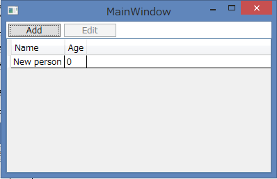
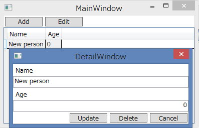

# MVVM pattern and Reactive programming sample
## Requires
- Visual Studio 2013
## License
- MIT
## Technologies
- WPF
- MVVM
- ReactiveProperty
## Topics
- MVVM
## Updated
- 08/28/2015
## Description

<h1>Introduction</h1>

This sample program has been made with Model View ViewModel pattern and Reactive Programming.&nbsp;

MVVM Light Toolkit is used for the Model View ViewModel pattern. Reactive Extensions is used for the Reactive Programming.ReactiveProperty is used for the MVVM &#43; Rx.

<ul>
<li>MVVM Light Toolkit 
https://mvvmlight.codeplex.com/ </li><li>Reactive Extensions 
https://rx.codeplex.com/ </li><li>ReactiveProperty 
https://github.com/runceel/ReactiveProperty </li></ul>
<h2>How to use</h2>

When 'add' button clicked, a new record is inserted into DataGrid.

When record is selected and 'edit' button is &nbsp;clicked, then edit dialog is displayed..

<ul>
<li>Update button 
Update data and close window.&nbsp; </li><li>Delete button 
Delete data and close window.&nbsp; </li><li>Cancel button 
Close window.&nbsp; </li></ul>
<h1>Building the Sample</h1>
<ol>
<li>Download sample program. </li><li>Restore NuGet package. </li><li>Run application. </li></ol>

Description

<h2>Model classes</h2>

The PeopleMaster class loads Person class. The PersonDetail class provides editing functions for the Person class data.In this sample, Messenger class is used for collaborating with PeopleMaster class and PersonDetail class.

&nbsp;

C#

スクリプトの編集|Remove

csharp
<pre class="hidden">// PersonDetail class
public void Update()
{
    this.repository.Update(this.EditTarget);
    this.messenger.Send(new PersonChangeMessage(ChangeKind.Update, this.EditTarget));
}

public void Delete()
{
    this.repository.Delete(this.EditTarget.Id);
    this.messenger.Send(new PersonChangeMessage(ChangeKind.Delete, this.EditTarget));
}

// PeopleMaster class
private void PersonChangedReceived(PersonChangeMessage message)
{
    switch (message.ChangeKind)
    {
        case ChangeKind.Delete:
            this.People.Remove(this.People.First(x =&gt; x.Id == message.Content.Id));
            break;
        case ChangeKind.Update:
            var p = this.People.First(x =&gt; x.Id == message.Content.Id);
            p.Name = message.Content.Name;
            p.Age = message.Content.Age;
            break;
    }
}
</pre>

<pre class="csharp">//&nbsp;PersonDetail&nbsp;class&nbsp;
public&nbsp;void&nbsp;Update()&nbsp;
{&nbsp;
&nbsp;&nbsp;&nbsp;&nbsp;this.repository.Update(this.EditTarget);&nbsp;
&nbsp;&nbsp;&nbsp;&nbsp;this.messenger.Send(new&nbsp;PersonChangeMessage(ChangeKind.Update,&nbsp;this.EditTarget));&nbsp;
}&nbsp;
&nbsp;
public&nbsp;void&nbsp;Delete()&nbsp;
{&nbsp;
&nbsp;&nbsp;&nbsp;&nbsp;this.repository.Delete(this.EditTarget.Id);&nbsp;
&nbsp;&nbsp;&nbsp;&nbsp;this.messenger.Send(new&nbsp;PersonChangeMessage(ChangeKind.Delete,&nbsp;this.EditTarget));&nbsp;
}&nbsp;
&nbsp;
&nbsp;
//&nbsp;PeopleMaster&nbsp;class&nbsp;
private&nbsp;void&nbsp;PersonChangedReceived(PersonChangeMessage&nbsp;message)&nbsp;
{&nbsp;
&nbsp;&nbsp;&nbsp;&nbsp;switch&nbsp;(message.ChangeKind)&nbsp;
&nbsp;&nbsp;&nbsp;&nbsp;{&nbsp;
&nbsp;&nbsp;&nbsp;&nbsp;&nbsp;&nbsp;&nbsp;&nbsp;case&nbsp;ChangeKind.Delete:&nbsp;
&nbsp;&nbsp;&nbsp;&nbsp;&nbsp;&nbsp;&nbsp;&nbsp;&nbsp;&nbsp;&nbsp;&nbsp;this.People.Remove(this.People.First(x&nbsp;=&gt;&nbsp;x.Id&nbsp;==&nbsp;message.Content.Id));&nbsp;
&nbsp;&nbsp;&nbsp;&nbsp;&nbsp;&nbsp;&nbsp;&nbsp;&nbsp;&nbsp;&nbsp;&nbsp;break;&nbsp;
&nbsp;&nbsp;&nbsp;&nbsp;&nbsp;&nbsp;&nbsp;&nbsp;case&nbsp;ChangeKind.Update:&nbsp;
&nbsp;&nbsp;&nbsp;&nbsp;&nbsp;&nbsp;&nbsp;&nbsp;&nbsp;&nbsp;&nbsp;&nbsp;var&nbsp;p&nbsp;=&nbsp;this.People.First(x&nbsp;=&gt;&nbsp;x.Id&nbsp;==&nbsp;message.Content.Id);&nbsp;
&nbsp;&nbsp;&nbsp;&nbsp;&nbsp;&nbsp;&nbsp;&nbsp;&nbsp;&nbsp;&nbsp;&nbsp;p.Name&nbsp;=&nbsp;message.Content.Name;&nbsp;
&nbsp;&nbsp;&nbsp;&nbsp;&nbsp;&nbsp;&nbsp;&nbsp;&nbsp;&nbsp;&nbsp;&nbsp;p.Age&nbsp;=&nbsp;message.Content.Age;&nbsp;
&nbsp;&nbsp;&nbsp;&nbsp;&nbsp;&nbsp;&nbsp;&nbsp;&nbsp;&nbsp;&nbsp;&nbsp;break;&nbsp;
&nbsp;&nbsp;&nbsp;&nbsp;}&nbsp;
}&nbsp;
</pre>

&nbsp;

&nbsp;

<h2>ViewModel classes</h2>

ViewModel classes use ReactiveProperty. ReactiveProperty instance is created from Model instance which implements INotifyPropertyChanged interface.

&nbsp;

C#

スクリプトの編集|Remove

csharp
<pre class="hidden">// Name is ReactiveProperty&lt;string&gt;.
this.Name = this.Person.ObserveProperty(x =&gt; x.Name)
    .ToReactiveProperty()
    .SetValidateAttribute(() =&gt; this.Name);
</pre>

<pre class="csharp">//&nbsp;Name&nbsp;is&nbsp;ReactiveProperty&lt;string&gt;.&nbsp;
this.Name&nbsp;=&nbsp;this.Person.ObserveProperty(x&nbsp;=&gt;&nbsp;x.Name)&nbsp;
&nbsp;&nbsp;&nbsp;&nbsp;.ToReactiveProperty()&nbsp;
&nbsp;&nbsp;&nbsp;&nbsp;.SetValidateAttribute(()&nbsp;=&gt;&nbsp;this.Name);&nbsp;
</pre>

&nbsp;

&nbsp;

And ReactiveCommand is converted from IObservable&lt;bool&gt;. It performs the processing in the Subscribe method.

&nbsp;

C#

スクリプトの編集|Remove

csharp
<pre class="hidden">// MainWindowViewModel constructor.
this.EditCommand = this.SelectedPerson
    .Select(x =&gt; x != null)
    .ToReactiveCommand();
this.EditCommand.Subscribe(_ =&gt; 
    {
        app.Detail.SetEditTarget(this.SelectedPerson.Value.Person.Id);
        this.MessengerInstance.Send(new MessageBase(this, &quot;EditWindow&quot;));
    });
</pre>

<pre class="csharp">//&nbsp;MainWindowViewModel&nbsp;constructor.&nbsp;
this.EditCommand&nbsp;=&nbsp;this.SelectedPerson&nbsp;
&nbsp;&nbsp;&nbsp;&nbsp;.Select(x&nbsp;=&gt;&nbsp;x&nbsp;!=&nbsp;null)&nbsp;
&nbsp;&nbsp;&nbsp;&nbsp;.ToReactiveCommand();&nbsp;
this.EditCommand.Subscribe(_&nbsp;=&gt;&nbsp;&nbsp;
&nbsp;&nbsp;&nbsp;&nbsp;{&nbsp;
&nbsp;&nbsp;&nbsp;&nbsp;&nbsp;&nbsp;&nbsp;&nbsp;app.Detail.SetEditTarget(this.SelectedPerson.Value.Person.Id);&nbsp;
&nbsp;&nbsp;&nbsp;&nbsp;&nbsp;&nbsp;&nbsp;&nbsp;this.MessengerInstance.Send(new&nbsp;MessageBase(this,&nbsp;&quot;EditWindow&quot;));&nbsp;
&nbsp;&nbsp;&nbsp;&nbsp;});&nbsp;
</pre>

&nbsp;

ReactiveProperty can bind View - ViewModel - Model very easily. It's really powerful. Please try to use!

