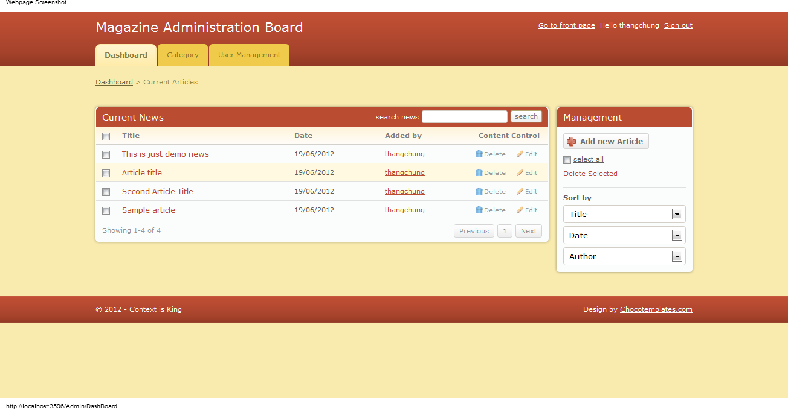
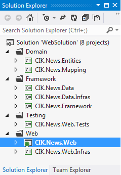

# Magazine management website - An ASP.NET MVC 4 Sample
## Requires
- Visual Studio 2012
## License
- MS-LPL
## Technologies
- ADO.NET Entity Framework
- ASP.NET
- Javascript
- Entity Framework
- ASP.NET MVC 4
- autofac
- automapper
- Visual Studio 2012
## Topics
- ADO.NET Entity Framework
- ASP.NET
- ASP.NET and ADO.NET Entity Framework
- ASP.NET MVC
- Javascript
- Entity Framework
- ASP.NET Web API
## Updated
- 10/11/2017
## Description

<h1>Introduction</h1>

<em>As we know, ASP.NET MVC 4 came out. And now everyone is very excited to use it. I have read
<a href="http://www.asp.net/whitepapers/mvc4-release-notes">a release notes</a> from ASP.NET MVC 4 website and found out some cool stuff there. At the 4th version, M$ introduced many features, such as Http programming model, routing, model binding, validation,
 Query composite, IoC container, self-host for Web API, Bundle and minification, Mobile, asynchronous programming,... I really love the improving for the Razor view engine (it called automatically removing null value when some values in view model got null,
 and this features actually make us avoid a lot of mistakes in programming time), Web API cannot be believable (hope it will be a standard web soon). Moving from Microsoft's JSON to the Newtonsoft.JSON.4.5.1 third-party library is the big changes as well.</em>

<h1>Building the Sample</h1>

<em>I am trying to using Visual Studio 2012 for building up a Magazine website that including a front page and an admin page. It is the actually small example to visualize new technologies that I have learned, so I try to make it as simple as possible.</em>

<em>I used EF 5.0 Beta in this sample and got the sample from my former team leader for building the
<a href="http://huyrua.wordpress.com/2010/07/13/entity-framework-4-poco-repository-and-specification-pattern/">
EF persistence layer</a>. Thanks, Mr. <a href="http://huyrua.wordpress.com">Huy Nguyen</a> for that great
<a href="http://code.google.com/p/ef4prs/downloads/list">EF framework</a>&nbsp;sample. To adapting with my code,&nbsp;I also have to edit some code in this framework to matching with new EF 5.0 release.</em>

<em>For the layout, I used some templates for the&nbsp;<a href="http://www.template4all.com/">front-end</a>&nbsp;page and the&nbsp;<a href="http://chocotemplates.com/">admin page</a> from the internet. Thanks for your great templates :)</em>

<h1>Upgrade</h1>

I am working on upgrading this example. The next version of it will use
<strong>Visual Studio 2013</strong> RTM, <strong>ASP.NET MVC 5</strong>, <strong>
Web API 2</strong> and <strong>AngularJS</strong>)

The <strong>source code</strong> can find out at&nbsp;<a href="https://github.com/thangchung/magazine-website-mvc-5">https://github.com/thangchung/magazine-website-mvc-5</a>&nbsp;and&nbsp;https://github.com/thangchung/magazine-website&nbsp;

The <strong>new admin template</strong>&nbsp;using
<strong>Bootstrap 3</strong> can be found at&nbsp;<a href="http://saka-webstack.github.io/templates/new-admin-layout/index.html">http://saka-webstack.github.io/templates/new-admin-layout/index.html</a>

<strong>Front-end page</strong>

 

&nbsp;

Demo site

The newest source code will come to the MSDN code very soon. At the moment, I just want to introduce the demo pages for it as below

<strong>The front-end page:</strong>&nbsp;<a href="http://magazinewebsitelite.apphb.com/">http://magazinewebsitelite.apphb.com</a>

<h1>Description</h1>

<em>We have the front page like this</em>

&nbsp;And the admin page as below

<strong>How to run the web application:</strong>

Step 1: Get a source code from the MSDN code

Step 2: Run a database script, the script can be found at C#\1.DatabaseScripts\3.NewsDbScript.sql

Step 3: Host a CIK.News.Web solution to an IIS host

Step 4: Press F5 to building all solutions

Step 5: Changing a connection string to your own database server.

Step 6: Running it

<strong>Structure of solutions:</strong>

<strong>History:</strong>

1.0: finished the draft version

1.1: removed some redundant code that commented from the community. Fixed bug, and removed the complex security model and changed it to the simple one. Re-structure the architecture of the application

1.2: edited some contents in this site

