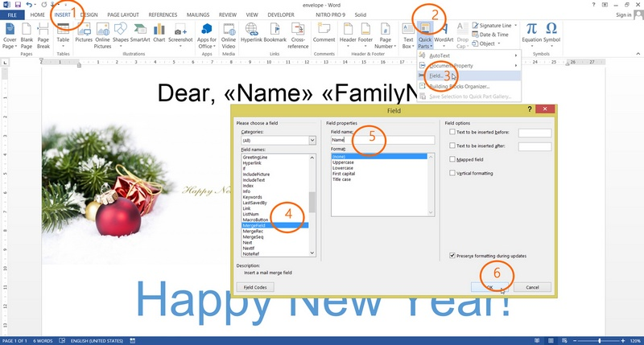
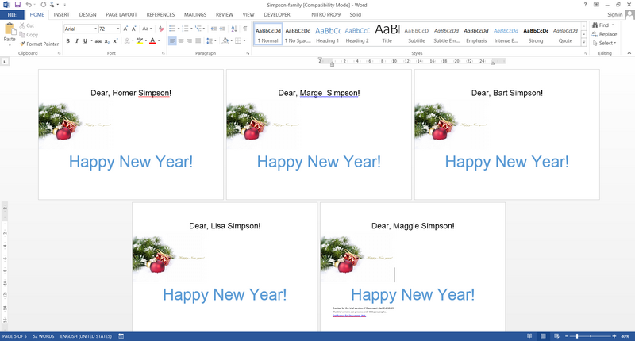

# Mail Merge: generate a simple envelope using C# and Document .Net - Step by Step
## Requires
- Visual Studio 2012
## License
- MS-LPL
## Technologies
- C#
- ASP.NET
- .NET Framework
## Topics
- Controls
- Graphics
- C#
- ASP.NET
- User Interface
- How to
- Office 2010 101 code samples
## Updated
- 10/28/2016
## Description

<h1>Introduction</h1>

Mail Merge is the feature of Document .Net which allows to easy generate documents (reports, letters, envelopes) using templates. For example, it's will be very helpful to generate hundreds of identical documents but with different data.

To illustrate how works Mail Merge function let's create C# application which generates envelopes &quot;Happy New Year&quot;' for Simpson family. As result, we'll get 5 (five) same congratulatory envelopes in the single document.

<h1>Our Steps:</h1>
<ol class="CommonText">
<li>Create an envelope template (envelope-template.docx) in MS Word with Fields &quot;Name&quot; and &quot;FamilyName&quot;.
</li><li>Type C# code which executes Mail Merge between Simpson persons and &quot;envelope-template.docx&quot;.
</li><li>See result: &quot;simpson-family.docx: which contains 5 (five) named envelopes. </li></ol>

Description

<h2 class="H2Text">1. Create an envelope template in MS Word:&nbsp;envelope-template.docx</h2>

To start, let's open MS Word and create new empty document with name &quot;envelope-template.docx&quot;. Next, you may add some images and text, anything what you want to see to gongratulate the Simpson's family. Our main goal is add two&nbsp;<strong>Fields</strong>&nbsp;&quot;Name&quot;
 and &quot;FamilyName&quot;.

<ol class="CommonText">
<li>Select &quot;INSERT&quot; tab. </li><li>Click by the pictogram &quot;Quick Parts&quot;. </li><li>Select and click by &quot;Field..&quot; menu item. </li><li>In the opened window, follow to the &quot;Field names:&quot; and select &quot;MergeField&quot;. </li><li>In the &quot;Field name:&quot; type &quot;Name&quot;. </li><li>Click &quot;OK&quot; </li></ol>

By the same steps, please add another Field with name &quot;FamilyName&quot;.

 

<em>&nbsp;</em>

<h2 class="H2Text">2. C# code which executes Mail Merge between Simpson persons and &quot;envelope-template.docx&quot;</h2>

&nbsp;

&nbsp;

C#

Edit|Remove

csharp
<pre class="hidden">DocumentCore dc = DocumentCore.Load(@&quot;envelope-template.docx&quot;);

var dataSource = new[] { new { Name = &quot;Homer&quot;, FamilyName = &quot;Simpson&quot; }, 
                    new { Name = &quot;Marge &quot;, FamilyName = &quot;Simpson&quot; },
                    new { Name = &quot;Bart&quot;, FamilyName = &quot;Simpson&quot; },
                    new { Name = &quot;Lisa&quot;, FamilyName = &quot;Simpson&quot; },
                    new { Name = &quot;Maggie&quot;, FamilyName = &quot;Simpson&quot; }};

dc.MailMerge.Execute(dataSource);
dc.Save(@&quot;Simpson-family.docx&quot;);</pre>

<pre class="csharp">DocumentCore&nbsp;dc&nbsp;=&nbsp;DocumentCore.Load(@&quot;envelope-template.docx&quot;);&nbsp;
&nbsp;
var&nbsp;dataSource&nbsp;=&nbsp;new[]&nbsp;{&nbsp;new&nbsp;{&nbsp;Name&nbsp;=&nbsp;&quot;Homer&quot;,&nbsp;FamilyName&nbsp;=&nbsp;&quot;Simpson&quot;&nbsp;},&nbsp;&nbsp;
&nbsp;&nbsp;&nbsp;&nbsp;&nbsp;&nbsp;&nbsp;&nbsp;&nbsp;&nbsp;&nbsp;&nbsp;&nbsp;&nbsp;&nbsp;&nbsp;&nbsp;&nbsp;&nbsp;&nbsp;new&nbsp;{&nbsp;Name&nbsp;=&nbsp;&quot;Marge&nbsp;&quot;,&nbsp;FamilyName&nbsp;=&nbsp;&quot;Simpson&quot;&nbsp;},&nbsp;
&nbsp;&nbsp;&nbsp;&nbsp;&nbsp;&nbsp;&nbsp;&nbsp;&nbsp;&nbsp;&nbsp;&nbsp;&nbsp;&nbsp;&nbsp;&nbsp;&nbsp;&nbsp;&nbsp;&nbsp;new&nbsp;{&nbsp;Name&nbsp;=&nbsp;&quot;Bart&quot;,&nbsp;FamilyName&nbsp;=&nbsp;&quot;Simpson&quot;&nbsp;},&nbsp;
&nbsp;&nbsp;&nbsp;&nbsp;&nbsp;&nbsp;&nbsp;&nbsp;&nbsp;&nbsp;&nbsp;&nbsp;&nbsp;&nbsp;&nbsp;&nbsp;&nbsp;&nbsp;&nbsp;&nbsp;new&nbsp;{&nbsp;Name&nbsp;=&nbsp;&quot;Lisa&quot;,&nbsp;FamilyName&nbsp;=&nbsp;&quot;Simpson&quot;&nbsp;},&nbsp;
&nbsp;&nbsp;&nbsp;&nbsp;&nbsp;&nbsp;&nbsp;&nbsp;&nbsp;&nbsp;&nbsp;&nbsp;&nbsp;&nbsp;&nbsp;&nbsp;&nbsp;&nbsp;&nbsp;&nbsp;new&nbsp;{&nbsp;Name&nbsp;=&nbsp;&quot;Maggie&quot;,&nbsp;FamilyName&nbsp;=&nbsp;&quot;Simpson&quot;&nbsp;}};&nbsp;
&nbsp;
dc.MailMerge.Execute(dataSource);&nbsp;
dc.Save(@&quot;Simpson-family.docx&quot;);</pre>

Here we create an array of objects by anonymous type. After execution of mail merge method we'll get the same number of copies document with filled fields as number of objects in the array.

<h2 class="H2Text">3. See result: &quot;simpson-family.docx&quot;</h2>

 

<h1>Source Code Files</h1>

<em>Related Links:</em>

<em> 
Website:&nbsp;<a href="http://www.sautinsoft.com/">www.sautinsoft.com</a> 
Product Home:&nbsp;<a href="http://sautinsoft.com/products/document/index.php">Document.Net</a> 
Download:&nbsp;<em><a href="http://sautinsoft.com/thankyou.php?download=document_net.zip">Document.Net</a></em> 
</em>

<h2 class="H2Text">Requrements and Technical Information</h2>

&nbsp;Requires only .Net 4.0 or above. Our product is compatible with all .Net languages and supports all Operating Systems where .Net Framework can be used. 
 
Note that &laquo;Document .Net&raquo; is entirely written in managed C#, which makes it absolutely standalone and an independent library. Of course, No dependency on Microsoft Word.

