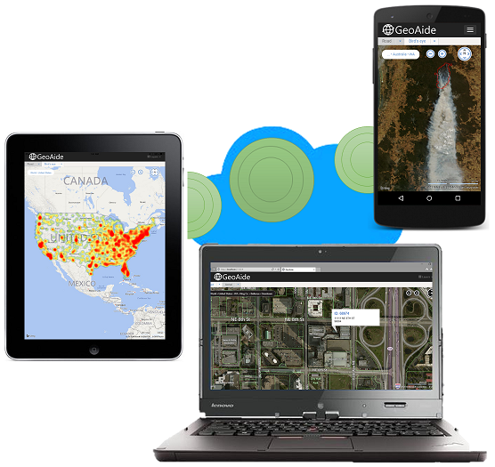

# Managing and Visualizing Geospatial Data with Bing Maps
## Requires
- Visual Studio 2015
## License
- MIT
## Technologies
- SQL Server
- SQL Azure
- Bing Maps
- Windows Azure Storage
- Apache Cordova
- Bing Spatial Data Services
## Topics
- AJAX
- SQL Server
- SQL Azure
- data visualization
- Bing Maps
- Azure Blob Storage
- Apache Cordova
- Heat Maps
- Bing Spatial Data Services
- rasterization
- thematic maps
## Updated
- 03/03/2015
## Description

<h1>Introduction</h1>

This code sample demonstrates various aspects of spatial data management and visualizations with Bing Maps, Bing Spatial Data Services, SQL Server, Azure SQL Database and Azure Blob Storage.

<h1>Description</h1>

Various approaches to store and query vector and raster data sets and overlay them on top of the
<a href="https://msdn.microsoft.com/en-us/library/gg427610.aspx" target="_blank">
Bing Maps AJAX Control version 7</a> are demonstrated:

<ol>
<li>Retrieving polygons and points from <a href="https://msdn.microsoft.com/en-us/library/ff701734.aspx" target="_blank">
Bing Spatial Data Services</a> (SDS) and overlaying them as vector data </li><li>Querying geospatial data from SQL Server and overlay as a vector data layer using a
<a href="http://bingmapsv7modules.codeplex.com/" target="_blank">custom module</a> to read Well-Known Text (WKT) responses. The SQL Server database is scripted and the script to craete the database and load the sample data is part of the web project.
</li><li>Overlaying static tile layers </li><li>Accessing SQL Server and overlaying data as a raster data layer&nbsp;with options for local and Azure hosted tile-cache
</li><li>Calling Bing SDS and rasterizing the data as a tile layer for Bing Maps with options for local and Azure hosted tile-cache
</li><li>Creating heatmaps from SDS data sources using a custom module </li><li>Creating thematic maps using the <a href="https://msdn.microsoft.com/en-us/library/dn306801.aspx" target="_blank">
GeoData API</a> (part of Bing SDS) </li></ol>

Samples are available for web applications as well as mobile devices. All samples have been build using Visual Studio 2015 CTP 6. The samples for the mobile devices where build using the
<a href="https://www.visualstudio.com/en-us/explore/cordova-vs.aspx" target="_blank">
Visual Studio Tools for Apache Cordova</a>. These tools are part of Visual Studio 2015 and can be downloaded separately for Visual Studio 2013.

There are a few places where you need to replace a place-holder with your own credentials in oder to run the sample.

In the file index.js search for the string blow and replace the placeholder with your own Bing Maps Key. If you don't have one yet you can sign up for a free developer account
<a href="https://www.bingmapsportal.com/" target="_blank">here</a>.

JavaScript

Edit|Remove

js
<pre class="hidden">var bmKey = &quot;YOUR_BING_MAPS_KEY&quot;;</pre>

<pre class="js">var&nbsp;bmKey&nbsp;=&nbsp;&quot;YOUR_BING_MAPS_KEY&quot;;</pre>

In the files SdsTileServer.ashx.vb and SdsTileServerAzure.ashx.vb search for the following line and replace the placeholder with your pwn Bing Maps Key

&nbsp;

Visual Basic

Edit|Remove

vb
<pre class="hidden">Public bmKey As String = &quot;YOUR_BING_MAPS_KEY&quot;</pre>

<pre class="vb">Public&nbsp;bmKey&nbsp;As&nbsp;String&nbsp;=&nbsp;&quot;YOUR_BING_MAPS_KEY&quot;</pre>

&nbsp;In the files SqlTileServerAzure.ashx.vb and SdsTileServerAzure.ashx.vb search for the following strings and replace the placeholders with your own Azure Blob Storage informtion.

Visual Basic

Edit|Remove

vb
<pre class="hidden">    Public myAzureAccountName As String = &quot;YOUR_AZURE_STORAGE_ACCOUNT_NAME&quot;
    Public myAzureAccountKey As String = &quot;YOUR_AZURE_STORAGE_KEY&quot;
    Public myAzureContainerRef As String = &quot;YOUR_AZURE_CONTAINER_REF&quot;</pre>

<pre class="vb">&nbsp;&nbsp;&nbsp;&nbsp;Public&nbsp;myAzureAccountName&nbsp;As&nbsp;String&nbsp;=&nbsp;&quot;YOUR_AZURE_STORAGE_ACCOUNT_NAME&quot;&nbsp;
&nbsp;&nbsp;&nbsp;&nbsp;Public&nbsp;myAzureAccountKey&nbsp;As&nbsp;String&nbsp;=&nbsp;&quot;YOUR_AZURE_STORAGE_KEY&quot;&nbsp;
&nbsp;&nbsp;&nbsp;&nbsp;Public&nbsp;myAzureContainerRef&nbsp;As&nbsp;String&nbsp;=&nbsp;&quot;YOUR_AZURE_CONTAINER_REF&quot;</pre>

In the web.config replace the placeholders for the connection strings with the ones for your own SQL Server and Azure SQL Database.

&nbsp;

<h1>Source Code Files</h1>
<ul>
<li><em>GeoAide-KC.zip - web project with generic handlers to access SQL Server and rasterize tiles from SDS and SQL Server and cache tiles either locally or on Azure 
</em></li><li><em><em>GeoAide-KC-Cordova.zip - Apache Cordova project.&nbsp;</em> 
</em></li><li><em><em><a id="134557" href="/Managing-and-Visualizing-f42fdd5c/file/134557/1/SDS-Upload.zip">SDS-Upload.zip</a></em>&nbsp;(as attachement to this code sample) - tool to upload geospatial data sets to Bing SDS. More details on the API behind it are available
<a href="https://msdn.microsoft.com/en-us/library/gg585128.aspx" target="_blank">
here</a></em> </li></ul>

&nbsp;

