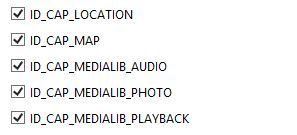

# Map and Map-Pin in  Xamarin.Forms
## Requires
- Visual Studio 2013
## License
- MIT
## Technologies
- Xamarin
- Xamarin.Forms
## Topics
- Maps
## Updated
- 07/14/2015
## Description

In this article I'm going to create a page with a Map and I will place a pin to show my location in that map.

As always I will first show the NuGet package which will help us to get map. I'm going to add &quot;Xamarin.Forms.Maps&quot; into my solution.

Xamarin.Forms.Maps uses the native map APIs on each platform. This provides a fast, familiar maps experience for users, but means that some configuration steps are needed to adhere to each platforms specific API requirements. Once configured, the&nbsp;<code>Map</code>&nbsp;control
 works just like any other Xamarin.Forms element in common code.

&nbsp;

Now we want to set some permissions, So that we opened my &quot;AndroidManifest.xml&quot; and set some of these user permissions. I want a KEY for accessing GOOGLE MAPS. You can
<a href="https://developer.xamarin.com/guides/android/platform_features/maps_and_location/maps/obtaining_a_google_maps_api_key/">
click here</a> to know more about it.

Now we can open &quot;WMAppManifest.xml&quot; for setting permissions for Windows Phone.

&nbsp;

Now we want to initialize the Xamarin.Forms.Maps in each platform specific startup class (e.g., AppDelegate.cs&nbsp; for iOS, &nbsp;MainActivity.cs&nbsp; for Android and MainPage.xaml.cs in Windows Phone ) by calling &quot;Xamarin.FormsMaps.Init()&quot;&nbsp; before
 calling &quot;LoadApplication()&quot;.

Now we can write down the following codes to get a map on our Page :

&nbsp;

C#

Edit|Remove

csharp
<pre class="hidden">var map = new Map
	{
		HorizontalOptions =LayoutOptions.FillAndExpand
	};
var mapPosition = new Position(10.020921, 76.337919);
map.MoveToRegion(
	MapSpan.FromCenterAndRadius(
		mapPosition, Distance.FromMiles(3)));
</pre>

<pre class="csharp">var&nbsp;map&nbsp;=&nbsp;new&nbsp;Map&nbsp;
&nbsp;&nbsp;&nbsp;&nbsp;{&nbsp;
&nbsp;&nbsp;&nbsp;&nbsp;&nbsp;&nbsp;&nbsp;&nbsp;HorizontalOptions&nbsp;=LayoutOptions.FillAndExpand&nbsp;
&nbsp;&nbsp;&nbsp;&nbsp;};&nbsp;
var&nbsp;mapPosition&nbsp;=&nbsp;new&nbsp;Position(10.020921,&nbsp;76.337919);&nbsp;
map.MoveToRegion(&nbsp;
&nbsp;&nbsp;&nbsp;&nbsp;MapSpan.FromCenterAndRadius(&nbsp;
&nbsp;&nbsp;&nbsp;&nbsp;&nbsp;&nbsp;&nbsp;&nbsp;mapPosition,&nbsp;Distance.FromMiles(3)));&nbsp;
</pre>

&nbsp;

Now we can add a small code snippet to add pin in own map.

&nbsp;

C#

Edit|Remove

csharp
<pre class="hidden">var mapPin = new Pin
	{
		Type = PinType.Place,
		Position = mapPosition,
		Label = &quot;Mazsoft Technologies&quot;,
		Address = &quot;Kakkanad - Kerala&quot;
	};
map.Pins.Add(mapPin);
</pre>

<pre class="csharp">var&nbsp;mapPin&nbsp;=&nbsp;new&nbsp;Pin&nbsp;
&nbsp;&nbsp;&nbsp;&nbsp;{&nbsp;
&nbsp;&nbsp;&nbsp;&nbsp;&nbsp;&nbsp;&nbsp;&nbsp;Type&nbsp;=&nbsp;PinType.Place,&nbsp;
&nbsp;&nbsp;&nbsp;&nbsp;&nbsp;&nbsp;&nbsp;&nbsp;Position&nbsp;=&nbsp;mapPosition,&nbsp;
&nbsp;&nbsp;&nbsp;&nbsp;&nbsp;&nbsp;&nbsp;&nbsp;Label&nbsp;=&nbsp;&quot;Mazsoft&nbsp;Technologies&quot;,&nbsp;
&nbsp;&nbsp;&nbsp;&nbsp;&nbsp;&nbsp;&nbsp;&nbsp;Address&nbsp;=&nbsp;&quot;Kakkanad&nbsp;-&nbsp;Kerala&quot;&nbsp;
&nbsp;&nbsp;&nbsp;&nbsp;};&nbsp;
map.Pins.Add(mapPin);&nbsp;
</pre>

&nbsp;

