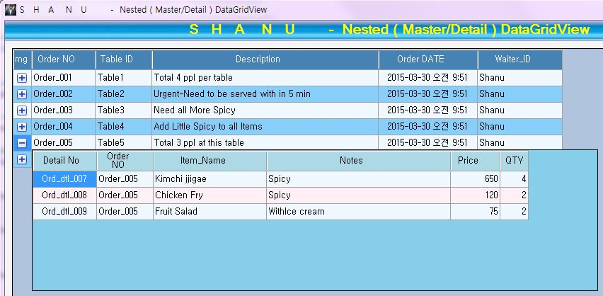
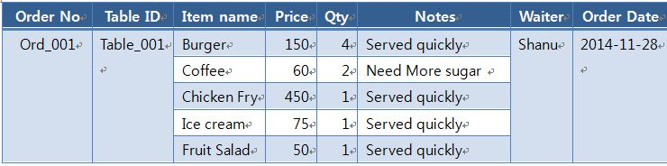

# Master Detail DataGridView C# Winform
## Requires
- Visual Studio 2010
## License
- MIT
## Technologies
- C#
- Windows Forms
- DataGridView
- WinForms
## Topics
- C#
- Windows Forms
- DataGridView
- WinForms
## Updated
- 08/06/2015
## Description

<h1>Introduction</h1>

<em></em>

<em>In my previous
 article I explained how to&nbsp;<a href="https://code.msdn.microsoft.com/DataGridView-Helper-Class-e713de9d" target="_blank" style="font:14px/21px Roboto,sans-serif; outline:0px; color:#0000ff; text-transform:none; text-indent:0px; letter-spacing:normal; text-decoration:none; word-spacing:0px; white-space:normal; widows:1; background-color:#ffffff">Create
 a DatagGridView helper class using C#</a>&nbsp; 
 
I have extended the DatagGridView
 Helper class to create a Master/Detail DatagGridView. My intent is to create a simple and easy program for users. Users can download the code and can customize it depending on their requirements. 
 
<strong style="outline:0px; color:#333333; text-transform:none; line-height:21px; text-indent:0px; letter-spacing:normal; font-family:Roboto,sans-serif; font-size:14px; font-style:normal; font-variant:normal; word-spacing:0px; white-space:normal; widows:1; background-color:#ffffff">Why
 to use a Nested or Hierarchical DataGridView 
</strong> 
In real projects like
 Order Management, Production Management and and so on we need to display the data in the hierarchical result. 
 
For example let's use
 an Order Management project for a restaurant. Let's consider four people going to a restaurant to have their lunch. The waiter from the restaurant will provide a menu card to select the item to place an order. Now in a table the total of 4 people are sitting
 in a restaurant. In restaurant management, usually all the tables have a unique Table Id or name. All 4 people will select their item from the menu and place the order to serve their food. In restaurant management for each order we will create a unique id
 in an Order Master table and all the item details related to the order in the Order Detail table. Let's see an example structure of the order. 
 
<strong style="outline:0px; color:#333333; text-transform:none; line-height:21px; text-indent:0px; letter-spacing:normal; font-family:Roboto,sans-serif; font-size:14px; font-style:normal; font-variant:normal; word-spacing:0px; white-space:normal; widows:1; background-color:#ffffff">Why
 to use a&nbsp;</strong><strong style="outline:0px; color:#333333; text-transform:none; line-height:21px; text-indent:0px; letter-spacing:normal; font-family:Roboto,sans-serif; font-size:14px; font-style:normal; font-variant:normal; word-spacing:0px; white-space:normal; widows:1; background-color:#ffffff">Master
 and Detail Table 
</strong>&nbsp; 
To avoid the duplicate
 data we can use the master Detail table relation to store our data. For example for every order there will be one waiter and one Table so if we didn't use the Master Detail table relation then the output will be like this below.</em>

<em></em>

<em>Here we can see
 that Order No, Table ID, Waiter Name and Order Date have been repeated. To avoid this duplicate data we will create a Master and Detail relation tables. See the following table for Master and Details. 
<strong style="outline:0px; color:#333333; text-transform:none; line-height:21px; text-indent:0px; letter-spacing:normal; font-family:Roboto,sans-serif; font-size:14px; font-style:normal; font-variant:normal; word-spacing:0px; white-space:normal; widows:1; background-color:#ffffff">Order
 Master Table</strong> 
Here we can see that the
 duplicate data has been stored in a separate table as an Order Master Table.</em>

<em></em>

<em><strong style="outline:0px; color:#333333; text-transform:none; line-height:21px; text-indent:0px; letter-spacing:normal; font-family:Roboto,sans-serif; font-size:14px; font-style:normal; font-variant:normal; word-spacing:0px; white-space:normal; widows:1; background-color:#ffffff">Order
 Detail Table 
</strong>Here we can see
 all the item details of the order in a separate table. But in the detail table we have used the Order Number for a relation to the Master table. Using the relation we can combine both tables and produce the output.</em>

<em></em>

<em><strong style="outline:0px; color:#333333; text-transform:none; line-height:21px; text-indent:0px; letter-spacing:normal; font-family:Roboto,sans-serif; font-size:14px; font-style:normal; font-variant:normal; word-spacing:0px; white-space:normal; widows:1; background-color:#ffffff">Normal
 grid result</strong> 
The result can be shown
 without using the Hierarchal grid output. But we must display the duplicate results as in the following.</em>

<em></em>

<em>We can also merge
 the same data and show the result as in the following table. But the output is not much better and is not easy to view and understand.</em>

<em></em>

<em>Let's see now the
 hierarchical output of the same result.</em>

<em>&nbsp;</em>&nbsp;

<em></em>

<em>Now this final
 result looks much better than all the previous. It will be easy to view the master and detail of all records.&nbsp;Here is my sample output of the hierarchical DataGridView.</em>

<em></em>

<em></em>&nbsp;

<em>In the same manner
 as Order Management in restaurant projects we also have Bill Master and Detail, Account Master and Detail, Item Master and Detail&nbsp;and Inventory Master and Detail. In production projects we will have Production Order Master and Oder Detail, Finished Good
 Receipt Master and Detail, Finished Goods Issue Master and Detail and so on. In the same manner in our all our actual projects we will use the Master and detail relation to display our data.</em>

<h1>Building the Sample</h1>

As I explained in this
 article, I have used and extended my DataGridView helper class to create a Nested DataGridView. You can view my DataGridView helper class details from my article. 
 
In my DGVhelper class
 I have added the following functionality to create the nested grid. 

<ul style="font:14px/21px Roboto,sans-serif; outline:0px; color:#333333; text-transform:none; text-indent:0px; letter-spacing:normal; word-spacing:0px; white-space:normal; widows:1; background-color:#ffffff">
<li style="outline:0px">ImageCoulmn&nbsp; </li><li style="outline:0px">DGVMasterGridClickEvents&nbsp; </li><li style="outline:0px">DGVDetailGridClickEvents&nbsp; </li></ul>

The user can use all
 the events, like CellClick, CellContentClick and and so on for both the Master and Detail grid. 
 
I have created two separate
 list classes to populate the master and detail results. In the form load I called the method to add the details to each list class. 
 
I have created both a
 Master and Detail DataGridView programmatically (dynamically) using my ShanuDGVHelper Class.&nbsp;

Description

<em><strong style="outline:0px; color:#333333; text-transform:none; line-height:21px; text-indent:0px; letter-spacing:normal; font-family:Roboto,sans-serif; font-size:14px; font-style:normal; font-variant:normal; word-spacing:0px; white-space:normal; widows:1; background-color:#ffffff">Master
 Grid Setting:</strong>&nbsp;In
 Form Load I have called this method to create a master DataGridView at runtime. In my code I add the comments before each line to explain its use.</em>

<h1>

C#

Edit|Remove

csharp
<pre class="hidden">// to generate Master Datagridview with your coding
        public void MasterGrid_Initialize()
        {

            //First generate the grid Layout Design
            Helper.ShanuDGVHelper.Layouts(Master_shanuDGV, Color.LightSteelBlue, Color.AliceBlue, Color.WhiteSmoke, false, Color.SteelBlue, false, false, false);

            //Set Height,width and add panel to your selected control
            Helper.ShanuDGVHelper.Generategrid(Master_shanuDGV, pnlShanuGrid, 1000, 600, 10, 10);

            // Color Image Column creation
            Helper.ShanuDGVHelper.Templatecolumn(Master_shanuDGV, ShanuControlTypes.ImageColumn, &quot;img&quot;, &quot;&quot;, &quot;&quot;, true, 26, DataGridViewTriState.True, DataGridViewContentAlignment.MiddleCenter, DataGridViewContentAlignment.MiddleRight, Color.Transparent, null, &quot;&quot;, &quot;&quot;, Color.Black);

            // BoundColumn creation
            Helper.ShanuDGVHelper.Templatecolumn(Master_shanuDGV, ShanuControlTypes.BoundColumn, &quot;Order_No&quot;, &quot;Order NO&quot;, &quot;Order NO&quot;, true, 90, DataGridViewTriState.True, DataGridViewContentAlignment.MiddleLeft, DataGridViewContentAlignment.MiddleCenter, Color.Transparent, null, &quot;&quot;, &quot;&quot;, Color.Black);

            // BoundColumn creation
            Helper.ShanuDGVHelper.Templatecolumn(Master_shanuDGV, ShanuControlTypes.BoundColumn, &quot;Table_ID&quot;, &quot;Table ID&quot;, &quot;Table ID&quot;, true, 80, DataGridViewTriState.True, DataGridViewContentAlignment.MiddleLeft, DataGridViewContentAlignment.MiddleCenter, Color.Transparent, null, &quot;&quot;, &quot;&quot;, Color.Black);

            // BoundColumn creation
            Helper.ShanuDGVHelper.Templatecolumn(Master_shanuDGV, ShanuControlTypes.BoundColumn, &quot;Description&quot;, &quot;Description&quot;, &quot;Description&quot;, true, 320, DataGridViewTriState.True, DataGridViewContentAlignment.MiddleLeft, DataGridViewContentAlignment.MiddleCenter, Color.Transparent, null, &quot;&quot;, &quot;&quot;, Color.Black);

            // BoundColumn creation
            Helper.ShanuDGVHelper.Templatecolumn(Master_shanuDGV, ShanuControlTypes.BoundColumn, &quot;Order_DATE&quot;, &quot;Order DATE&quot;, &quot;Order DATE&quot;, true, 140, DataGridViewTriState.True, DataGridViewContentAlignment.MiddleCenter, DataGridViewContentAlignment.MiddleCenter, Color.Transparent, null, &quot;&quot;, &quot;&quot;, Color.Black);

            // BoundColumn creation
            Helper.ShanuDGVHelper.Templatecolumn(Master_shanuDGV, ShanuControlTypes.BoundColumn, &quot;Waiter_ID&quot;, &quot;Waiter_ID&quot;, &quot;Waiter_ID&quot;, true, 120, DataGridViewTriState.True, DataGridViewContentAlignment.MiddleLeft, DataGridViewContentAlignment.MiddleCenter, Color.Transparent, null, &quot;&quot;, &quot;&quot;, Color.Black);

            //Convert the List to DataTable
            DataTable detailTableList = ListtoDataTable(DataClass.OrderDetailBindClass.objDetailDGVBind);
            // Image Colum Click Event - In  this method we create an event for cell click and we will display the Detail grid with result.
            objshanudgvHelper.DGVMasterGridClickEvents(Master_shanuDGV, Detail_shanuDGV, Master_shanuDGV.Columns[&quot;img&quot;].Index, ShanuEventTypes.cellContentClick, ShanuControlTypes.ImageColumn, detailTableList, &quot;Order_No&quot;);
            
            // Bind data to DGV.
            Master_shanuDGV.DataSource = DataClass.OrderMasterBindClass.objMasterDGVBind;
        }
</pre>

<pre class="csharp">//&nbsp;to&nbsp;generate&nbsp;Master&nbsp;Datagridview&nbsp;with&nbsp;your&nbsp;coding&nbsp;
&nbsp;&nbsp;&nbsp;&nbsp;&nbsp;&nbsp;&nbsp;&nbsp;public&nbsp;void&nbsp;MasterGrid_Initialize()&nbsp;
&nbsp;&nbsp;&nbsp;&nbsp;&nbsp;&nbsp;&nbsp;&nbsp;{&nbsp;
&nbsp;
&nbsp;&nbsp;&nbsp;&nbsp;&nbsp;&nbsp;&nbsp;&nbsp;&nbsp;&nbsp;&nbsp;&nbsp;//First&nbsp;generate&nbsp;the&nbsp;grid&nbsp;Layout&nbsp;Design&nbsp;
&nbsp;&nbsp;&nbsp;&nbsp;&nbsp;&nbsp;&nbsp;&nbsp;&nbsp;&nbsp;&nbsp;&nbsp;Helper.ShanuDGVHelper.Layouts(Master_shanuDGV,&nbsp;Color.LightSteelBlue,&nbsp;Color.AliceBlue,&nbsp;Color.WhiteSmoke,&nbsp;false,&nbsp;Color.SteelBlue,&nbsp;false,&nbsp;false,&nbsp;false);&nbsp;
&nbsp;
&nbsp;&nbsp;&nbsp;&nbsp;&nbsp;&nbsp;&nbsp;&nbsp;&nbsp;&nbsp;&nbsp;&nbsp;//Set&nbsp;Height,width&nbsp;and&nbsp;add&nbsp;panel&nbsp;to&nbsp;your&nbsp;selected&nbsp;control&nbsp;
&nbsp;&nbsp;&nbsp;&nbsp;&nbsp;&nbsp;&nbsp;&nbsp;&nbsp;&nbsp;&nbsp;&nbsp;Helper.ShanuDGVHelper.Generategrid(Master_shanuDGV,&nbsp;pnlShanuGrid,&nbsp;1000,&nbsp;600,&nbsp;10,&nbsp;10);&nbsp;
&nbsp;
&nbsp;&nbsp;&nbsp;&nbsp;&nbsp;&nbsp;&nbsp;&nbsp;&nbsp;&nbsp;&nbsp;&nbsp;//&nbsp;Color&nbsp;Image&nbsp;Column&nbsp;creation&nbsp;
&nbsp;&nbsp;&nbsp;&nbsp;&nbsp;&nbsp;&nbsp;&nbsp;&nbsp;&nbsp;&nbsp;&nbsp;Helper.ShanuDGVHelper.Templatecolumn(Master_shanuDGV,&nbsp;ShanuControlTypes.ImageColumn,&nbsp;&quot;img&quot;,&nbsp;&quot;&quot;,&nbsp;&quot;&quot;,&nbsp;true,&nbsp;26,&nbsp;DataGridViewTriState.True,&nbsp;DataGridViewContentAlignment.MiddleCenter,&nbsp;DataGridViewContentAlignment.MiddleRight,&nbsp;Color.Transparent,&nbsp;null,&nbsp;&quot;&quot;,&nbsp;&quot;&quot;,&nbsp;Color.Black);&nbsp;
&nbsp;
&nbsp;&nbsp;&nbsp;&nbsp;&nbsp;&nbsp;&nbsp;&nbsp;&nbsp;&nbsp;&nbsp;&nbsp;//&nbsp;BoundColumn&nbsp;creation&nbsp;
&nbsp;&nbsp;&nbsp;&nbsp;&nbsp;&nbsp;&nbsp;&nbsp;&nbsp;&nbsp;&nbsp;&nbsp;Helper.ShanuDGVHelper.Templatecolumn(Master_shanuDGV,&nbsp;ShanuControlTypes.BoundColumn,&nbsp;&quot;Order_No&quot;,&nbsp;&quot;Order&nbsp;NO&quot;,&nbsp;&quot;Order&nbsp;NO&quot;,&nbsp;true,&nbsp;90,&nbsp;DataGridViewTriState.True,&nbsp;DataGridViewContentAlignment.MiddleLeft,&nbsp;DataGridViewContentAlignment.MiddleCenter,&nbsp;Color.Transparent,&nbsp;null,&nbsp;&quot;&quot;,&nbsp;&quot;&quot;,&nbsp;Color.Black);&nbsp;
&nbsp;
&nbsp;&nbsp;&nbsp;&nbsp;&nbsp;&nbsp;&nbsp;&nbsp;&nbsp;&nbsp;&nbsp;&nbsp;//&nbsp;BoundColumn&nbsp;creation&nbsp;
&nbsp;&nbsp;&nbsp;&nbsp;&nbsp;&nbsp;&nbsp;&nbsp;&nbsp;&nbsp;&nbsp;&nbsp;Helper.ShanuDGVHelper.Templatecolumn(Master_shanuDGV,&nbsp;ShanuControlTypes.BoundColumn,&nbsp;&quot;Table_ID&quot;,&nbsp;&quot;Table&nbsp;ID&quot;,&nbsp;&quot;Table&nbsp;ID&quot;,&nbsp;true,&nbsp;80,&nbsp;DataGridViewTriState.True,&nbsp;DataGridViewContentAlignment.MiddleLeft,&nbsp;DataGridViewContentAlignment.MiddleCenter,&nbsp;Color.Transparent,&nbsp;null,&nbsp;&quot;&quot;,&nbsp;&quot;&quot;,&nbsp;Color.Black);&nbsp;
&nbsp;
&nbsp;&nbsp;&nbsp;&nbsp;&nbsp;&nbsp;&nbsp;&nbsp;&nbsp;&nbsp;&nbsp;&nbsp;//&nbsp;BoundColumn&nbsp;creation&nbsp;
&nbsp;&nbsp;&nbsp;&nbsp;&nbsp;&nbsp;&nbsp;&nbsp;&nbsp;&nbsp;&nbsp;&nbsp;Helper.ShanuDGVHelper.Templatecolumn(Master_shanuDGV,&nbsp;ShanuControlTypes.BoundColumn,&nbsp;&quot;Description&quot;,&nbsp;&quot;Description&quot;,&nbsp;&quot;Description&quot;,&nbsp;true,&nbsp;320,&nbsp;DataGridViewTriState.True,&nbsp;DataGridViewContentAlignment.MiddleLeft,&nbsp;DataGridViewContentAlignment.MiddleCenter,&nbsp;Color.Transparent,&nbsp;null,&nbsp;&quot;&quot;,&nbsp;&quot;&quot;,&nbsp;Color.Black);&nbsp;
&nbsp;
&nbsp;&nbsp;&nbsp;&nbsp;&nbsp;&nbsp;&nbsp;&nbsp;&nbsp;&nbsp;&nbsp;&nbsp;//&nbsp;BoundColumn&nbsp;creation&nbsp;
&nbsp;&nbsp;&nbsp;&nbsp;&nbsp;&nbsp;&nbsp;&nbsp;&nbsp;&nbsp;&nbsp;&nbsp;Helper.ShanuDGVHelper.Templatecolumn(Master_shanuDGV,&nbsp;ShanuControlTypes.BoundColumn,&nbsp;&quot;Order_DATE&quot;,&nbsp;&quot;Order&nbsp;DATE&quot;,&nbsp;&quot;Order&nbsp;DATE&quot;,&nbsp;true,&nbsp;140,&nbsp;DataGridViewTriState.True,&nbsp;DataGridViewContentAlignment.MiddleCenter,&nbsp;DataGridViewContentAlignment.MiddleCenter,&nbsp;Color.Transparent,&nbsp;null,&nbsp;&quot;&quot;,&nbsp;&quot;&quot;,&nbsp;Color.Black);&nbsp;
&nbsp;
&nbsp;&nbsp;&nbsp;&nbsp;&nbsp;&nbsp;&nbsp;&nbsp;&nbsp;&nbsp;&nbsp;&nbsp;//&nbsp;BoundColumn&nbsp;creation&nbsp;
&nbsp;&nbsp;&nbsp;&nbsp;&nbsp;&nbsp;&nbsp;&nbsp;&nbsp;&nbsp;&nbsp;&nbsp;Helper.ShanuDGVHelper.Templatecolumn(Master_shanuDGV,&nbsp;ShanuControlTypes.BoundColumn,&nbsp;&quot;Waiter_ID&quot;,&nbsp;&quot;Waiter_ID&quot;,&nbsp;&quot;Waiter_ID&quot;,&nbsp;true,&nbsp;120,&nbsp;DataGridViewTriState.True,&nbsp;DataGridViewContentAlignment.MiddleLeft,&nbsp;DataGridViewContentAlignment.MiddleCenter,&nbsp;Color.Transparent,&nbsp;null,&nbsp;&quot;&quot;,&nbsp;&quot;&quot;,&nbsp;Color.Black);&nbsp;
&nbsp;
&nbsp;&nbsp;&nbsp;&nbsp;&nbsp;&nbsp;&nbsp;&nbsp;&nbsp;&nbsp;&nbsp;&nbsp;//Convert&nbsp;the&nbsp;List&nbsp;to&nbsp;DataTable&nbsp;
&nbsp;&nbsp;&nbsp;&nbsp;&nbsp;&nbsp;&nbsp;&nbsp;&nbsp;&nbsp;&nbsp;&nbsp;DataTable&nbsp;detailTableList&nbsp;=&nbsp;ListtoDataTable(DataClass.OrderDetailBindClass.objDetailDGVBind);&nbsp;
&nbsp;&nbsp;&nbsp;&nbsp;&nbsp;&nbsp;&nbsp;&nbsp;&nbsp;&nbsp;&nbsp;&nbsp;//&nbsp;Image&nbsp;Colum&nbsp;Click&nbsp;Event&nbsp;-&nbsp;In&nbsp;&nbsp;this&nbsp;method&nbsp;we&nbsp;create&nbsp;an&nbsp;event&nbsp;for&nbsp;cell&nbsp;click&nbsp;and&nbsp;we&nbsp;will&nbsp;display&nbsp;the&nbsp;Detail&nbsp;grid&nbsp;with&nbsp;result.&nbsp;
&nbsp;&nbsp;&nbsp;&nbsp;&nbsp;&nbsp;&nbsp;&nbsp;&nbsp;&nbsp;&nbsp;&nbsp;objshanudgvHelper.DGVMasterGridClickEvents(Master_shanuDGV,&nbsp;Detail_shanuDGV,&nbsp;Master_shanuDGV.Columns[&quot;img&quot;].Index,&nbsp;ShanuEventTypes.cellContentClick,&nbsp;ShanuControlTypes.ImageColumn,&nbsp;detailTableList,&nbsp;&quot;Order_No&quot;);&nbsp;
&nbsp;&nbsp;&nbsp;&nbsp;&nbsp;&nbsp;&nbsp;&nbsp;&nbsp;&nbsp;&nbsp;&nbsp;&nbsp;
&nbsp;&nbsp;&nbsp;&nbsp;&nbsp;&nbsp;&nbsp;&nbsp;&nbsp;&nbsp;&nbsp;&nbsp;//&nbsp;Bind&nbsp;data&nbsp;to&nbsp;DGV.&nbsp;
&nbsp;&nbsp;&nbsp;&nbsp;&nbsp;&nbsp;&nbsp;&nbsp;&nbsp;&nbsp;&nbsp;&nbsp;Master_shanuDGV.DataSource&nbsp;=&nbsp;DataClass.OrderMasterBindClass.objMasterDGVBind;&nbsp;
&nbsp;&nbsp;&nbsp;&nbsp;&nbsp;&nbsp;&nbsp;&nbsp;}&nbsp;
</pre>

&nbsp;<strong style="outline:0px; color:#333333; text-transform:none; line-height:21px; text-indent:0px; letter-spacing:normal; font-family:Roboto,sans-serif; font-size:14px; font-style:normal; font-variant:normal; word-spacing:0px; white-space:normal; widows:1; background-color:#ffffff">Cell
 Click Event:</strong>&nbsp;I
 have called this the preceding method to create a Cell click event for the master DataGridView.

C#

Edit|Remove

csharp
<pre class="hidden">// Image Colum Click Event - In  this method we create an event for cell click and we will display the Detail grid with result.

   bjshanudgvHelper.DGVMasterGridClickEvents(Master_shanuDGV, Detail_shanuDGV, Master_shanuDGV.Columns[&quot;img&quot;].Index, ShanuEventTypes.cellContentClick, ShanuControlTypes.ImageColumn, detailTableList, &quot;Order_No&quot;);
</pre>

<pre class="csharp">//&nbsp;Image&nbsp;Colum&nbsp;Click&nbsp;Event&nbsp;-&nbsp;In&nbsp;&nbsp;this&nbsp;method&nbsp;we&nbsp;create&nbsp;an&nbsp;event&nbsp;for&nbsp;cell&nbsp;click&nbsp;and&nbsp;we&nbsp;will&nbsp;display&nbsp;the&nbsp;Detail&nbsp;grid&nbsp;with&nbsp;result.&nbsp;
&nbsp;
&nbsp;&nbsp;&nbsp;bjshanudgvHelper.DGVMasterGridClickEvents(Master_shanuDGV,&nbsp;Detail_shanuDGV,&nbsp;Master_shanuDGV.Columns[&quot;img&quot;].Index,&nbsp;ShanuEventTypes.cellContentClick,&nbsp;ShanuControlTypes.ImageColumn,&nbsp;detailTableList,&nbsp;&quot;Order_No&quot;);&nbsp;
</pre>

&nbsp;This
 event will be used for the master grid image click event. In this event I will get the Order Number and filter the result from DataTabledetail. Display the final Dataview result to the detail DataGridView.&nbsp;

</h1>
<h1>

C#

Edit|Remove

csharp
<pre class="hidden">// Image Colukmn Click evnet
        #region Image Colukmn Click Event
        public void DGVMasterGridClickEvents(DataGridView ShanuMasterDGV, DataGridView ShanuDetailDGV, int columnIndexs, ShanuEventTypes eventtype, ShanuControlTypes types,DataTable DetailTable,String FilterColumn)
        {
            MasterDGVs = ShanuMasterDGV;
            DetailDGVs = ShanuDetailDGV;
            gridColumnIndex = columnIndexs;
            DetailgridDT = DetailTable;
            FilterColumnName = FilterColumn;
           
            MasterDGVs.CellContentClick &#43;= new DataGridViewCellEventHandler(masterDGVs_CellContentClick_Event);

        }
        private void masterDGVs_CellContentClick_Event(object sender, DataGridViewCellEventArgs e)
        {
           
            DataGridViewImageColumn cols = (DataGridViewImageColumn)MasterDGVs.Columns[0];
         
           // cols.Image = Image.FromFile(ImageName);
            MasterDGVs.Rows[e.RowIndex].Cells[0].Value = Image.FromFile(&quot;expand.png&quot;);

             if (e.ColumnIndex == gridColumnIndex)
             {
                
            
                 if (ImageName == &quot;expand.png&quot;)
                 {
                     DetailDGVs.Visible = true;
                     ImageName = &quot;toggle.png&quot;;
                     // cols.Image = Image.FromFile(ImageName);
                     MasterDGVs.Rows[e.RowIndex].Cells[e.ColumnIndex].Value = Image.FromFile(ImageName);

                     String Filterexpression = MasterDGVs.Rows[e.RowIndex].Cells[FilterColumnName].Value.ToString();

                     MasterDGVs.Controls.Add(DetailDGVs);

                     Rectangle dgvRectangle = MasterDGVs.GetCellDisplayRectangle(1, e.RowIndex, true);
                     DetailDGVs.Size = new Size(MasterDGVs.Width - 200, 200);
                     DetailDGVs.Location = new Point(dgvRectangle.X, dgvRectangle.Y &#43; 20);

                     DataView detailView = new DataView(DetailgridDT);
                     detailView.RowFilter = FilterColumnName &#43; &quot; = '&quot; &#43; Filterexpression &#43; &quot;'&quot;;
                     if (detailView.Count &lt;= 0)
                     {
                         MessageBox.Show(&quot;No Details Found&quot;);
                     }
                     DetailDGVs.DataSource = detailView;
                 }
                 else
                 {
                     ImageName = &quot;expand.png&quot;;
                     //  cols.Image = Image.FromFile(ImageName);
                     MasterDGVs.Rows[e.RowIndex].Cells[e.ColumnIndex].Value = Image.FromFile(ImageName);
                     DetailDGVs.Visible = false;
                 }                 
             }
             else
             {
                 DetailDGVs.Visible = false;                
             }
        }
        #endregion
</pre>

<pre class="csharp">//&nbsp;Image&nbsp;Colukmn&nbsp;Click&nbsp;evnet&nbsp;
&nbsp;&nbsp;&nbsp;&nbsp;&nbsp;&nbsp;&nbsp;&nbsp;#region&nbsp;Image&nbsp;Colukmn&nbsp;Click&nbsp;Event&nbsp;
&nbsp;&nbsp;&nbsp;&nbsp;&nbsp;&nbsp;&nbsp;&nbsp;public&nbsp;void&nbsp;DGVMasterGridClickEvents(DataGridView&nbsp;ShanuMasterDGV,&nbsp;DataGridView&nbsp;ShanuDetailDGV,&nbsp;int&nbsp;columnIndexs,&nbsp;ShanuEventTypes&nbsp;eventtype,&nbsp;ShanuControlTypes&nbsp;types,DataTable&nbsp;DetailTable,String&nbsp;FilterColumn)&nbsp;
&nbsp;&nbsp;&nbsp;&nbsp;&nbsp;&nbsp;&nbsp;&nbsp;{&nbsp;
&nbsp;&nbsp;&nbsp;&nbsp;&nbsp;&nbsp;&nbsp;&nbsp;&nbsp;&nbsp;&nbsp;&nbsp;MasterDGVs&nbsp;=&nbsp;ShanuMasterDGV;&nbsp;
&nbsp;&nbsp;&nbsp;&nbsp;&nbsp;&nbsp;&nbsp;&nbsp;&nbsp;&nbsp;&nbsp;&nbsp;DetailDGVs&nbsp;=&nbsp;ShanuDetailDGV;&nbsp;
&nbsp;&nbsp;&nbsp;&nbsp;&nbsp;&nbsp;&nbsp;&nbsp;&nbsp;&nbsp;&nbsp;&nbsp;gridColumnIndex&nbsp;=&nbsp;columnIndexs;&nbsp;
&nbsp;&nbsp;&nbsp;&nbsp;&nbsp;&nbsp;&nbsp;&nbsp;&nbsp;&nbsp;&nbsp;&nbsp;DetailgridDT&nbsp;=&nbsp;DetailTable;&nbsp;
&nbsp;&nbsp;&nbsp;&nbsp;&nbsp;&nbsp;&nbsp;&nbsp;&nbsp;&nbsp;&nbsp;&nbsp;FilterColumnName&nbsp;=&nbsp;FilterColumn;&nbsp;
&nbsp;&nbsp;&nbsp;&nbsp;&nbsp;&nbsp;&nbsp;&nbsp;&nbsp;&nbsp;&nbsp;&nbsp;
&nbsp;&nbsp;&nbsp;&nbsp;&nbsp;&nbsp;&nbsp;&nbsp;&nbsp;&nbsp;&nbsp;&nbsp;MasterDGVs.CellContentClick&nbsp;&#43;=&nbsp;new&nbsp;DataGridViewCellEventHandler(masterDGVs_CellContentClick_Event);&nbsp;
&nbsp;
&nbsp;
&nbsp;&nbsp;&nbsp;&nbsp;&nbsp;&nbsp;&nbsp;&nbsp;}&nbsp;
&nbsp;&nbsp;&nbsp;&nbsp;&nbsp;&nbsp;&nbsp;&nbsp;private&nbsp;void&nbsp;masterDGVs_CellContentClick_Event(object&nbsp;sender,&nbsp;DataGridViewCellEventArgs&nbsp;e)&nbsp;
&nbsp;&nbsp;&nbsp;&nbsp;&nbsp;&nbsp;&nbsp;&nbsp;{&nbsp;
&nbsp;&nbsp;&nbsp;&nbsp;&nbsp;&nbsp;&nbsp;&nbsp;&nbsp;&nbsp;&nbsp;&nbsp;
&nbsp;&nbsp;&nbsp;&nbsp;&nbsp;&nbsp;&nbsp;&nbsp;&nbsp;&nbsp;&nbsp;&nbsp;DataGridViewImageColumn&nbsp;cols&nbsp;=&nbsp;(DataGridViewImageColumn)MasterDGVs.Columns[0];&nbsp;
&nbsp;&nbsp;&nbsp;&nbsp;&nbsp;&nbsp;&nbsp;&nbsp;&nbsp;&nbsp;
&nbsp;&nbsp;&nbsp;&nbsp;&nbsp;&nbsp;&nbsp;&nbsp;&nbsp;&nbsp;&nbsp;//&nbsp;cols.Image&nbsp;=&nbsp;Image.FromFile(ImageName);&nbsp;
&nbsp;&nbsp;&nbsp;&nbsp;&nbsp;&nbsp;&nbsp;&nbsp;&nbsp;&nbsp;&nbsp;&nbsp;MasterDGVs.Rows[e.RowIndex].Cells[0].Value&nbsp;=&nbsp;Image.FromFile(&quot;expand.png&quot;);&nbsp;
&nbsp;
&nbsp;&nbsp;&nbsp;&nbsp;&nbsp;&nbsp;&nbsp;&nbsp;&nbsp;&nbsp;&nbsp;&nbsp;&nbsp;if&nbsp;(e.ColumnIndex&nbsp;==&nbsp;gridColumnIndex)&nbsp;
&nbsp;&nbsp;&nbsp;&nbsp;&nbsp;&nbsp;&nbsp;&nbsp;&nbsp;&nbsp;&nbsp;&nbsp;&nbsp;{&nbsp;
&nbsp;&nbsp;&nbsp;&nbsp;&nbsp;&nbsp;&nbsp;&nbsp;&nbsp;&nbsp;&nbsp;&nbsp;&nbsp;&nbsp;&nbsp;&nbsp;&nbsp;
&nbsp;&nbsp;&nbsp;&nbsp;&nbsp;&nbsp;&nbsp;&nbsp;&nbsp;&nbsp;&nbsp;&nbsp;&nbsp;
&nbsp;&nbsp;&nbsp;&nbsp;&nbsp;&nbsp;&nbsp;&nbsp;&nbsp;&nbsp;&nbsp;&nbsp;&nbsp;&nbsp;&nbsp;&nbsp;&nbsp;if&nbsp;(ImageName&nbsp;==&nbsp;&quot;expand.png&quot;)&nbsp;
&nbsp;&nbsp;&nbsp;&nbsp;&nbsp;&nbsp;&nbsp;&nbsp;&nbsp;&nbsp;&nbsp;&nbsp;&nbsp;&nbsp;&nbsp;&nbsp;&nbsp;{&nbsp;
&nbsp;&nbsp;&nbsp;&nbsp;&nbsp;&nbsp;&nbsp;&nbsp;&nbsp;&nbsp;&nbsp;&nbsp;&nbsp;&nbsp;&nbsp;&nbsp;&nbsp;&nbsp;&nbsp;&nbsp;&nbsp;DetailDGVs.Visible&nbsp;=&nbsp;true;&nbsp;
&nbsp;&nbsp;&nbsp;&nbsp;&nbsp;&nbsp;&nbsp;&nbsp;&nbsp;&nbsp;&nbsp;&nbsp;&nbsp;&nbsp;&nbsp;&nbsp;&nbsp;&nbsp;&nbsp;&nbsp;&nbsp;ImageName&nbsp;=&nbsp;&quot;toggle.png&quot;;&nbsp;
&nbsp;&nbsp;&nbsp;&nbsp;&nbsp;&nbsp;&nbsp;&nbsp;&nbsp;&nbsp;&nbsp;&nbsp;&nbsp;&nbsp;&nbsp;&nbsp;&nbsp;&nbsp;&nbsp;&nbsp;&nbsp;//&nbsp;cols.Image&nbsp;=&nbsp;Image.FromFile(ImageName);&nbsp;
&nbsp;&nbsp;&nbsp;&nbsp;&nbsp;&nbsp;&nbsp;&nbsp;&nbsp;&nbsp;&nbsp;&nbsp;&nbsp;&nbsp;&nbsp;&nbsp;&nbsp;&nbsp;&nbsp;&nbsp;&nbsp;MasterDGVs.Rows[e.RowIndex].Cells[e.ColumnIndex].Value&nbsp;=&nbsp;Image.FromFile(ImageName);&nbsp;
&nbsp;
&nbsp;
&nbsp;&nbsp;&nbsp;&nbsp;&nbsp;&nbsp;&nbsp;&nbsp;&nbsp;&nbsp;&nbsp;&nbsp;&nbsp;&nbsp;&nbsp;&nbsp;&nbsp;&nbsp;&nbsp;&nbsp;&nbsp;String&nbsp;Filterexpression&nbsp;=&nbsp;MasterDGVs.Rows[e.RowIndex].Cells[FilterColumnName].Value.ToString();&nbsp;
&nbsp;
&nbsp;&nbsp;&nbsp;&nbsp;&nbsp;&nbsp;&nbsp;&nbsp;&nbsp;&nbsp;&nbsp;&nbsp;&nbsp;&nbsp;&nbsp;&nbsp;&nbsp;&nbsp;&nbsp;&nbsp;&nbsp;MasterDGVs.Controls.Add(DetailDGVs);&nbsp;
&nbsp;
&nbsp;&nbsp;&nbsp;&nbsp;&nbsp;&nbsp;&nbsp;&nbsp;&nbsp;&nbsp;&nbsp;&nbsp;&nbsp;&nbsp;&nbsp;&nbsp;&nbsp;&nbsp;&nbsp;&nbsp;&nbsp;Rectangle&nbsp;dgvRectangle&nbsp;=&nbsp;MasterDGVs.GetCellDisplayRectangle(1,&nbsp;e.RowIndex,&nbsp;true);&nbsp;
&nbsp;&nbsp;&nbsp;&nbsp;&nbsp;&nbsp;&nbsp;&nbsp;&nbsp;&nbsp;&nbsp;&nbsp;&nbsp;&nbsp;&nbsp;&nbsp;&nbsp;&nbsp;&nbsp;&nbsp;&nbsp;DetailDGVs.Size&nbsp;=&nbsp;new&nbsp;Size(MasterDGVs.Width&nbsp;-&nbsp;200,&nbsp;200);&nbsp;
&nbsp;&nbsp;&nbsp;&nbsp;&nbsp;&nbsp;&nbsp;&nbsp;&nbsp;&nbsp;&nbsp;&nbsp;&nbsp;&nbsp;&nbsp;&nbsp;&nbsp;&nbsp;&nbsp;&nbsp;&nbsp;DetailDGVs.Location&nbsp;=&nbsp;new&nbsp;Point(dgvRectangle.X,&nbsp;dgvRectangle.Y&nbsp;&#43;&nbsp;20);&nbsp;
&nbsp;
&nbsp;
&nbsp;&nbsp;&nbsp;&nbsp;&nbsp;&nbsp;&nbsp;&nbsp;&nbsp;&nbsp;&nbsp;&nbsp;&nbsp;&nbsp;&nbsp;&nbsp;&nbsp;&nbsp;&nbsp;&nbsp;&nbsp;DataView&nbsp;detailView&nbsp;=&nbsp;new&nbsp;DataView(DetailgridDT);&nbsp;
&nbsp;&nbsp;&nbsp;&nbsp;&nbsp;&nbsp;&nbsp;&nbsp;&nbsp;&nbsp;&nbsp;&nbsp;&nbsp;&nbsp;&nbsp;&nbsp;&nbsp;&nbsp;&nbsp;&nbsp;&nbsp;detailView.RowFilter&nbsp;=&nbsp;FilterColumnName&nbsp;&#43;&nbsp;&quot;&nbsp;=&nbsp;'&quot;&nbsp;&#43;&nbsp;Filterexpression&nbsp;&#43;&nbsp;&quot;'&quot;;&nbsp;
&nbsp;&nbsp;&nbsp;&nbsp;&nbsp;&nbsp;&nbsp;&nbsp;&nbsp;&nbsp;&nbsp;&nbsp;&nbsp;&nbsp;&nbsp;&nbsp;&nbsp;&nbsp;&nbsp;&nbsp;&nbsp;if&nbsp;(detailView.Count&nbsp;&lt;=&nbsp;0)&nbsp;
&nbsp;&nbsp;&nbsp;&nbsp;&nbsp;&nbsp;&nbsp;&nbsp;&nbsp;&nbsp;&nbsp;&nbsp;&nbsp;&nbsp;&nbsp;&nbsp;&nbsp;&nbsp;&nbsp;&nbsp;&nbsp;{&nbsp;
&nbsp;&nbsp;&nbsp;&nbsp;&nbsp;&nbsp;&nbsp;&nbsp;&nbsp;&nbsp;&nbsp;&nbsp;&nbsp;&nbsp;&nbsp;&nbsp;&nbsp;&nbsp;&nbsp;&nbsp;&nbsp;&nbsp;&nbsp;&nbsp;&nbsp;MessageBox.Show(&quot;No&nbsp;Details&nbsp;Found&quot;);&nbsp;
&nbsp;&nbsp;&nbsp;&nbsp;&nbsp;&nbsp;&nbsp;&nbsp;&nbsp;&nbsp;&nbsp;&nbsp;&nbsp;&nbsp;&nbsp;&nbsp;&nbsp;&nbsp;&nbsp;&nbsp;&nbsp;}&nbsp;
&nbsp;&nbsp;&nbsp;&nbsp;&nbsp;&nbsp;&nbsp;&nbsp;&nbsp;&nbsp;&nbsp;&nbsp;&nbsp;&nbsp;&nbsp;&nbsp;&nbsp;&nbsp;&nbsp;&nbsp;&nbsp;DetailDGVs.DataSource&nbsp;=&nbsp;detailView;&nbsp;
&nbsp;&nbsp;&nbsp;&nbsp;&nbsp;&nbsp;&nbsp;&nbsp;&nbsp;&nbsp;&nbsp;&nbsp;&nbsp;&nbsp;&nbsp;&nbsp;&nbsp;}&nbsp;
&nbsp;&nbsp;&nbsp;&nbsp;&nbsp;&nbsp;&nbsp;&nbsp;&nbsp;&nbsp;&nbsp;&nbsp;&nbsp;&nbsp;&nbsp;&nbsp;&nbsp;else&nbsp;
&nbsp;&nbsp;&nbsp;&nbsp;&nbsp;&nbsp;&nbsp;&nbsp;&nbsp;&nbsp;&nbsp;&nbsp;&nbsp;&nbsp;&nbsp;&nbsp;&nbsp;{&nbsp;
&nbsp;&nbsp;&nbsp;&nbsp;&nbsp;&nbsp;&nbsp;&nbsp;&nbsp;&nbsp;&nbsp;&nbsp;&nbsp;&nbsp;&nbsp;&nbsp;&nbsp;&nbsp;&nbsp;&nbsp;&nbsp;ImageName&nbsp;=&nbsp;&quot;expand.png&quot;;&nbsp;
&nbsp;&nbsp;&nbsp;&nbsp;&nbsp;&nbsp;&nbsp;&nbsp;&nbsp;&nbsp;&nbsp;&nbsp;&nbsp;&nbsp;&nbsp;&nbsp;&nbsp;&nbsp;&nbsp;&nbsp;&nbsp;//&nbsp;&nbsp;cols.Image&nbsp;=&nbsp;Image.FromFile(ImageName);&nbsp;
&nbsp;&nbsp;&nbsp;&nbsp;&nbsp;&nbsp;&nbsp;&nbsp;&nbsp;&nbsp;&nbsp;&nbsp;&nbsp;&nbsp;&nbsp;&nbsp;&nbsp;&nbsp;&nbsp;&nbsp;&nbsp;MasterDGVs.Rows[e.RowIndex].Cells[e.ColumnIndex].Value&nbsp;=&nbsp;Image.FromFile(ImageName);&nbsp;
&nbsp;&nbsp;&nbsp;&nbsp;&nbsp;&nbsp;&nbsp;&nbsp;&nbsp;&nbsp;&nbsp;&nbsp;&nbsp;&nbsp;&nbsp;&nbsp;&nbsp;&nbsp;&nbsp;&nbsp;&nbsp;DetailDGVs.Visible&nbsp;=&nbsp;false;&nbsp;
&nbsp;&nbsp;&nbsp;&nbsp;&nbsp;&nbsp;&nbsp;&nbsp;&nbsp;&nbsp;&nbsp;&nbsp;&nbsp;&nbsp;&nbsp;&nbsp;&nbsp;}&nbsp;&nbsp;&nbsp;&nbsp;&nbsp;&nbsp;&nbsp;&nbsp;&nbsp;&nbsp;&nbsp;&nbsp;&nbsp;&nbsp;&nbsp;&nbsp;&nbsp;&nbsp;
&nbsp;&nbsp;&nbsp;&nbsp;&nbsp;&nbsp;&nbsp;&nbsp;&nbsp;&nbsp;&nbsp;&nbsp;&nbsp;}&nbsp;
&nbsp;&nbsp;&nbsp;&nbsp;&nbsp;&nbsp;&nbsp;&nbsp;&nbsp;&nbsp;&nbsp;&nbsp;&nbsp;else&nbsp;
&nbsp;&nbsp;&nbsp;&nbsp;&nbsp;&nbsp;&nbsp;&nbsp;&nbsp;&nbsp;&nbsp;&nbsp;&nbsp;{&nbsp;
&nbsp;&nbsp;&nbsp;&nbsp;&nbsp;&nbsp;&nbsp;&nbsp;&nbsp;&nbsp;&nbsp;&nbsp;&nbsp;&nbsp;&nbsp;&nbsp;&nbsp;DetailDGVs.Visible&nbsp;=&nbsp;false;&nbsp;&nbsp;&nbsp;&nbsp;&nbsp;&nbsp;&nbsp;&nbsp;&nbsp;&nbsp;&nbsp;&nbsp;&nbsp;&nbsp;&nbsp;&nbsp;&nbsp;
&nbsp;&nbsp;&nbsp;&nbsp;&nbsp;&nbsp;&nbsp;&nbsp;&nbsp;&nbsp;&nbsp;&nbsp;&nbsp;}&nbsp;
&nbsp;&nbsp;&nbsp;&nbsp;&nbsp;&nbsp;&nbsp;&nbsp;}&nbsp;
&nbsp;&nbsp;&nbsp;&nbsp;&nbsp;&nbsp;&nbsp;&nbsp;#endregion&nbsp;
</pre>

&nbsp;In
 the cell click event if the image column is clicked then I will change the image to Expand and Collapse depending on the selected image name. If the image is selected to Expand then I will make the detail DataGridView visible. 
In the cell click event
 I will get something for the current selected Order Number. This order number will be used in &ldquo;DataView&rdquo; to filter only the selected order result. The final result will be bound to the detail DataGridView. 
<strong style="outline:0px; color:#333333; text-transform:none; line-height:21px; text-indent:0px; letter-spacing:normal; font-family:Roboto,sans-serif; font-size:14px; font-style:normal; font-variant:normal; word-spacing:0px; white-space:normal; widows:1; background-color:#ffffff">Detail
 Grid Setting:</strong>&nbsp;In
 the Form load I have called this method to create a detail DataGridView at runtime. 
In my code I added comments
 before each line to explain its use.

</h1>
<h1>

C#

Edit|Remove

csharp
<pre class="hidden">// to generate Detail Datagridview with your coding
        public void DetailGrid_Initialize()
        {
            //First generate the grid Layout Design
            Helper.ShanuDGVHelper.Layouts(Detail_shanuDGV, Color.Peru, Color.Wheat, Color.Tan, false, Color.Sienna, false, false, false);
            //Set Height,width and add panel to your selected control
           Helper.ShanuDGVHelper.Generategrid(Detail_shanuDGV, pnlShanuGrid, 800, 200, 10, 10);
            // Color Dialog Column creation
            Helper.ShanuDGVHelper.Templatecolumn(Detail_shanuDGV, ShanuControlTypes.BoundColumn, &quot;Order_Detail_No&quot;, &quot;Detail No&quot;, &quot;Order Detail No&quot;, true, 90, DataGridViewTriState.True, DataGridViewContentAlignment.MiddleCenter, DataGridViewContentAlignment.MiddleRight, Color.Transparent, null, &quot;&quot;, &quot;&quot;, Color.Black);

            // BoundColumn creation
            Helper.ShanuDGVHelper.Templatecolumn(Detail_shanuDGV, ShanuControlTypes.BoundColumn, &quot;Order_No&quot;, &quot;Order NO&quot;, &quot;Order NO&quot;, true, 80, DataGridViewTriState.True, DataGridViewContentAlignment.MiddleLeft, DataGridViewContentAlignment.MiddleCenter, Color.Transparent, null, &quot;&quot;, &quot;&quot;, Color.Black);
            // BoundColumn creation
            Helper.ShanuDGVHelper.Templatecolumn(Detail_shanuDGV, ShanuControlTypes.BoundColumn, &quot;Item_Name&quot;, &quot;Item_Name&quot;, &quot;Item_Name&quot;, true,160, DataGridViewTriState.True, DataGridViewContentAlignment.MiddleLeft, DataGridViewContentAlignment.MiddleCenter, Color.Transparent, null, &quot;&quot;, &quot;&quot;, Color.Black);
            // BoundColumn creation
            Helper.ShanuDGVHelper.Templatecolumn(Detail_shanuDGV, ShanuControlTypes.BoundColumn, &quot;Notes&quot;, &quot;Notes&quot;, &quot;Notes&quot;, true, 260, DataGridViewTriState.True, DataGridViewContentAlignment.MiddleLeft, DataGridViewContentAlignment.MiddleCenter, Color.Transparent, null, &quot;&quot;, &quot;&quot;, Color.Black);
            // BoundColumn creation
            Helper.ShanuDGVHelper.Templatecolumn(Detail_shanuDGV, ShanuControlTypes.BoundColumn, &quot;Price&quot;, &quot;Price&quot;, &quot;Price&quot;, true, 70, DataGridViewTriState.True, DataGridViewContentAlignment.MiddleRight, DataGridViewContentAlignment.MiddleCenter, Color.Transparent, null, &quot;&quot;, &quot;&quot;, Color.Black);
            // BoundColumn creation
            Helper.ShanuDGVHelper.Templatecolumn(Detail_shanuDGV, ShanuControlTypes.BoundColumn, &quot;QTY&quot;, &quot;QTY&quot;, &quot;QTY&quot;, true, 40, DataGridViewTriState.True, DataGridViewContentAlignment.MiddleRight, DataGridViewContentAlignment.MiddleCenter, Color.Transparent, null, &quot;&quot;, &quot;&quot;, Color.Black);
            objshanudgvHelper.DGVDetailGridClickEvents(Detail_shanuDGV);
            

        }
</pre>

<pre class="csharp">//&nbsp;to&nbsp;generate&nbsp;Detail&nbsp;Datagridview&nbsp;with&nbsp;your&nbsp;coding&nbsp;
&nbsp;&nbsp;&nbsp;&nbsp;&nbsp;&nbsp;&nbsp;&nbsp;public&nbsp;void&nbsp;DetailGrid_Initialize()&nbsp;
&nbsp;&nbsp;&nbsp;&nbsp;&nbsp;&nbsp;&nbsp;&nbsp;{&nbsp;
&nbsp;&nbsp;&nbsp;&nbsp;&nbsp;&nbsp;&nbsp;&nbsp;&nbsp;&nbsp;&nbsp;&nbsp;//First&nbsp;generate&nbsp;the&nbsp;grid&nbsp;Layout&nbsp;Design&nbsp;
&nbsp;&nbsp;&nbsp;&nbsp;&nbsp;&nbsp;&nbsp;&nbsp;&nbsp;&nbsp;&nbsp;&nbsp;Helper.ShanuDGVHelper.Layouts(Detail_shanuDGV,&nbsp;Color.Peru,&nbsp;Color.Wheat,&nbsp;Color.Tan,&nbsp;false,&nbsp;Color.Sienna,&nbsp;false,&nbsp;false,&nbsp;false);&nbsp;
&nbsp;&nbsp;&nbsp;&nbsp;&nbsp;&nbsp;&nbsp;&nbsp;&nbsp;&nbsp;&nbsp;&nbsp;//Set&nbsp;Height,width&nbsp;and&nbsp;add&nbsp;panel&nbsp;to&nbsp;your&nbsp;selected&nbsp;control&nbsp;
&nbsp;&nbsp;&nbsp;&nbsp;&nbsp;&nbsp;&nbsp;&nbsp;&nbsp;&nbsp;&nbsp;Helper.ShanuDGVHelper.Generategrid(Detail_shanuDGV,&nbsp;pnlShanuGrid,&nbsp;800,&nbsp;200,&nbsp;10,&nbsp;10);&nbsp;
&nbsp;&nbsp;&nbsp;&nbsp;&nbsp;&nbsp;&nbsp;&nbsp;&nbsp;&nbsp;&nbsp;&nbsp;//&nbsp;Color&nbsp;Dialog&nbsp;Column&nbsp;creation&nbsp;
&nbsp;&nbsp;&nbsp;&nbsp;&nbsp;&nbsp;&nbsp;&nbsp;&nbsp;&nbsp;&nbsp;&nbsp;Helper.ShanuDGVHelper.Templatecolumn(Detail_shanuDGV,&nbsp;ShanuControlTypes.BoundColumn,&nbsp;&quot;Order_Detail_No&quot;,&nbsp;&quot;Detail&nbsp;No&quot;,&nbsp;&quot;Order&nbsp;Detail&nbsp;No&quot;,&nbsp;true,&nbsp;90,&nbsp;DataGridViewTriState.True,&nbsp;DataGridViewContentAlignment.MiddleCenter,&nbsp;DataGridViewContentAlignment.MiddleRight,&nbsp;Color.Transparent,&nbsp;null,&nbsp;&quot;&quot;,&nbsp;&quot;&quot;,&nbsp;Color.Black);&nbsp;
&nbsp;
&nbsp;&nbsp;&nbsp;&nbsp;&nbsp;&nbsp;&nbsp;&nbsp;&nbsp;&nbsp;&nbsp;&nbsp;//&nbsp;BoundColumn&nbsp;creation&nbsp;
&nbsp;&nbsp;&nbsp;&nbsp;&nbsp;&nbsp;&nbsp;&nbsp;&nbsp;&nbsp;&nbsp;&nbsp;Helper.ShanuDGVHelper.Templatecolumn(Detail_shanuDGV,&nbsp;ShanuControlTypes.BoundColumn,&nbsp;&quot;Order_No&quot;,&nbsp;&quot;Order&nbsp;NO&quot;,&nbsp;&quot;Order&nbsp;NO&quot;,&nbsp;true,&nbsp;80,&nbsp;DataGridViewTriState.True,&nbsp;DataGridViewContentAlignment.MiddleLeft,&nbsp;DataGridViewContentAlignment.MiddleCenter,&nbsp;Color.Transparent,&nbsp;null,&nbsp;&quot;&quot;,&nbsp;&quot;&quot;,&nbsp;Color.Black);&nbsp;
&nbsp;&nbsp;&nbsp;&nbsp;&nbsp;&nbsp;&nbsp;&nbsp;&nbsp;&nbsp;&nbsp;&nbsp;//&nbsp;BoundColumn&nbsp;creation&nbsp;
&nbsp;&nbsp;&nbsp;&nbsp;&nbsp;&nbsp;&nbsp;&nbsp;&nbsp;&nbsp;&nbsp;&nbsp;Helper.ShanuDGVHelper.Templatecolumn(Detail_shanuDGV,&nbsp;ShanuControlTypes.BoundColumn,&nbsp;&quot;Item_Name&quot;,&nbsp;&quot;Item_Name&quot;,&nbsp;&quot;Item_Name&quot;,&nbsp;true,160,&nbsp;DataGridViewTriState.True,&nbsp;DataGridViewContentAlignment.MiddleLeft,&nbsp;DataGridViewContentAlignment.MiddleCenter,&nbsp;Color.Transparent,&nbsp;null,&nbsp;&quot;&quot;,&nbsp;&quot;&quot;,&nbsp;Color.Black);&nbsp;
&nbsp;&nbsp;&nbsp;&nbsp;&nbsp;&nbsp;&nbsp;&nbsp;&nbsp;&nbsp;&nbsp;&nbsp;//&nbsp;BoundColumn&nbsp;creation&nbsp;
&nbsp;&nbsp;&nbsp;&nbsp;&nbsp;&nbsp;&nbsp;&nbsp;&nbsp;&nbsp;&nbsp;&nbsp;Helper.ShanuDGVHelper.Templatecolumn(Detail_shanuDGV,&nbsp;ShanuControlTypes.BoundColumn,&nbsp;&quot;Notes&quot;,&nbsp;&quot;Notes&quot;,&nbsp;&quot;Notes&quot;,&nbsp;true,&nbsp;260,&nbsp;DataGridViewTriState.True,&nbsp;DataGridViewContentAlignment.MiddleLeft,&nbsp;DataGridViewContentAlignment.MiddleCenter,&nbsp;Color.Transparent,&nbsp;null,&nbsp;&quot;&quot;,&nbsp;&quot;&quot;,&nbsp;Color.Black);&nbsp;
&nbsp;&nbsp;&nbsp;&nbsp;&nbsp;&nbsp;&nbsp;&nbsp;&nbsp;&nbsp;&nbsp;&nbsp;//&nbsp;BoundColumn&nbsp;creation&nbsp;
&nbsp;&nbsp;&nbsp;&nbsp;&nbsp;&nbsp;&nbsp;&nbsp;&nbsp;&nbsp;&nbsp;&nbsp;Helper.ShanuDGVHelper.Templatecolumn(Detail_shanuDGV,&nbsp;ShanuControlTypes.BoundColumn,&nbsp;&quot;Price&quot;,&nbsp;&quot;Price&quot;,&nbsp;&quot;Price&quot;,&nbsp;true,&nbsp;70,&nbsp;DataGridViewTriState.True,&nbsp;DataGridViewContentAlignment.MiddleRight,&nbsp;DataGridViewContentAlignment.MiddleCenter,&nbsp;Color.Transparent,&nbsp;null,&nbsp;&quot;&quot;,&nbsp;&quot;&quot;,&nbsp;Color.Black);&nbsp;
&nbsp;&nbsp;&nbsp;&nbsp;&nbsp;&nbsp;&nbsp;&nbsp;&nbsp;&nbsp;&nbsp;&nbsp;//&nbsp;BoundColumn&nbsp;creation&nbsp;
&nbsp;&nbsp;&nbsp;&nbsp;&nbsp;&nbsp;&nbsp;&nbsp;&nbsp;&nbsp;&nbsp;&nbsp;Helper.ShanuDGVHelper.Templatecolumn(Detail_shanuDGV,&nbsp;ShanuControlTypes.BoundColumn,&nbsp;&quot;QTY&quot;,&nbsp;&quot;QTY&quot;,&nbsp;&quot;QTY&quot;,&nbsp;true,&nbsp;40,&nbsp;DataGridViewTriState.True,&nbsp;DataGridViewContentAlignment.MiddleRight,&nbsp;DataGridViewContentAlignment.MiddleCenter,&nbsp;Color.Transparent,&nbsp;null,&nbsp;&quot;&quot;,&nbsp;&quot;&quot;,&nbsp;Color.Black);&nbsp;
&nbsp;&nbsp;&nbsp;&nbsp;&nbsp;&nbsp;&nbsp;&nbsp;&nbsp;&nbsp;&nbsp;&nbsp;objshanudgvHelper.DGVDetailGridClickEvents(Detail_shanuDGV);&nbsp;
&nbsp;&nbsp;&nbsp;&nbsp;&nbsp;&nbsp;&nbsp;&nbsp;&nbsp;&nbsp;&nbsp;&nbsp;&nbsp;
&nbsp;
&nbsp;&nbsp;&nbsp;&nbsp;&nbsp;&nbsp;&nbsp;&nbsp;}&nbsp;
</pre>

&nbsp;<strong style="outline:0px; color:#333333; text-transform:none; line-height:21px; text-indent:0px; letter-spacing:normal; font-family:Roboto,sans-serif; font-size:14px; font-style:normal; font-variant:normal; word-spacing:0px; white-space:normal; widows:1; background-color:#ffffff">Detail
 Grid Cell Click Event:</strong>&nbsp;I
 have called this the preceding method to create a Cell click event for the detail DataGridView.

</h1>
<h1>

C#

Edit|Remove

csharp
<pre class="hidden">objshanudgvHelper.DGVDetailGridClickEvents(Detail_shanuDGV);</pre>

<pre class="js">objshanudgvHelper.DGVDetailGridClickEvents(Detail_shanuDGV);</pre>

&nbsp;This
 event will be used for the detail grid Cell Click event. In the cell click of the Detail grid I will get each cell text and display it in a Messagebox.&nbsp;

</h1>
<h1>

C#

Edit|Remove

csharp
<pre class="hidden">public void DGVDetailGridClickEvents(DataGridView ShanuDetailDGV)
        {          
            DetailDGVs = ShanuDetailDGV;
            DetailDGVs.CellContentClick &#43;= new DataGridViewCellEventHandler(detailDGVs_CellContentClick_Event);
        }
          private void detailDGVs_CellContentClick_Event(object sender, DataGridViewCellEventArgs e)
          {
              MessageBox.Show(&quot;Detail grid Clicked : You clicked on &quot; &#43; DetailDGVs.Rows[e.RowIndex].Cells[e.ColumnIndex].Value);
          }
 </pre>

<pre class="csharp">public&nbsp;void&nbsp;DGVDetailGridClickEvents(DataGridView&nbsp;ShanuDetailDGV)&nbsp;
&nbsp;&nbsp;&nbsp;&nbsp;&nbsp;&nbsp;&nbsp;&nbsp;{&nbsp;&nbsp;&nbsp;&nbsp;&nbsp;&nbsp;&nbsp;&nbsp;&nbsp;&nbsp;&nbsp;
&nbsp;&nbsp;&nbsp;&nbsp;&nbsp;&nbsp;&nbsp;&nbsp;&nbsp;&nbsp;&nbsp;&nbsp;DetailDGVs&nbsp;=&nbsp;ShanuDetailDGV;&nbsp;
&nbsp;&nbsp;&nbsp;&nbsp;&nbsp;&nbsp;&nbsp;&nbsp;&nbsp;&nbsp;&nbsp;&nbsp;DetailDGVs.CellContentClick&nbsp;&#43;=&nbsp;new&nbsp;DataGridViewCellEventHandler(detailDGVs_CellContentClick_Event);&nbsp;
&nbsp;&nbsp;&nbsp;&nbsp;&nbsp;&nbsp;&nbsp;&nbsp;}&nbsp;
&nbsp;&nbsp;&nbsp;&nbsp;&nbsp;&nbsp;&nbsp;&nbsp;&nbsp;&nbsp;private&nbsp;void&nbsp;detailDGVs_CellContentClick_Event(object&nbsp;sender,&nbsp;DataGridViewCellEventArgs&nbsp;e)&nbsp;
&nbsp;&nbsp;&nbsp;&nbsp;&nbsp;&nbsp;&nbsp;&nbsp;&nbsp;&nbsp;{&nbsp;
&nbsp;&nbsp;&nbsp;&nbsp;&nbsp;&nbsp;&nbsp;&nbsp;&nbsp;&nbsp;&nbsp;&nbsp;&nbsp;&nbsp;MessageBox.Show(&quot;Detail&nbsp;grid&nbsp;Clicked&nbsp;:&nbsp;You&nbsp;clicked&nbsp;on&nbsp;&quot;&nbsp;&#43;&nbsp;DetailDGVs.Rows[e.RowIndex].Cells[e.ColumnIndex].Value);&nbsp;
&nbsp;&nbsp;&nbsp;&nbsp;&nbsp;&nbsp;&nbsp;&nbsp;&nbsp;&nbsp;}&nbsp;
&nbsp;</pre>

&nbsp;

</h1>
<h1>&nbsp;Source Code Files</h1>
<ul>
<li>ShanuNestedDataGridView.zip<em><em></em></em> </li></ul>
<h1>More Information</h1>

<em></em>

