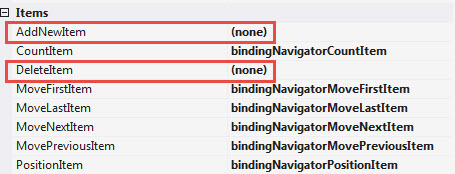
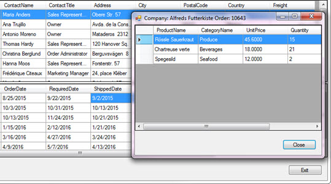
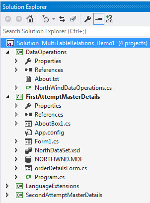

# Master Details in Windows Forms part 1
## Requires
- Visual Studio 2015
## License
- MIT
## Technologies
- Data Binding
- SQL Server
- Windows Forms
- Data Access
- SQL Server management Studio
- data relationships
## Topics
- Controls
- C#
- Data Binding
- SQL Server
- Class Library
- User Interface
- Windows Forms
- Data Access
- Development
- Patterns and Practices
- DataSet
- DataGridView
- How to
- Windows Forms Controls
- DataTable
- Databases
- application development
- Master/Detail
- data and storage
## Updated
- 08/30/2016
## Description

<h1>Description</h1>

The goal of this series is to show how to create a master-detail view of data which resides in a SQL-Server database using several tables from Microsoft NorthWind database. This is a series because I&rsquo;ve seen many attempts
 failing from developers asking how to rectify botched attempts on Microsoft social forums in several of the forums. This, part 1 will show a working example that works but in the end can be greatly improved upon which I will do in part 2 and part 3 of the
 series. In part 2 a class project will be introduced that will be responsible for all data operations which allows other applications/solutions that use the same database to have code to start with. Part 3 will show how to add detail records (orders table)
 along with adding detail records (the details to the parent table orders). The last part will show a fully functional version using Entity Framework which will have more tables added into the mix e.g. shippers, employees etc.

For VB.NET developers see <a href="https://code.msdn.microsoft.com/Basics-of-manuall-creating-aa1a5c3d">
the following code sample</a> for doing master-detail.

C# developers, to work with Entity Framework in a forms solution for working with one table see
<a href="https://code.msdn.microsoft.com/Entity-Framework-in-764fa5ba">my code sample</a>. Doing Entity Framwork may not appeal to everyone in the windows desktop developer's community which is why I didn't start with Entity Framework but I highly suggest considering
 working with Entity Framework, it's very powerful. At the current time Entity Framework 6 is best while the next version is very promising, Entity Framework 7 or Core.

 
What is needed, Visual Studio 2015, SQL-Server Management Studio and of course SQL-Server which can be SQL-Server Express edition 
 
The first step should start with a good database design, this means you have thoroughly thought-out what tables will be needed, fields within the tables and proper relationships between all tables. Make sure to consider (via business
 rules) which columns in the tables are null-able. It will be wise to setup database diagram for tables in the database too as when you get to using Entity Framework they will be seen as navigation attributes which in turn takes care of joins between your related
 tables. 
 
It&rsquo;s very rare to have an application/solution that has a single table and there are indeed times when one table is needed yet this is indeed rare. 
 
Once a database design has been completed and tested by adding test data running queries to ensure you can return needed data you should create a copy of the database either by generating scripts to recreate the database or do
 a backup which you can then restore when a fresh copy is needed. 
 
If possible, have two databases which the same tables. One is for test, one for production and when developing only work with the test version. 
 
If using an attached database rather than a server based database, make a backup of the original as in some cases Visual Studio may upgrade your database and now SQL-Server Management Studio cannot read the database.&nbsp; 
 
Since you have a well-designed database this makes it easy to know your relationships to create relationships in code and this is very important. 
 
Before moving on to step two, as mentioned at the start this version is not the best way to write code even though it works as in this part all data operations are done within a single form. When inspecting the Visual Studio solution
 note there is a class project named DataOpertions which has stubbed out code to do the same thing as in the form for the project FirstAttemptMasterDetails. There is also another class project named LanguageExtensions which will be used in part two. 
 
Step two, create a Visual Studio solution, add a new windows form project. Next, in this case for data I detached NorthWind database from my SQL-Server.&nbsp;

Note, this version of NorthWind has been modified to have proper auto-incrementing primary keys where the original version lacked proper primary keys. I also updated date fields in the order table to have current dates.

Place the attached database into the bin\debug folder of the project. From here create a connection string that points to the database. In the connection string done in this code I use the following which will always point to
 the same folder as the executable.

C#

Edit|Remove

csharp
<pre class="hidden">var fileName = System.IO.Path.Combine(AppDomain.CurrentDomain.BaseDirectory, &quot;NORTHWND.MDF&quot;);</pre>

<pre class="csharp">var&nbsp;fileName&nbsp;=&nbsp;System.IO.Path.Combine(AppDomain.CurrentDomain.BaseDirectory,&nbsp;&quot;NORTHWND.MDF&quot;);</pre>

From here using <a href="https://msdn.microsoft.com/en-us/library/system.data.sqlclient.sqlconnection%28v=vs.110%29.aspx?f=255&MSPPError=-2147217396">
SqlConnection</a> to access customers and order tables via a <a href="https://msdn.microsoft.com/en-us/library/system.data.sqlclient.sqldataadapter(v=vs.110).aspx">
SqlDataAdapter</a> query both customers and orders tables using the fields we want rather then using SELECT * which is bad practice, best to ask for the fields you want.

The SqlDataAdapter populates a DataTable into a <a href="https://msdn.microsoft.com/en-us/library/system.data.dataset(v=vs.110).aspx">
DataSet</a> for both customer and order tables.

&nbsp;

C#

Edit|Remove

csharp
<pre class="hidden">var northDataSet = new DataSet();

var fileName = System.IO.Path.Combine(AppDomain.CurrentDomain.BaseDirectory, &quot;NORTHWND.MDF&quot;);

var connectionString = $@&quot;Data Source=(LocalDB)\MSSQLLocalDB;AttachDbFilename={fileName};Integrated Security=false;Connect Timeout=30&quot;;

var da = new SqlDataAdapter();
var ds = new DataSet();

using (SqlConnection cn = new SqlConnection() { ConnectionString = connectionString })
{
    cn.Open();

    da = new SqlDataAdapter(@&quot;
        SELECT 
            CustomerIdentifier, 
            CompanyName, 
            ContactName,
            ContactTitle,
            Address,City,
            Region,
            PostalCode,
            Country,
            Phone,
            Fax 
        FROM 
            Customers&quot;,cn);</pre>

<pre class="js">var&nbsp;northDataSet&nbsp;=&nbsp;new&nbsp;DataSet();&nbsp;
&nbsp;
var&nbsp;fileName&nbsp;=&nbsp;System.IO.Path.Combine(AppDomain.CurrentDomain.BaseDirectory,&nbsp;&quot;NORTHWND.MDF&quot;);&nbsp;
&nbsp;
var&nbsp;connectionString&nbsp;=&nbsp;$@&quot;Data&nbsp;Source=(LocalDB)\MSSQLLocalDB;AttachDbFilename={fileName};Integrated&nbsp;Security=false;Connect&nbsp;Timeout=30&quot;;&nbsp;
&nbsp;
var&nbsp;da&nbsp;=&nbsp;new&nbsp;SqlDataAdapter();&nbsp;
var&nbsp;ds&nbsp;=&nbsp;new&nbsp;DataSet();&nbsp;
&nbsp;
using&nbsp;(SqlConnection&nbsp;cn&nbsp;=&nbsp;new&nbsp;SqlConnection()&nbsp;{&nbsp;ConnectionString&nbsp;=&nbsp;connectionString&nbsp;})&nbsp;
{&nbsp;
&nbsp;&nbsp;&nbsp;&nbsp;cn.Open();&nbsp;
&nbsp;
&nbsp;
&nbsp;&nbsp;&nbsp;&nbsp;da&nbsp;=&nbsp;new&nbsp;SqlDataAdapter(@&quot;&nbsp;
&nbsp;&nbsp;&nbsp;&nbsp;&nbsp;&nbsp;&nbsp;&nbsp;SELECT&nbsp;&nbsp;
&nbsp;&nbsp;&nbsp;&nbsp;&nbsp;&nbsp;&nbsp;&nbsp;&nbsp;&nbsp;&nbsp;&nbsp;CustomerIdentifier,&nbsp;&nbsp;
&nbsp;&nbsp;&nbsp;&nbsp;&nbsp;&nbsp;&nbsp;&nbsp;&nbsp;&nbsp;&nbsp;&nbsp;CompanyName,&nbsp;&nbsp;
&nbsp;&nbsp;&nbsp;&nbsp;&nbsp;&nbsp;&nbsp;&nbsp;&nbsp;&nbsp;&nbsp;&nbsp;ContactName,&nbsp;
&nbsp;&nbsp;&nbsp;&nbsp;&nbsp;&nbsp;&nbsp;&nbsp;&nbsp;&nbsp;&nbsp;&nbsp;ContactTitle,&nbsp;
&nbsp;&nbsp;&nbsp;&nbsp;&nbsp;&nbsp;&nbsp;&nbsp;&nbsp;&nbsp;&nbsp;&nbsp;Address,City,&nbsp;
&nbsp;&nbsp;&nbsp;&nbsp;&nbsp;&nbsp;&nbsp;&nbsp;&nbsp;&nbsp;&nbsp;&nbsp;Region,&nbsp;
&nbsp;&nbsp;&nbsp;&nbsp;&nbsp;&nbsp;&nbsp;&nbsp;&nbsp;&nbsp;&nbsp;&nbsp;PostalCode,&nbsp;
&nbsp;&nbsp;&nbsp;&nbsp;&nbsp;&nbsp;&nbsp;&nbsp;&nbsp;&nbsp;&nbsp;&nbsp;Country,&nbsp;
&nbsp;&nbsp;&nbsp;&nbsp;&nbsp;&nbsp;&nbsp;&nbsp;&nbsp;&nbsp;&nbsp;&nbsp;Phone,&nbsp;
&nbsp;&nbsp;&nbsp;&nbsp;&nbsp;&nbsp;&nbsp;&nbsp;&nbsp;&nbsp;&nbsp;&nbsp;Fax&nbsp;&nbsp;
&nbsp;&nbsp;&nbsp;&nbsp;&nbsp;&nbsp;&nbsp;&nbsp;FROM&nbsp;&nbsp;
&nbsp;&nbsp;&nbsp;&nbsp;&nbsp;&nbsp;&nbsp;&nbsp;&nbsp;&nbsp;&nbsp;&nbsp;Customers&quot;,cn);</pre>

&nbsp;In the code above I have loaded the customer data. Note that the SQL is formatted in a manner making it easy to read and work with. I find even though the query is simple it's good practice to
 write out the SQL this way as when the query gets very complex it's much easier to work with.

 

Side note, all queries used were created in SQL-Server Management Studio. What is cool is you select a database, create a new query then using the query designer to assist in creating the query.

 

Back to code, the last part was to load the customer data, the same is done to obtain order data and we place the data into the same DataSet. 
&nbsp;

Once all data has been loaded into the DataSet there is a need to hide columns when the data is displayed in DataGridView controls.

C#

Edit|Remove

csharp
<pre class="hidden">ds.Tables[&quot;Customers&quot;].Columns[&quot;CustomerIdentifier&quot;].ColumnMapping = MappingType.Hidden;
ds.Tables[&quot;Customers&quot;].Columns[&quot;Region&quot;].ColumnMapping = MappingType.Hidden;
ds.Tables[&quot;Customers&quot;].Columns[&quot;Phone&quot;].ColumnMapping = MappingType.Hidden;
ds.Tables[&quot;Customers&quot;].Columns[&quot;Fax&quot;].ColumnMapping = MappingType.Hidden;</pre>

<pre class="js">ds.Tables[&quot;Customers&quot;].Columns[&quot;CustomerIdentifier&quot;].ColumnMapping&nbsp;=&nbsp;MappingType.Hidden;&nbsp;
ds.Tables[&quot;Customers&quot;].Columns[&quot;Region&quot;].ColumnMapping&nbsp;=&nbsp;MappingType.Hidden;&nbsp;
ds.Tables[&quot;Customers&quot;].Columns[&quot;Phone&quot;].ColumnMapping&nbsp;=&nbsp;MappingType.Hidden;&nbsp;
ds.Tables[&quot;Customers&quot;].Columns[&quot;Fax&quot;].ColumnMapping&nbsp;=&nbsp;MappingType.Hidden;</pre>

Who wants to see the primary key? so we hide it along with a few other columns. The same is done for the order table.

 

The next part shows how the tables become related via DataSet.<a href="https://msdn.microsoft.com/en-us/library/ay82azad%28v=vs.110%29.aspx?f=255&MSPPError=-2147217396">Relations</a>.
 In this case the relations are simple but if needed you can get many-to-many with say three or more tables as
<a href="https://msdn.microsoft.com/en-us/library/aa289510(v=vs.71).aspx">shown here</a>&nbsp;(in the link look at it as conceptual as it's done in typed data containers which is a alternate to how I am doing the relations here).

Relating customers to orders

C#

Edit|Remove

csharp
<pre class="hidden">ds.Relations.Add(
    &quot;CustomersOrders&quot;, 
    ds.Tables[&quot;Customers&quot;].Columns[&quot;CustomerIdentifier&quot;], 
    ds.Tables[&quot;Orders&quot;].Columns[&quot;CustomerIdentifier&quot;]);</pre>

<pre class="js">ds.Relations.Add(&nbsp;
&nbsp;&nbsp;&nbsp;&nbsp;&quot;CustomersOrders&quot;,&nbsp;&nbsp;
&nbsp;&nbsp;&nbsp;&nbsp;ds.Tables[&quot;Customers&quot;].Columns[&quot;CustomerIdentifier&quot;],&nbsp;&nbsp;
&nbsp;&nbsp;&nbsp;&nbsp;ds.Tables[&quot;Orders&quot;].Columns[&quot;CustomerIdentifier&quot;]);</pre>

The first argument is the name for the relationship. When you need to access the relationship use the name, in this case CustomerOrders while the alternate is by index which is fine but tells us nothing about
 which relationship we have and when there are many relationships this assist in using the correct one.

.

Next I create a column expression for the customers table that totals frieght for all orders for the selected customer. Sum returns the sum for freight by pointing to the Order table via Child(CustomerOrders
 &quot;our relationship&quot;).Freight &quot;the field to sum&quot;. Later on I format the data (which is type money) in the DataGridView for customer data.

C#

Edit|Remove

csharp
<pre class="hidden">var FreightExpression = &quot;Sum(Child(CustomersOrders).Freight) &quot;;
ds.Tables[&quot;Customers&quot;].Columns.Add(new DataColumn()
{
    ColumnName = &quot;Freight&quot;,
    DataType = typeof(Decimal),
    Expression = FreightExpression
});</pre>

<pre class="csharp">var&nbsp;FreightExpression&nbsp;=&nbsp;&quot;Sum(Child(CustomersOrders).Freight)&nbsp;&quot;;&nbsp;
ds.Tables[&quot;Customers&quot;].Columns.Add(new&nbsp;DataColumn()&nbsp;
{&nbsp;
&nbsp;&nbsp;&nbsp;&nbsp;ColumnName&nbsp;=&nbsp;&quot;Freight&quot;,&nbsp;
&nbsp;&nbsp;&nbsp;&nbsp;DataType&nbsp;=&nbsp;typeof(Decimal),&nbsp;
&nbsp;&nbsp;&nbsp;&nbsp;Expression&nbsp;=&nbsp;FreightExpression&nbsp;
});</pre>

&nbsp;Next two BindingSource components are wired up to properly display the related customer order data.

C#

Edit|Remove

csharp
<pre class="hidden">bsCustomers.DataSource = ds;
bsCustomers.DataMember = ds.Tables[&quot;Customers&quot;].TableName;
bsOrders.DataSource = bsCustomers;
bsOrders.DataMember = ds.Relations[&quot;CustomersOrders&quot;].RelationName;</pre>

<pre class="js">bsCustomers.DataSource&nbsp;=&nbsp;ds;&nbsp;
bsCustomers.DataMember&nbsp;=&nbsp;ds.Tables[&quot;Customers&quot;].TableName;&nbsp;
bsOrders.DataSource&nbsp;=&nbsp;bsCustomers;&nbsp;
bsOrders.DataMember&nbsp;=&nbsp;ds.Relations[&quot;CustomersOrders&quot;].RelationName;</pre>

&nbsp;The above is the magic for several reasons

<ul>
<li>Provides methods to traverse data via a BindingNavigator.
</li><li>Provides search capabilities to the data.
</li><li>Allows us to subscribe to several events for working with underly data.
</li><li>Provided methods to remove, add and edit data. Part 2 I will use language extension methods to assist with these operations.
</li><li>And of course managing the relations which could be done at the DataSet level but the above bullet points makes sense to move to BindingSource components.
</li></ul>

The next few lines of code configure the DataGridView controls to show data and format a few columns.

C#

Edit|Remove

csharp
<pre class="hidden">CustomersDataGridView.DataSource = bsCustomers;
CustomersDataGridView.Columns[&quot;Freight&quot;].DefaultCellStyle.Format = &quot;C2&quot;;
CustomersDataGridView.Columns[&quot;Freight&quot;].DefaultCellStyle.Alignment = DataGridViewContentAlignment.BottomRight;

OrdersDataGridView.DataSource = bsOrders;
OrdersDataGridView.Columns[&quot;Freight&quot;].DisplayIndex = 10;
OrdersDataGridView.Columns[&quot;Freight&quot;].DefaultCellStyle.Alignment = DataGridViewContentAlignment.BottomRight;

bindingNavigator1.BindingSource = bsCustomers;</pre>

<pre class="js">CustomersDataGridView.DataSource&nbsp;=&nbsp;bsCustomers;&nbsp;
CustomersDataGridView.Columns[&quot;Freight&quot;].DefaultCellStyle.Format&nbsp;=&nbsp;&quot;C2&quot;;&nbsp;
CustomersDataGridView.Columns[&quot;Freight&quot;].DefaultCellStyle.Alignment&nbsp;=&nbsp;DataGridViewContentAlignment.BottomRight;&nbsp;
&nbsp;
OrdersDataGridView.DataSource&nbsp;=&nbsp;bsOrders;&nbsp;
OrdersDataGridView.Columns[&quot;Freight&quot;].DisplayIndex&nbsp;=&nbsp;10;&nbsp;
OrdersDataGridView.Columns[&quot;Freight&quot;].DefaultCellStyle.Alignment&nbsp;=&nbsp;DataGridViewContentAlignment.BottomRight;&nbsp;
&nbsp;
bindingNavigator1.BindingSource&nbsp;=&nbsp;bsCustomers;</pre>

When using the code above&nbsp;each DataGridView will have columns named the same as the fields in the DataTable columns. An alternate is to create in the IDE, columns for each field which needs to
 be displayed, set properties for indication which column matches up to a field in the underlying data.

.

Using the methods I've done here makes it easier to use in other forms and projects where the only dependency is a blank DataGridView.&nbsp;

.

From here we need to write code to allow the user to see order details, here is the code which will display a single order's records. Note we are back into bad practice e.g. using a local connection
 string and coding this in the form. Can you see a difference in the connection strings used in this form? This was done on purpose e.g. some developer figured out a different setting, does it in one connection string but forgets to do so in the other and this
 is where using one connection string pervents this from happening. Can you also determine other reasons why this code needs refactoring even when it works? We will go over this in part 2.

C#

Edit|Remove

csharp
<pre class="hidden">private void DisplayCurrentOrderDetails()
{
    var orderDetailsTable = new DataTable();

    var fileName = System.IO.Path.Combine(AppDomain.CurrentDomain.BaseDirectory, &quot;NORTHWND.MDF&quot;);
    var connectionString = $@&quot;Data Source=(LocalDB)\MSSQLLocalDB;AttachDbFilename={fileName};Integrated Security=True;Connect Timeout=30&quot;;

    using (SqlConnection cn = new SqlConnection() { ConnectionString = connectionString })
    {
        var commandText = @&quot;
            SELECT
                [Order Details].OrderID, 
                Products.ProductName, 
                Categories.CategoryName, 
                [Order Details].UnitPrice, 
                [Order Details].Quantity, 
                [Order Details].Discount
            FROM
                [Order Details] INNER JOIN
                Products ON [Order Details].ProductID = Products.ProductID INNER JOIN
                Categories ON Products.CategoryID = Categories.CategoryID
            WHERE        
                ([Order Details].OrderID = @OrderID)                    
            &quot;;

        using (SqlCommand cmd = new SqlCommand() { Connection = cn, CommandText = commandText })
        {
            cmd.Parameters.AddWithValue(&quot;@OrderID&quot;, ((DataRowView)bsOrders.Current).Row.Field&lt;int&gt;(&quot;OrderId&quot;));
            cn.Open();
            orderDetailsTable.Load(cmd.ExecuteReader());
            orderDetailsTable.Columns[&quot;OrderID&quot;].ColumnMapping = MappingType.Hidden;
            orderDetailsForm f = new orderDetailsForm(orderDetailsTable);

            f.Text = $&quot;Company: {((DataRowView)bsCustomers.Current).Row.Field&lt;string&gt;(&quot;CompanyName&quot;)} Order: {((DataRowView)bsOrders.Current).Row.Field&lt;int&gt;(&quot;OrderId&quot;)}&quot;;
            try
            {
                f.ShowDialog();
            }
            finally
            {
                f.Dispose();
            }
        }
    }
}</pre>

<pre class="js">private&nbsp;void&nbsp;DisplayCurrentOrderDetails()&nbsp;
{&nbsp;
&nbsp;&nbsp;&nbsp;&nbsp;var&nbsp;orderDetailsTable&nbsp;=&nbsp;new&nbsp;DataTable();&nbsp;
&nbsp;
&nbsp;&nbsp;&nbsp;&nbsp;var&nbsp;fileName&nbsp;=&nbsp;System.IO.Path.Combine(AppDomain.CurrentDomain.BaseDirectory,&nbsp;&quot;NORTHWND.MDF&quot;);&nbsp;
&nbsp;&nbsp;&nbsp;&nbsp;var&nbsp;connectionString&nbsp;=&nbsp;$@&quot;Data&nbsp;Source=(LocalDB)\MSSQLLocalDB;AttachDbFilename={fileName};Integrated&nbsp;Security=True;Connect&nbsp;Timeout=30&quot;;&nbsp;
&nbsp;
&nbsp;&nbsp;&nbsp;&nbsp;using&nbsp;(SqlConnection&nbsp;cn&nbsp;=&nbsp;new&nbsp;SqlConnection()&nbsp;{&nbsp;ConnectionString&nbsp;=&nbsp;connectionString&nbsp;})&nbsp;
&nbsp;&nbsp;&nbsp;&nbsp;{&nbsp;
&nbsp;&nbsp;&nbsp;&nbsp;&nbsp;&nbsp;&nbsp;&nbsp;var&nbsp;commandText&nbsp;=&nbsp;@&quot;&nbsp;
&nbsp;&nbsp;&nbsp;&nbsp;&nbsp;&nbsp;&nbsp;&nbsp;&nbsp;&nbsp;&nbsp;&nbsp;SELECT&nbsp;
&nbsp;&nbsp;&nbsp;&nbsp;&nbsp;&nbsp;&nbsp;&nbsp;&nbsp;&nbsp;&nbsp;&nbsp;&nbsp;&nbsp;&nbsp;&nbsp;[Order&nbsp;Details].OrderID,&nbsp;&nbsp;
&nbsp;&nbsp;&nbsp;&nbsp;&nbsp;&nbsp;&nbsp;&nbsp;&nbsp;&nbsp;&nbsp;&nbsp;&nbsp;&nbsp;&nbsp;&nbsp;Products.ProductName,&nbsp;&nbsp;
&nbsp;&nbsp;&nbsp;&nbsp;&nbsp;&nbsp;&nbsp;&nbsp;&nbsp;&nbsp;&nbsp;&nbsp;&nbsp;&nbsp;&nbsp;&nbsp;Categories.CategoryName,&nbsp;&nbsp;
&nbsp;&nbsp;&nbsp;&nbsp;&nbsp;&nbsp;&nbsp;&nbsp;&nbsp;&nbsp;&nbsp;&nbsp;&nbsp;&nbsp;&nbsp;&nbsp;[Order&nbsp;Details].UnitPrice,&nbsp;&nbsp;
&nbsp;&nbsp;&nbsp;&nbsp;&nbsp;&nbsp;&nbsp;&nbsp;&nbsp;&nbsp;&nbsp;&nbsp;&nbsp;&nbsp;&nbsp;&nbsp;[Order&nbsp;Details].Quantity,&nbsp;&nbsp;
&nbsp;&nbsp;&nbsp;&nbsp;&nbsp;&nbsp;&nbsp;&nbsp;&nbsp;&nbsp;&nbsp;&nbsp;&nbsp;&nbsp;&nbsp;&nbsp;[Order&nbsp;Details].Discount&nbsp;
&nbsp;&nbsp;&nbsp;&nbsp;&nbsp;&nbsp;&nbsp;&nbsp;&nbsp;&nbsp;&nbsp;&nbsp;FROM&nbsp;
&nbsp;&nbsp;&nbsp;&nbsp;&nbsp;&nbsp;&nbsp;&nbsp;&nbsp;&nbsp;&nbsp;&nbsp;&nbsp;&nbsp;&nbsp;&nbsp;[Order&nbsp;Details]&nbsp;INNER&nbsp;JOIN&nbsp;
&nbsp;&nbsp;&nbsp;&nbsp;&nbsp;&nbsp;&nbsp;&nbsp;&nbsp;&nbsp;&nbsp;&nbsp;&nbsp;&nbsp;&nbsp;&nbsp;Products&nbsp;ON&nbsp;[Order&nbsp;Details].ProductID&nbsp;=&nbsp;Products.ProductID&nbsp;INNER&nbsp;JOIN&nbsp;
&nbsp;&nbsp;&nbsp;&nbsp;&nbsp;&nbsp;&nbsp;&nbsp;&nbsp;&nbsp;&nbsp;&nbsp;&nbsp;&nbsp;&nbsp;&nbsp;Categories&nbsp;ON&nbsp;Products.CategoryID&nbsp;=&nbsp;Categories.CategoryID&nbsp;
&nbsp;&nbsp;&nbsp;&nbsp;&nbsp;&nbsp;&nbsp;&nbsp;&nbsp;&nbsp;&nbsp;&nbsp;WHERE&nbsp;&nbsp;&nbsp;&nbsp;&nbsp;&nbsp;&nbsp;&nbsp;&nbsp;
&nbsp;&nbsp;&nbsp;&nbsp;&nbsp;&nbsp;&nbsp;&nbsp;&nbsp;&nbsp;&nbsp;&nbsp;&nbsp;&nbsp;&nbsp;&nbsp;([Order&nbsp;Details].OrderID&nbsp;=&nbsp;@OrderID)&nbsp;&nbsp;&nbsp;&nbsp;&nbsp;&nbsp;&nbsp;&nbsp;&nbsp;&nbsp;&nbsp;&nbsp;&nbsp;&nbsp;&nbsp;&nbsp;&nbsp;&nbsp;&nbsp;&nbsp;&nbsp;
&nbsp;&nbsp;&nbsp;&nbsp;&nbsp;&nbsp;&nbsp;&nbsp;&nbsp;&nbsp;&nbsp;&nbsp;&quot;;&nbsp;
&nbsp;
&nbsp;&nbsp;&nbsp;&nbsp;&nbsp;&nbsp;&nbsp;&nbsp;using&nbsp;(SqlCommand&nbsp;cmd&nbsp;=&nbsp;new&nbsp;SqlCommand()&nbsp;{&nbsp;Connection&nbsp;=&nbsp;cn,&nbsp;CommandText&nbsp;=&nbsp;commandText&nbsp;})&nbsp;
&nbsp;&nbsp;&nbsp;&nbsp;&nbsp;&nbsp;&nbsp;&nbsp;{&nbsp;
&nbsp;&nbsp;&nbsp;&nbsp;&nbsp;&nbsp;&nbsp;&nbsp;&nbsp;&nbsp;&nbsp;&nbsp;cmd.Parameters.AddWithValue(&quot;@OrderID&quot;,&nbsp;((DataRowView)bsOrders.Current).Row.Field&lt;int&gt;(&quot;OrderId&quot;));&nbsp;
&nbsp;&nbsp;&nbsp;&nbsp;&nbsp;&nbsp;&nbsp;&nbsp;&nbsp;&nbsp;&nbsp;&nbsp;cn.Open();&nbsp;
&nbsp;&nbsp;&nbsp;&nbsp;&nbsp;&nbsp;&nbsp;&nbsp;&nbsp;&nbsp;&nbsp;&nbsp;orderDetailsTable.Load(cmd.ExecuteReader());&nbsp;
&nbsp;&nbsp;&nbsp;&nbsp;&nbsp;&nbsp;&nbsp;&nbsp;&nbsp;&nbsp;&nbsp;&nbsp;orderDetailsTable.Columns[&quot;OrderID&quot;].ColumnMapping&nbsp;=&nbsp;MappingType.Hidden;&nbsp;
&nbsp;&nbsp;&nbsp;&nbsp;&nbsp;&nbsp;&nbsp;&nbsp;&nbsp;&nbsp;&nbsp;&nbsp;orderDetailsForm&nbsp;f&nbsp;=&nbsp;new&nbsp;orderDetailsForm(orderDetailsTable);&nbsp;
&nbsp;
&nbsp;&nbsp;&nbsp;&nbsp;&nbsp;&nbsp;&nbsp;&nbsp;&nbsp;&nbsp;&nbsp;&nbsp;f.Text&nbsp;=&nbsp;$&quot;Company:&nbsp;{((DataRowView)bsCustomers.Current).Row.Field&lt;string&gt;(&quot;CompanyName&quot;)}&nbsp;Order:&nbsp;{((DataRowView)bsOrders.Current).Row.Field&lt;int&gt;(&quot;OrderId&quot;)}&quot;;&nbsp;
&nbsp;&nbsp;&nbsp;&nbsp;&nbsp;&nbsp;&nbsp;&nbsp;&nbsp;&nbsp;&nbsp;&nbsp;try&nbsp;
&nbsp;&nbsp;&nbsp;&nbsp;&nbsp;&nbsp;&nbsp;&nbsp;&nbsp;&nbsp;&nbsp;&nbsp;{&nbsp;
&nbsp;&nbsp;&nbsp;&nbsp;&nbsp;&nbsp;&nbsp;&nbsp;&nbsp;&nbsp;&nbsp;&nbsp;&nbsp;&nbsp;&nbsp;&nbsp;f.ShowDialog();&nbsp;
&nbsp;&nbsp;&nbsp;&nbsp;&nbsp;&nbsp;&nbsp;&nbsp;&nbsp;&nbsp;&nbsp;&nbsp;}&nbsp;
&nbsp;&nbsp;&nbsp;&nbsp;&nbsp;&nbsp;&nbsp;&nbsp;&nbsp;&nbsp;&nbsp;&nbsp;finally&nbsp;
&nbsp;&nbsp;&nbsp;&nbsp;&nbsp;&nbsp;&nbsp;&nbsp;&nbsp;&nbsp;&nbsp;&nbsp;{&nbsp;
&nbsp;&nbsp;&nbsp;&nbsp;&nbsp;&nbsp;&nbsp;&nbsp;&nbsp;&nbsp;&nbsp;&nbsp;&nbsp;&nbsp;&nbsp;&nbsp;f.Dispose();&nbsp;
&nbsp;&nbsp;&nbsp;&nbsp;&nbsp;&nbsp;&nbsp;&nbsp;&nbsp;&nbsp;&nbsp;&nbsp;}&nbsp;
&nbsp;&nbsp;&nbsp;&nbsp;&nbsp;&nbsp;&nbsp;&nbsp;}&nbsp;
&nbsp;&nbsp;&nbsp;&nbsp;}&nbsp;
}</pre>

Note the above method is used multiple times and was a refactor.&nbsp;

Next, a BindingNavigator is used to provide some cool functionality like traversing rows, adding an removing data. We will override the add and remove buttons and assume control rather than using default methods that are builtin.
 The BindingNavigator has a Items property. Each item has a value as shown below, by setting say the AddNewItem to none then nothing happems when depressing Add icon button in the BindingNavigator. In design mode double click the add icon button to create a
 click event or do it via the property window for the item.

Add override (part 2 for working code)

C#

Edit|Remove

csharp
<pre class="hidden">private void bindingNavigatorAddNewItem_Click(object sender, EventArgs e)
{
    MessageBox.Show(&quot;Adding not done in this example&quot;);
}</pre>

<pre class="js">private&nbsp;void&nbsp;bindingNavigatorAddNewItem_Click(object&nbsp;sender,&nbsp;EventArgs&nbsp;e)&nbsp;
{&nbsp;
&nbsp;&nbsp;&nbsp;&nbsp;MessageBox.Show(&quot;Adding&nbsp;not&nbsp;done&nbsp;in&nbsp;this&nbsp;example&quot;);&nbsp;
}</pre>

Delete/remove override, note casting for get company name, we will optimize this and do confirmation and a real removal in part 2.

C#

Edit|Remove

csharp
<pre class="hidden">private void bindingNavigatorDeleteItem_Click(object sender, EventArgs e)
{
    MessageBox.Show($&quot;This is where you would remove '{((DataRowView)bsCustomers.Current).Row.Field&lt;string&gt;(&quot;CompanyName&quot;)}'&quot;);
}</pre>

<pre class="js">private&nbsp;void&nbsp;bindingNavigatorDeleteItem_Click(object&nbsp;sender,&nbsp;EventArgs&nbsp;e)&nbsp;
{&nbsp;
&nbsp;&nbsp;&nbsp;&nbsp;MessageBox.Show($&quot;This&nbsp;is&nbsp;where&nbsp;you&nbsp;would&nbsp;remove&nbsp;'{((DataRowView)bsCustomers.Current).Row.Field&lt;string&gt;(&quot;CompanyName&quot;)}'&quot;);&nbsp;
}</pre>

&nbsp;

&nbsp;

So that is it for part 1. Part 2 will introduce the items mentions earlier in this code sample. At this point you have a working model that will continue to evolve in the next two parts of this series.

&nbsp;

Solution (note the xsd and MDF will not be in the next version)

