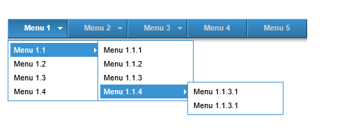

# Menu JavaScript Ajax
## Requires
- Visual Studio 2013
## License
- Apache License, Version 2.0
## Technologies
- AJAX
- SQL Server
- LINQ to SQL
- ASP.NET
- jQuery
- Javascript
- Visual Basic .NET
## Topics
- AJAX
- Menu
- Javascript
## Updated
- 06/04/2014
## Description

&nbsp;

<h1>Introduction</h1>

<em>Load javascript menu with ajax from client</em>

<em>Cargar menu javascript con ajax desde el cliente</em>

<h1>Building the Sample</h1>

<em>1 Downloading Menu.Zip</em>

<em>2 Run sql script dbProyecto.sql server database&nbsp;</em>

<em>3 Change Connection string in web.config &quot;dbProyectoConnectionString&quot;&nbsp;</em>

<em>4 Compile</em>

&nbsp;

<em>1 Descargar Menu.Zip</em>

<em>2 Ejecutar script sql dbProyecto.sql en servidor de base de datos</em>

<em>3 Cambiar cadena de conexion en el web.config &quot;dbProyectoConnectionString&quot;</em>

<em>4 Compilar 
</em>

Description

Upload a menu client so this can improve the application loading thanks to the work is done by the browser (client)

Cargar un men&uacute; de cliente de tal forma esto puede mejorar la carga del aplicativo gracias a que el trabajo lo realiza el navegador (Cliente)

<em></em>

<em> 
</em>

JavaScriptVisual Basic

Edit|Remove

jsvb
<pre class="hidden">function Menu() {
    var menu;
    $.ajax({
        type: &quot;POST&quot;,
        url: &quot;Default.aspx/CargarMenu&quot;,
        contentType: &quot;application/json; charset=utf-8&quot;,
        dataType: &quot;json&quot;,
        success: function (msg) {
            var lsMenu = msg.d;
            var _menu = lsMenu;
            var _hijo;
            var div = document.getElementById('nav');
            var listItems = [];
            var str = '';
            var str2 = '';
            if (lsMenu.length &gt; 0) {
                for (var key in lsMenu) {
                    if (lsMenu[key].intIdMenu == lsMenu[key].intIdPadre) {
                        _hijo = SubMenuVertical(_menu, lsMenu[key].intIdMenu);
                        str = '&lt;li class=&quot;top&quot;&gt;&lt;a href=&quot;' &#43; lsMenu[key].strUrl &#43; '&quot; onclick=&quot;event.preventDefault();&quot; class=&quot;top_link&quot;&gt;';
                        if (_hijo) { str = str &#43; '&lt;span class=&quot;down&quot;&gt;'; } else { str = str &#43; '&lt;span&gt;'; }
                        str = str &#43; lsMenu[key].strDescripcion &#43; '&lt;/span&gt;&lt;/a&gt;';
                        //CargarMenuVertical
                        str = str &#43; MenuVertical(_menu, lsMenu[key].intIdMenu, _hijo);

                        str = str &#43; '&lt;/li&gt;';
                        listItems.push(str);
                    }
                }
                div.innerHTML = div.innerHTML &#43; listItems.join('');
            }
            else {
                alert(&quot;No records found&quot;);
            }
        },
        error: function (XMLHttpRequest, textStatus, errorThrown) {
            //alert(textStatus);
        }
    });
}
function MenuVertical(_menu, ID, MenVertical) {
    var _str = '';
    if (MenVertical) { _str = _str &#43; '&lt;ul class=&quot;sub&quot;&gt;'; } else { _str = _str &#43; '&lt;ul&gt;'; }
    for (var key in _menu) {
        _MenuHo = false;
        if (_menu[key].intIdMenu != _menu[key].intIdPadre &amp; _menu[key].intIdPadre == ID) {
            _str = _str &#43; '&lt;li&gt;&lt;a href=&quot;' &#43; _menu[key].strUrl &#43; '&quot; target=&quot;content&quot; onclick=&quot;event.preventDefault();&quot; ';
            if (SiMenuHorizotal(_menu, _menu[key].intIdMenu)) {
                _str = _str &#43; 'class=&quot;fly&quot;';
            }
            _str = _str &#43; '&gt;' &#43; _menu[key].strDescripcion &#43; '&lt;/a&gt;';
            //MenuHorizontal
            _str = _str &#43; MenuHorizontal(_menu, _menu[key].intIdMenu);

            _str = _str &#43; '&lt;/li&gt;';
        }
    }
    _str = _str &#43; '&lt;/ul&gt;';
    return _str;
}
function SiMenuHorizotal(_menu, ID_) {
    var sw = false;
    for (var key in _menu) {
        if (_menu[key].intIdMenu != _menu[key].intIdPadre &amp; _menu[key].intIdPadre == ID_ &amp; sw == false) {
            sw = true;
        }
    }
    return sw;
}
function MenuHorizontal(_menu, ID) {
    var str_ = '';
    var sw = false;
    for (var key in _menu) {
        if (_menu[key].intIdMenu != _menu[key].intIdPadre &amp; _menu[key].intIdPadre == ID) {
            if (sw == false) { str_ = str_ &#43; '&lt;ul&gt;'; sw = true; }
            str_ = str_ &#43; '&lt;li&gt;&lt;a href=&quot;' &#43; _menu[key].strUrl &#43; '&quot; target=&quot;content&quot; onclick=&quot;event.preventDefault();&quot; ';
            if (SiMenuHorizotal(_menu, _menu[key].intIdMenu)) {
                str_ = str_ &#43; 'class=&quot;fly&quot;';
            }
            str_ = str_ &#43; '&gt;' &#43; _menu[key].strDescripcion &#43; '&lt;/a&gt;';
            //MenuHorizontal
            str_ = str_ &#43; MenuHorizontal(_menu, _menu[key].intIdMenu);

            str_ = str_ &#43; '&lt;/li&gt;';
        }
    }
    if (sw) { str_ = str_ &#43; '&lt;/ul&gt;'; sw = false; }
    return str_;
}

function SubMenuVertical(_menu, ID) {
    var sw = false;
    var str = '';
    for (var key in _menu) {
        if (_menu[key].intIdMenu == _menu[key].intIdPadre &amp; sw == false) {
            for (var _key in _menu) {
                if (_menu[_key].intIdMenu != _menu[_key].intIdPadre &amp; _menu[_key].intIdPadre == ID &amp; sw == false) {
                    sw = true;
                }

            }
        }
    }
    return sw;
}</pre>
<pre class="hidden"> &lt;WebMethod(EnableSession:=True)&gt; _
    Public Shared Function CargarMenu() As List(Of usp_ConsultarMenuResult)
        Try
            Dim dcl As New dclProyectoDataContext
            Dim qryMenu = dcl.usp_ConsultarMenu.ToList
            Return qryMenu
        Catch ex As Exception
            Return Nothing
        End Try
    End Function</pre>

<pre class="js">function&nbsp;Menu()&nbsp;{&nbsp;
&nbsp;&nbsp;&nbsp;&nbsp;var&nbsp;menu;&nbsp;
&nbsp;&nbsp;&nbsp;&nbsp;$.ajax({&nbsp;
&nbsp;&nbsp;&nbsp;&nbsp;&nbsp;&nbsp;&nbsp;&nbsp;type:&nbsp;&quot;POST&quot;,&nbsp;
&nbsp;&nbsp;&nbsp;&nbsp;&nbsp;&nbsp;&nbsp;&nbsp;url:&nbsp;&quot;Default.aspx/CargarMenu&quot;,&nbsp;
&nbsp;&nbsp;&nbsp;&nbsp;&nbsp;&nbsp;&nbsp;&nbsp;contentType:&nbsp;&quot;application/json;&nbsp;charset=utf-8&quot;,&nbsp;
&nbsp;&nbsp;&nbsp;&nbsp;&nbsp;&nbsp;&nbsp;&nbsp;dataType:&nbsp;&quot;json&quot;,&nbsp;
&nbsp;&nbsp;&nbsp;&nbsp;&nbsp;&nbsp;&nbsp;&nbsp;success:&nbsp;function&nbsp;(msg)&nbsp;{&nbsp;
&nbsp;&nbsp;&nbsp;&nbsp;&nbsp;&nbsp;&nbsp;&nbsp;&nbsp;&nbsp;&nbsp;&nbsp;var&nbsp;lsMenu&nbsp;=&nbsp;msg.d;&nbsp;
&nbsp;&nbsp;&nbsp;&nbsp;&nbsp;&nbsp;&nbsp;&nbsp;&nbsp;&nbsp;&nbsp;&nbsp;var&nbsp;_menu&nbsp;=&nbsp;lsMenu;&nbsp;
&nbsp;&nbsp;&nbsp;&nbsp;&nbsp;&nbsp;&nbsp;&nbsp;&nbsp;&nbsp;&nbsp;&nbsp;var&nbsp;_hijo;&nbsp;
&nbsp;&nbsp;&nbsp;&nbsp;&nbsp;&nbsp;&nbsp;&nbsp;&nbsp;&nbsp;&nbsp;&nbsp;var&nbsp;div&nbsp;=&nbsp;document.getElementById('nav');&nbsp;
&nbsp;&nbsp;&nbsp;&nbsp;&nbsp;&nbsp;&nbsp;&nbsp;&nbsp;&nbsp;&nbsp;&nbsp;var&nbsp;listItems&nbsp;=&nbsp;[];&nbsp;
&nbsp;&nbsp;&nbsp;&nbsp;&nbsp;&nbsp;&nbsp;&nbsp;&nbsp;&nbsp;&nbsp;&nbsp;var&nbsp;str&nbsp;=&nbsp;'';&nbsp;
&nbsp;&nbsp;&nbsp;&nbsp;&nbsp;&nbsp;&nbsp;&nbsp;&nbsp;&nbsp;&nbsp;&nbsp;var&nbsp;str2&nbsp;=&nbsp;'';&nbsp;
&nbsp;&nbsp;&nbsp;&nbsp;&nbsp;&nbsp;&nbsp;&nbsp;&nbsp;&nbsp;&nbsp;&nbsp;if&nbsp;(lsMenu.length&nbsp;&gt;&nbsp;0)&nbsp;{&nbsp;
&nbsp;&nbsp;&nbsp;&nbsp;&nbsp;&nbsp;&nbsp;&nbsp;&nbsp;&nbsp;&nbsp;&nbsp;&nbsp;&nbsp;&nbsp;&nbsp;for&nbsp;(var&nbsp;key&nbsp;in&nbsp;lsMenu)&nbsp;{&nbsp;
&nbsp;&nbsp;&nbsp;&nbsp;&nbsp;&nbsp;&nbsp;&nbsp;&nbsp;&nbsp;&nbsp;&nbsp;&nbsp;&nbsp;&nbsp;&nbsp;&nbsp;&nbsp;&nbsp;&nbsp;if&nbsp;(lsMenu[key].intIdMenu&nbsp;==&nbsp;lsMenu[key].intIdPadre)&nbsp;{&nbsp;
&nbsp;&nbsp;&nbsp;&nbsp;&nbsp;&nbsp;&nbsp;&nbsp;&nbsp;&nbsp;&nbsp;&nbsp;&nbsp;&nbsp;&nbsp;&nbsp;&nbsp;&nbsp;&nbsp;&nbsp;&nbsp;&nbsp;&nbsp;&nbsp;_hijo&nbsp;=&nbsp;SubMenuVertical(_menu,&nbsp;lsMenu[key].intIdMenu);&nbsp;
&nbsp;&nbsp;&nbsp;&nbsp;&nbsp;&nbsp;&nbsp;&nbsp;&nbsp;&nbsp;&nbsp;&nbsp;&nbsp;&nbsp;&nbsp;&nbsp;&nbsp;&nbsp;&nbsp;&nbsp;&nbsp;&nbsp;&nbsp;&nbsp;str&nbsp;=&nbsp;'&lt;li&nbsp;class=&quot;top&quot;&gt;&lt;a&nbsp;href=&quot;'&nbsp;&#43;&nbsp;lsMenu[key].strUrl&nbsp;&#43;&nbsp;'&quot;&nbsp;onclick=&quot;event.preventDefault();&quot;&nbsp;class=&quot;top_link&quot;&gt;';&nbsp;
&nbsp;&nbsp;&nbsp;&nbsp;&nbsp;&nbsp;&nbsp;&nbsp;&nbsp;&nbsp;&nbsp;&nbsp;&nbsp;&nbsp;&nbsp;&nbsp;&nbsp;&nbsp;&nbsp;&nbsp;&nbsp;&nbsp;&nbsp;&nbsp;if&nbsp;(_hijo)&nbsp;{&nbsp;str&nbsp;=&nbsp;str&nbsp;&#43;&nbsp;'&lt;span&nbsp;class=&quot;down&quot;&gt;';&nbsp;}&nbsp;else&nbsp;{&nbsp;str&nbsp;=&nbsp;str&nbsp;&#43;&nbsp;'&lt;span&gt;';&nbsp;}&nbsp;
&nbsp;&nbsp;&nbsp;&nbsp;&nbsp;&nbsp;&nbsp;&nbsp;&nbsp;&nbsp;&nbsp;&nbsp;&nbsp;&nbsp;&nbsp;&nbsp;&nbsp;&nbsp;&nbsp;&nbsp;&nbsp;&nbsp;&nbsp;&nbsp;str&nbsp;=&nbsp;str&nbsp;&#43;&nbsp;lsMenu[key].strDescripcion&nbsp;&#43;&nbsp;'&lt;/span&gt;&lt;/a&gt;';&nbsp;
&nbsp;&nbsp;&nbsp;&nbsp;&nbsp;&nbsp;&nbsp;&nbsp;&nbsp;&nbsp;&nbsp;&nbsp;&nbsp;&nbsp;&nbsp;&nbsp;&nbsp;&nbsp;&nbsp;&nbsp;&nbsp;&nbsp;&nbsp;&nbsp;//CargarMenuVertical&nbsp;
&nbsp;&nbsp;&nbsp;&nbsp;&nbsp;&nbsp;&nbsp;&nbsp;&nbsp;&nbsp;&nbsp;&nbsp;&nbsp;&nbsp;&nbsp;&nbsp;&nbsp;&nbsp;&nbsp;&nbsp;&nbsp;&nbsp;&nbsp;&nbsp;str&nbsp;=&nbsp;str&nbsp;&#43;&nbsp;MenuVertical(_menu,&nbsp;lsMenu[key].intIdMenu,&nbsp;_hijo);&nbsp;
&nbsp;
&nbsp;&nbsp;&nbsp;&nbsp;&nbsp;&nbsp;&nbsp;&nbsp;&nbsp;&nbsp;&nbsp;&nbsp;&nbsp;&nbsp;&nbsp;&nbsp;&nbsp;&nbsp;&nbsp;&nbsp;&nbsp;&nbsp;&nbsp;&nbsp;str&nbsp;=&nbsp;str&nbsp;&#43;&nbsp;'&lt;/li&gt;';&nbsp;
&nbsp;&nbsp;&nbsp;&nbsp;&nbsp;&nbsp;&nbsp;&nbsp;&nbsp;&nbsp;&nbsp;&nbsp;&nbsp;&nbsp;&nbsp;&nbsp;&nbsp;&nbsp;&nbsp;&nbsp;&nbsp;&nbsp;&nbsp;&nbsp;listItems.push(str);&nbsp;
&nbsp;&nbsp;&nbsp;&nbsp;&nbsp;&nbsp;&nbsp;&nbsp;&nbsp;&nbsp;&nbsp;&nbsp;&nbsp;&nbsp;&nbsp;&nbsp;&nbsp;&nbsp;&nbsp;&nbsp;}&nbsp;
&nbsp;&nbsp;&nbsp;&nbsp;&nbsp;&nbsp;&nbsp;&nbsp;&nbsp;&nbsp;&nbsp;&nbsp;&nbsp;&nbsp;&nbsp;&nbsp;}&nbsp;
&nbsp;&nbsp;&nbsp;&nbsp;&nbsp;&nbsp;&nbsp;&nbsp;&nbsp;&nbsp;&nbsp;&nbsp;&nbsp;&nbsp;&nbsp;&nbsp;div.innerHTML&nbsp;=&nbsp;div.innerHTML&nbsp;&#43;&nbsp;listItems.join('');&nbsp;
&nbsp;&nbsp;&nbsp;&nbsp;&nbsp;&nbsp;&nbsp;&nbsp;&nbsp;&nbsp;&nbsp;&nbsp;}&nbsp;
&nbsp;&nbsp;&nbsp;&nbsp;&nbsp;&nbsp;&nbsp;&nbsp;&nbsp;&nbsp;&nbsp;&nbsp;else&nbsp;{&nbsp;
&nbsp;&nbsp;&nbsp;&nbsp;&nbsp;&nbsp;&nbsp;&nbsp;&nbsp;&nbsp;&nbsp;&nbsp;&nbsp;&nbsp;&nbsp;&nbsp;alert(&quot;No&nbsp;records&nbsp;found&quot;);&nbsp;
&nbsp;&nbsp;&nbsp;&nbsp;&nbsp;&nbsp;&nbsp;&nbsp;&nbsp;&nbsp;&nbsp;&nbsp;}&nbsp;
&nbsp;&nbsp;&nbsp;&nbsp;&nbsp;&nbsp;&nbsp;&nbsp;},&nbsp;
&nbsp;&nbsp;&nbsp;&nbsp;&nbsp;&nbsp;&nbsp;&nbsp;error:&nbsp;function&nbsp;(XMLHttpRequest,&nbsp;textStatus,&nbsp;errorThrown)&nbsp;{&nbsp;
&nbsp;&nbsp;&nbsp;&nbsp;&nbsp;&nbsp;&nbsp;&nbsp;&nbsp;&nbsp;&nbsp;&nbsp;//alert(textStatus);&nbsp;
&nbsp;&nbsp;&nbsp;&nbsp;&nbsp;&nbsp;&nbsp;&nbsp;}&nbsp;
&nbsp;&nbsp;&nbsp;&nbsp;});&nbsp;
}&nbsp;
function&nbsp;MenuVertical(_menu,&nbsp;ID,&nbsp;MenVertical)&nbsp;{&nbsp;
&nbsp;&nbsp;&nbsp;&nbsp;var&nbsp;_str&nbsp;=&nbsp;'';&nbsp;
&nbsp;&nbsp;&nbsp;&nbsp;if&nbsp;(MenVertical)&nbsp;{&nbsp;_str&nbsp;=&nbsp;_str&nbsp;&#43;&nbsp;'&lt;ul&nbsp;class=&quot;sub&quot;&gt;';&nbsp;}&nbsp;else&nbsp;{&nbsp;_str&nbsp;=&nbsp;_str&nbsp;&#43;&nbsp;'&lt;ul&gt;';&nbsp;}&nbsp;
&nbsp;&nbsp;&nbsp;&nbsp;for&nbsp;(var&nbsp;key&nbsp;in&nbsp;_menu)&nbsp;{&nbsp;
&nbsp;&nbsp;&nbsp;&nbsp;&nbsp;&nbsp;&nbsp;&nbsp;_MenuHo&nbsp;=&nbsp;false;&nbsp;
&nbsp;&nbsp;&nbsp;&nbsp;&nbsp;&nbsp;&nbsp;&nbsp;if&nbsp;(_menu[key].intIdMenu&nbsp;!=&nbsp;_menu[key].intIdPadre&nbsp;&amp;&nbsp;_menu[key].intIdPadre&nbsp;==&nbsp;ID)&nbsp;{&nbsp;
&nbsp;&nbsp;&nbsp;&nbsp;&nbsp;&nbsp;&nbsp;&nbsp;&nbsp;&nbsp;&nbsp;&nbsp;_str&nbsp;=&nbsp;_str&nbsp;&#43;&nbsp;'&lt;li&gt;&lt;a&nbsp;href=&quot;'&nbsp;&#43;&nbsp;_menu[key].strUrl&nbsp;&#43;&nbsp;'&quot;&nbsp;target=&quot;content&quot;&nbsp;onclick=&quot;event.preventDefault();&quot;&nbsp;';&nbsp;
&nbsp;&nbsp;&nbsp;&nbsp;&nbsp;&nbsp;&nbsp;&nbsp;&nbsp;&nbsp;&nbsp;&nbsp;if&nbsp;(SiMenuHorizotal(_menu,&nbsp;_menu[key].intIdMenu))&nbsp;{&nbsp;
&nbsp;&nbsp;&nbsp;&nbsp;&nbsp;&nbsp;&nbsp;&nbsp;&nbsp;&nbsp;&nbsp;&nbsp;&nbsp;&nbsp;&nbsp;&nbsp;_str&nbsp;=&nbsp;_str&nbsp;&#43;&nbsp;'class=&quot;fly&quot;';&nbsp;
&nbsp;&nbsp;&nbsp;&nbsp;&nbsp;&nbsp;&nbsp;&nbsp;&nbsp;&nbsp;&nbsp;&nbsp;}&nbsp;
&nbsp;&nbsp;&nbsp;&nbsp;&nbsp;&nbsp;&nbsp;&nbsp;&nbsp;&nbsp;&nbsp;&nbsp;_str&nbsp;=&nbsp;_str&nbsp;&#43;&nbsp;'&gt;'&nbsp;&#43;&nbsp;_menu[key].strDescripcion&nbsp;&#43;&nbsp;'&lt;/a&gt;';&nbsp;
&nbsp;&nbsp;&nbsp;&nbsp;&nbsp;&nbsp;&nbsp;&nbsp;&nbsp;&nbsp;&nbsp;&nbsp;//MenuHorizontal&nbsp;
&nbsp;&nbsp;&nbsp;&nbsp;&nbsp;&nbsp;&nbsp;&nbsp;&nbsp;&nbsp;&nbsp;&nbsp;_str&nbsp;=&nbsp;_str&nbsp;&#43;&nbsp;MenuHorizontal(_menu,&nbsp;_menu[key].intIdMenu);&nbsp;
&nbsp;
&nbsp;&nbsp;&nbsp;&nbsp;&nbsp;&nbsp;&nbsp;&nbsp;&nbsp;&nbsp;&nbsp;&nbsp;_str&nbsp;=&nbsp;_str&nbsp;&#43;&nbsp;'&lt;/li&gt;';&nbsp;
&nbsp;&nbsp;&nbsp;&nbsp;&nbsp;&nbsp;&nbsp;&nbsp;}&nbsp;
&nbsp;&nbsp;&nbsp;&nbsp;}&nbsp;
&nbsp;&nbsp;&nbsp;&nbsp;_str&nbsp;=&nbsp;_str&nbsp;&#43;&nbsp;'&lt;/ul&gt;';&nbsp;
&nbsp;&nbsp;&nbsp;&nbsp;return&nbsp;_str;&nbsp;
}&nbsp;
function&nbsp;SiMenuHorizotal(_menu,&nbsp;ID_)&nbsp;{&nbsp;
&nbsp;&nbsp;&nbsp;&nbsp;var&nbsp;sw&nbsp;=&nbsp;false;&nbsp;
&nbsp;&nbsp;&nbsp;&nbsp;for&nbsp;(var&nbsp;key&nbsp;in&nbsp;_menu)&nbsp;{&nbsp;
&nbsp;&nbsp;&nbsp;&nbsp;&nbsp;&nbsp;&nbsp;&nbsp;if&nbsp;(_menu[key].intIdMenu&nbsp;!=&nbsp;_menu[key].intIdPadre&nbsp;&amp;&nbsp;_menu[key].intIdPadre&nbsp;==&nbsp;ID_&nbsp;&amp;&nbsp;sw&nbsp;==&nbsp;false)&nbsp;{&nbsp;
&nbsp;&nbsp;&nbsp;&nbsp;&nbsp;&nbsp;&nbsp;&nbsp;&nbsp;&nbsp;&nbsp;&nbsp;sw&nbsp;=&nbsp;true;&nbsp;
&nbsp;&nbsp;&nbsp;&nbsp;&nbsp;&nbsp;&nbsp;&nbsp;}&nbsp;
&nbsp;&nbsp;&nbsp;&nbsp;}&nbsp;
&nbsp;&nbsp;&nbsp;&nbsp;return&nbsp;sw;&nbsp;
}&nbsp;
function&nbsp;MenuHorizontal(_menu,&nbsp;ID)&nbsp;{&nbsp;
&nbsp;&nbsp;&nbsp;&nbsp;var&nbsp;str_&nbsp;=&nbsp;'';&nbsp;
&nbsp;&nbsp;&nbsp;&nbsp;var&nbsp;sw&nbsp;=&nbsp;false;&nbsp;
&nbsp;&nbsp;&nbsp;&nbsp;for&nbsp;(var&nbsp;key&nbsp;in&nbsp;_menu)&nbsp;{&nbsp;
&nbsp;&nbsp;&nbsp;&nbsp;&nbsp;&nbsp;&nbsp;&nbsp;if&nbsp;(_menu[key].intIdMenu&nbsp;!=&nbsp;_menu[key].intIdPadre&nbsp;&amp;&nbsp;_menu[key].intIdPadre&nbsp;==&nbsp;ID)&nbsp;{&nbsp;
&nbsp;&nbsp;&nbsp;&nbsp;&nbsp;&nbsp;&nbsp;&nbsp;&nbsp;&nbsp;&nbsp;&nbsp;if&nbsp;(sw&nbsp;==&nbsp;false)&nbsp;{&nbsp;str_&nbsp;=&nbsp;str_&nbsp;&#43;&nbsp;'&lt;ul&gt;';&nbsp;sw&nbsp;=&nbsp;true;&nbsp;}&nbsp;
&nbsp;&nbsp;&nbsp;&nbsp;&nbsp;&nbsp;&nbsp;&nbsp;&nbsp;&nbsp;&nbsp;&nbsp;str_&nbsp;=&nbsp;str_&nbsp;&#43;&nbsp;'&lt;li&gt;&lt;a&nbsp;href=&quot;'&nbsp;&#43;&nbsp;_menu[key].strUrl&nbsp;&#43;&nbsp;'&quot;&nbsp;target=&quot;content&quot;&nbsp;onclick=&quot;event.preventDefault();&quot;&nbsp;';&nbsp;
&nbsp;&nbsp;&nbsp;&nbsp;&nbsp;&nbsp;&nbsp;&nbsp;&nbsp;&nbsp;&nbsp;&nbsp;if&nbsp;(SiMenuHorizotal(_menu,&nbsp;_menu[key].intIdMenu))&nbsp;{&nbsp;
&nbsp;&nbsp;&nbsp;&nbsp;&nbsp;&nbsp;&nbsp;&nbsp;&nbsp;&nbsp;&nbsp;&nbsp;&nbsp;&nbsp;&nbsp;&nbsp;str_&nbsp;=&nbsp;str_&nbsp;&#43;&nbsp;'class=&quot;fly&quot;';&nbsp;
&nbsp;&nbsp;&nbsp;&nbsp;&nbsp;&nbsp;&nbsp;&nbsp;&nbsp;&nbsp;&nbsp;&nbsp;}&nbsp;
&nbsp;&nbsp;&nbsp;&nbsp;&nbsp;&nbsp;&nbsp;&nbsp;&nbsp;&nbsp;&nbsp;&nbsp;str_&nbsp;=&nbsp;str_&nbsp;&#43;&nbsp;'&gt;'&nbsp;&#43;&nbsp;_menu[key].strDescripcion&nbsp;&#43;&nbsp;'&lt;/a&gt;';&nbsp;
&nbsp;&nbsp;&nbsp;&nbsp;&nbsp;&nbsp;&nbsp;&nbsp;&nbsp;&nbsp;&nbsp;&nbsp;//MenuHorizontal&nbsp;
&nbsp;&nbsp;&nbsp;&nbsp;&nbsp;&nbsp;&nbsp;&nbsp;&nbsp;&nbsp;&nbsp;&nbsp;str_&nbsp;=&nbsp;str_&nbsp;&#43;&nbsp;MenuHorizontal(_menu,&nbsp;_menu[key].intIdMenu);&nbsp;
&nbsp;
&nbsp;&nbsp;&nbsp;&nbsp;&nbsp;&nbsp;&nbsp;&nbsp;&nbsp;&nbsp;&nbsp;&nbsp;str_&nbsp;=&nbsp;str_&nbsp;&#43;&nbsp;'&lt;/li&gt;';&nbsp;
&nbsp;&nbsp;&nbsp;&nbsp;&nbsp;&nbsp;&nbsp;&nbsp;}&nbsp;
&nbsp;&nbsp;&nbsp;&nbsp;}&nbsp;
&nbsp;&nbsp;&nbsp;&nbsp;if&nbsp;(sw)&nbsp;{&nbsp;str_&nbsp;=&nbsp;str_&nbsp;&#43;&nbsp;'&lt;/ul&gt;';&nbsp;sw&nbsp;=&nbsp;false;&nbsp;}&nbsp;
&nbsp;&nbsp;&nbsp;&nbsp;return&nbsp;str_;&nbsp;
}&nbsp;
&nbsp;
function&nbsp;SubMenuVertical(_menu,&nbsp;ID)&nbsp;{&nbsp;
&nbsp;&nbsp;&nbsp;&nbsp;var&nbsp;sw&nbsp;=&nbsp;false;&nbsp;
&nbsp;&nbsp;&nbsp;&nbsp;var&nbsp;str&nbsp;=&nbsp;'';&nbsp;
&nbsp;&nbsp;&nbsp;&nbsp;for&nbsp;(var&nbsp;key&nbsp;in&nbsp;_menu)&nbsp;{&nbsp;
&nbsp;&nbsp;&nbsp;&nbsp;&nbsp;&nbsp;&nbsp;&nbsp;if&nbsp;(_menu[key].intIdMenu&nbsp;==&nbsp;_menu[key].intIdPadre&nbsp;&amp;&nbsp;sw&nbsp;==&nbsp;false)&nbsp;{&nbsp;
&nbsp;&nbsp;&nbsp;&nbsp;&nbsp;&nbsp;&nbsp;&nbsp;&nbsp;&nbsp;&nbsp;&nbsp;for&nbsp;(var&nbsp;_key&nbsp;in&nbsp;_menu)&nbsp;{&nbsp;
&nbsp;&nbsp;&nbsp;&nbsp;&nbsp;&nbsp;&nbsp;&nbsp;&nbsp;&nbsp;&nbsp;&nbsp;&nbsp;&nbsp;&nbsp;&nbsp;if&nbsp;(_menu[_key].intIdMenu&nbsp;!=&nbsp;_menu[_key].intIdPadre&nbsp;&amp;&nbsp;_menu[_key].intIdPadre&nbsp;==&nbsp;ID&nbsp;&amp;&nbsp;sw&nbsp;==&nbsp;false)&nbsp;{&nbsp;
&nbsp;&nbsp;&nbsp;&nbsp;&nbsp;&nbsp;&nbsp;&nbsp;&nbsp;&nbsp;&nbsp;&nbsp;&nbsp;&nbsp;&nbsp;&nbsp;&nbsp;&nbsp;&nbsp;&nbsp;sw&nbsp;=&nbsp;true;&nbsp;
&nbsp;&nbsp;&nbsp;&nbsp;&nbsp;&nbsp;&nbsp;&nbsp;&nbsp;&nbsp;&nbsp;&nbsp;&nbsp;&nbsp;&nbsp;&nbsp;}&nbsp;
&nbsp;
&nbsp;&nbsp;&nbsp;&nbsp;&nbsp;&nbsp;&nbsp;&nbsp;&nbsp;&nbsp;&nbsp;&nbsp;}&nbsp;
&nbsp;&nbsp;&nbsp;&nbsp;&nbsp;&nbsp;&nbsp;&nbsp;}&nbsp;
&nbsp;&nbsp;&nbsp;&nbsp;}&nbsp;
&nbsp;&nbsp;&nbsp;&nbsp;return&nbsp;sw;&nbsp;
}</pre>

<h1>Source Code Files</h1>
<ul>
<li><em>Menu.7z</em> </li></ul>

&nbsp;

<h1>Information</h1>

New trends in the implementation of development methodologies customers you are marking the starting point for new developments and nothing better than having a menu that is loaded asynchronous using.

One of the things is that we use supplements and open source technologies such as jQuery and other free framework

En las nuevas tendencias de desarrollo la implementaci&oacute;n de metodologias clientes estas marcando el punto de partida en los nuevos desarrollos y nada mejor que tener un menu que se cargue asincronamente.

Una de las cosas es que utilizamos complementos y tecnolog&iacute;as libres como lo son jquery y otros framework gratuitos

