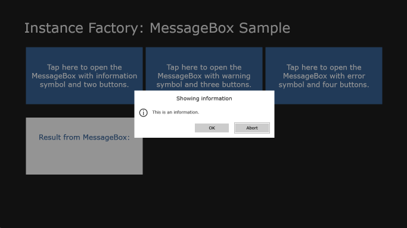
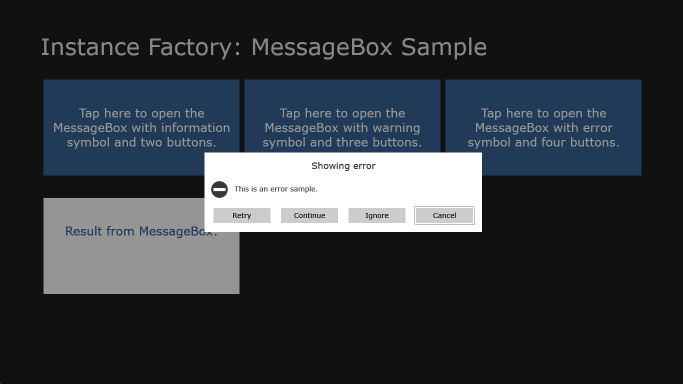

# MessageBox for Windows Store Apps in C# / XAML
## Requires
- Visual Studio 2012
## License
- Apache License, Version 2.0
## Technologies
- C#
- XAML
- Windows Store app
## Topics
- Asynchronous Programming
- modal dialog windows
- messagebox
- Popup Window
## Updated
- 10/21/2013
## Description

<h1>Introduction</h1>

The replacement of MessageBox for Windows Store apps is the class <a title="MessageDialog" href="http://msdn.microsoft.com/en-us/library/windows/apps/windows.ui.popups.messagedialog.aspx" target="_blank">
MessageDialog</a>. 
 
This class is fine as long as you do not need more than three options the user can choose from. In technical words, MessageDialog allows only up to three commands.

This sample implements a modal popup dialog with an unlimited number of commands. It also offers the ability to show an optional symbol. The usage of the MessageBox is very similar to the usage of MessageDialog. It has the following features:

<ul>
<li>Show the message box by calling a ShowAsync method </li><li>Dynamically add IUICommand-based commands with a button label, an optional Action that will be executed when the user selects the command, and an optional id
</li><li>Define a default cancel and default focus command </li><li>Show a message, an optional title, and an optional symbol </li><li>Reset the focus when the message box closes </li></ul>

<h1>More Information</h1>

You can find descriptions and explanations of some of the implementation details in this
<a title="Describing Blog Post" href="http://blog.instance-factory.com/?p=898" target="_blank">blog post</a>.

<h1>Feedback welcome!</h1>

If you find this material valuable, please rate the sample, and recommend it to your friends and colleagues. If you have any questions, comments, feedback, or bug reports, please use the Q and A tab on this page.

<h1>Environment Requirements</h1>

Operation System: Windows 8 / Windows Server 2012. To obtain an evaluation copy of Windows 8, go to
<a title="Windows 8 Evaluation Copy" href="http://go.microsoft.com/fwlink/p/?linkid=241655" target="_blank">
Windows 8</a>.

To obtain an evaluation copy of Visual Studio 2012, go to <a title="Visual Studio 2012 Evaluation Copy" href="http://go.microsoft.com/fwlink/p/?linkid=241656" target="_blank">
Visual Studio 2012</a>.

<h1>Building the Sample</h1>
<ol>
<li>Start Visual Studio 2012 and select <strong>File</strong> &gt; <strong>Open</strong> &gt;
<strong>Project/Solution</strong>. </li><li>Go to the directory in which you unzipped the sample. Go to the directory named for the sample, and double-click the Visual Studio 2012 Solution (.sln) file.
</li><li>Press F7 or use <strong>Build</strong> &gt; <strong>Build Solution</strong> to build the sample.
</li></ol>
<h1>Run the sample</h1>

To debug the app and then run it, press F5 or use <strong>Debug</strong> &gt; <strong>
Start Debugging</strong>. To run the app without debugging, press Ctrl&#43;F5 or use <strong>
Debug</strong> &gt; <strong>Start Without Debugging</strong>.

