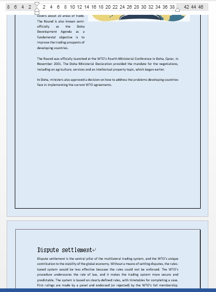
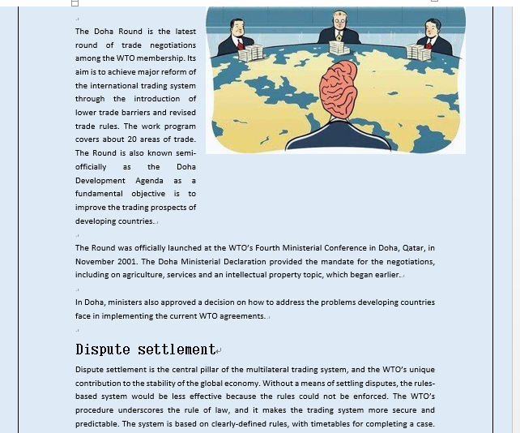

# Methods to merge multiple Word documents in C#
## Requires
- Visual Studio 2013
## License
- MS-LPL
## Technologies
- C#
- ASP.NET
- Class Library
- Windows Forms
- .NET Framework 4.0
- Visual Studio 2013
- Word API
- Word .NET library
## Topics
- Controls
- C#
- ASP.NET
- Windows Forms
- Code Sample
- How to
- Language Samples
- merge  Word files
## Updated
- 02/27/2018
## Description

<h1><strong style="font-size:10px">Introduction</strong></h1>

This sample is aimed to introduce two methods of merging multiple Word documents with C# code. The full code of each method will give you the clear information of how to operate.

<strong>The tools we need</strong>: Spire.Doc for .NET

&nbsp;&nbsp;&nbsp;&nbsp;&nbsp;&nbsp;&nbsp;&nbsp;&nbsp;&nbsp;&nbsp;&nbsp; &nbsp;&nbsp;Visual Studio 2013

<strong>Notice: </strong>You should<strong> </strong>download and install Spire.Doc for .NET before coding, then add the dll file into the project as a reference.

&nbsp;

<strong>Sample 1: </strong>Merge documents by inserting content from one document into the new page of another.

C#

编辑脚本|Remove

csharp

<pre class="csharp">using&nbsp;Spire.Doc;&nbsp;
&nbsp;
namespace&nbsp;MergeWord_Doc&nbsp;
{&nbsp;
&nbsp;&nbsp;&nbsp;&nbsp;class&nbsp;Program&nbsp;
&nbsp;&nbsp;&nbsp;&nbsp;{&nbsp;
&nbsp;&nbsp;&nbsp;&nbsp;&nbsp;&nbsp;&nbsp;&nbsp;static&nbsp;void&nbsp;Main(string[]&nbsp;args)&nbsp;
&nbsp;&nbsp;&nbsp;&nbsp;&nbsp;&nbsp;&nbsp;&nbsp;{&nbsp;
&nbsp;&nbsp;&nbsp;&nbsp;&nbsp;&nbsp;&nbsp;&nbsp;&nbsp;&nbsp;&nbsp;&nbsp;//Create&nbsp;two&nbsp;instances&nbsp;of&nbsp;Document&nbsp;class,&nbsp;and&nbsp;load&nbsp;the&nbsp;documents&nbsp;that&nbsp;you&nbsp;need&nbsp;to&nbsp;merge&nbsp;
&nbsp;&nbsp;&nbsp;&nbsp;&nbsp;&nbsp;&nbsp;&nbsp;&nbsp;&nbsp;&nbsp;&nbsp;Document&nbsp;doc1&nbsp;=&nbsp;new&nbsp;Document(@&quot;C:\Users\Administrator\Desktop\TradeNegotiation.docx&quot;);&nbsp;
&nbsp;&nbsp;&nbsp;&nbsp;&nbsp;&nbsp;&nbsp;&nbsp;&nbsp;&nbsp;&nbsp;&nbsp;Document&nbsp;doc2&nbsp;=&nbsp;new&nbsp;Document(@&quot;C:\Users\Administrator\Desktop\DisputeSettlement.docx&quot;);&nbsp;
&nbsp;
&nbsp;&nbsp;&nbsp;&nbsp;&nbsp;&nbsp;&nbsp;&nbsp;&nbsp;&nbsp;&nbsp;&nbsp;//Call&nbsp;InsertTextFromFile()&nbsp;method&nbsp;to&nbsp;merge&nbsp;the&nbsp;doc2&nbsp;into&nbsp;the&nbsp;doc1&nbsp;
&nbsp;&nbsp;&nbsp;&nbsp;&nbsp;&nbsp;&nbsp;&nbsp;&nbsp;&nbsp;&nbsp;&nbsp;string&nbsp;fileName&nbsp;=&nbsp;@&quot;C:\Users\Administrator\Desktop\DisputeSettlement.docx&quot;;&nbsp;
&nbsp;&nbsp;&nbsp;&nbsp;&nbsp;&nbsp;&nbsp;&nbsp;&nbsp;&nbsp;&nbsp;&nbsp;doc1.InsertTextFromFile(fileName,&nbsp;FileFormat.Docx2013);&nbsp;
&nbsp;
&nbsp;&nbsp;&nbsp;&nbsp;&nbsp;&nbsp;&nbsp;&nbsp;&nbsp;&nbsp;&nbsp;&nbsp;//Save&nbsp;the&nbsp;merged&nbsp;document&nbsp;into&nbsp;a&nbsp;new&nbsp;one&nbsp;
&nbsp;&nbsp;&nbsp;&nbsp;&nbsp;&nbsp;&nbsp;&nbsp;&nbsp;&nbsp;&nbsp;&nbsp;doc1.SaveToFile(&quot;MergedDocument.docx&quot;,&nbsp;FileFormat.Docx2013);&nbsp;
&nbsp;&nbsp;&nbsp;&nbsp;&nbsp;&nbsp;&nbsp;&nbsp;}&nbsp;
&nbsp;&nbsp;&nbsp;&nbsp;}&nbsp;
}&nbsp;</pre>

<a name="OLE_LINK6"><strong>Sample 2:
</strong>Merge documents by inserting content from one document into the end of another.</a>

<h1></h1>

&nbsp;

C#

编辑脚本|Remove

csharp

<pre class="csharp">using&nbsp;Spire.Doc;&nbsp;
using&nbsp;Spire.Doc.Documents;&nbsp;
&nbsp;
namespace&nbsp;MergeWord2_Doc&nbsp;
{&nbsp;
&nbsp;&nbsp;&nbsp;&nbsp;class&nbsp;Program&nbsp;
&nbsp;&nbsp;&nbsp;&nbsp;{&nbsp;
&nbsp;&nbsp;&nbsp;&nbsp;&nbsp;&nbsp;&nbsp;&nbsp;staticvoid&nbsp;Main(string[]&nbsp;args)&nbsp;
&nbsp;&nbsp;&nbsp;&nbsp;&nbsp;&nbsp;&nbsp;&nbsp;{&nbsp;
&nbsp;&nbsp;&nbsp;&nbsp;&nbsp;&nbsp;&nbsp;&nbsp;&nbsp;&nbsp;&nbsp;&nbsp;//Create&nbsp;two&nbsp;instances&nbsp;of&nbsp;Document&nbsp;class&nbsp;
&nbsp;&nbsp;&nbsp;&nbsp;&nbsp;&nbsp;&nbsp;&nbsp;&nbsp;&nbsp;&nbsp;&nbsp;Document&nbsp;doc1&nbsp;=&nbsp;new&nbsp;Document(@&quot;C:\Users\Administrator\Desktop\TradeNegotiation.docx&quot;);&nbsp;
&nbsp;&nbsp;&nbsp;&nbsp;&nbsp;&nbsp;&nbsp;&nbsp;&nbsp;&nbsp;&nbsp;&nbsp;Document&nbsp;doc2&nbsp;=&nbsp;new&nbsp;Document(@&quot;C:\Users\Administrator\Desktop\DisputeSettlement.docx&quot;);&nbsp;
&nbsp;
&nbsp;&nbsp;&nbsp;&nbsp;&nbsp;&nbsp;&nbsp;&nbsp;&nbsp;&nbsp;&nbsp;&nbsp;//Get&nbsp;the&nbsp;last&nbsp;section&nbsp;of&nbsp;doc1&nbsp;
&nbsp;&nbsp;&nbsp;&nbsp;&nbsp;&nbsp;&nbsp;&nbsp;&nbsp;&nbsp;&nbsp;&nbsp;Section&nbsp;lastSection&nbsp;=&nbsp;doc1.LastSection;&nbsp;
&nbsp;
&nbsp;&nbsp;&nbsp;&nbsp;&nbsp;&nbsp;&nbsp;&nbsp;&nbsp;&nbsp;&nbsp;&nbsp;//Traverse&nbsp;the&nbsp;section&nbsp;and&nbsp;paragraph&nbsp;of&nbsp;doc2,&nbsp;and&nbsp;clone&nbsp;the&nbsp;paragraphs&nbsp;to&nbsp;the&nbsp;last&nbsp;section&nbsp;of&nbsp;doc1foreach&nbsp;(Section&nbsp;section&nbsp;in&nbsp;doc2.Sections)&nbsp;
&nbsp;&nbsp;&nbsp;&nbsp;&nbsp;&nbsp;&nbsp;&nbsp;&nbsp;&nbsp;&nbsp;&nbsp;{&nbsp;
&nbsp;&nbsp;&nbsp;&nbsp;&nbsp;&nbsp;&nbsp;&nbsp;&nbsp;&nbsp;&nbsp;&nbsp;&nbsp;&nbsp;&nbsp;&nbsp;foreach&nbsp;(Paragraph&nbsp;paragraph&nbsp;in&nbsp;section.Paragraphs)&nbsp;
&nbsp;&nbsp;&nbsp;&nbsp;&nbsp;&nbsp;&nbsp;&nbsp;&nbsp;&nbsp;&nbsp;&nbsp;&nbsp;&nbsp;&nbsp;&nbsp;{&nbsp;
&nbsp;&nbsp;&nbsp;&nbsp;&nbsp;&nbsp;&nbsp;&nbsp;&nbsp;&nbsp;&nbsp;&nbsp;&nbsp;&nbsp;&nbsp;&nbsp;&nbsp;&nbsp;&nbsp;&nbsp;lastSection.Paragraphs.Add(paragraph.Clone()&nbsp;as&nbsp;Paragraph);&nbsp;
&nbsp;&nbsp;&nbsp;&nbsp;&nbsp;&nbsp;&nbsp;&nbsp;&nbsp;&nbsp;&nbsp;&nbsp;&nbsp;&nbsp;&nbsp;&nbsp;}&nbsp;
&nbsp;&nbsp;&nbsp;&nbsp;&nbsp;&nbsp;&nbsp;&nbsp;&nbsp;&nbsp;&nbsp;&nbsp;}&nbsp;
&nbsp;
&nbsp;&nbsp;&nbsp;&nbsp;&nbsp;&nbsp;&nbsp;&nbsp;&nbsp;&nbsp;&nbsp;&nbsp;//Save&nbsp;the&nbsp;merged&nbsp;document&nbsp;into&nbsp;a&nbsp;new&nbsp;one&nbsp;
&nbsp;&nbsp;&nbsp;&nbsp;&nbsp;&nbsp;&nbsp;&nbsp;&nbsp;&nbsp;&nbsp;&nbsp;doc1.SaveToFile(&quot;Merged.docx&quot;,&nbsp;FileFormat.Docx2013);&nbsp;
&nbsp;&nbsp;&nbsp;&nbsp;&nbsp;&nbsp;&nbsp;&nbsp;}&nbsp;
&nbsp;&nbsp;&nbsp;&nbsp;}&nbsp;
}&nbsp;
</pre>

&nbsp;

<strong>More about Spire.Doc for .NET</strong>

<strong>Main functions:</strong>

<strong>Converting</strong>

&nbsp;

<ul>
<li>save Word Doc/Docx to stream </li><li>save as web response and convert Word Doc/Docx to XML, RTF, EMF, TXT, XPS, EPUB, HTML, SVG and vice versa
</li><li>convert Word Doc/Docx to PDF and HTML to image. </li></ul>

&nbsp;

&nbsp;

<strong>Creating, Editing, Operation And Printing</strong>

<ul>
<li>Create Word document dynamically from scratch </li><li>Support types of Word document elements, including page, sections, headers, footers, footnotes, paragraphs, lists, tables, text, fields, hyperlinks, bookmarks, comments, images, styles, background settings, printing features, document settings and protection
</li></ul>

&nbsp;

<strong>Process pre-existing Word documents</strong>

&nbsp;

<ul>
<li>Search and replace function </li><li>Alignment, page break, fill field </li><li>Document concatenate, document copy/print </li><li>Complex and deeply nested mail merge </li></ul>

&nbsp;

<strong>&nbsp;</strong>

<strong>Related links:</strong>

<strong>Website: </strong><a href="https://www.e-iceblue.com/">https://www.e-iceblue.com/</a>

<strong>Product introduction:</strong> <a href="https://www.e-iceblue.com/Introduce/free-doc-component.html">
https://www.e-iceblue.com/Introduce/free-doc-component.html</a>

<strong>Download: </strong><a href="https://www.e-iceblue.com/Download/download-word-for-net-free.html">https://www.e-iceblue.com/Download/download-word-for-net-free.html</a>

