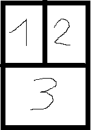

# Micro Framework Tetris
## Requires
- Visual Studio 2012
## License
- Apache License, Version 2.0
## Technologies
- C#
- Games
- .NET Micro Framework
## Topics
- C#
- Games
## Updated
- 10/28/2014
## Description

Introduction

<em>Tetris game developed using C# and .NET Micro Framework port for STM32F429 discovery board. The poprose of this application is to show capabilities of NETMF with graphical displays.</em>

<h1>Building the Sample</h1>

<em>For building the sample&nbsp;<em>STM32F429 &nbsp;discovery board is required. It is highly avaliable in most countries at average cost below 30$. It is also possible to run application on other .NET Micro Framewotk devices, by changing setting class
 but be aware: game use fixed sized bitmaps so that it is decicated for 240x320 screens.</em></em>

<em><em>Sample was compiled using Visual Studio 2012 and .NET Micro Framework version 4.3.</em></em>

<em><em><em><em>Application uses .NET Micro Framework port avaliable at ST site(check links below). Instructions how to install the port on the board are also avaliable on this site.</em></em> 
</em></em>

Description

Application is simple tetris game written on STM32F4 processor using C#. Is uses only
peripherals avaliable on discovery board, no external components are needed. Sample screen from the working application are provided below:

 

<h1>Game Controlls</h1>

During game initialization and after finishing the game: just tap the screen to move to the next game state.

During the game:

Screen is divided fot three sectors:

<ul>
<li>Tapping on sector 3 makes brick rapidly fall to the end of the screen
</li><li>Tapping sector 1 or 2 while board user button released makes brick move left-or-right
</li><li>Tapping sector 1 or 2 while board user button pressed makes brick rotate left-or-right
</li></ul>
<h1>Source Code Files</h1>

Folders:

<ul>
<li>Game - Gamplay objects like brick, game board ... </li><li><em>Helpers - Helper classes</em> </li><li><em>Presentation - Presentaion objects including main window</em> </li><li><em>Resources - Classes managing resources</em> </li></ul>

Also, there are many comments in source code.

<h1>More Information</h1>
<ul>
<li><a href="http://www.st.com/web/en/catalog/tools/PF260087">.NET Micro Framework port for
STM32F429 discovery board</a> </li><li><a href="http://www.st.com/web/catalog/tools/FM116/SC959/SS1532/PF259090">STM32F429 discovery board description</a>
</li><li><a href="http://www.netmf.com/">.NET Micro Framework Site</a> </li><li><a href="http://en.wikipedia.org/wiki/Tetris">Information about tetris game</a>
</li><li><a href="http://warsztat.gd/projects/Micro_Framework_Tetris">Project on polish gamedev site - (pl.)</a>
</li></ul>
