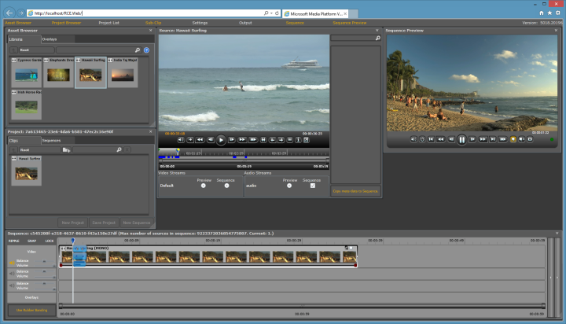

# Microsoft Media Platform Video Editor (formerly RCE)
## Requires
- Visual Studio 2012
## License
- MS-LPL
## Technologies
- C#
- ASP.NET
- IIS
- XAML
- .NET Framework
- MediaElement
- Silverlight 5
- Silverlight Toolkit
- IIS Media Services
## Topics
- Media
- MediaElement
- Live Streaming
- Smooth Streaming
- Adaptive Streaming
- Composite Stream Manifest
- CSM
- Video On Demand
- VOD
- Rough Cut Editing
## Updated
- 11/16/2013
## Description

<h1>Overview</h1>

The Silverlight Microsoft Media Platform (MMP) Video Editor (formerly known as Rough Cut Editor - RCE) simplifies the editing and publishing process, enabling real-time, browser-based video editing, and providing the ability for publishers to improve collaboration,
 manage dynamic metadata and deliver exciting content to the Web.

MMP Video Editor provides media organizations with a lightweight, Web-based tool that editors anywhere can use to assemble and edit video, audio, images, and XAML overlays with time code accurate control. Powered by Microsoft Silverlight, the MMP Video Editor
 provides a rich, stutter-free, full-screen editing experience. The MMP Video Editor has an open and extensible architecture, and it can be integrated into any digital asset management (DAM) and any encoding / transcoding system that an organization is already
 using.

Below are a few of the benefits offered by Silverlight MMP Video Editor solution from Microsoft:

<ul>
</ul>
<ul>
<li>Streamlines the movement of audio and video content from the source to any distribution platform including the Web.
</li><li>Cost effective - MMP Video Editor is a free download that runs in a browser, so any organization in need of a rough cut editing tool can quickly and cost-effectively deploy it to the individuals in the organization who need it.
</li><li>Provides the ability for editors to interact with the MMP Video Editor from anywhere through browsers running on any PC or Macintosh system.
</li><li>Enables editors to move long form video assets through Web-based editors and publish to Web sites within seconds.
</li></ul>

&nbsp;

<h1>New Features in 2.1 Release</h1>

This following are the new features included in this new version of the MMP Video Editor:

<ul>
<li>Upgraded Visual Studio 2012 solution </li><li>Support for fade in and fade out transitions </li><li>Support to load asset in XML format from a JavaScript bridge so you can query your assets directly from a CMS web page and send them back to the MMP Video Editor
</li><li>New mode to snap mark in and mark out positions to the nearest fragment boundary
</li></ul>

&nbsp;

<h1>Documentation</h1>

You can find the MMP Video Editor documentation inside the ZIP package in the <strong>
Microsoft Media Platform Video Editor 2.1.pdf</strong> document.

<strong>Note</strong>: You must have a license to parse H264 CodePrivateData in order to use the MMP Video Editor.

&nbsp;

<h1>Related Resources</h1>
<ul>
<li>Previous MMP Video Editor releases (archive): <a href="http://archive.msdn.microsoft.com/VideoEditor">
http://archive.msdn.microsoft.com/VideoEditor</a> </li><li><a href="http://code.msdn.microsoft.com/Smooth-Streaming-Manifest-b1c3c9f9/">Smooth Streaming Manifest Generator</a>: This library allows you to easily parse and generate Smooth Streaming manifests, such as
<strong>ISM </strong>(server manifest), <strong>ISMC </strong>(client manifest) and
<strong>CSM </strong>(composite stream manifest for sub-clipping) files </li></ul>
