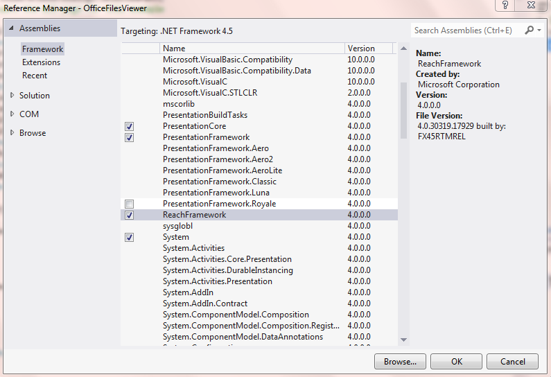
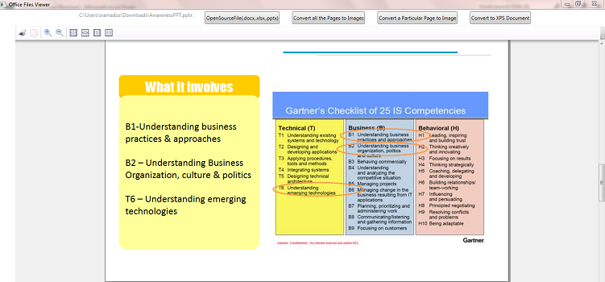

# Microsoft Office File Viewer in WPF
## Requires
- Visual Studio 2012
## License
- Apache License, Version 2.0
## Technologies
- COM
- Interop
- C#
- Win32
- WPF
- XAML
- .NET Framework
## Topics
- COM
- COM Interop
- Microsoft Office
- Microsoft Office Word AddIn
## Updated
- 12/09/2013
## Description

<h1>Introduction:</h1>

Microsoft Office Documents like Word , Excel, PowerPoint are very difficult to View in WPF. I have seen a lot of posts related to viewing office files in forums. So to be straight forward there is no direct method to view office
 documents in WPF. Office files should be converted to a suitable format so that it could be viewed in WPF. Here are the steps to view an office Document in WPF.

<h1>Features Available in the Sample:</h1>
<ul>
<li>Open and View microsoft office files like .docx, .xlsx, .pptx
</li><li>Convert All the pages of a document to a Image 
</li><li>Convert a paticular page to a Image </li><li>Convert the document to XPS format </li></ul>
<h1>Steps to Run the application:</h1>

Before running the application,

1.) Right click &ldquo;<strong><em>References -&gt; Add Reference&rdquo;.&nbsp;</em></strong>In the&nbsp;<strong><em>Reference Manager</em></strong>&nbsp;Dialog. Under&nbsp;<strong><em>&ldquo;COM
 -&gt; Type Libraries&rdquo;</em></strong>&nbsp;Section.&nbsp;Add the Following Com Components in your References

<ul>
<li>Microsoft Office 14.0 Object Library </li><li>Microsoft Word 14.0 Object Library </li><li>Microsoft Excel 14.0 Object Library </li><li>Microsoft PowerPoint 14.0 Object Library
</li></ul>

Ensure that you are having version 12.0 or Above. Which means Microsoft word 2007 or higher versions.

Scrrenshot of adding Microsoft Excel 14.0 Object Library

 

 
2.) Then Add a Reference to,

<ul>
<li>ReachFramework.dll&nbsp; </li></ul>

&nbsp;

<h1>Screenshot of the Application:</h1>

