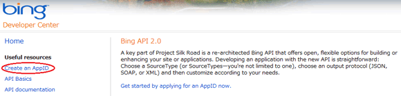
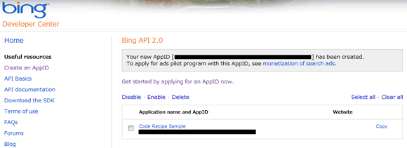

# Microsoft Translator を使用して英語から日本語へ機械翻訳する
## Requires
- 
## License
- Apache License, Version 2.0
## Technologies
- Visual Studio 2008
- .NET Framework 3.5 SP1
## Topics
- その他
- 逆引きサンプル コード
## Updated
- 02/09/2011
## Description

執筆者: <a href="http://msdn.microsoft.com/ja-jp/gg585574#matsue" target="_blank">
日本システムウエア株式会社 松江 祐輔 (JZ5)</a>

動作確認環境: Visual Studio 2010、.NET Framework 3.5 SP1

Microsoft Translator という機械翻訳を提供する Web サービスを使用して英語のテキストを日本語へ機械翻訳します。

Visual Basic

{#scriptcode_dlg.edit_script}

vb
<pre class="hidden">Imports System.Net

Module Module1

    Sub Main()
        Dim appId As String = &quot;Your AppID&quot; ' &larr; ※
        Dim text As String = Uri.EscapeDataString(&quot;This is a sample code.&quot;)

        Using client = New WebClient()
            client.Encoding = System.Text.Encoding.UTF8

            Dim format As String = &quot;http://api.microsofttranslator.com/v2/Http.svc/Translate?appId={0}&amp;text={1}&amp;from=en&amp;to=ja&quot;
            Dim address As String = String.Format(format, appId, text)

            Try
                Dim body As String = client.DownloadString(address)
                Dim translatedText As String = XDocument.Parse(body).Elements.First.Value
                Console.WriteLine(translatedText)
            Catch ex As Exception
                Console.WriteLine(&quot;例外が発生しました&quot; &amp; vbCrLf &amp; ex.ToString)
            End Try
        End Using
    End Sub

End Module</pre>
<pre id="codePreview" class="vb">Imports&nbsp;System.Net&nbsp; &nbsp; Module&nbsp;Module1&nbsp; &nbsp; &nbsp;&nbsp;&nbsp;&nbsp;Sub&nbsp;Main()&nbsp; &nbsp;&nbsp;&nbsp;&nbsp;&nbsp;&nbsp;&nbsp;&nbsp;Dim&nbsp;appId&nbsp;As&nbsp;String&nbsp;=&nbsp;&quot;Your&nbsp;AppID&quot;&nbsp;'&nbsp;&larr;&nbsp;※&nbsp; &nbsp;&nbsp;&nbsp;&nbsp;&nbsp;&nbsp;&nbsp;&nbsp;Dim&nbsp;text&nbsp;As&nbsp;String&nbsp;=&nbsp;Uri.EscapeDataString(&quot;This&nbsp;is&nbsp;a&nbsp;sample&nbsp;code.&quot;)&nbsp; &nbsp; &nbsp;&nbsp;&nbsp;&nbsp;&nbsp;&nbsp;&nbsp;&nbsp;Using&nbsp;client&nbsp;=&nbsp;New&nbsp;WebClient()&nbsp; &nbsp;&nbsp;&nbsp;&nbsp;&nbsp;&nbsp;&nbsp;&nbsp;&nbsp;&nbsp;&nbsp;&nbsp;client.Encoding&nbsp;=&nbsp;System.Text.Encoding.UTF8&nbsp; &nbsp; &nbsp;&nbsp;&nbsp;&nbsp;&nbsp;&nbsp;&nbsp;&nbsp;&nbsp;&nbsp;&nbsp;&nbsp;Dim&nbsp;format&nbsp;As&nbsp;String&nbsp;=&nbsp;&quot;http://api.microsofttranslator.com/v2/Http.svc/Translate?appId={0}&amp;text={1}&amp;from=en&amp;to=ja&quot;&nbsp; &nbsp;&nbsp;&nbsp;&nbsp;&nbsp;&nbsp;&nbsp;&nbsp;&nbsp;&nbsp;&nbsp;&nbsp;Dim&nbsp;address&nbsp;As&nbsp;String&nbsp;=&nbsp;String.Format(format,&nbsp;appId,&nbsp;text)&nbsp; &nbsp; &nbsp;&nbsp;&nbsp;&nbsp;&nbsp;&nbsp;&nbsp;&nbsp;&nbsp;&nbsp;&nbsp;&nbsp;Try&nbsp; &nbsp;&nbsp;&nbsp;&nbsp;&nbsp;&nbsp;&nbsp;&nbsp;&nbsp;&nbsp;&nbsp;&nbsp;&nbsp;&nbsp;&nbsp;&nbsp;Dim&nbsp;body&nbsp;As&nbsp;String&nbsp;=&nbsp;client.DownloadString(address)&nbsp; &nbsp;&nbsp;&nbsp;&nbsp;&nbsp;&nbsp;&nbsp;&nbsp;&nbsp;&nbsp;&nbsp;&nbsp;&nbsp;&nbsp;&nbsp;&nbsp;Dim&nbsp;translatedText&nbsp;As&nbsp;String&nbsp;=&nbsp;XDocument.Parse(body).Elements.First.Value&nbsp; &nbsp;&nbsp;&nbsp;&nbsp;&nbsp;&nbsp;&nbsp;&nbsp;&nbsp;&nbsp;&nbsp;&nbsp;&nbsp;&nbsp;&nbsp;&nbsp;Console.WriteLine(translatedText)&nbsp; &nbsp;&nbsp;&nbsp;&nbsp;&nbsp;&nbsp;&nbsp;&nbsp;&nbsp;&nbsp;&nbsp;&nbsp;Catch&nbsp;ex&nbsp;As&nbsp;Exception&nbsp; &nbsp;&nbsp;&nbsp;&nbsp;&nbsp;&nbsp;&nbsp;&nbsp;&nbsp;&nbsp;&nbsp;&nbsp;&nbsp;&nbsp;&nbsp;&nbsp;Console.WriteLine(&quot;例外が発生しました&quot;&nbsp;&amp;&nbsp;vbCrLf&nbsp;&amp;&nbsp;ex.ToString)&nbsp; &nbsp;&nbsp;&nbsp;&nbsp;&nbsp;&nbsp;&nbsp;&nbsp;&nbsp;&nbsp;&nbsp;&nbsp;End&nbsp;Try&nbsp; &nbsp;&nbsp;&nbsp;&nbsp;&nbsp;&nbsp;&nbsp;&nbsp;End&nbsp;Using&nbsp; &nbsp;&nbsp;&nbsp;&nbsp;End&nbsp;Sub&nbsp; &nbsp; End&nbsp;Module </pre>

Microsoft Translator の使用には、<a href="http://www.bing.com/developers/appids.aspx" target="_blank">Bing デベロッパー センター</a>でアプリケーションの登録とアプリケーション ID を作成する必要があります。次の手順でアプリケーション ID を作成してください。

<ol style="padding-left:20px">
<li><a href="http://www.bing.com/developers/appids.aspx" target="_blank">Bing デベロッパー センター</a>に Windows Live ID アカウントでサイン インします。
</li><li>Web ページの左側にあるリンク、「Create an AppID 」をクリックします。

</li><li>必要事項を記入および利用規約に同意のうえ、「Agree」をクリックします。 </li><li>作成されたアプリケーション ID (AppID) をコピーします。

</li></ol>

アプリケーション ID はコード中の ※部分の文字列に設定します。

正しくアプリケーション ID を設定したコードの実行結果は、以下のように表示されます。

これは、サンプル コードです。

<strong>Note:</strong> Microsoft Translator は Web サービスです。インターネットに接続できる環境で実行する必要があります。

MSDN ライブラリには Microsoft Translator について詳しい説明があります。こちらもご参照ください。

<ul>
<li><a href="http://msdn.microsoft.com/en-us/library/ff512423" target="_blank">Microsoft Translator (英語)</a>
</li></ul>

<table>
<tbody>
<tr>
<td></td>
<td>
<ul>
<li>もっと他のコンテンツを見る &gt;&gt; <a href="http://msdn.microsoft.com/ja-jp/ff363212" target="_blank">
逆引きサンプル コード一覧へ</a> </li><li>もっと他のレシピを見る &gt;&gt; <a href="http://msdn.microsoft.com/ja-jp/samplecode.recipe">
Code Recipe へ</a> </li></ul>

&nbsp;

</td>
</tr>
</tbody>
</table>

<a href="#top">ページのトップへ</a>

