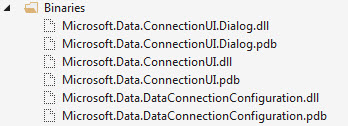

# Microsoft Visual Studio Connection Dialog at runtime create database and more
## Requires
- Visual Studio 2015
## License
- MIT
## Technologies
- SQL Server
- Data Access
- VB.Net
- Object Oriented Programming
## Topics
- SQL Server
- Wizard
- Database Connectivity
## Updated
- 06/16/2017
## Description

<h1>Description</h1>

This code sample is about using Microsoft&rsquo;s data connection dialog which is used inside of Visual Studio when creating strong typed classes to represent data from a database. The focus here is to create a SQL-Server database,
 create two tables and populate the two tables.

 
How I demonstrate the above is via a Windows forms project. There is one button, press the button which in turn displays the data connection dialog which defaults to SQL-Server which is done by placing an XML file into the bin\Debug
 folder named DataConnection.xml which you can remove from the folder which will then show all data providers rather than defaulting to SQL-Server. In the data connection dialog, there is a database selection combo box which is not used for this demonstration.
 You could disable it by downloading my <a href="https://code.msdn.microsoft.com/Using-Visual-Studio-a7e740f8">
C# code sample</a> if you are comfortable with C#.

 

 
Let&rsquo;s walk through high level the process.

 
When pressing the sole button on the form, there is logic to see if a setting has a value e.g. My.Settings.DatabaseConnectionString, by default it&rsquo;s empty which takes us into logic to first display the data connection dialog
 to learn their SQL-Server instance name. If they selection one we move on to creating. If the process fails e.g. SQL-Server is not installed or configured right or some other issue they can press the cancel button and everything stops here.

 
Continuing with the creation process, the information obtained from the data connection dialog is used to first create our database, if that is successful we continue with creating tables.

 
If the tables are created successfully then they are populated with data.

 
When all goes as planned next time the app runs the button is not shown and the data we generated is displayed. 
Now most apps are not that simple e.g. display raw data. I kept it simple to keep the focus on using the data connection dialog rather than how code flows afterwards.

&nbsp;

<strong>IMPORTANT</strong>:

To use the data connection dialog in your project, copy the DLL files from the following folder and place into your project.

<strong>NOTES</strong>

There are comments sprinked within Operations.vb class, read them for high level reasoning and possible things to make the code your own.&nbsp;

&nbsp;

<h1>Copy rights</h1>

The data connection dialogs are not mine but Microsoft so you need to respect this.

