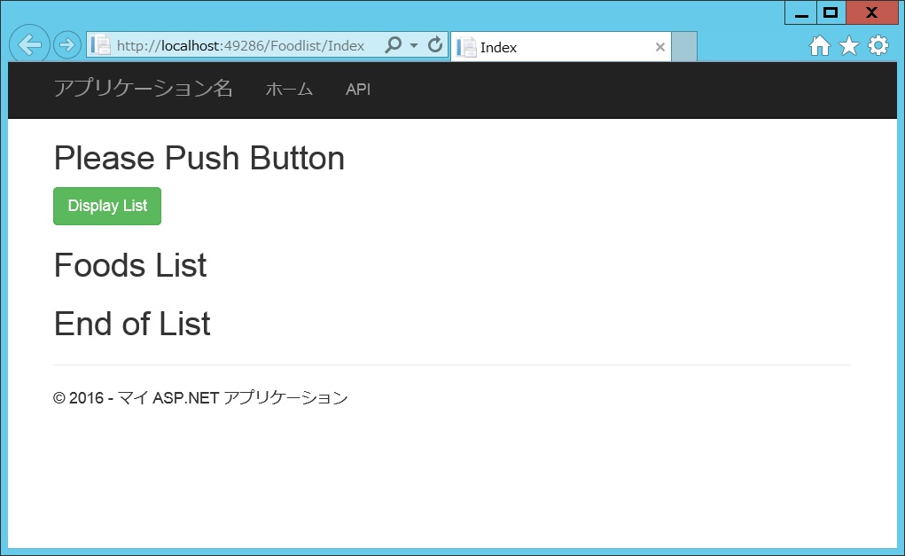
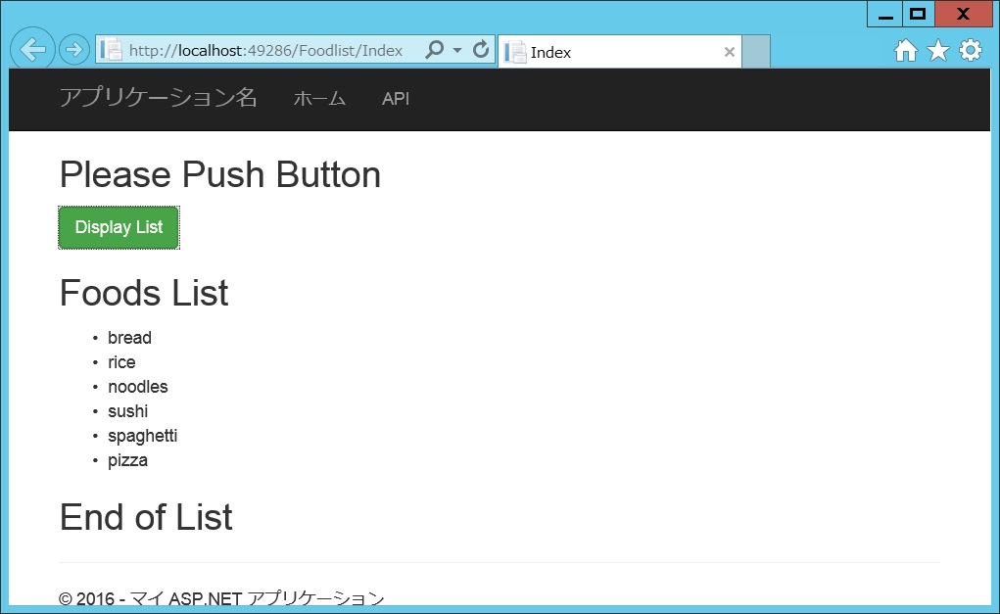

# Minimum project of sample written in VB of Web API and MVC5 to the Ajax
## Requires
- Visual Studio 2015
## License
- MIT
## Technologies
- AJAX
- jQuery
- Visual Basic .NET
- MVC5
- ASP.NET Web API 2
## Topics
- A minimum sample
## Updated
- 07/07/2016
## Description

<h1>Introduction</h1>

Because the sample of MVC5 is a few written in VB, I made a minimum of project you can experience the ajax.

<h1>Building the Sample</h1>

This sample was created by VS2015Update3 pro. 

Description

For a beginner like me, it is important to create a minimum of code to decent ajax at first.

<h1>A Visual Basic code is a web API &quot;api/foods&quot; called from MVC5 web application pages with Ajax.</h1>

Instead of using the database, I have prepared an array of &quot;foods&quot; with 5 stringｓ of food names. 
A http GET operation &quot;/api/foods/&quot; will return the array of &quot;foods&quot;.&nbsp;

Another http Get operation &rdquo;/api/foods/{id}&rdquo; is&nbsp;available. It return the food name of the&nbsp;specifid &quot;id&quot; number. However, it is not used&nbsp;at this sample.

Visual Basic

スクリプトの編集|Remove

vb
<pre class="hidden">Imports System.Net
Imports System.Web.Http

Namespace Controllers
    Public Class FoodsController
        Inherits ApiController

        Private foods As String() = {&quot;bread&quot;, &quot;rice&quot;, &quot;noodles&quot;, &quot;sushi&quot;, &quot;spaghetti&quot;, &quot;pizza&quot;}

        ' GET: api/Foods
        Public Function GetValues() As IEnumerable(Of String)
            Return foods
        End Function

        ' GET: api/Foods/5
        Public Function GetValue(ByVal id As Integer) As String
            If id &gt; 0 And id &lt;= foods.Length Then
                Return foods(id - 1)
            Else
                Return &quot;I don't know.&quot;
            End If
        End Function

    End Class
End Namespace</pre>

<pre class="vb">Imports&nbsp;System.Net&nbsp;
Imports&nbsp;System.Web.Http&nbsp;
&nbsp;
Namespace&nbsp;Controllers&nbsp;
&nbsp;&nbsp;&nbsp;&nbsp;Public&nbsp;Class&nbsp;FoodsController&nbsp;
&nbsp;&nbsp;&nbsp;&nbsp;&nbsp;&nbsp;&nbsp;&nbsp;Inherits&nbsp;ApiController&nbsp;
&nbsp;
&nbsp;&nbsp;&nbsp;&nbsp;&nbsp;&nbsp;&nbsp;&nbsp;Private&nbsp;foods&nbsp;As&nbsp;String()&nbsp;=&nbsp;{&quot;bread&quot;,&nbsp;&quot;rice&quot;,&nbsp;&quot;noodles&quot;,&nbsp;&quot;sushi&quot;,&nbsp;&quot;spaghetti&quot;,&nbsp;&quot;pizza&quot;}&nbsp;
&nbsp;
&nbsp;&nbsp;&nbsp;&nbsp;&nbsp;&nbsp;&nbsp;&nbsp;'&nbsp;GET:&nbsp;api/Foods&nbsp;
&nbsp;&nbsp;&nbsp;&nbsp;&nbsp;&nbsp;&nbsp;&nbsp;Public&nbsp;Function&nbsp;GetValues()&nbsp;As&nbsp;IEnumerable(Of&nbsp;String)&nbsp;
&nbsp;&nbsp;&nbsp;&nbsp;&nbsp;&nbsp;&nbsp;&nbsp;&nbsp;&nbsp;&nbsp;&nbsp;Return&nbsp;foods&nbsp;
&nbsp;&nbsp;&nbsp;&nbsp;&nbsp;&nbsp;&nbsp;&nbsp;End&nbsp;Function&nbsp;
&nbsp;
&nbsp;&nbsp;&nbsp;&nbsp;&nbsp;&nbsp;&nbsp;&nbsp;'&nbsp;GET:&nbsp;api/Foods/5&nbsp;
&nbsp;&nbsp;&nbsp;&nbsp;&nbsp;&nbsp;&nbsp;&nbsp;Public&nbsp;Function&nbsp;GetValue(ByVal&nbsp;id&nbsp;As&nbsp;Integer)&nbsp;As&nbsp;String&nbsp;
&nbsp;&nbsp;&nbsp;&nbsp;&nbsp;&nbsp;&nbsp;&nbsp;&nbsp;&nbsp;&nbsp;&nbsp;If&nbsp;id&nbsp;&gt;&nbsp;0&nbsp;And&nbsp;id&nbsp;&lt;=&nbsp;foods.Length&nbsp;Then&nbsp;
&nbsp;&nbsp;&nbsp;&nbsp;&nbsp;&nbsp;&nbsp;&nbsp;&nbsp;&nbsp;&nbsp;&nbsp;&nbsp;&nbsp;&nbsp;&nbsp;Return&nbsp;foods(id&nbsp;-&nbsp;1)&nbsp;
&nbsp;&nbsp;&nbsp;&nbsp;&nbsp;&nbsp;&nbsp;&nbsp;&nbsp;&nbsp;&nbsp;&nbsp;Else&nbsp;
&nbsp;&nbsp;&nbsp;&nbsp;&nbsp;&nbsp;&nbsp;&nbsp;&nbsp;&nbsp;&nbsp;&nbsp;&nbsp;&nbsp;&nbsp;&nbsp;Return&nbsp;&quot;I&nbsp;don't&nbsp;know.&quot;&nbsp;
&nbsp;&nbsp;&nbsp;&nbsp;&nbsp;&nbsp;&nbsp;&nbsp;&nbsp;&nbsp;&nbsp;&nbsp;End&nbsp;If&nbsp;
&nbsp;&nbsp;&nbsp;&nbsp;&nbsp;&nbsp;&nbsp;&nbsp;End&nbsp;Function&nbsp;
&nbsp;
&nbsp;&nbsp;&nbsp;&nbsp;End&nbsp;Class&nbsp;
End&nbsp;Namespace</pre>

<h1>A HTML code is an index page for Web API called by Ajax.&nbsp;</h1>

This web application of &quot;/FoodList/Index/&quot; has a button of &quot;#display&quot;. 
On the click event of the button(&quot;#display&quot;), an Ajax operation will start. 
The web API&nbsp;&quot;/api/foods/&quot; is called, and It returns the strings of &quot;foods&quot;. 
JQuery will get the strings, and make a food list code of &quot;html&quot; string. 
JQuery will display the list at the location of &quot;#list&quot;.

&nbsp;

HTML

スクリプトの編集|Remove

html
<pre class="hidden">@Code
    ViewData(&quot;Title&quot;) = &quot;Index&quot;
End Code

&lt;h2&gt;Please Push Button&lt;/h2&gt;

&lt;button id=&quot;display&quot; class=&quot;btn btn-success&quot;&gt;Display List&lt;/button&gt;

&lt;h2&gt;Foods List&lt;/h2&gt;
&lt;div id=&quot;list&quot;&gt;&lt;/div&gt;

&lt;h2&gt;End of List&lt;/h2&gt;

@Section scripts
&lt;script&gt;
    $(&quot;#display&quot;).click(function () {
        var url = &quot;/api/foods/&quot;;
        $.getJSON(url)
            .done(function (data) {
                var html = &quot;&lt;ul&gt;&quot;;
                $.each(data, function (index, value) {
                    html &#43;= &quot;&lt;li&gt;&quot; &#43; value &#43; &quot;&lt;/li&gt;&quot;;
                })
                html &#43;= &quot;&lt;/ul&gt;&quot;;
                $(&quot;#list&quot;).html(html);
            })
            .fail(function(data){
                $(&quot;#list&quot;).text(&quot;Error on Ajax!!!&quot;);
            });
    });

&lt;/script&gt;
End section
</pre>

<pre class="html">@Code&nbsp;
&nbsp;&nbsp;&nbsp;&nbsp;ViewData(&quot;Title&quot;)&nbsp;=&nbsp;&quot;Index&quot;&nbsp;
End&nbsp;Code&nbsp;
&nbsp;
&lt;h2&gt;Please&nbsp;Push&nbsp;Button&lt;/h2&gt;&nbsp;
&nbsp;
&lt;button&nbsp;id=&quot;display&quot;&nbsp;class=&quot;btn&nbsp;btn-success&quot;&gt;Display&nbsp;List&lt;/button&gt;&nbsp;
&nbsp;
&lt;h2&gt;Foods&nbsp;List&lt;/h2&gt;&nbsp;
&lt;div&nbsp;id=&quot;list&quot;&gt;&lt;/div&gt;&nbsp;
&nbsp;
&lt;h2&gt;End&nbsp;of&nbsp;List&lt;/h2&gt;&nbsp;
&nbsp;
@Section&nbsp;scripts&nbsp;
&lt;script&gt;&nbsp;
&nbsp;&nbsp;&nbsp;&nbsp;$(&quot;#display&quot;).click(function&nbsp;()&nbsp;{&nbsp;
&nbsp;&nbsp;&nbsp;&nbsp;&nbsp;&nbsp;&nbsp;&nbsp;var&nbsp;url&nbsp;=&nbsp;&quot;/api/foods/&quot;;&nbsp;
&nbsp;&nbsp;&nbsp;&nbsp;&nbsp;&nbsp;&nbsp;&nbsp;$.getJSON(url)&nbsp;
&nbsp;&nbsp;&nbsp;&nbsp;&nbsp;&nbsp;&nbsp;&nbsp;&nbsp;&nbsp;&nbsp;&nbsp;.done(function&nbsp;(data)&nbsp;{&nbsp;
&nbsp;&nbsp;&nbsp;&nbsp;&nbsp;&nbsp;&nbsp;&nbsp;&nbsp;&nbsp;&nbsp;&nbsp;&nbsp;&nbsp;&nbsp;&nbsp;var&nbsp;html&nbsp;=&nbsp;&quot;&lt;ul&gt;&quot;;&nbsp;
&nbsp;&nbsp;&nbsp;&nbsp;&nbsp;&nbsp;&nbsp;&nbsp;&nbsp;&nbsp;&nbsp;&nbsp;&nbsp;&nbsp;&nbsp;&nbsp;$.each(data,&nbsp;function&nbsp;(index,&nbsp;value)&nbsp;{&nbsp;
&nbsp;&nbsp;&nbsp;&nbsp;&nbsp;&nbsp;&nbsp;&nbsp;&nbsp;&nbsp;&nbsp;&nbsp;&nbsp;&nbsp;&nbsp;&nbsp;&nbsp;&nbsp;&nbsp;&nbsp;html&nbsp;&#43;=&nbsp;&quot;&lt;li&gt;&quot;&nbsp;&#43;&nbsp;value&nbsp;&#43;&nbsp;&quot;&lt;/li&gt;&quot;;&nbsp;
&nbsp;&nbsp;&nbsp;&nbsp;&nbsp;&nbsp;&nbsp;&nbsp;&nbsp;&nbsp;&nbsp;&nbsp;&nbsp;&nbsp;&nbsp;&nbsp;})&nbsp;
&nbsp;&nbsp;&nbsp;&nbsp;&nbsp;&nbsp;&nbsp;&nbsp;&nbsp;&nbsp;&nbsp;&nbsp;&nbsp;&nbsp;&nbsp;&nbsp;html&nbsp;&#43;=&nbsp;&quot;&lt;/ul&gt;&quot;;&nbsp;
&nbsp;&nbsp;&nbsp;&nbsp;&nbsp;&nbsp;&nbsp;&nbsp;&nbsp;&nbsp;&nbsp;&nbsp;&nbsp;&nbsp;&nbsp;&nbsp;$(&quot;#list&quot;).html(html);&nbsp;
&nbsp;&nbsp;&nbsp;&nbsp;&nbsp;&nbsp;&nbsp;&nbsp;&nbsp;&nbsp;&nbsp;&nbsp;})&nbsp;
&nbsp;&nbsp;&nbsp;&nbsp;&nbsp;&nbsp;&nbsp;&nbsp;&nbsp;&nbsp;&nbsp;&nbsp;.fail(function(data){&nbsp;
&nbsp;&nbsp;&nbsp;&nbsp;&nbsp;&nbsp;&nbsp;&nbsp;&nbsp;&nbsp;&nbsp;&nbsp;&nbsp;&nbsp;&nbsp;&nbsp;$(&quot;#list&quot;).text(&quot;Error&nbsp;on&nbsp;Ajax!!!&quot;);&nbsp;
&nbsp;&nbsp;&nbsp;&nbsp;&nbsp;&nbsp;&nbsp;&nbsp;&nbsp;&nbsp;&nbsp;&nbsp;});&nbsp;
&nbsp;&nbsp;&nbsp;&nbsp;});&nbsp;
&nbsp;
&lt;/script&gt;
End section
</pre>

<h1>Run the example</h1>

Before the button&quot;#display&quot; 

After the button&quot;#display&quot; 

&nbsp;

<h1>Source Code Files</h1>
<ul>
<li><em>All files of the project of VB Web API ;and MVC5 web site.;</em> </li></ul>
<h1>More Information</h1>

In order to make a simple project, there is no communication with the database in this sample.

