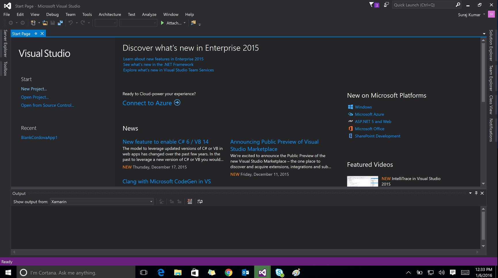
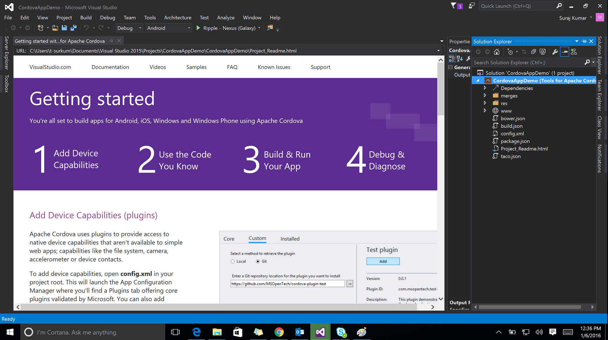
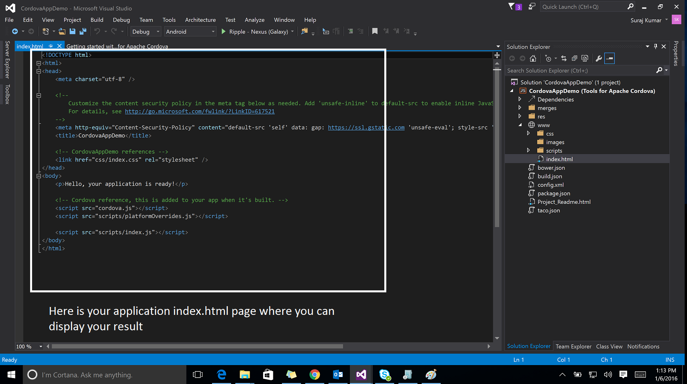
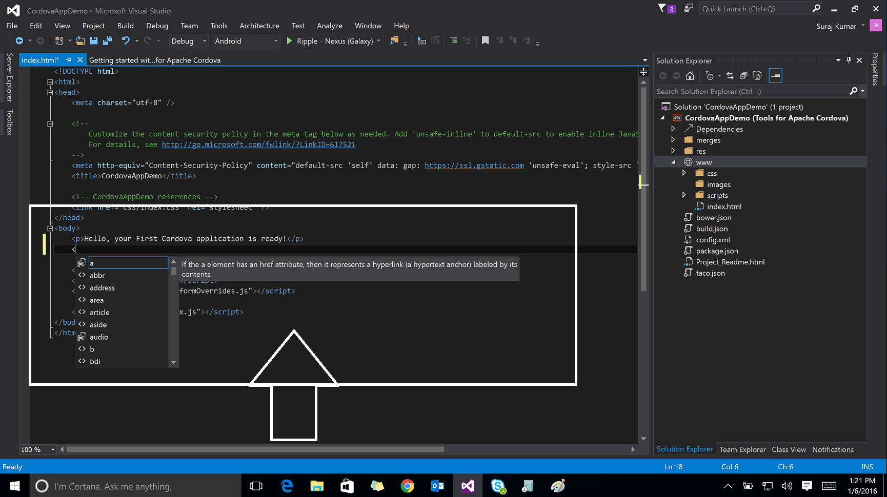
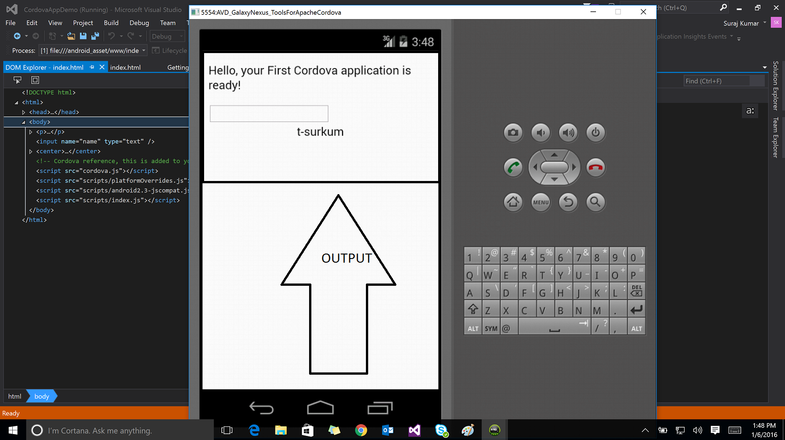

# Mobile Application for iOS, Android, and windows using Apache Cordova
## Requires
- Visual Studio 2015
## License
- MIT
## Technologies
- Android
- iOS
- Windows Phone 8
- HTML5/JavaScript
## Topics
- mobile application development
- Cross-Platform
- cross-platform development
## Updated
- 01/06/2016
## Description

<h1>Introduction</h1>

<em>Simple steps of creating Crossplatform Mobile Application for IOs, Android and Windows using Apache Cordova.</em>

<h1>Building the Sample</h1>

<em>Latest Version of Visual Studio 2015 with all feature including Apache Cordova and Android Emulators.</em>

Description

<em>This Sample is creating a simple Cross Platform project in easy steps below mention the snapshots as well as you can download and run on local using Cordova you can target all platforms and easy to install plugins below are given screen shots through
 which you can learn easily.</em>

<em>Click create New Project &amp; in javascrpt panel click on Blank App (Apache Cordava).</em>

&nbsp;

&nbsp;

<em>Name your project and click ok.</em>

<strong>&nbsp;</strong><em>&nbsp;</em>

&nbsp;

<em>Take a look at the Solution explorer the whole hierarchy of your project.</em>

<em> 
</em>

&nbsp;

<em>Open the www directroy from solution explorer where all pages, css and images are exisit.</em>

<em>There is also config file where you can set all settings relates to application (e.g application version, orientaion,full screen setting, Add plugins Target version etc).</em>

<em>&nbsp; 
</em>

&nbsp;

<em>Add Plugins.</em>

<em><strong>&nbsp;</strong><em>&nbsp;</em> 
</em>

&nbsp;

<em>The first default file is index.html</em>

<em> 
</em>

&nbsp;

&nbsp;

<em>You can add file by right click on www and click on add item new dialog appears and add file you want to add file, enter file name and click add.</em>

&nbsp;

<em>change the code what you want to do as same as html tags as you shown below.</em>

<em> 
</em>

<em> 
</em>

<em>Build the project &amp; run on Google Android Emulator as well as Windows.</em>

<em> 
</em>

&nbsp;

<em>Application runs successfull.</em>

&nbsp;

&nbsp;

<pre><em><strong>Find the mobile application file of current project in bin folder. </strong> <strong>Immplent your logic in cordova &amp; Target the all platforms. </strong> </em></pre>

<em>&nbsp;</em>

<em> 
</em>

&nbsp;

<h1>Source Code Files</h1>
<ul>
<li><em><em>index.html - Your default application file. </em></em></li><li><em><em>config.xml - Configuration file of you project for setting up your application. 
</em></em></li></ul>
<h1>More Information</h1>

<em>feel free to contact at t-surkum@microsoft.com if any case you are facing any problem redarding building of Cordova Application.</em>

