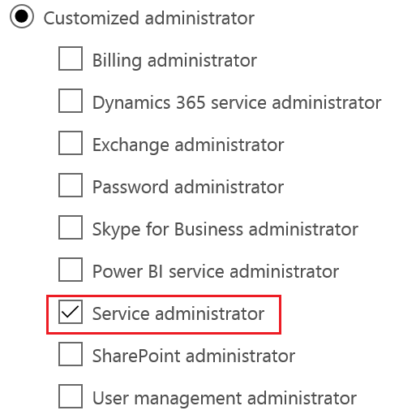

# Monitoring Office 365 using the Service Communications API
## Requires
- Visual Studio 2015
## License
- MIT
## Technologies
- Office 365
## Topics
- Office 365
- Service Management
- Management &amp; Monitoring
- Office 365 Automation
## Updated
- 04/12/2017
## Description

<h1>Introduction</h1>

The attached solution is an example of how you can use the <a href="https://msdn.microsoft.com/en-us/library/office/dn776043.aspx?f=255&MSPPError=-2147217396" target="_blank">
Office 365 Service Communications API</a>&nbsp;to retrieve service incident and message center information, as seen in the service health section of the admin portal, for a given Office 365 tenant.

<h1>Description</h1>

This sample is meant to demonstrate how to build a Windows service that uses the Office 365 Service Communications API to pull service incident and message center data related to an&nbsp;Office 365&nbsp;tenant. The intent of this sample is to show how you
 can&nbsp;generate Windows event log entries to be used to integrate into existing, non-System Center, monitoring and management systems. The following code was adapted from&nbsp;the Office 365 code samples available
<a href="https://www.microsoft.com/en-us/download/details.aspx?id=44012" target="_blank">
here</a>. Below is the main body of code that creates&nbsp;a connection to the API endpoint. Once that connection is established and the&nbsp;tenant identity&nbsp;is verified and authenticated, it retrieves data related to service incidents, planned maintenance
 and general notifications. This is all information you would typically see in the Admin portion of the Office 365 portal. The&nbsp;data that is returned from the API written to the Application event log and has distinct event IDs representing the different
 class of messages and their level of importance. This post will be updated shortly with a detailed list of each event that is written so you can easily write monitoring rules. Included in the logic of this code is also a mechanism to store the Office 365 message
 data&nbsp;locally in the registry of the Windows operating system running the service, this 'database' of messages is used to determine what information has changed between polling cycles and log additional events that can be actioned on, again details are
 forthcoming.

<h1>Building the Sample</h1>

There are two projects included in this sample solution. The first is the Microsoft Office 365 Service Health Watcher project which is a Windows service project that connects to the api, retrevies and processes the returned data anf finally writes Windows
 event log entries. The second, Service Installer, is an InstallSheild Limited Edition Project type which simply&nbsp;provides a basic wizard driven experience for the service installation.

<em>NOTE: You may need to enable this project type in Visual Studio if it is not already enabled. Follow the steps included in Visual Studio to enable this project type.</em>

After downloading and extracting the sample solution&nbsp;you should be able to build very easily&nbsp;solution in Visual Studio 2015.&nbsp;Once you perform a build of the solution you can find a compiled version of the installer in the \Service Installer\Service
 Installer\Express\SingleImage\DiskImages\DISK1 folder. Once you complete the wizard driven installation experience you will need to update the XML configuration file with connection information as outlined below.

For those that would simply like to try the sample solution without the need to install Visual Studio and compile the projects, a compiled copy of the solution, named setup.exe has been included the Service Installer folder.
If you choose to go this route it should be noted that this is sample code and caution should be taken when introducing this into any computing&nbsp;environment. It is strongly recommended that you try this on a non-production server.

The installer will place files into the <em>C:\Program Files (x86)\Microsoft Office 365 Service Health Watcher</em> folder. It's in that location that you will find an XML file named
<em>Microsoft Office 365 Service Health Watcher.exe.config</em>. You will need to edit this file and provide values for the following configuration items:

<strong>DomainNames </strong>- This is the name of the Office 365 tenant to monitor

Example: DomainNames=&quot;contoso.com&quot;

 
<strong>UserName </strong>- This is the user name of a user defined within your Office 365 tenant that has the Service Administrator role assigned to it, as shown in the screenshot below and as defined
<a href="https://support.office.com/en-US/client/results?Shownav=true&lcid=1033&ns=O365ENTADMIN&version=15&omkt=en-US&ver=15&services=INTUNE_O365%2cEXCHANGE_S_STANDARD&HelpID=O365E_AssignAdminRoles" target="_blank">
here</a>.

Example: UserName=&quot;serviceHealthPoll@contoso.com&quot;

 
<strong>Password </strong>- This is the password associated with the polling related user defined above

<strong>NOTE: This sample code uses a user name and password stored in plain text. It is recommended that you either extend this sample with your own mechanism to protect these credentials or take measures to protect this file
 with appropriate permissions.</strong>

<h1>More Information</h1>

<em>For more information on how to configure this sample and how it might be leveraged in practice, please review&nbsp;<a href="https://techcommunity.microsoft.com/t5/Office-365-Blog/Office-365-Monitoring-Leveraging-the-Office-365-Service/ba-p/61637" target="_blank">Office
 365 Monitoring: Leveraging the Office 365 Service Communications API</a>.</em>

