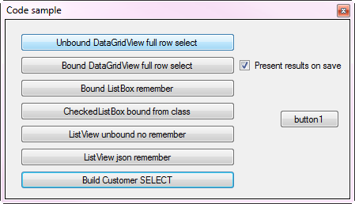
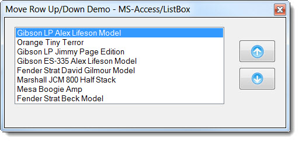
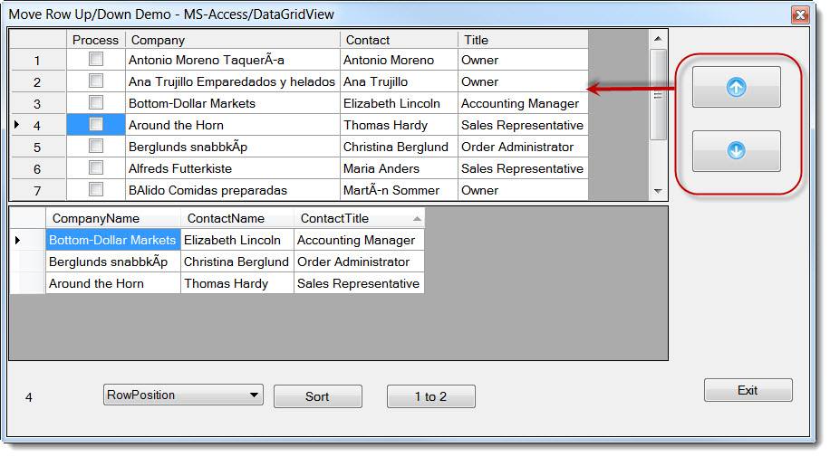
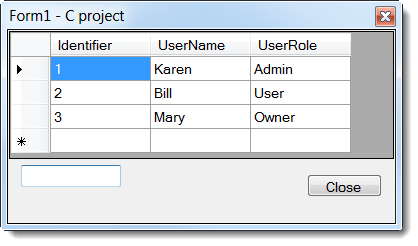

# Move rows up/down and remember order for DataGridView and ListBoxs data bound
## Requires
- Visual Studio 2012
## License
- Apache License, Version 2.0
## Technologies
- ADO.NET
- LINQ
- Windows Forms
## Topics
- Controls
- Data Binding
- User Interface
- Data Access
## Updated
- 08/25/2019
## Description

<h1>Introduction</h1>

<em>&nbsp;</em>

This article explains one method to display data in a DataGridView or ListBox which allows the user to move items up or down using two buttons. The origins
 came from someone needing a method using drag and drop but I feel that is not intuitive. A common place usage of this functionality is in the smart editor of a DataGridView control for re-positioning columns via up/down buttons.

<strong>Update 4/67/2018</strong> see
<a href="https://code.msdn.microsoft.com/DataGridView-ListBox-8e94fbc9">the following</a> for a robust C# sample for DataGridView, CheckedListBox, ListBox and ListView using bound and unbound controls via SQL-Server and JSON.

<strong>Update 8/2019</strong> GitHub repositories for updates examples

<a href="https://github.com/karenpayneoregon/DataGridViewListBoxMoveRowsUpDown_VBNET">VB.NET</a>,
<a href="https://github.com/karenpayneoregon/WindowsFormsMoveItemsUpDown">C#</a>

 

<strong>Update 3/5/2014</strong> added a simple version in C#. 
 
<strong>Update 5/24/2014</strong> uploaded to OneDrive
<a title="DataGridView project done in C#" href="https://onedrive.live.com/redir?resid=A3D5A9A9A28080D1!598&authkey=!AKEOb4um_eePspY&ithint=file%2c.zip">
C# project</a> for second screenshot below (will update the solution here shortly). Make sure to read the readme file as it indicates projects needed from this solution to compile.

ListBox

DataGridView

 

<h1>Building the Sample</h1>

<em>Build and enjoy</em>

Description

Since we tend to work with databases the majority of the time let's see what it takes to load data then write data back to a table so that after
 each time rows in a DataGridView or ListBox have the exact same row order as the last time the project ran. The database engine does not matter, MS-Access, MS-SQL-Server etc. What the table needs is a primary non-repeating key which all well designed tables
 should have. At least one field to display along with a field that stores the display index, a numeric. There are two tables in the demo project, both have a auto-incrementing primary key named Identifier. Both tables have a field for storing the display index,
 one is DisplayIndex for the ListBox while the other is RowPosition. They both could had been the same name but these names seemed appropriate for the controls the data will be displayed in.

There are routines to load data where in the SQL select statement the ordering is done by the field DisplayIndex or RowPosition. IMPORTANT: Since
 a DataGridView permits a user to sort by column this can mess up the move up/down rows and make the operation appear to not work as expected. For this reason I disabled sorting in the DataGridView but if you want to see what happens comment out the code that
 disables sorting, you will begin to see ghost rows and can be fixed yet the move up/down of rows in this article does not deal with sorting other than when a move up/down operation is invoke if there is a current sort the sort is removed.

Back to data, all data is loaded into a DataTable which becomes the DataSource of a BindingSource which in turn is set to the DataSource of a
 DataGridView or ListBox. There are two buttons when have images of a up or down button, a language extension is used for the DataGridView passing the BindingSource as a argument. We could simply use the BindingSource but then when a move up/down is done we
 lose the current cell index which I feel is important to retain the user's column selection.

What happens inside of a move operation, first we disable any sorts as per above which mess things up. Next we get the current DataGridView column
 index so after the move the column index is restored. Next the current DataRow is remembered, removed then inserted at the correct location in the Row collection of the DataTable, the BindingSource position is set which in the DataGridView is up or down one
 row unless we are at the first or last row in which case nothing happens. That is pretty much it for working with a database table.

For a insight into a future article in the form for MS-Access I have two DataGridView controls that demonstrate how to clone a row from DataGridView
 to another DataGridView which can clone the whole row or part of a row. There is a sort button for experimenting but do not advise using one in a production application.

Lastly, all code for this demo could easily be in one project but I broke them out to four so that you can use the functions by adding several
 projects to your solution rather than copy-n-paste. 

&nbsp;

<em>&nbsp;&nbsp;</em>

&nbsp;

&nbsp;

