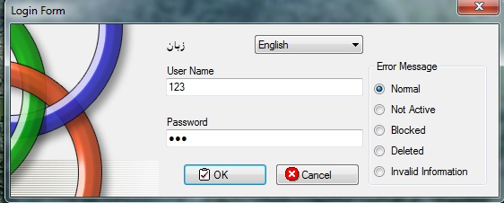

# Multi Language Application
## Requires
- Visual Studio 2005
## License
- Apache License, Version 2.0
## Technologies
- Windows Forms
## Topics
- Multiple Language Support Application
## Updated
- 07/28/2011
## Description

<h1>Introduction</h1>

<em>Develop multi support Language Desktop Application using VB.NET</em>

Description

<em>this application will help you to develop multi support language... i developed it for two language support that are English and Urdu... you can modify it.. as you want.</em>

<em>Thank you&nbsp;</em>

helping code is below

&nbsp;Private Sub setCulture() 
&nbsp; &nbsp; &nbsp; &nbsp; culture = CultureInfo.CreateSpecificCulture(Lang)&nbsp; &nbsp; &nbsp; &nbsp; Dim rm As New ResourceManager(&quot;MultiLanguageApplication.Login&quot;, GetType(LoginForm).Assembly) 
&nbsp; &nbsp; &nbsp; &nbsp; Me.Text = rm.GetString(&quot;FormTitle&quot;, culture)&nbsp; &nbsp; &nbsp; &nbsp; Me.UsernameLabel.Text = rm.GetString(&quot;LblUserName&quot;, culture)&nbsp; &nbsp; &nbsp; &nbsp; Me.PasswordLabel.Text = rm.GetString(&quot;LblPassword&quot;, culture)&nbsp; &nbsp;
 &nbsp; &nbsp; Me.OK.Text = rm.GetString(&quot;BttnOK&quot;, culture)&nbsp; &nbsp; &nbsp; &nbsp; Me.Cancel.Text = rm.GetString(&quot;BttnCancel&quot;, culture)&nbsp; &nbsp; &nbsp; &nbsp; Me.errActive = rm.GetString(&quot;ErrActive&quot;, culture)&nbsp; &nbsp; &nbsp; &nbsp; Me.errBlock =
 rm.GetString(&quot;ErrBlock&quot;, culture)&nbsp; &nbsp; &nbsp; &nbsp; Me.errDelete = rm.GetString(&quot;ErrDelete&quot;, culture)&nbsp; &nbsp; &nbsp; &nbsp; Me.errInvalid = rm.GetString(&quot;ErrInvalid&quot;, culture)&nbsp; &nbsp; &nbsp; &nbsp; Me.errNormal = rm.GetString(&quot;ErrNormal&quot;,
 culture)&nbsp; &nbsp; &nbsp; &nbsp; Me.errActive_Heading = rm.GetString(&quot;ErrActive_Heading&quot;, culture)&nbsp; &nbsp; &nbsp; &nbsp; Me.errBlock_Heading = rm.GetString(&quot;ErrBlock_Heading&quot;, culture)&nbsp; &nbsp; &nbsp; &nbsp; Me.errDelete_Heading = rm.GetString(&quot;ErrDelete_Heading&quot;,
 culture)&nbsp; &nbsp; &nbsp; &nbsp; Me.errInvalid_Heading = rm.GetString(&quot;ErrInvalid_Heading&quot;, culture)&nbsp; &nbsp; &nbsp; &nbsp; Me.errNormal_Heading = rm.GetString(&quot;ErrNormal_Heading&quot;, culture)&nbsp; &nbsp; &nbsp; &nbsp; Me.LblLanguage.Text = rm.GetString(&quot;LblLanguage&quot;,
 culture)&nbsp; &nbsp; &nbsp; &nbsp; Me.gbErrMessage.Text = rm.GetString(&quot;gBoxError&quot;, culture)&nbsp; &nbsp; &nbsp; &nbsp; Me.rBttnActive.Text = rm.GetString(&quot;rBttnActive&quot;, culture)&nbsp; &nbsp; &nbsp; &nbsp; Me.rBttnBlocked.Text = rm.GetString(&quot;rBttnBlocked&quot;,
 culture)&nbsp; &nbsp; &nbsp; &nbsp; Me.rBttnDeleted.Text = rm.GetString(&quot;rBttnDeleted&quot;, culture)&nbsp; &nbsp; &nbsp; &nbsp; Me.rBttnNormal.Text = rm.GetString(&quot;rBttnNormal&quot;, culture)&nbsp; &nbsp; &nbsp; &nbsp; Me.rBttnInvalid.Text = rm.GetString(&quot;ErrInvalid_Heading&quot;,
 culture)&nbsp; &nbsp; End Sub

&nbsp;

&nbsp;

Visual Basic

Edit|Remove

vb
<pre class="hidden"> Private Sub setCulture()

        culture = CultureInfo.CreateSpecificCulture(Lang)
        Dim rm As New ResourceManager(&quot;MultiLanguageApplication.Login&quot;, GetType(LoginForm).Assembly)

        Me.Text = rm.GetString(&quot;FormTitle&quot;, culture)
        Me.UsernameLabel.Text = rm.GetString(&quot;LblUserName&quot;, culture)
        Me.PasswordLabel.Text = rm.GetString(&quot;LblPassword&quot;, culture)
        Me.OK.Text = rm.GetString(&quot;BttnOK&quot;, culture)
        Me.Cancel.Text = rm.GetString(&quot;BttnCancel&quot;, culture)
        Me.errActive = rm.GetString(&quot;ErrActive&quot;, culture)
        Me.errBlock = rm.GetString(&quot;ErrBlock&quot;, culture)
        Me.errDelete = rm.GetString(&quot;ErrDelete&quot;, culture)
        Me.errInvalid = rm.GetString(&quot;ErrInvalid&quot;, culture)
        Me.errNormal = rm.GetString(&quot;ErrNormal&quot;, culture)
        Me.errActive_Heading = rm.GetString(&quot;ErrActive_Heading&quot;, culture)
        Me.errBlock_Heading = rm.GetString(&quot;ErrBlock_Heading&quot;, culture)
        Me.errDelete_Heading = rm.GetString(&quot;ErrDelete_Heading&quot;, culture)
        Me.errInvalid_Heading = rm.GetString(&quot;ErrInvalid_Heading&quot;, culture)
        Me.errNormal_Heading = rm.GetString(&quot;ErrNormal_Heading&quot;, culture)
        Me.LblLanguage.Text = rm.GetString(&quot;LblLanguage&quot;, culture)
        Me.gbErrMessage.Text = rm.GetString(&quot;gBoxError&quot;, culture)
        Me.rBttnActive.Text = rm.GetString(&quot;rBttnActive&quot;, culture)
        Me.rBttnBlocked.Text = rm.GetString(&quot;rBttnBlocked&quot;, culture)
        Me.rBttnDeleted.Text = rm.GetString(&quot;rBttnDeleted&quot;, culture)
        Me.rBttnNormal.Text = rm.GetString(&quot;rBttnNormal&quot;, culture)
        Me.rBttnInvalid.Text = rm.GetString(&quot;ErrInvalid_Heading&quot;, culture)
    End Sub</pre>

<pre class="vb">&nbsp;Private&nbsp;Sub&nbsp;setCulture()&nbsp;
&nbsp;
&nbsp;&nbsp;&nbsp;&nbsp;&nbsp;&nbsp;&nbsp;&nbsp;culture&nbsp;=&nbsp;CultureInfo.CreateSpecificCulture(Lang)&nbsp;
&nbsp;&nbsp;&nbsp;&nbsp;&nbsp;&nbsp;&nbsp;&nbsp;Dim&nbsp;rm&nbsp;As&nbsp;New&nbsp;ResourceManager(&quot;MultiLanguageApplication.Login&quot;,&nbsp;GetType(LoginForm).Assembly)&nbsp;
&nbsp;
&nbsp;&nbsp;&nbsp;&nbsp;&nbsp;&nbsp;&nbsp;&nbsp;Me.Text&nbsp;=&nbsp;rm.GetString(&quot;FormTitle&quot;,&nbsp;culture)&nbsp;
&nbsp;&nbsp;&nbsp;&nbsp;&nbsp;&nbsp;&nbsp;&nbsp;Me.UsernameLabel.Text&nbsp;=&nbsp;rm.GetString(&quot;LblUserName&quot;,&nbsp;culture)&nbsp;
&nbsp;&nbsp;&nbsp;&nbsp;&nbsp;&nbsp;&nbsp;&nbsp;Me.PasswordLabel.Text&nbsp;=&nbsp;rm.GetString(&quot;LblPassword&quot;,&nbsp;culture)&nbsp;
&nbsp;&nbsp;&nbsp;&nbsp;&nbsp;&nbsp;&nbsp;&nbsp;Me.OK.Text&nbsp;=&nbsp;rm.GetString(&quot;BttnOK&quot;,&nbsp;culture)&nbsp;
&nbsp;&nbsp;&nbsp;&nbsp;&nbsp;&nbsp;&nbsp;&nbsp;Me.Cancel.Text&nbsp;=&nbsp;rm.GetString(&quot;BttnCancel&quot;,&nbsp;culture)&nbsp;
&nbsp;&nbsp;&nbsp;&nbsp;&nbsp;&nbsp;&nbsp;&nbsp;Me.errActive&nbsp;=&nbsp;rm.GetString(&quot;ErrActive&quot;,&nbsp;culture)&nbsp;
&nbsp;&nbsp;&nbsp;&nbsp;&nbsp;&nbsp;&nbsp;&nbsp;Me.errBlock&nbsp;=&nbsp;rm.GetString(&quot;ErrBlock&quot;,&nbsp;culture)&nbsp;
&nbsp;&nbsp;&nbsp;&nbsp;&nbsp;&nbsp;&nbsp;&nbsp;Me.errDelete&nbsp;=&nbsp;rm.GetString(&quot;ErrDelete&quot;,&nbsp;culture)&nbsp;
&nbsp;&nbsp;&nbsp;&nbsp;&nbsp;&nbsp;&nbsp;&nbsp;Me.errInvalid&nbsp;=&nbsp;rm.GetString(&quot;ErrInvalid&quot;,&nbsp;culture)&nbsp;
&nbsp;&nbsp;&nbsp;&nbsp;&nbsp;&nbsp;&nbsp;&nbsp;Me.errNormal&nbsp;=&nbsp;rm.GetString(&quot;ErrNormal&quot;,&nbsp;culture)&nbsp;
&nbsp;&nbsp;&nbsp;&nbsp;&nbsp;&nbsp;&nbsp;&nbsp;Me.errActive_Heading&nbsp;=&nbsp;rm.GetString(&quot;ErrActive_Heading&quot;,&nbsp;culture)&nbsp;
&nbsp;&nbsp;&nbsp;&nbsp;&nbsp;&nbsp;&nbsp;&nbsp;Me.errBlock_Heading&nbsp;=&nbsp;rm.GetString(&quot;ErrBlock_Heading&quot;,&nbsp;culture)&nbsp;
&nbsp;&nbsp;&nbsp;&nbsp;&nbsp;&nbsp;&nbsp;&nbsp;Me.errDelete_Heading&nbsp;=&nbsp;rm.GetString(&quot;ErrDelete_Heading&quot;,&nbsp;culture)&nbsp;
&nbsp;&nbsp;&nbsp;&nbsp;&nbsp;&nbsp;&nbsp;&nbsp;Me.errInvalid_Heading&nbsp;=&nbsp;rm.GetString(&quot;ErrInvalid_Heading&quot;,&nbsp;culture)&nbsp;
&nbsp;&nbsp;&nbsp;&nbsp;&nbsp;&nbsp;&nbsp;&nbsp;Me.errNormal_Heading&nbsp;=&nbsp;rm.GetString(&quot;ErrNormal_Heading&quot;,&nbsp;culture)&nbsp;
&nbsp;&nbsp;&nbsp;&nbsp;&nbsp;&nbsp;&nbsp;&nbsp;Me.LblLanguage.Text&nbsp;=&nbsp;rm.GetString(&quot;LblLanguage&quot;,&nbsp;culture)&nbsp;
&nbsp;&nbsp;&nbsp;&nbsp;&nbsp;&nbsp;&nbsp;&nbsp;Me.gbErrMessage.Text&nbsp;=&nbsp;rm.GetString(&quot;gBoxError&quot;,&nbsp;culture)&nbsp;
&nbsp;&nbsp;&nbsp;&nbsp;&nbsp;&nbsp;&nbsp;&nbsp;Me.rBttnActive.Text&nbsp;=&nbsp;rm.GetString(&quot;rBttnActive&quot;,&nbsp;culture)&nbsp;
&nbsp;&nbsp;&nbsp;&nbsp;&nbsp;&nbsp;&nbsp;&nbsp;Me.rBttnBlocked.Text&nbsp;=&nbsp;rm.GetString(&quot;rBttnBlocked&quot;,&nbsp;culture)&nbsp;
&nbsp;&nbsp;&nbsp;&nbsp;&nbsp;&nbsp;&nbsp;&nbsp;Me.rBttnDeleted.Text&nbsp;=&nbsp;rm.GetString(&quot;rBttnDeleted&quot;,&nbsp;culture)&nbsp;
&nbsp;&nbsp;&nbsp;&nbsp;&nbsp;&nbsp;&nbsp;&nbsp;Me.rBttnNormal.Text&nbsp;=&nbsp;rm.GetString(&quot;rBttnNormal&quot;,&nbsp;culture)&nbsp;
&nbsp;&nbsp;&nbsp;&nbsp;&nbsp;&nbsp;&nbsp;&nbsp;Me.rBttnInvalid.Text&nbsp;=&nbsp;rm.GetString(&quot;ErrInvalid_Heading&quot;,&nbsp;culture)&nbsp;
&nbsp;&nbsp;&nbsp;&nbsp;End&nbsp;Sub</pre>

<h1>Source Code Files</h1>
<ul>
<li><em>source code file MultiLanguageApplication</em> </li><li><em> 
</em></li></ul>
<h1>More Information</h1>

<em>For more information on X,</em>

<em>www.a1vbcode.com</em>

<em>you can find it from above mentioned site.</em>

