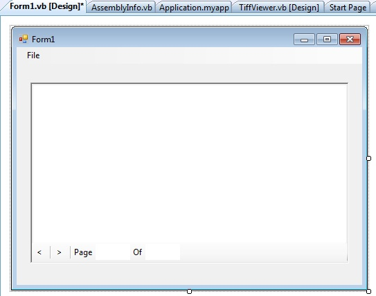

# Multi page image viewer - user control in vb.net
## Requires
- Visual Studio 2008
## License
- Apache License, Version 2.0
## Technologies
- Visual Studio 2008
- VB.Net
## Topics
- User Control
- system.windows.forms.picturebox
## Updated
- 01/08/2013
## Description

<h1>Introduction</h1>

Tif Viewer control can be show all pages of the multipage tif file, generally PictureBox control in .net can only show the first frame or page of the multi page image file.&nbsp;So if you need a such a control that able to load a multi page image file, then
 you can use the Tif viewer user control.&nbsp;

<h1>Building the Sample</h1>
<ul>
<li><em>Download the Tifviewer.zip file.</em> </li><li><em>extract the file, you will find the user control source files and windows form.</em>
</li><li><em>Build the projects.</em> </li><li><em>The source code also will describe how to use the control.</em> </li><li><em>Now you can use the control. See below about how to load image in the control.</em>
</li></ul>

Description

The user control contains the Picturebox control and a menustrip. &nbsp;You can see the sorce code for making this control.&nbsp;

<em></em>

Tif viewer user control shows the all pages of the image by the paging interface that means user can select the next and previous page to show.&nbsp;

&nbsp;

&nbsp;<strong>How to Load or set an image to the control</strong>

JavaScript

Edit|Remove

js
<pre class="hidden">    ' Load tif image into Viewer
    Private Sub LoadImage()
        Dim dlg As New OpenFileDialog
        dlg.Filter = &quot;tif files (*.tif)|*.tif|All files (*.*)|*.*&quot;
        If dlg.ShowDialog = Windows.Forms.DialogResult.OK Then
            TiffViewer1.Image = Image.FromFile(dlg.FileName)
        End If
    End Sub
</pre>

<pre class="js">&nbsp;&nbsp;&nbsp;&nbsp;'&nbsp;Load&nbsp;tif&nbsp;image&nbsp;into&nbsp;Viewer&nbsp;
&nbsp;&nbsp;&nbsp;&nbsp;Private&nbsp;Sub&nbsp;LoadImage()&nbsp;
&nbsp;&nbsp;&nbsp;&nbsp;&nbsp;&nbsp;&nbsp;&nbsp;Dim&nbsp;dlg&nbsp;As&nbsp;New&nbsp;OpenFileDialog&nbsp;
&nbsp;&nbsp;&nbsp;&nbsp;&nbsp;&nbsp;&nbsp;&nbsp;dlg.Filter&nbsp;=&nbsp;&quot;tif&nbsp;files&nbsp;(*.tif)|*.tif|All&nbsp;files&nbsp;(*.*)|*.*&quot;&nbsp;
&nbsp;&nbsp;&nbsp;&nbsp;&nbsp;&nbsp;&nbsp;&nbsp;If&nbsp;dlg.ShowDialog&nbsp;=&nbsp;Windows.Forms.DialogResult.OK&nbsp;Then&nbsp;
&nbsp;&nbsp;&nbsp;&nbsp;&nbsp;&nbsp;&nbsp;&nbsp;&nbsp;&nbsp;&nbsp;&nbsp;TiffViewer1.Image&nbsp;=&nbsp;Image.FromFile(dlg.FileName)&nbsp;
&nbsp;&nbsp;&nbsp;&nbsp;&nbsp;&nbsp;&nbsp;&nbsp;End&nbsp;If&nbsp;
&nbsp;&nbsp;&nbsp;&nbsp;End&nbsp;Sub&nbsp;
</pre>

&nbsp;

<strong>Get the Page count of the Image</strong>

<strong> 
</strong>

Visual Basic

Edit|Remove

vb
<pre class="hidden">Dim totalpages As Integer = TiffViewer1.Pagecount</pre>

<pre class="js">Dim&nbsp;totalpages&nbsp;As&nbsp;Integer&nbsp;=&nbsp;TiffViewer1.Pagecount</pre>

<h1>Source Code Files</h1>

<strong>User control files:</strong>

<ul>
<li>TiffViewer.Designer.vb </li><li>TiffViewer </li><li>TiffViewer.vb </li></ul>

You can use this user control in your existing project by just adding all above three files.

<h1>More Information</h1>

<em>For more information about how to use and example code :&nbsp;https://www.defercode.com/controls/tif-viewer-in-vb-net/description</em>

&nbsp;

<em>Thanks</em>

