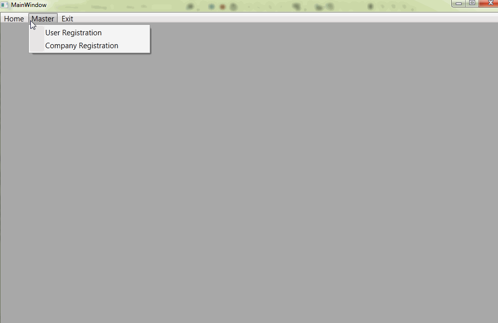

# Multiple Document Interface (MDI) in WPF
## Requires
- Visual Studio 2012
## License
- Apache License, Version 2.0
## Technologies
- C#
- Windows Forms
- WPF
- WPF MDI Form
## Topics
- Windows Forms
- WPF MDI Form
## Updated
- 01/09/2014
## Description

<h1>Introduction</h1>

<em>Multiple Document Interface(MDI) in WPF. </em>

<em>MDI Form doesn't exist in WPF. But this functionality can be achieved by using Tab Control or Third Party Control. I Used WPF.MDI.DLL assembly.
 
</em>

<h1>Building the Sample</h1>

<em>For implementing the MDI form in WPF, You need to download third party Tool &quot;WPF.MDI.DLL&quot;. You can download this library from this link.</em>

<em><a title="WPF.MDI.DLL Download" href="http://wpfmdi.codeplex.com/"><strong>Download</strong></a></em>

<em><strong>Screen:</strong></em>

<em><strong> 
</strong></em>

Description

<em><strong>WPF.MDI.DLL</strong> assembly contain two conrol </em>

<em>1) MDI Container</em>

<em>2) MDI Child 
</em>

To implement MDI form first Place MDI Container in a main window and Add User Control in your project to use as a MDI Child form. Two use this assembly place
<strong>WPF.MDI.DLL</strong> in to <strong>bin</strong> folder and <strong>Add references</strong> to it. Add that assembly in
<strong>ToolBox</strong> so you can easily drag and drop the MDI Control.

Add this namespace in your mainwindow.

C#

Edit|Remove

csharp

<pre class="csharp">&nbsp;&nbsp;xmlns:mdi=&quot;clr-namespace:WPF.MDI;assembly=WPF.MDI&quot;</pre>

Add Menu in your MainWindow Form.&nbsp;

&nbsp;

C#

Edit|Remove

csharp

<pre class="csharp">&nbsp;&nbsp;&nbsp;&nbsp;&nbsp;&nbsp;&nbsp;&nbsp;&lt;DockPanel&gt;&nbsp;
&nbsp;&nbsp;&nbsp;&nbsp;&nbsp;&nbsp;&nbsp;&nbsp;&nbsp;&nbsp;&nbsp;&nbsp;&lt;Menu&nbsp;Name=&quot;MainMenu&quot;&nbsp;VerticalAlignment=&quot;Top&quot;&nbsp;DockPanel.Dock=&quot;Top&quot;&nbsp;Height=&quot;30&quot;&nbsp;FontSize=&quot;15&quot;&nbsp;&gt;&nbsp;
&nbsp;&nbsp;&nbsp;&nbsp;&nbsp;&nbsp;&nbsp;&nbsp;&nbsp;&nbsp;&nbsp;&nbsp;&nbsp;&nbsp;&nbsp;&nbsp;&lt;MenuItem&nbsp;Name=&quot;menuHome&quot;&nbsp;Header=&quot;Home&quot;&gt;&nbsp;
&nbsp;&nbsp;&nbsp;&nbsp;&nbsp;&nbsp;&nbsp;&nbsp;&nbsp;&nbsp;&nbsp;&nbsp;&nbsp;&nbsp;&nbsp;&nbsp;&lt;/MenuItem&gt;&nbsp;
&nbsp;&nbsp;&nbsp;&nbsp;&nbsp;&nbsp;&nbsp;&nbsp;&nbsp;&nbsp;&nbsp;&nbsp;&nbsp;&nbsp;&nbsp;&nbsp;&lt;MenuItem&nbsp;Name=&quot;menuMaster&quot;&nbsp;Header=&quot;Master&quot;&gt;&nbsp;
&nbsp;&nbsp;&nbsp;&nbsp;&nbsp;&nbsp;&nbsp;&nbsp;&nbsp;&nbsp;&nbsp;&nbsp;&nbsp;&nbsp;&nbsp;&nbsp;&nbsp;&nbsp;&nbsp;&nbsp;&lt;MenuItem&nbsp;Name=&quot;userRegistration&quot;&nbsp;Header=&quot;User&nbsp;Registration&quot;&nbsp;Click=&quot;userRegistration_Click&quot;&nbsp;&nbsp;/&gt;&nbsp;
&nbsp;&nbsp;&nbsp;&nbsp;&nbsp;&nbsp;&nbsp;&nbsp;&nbsp;&nbsp;&nbsp;&nbsp;&nbsp;&nbsp;&nbsp;&nbsp;&nbsp;&nbsp;&nbsp;&nbsp;&lt;MenuItem&nbsp;Name=&quot;compRegistration&quot;&nbsp;Header=&quot;Company&nbsp;Registration&quot;&nbsp;Click=&quot;compRegistration_Click&quot;&gt;&lt;/MenuItem&gt;&nbsp;
&nbsp;&nbsp;&nbsp;&nbsp;&nbsp;&nbsp;&nbsp;&nbsp;&nbsp;&nbsp;&nbsp;&nbsp;&nbsp;&nbsp;&nbsp;&nbsp;&lt;/MenuItem&gt;&nbsp;
&nbsp;&nbsp;&nbsp;&nbsp;&nbsp;&nbsp;&nbsp;&nbsp;&nbsp;&nbsp;&nbsp;&nbsp;&nbsp;&nbsp;&nbsp;&nbsp;&lt;MenuItem&nbsp;Name=&quot;menuExit&quot;&nbsp;Header=&quot;Exit&quot;&gt;&nbsp;
&nbsp;&nbsp;&nbsp;&nbsp;&nbsp;&nbsp;&nbsp;&nbsp;&nbsp;&nbsp;&nbsp;&nbsp;&nbsp;&nbsp;&nbsp;&nbsp;&nbsp;&nbsp;&nbsp;&nbsp;&lt;MenuItem&nbsp;Name=&quot;Exit&quot;&nbsp;Header=&quot;Exit&quot;&nbsp;Click=&quot;menuExit_Click&quot;&gt;&lt;/MenuItem&gt;&nbsp;
&nbsp;&nbsp;&nbsp;&nbsp;&nbsp;&nbsp;&nbsp;&nbsp;&nbsp;&nbsp;&nbsp;&nbsp;&nbsp;&nbsp;&nbsp;&nbsp;&lt;/MenuItem&gt;&nbsp;
&nbsp;&nbsp;&nbsp;&nbsp;&nbsp;&nbsp;&nbsp;&nbsp;&nbsp;&nbsp;&nbsp;&nbsp;&lt;/Menu&gt;&nbsp;
&nbsp;&nbsp;&nbsp;&nbsp;&nbsp;&nbsp;&nbsp;&nbsp;&lt;/DockPanel&gt;</pre>

&nbsp;

Then After place MDI Container in a MainWindow.

&nbsp;

&nbsp;

C#

Edit|Remove

csharp

<pre class="csharp">&nbsp;&nbsp;&nbsp;&nbsp;&nbsp;&nbsp;&nbsp;&nbsp;&lt;DockPanel&gt;&nbsp;
&nbsp;&nbsp;&nbsp;&nbsp;&nbsp;&nbsp;&nbsp;&nbsp;&nbsp;&nbsp;&nbsp;&nbsp;&lt;mdi:MdiContainer&nbsp;Theme=&quot;Aero&quot;&nbsp;DockPanel.Dock=&quot;Top&quot;&nbsp;Margin=&quot;0&nbsp;20&nbsp;0&nbsp;0&quot;&nbsp;Name=&quot;MainMdiContainer&quot;&nbsp;/&gt;&nbsp;
&nbsp;&nbsp;&nbsp;&nbsp;&nbsp;&nbsp;&nbsp;&nbsp;&lt;/DockPanel&gt;</pre>

&nbsp;

&nbsp;

By default MdiContainer contains three different Theme (Aero,Luna,Generic), You can apply any of them as per your requirement.

I Used Two User Control to use as a MDI Child UserRegistration.xaml and CompRegistration.

Add the name space in MainWindow.cs.

&nbsp;

Visual BasicC#

Edit|Remove

vbcsharp

<pre class="vb">Imports&nbsp;WPF.MDI</pre>

&nbsp;

&nbsp;

and the below code in MenuItem Click Event.

&nbsp;

Visual BasicC#

Edit|Remove

vbcsharp

<pre class="vb">Private&nbsp;Sub&nbsp;userRegistration_Click(sender&nbsp;As&nbsp;Object,&nbsp;e&nbsp;As&nbsp;RoutedEventArgs)&nbsp;
&nbsp;&nbsp;&nbsp;&nbsp;MainMdiContainer.Children.Clear()&nbsp;
&nbsp;&nbsp;&nbsp;&nbsp;&nbsp;&nbsp;&nbsp;&nbsp;'Here&nbsp;UserRegistration&nbsp;is&nbsp;the&nbsp;class&nbsp;that&nbsp;you&nbsp;have&nbsp;created&nbsp;for&nbsp;mainWindow.xaml&nbsp;user&nbsp;control.&nbsp;
&nbsp;&nbsp;&nbsp;&nbsp;MainMdiContainer.Children.Add(New&nbsp;MdiChild()&nbsp;With&nbsp;{&nbsp;_&nbsp;
&nbsp;&nbsp;&nbsp;&nbsp;&nbsp;&nbsp;&nbsp;&nbsp;&nbsp;.Title&nbsp;=&nbsp;&quot;&nbsp;User&nbsp;Registration&quot;,&nbsp;_&nbsp;
&nbsp;&nbsp;&nbsp;&nbsp;&nbsp;&nbsp;&nbsp;&nbsp;&nbsp;.Height&nbsp;=&nbsp;(System.Windows.SystemParameters.PrimaryScreenHeight&nbsp;-&nbsp;15),&nbsp;_&nbsp;
&nbsp;&nbsp;&nbsp;&nbsp;&nbsp;&nbsp;&nbsp;&nbsp;&nbsp;.Width&nbsp;=&nbsp;(System.Windows.SystemParameters.PrimaryScreenWidth&nbsp;-&nbsp;15),&nbsp;_&nbsp;
&nbsp;&nbsp;&nbsp;&nbsp;&nbsp;&nbsp;&nbsp;&nbsp;&nbsp;.Style&nbsp;=&nbsp;Nothing,&nbsp;_&nbsp;
&nbsp;&nbsp;&nbsp;&nbsp;&nbsp;&nbsp;&nbsp;&nbsp;&nbsp;.Content&nbsp;=&nbsp;New&nbsp;UserRegistration()&nbsp;_&nbsp;
&nbsp;&nbsp;&nbsp;&nbsp;})&nbsp;
End&nbsp;Sub&nbsp;
&nbsp;
Private&nbsp;Sub&nbsp;compRegistration_Click(sender&nbsp;As&nbsp;Object,&nbsp;e&nbsp;As&nbsp;RoutedEventArgs)&nbsp;
&nbsp;&nbsp;&nbsp;&nbsp;MainMdiContainer.Children.Clear()&nbsp;
&nbsp;&nbsp;&nbsp;&nbsp;&nbsp;&nbsp;&nbsp;&nbsp;'Here&nbsp;compRegistration&nbsp;is&nbsp;the&nbsp;class&nbsp;that&nbsp;you&nbsp;have&nbsp;created&nbsp;for&nbsp;mainWindow.xaml&nbsp;user&nbsp;control.&nbsp;
&nbsp;&nbsp;&nbsp;&nbsp;MainMdiContainer.Children.Add(New&nbsp;MdiChild()&nbsp;With&nbsp;{&nbsp;_&nbsp;
&nbsp;&nbsp;&nbsp;&nbsp;&nbsp;&nbsp;&nbsp;&nbsp;&nbsp;.Title&nbsp;=&nbsp;&quot;&nbsp;Company&nbsp;Registration&quot;,&nbsp;_&nbsp;
&nbsp;&nbsp;&nbsp;&nbsp;&nbsp;&nbsp;&nbsp;&nbsp;&nbsp;.Height&nbsp;=&nbsp;(System.Windows.SystemParameters.PrimaryScreenHeight&nbsp;-&nbsp;15),&nbsp;_&nbsp;
&nbsp;&nbsp;&nbsp;&nbsp;&nbsp;&nbsp;&nbsp;&nbsp;&nbsp;.Width&nbsp;=&nbsp;(System.Windows.SystemParameters.PrimaryScreenWidth&nbsp;-&nbsp;15),&nbsp;_&nbsp;
&nbsp;&nbsp;&nbsp;&nbsp;&nbsp;&nbsp;&nbsp;&nbsp;&nbsp;.Style&nbsp;=&nbsp;Nothing,&nbsp;_&nbsp;
&nbsp;&nbsp;&nbsp;&nbsp;&nbsp;&nbsp;&nbsp;&nbsp;&nbsp;.Content&nbsp;=&nbsp;New&nbsp;CompRegistration()&nbsp;_&nbsp;
&nbsp;&nbsp;&nbsp;&nbsp;})&nbsp;
End&nbsp;Sub</pre>

&nbsp;

&nbsp;

Here MainMdiContainer.Children.Clear() is used for removing the previous UserControl. This method will display One Control at a time. If you want to display Two Control at once just remove or comment it.

Style=null is used to remove minimize, maximize and close icon from the User Control.

 

<h1>Source Code Files</h1>

This library to add the traditional windows forms Multiple Document Interface (MDI) features to WPF.

<ul>
<li><em>source code file MDIForm Library - <a title="Download MDI Form Library" href="https://wpfmdi.codeplex.com/">
Download MDIForm Library</a></em> </li><li><em><em>source code file Source File - <a id="106857" href="/windowsdesktop/site/view/file/106857/1/WPFMDIForm.zip">
WPFMDIForm.zip</a> 
</em></em></li></ul>
<h1>More Information</h1>

<em>For more information on X, see ...?</em>

first

