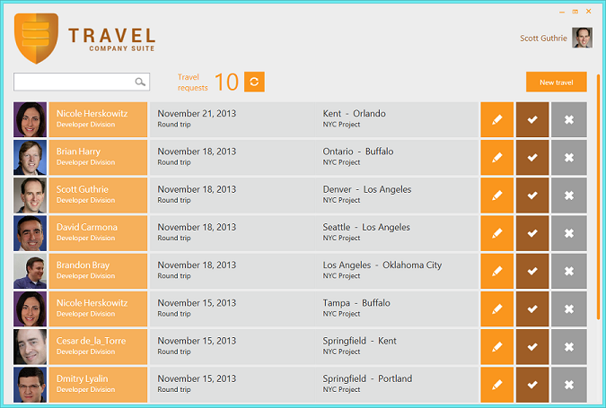
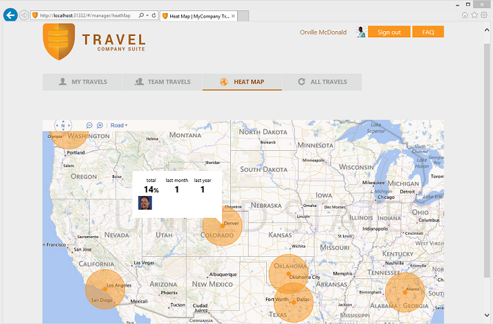

# MyCompany TRAVEL demo application
## Requires
- Visual Studio 2013
## License
- MS-LPL
## Technologies
- WPF
- knockout.js
- windows azure active directory
- ASP.NET MVC 5
- Durandal
- .NET Framework 4.5.1
- SignalR 2.0
- Entity Framework 6
- SPA Web application
- ASP.NET Web API 2
## Topics
- Desktop and Web apps development
## Updated
- 11/19/2013
## Description

<h1>Introduction</h1>

<em>At the Visual Studio 2013 Launch Event (Nov. 13th 2013), Microsoft used a set of demo applications to explain the new features in .NET 4.5.1 and Visual Studio 2013. Here we are publishing those demo applications. 
<strong></strong></em>

<em><strong><a href="http://aka.ms/mycompanyapps">MyCompany </a></strong>is a set of sample applications comprised of typical enterprise/business modules: Travel, Staff, Vacation, Visitors and Expenses.Each of these business applications are autonomous and
 could have been developed by different teams. They use different technologies and solutions to fulfill the different requirements from different user profiles and desired scenarios. All web and services solutions can be deployed to Windows Azure, and all of
 them are using Windows Azure Active Directory to support Single-Sign-On between all the applications in the suite.The companies can also federate the directory service with their on-premises directories (corporate Active Directory) to support SSO using the
 on-premises corporate AD credentials.A few of the web apps can also be integrated as apps for SharePoint within Office 365.In summary, different technologies are used depending on the business application scenarios: Web Apps, Windows Store, Windows Phone,
 WPF desktop, etc. 
 
 
This concrete business application is called <strong>TRAVEL </strong>and it is described below.</em>

<h1>Building the Sample</h1>

Requirements

-Visual Studio 2013

-Windows Azure SDK 2.2

-SQL Server 2012 Express LocalDB (included in VS 2013)

-Windows Azure SQL DB (for Cloud deployment)

-Windows Azure Web Sites (for Cloud deployment)

Description

&bull; Travel is made up by several applications which allow employees to request and manage business travels.

&bull; The web application targets any employee, including managers and HHRR. Each role can make different actions. Regular employees can create and edit their own travel requests. Managers can accept or deny team member requests. HHRR can add attachments
 to the requests and accept them.

&bull; The desktop application (WPF) targets HHRR people, so they can edit and process travel requests.

&bull; In both applications email notifications are sent in some circumstances and there are also web notifications using SignalR.

<strong>Travel WPF Desktop App:</strong>

<strong>Travel Web App (SPA - Single Page Application):</strong>

<strong> 
</strong>

&nbsp;

<h1><strong>Simplified Architecture Diagram</strong></h1>

&nbsp;

<h1><strong>Goals</strong></h1>

&bull; To highlight the importance of&nbsp;<strong>desktop clients</strong>&nbsp;(<strong>WPF</strong>) for many scenarios.

&bull;&nbsp;It shows new technologies in&nbsp;<strong>WPF</strong>, like&nbsp;<strong>SignalR client lib for .NET</strong>&nbsp;and&nbsp;<strong>Toast notifications</strong>

&bull; Highlights Bing Maps use in web applications&nbsp;

&nbsp;

<h1>Covered Technologies</h1>

Services technologies

<table class="GridTable1Light1" border="1" cellspacing="0" cellpadding="0">
<tbody>
<tr>
<td width="216" valign="top">

<strong>ASP.NET Web API 2</strong>

</td>
</tr>
<tr>
<td width="216" valign="top">

<strong>Attribute Routes</strong>

</td>
</tr>
<tr>
<td width="216" valign="top">

<strong>OWIN-Katana</strong>

</td>
</tr>
<tr>
<td width="216" valign="top">

<strong>SignalR 2.0</strong>

</td>
</tr>
<tr>
<td width="216" valign="top">

<strong>Entity Framework 6</strong>

</td>
</tr>
<tr>
<td width="216" valign="top">

<strong>Email notification</strong>

</td>
</tr>
<tr>
<td width="216" valign="top">

<strong>Windows Azure Service Bus</strong>

</td>
</tr>
</tbody>
</table>

&nbsp;

Web Application technologies

<table class="GridTable1Light1" border="1" cellspacing="0" cellpadding="0">
<tbody>
<tr>
<td width="216" valign="top">

<strong>ASP.NET MVC 5</strong>

</td>
</tr>
<tr>
<td width="216" valign="top">

<strong>SPA Web application</strong>

</td>
</tr>
<tr>
<td width="216" valign="top">

<strong>Durandal</strong>

</td>
</tr>
<tr>
<td width="216" valign="top">

<strong>Knockout.js</strong>

</td>
</tr>
<tr>
<td width="216" valign="top">

<strong>Web Mobile View</strong>

</td>
</tr>
</tbody>
</table>

&nbsp;

Security technologies

<table class="GridTable1Light1" border="1" cellspacing="0" cellpadding="0">
<tbody>
<tr>
<td width="216" valign="top">

<strong>Windows Azure Active Directory</strong>

</td>
</tr>
</tbody>
</table>

&nbsp;

Windows Apps technologies

<table class="GridTable1Light1" border="1" cellspacing="0" cellpadding="0">
<tbody>
<tr>
<td width="216" valign="top">

<strong>.NET WPF</strong>

</td>
</tr>
</tbody>
</table>

&nbsp;

<h1>What this demo applications is NOT about</h1>

These applications are not production systems and are not intended as a guidance for mission-critical applications, as it mostly covers CRUD and Data-Driven scenarios, only. If you need guidance for complex scenarios, we recommend to check guidance material
 from the Microsoft Patterns &amp; Practices group like the &lsquo;CQRS Journey guidance&rsquo;, which shows a reference application with a related functional domain &amp; scope (Events/Conferences platform) but from a different point of view based on design-patterns
 and best architectural practices for complex scenarios, covering approaches like CQRS (Command &amp; Query Responsibility Segregation) &amp; DDD (Domain Driven Design).

