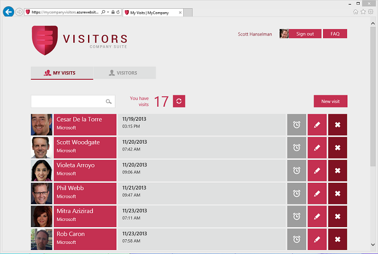
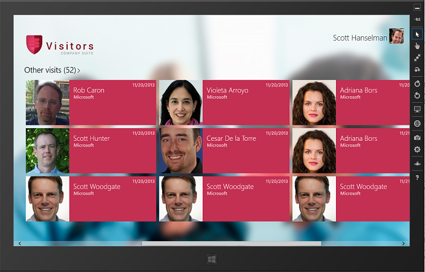
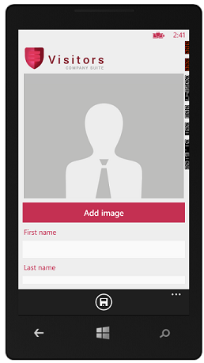

# MyCompany VISITORS demo application
## Requires
- Visual Studio 2013
## License
- MS-LPL
## Technologies
- Bootstrap
- knockout.js
- windows azure active directory
- Windows Phone 8
- nfc
- ASP.NET MVC 5
- Durandal
- .NET Framework 4.5.1
- SignalR 2.0
- Entity Framework 6
- SPA Web application
- ASP.NET Scaffolding
- Windows 8.1 XAML/C#
- ASP.NET Web API 2
- ASP.NET Identity
## Topics
- web application
- New technologies in Visual Studio 2013
- Modern apps development
## Updated
- 05/19/2014
## Description

<strong>[UPDATE - May 2014]</strong>

- Added <strong>UNIVERSAL WINDOWS APPS </strong>sharing 90% of the compiled code (Shared Universal project) between the new
<strong>Windows 8.1 Store app </strong>(Tablet form-factor) and a new <strong>Windows Phone 8.1 app
</strong>client, for the VISITORS business application.

- Added a <strong>Hybrid-HTML app (CORDOVA app)</strong> using the preview of Visual Studio Hybrid Multi-Device apps template based on HTML/JavaScript. Runs on any mobile device, like Android or iOS. Tested on Samsung Galaxy S5, for instance.

- Minor updates to the iOS and Android native apps developed in <strong>C#/Xamarin</strong>. Included in the same VS Solution, now.

<strong>REQUIREMENTS:</strong>

- <strong>Visual Studio 2013 UPDATE 2 RTM</strong> (Released on May 12 2014)

- <strong>XAMARIN for Android and iOS for Visual Studio </strong>(If you don't have it, you can just remove the Xamarin projects from the solution)

--&gt; http://www.xamarin.com

- <strong>Hybrid Multi-Device apps for Visual Studio (VS Tooling for Apache Cordova apps):</strong>

--&gt; <a href="http://msdn.microsoft.com/en-us/vstudio/dn722381">http://msdn.microsoft.com/en-us/vstudio/dn722381</a>

<strong>TIP for NO AUTHENTICATION</strong>: Run the apps with no AZURE AD authentication, so the initial configuration is easier for you. Just add &quot;noauth&quot; at the end of the URL, like
<a href="http://localhost:31330/noauth">http://localhost:31330/noauth</a>, or put &quot;noauth&quot; in the &quot;specific page&quot; edit box in the WEB tab in the &quot;MyCompany.Visitors.Web&quot; project properties.

&nbsp;

<strong><em>[UPDATE - January 2014]</em></strong>

Added&nbsp;<strong>two more client apps</strong>&nbsp;to 'MyCompany VISITORS Demo Apps', the&nbsp;<strong>iPad</strong>&nbsp;and&nbsp;<strong>Android</strong>&nbsp;client applications developed in
<strong>C#</strong>&nbsp;with&nbsp;<strong><a href="http://xamarin.com/ios">Xamarin.iOS</a></strong>&nbsp;and&nbsp;<strong><a href="http://xamarin.com/android">Xamarin.Android</a></strong>&nbsp;thanks to a partnership we made between Microsoft and Xamarin].

Get it from:&nbsp;<a href="https://github.com/xamarin/MyCompany/">https://github.com/xamarin/MyCompany/</a>

&nbsp;

<h1>Introduction</h1>

<em>At the Visual Studio 2013 Launch Event (Nov. 13th 2013), Microsoft used a set of demo applications to explain the new features in .NET 4.5.1 and Visual Studio 2013.<em>&nbsp;Here we are publishing those demo applications.</em></em>

<em><em><a href="http://aka.ms/mycompanyapps">My Company</a> is a set of sample applications comprised of typical enterprise/business modules: Travel, Staff, Vacation, Visitors and Expenses.Each of these business applications are autonomous and could have
 been developed by different teams. They use different technologies and solutions to fulfill the different requirements from different user profiles and desired scenarios.&nbsp;All web and services solutions can be deployed to Windows Azure, and all of them
 are using Windows Azure Active Directory to support Single-Sign-On between all the applications in the suite.The companies can also federate the directory service with their on-premises directories (corporate Active Directory) to support SSO using the on-premises
 corporate AD credentials.A few of the web apps can also be integrated as apps for SharePoint within Office 365. 
In summary, different technologies are used depending on the business application scenarios: Web Apps, Windows Store, Windows Phone, WPF desktop, etc.</em></em>

<em><em> 
</em></em>

<em><em>This concrete business application is called <strong>VISITORS </strong>
and it is described below.</em></em>

<h1>Building the Sample</h1>

<strong><em>Requirements</em></strong>

<em>Visual Studio 2013</em>

<em>Windows Azure SDK 2.2</em>

<em>SQL Server 2012 Express LocalDB (included in VS 2013)</em>

<em>Windows Azure SQL DB (for Cloud deployment)</em>

<em>Windows Azure Web Sites (for Cloud deployment)</em>

Description

<strong>Visitors </strong>is composed by several client applications that allow to request and manage visits and visitors for your company. Different features are available depending on your role in the organization and the client application being used
 (Web app, Windows store apps or Phone app).The web application is an application for employees to schedule visits and manage visitors&rsquo; information. The Windows Phone application is a visit-card to be filled with the visitor information and simplifies
 the process to handle a visitor&rsquo;s arrival thru NFC communication. The Windows 8 application is an application that targets security staff so they manage visits and visitors information from a security staff point of view.Email notifications are sent
 in some circumstances and there are also web notifications using SignalR. The Visits and Visitors pictures and info are also sync by using SignalR.

<strong>Visitors Web App (SPA - Single Page Application):</strong>

&nbsp;

<strong>Visitors Windows 8.1 Store App (C#/XAML):</strong>

<h1></h1>

<strong>Visitors Windows 8.1 Store App&nbsp;<strong>(C#/XAML):</strong></strong>

<strong> 
</strong>

<h1>Simplified Architecture Diagram</h1>

&nbsp;

<h1>Goals</h1>
<ul>
<li>Demo support to highlight SignalR, Web API, Scaffolding, ASP.NET Identity, Bootstrap, NFC communication and XAML/C# Store apps.&nbsp;
</li></ul>
<h1>Covered technologies</h1>

Services technologies

<table class="GridTable1Light1" border="1" cellspacing="0" cellpadding="0">
<tbody>
<tr>
<td width="216" valign="top">

<strong>ASP.NET Web API 2</strong>

</td>
</tr>
<tr>
<td width="216" valign="top">

<strong>Attribute Routes</strong>

</td>
</tr>
<tr>
<td width="216" valign="top">

<strong>OWIN-Katana</strong>

</td>
</tr>
<tr>
<td width="216" valign="top">

<strong>SignalR 2.0</strong>

</td>
</tr>
<tr>
<td width="216" valign="top">

<strong>Entity Framework 6</strong>

</td>
</tr>
<tr>
<td width="216" valign="top">

<strong>Windows Azure Service Bus</strong>

</td>
</tr>
</tbody>
</table>

Web Application technologies

<table class="GridTable1Light1" border="1" cellspacing="0" cellpadding="0">
<tbody>
<tr>
<td width="216" valign="top">

<strong>ASP.NET MVC 5</strong>

</td>
</tr>
<tr>
<td width="216" valign="top">

<strong>SPA Web application</strong>

</td>
</tr>
<tr>
<td width="216" valign="top">

<strong>Durandal</strong>

</td>
</tr>
<tr>
<td width="216" valign="top">

<strong>Knockout.js</strong>

</td>
</tr>
<tr>
<td width="216" valign="top">

<strong>ASP.NET Scaffolding</strong>

</td>
</tr>
<tr>
<td width="216" valign="top">

<strong>Bootstrap</strong>

</td>
</tr>
</tbody>
</table>

Security technologies

<table class="GridTable1Light1" border="1" cellspacing="0" cellpadding="0">
<tbody>
<tr>
<td width="216" valign="top">

<strong>Windows Azure Active Directory</strong>

</td>
</tr>
<tr>
<td width="216" valign="top">

<strong>ASP.NET Identity</strong>

</td>
</tr>
</tbody>
</table>

Windows Apps technologies

<table class="GridTable1Light1" border="1" cellspacing="0" cellpadding="0">
<tbody>
<tr>
<td width="216" valign="top">

<strong>Windows 8.1 Store C#/XAML</strong>

</td>
</tr>
<tr>
<td width="216" valign="top">

<strong>Windows Phone 8 C#/XAML</strong>

</td>
</tr>
</tbody>
</table>
<table class="GridTable1Light1" border="1" cellspacing="0" cellpadding="0">
<tbody>
<tr>
<td width="216" valign="top">

<strong>NFC communication</strong>

</td>
</tr>
</tbody>
</table>

&nbsp;

<h1>What this demo application is NOT about</h1>

These applications are not production systems and are not intended as a guidance for mission-critical applications, as it mostly covers CRUD and Data-Driven scenarios, only. If you need guidance for complex scenarios, we recommend to check guidance material
 from the Microsoft Patterns &amp; Practices group like the &lsquo;CQRS Journey guidance&rsquo;, which shows a reference application with a related functional domain &amp; scope (Events/Conferences platform) but from a different point of view based on design-patterns
 and best architectural practices for complex scenarios, covering approaches like CQRS (Command &amp; Query Responsibility Segregation) &amp; DDD (Domain Driven Design).

