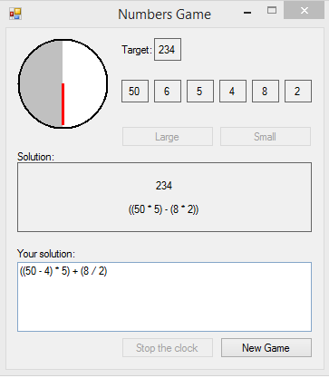

# Numbers Game
## Requires
- Visual Studio 2017
## License
- MIT
## Technologies
- VB2017
## Topics
- Maths game
## Updated
- 06/19/2017
## Description

This is the Numbers Game as played on the UK Channel Four tv game show CountDown. The&nbsp;game is simple, you select 6 random numbers, and attempt to reach a random target byadding, subtracting, multiplying, and dividing those
 numbers.The numbers used are four large numbers... 100, 75, 50, 25, and twenty small numbers...two each of the numbers 1 to 10.You can randomly choose from 0 to 4 large numbers, with the remaining numbers being small&nbsp;numbers. When you select your sixth
 random number, a random target number will be chosen&nbsp;(from 101 to 999), the countdown clock will begin, and you have thirty seconds tofind a solution that equals the target number. Your solution must consist of any of your chosen numbers, the arithmetic
 operators &#43;, -, /, *, and brackets. You only needto use as many of the six numbers as you need. It's not obligatory to use all of thenumbers.During the thirty second countdown, the application will attempt to solve the equation.If a solution exists, it will
 be found within the thirty second duration (Exceptional&nbsp;cases might take slightly longer). If you think you've found a solution, you can stop&nbsp;the clock and the PC solution will appear as soon as it is available.

This is a difficult game to beat, but it is possible if you're quick with mental arithmetic.

&nbsp;

 

