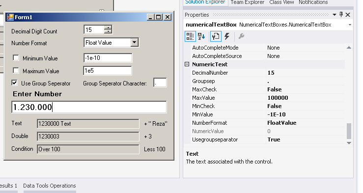

# Numeric Textbox Library
## Requires
- Visual Studio 2013
## License
- Apache License, Version 2.0
## Technologies
- Visual C#
## Topics
- Windows Forms Controls
## Updated
- 03/05/2017
## Description

<h1>Introduction</h1>

<em>This control validates input according to selected numeric format, it helps both user and programmer</em>

<h1>Building the Sample</h1>

<em>This sample is a Visual Studio 2013 C sharp solution.</em>

<ul>
<li><em>You can build only numerictextboxes.dll. Then add the reference to your project using the Browse button in the&nbsp;<code>Add Reference</code>&nbsp;dialog.</em>
</li><li><em>Or you can add numerictextboxes project to your solution. and then you add a reference to the your project's classes.</em>
</li></ul>

Description

This project bases from&nbsp;<strong>Reza_m_n_65 </strong>Numerical text box sample. I thank him.

<em>Numerical text boxes&nbsp;is a&nbsp;<code>System.Windows.Forms.TextBox</code>&nbsp;component extension. İt uses Text box onTextchanged event for controlling input.</em>

<em>you can select unsigned integer, integer, decimal and float input modes. Also you can restrict decimal digit count.</em>

<em>You can select thousands char and you can enable or disable using it.</em>

<em>You can check minimum and maximum values and checking enable or disable.</em>

<em>İt restricts more than one zero at beginning number.</em>

<em>It uses locale numberformatinfo. So there is no problem. local Decimal seperator can be dot or comma.</em>

<em>Programmer can obtain input text value from&nbsp;numericalTextBox.NumericValue property as double.</em>

<em>Properties seen below Numerictext category and has description &nbsp;in Visual studio designer</em>

&nbsp;

<em> 
</em>

<em> 
</em>

<em>&nbsp;</em><em>NumerictextBox properties;</em>

<ul>
<li><em>DecimalNumber get set between 0 and 15 default 15 integer.</em> </li><li><em>Groupsep char get set. You can select every char except ( negative e, E, and decimal char) if user selects this forbidden chars locale group seperator char uses.&nbsp;</em>
</li><li><em>Maxcheck get set default false.</em> </li><li><em>MaxValue get set default 0 double&nbsp;</em> </li><li><em>MinCheck get set default False</em> </li><li><em>MinValue &nbsp;get set defalt 0 double</em> </li><li><em>Number format get set You can select enumarated list default float value</em>
</li><li><em>NumericValue get returns text value as double</em> </li><li><em>UsegroupSeperator false default&nbsp;</em> </li></ul>

<em>Numerical text box class has three methods;</em>

<em>protected override void <strong>OnTextChanged</strong>(EventArgs e) input changes detection, and writing back corrected sting.</em>

<em>protected string <strong>NormalTextToNumericString</strong>() &nbsp;input arranged here.</em>

<em>protected double <strong>txttoDouble</strong>(string txt) &nbsp;evaluating value of text 
</em>

<em>You can include <em><strong>code snippets,&nbsp;</strong></em><strong>images</strong>,
<strong>videos</strong>. &nbsp;&nbsp;</em>

&nbsp;

C#

Edit|Remove

csharp
<pre class="hidden">        protected override void OnTextChanged(EventArgs e)
        {
            if (!string.Equals(this.Text, _oldText)) //change only, if this method not changed this Text
            {                                        // avoid twice execution
                _cursorPositionPlus = 0;
                int SelectionStart = this.SelectionStart;
                int TextLength = this.Text.Length;
                int CursorPositionPlus;
                string Text = NormalTextToNumericString();
                CursorPositionPlus = _cursorPositionPlus;
                if ((!_maxCheck || _textValue &lt;= _maxValue) &amp;&amp; (!_minCheck || _textValue &gt;= _minValue))
                {
                    this.Text = _oldText = Text;
                    this.SelectionStart = SelectionStart &#43; CursorPositionPlus;
                }
                else
                {
                    this.Text = _oldText;
                }
            }
            base.OnTextChanged(e);
        }</pre>

<pre class="csharp">&nbsp;&nbsp;&nbsp;&nbsp;&nbsp;&nbsp;&nbsp;&nbsp;protected&nbsp;override&nbsp;void&nbsp;OnTextChanged(EventArgs&nbsp;e)&nbsp;
&nbsp;&nbsp;&nbsp;&nbsp;&nbsp;&nbsp;&nbsp;&nbsp;{&nbsp;
&nbsp;&nbsp;&nbsp;&nbsp;&nbsp;&nbsp;&nbsp;&nbsp;&nbsp;&nbsp;&nbsp;&nbsp;if&nbsp;(!string.Equals(this.Text,&nbsp;_oldText))&nbsp;//change&nbsp;only,&nbsp;if&nbsp;this&nbsp;method&nbsp;not&nbsp;changed&nbsp;this&nbsp;Text&nbsp;
&nbsp;&nbsp;&nbsp;&nbsp;&nbsp;&nbsp;&nbsp;&nbsp;&nbsp;&nbsp;&nbsp;&nbsp;{&nbsp;&nbsp;&nbsp;&nbsp;&nbsp;&nbsp;&nbsp;&nbsp;&nbsp;&nbsp;&nbsp;&nbsp;&nbsp;&nbsp;&nbsp;&nbsp;&nbsp;&nbsp;&nbsp;&nbsp;&nbsp;&nbsp;&nbsp;&nbsp;&nbsp;&nbsp;&nbsp;&nbsp;&nbsp;&nbsp;&nbsp;&nbsp;&nbsp;&nbsp;&nbsp;&nbsp;&nbsp;&nbsp;&nbsp;&nbsp;//&nbsp;avoid&nbsp;twice&nbsp;execution&nbsp;
&nbsp;&nbsp;&nbsp;&nbsp;&nbsp;&nbsp;&nbsp;&nbsp;&nbsp;&nbsp;&nbsp;&nbsp;&nbsp;&nbsp;&nbsp;&nbsp;_cursorPositionPlus&nbsp;=&nbsp;0;&nbsp;
&nbsp;&nbsp;&nbsp;&nbsp;&nbsp;&nbsp;&nbsp;&nbsp;&nbsp;&nbsp;&nbsp;&nbsp;&nbsp;&nbsp;&nbsp;&nbsp;int&nbsp;SelectionStart&nbsp;=&nbsp;this.SelectionStart;&nbsp;
&nbsp;&nbsp;&nbsp;&nbsp;&nbsp;&nbsp;&nbsp;&nbsp;&nbsp;&nbsp;&nbsp;&nbsp;&nbsp;&nbsp;&nbsp;&nbsp;int&nbsp;TextLength&nbsp;=&nbsp;this.Text.Length;&nbsp;
&nbsp;&nbsp;&nbsp;&nbsp;&nbsp;&nbsp;&nbsp;&nbsp;&nbsp;&nbsp;&nbsp;&nbsp;&nbsp;&nbsp;&nbsp;&nbsp;int&nbsp;CursorPositionPlus;&nbsp;
&nbsp;&nbsp;&nbsp;&nbsp;&nbsp;&nbsp;&nbsp;&nbsp;&nbsp;&nbsp;&nbsp;&nbsp;&nbsp;&nbsp;&nbsp;&nbsp;string&nbsp;Text&nbsp;=&nbsp;NormalTextToNumericString();&nbsp;
&nbsp;&nbsp;&nbsp;&nbsp;&nbsp;&nbsp;&nbsp;&nbsp;&nbsp;&nbsp;&nbsp;&nbsp;&nbsp;&nbsp;&nbsp;&nbsp;CursorPositionPlus&nbsp;=&nbsp;_cursorPositionPlus;&nbsp;
&nbsp;&nbsp;&nbsp;&nbsp;&nbsp;&nbsp;&nbsp;&nbsp;&nbsp;&nbsp;&nbsp;&nbsp;&nbsp;&nbsp;&nbsp;&nbsp;if&nbsp;((!_maxCheck&nbsp;||&nbsp;_textValue&nbsp;&lt;=&nbsp;_maxValue)&nbsp;&amp;&amp;&nbsp;(!_minCheck&nbsp;||&nbsp;_textValue&nbsp;&gt;=&nbsp;_minValue))&nbsp;
&nbsp;&nbsp;&nbsp;&nbsp;&nbsp;&nbsp;&nbsp;&nbsp;&nbsp;&nbsp;&nbsp;&nbsp;&nbsp;&nbsp;&nbsp;&nbsp;{&nbsp;
&nbsp;&nbsp;&nbsp;&nbsp;&nbsp;&nbsp;&nbsp;&nbsp;&nbsp;&nbsp;&nbsp;&nbsp;&nbsp;&nbsp;&nbsp;&nbsp;&nbsp;&nbsp;&nbsp;&nbsp;this.Text&nbsp;=&nbsp;_oldText&nbsp;=&nbsp;Text;&nbsp;
&nbsp;&nbsp;&nbsp;&nbsp;&nbsp;&nbsp;&nbsp;&nbsp;&nbsp;&nbsp;&nbsp;&nbsp;&nbsp;&nbsp;&nbsp;&nbsp;&nbsp;&nbsp;&nbsp;&nbsp;this.SelectionStart&nbsp;=&nbsp;SelectionStart&nbsp;&#43;&nbsp;CursorPositionPlus;&nbsp;
&nbsp;&nbsp;&nbsp;&nbsp;&nbsp;&nbsp;&nbsp;&nbsp;&nbsp;&nbsp;&nbsp;&nbsp;&nbsp;&nbsp;&nbsp;&nbsp;}&nbsp;
&nbsp;&nbsp;&nbsp;&nbsp;&nbsp;&nbsp;&nbsp;&nbsp;&nbsp;&nbsp;&nbsp;&nbsp;&nbsp;&nbsp;&nbsp;&nbsp;else&nbsp;
&nbsp;&nbsp;&nbsp;&nbsp;&nbsp;&nbsp;&nbsp;&nbsp;&nbsp;&nbsp;&nbsp;&nbsp;&nbsp;&nbsp;&nbsp;&nbsp;{&nbsp;
&nbsp;&nbsp;&nbsp;&nbsp;&nbsp;&nbsp;&nbsp;&nbsp;&nbsp;&nbsp;&nbsp;&nbsp;&nbsp;&nbsp;&nbsp;&nbsp;&nbsp;&nbsp;&nbsp;&nbsp;this.Text&nbsp;=&nbsp;_oldText;&nbsp;
&nbsp;&nbsp;&nbsp;&nbsp;&nbsp;&nbsp;&nbsp;&nbsp;&nbsp;&nbsp;&nbsp;&nbsp;&nbsp;&nbsp;&nbsp;&nbsp;}&nbsp;
&nbsp;&nbsp;&nbsp;&nbsp;&nbsp;&nbsp;&nbsp;&nbsp;&nbsp;&nbsp;&nbsp;&nbsp;}&nbsp;
&nbsp;&nbsp;&nbsp;&nbsp;&nbsp;&nbsp;&nbsp;&nbsp;&nbsp;&nbsp;&nbsp;&nbsp;base.OnTextChanged(e);&nbsp;
&nbsp;&nbsp;&nbsp;&nbsp;&nbsp;&nbsp;&nbsp;&nbsp;}</pre>

<h1>Source Code Files</h1>
<ul>
<li><em>Class1.cs #1 - All in one source file.</em> </li><li><em><em>Form1.cs #2 - Using Numeric text box &nbsp;sample form file in numerictextboxsample project.</em></em>
</li></ul>
<h1>More Information</h1>

<em>For more information on X, see ...?</em>

