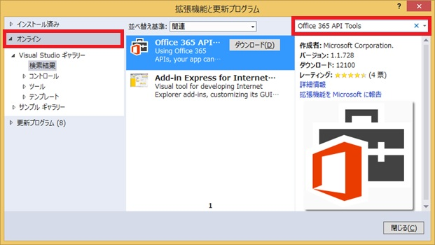
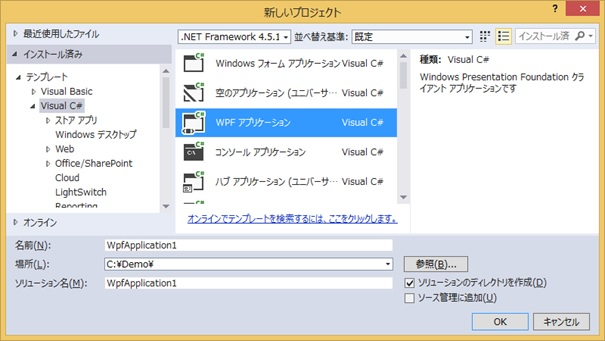
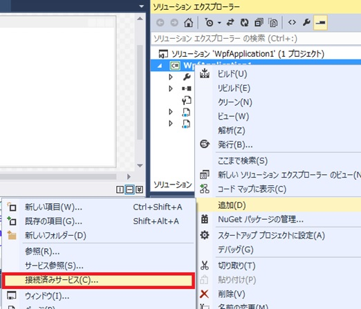
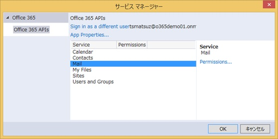
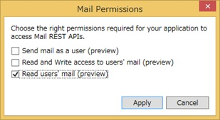
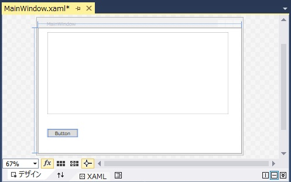
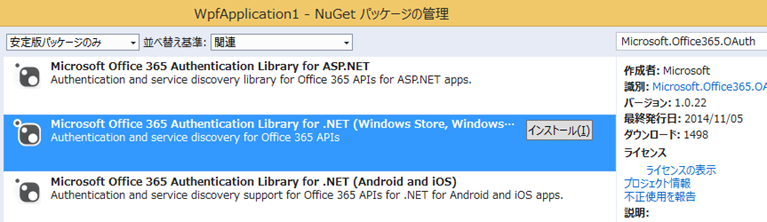
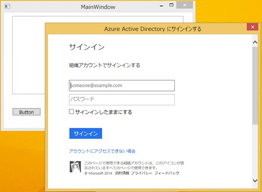
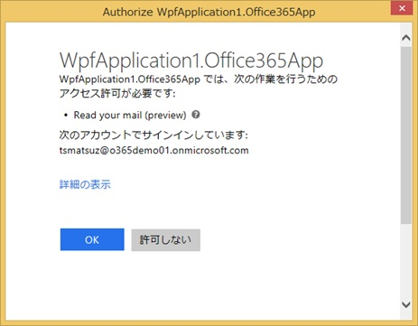
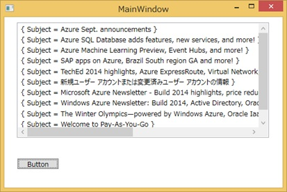

# Office 365 API Tools を使用したプログラミング
## Requires
- 
## License
- Apache License, Version 2.0
## Technologies
- Microsoft Azure
- Office 365
- Visual Studio 2013
## Topics
- Office アプリケーション
## Updated
- 12/04/2014
## Description

<h1>Introduction</h1>

<em>Office 365 API は、オープンでシンプルなプロトコルを提供し、ライブラリーやユーティリティを使用せずに多くの言語環境でプログラミングできますが、ツールを使用することで、その生産性はさらに向上します。</em>

<em>ここでは、Office 365 API Tools for Visual Studio を使用した開発方法と、そのメリットを簡単に紹介します。</em>

<h1>Building the Sample</h1>

<em>Office 365 API Tools for Visual Studio を使用して、認&#35388;処理、Exchange Online のエンドポイントへの要求をおこなって、Inbox のメールの一覧を取得するアプリケーションを構築します。</em>

Description

開発環境の準備

ここで紹介するプログラミングをおこなう前に、事前に以下のコンポーネントのインストールやアカウント取得をおこなってください。

<ul>
<li>Visual Studio 2013 のインストール </li><li>Office 365 Business または Enterprise のアカウントの取得 (試用版は <a href="http://www.microsoft.com/ja-jp/office/365/">
Office 365</a> のページからお申込みいただけます) </li><li>上記 Office 365 の管理者アカウント (組織アカウント) を使用した Microsoft Azure サブスクリプションの作成 (作成手順は <a href="http://blogs.msdn.com/b/tsmatsuz/archive/2014/06/02/office-365-api-programming.aspx">
こちら</a> で紹介しています) </li></ul>

&nbsp;

Office 365 API Tools for Visual Studio 2013 のインストール

Visual Studio 2013 を起動します。

[ツール ] - [拡張機能と更新プログラム] メニューを選択して、オンラインのギャラリーから「Office 365 API Tools」を検索してインストールします。(ダウンロード / インストール後に Visual Studio の再起動を促されます。)

&nbsp;

プロジェクト作成と Azure Active Directory へのアプリケーション登録

Office 365 API Tools では、Windows ストア アプリ、Windows ストア ユニバーサル アプリ、Windows フォーム、Windows Presentation Foundation (以降、WPF と記載)、ASP.NET (ASP.NET Web フォーム、ASP.NET MVC の双方)、Xamarin、Windows Phone アプリ (および、Cordova によるハイブリッド アプリ用のツールも提供されています) での利用が可能ですが、今回は WPF を使用してデスクトップ
 アプリケーションで処理をおこないます。

まず、Visual Studio を開いて [WPF アプリケーション] を新規作成します。

Office 365 API を使用するアプリケーションでは、事前に Microsoft Azure Active Directory にアプリケーション登録をおこないますが、Office 365 API Tools を使用すると作成したプロジェクトからこのアプリケーションの作成と管理 (変更) をおこなうことができます。

上記で作成されたプロジェクトを右クリックして、[追加] - [接続済みサービス] を選択します。

表示される画面で、[Register your app] をクリックすると Azure Active Directory へのログイン画面 (ブラウザー) が表示されるので、Office 365 の管理者アカウントとパスワードを入力してログインをおこないます。

今回は Exchange Online からメールの読み込みをおこなう簡単なアプリケーションを作成するため、ログイン後、[Mail] を選択して、[Permissions] をクリックします。(下図)

表示される画面で、[Read user's mail] を選択して [Apply] ボタンを押し、[OK] ボタンを押してダイアログを閉じます。

上記の設定により、Azure Active Directory にこのアプリケーションが登録され、アプリケーションの必要な設定情報 (Client ID など) が、プロジェクトの App.config に記述されます。(この登録されたアプリケーションのエントリを削除するには、Microsoft Azure 管理ポータルへのログインが必要です。)

&nbsp;

ライブラリを使用したプログラミング

では、プログラミングをおこなってみましょう。今回、ボタンとリストを配置し、ボタンを押すと Office 365 にログインをおこなって、Exchange Online からメールの一覧を取得してリストに表示します。

まず、MainWindow.xaml を表示して、ここに、下図の通り、ListBox と Button を配置します。(それぞれ、Name を「ListBox1」、「Button1」とします。)

プロジェクトを右クリックして [NuGet パッケージの管理] メニューを選択し、Microsoft Office 365 Authentication Library (Microsoft.Office365.OAuth) を選択してプロジェクトにインストールします。

上図のボタンをダブルクリックして、下記の通り、ボタンクリックのイベント処理を実装します。(Client ID, Redirect Uri は App.config に記述されています。System.Configuration を参照追加して、コードでこれらの値を参照しても構いません。)

&nbsp;

C#

Edit|Remove

csharp
<pre class="hidden">using Microsoft.IdentityModel.Clients.ActiveDirectory;
using Microsoft.Office365.OAuth;
using Microsoft.Office365.OutlookServices;

// 途中省略

private AuthenticationContext ac;

private async void Button_Click(object sender, RoutedEventArgs e)
{
  ac = new AuthenticationContext(&quot;https://login.windows.net/common&quot;);
  OutlookServicesClient cl = new OutlookServicesClient(
    new Uri(&quot;https://outlook.office365.com/api/v1.0&quot;),
    () =&gt;
    {
      AuthenticationResult ar = ac.AcquireToken(
        &quot;https://outlook.office365.com&quot;,
        &quot;69c98d4b-90d0-4985-920a-536183663e85&quot;,
        new Uri(&quot;http://localhost/625edc9f768f590a21fb1b567c0ee576&quot;));
      return Task.Factory.StartNew(() =&gt; { return ar.AccessToken; });
    });
  var res = await (from m in cl.Me.Messages
            select new { m.Subject }).ExecuteAsync();
  ListBox1.ItemsSource = res.CurrentPage;
}</pre>

<pre class="csharp">using&nbsp;Microsoft.IdentityModel.Clients.ActiveDirectory;&nbsp;
using&nbsp;Microsoft.Office365.OAuth;&nbsp;
using&nbsp;Microsoft.Office365.OutlookServices;&nbsp;
&nbsp;
//&nbsp;途中省略&nbsp;
&nbsp;
private&nbsp;AuthenticationContext&nbsp;ac;&nbsp;
&nbsp;
private&nbsp;async&nbsp;void&nbsp;Button_Click(object&nbsp;sender,&nbsp;RoutedEventArgs&nbsp;e)&nbsp;
{&nbsp;
&nbsp;&nbsp;ac&nbsp;=&nbsp;new&nbsp;AuthenticationContext(&quot;https://login.windows.net/common&quot;);&nbsp;
&nbsp;&nbsp;OutlookServicesClient&nbsp;cl&nbsp;=&nbsp;new&nbsp;OutlookServicesClient(&nbsp;
&nbsp;&nbsp;&nbsp;&nbsp;new&nbsp;Uri(&quot;https://outlook.office365.com/api/v1.0&quot;),&nbsp;
&nbsp;&nbsp;&nbsp;&nbsp;()&nbsp;=&gt;&nbsp;
&nbsp;&nbsp;&nbsp;&nbsp;{&nbsp;
&nbsp;&nbsp;&nbsp;&nbsp;&nbsp;&nbsp;AuthenticationResult&nbsp;ar&nbsp;=&nbsp;ac.AcquireToken(&nbsp;
&nbsp;&nbsp;&nbsp;&nbsp;&nbsp;&nbsp;&nbsp;&nbsp;&quot;https://outlook.office365.com&quot;,&nbsp;
&nbsp;&nbsp;&nbsp;&nbsp;&nbsp;&nbsp;&nbsp;&nbsp;&quot;69c98d4b-90d0-4985-920a-536183663e85&quot;,&nbsp;
&nbsp;&nbsp;&nbsp;&nbsp;&nbsp;&nbsp;&nbsp;&nbsp;new&nbsp;Uri(&quot;http://localhost/625edc9f768f590a21fb1b567c0ee576&quot;));&nbsp;
&nbsp;&nbsp;&nbsp;&nbsp;&nbsp;&nbsp;return&nbsp;Task.Factory.StartNew(()&nbsp;=&gt;&nbsp;{&nbsp;return&nbsp;ar.AccessToken;&nbsp;});&nbsp;
&nbsp;&nbsp;&nbsp;&nbsp;});&nbsp;
&nbsp;&nbsp;var&nbsp;res&nbsp;=&nbsp;await&nbsp;(from&nbsp;m&nbsp;in&nbsp;cl.Me.Messages&nbsp;
&nbsp;&nbsp;&nbsp;&nbsp;&nbsp;&nbsp;&nbsp;&nbsp;&nbsp;&nbsp;&nbsp;&nbsp;select&nbsp;new&nbsp;{&nbsp;m.Subject&nbsp;}).ExecuteAsync();&nbsp;
&nbsp;&nbsp;ListBox1.ItemsSource&nbsp;=&nbsp;res.CurrentPage;&nbsp;
}</pre>

&nbsp;

動作確認

F5 ボタンを押してデバッグ実行をおこなってみましょう。

画面のボタンをクリックすると、下図のログイン画面の表示と、内部で Access Token, Refresh Token の取得がおこなわれます。

ログインをおこなうと、下図のような、このアプリへの権限付与を確認するコンセント UI が表示されます。

上図で [OK] を押すと、下図の通り、Inbox のメールの一覧のタイトル (Subject) が表示されます。

&nbsp;

Access Token と Refresh Token

アプリケーションが Exchange のサービスに接続する際、内部で Access Token と呼ばれる文字列が使用されています。この Access Token を使用して、アプリケーションは、その他の処理も継続して実行できます。 
また、Access Token には有効期限があり、1 時間で使用できなくなりますが、この場合は Refresh Token と呼ばれるものを使用して、再度、Access Token を取り直します。 
上記の AcquireTokenSilentAsync では、こうした面倒なトークンの扱いも自動化してくれています。

また、Access Token や Refresh Token をキャッシュしてアプリケーション終了後もこの値を保持することで、同じアカウント情報で継続して利用することが可能です。(上記のサンプルでは、このキャッシュの処理はおこなっていません。)&nbsp;

&nbsp;

<h1>More Information</h1>

<a href="http://blogs.msdn.com/b/tsmatsuz/archive/2014/06/02/office-365-api-programming.aspx">Office 365 API 入門</a>

<a href="https://code.msdn.microsoft.com/Office-365-API-Excel-VBA-cffdbb44">Office 365 API を VBA から使用する</a>

