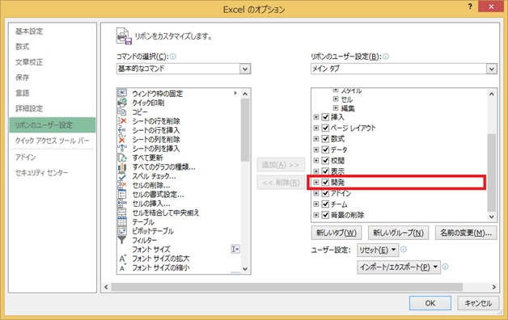
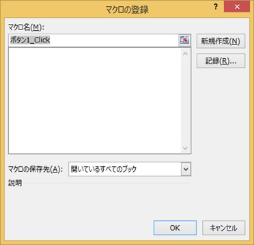
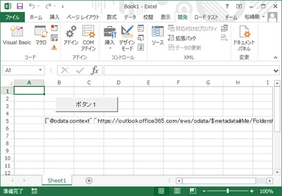

# Office 365 API を Excel VBA から使う
## Requires
- 
## License
- Apache License, Version 2.0
## Technologies
- Microsoft Azure
- Office 365
## Topics
- Office 365
## Updated
- 03/26/2015
## Description

<h1>Introduction</h1>

<em>Office 365 API は、オープンでシンプルなプロトコルを提供し、ライブラリーやユーティリティを使用せずに多くの言語環境でプログラミングできます。ここでは、その一例として、使い慣れた Excel を使って Office 365 API を処理する VBA &nbsp;(Visual Basic for Applications) のサンプルを構築してみます。</em>

<h1>Building the Sample</h1>

<em>ボタンを押すとログイン画面を表示し、ログイン後、Exchange Online のメールの一覧を取得してセルに書き込む簡単なサンプルを構築します。</em>

Description

事前準備

<em>ここで紹介するプログラミングをおこなう前に、事前に以下のアカウント取得をおこなってください。</em>

<ul>
<li><em>Office 365 Business または Enterprise のアカウントの取得 (試用版は <a href="http://www.microsoft.com/ja-jp/office/365/">
Office 365</a> のページからお申込みいただけます)</em> </li><li><em>上記 Office 365 の管理者アカウント (組織アカウント) を使用した Microsoft Azure サブスクリプションの作成</em>
</li></ul>

<em>つぎに、Microsoft Azure 管理ポータルに上記のアカウントでログインし、<em>「<a href="http://blogs.msdn.com/b/tsmatsuz/archive/2014/06/02/office-365-api-programming.aspx">Office 365 API 入門</a>」で紹介している手順で、</em>今回作成するアプリケーションを Azure Active Directory に登録します。(この際、設定した Redirect URI、取得した
 Client Id をメモしておいてください。)</em>

<ul>
<li><em>クライアントの種類として [Native Client Application] を選択してください。</em> </li><li><em>アプリケーションの権限 (Permission) に、[Office 365 Exchange Online] の [read user's mail] 付与してください。</em>
</li></ul>

&nbsp;

<em>VBA によるプログラミング 
</em>

Excel を起動してオプション画面を表示し、リボンの [開発] タブを表示するように設定してください。(下図は Excel 2013 の場合の設定画面です。)

[開発] タブを選択して、シート上にボタンを配置します。この際、マクロの登録画面が表示されるので、[新規作成] ボタンを押して、ボタン クリック時の処理を以下の通り記述します。

下記の [redirect url]、[client id] には、上記で取得した内容を設定してください。

&nbsp;

Visual Basic

スクリプトの編集|Remove

vb
<pre class="hidden">Sub ボタン1_Click()
'-- IE を起動する
Dim objBrowser As Object
Set objBrowser = CreateObject(&quot;InternetExplorer.Application&quot;)
objBrowser.Visible = True

'-- ログイン画面を表示する
objBrowser.Navigate &quot;https://login.microsoftonline.com/common/oauth2/authorize?response_type=code&amp;client_id=[client id]&amp;resource=https%3a%2f%2foutlook.office365.com%2f&amp;redirect_uri=[redirect url の URL エンコード文字列]&quot;

'-- リダイレクトページに戻ってくるまで待つ
While objBrowser.ReadyState &lt;&gt; 4 Or objBrowser.Busy = True Or (StrComp(Left(objBrowser.LocationURL, Len(&quot;[redirect url の文字列]&quot;)), &quot;[redirect url の文字列]&quot;) &lt;&gt; 0)
    DoEvents
Wend

'-- URL から code を取り出す
strQuery = Split(objBrowser.LocationURL, &quot;?&quot;)(1)
arrQuery = Split(strQuery, &quot;&amp;&quot;)
strCode = &quot;&quot;
For I = LBound(arrQuery) To UBound(arrQuery)
    arrElem = Split(arrQuery(I), &quot;=&quot;)
    If StrComp(arrElem(0), &quot;code&quot;) = 0 Then
        strCode = arrElem(1)
    End If
Next

'-- ブラウザー終了
objBrowser.Quit
Set objBrowser = Nothing

'-- Access Token の取得 (HTTP POST 要求)
Dim objXHttp1 As Object
Set objXHttp1 = CreateObject(&quot;msxml2.xmlhttp&quot;)
objXHttp1.Open &quot;POST&quot;, &quot;https://login.microsoftonline.com/common/oauth2/token&quot;, False
objXHttp1.setRequestHeader &quot;Content-Type&quot;, &quot;application/x-www-form-urlencoded&quot;
objXHttp1.send &quot;grant_type=authorization_code&amp;code=&quot; &amp; strCode &amp; &quot;&amp;client_id=[client id]&amp;redirect_uri=[redirect url の URL エンコード文字列]&quot;
'--Debug
'--Range(&quot;B5&quot;).Value = objXHttp1.Status
strToken1 = StrConv(objXHttp1.responsebody, vbUnicode)
Set objXHttp1 = Nothing

'-- Access Token のパース
strToken2 = Mid(strToken1, InStr(strToken1, &quot;{&quot;) &#43; 1, Len(strToken1) - InStr(strToken1, &quot;{&quot;) - (Len(strToken1) - InStrRev(strToken1, &quot;}&quot;) &#43; 1))
arrToken1 = Split(strToken2, &quot;,&quot;)
strAccessToken = &quot;&quot;
For I = LBound(arrToken1) To UBound(arrToken1)
    strElem = arrToken1(I)
    arrToken2 = Split(strElem, &quot;:&quot;)
    If (StrComp(Trim(arrToken2(0)), &quot;access_token&quot;) = 0) Or (StrComp(Trim(arrToken2(0)), &quot;&quot;&quot;access_token&quot;&quot;&quot;) = 0) Then
        strAccessToken = Replace(Trim(arrToken2(1)), &quot;&quot;&quot;&quot;, &quot;&quot;)
    End If
Next

'-- Exchange REST サービスの呼び出し
Dim objXHttp2 As Object
Set objXHttp2 = CreateObject(&quot;msxml2.xmlhttp&quot;)
objXHttp2.Open &quot;GET&quot;, &quot;https://outlook.office365.com/api/v1.0/me/messages?$top=20&amp;$select=Subject&quot;, False
objXHttp2.setRequestHeader &quot;Authorization&quot;, &quot;Bearer &quot; &amp; strAccessToken
objXHttp2.send
strResult = StrConv(objXHttp2.responsebody, vbUnicode)
Set objXHttp2 = Nothing

'-- 受け取った Json 文字列の結果をそのまま張り付ける
'-- (実際の開発では、ScriptControl オブジェクトなどでパースしてください)
Range(&quot;B5&quot;).Value = strResult

End Sub</pre>

<pre class="vb">Sub&nbsp;ボタン1_Click()&nbsp;
'--&nbsp;IE&nbsp;を起動する&nbsp;
Dim&nbsp;objBrowser&nbsp;As&nbsp;Object&nbsp;
Set&nbsp;objBrowser&nbsp;=&nbsp;CreateObject(&quot;InternetExplorer.Application&quot;)&nbsp;
objBrowser.Visible&nbsp;=&nbsp;True&nbsp;
&nbsp;
'--&nbsp;ログイン画面を表示する&nbsp;
objBrowser.Navigate&nbsp;&quot;https://login.microsoftonline.com/common/oauth2/authorize?response_type=code&amp;client_id=[client&nbsp;id]&amp;resource=https%3a%2f%2foutlook.office365.com%2f&amp;redirect_uri=[redirect&nbsp;url&nbsp;の&nbsp;URL&nbsp;エンコード文字列]&quot;&nbsp;
&nbsp;
'--&nbsp;リダイレクトページに戻ってくるまで待つ&nbsp;
While&nbsp;objBrowser.ReadyState&nbsp;&lt;&gt;&nbsp;4&nbsp;Or&nbsp;objBrowser.Busy&nbsp;=&nbsp;True&nbsp;Or&nbsp;(StrComp(Left(objBrowser.LocationURL,&nbsp;Len(&quot;[redirect&nbsp;url&nbsp;の文字列]&quot;)),&nbsp;&quot;[redirect&nbsp;url&nbsp;の文字列]&quot;)&nbsp;&lt;&gt;&nbsp;0)&nbsp;
&nbsp;&nbsp;&nbsp;&nbsp;DoEvents&nbsp;
Wend&nbsp;
&nbsp;
'--&nbsp;URL&nbsp;から&nbsp;code&nbsp;を取り出す&nbsp;
strQuery&nbsp;=&nbsp;Split(objBrowser.LocationURL,&nbsp;&quot;?&quot;)(1)&nbsp;
arrQuery&nbsp;=&nbsp;Split(strQuery,&nbsp;&quot;&amp;&quot;)&nbsp;
strCode&nbsp;=&nbsp;&quot;&quot;&nbsp;
For&nbsp;I&nbsp;=&nbsp;LBound(arrQuery)&nbsp;To&nbsp;UBound(arrQuery)&nbsp;
&nbsp;&nbsp;&nbsp;&nbsp;arrElem&nbsp;=&nbsp;Split(arrQuery(I),&nbsp;&quot;=&quot;)&nbsp;
&nbsp;&nbsp;&nbsp;&nbsp;If&nbsp;StrComp(arrElem(0),&nbsp;&quot;code&quot;)&nbsp;=&nbsp;0&nbsp;Then&nbsp;
&nbsp;&nbsp;&nbsp;&nbsp;&nbsp;&nbsp;&nbsp;&nbsp;strCode&nbsp;=&nbsp;arrElem(1)&nbsp;
&nbsp;&nbsp;&nbsp;&nbsp;End&nbsp;If&nbsp;
Next&nbsp;
&nbsp;
'--&nbsp;ブラウザー終了&nbsp;
objBrowser.Quit&nbsp;
Set&nbsp;objBrowser&nbsp;=&nbsp;Nothing&nbsp;
&nbsp;
'--&nbsp;Access&nbsp;Token&nbsp;の取得&nbsp;(HTTP&nbsp;POST&nbsp;要求)&nbsp;
Dim&nbsp;objXHttp1&nbsp;As&nbsp;Object&nbsp;
Set&nbsp;objXHttp1&nbsp;=&nbsp;CreateObject(&quot;msxml2.xmlhttp&quot;)&nbsp;
objXHttp1.Open&nbsp;&quot;POST&quot;,&nbsp;&quot;https://login.microsoftonline.com/common/oauth2/token&quot;,&nbsp;False&nbsp;
objXHttp1.setRequestHeader&nbsp;&quot;Content-Type&quot;,&nbsp;&quot;application/x-www-form-urlencoded&quot;&nbsp;
objXHttp1.send&nbsp;&quot;grant_type=authorization_code&amp;code=&quot;&nbsp;&amp;&nbsp;strCode&nbsp;&amp;&nbsp;&quot;&amp;client_id=[client&nbsp;id]&amp;redirect_uri=[redirect&nbsp;url&nbsp;の&nbsp;URL&nbsp;エンコード文字列]&quot;&nbsp;
'--Debug&nbsp;
'--Range(&quot;B5&quot;).Value&nbsp;=&nbsp;objXHttp1.Status&nbsp;
strToken1&nbsp;=&nbsp;StrConv(objXHttp1.responsebody,&nbsp;vbUnicode)&nbsp;
Set&nbsp;objXHttp1&nbsp;=&nbsp;Nothing&nbsp;
&nbsp;
'--&nbsp;Access&nbsp;Token&nbsp;のパース&nbsp;
strToken2&nbsp;=&nbsp;Mid(strToken1,&nbsp;InStr(strToken1,&nbsp;&quot;{&quot;)&nbsp;&#43;&nbsp;1,&nbsp;Len(strToken1)&nbsp;-&nbsp;InStr(strToken1,&nbsp;&quot;{&quot;)&nbsp;-&nbsp;(Len(strToken1)&nbsp;-&nbsp;InStrRev(strToken1,&nbsp;&quot;}&quot;)&nbsp;&#43;&nbsp;1))&nbsp;
arrToken1&nbsp;=&nbsp;Split(strToken2,&nbsp;&quot;,&quot;)&nbsp;
strAccessToken&nbsp;=&nbsp;&quot;&quot;&nbsp;
For&nbsp;I&nbsp;=&nbsp;LBound(arrToken1)&nbsp;To&nbsp;UBound(arrToken1)&nbsp;
&nbsp;&nbsp;&nbsp;&nbsp;strElem&nbsp;=&nbsp;arrToken1(I)&nbsp;
&nbsp;&nbsp;&nbsp;&nbsp;arrToken2&nbsp;=&nbsp;Split(strElem,&nbsp;&quot;:&quot;)&nbsp;
&nbsp;&nbsp;&nbsp;&nbsp;If&nbsp;(StrComp(Trim(arrToken2(0)),&nbsp;&quot;access_token&quot;)&nbsp;=&nbsp;0)&nbsp;Or&nbsp;(StrComp(Trim(arrToken2(0)),&nbsp;&quot;&quot;&quot;access_token&quot;&quot;&quot;)&nbsp;=&nbsp;0)&nbsp;Then&nbsp;
&nbsp;&nbsp;&nbsp;&nbsp;&nbsp;&nbsp;&nbsp;&nbsp;strAccessToken&nbsp;=&nbsp;Replace(Trim(arrToken2(1)),&nbsp;&quot;&quot;&quot;&quot;,&nbsp;&quot;&quot;)&nbsp;
&nbsp;&nbsp;&nbsp;&nbsp;End&nbsp;If&nbsp;
Next&nbsp;
&nbsp;
'--&nbsp;Exchange&nbsp;REST&nbsp;サービスの呼び出し&nbsp;
Dim&nbsp;objXHttp2&nbsp;As&nbsp;Object&nbsp;
Set&nbsp;objXHttp2&nbsp;=&nbsp;CreateObject(&quot;msxml2.xmlhttp&quot;)&nbsp;
objXHttp2.Open&nbsp;&quot;GET&quot;,&nbsp;&quot;https://outlook.office365.com/api/v1.0/me/messages?$top=20&amp;$select=Subject&quot;,&nbsp;False&nbsp;
objXHttp2.setRequestHeader&nbsp;&quot;Authorization&quot;,&nbsp;&quot;Bearer&nbsp;&quot;&nbsp;&amp;&nbsp;strAccessToken&nbsp;
objXHttp2.send&nbsp;
strResult&nbsp;=&nbsp;StrConv(objXHttp2.responsebody,&nbsp;vbUnicode)&nbsp;
Set&nbsp;objXHttp2&nbsp;=&nbsp;Nothing&nbsp;
&nbsp;
'--&nbsp;受け取った&nbsp;Json&nbsp;文字列の結果をそのまま張り付ける&nbsp;
'--&nbsp;(実際の開発では、ScriptControl&nbsp;オブジェクトなどでパースしてください)&nbsp;
Range(&quot;B5&quot;).Value&nbsp;=&nbsp;strResult&nbsp;
&nbsp;
End&nbsp;Sub</pre>

実際の開発では、access token だけでなく refresh token も取得します。 
取得した access token を保持しておき、access token が期限切れになったら refresh token を使ってaccess token を取り直します。また、refresh token が期限切れになった場合も、refresh token の取り直しをします。(最長で 90 日まで使用できます。) 
refresh token は、次回 ブック利用時に使用することで、2 回目以降はログインをおこなうことなく Exchange にアクセスできます。 
<strong>今回は、これらの処理は省略しています。</strong>

作成したブックは、マクロ有効ブック (.xlsm) として保存してください。

&nbsp;

動作確認

Excel に張り付けたボタンをクリックすると、下図の通り、ブラウザーが起動してログイン画面が表示されます。

上図で Office 365 のアカウントとパスワードを入力すると、下図の通り、Inbox のメールの一覧の Json 文字列がセルに記述されます。実際の開発では、この文字列のパースをおこなって Subject の一覧を表示するなど、処理を記述してください。

なお、はじめてログインするユーザーの場合はアプリへの権限を付与するためのコンセント UI が表示されます。

&nbsp;

<h1>More Information</h1>

<a href="http://blogs.msdn.com/b/tsmatsuz/archive/2014/06/02/office-365-api-programming.aspx">Office 365 API 入門</a>

