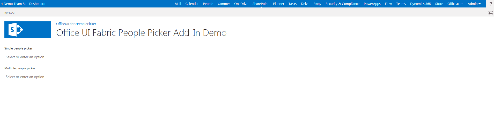

# Office UI Fabric People Picker and SharePoint search better together-SP Add-Ins
## Requires
- Visual Studio 2015
## License
- MIT
## Technologies
- Sharepoint Online
- apps for SharePoint
- SharePoint 2013
- SharePoint Add-ins
## Topics
- REST API
- People picker
- SharePoint Add-in
- Office UI Fabric
## Updated
- 09/11/2017
## Description

<h1>Introduction</h1>

In this article I'll be focused on&nbsp;<a href="https://dev.office.com/fabric" target="_blank">Office UI Fabric</a>, the official Office and Office 365 front-end framework, in particular I'll talk about the&nbsp;<a href="https://dev.office.com/fabric#/components/peoplepicker" target="_blank">People
 Picker</a>, an important component to have a user friendly and comfortable functionality for the end user.

On the Office UI Fabric website, there is a&nbsp;<a href="https://dev.office.com/fabric#/components/peoplepicker" target="_blank">sample</a>&nbsp;of this helpful control, however the demo is not so complete because we have static info about the people, I
 mean there is not a use case where is possible to retrieve the people across a search and display them in the people picker field dynamically.

<h1>Building the Sample</h1>

<em>So I decided to develop a solution to fill the gap, my intention is, to split this topic in two parts, I'll give you a first solution with&nbsp;<a href="https://msdn.microsoft.com/en-us/library/office/fp179930.aspx?f=255&MSPPError=-2147217396" target="_blank">SharePoint
 Add-In</a>&nbsp;and another one with&nbsp;<a href="https://dev.office.com/sharepoint/docs/spfx/sharepoint-framework-overview" target="_blank">SharePoint Framework</a>&nbsp;in another article.</em>

<em>Let's go forward with the solution, I created a simple&nbsp;<a href="https://msdn.microsoft.com/en-us/library/office/fp142379.aspx?f=255&MSPPError=-2147217396" target="_blank">SharePoint Hosted App</a>&nbsp;to achieve my goal.</em>

<em>In order to take advantage the SharePoint Search, is&nbsp;necessary specify in the App manifest the right permission:</em>

<em> 
</em>

Description

<em>Regarding the logic, every time that user will write&nbsp;something in the text field, the App will perform a&nbsp;<a href="https://msdn.microsoft.com/en-us/library/office/jj163876.aspx" target="_blank">REST API call on the SharePoint Search</a>&nbsp;to
 grab a result filtered, and the syntax of the url will be something like that:</em>

JavaScript

Edit|Remove

js
<pre class="hidden">/_api/search/query?querytext='*&quot; &#43; &quot;Characters to search&quot; &#43; &quot;*'&amp;rowlimit=10&amp;sourceid='b09a7990-05ea-4af9-81ef-edfab16c4e31'</pre>

<pre class="js">/_api/search/query?querytext='*&quot;&nbsp;&#43;&nbsp;&quot;Characters&nbsp;to&nbsp;search&quot;&nbsp;&#43;&nbsp;&quot;*'&amp;rowlimit=10&amp;sourceid='b09a7990-05ea-4af9-81ef-edfab16c4e31'</pre>

As you can see I specified a row limit&nbsp;to not overlook the performance and most important,&nbsp;I have narrowed the field of action&nbsp;<a href="https://social.technet.microsoft.com/wiki/contents/articles/25074.sharepoint-online-working-with-people-search-and-user-profiles.aspx" target="_blank">to
 work only with people and user profiles</a>&nbsp;(sourceid='b09a7990-05ea-4af9-81ef-edfab16c4e31').

Naturally the App is ready to go, then you can deploy it directly on your SharePoint Online or On-Premise.

<h1>Source Code Files</h1>

The solution it's also available on github:

<a href="https://github.com/giuleon/OfficeUIFabricPeoplePickerAddIn" target="_blank">https://github.com/giuleon/OfficeUIFabricPeoplePickerAddIn</a>

&nbsp;

<h1>More Information</h1>

<a href="https://code.msdn.microsoft.com/People-Picker-and-440a76b6" target="_blank">People Picker and SharePoint search better together - SharePoint Framework</a>

<em><em><em><em><a href="http://www.delucagiuliano.com/office-ui-fabric-people-picker-and-sharepoint-search-better-together-part-1" target="_blank">Read this article on my website</a></em></em></em></em>

<em><em><em><em><a href="https://youtu.be/_SAOlHZBTR4" target="_blank">https://youtu.be/_SAOlHZBTR4</a> 
</em></em></em></em>

