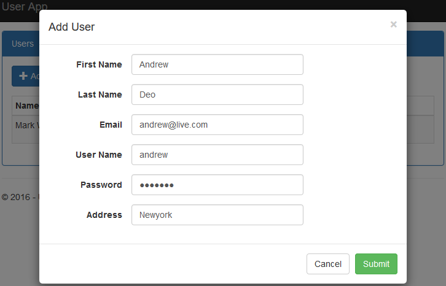
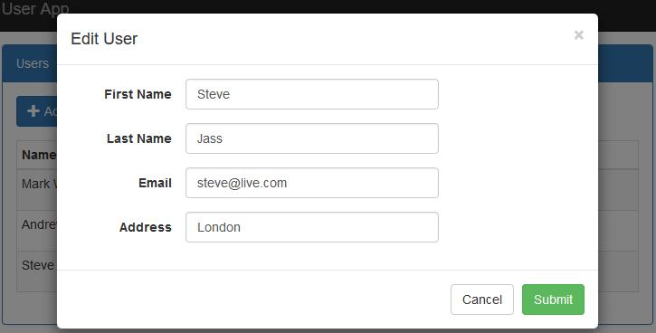

# Onion Architecture In ASP.NET Core MVC
## Requires
- Visual Studio 2015
## License
- MIT
## Technologies
- ASP.NET
- ASP.NET Core MVC
- ASP.NET Core 1.1
- Entity Framework Core 1.1
## Topics
- ASP.NET
- Entity Framework Code First
- Generic Repository
- Onion Architecture
## Updated
- 01/27/2017
## Description

<h1>Introduction</h1>

A Visual Studio 2015 project which shows how to perform the create, read, update and delete operations in the ASP.NET Core MVC application using onion architecture with Entity Framework Core Code First approach.

The code illustrates the following topics:

<ol>
<li>Listings, create, update and delete operations. </li><li>One to one relationship in Entity Framework Core. </li><li>Create, Update and Delete operations perform in bootstrap modal pop up with tag helpers.
</li><li>Database design using entity framework core code first approach with fluent API.
</li><li>Entity classes and repository in separate class library project and use migration to create database from it.
</li><li>Dependency injection for DbContext, Repository and service. </li></ol>

<strong>Article:</strong> <a title="Onion Architecture In ASP.NET Core MVC" href="https://social.technet.microsoft.com/wiki/contents/articles/36655.onion-architecture-in-asp-net-core-mvc.aspx" target="_blank">
Onion Architecture In ASP.NET Core MVC</a>

<h1>Getting Started</h1>

To build and run this sample as-is, you must have Visual Studio 2015 installed. In most cases you can run the application by following these steps:

<ol>
<li>Download and extract the .zip file. </li><li>Open the solution file in Visual Studio. </li><li>Change connection string in the appsettings.json file of the web project. </li><li>Choose OA.Repo project in package manager console and run the following command for migration and create database.
<ul>
<li>Tools &ndash;&gt; NuGet Package Manager &ndash;&gt; Package Manager Console </li><li>PM&gt; Add-Migration MyFirstMigration </li><li>PM&gt; Update-Database </li></ul>
</li><li>Run the application. </li></ol>
<h1>Running the Sample</h1>

To run the sample, hit F5 or choose the Debug | Start Debugging menu command. You will see the user list screen. From this screen you have user listing screen as shown in below figure.

Figure 1: User listing

Now click on &ldquo;Add User&rdquo; button to add new user in the application as per following screen.

Figure 2: Add User

As per figure 1, Edit button uses to edit individual user as per following figure.

Figure 3: Edit User

As per figure 1, Delete button uses to delete individual user as per following figure.

Figure 4: Delete User

<h1>Source Code Overview</h1>

Most of folders play same role as in MVC application but there are following more folder and files.

<ol>
<li>wwwroot: It holds static js and css files. </li><li>OA.Data: It&rsquo;s separate class library project. It holds Entities and table configuration classes which create database.
</li><li>OA.Repo: It&rsquo;s a class libraray project which holds DataContext and Repository.
</li><li>OA.Service: It&rsquo;s a class libraray project which holds service interface which communicates to UI.
</li><li>appsettings.json:It holds database connection string. </li><li>Migrations: It holds database migration files. </li></ol>
