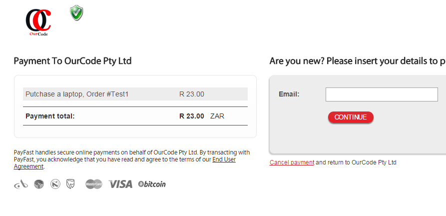
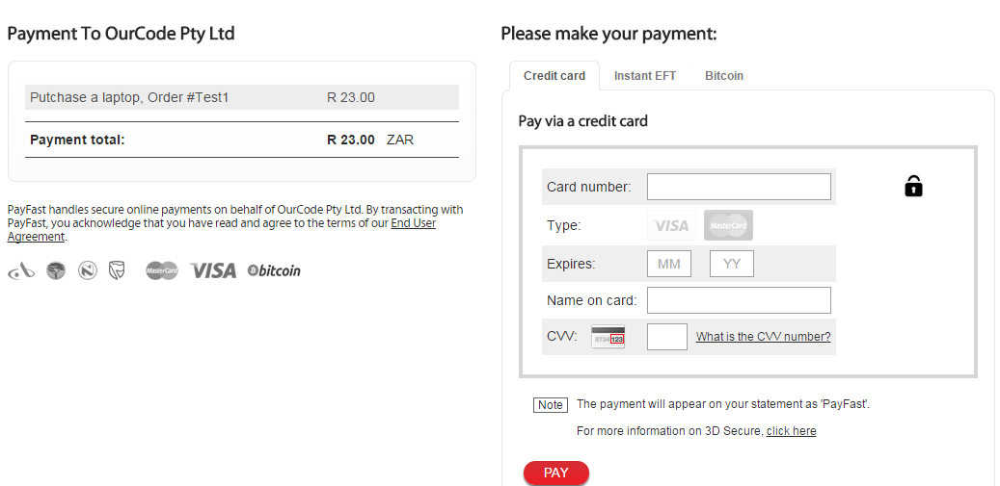

# Online Payment using credit card
## Requires
- Visual Studio 2012
## License
- MIT
## Technologies
- Visual Studio 2010
- Visual Studio 2012
- Visual Studio 2013
## Topics
- online payment using credit card
## Updated
- 03/07/2015
## Description

<h1>Introduction</h1>

<em>Online payment using credit card, nowardays people are changing the way they buy the products online</em>

<h1>Building the Sample</h1>

<em>You need Microsoft Visual Studio from 2010 to upwards, you can open it as a project or as a website</em>

Description

First you are going to pay the product that cost R23.00, then click pay. You can choose wheather you want to let the user to manually type the amouth they should pay or you want to hard code the price of the product from the back code

&nbsp;

This sample does not show the actual product, you can assume that the product cost how much as it is a sample i hope you will understand and add your product on your actual project.

Thsi project it does not again shows the add to cart funtionality, its forcuss is on processing the payment.

&nbsp;

It then require you to type your email address to continue. After the user/client type the email it then verify if the email is correct because we do not want to use wrong information

&nbsp;

<ul>
</ul>

<em>Once you done putting your cridentials you can click pan to finalise your payment.</em>

<em>This project show how you process online payment using credit card, its very easy as you will see when you open the project. 
This project is done using Visual Studio 2013 in asp.net&nbsp;Language: c# and it can be compatable with visual studio 2010 to upwards&nbsp;</em>

