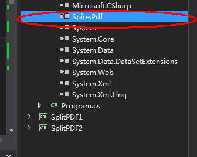
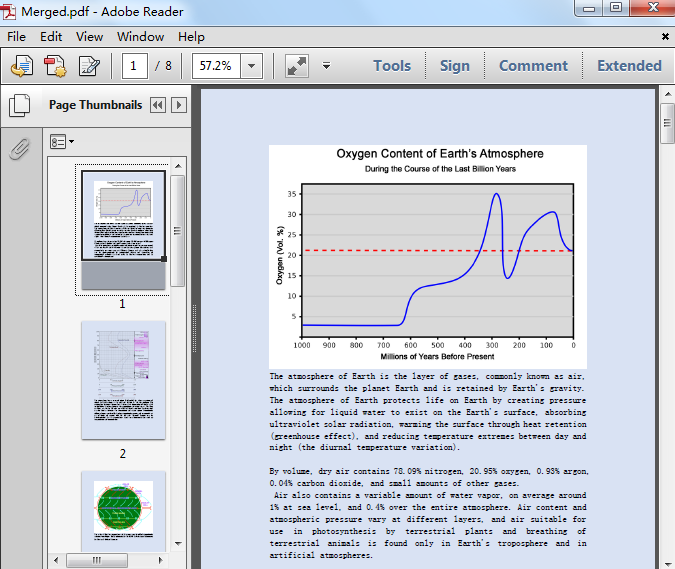
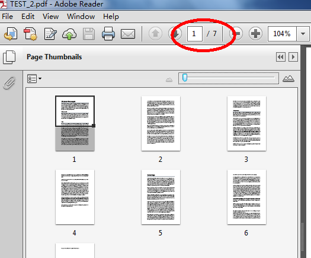

# Operate PDF files in C#—How to merge and split PDF files
## Requires
- Visual Studio 2013
## License
- MS-LPL
## Technologies
- C#
- ASP.NET
- .NET Framework
- C# Language
- PDF
- .NET PDF API
## Topics
- Controls
- C#
- ASP.NET
- Class Library
- How to
- Language Samples
- PDF API
- Merge PDF
- split pdf
## Updated
- 03/01/2018
## Description

<h1>Introduction</h1>

In this sample, we will see how to merge multiple PDF files and split PDF file into multiple ones using&nbsp;<a href="https://www.e-iceblue.com/Introduce/free-pdf-component.html"><strong><em>Free Spire.PDF for .NET</em></strong></a> in C#.

Here we will see how to:

<ul>
<li>&nbsp;Merge multiple PDF files into a new one </li><li>&nbsp;Split one PDF file into multiple ones (by every page/by specifying page range)
</li></ul>
<h1>Building the Sample</h1>

<strong>Prerequisite </strong>

<a href="https://www.e-iceblue.com/Download/download-pdf-for-net-free.html"><strong>Download</strong></a> and install Free Spire.PDF for .NET firstly and don&rsquo;t forget to reference the
<strong><em>Spire.PDF.dll</em></strong> into your Visual Studio project.

<strong>1.&nbsp;</strong><strong>Merge PDF files into a new one</strong>

<strong><em>Before</em></strong>

<strong><em> 
</em></strong>

<strong><em>After</em></strong>

<strong>2.&nbsp; </strong><strong>Split one PDF file into multiple ones</strong>

<strong><em>&nbsp; &nbsp; 2.1 split by every page</em></strong>

<em><strong>Before</strong></em>

<em><strong>After</strong></em>

<strong><em>2.2 split by specifying page range</em></strong>

&nbsp;

Visit here for more samples about MERGE.

<ul>
<li>&nbsp;<a href="https://code.msdn.microsoft.com/Merge-Selected-Pages-from-a3a48538">Merge selected PDF pages</a>
</li><li>&nbsp;<a href="https://code.msdn.microsoft.com/Merge-Different-File-Types-3a171f5a#content">Merge different file formats into one PDF</a>
</li></ul>

&nbsp;

<strong>More information </strong>

<strong>About Free Spire.PDF for .NET:</strong>

Free Spire.PDF for .NET is a Community Edition of the Spire.PDF for .NET, which is a totally free PDF component for commercial and personal use. As a standalone C#/VB.NET component, Free Spire.PDF for .NET enables developers to create, write, edit,<a href="https://www.e-iceblue.com/Tutorials/Spire.PDF/Spire.PDF-Program-Guide/Convert-HTML-to-PDF-Customize-HTML-to-PDF-Conversion-by-Yourself.html">
 convert</a>, print, handle and <a href="https://www.e-iceblue.com/Tutorials/Spire.PDF/Spire.PDF-Program-Guide/Read-PDF-Read-PDF-Images-and-Text-in-C-VB.NET.html">
read PDF files</a> on any .NET applications.

&nbsp;

Using this free .NET PDF library, you can implement rich capabilities to create PDF files from scratch or process existing PDF documents. Many
<strong><em>rich features can be supported</em></strong>, such as <a href="https://www.e-iceblue.com/Tutorials/Spire.PDF/Spire.PDF-Program-Guide/Protect-PDF-%E2%80%93-Encrypt-PDF-Document-with-C-VB.NET.html">
security setting</a>, PDF <a href="https://www.e-iceblue.com/Tutorials/Spire.PDF/Spire.PDF-Program-Guide/How-to-Extract-Text-from-PDF-Document-with-C-/VB.NET.html">
text</a>/ <a href="https://www.e-iceblue.com/Tutorials/Spire.PDF/Spire.PDF-Program-Guide/How-to-Extract-Image-From-PDF-in-C.html">
image extracting</a>, <a href="https://www.e-iceblue.com/Tutorials/Spire.PDF/Spire.PDF-Program-Guide/Merge-Multiple-PDF-Files-into-One-for-WPF.html">
PDF merge</a>/<a href="https://www.e-iceblue.com/Tutorials/Spire.PDF/Spire.PDF-Program-Guide/NET-Split-PDF-Simply-Split-PDF-Document-to-Multiple-Files-with-C-VB.NET.html">split</a>, metadata update, section and paragraph optimizing, graph/image drawing and
 inserting, <a href="https://www.e-iceblue.com/Tutorials/Spire.PDF/Spire.PDF-Program-Guide/How-to-Generate-PDF-Table-in-C-/VB.NET.html">
table creation</a> and processing, <a href="https://www.e-iceblue.com/Tutorials/Spire.PDF/Spire.PDF-Program-Guide/Document-Operation/How-to-print-PDF-files-in-C.html">
PDF printing</a> and importing data etc.

&nbsp;

<strong>Useful links</strong>

Website: <a href="https://www.e-iceblue.com/">https://www.e-iceblue.com/</a>

Contacts: <a href="https://www.e-iceblue.com/Misc/maillist.html">https://www.e-iceblue.com/Misc/maillist.html</a>

