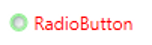

# Overriding SystemColors in WPF
## Requires
- Visual Studio 2010
## License
- Apache License, Version 2.0
## Technologies
- WPF
- XAML
## Topics
- Controls
- Resources
- XAML Control Templates
- WPF Styling
- Styling WPF Controls
- WPF Control Templating
- SystemColor
## Updated
- 09/19/2012
## Description

<h1>Introduction</h1>

This sample shows how much of&nbsp;the WPF controls can be&nbsp;changed by simply fiddling with the SystemColors resource keys.

&nbsp;

&nbsp;

<h1>Building the Sample</h1>

Just download, unzip, open and run!

&nbsp;

Description

WPF comes with a very nicely buffed set of controls. If you want to completely change the colours, you can simply use another Theme. However, sometimes you just want to change one control, change the selected colour, or change a colour that is not simply
 referenced by a regular property like Background.

All WPF controls use ControlTemplates, and in those templates they refer to a number of sources for colours. One of those sources is the SystemColors namespace.

WPF references the colours in this namespace by Keys (just like normal resources) which also means when you change SystemColors (through Control Panel) the colours in your application will change too.

This also means we can override these colours, and change the look of unreachable componants, without having to change the ControlTemplate. Changing SystemColors can of course affect other controls, so if you only want the change to be on one control, you
 must declare the resources closer to where they are to be used, so nothing else is affected.

Below is an example of one of the sections, showing a RadioButton. All the colours that can be changed have been, leaving only the BulletChrome&nbsp;showing.

XAML

Edit|Remove

xaml
<pre class="hidden">	        &lt;GroupBox Header=&quot;RadioButton&quot;&gt;
	            &lt;GroupBox.Resources&gt;
	                &lt;SolidColorBrush x:Key=&quot;{x:Static SystemColors.ControlTextBrushKey}&quot; Color=&quot;Red&quot; /&gt; &lt;!-- or Foreground property --&gt;
	                &lt;SolidColorBrush x:Key=&quot;{x:Static SystemColors.GrayTextBrushKey}&quot; Color=&quot;LightBlue&quot; /&gt; &lt;!-- Disabled color --&gt;
	            	&lt;!-- Uses Microsoft_Windows_Themes:BulletChrome --&gt;
				&lt;/GroupBox.Resources&gt;
	            &lt;RadioButton Content=&quot;RadioButton&quot; Margin=&quot;10&quot; Style=&quot;{DynamicResource RadioButtonStyle1}&quot; Background=&quot;LightGreen&quot; BorderBrush=&quot;LightGreen&quot;/&gt;
	        &lt;/GroupBox&gt;</pre>

<pre class="csharp">&nbsp;&nbsp;&nbsp;&nbsp;&nbsp;&nbsp;&nbsp;&nbsp;&nbsp;&nbsp;&nbsp;&nbsp;&lt;GroupBox&nbsp;Header=&quot;RadioButton&quot;&gt;&nbsp;
&nbsp;&nbsp;&nbsp;&nbsp;&nbsp;&nbsp;&nbsp;&nbsp;&nbsp;&nbsp;&nbsp;&nbsp;&nbsp;&nbsp;&nbsp;&nbsp;&lt;GroupBox.Resources&gt;&nbsp;
&nbsp;&nbsp;&nbsp;&nbsp;&nbsp;&nbsp;&nbsp;&nbsp;&nbsp;&nbsp;&nbsp;&nbsp;&nbsp;&nbsp;&nbsp;&nbsp;&nbsp;&nbsp;&nbsp;&nbsp;&lt;SolidColorBrush&nbsp;x:Key=&quot;{x:Static&nbsp;SystemColors.ControlTextBrushKey}&quot;&nbsp;Color=&quot;Red&quot;&nbsp;/&gt;&nbsp;&lt;!--&nbsp;or&nbsp;Foreground&nbsp;property&nbsp;--&gt;&nbsp;
&nbsp;&nbsp;&nbsp;&nbsp;&nbsp;&nbsp;&nbsp;&nbsp;&nbsp;&nbsp;&nbsp;&nbsp;&nbsp;&nbsp;&nbsp;&nbsp;&nbsp;&nbsp;&nbsp;&nbsp;&lt;SolidColorBrush&nbsp;x:Key=&quot;{x:Static&nbsp;SystemColors.GrayTextBrushKey}&quot;&nbsp;Color=&quot;LightBlue&quot;&nbsp;/&gt;&nbsp;&lt;!--&nbsp;Disabled&nbsp;color&nbsp;--&gt;&nbsp;
&nbsp;&nbsp;&nbsp;&nbsp;&nbsp;&nbsp;&nbsp;&nbsp;&nbsp;&nbsp;&nbsp;&nbsp;&nbsp;&nbsp;&nbsp;&nbsp;&nbsp;&nbsp;&nbsp;&nbsp;&lt;!--&nbsp;Uses&nbsp;Microsoft_Windows_Themes:BulletChrome&nbsp;--&gt;&nbsp;
&nbsp;&nbsp;&nbsp;&nbsp;&nbsp;&nbsp;&nbsp;&nbsp;&nbsp;&nbsp;&nbsp;&nbsp;&nbsp;&nbsp;&nbsp;&nbsp;&lt;/GroupBox.Resources&gt;&nbsp;
&nbsp;&nbsp;&nbsp;&nbsp;&nbsp;&nbsp;&nbsp;&nbsp;&nbsp;&nbsp;&nbsp;&nbsp;&nbsp;&nbsp;&nbsp;&nbsp;&lt;RadioButton&nbsp;Content=&quot;RadioButton&quot;&nbsp;Margin=&quot;10&quot;&nbsp;Style=&quot;{DynamicResource&nbsp;RadioButtonStyle1}&quot;&nbsp;Background=&quot;LightGreen&quot;&nbsp;BorderBrush=&quot;LightGreen&quot;/&gt;&nbsp;
&nbsp;&nbsp;&nbsp;&nbsp;&nbsp;&nbsp;&nbsp;&nbsp;&nbsp;&nbsp;&nbsp;&nbsp;&lt;/GroupBox&gt;</pre>

&nbsp;

&nbsp;

<strong>This sample project also includes ALL the default templates for ALL these controls, as generated out of Expression Blend</strong>

&nbsp;

Just so I could check for other SystemColors being used, I copied all of the default templates into the project. There are a few others used, but are not sigmnificant in this study. If you find a part of a control you cannot change with resource overrrides,
 you will have to edit the ControlTemplate.&nbsp;Please see the App.xaml file for all the&nbsp;ControlTemplates.&nbsp;

&nbsp;

<h1>Source Code Files</h1>
<ul>
<li>MainWindow.xaml.cs - all the controls and resource overrides </li><li>App.xaml - All the control templates </li></ul>

&nbsp;

&nbsp;

