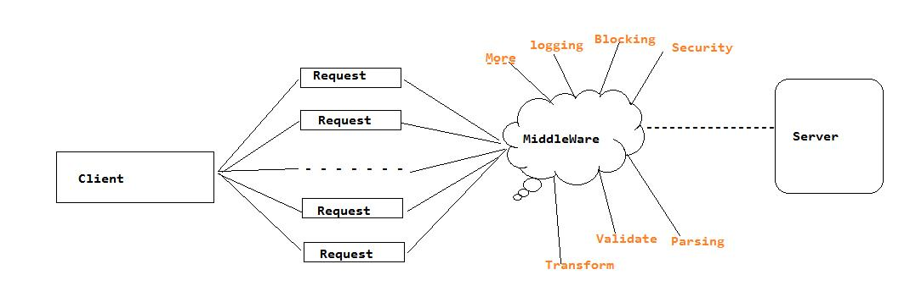

# Owin as Middleware using c#.net
## Requires
- Visual Studio 2013
## License
- MIT
## Technologies
- C#
## Topics
- Architecture and Design
## Updated
- 02/17/2016
## Description

<h1>Introduction</h1>

<em>This sample shows how to develop middleware using OWIN and how to develop sample API with this middleware.</em>

<h1>Building the Sample</h1>

<em>To build this sample we need only owin packages. you get owin packages from nuget or install it from your visual studio package manager console&nbsp;</em>

<em>PM&gt; Install-Package Owin</em>

Description

Middleware is computer software that provides services to software applications beyond those available from the operating system. It can be described as &quot;software glue&quot;. Middleware makes it easier for software developers to perform communication and input/output,
 so they can focus on the specific purpose of their application.

Middleware is the software that connects software components or enterprise applications. Middleware is the software layer that lies between the operating system and the applications on each side of a distributed computer network.

Typically, it supports complex, distributed business software applications.

Middleware includes Web servers, application servers, content management systems, and similar tools that support application development and delivery. It is especially integral to information technologies

&nbsp;

<em>&nbsp;&nbsp;</em>

&nbsp;

Typically middle ware plays a vital role in the request and response designing. &nbsp;Middleware can able to modified your request and send it to the server. So in this article we will try to develop sample middleware and check how to Post, Get values.

&nbsp;

&nbsp;

C#

Edit|Remove

csharp
<pre class="hidden">public class Middleware&lt;TModelType&gt; : OwinMiddleware where TModelType : class,new()
    {
        public Middleware(OwinMiddleware next)
            : base(next)
        {

        }

        public override Task Invoke(IOwinContext context)
        {

            return this.Next.Invoke(context);

        }
    }
</pre>

<pre class="csharp">public&nbsp;class&nbsp;Middleware&lt;TModelType&gt;&nbsp;:&nbsp;OwinMiddleware&nbsp;where&nbsp;TModelType&nbsp;:&nbsp;class,new()&nbsp;
&nbsp;&nbsp;&nbsp;&nbsp;{&nbsp;
&nbsp;&nbsp;&nbsp;&nbsp;&nbsp;&nbsp;&nbsp;&nbsp;public&nbsp;Middleware(OwinMiddleware&nbsp;next)&nbsp;
&nbsp;&nbsp;&nbsp;&nbsp;&nbsp;&nbsp;&nbsp;&nbsp;&nbsp;&nbsp;&nbsp;&nbsp;:&nbsp;base(next)&nbsp;
&nbsp;&nbsp;&nbsp;&nbsp;&nbsp;&nbsp;&nbsp;&nbsp;{&nbsp;
&nbsp;
&nbsp;&nbsp;&nbsp;&nbsp;&nbsp;&nbsp;&nbsp;&nbsp;}&nbsp;
&nbsp;
&nbsp;&nbsp;&nbsp;&nbsp;&nbsp;&nbsp;&nbsp;&nbsp;public&nbsp;override&nbsp;Task&nbsp;Invoke(IOwinContext&nbsp;context)&nbsp;
&nbsp;&nbsp;&nbsp;&nbsp;&nbsp;&nbsp;&nbsp;&nbsp;{&nbsp;
&nbsp;
&nbsp;&nbsp;&nbsp;&nbsp;&nbsp;&nbsp;&nbsp;&nbsp;&nbsp;&nbsp;&nbsp;&nbsp;return&nbsp;this.Next.Invoke(context);&nbsp;
&nbsp;
&nbsp;&nbsp;&nbsp;&nbsp;&nbsp;&nbsp;&nbsp;&nbsp;}&nbsp;
&nbsp;&nbsp;&nbsp;&nbsp;}&nbsp;
</pre>

&nbsp;

&nbsp;

The following snippet use to builder connection

&nbsp;

&nbsp;

C#

Edit|Remove

csharp
<pre class="hidden">  public void Configuration(IAppBuilder builder)
        {

            builder.Use&lt;Middleware&lt;RequestHandler&gt;&gt;();

            // It act as Controller

            builder.Map(&quot;/Step1&quot;, config =&gt;
            {

                config.Use((context, next) =&gt; context.Response.WriteAsync(&quot;Hey from Step1 controller &quot;));

            });
}
</pre>

<pre class="csharp">&nbsp;&nbsp;public&nbsp;void&nbsp;Configuration(IAppBuilder&nbsp;builder)&nbsp;
&nbsp;&nbsp;&nbsp;&nbsp;&nbsp;&nbsp;&nbsp;&nbsp;{&nbsp;
&nbsp;
&nbsp;&nbsp;&nbsp;&nbsp;&nbsp;&nbsp;&nbsp;&nbsp;&nbsp;&nbsp;&nbsp;&nbsp;builder.Use&lt;Middleware&lt;RequestHandler&gt;&gt;();&nbsp;
&nbsp;
&nbsp;&nbsp;&nbsp;&nbsp;&nbsp;&nbsp;&nbsp;&nbsp;&nbsp;&nbsp;&nbsp;&nbsp;//&nbsp;It&nbsp;act&nbsp;as&nbsp;Controller&nbsp;
&nbsp;
&nbsp;&nbsp;&nbsp;&nbsp;&nbsp;&nbsp;&nbsp;&nbsp;&nbsp;&nbsp;&nbsp;&nbsp;builder.Map(&quot;/Step1&quot;,&nbsp;config&nbsp;=&gt;&nbsp;
&nbsp;&nbsp;&nbsp;&nbsp;&nbsp;&nbsp;&nbsp;&nbsp;&nbsp;&nbsp;&nbsp;&nbsp;{&nbsp;
&nbsp;
&nbsp;&nbsp;&nbsp;&nbsp;&nbsp;&nbsp;&nbsp;&nbsp;&nbsp;&nbsp;&nbsp;&nbsp;&nbsp;&nbsp;&nbsp;&nbsp;config.Use((context,&nbsp;next)&nbsp;=&gt;&nbsp;context.Response.WriteAsync(&quot;Hey&nbsp;from&nbsp;Step1&nbsp;controller&nbsp;&quot;));&nbsp;
&nbsp;
&nbsp;&nbsp;&nbsp;&nbsp;&nbsp;&nbsp;&nbsp;&nbsp;&nbsp;&nbsp;&nbsp;&nbsp;});&nbsp;
}&nbsp;
</pre>

&nbsp;

&nbsp;

Middleware Request to get querystring values

&nbsp;

&nbsp;

C#

Edit|Remove

csharp
<pre class="hidden">using (var sr = new System.IO.StreamReader(context.Request.Body))
            {
                var form = new TModelType();
                var body = sr.ReadToEnd();

                // Receiving the values from querystring

                if (string.IsNullOrEmpty(body) == true)
                {
                    #region
                    body = context.Request.QueryString.ToString();
                    var formData = body.Split(new[] { '&amp;' }).Select(x =&gt; x.Split(new[] { '=' })).ToDictionary(x =&gt; x[0], x =&gt; x[1]);
                    var properties = typeof(TModelType).GetProperties(BindingFlags.Public | BindingFlags.Instance);
                    foreach (var property in properties)
                    {
                        if (formData.Count &gt; 0)
                        {
                            if (formData.ContainsKey(property.Name))
                            {
                                property.SetValue(form, Convert.ChangeType(formData[property.Name], property.PropertyType));
                            }
                        }
                    }
                    #endregion
                }</pre>

<pre class="csharp">using&nbsp;(var&nbsp;sr&nbsp;=&nbsp;new&nbsp;System.IO.StreamReader(context.Request.Body))&nbsp;
&nbsp;&nbsp;&nbsp;&nbsp;&nbsp;&nbsp;&nbsp;&nbsp;&nbsp;&nbsp;&nbsp;&nbsp;{&nbsp;
&nbsp;&nbsp;&nbsp;&nbsp;&nbsp;&nbsp;&nbsp;&nbsp;&nbsp;&nbsp;&nbsp;&nbsp;&nbsp;&nbsp;&nbsp;&nbsp;var&nbsp;form&nbsp;=&nbsp;new&nbsp;TModelType();&nbsp;
&nbsp;&nbsp;&nbsp;&nbsp;&nbsp;&nbsp;&nbsp;&nbsp;&nbsp;&nbsp;&nbsp;&nbsp;&nbsp;&nbsp;&nbsp;&nbsp;var&nbsp;body&nbsp;=&nbsp;sr.ReadToEnd();&nbsp;
&nbsp;
&nbsp;&nbsp;&nbsp;&nbsp;&nbsp;&nbsp;&nbsp;&nbsp;&nbsp;&nbsp;&nbsp;&nbsp;&nbsp;&nbsp;&nbsp;&nbsp;//&nbsp;Receiving&nbsp;the&nbsp;values&nbsp;from&nbsp;querystring&nbsp;
&nbsp;
&nbsp;&nbsp;&nbsp;&nbsp;&nbsp;&nbsp;&nbsp;&nbsp;&nbsp;&nbsp;&nbsp;&nbsp;&nbsp;&nbsp;&nbsp;&nbsp;if&nbsp;(string.IsNullOrEmpty(body)&nbsp;==&nbsp;true)&nbsp;
&nbsp;&nbsp;&nbsp;&nbsp;&nbsp;&nbsp;&nbsp;&nbsp;&nbsp;&nbsp;&nbsp;&nbsp;&nbsp;&nbsp;&nbsp;&nbsp;{&nbsp;
&nbsp;&nbsp;&nbsp;&nbsp;&nbsp;&nbsp;&nbsp;&nbsp;&nbsp;&nbsp;&nbsp;&nbsp;&nbsp;&nbsp;&nbsp;&nbsp;&nbsp;&nbsp;&nbsp;&nbsp;#region&nbsp;
&nbsp;&nbsp;&nbsp;&nbsp;&nbsp;&nbsp;&nbsp;&nbsp;&nbsp;&nbsp;&nbsp;&nbsp;&nbsp;&nbsp;&nbsp;&nbsp;&nbsp;&nbsp;&nbsp;&nbsp;body&nbsp;=&nbsp;context.Request.QueryString.ToString();&nbsp;
&nbsp;&nbsp;&nbsp;&nbsp;&nbsp;&nbsp;&nbsp;&nbsp;&nbsp;&nbsp;&nbsp;&nbsp;&nbsp;&nbsp;&nbsp;&nbsp;&nbsp;&nbsp;&nbsp;&nbsp;var&nbsp;formData&nbsp;=&nbsp;body.Split(new[]&nbsp;{&nbsp;'&amp;'&nbsp;}).Select(x&nbsp;=&gt;&nbsp;x.Split(new[]&nbsp;{&nbsp;'='&nbsp;})).ToDictionary(x&nbsp;=&gt;&nbsp;x[0],&nbsp;x&nbsp;=&gt;&nbsp;x[1]);&nbsp;
&nbsp;&nbsp;&nbsp;&nbsp;&nbsp;&nbsp;&nbsp;&nbsp;&nbsp;&nbsp;&nbsp;&nbsp;&nbsp;&nbsp;&nbsp;&nbsp;&nbsp;&nbsp;&nbsp;&nbsp;var&nbsp;properties&nbsp;=&nbsp;typeof(TModelType).GetProperties(BindingFlags.Public&nbsp;|&nbsp;BindingFlags.Instance);&nbsp;
&nbsp;&nbsp;&nbsp;&nbsp;&nbsp;&nbsp;&nbsp;&nbsp;&nbsp;&nbsp;&nbsp;&nbsp;&nbsp;&nbsp;&nbsp;&nbsp;&nbsp;&nbsp;&nbsp;&nbsp;foreach&nbsp;(var&nbsp;property&nbsp;in&nbsp;properties)&nbsp;
&nbsp;&nbsp;&nbsp;&nbsp;&nbsp;&nbsp;&nbsp;&nbsp;&nbsp;&nbsp;&nbsp;&nbsp;&nbsp;&nbsp;&nbsp;&nbsp;&nbsp;&nbsp;&nbsp;&nbsp;{&nbsp;
&nbsp;&nbsp;&nbsp;&nbsp;&nbsp;&nbsp;&nbsp;&nbsp;&nbsp;&nbsp;&nbsp;&nbsp;&nbsp;&nbsp;&nbsp;&nbsp;&nbsp;&nbsp;&nbsp;&nbsp;&nbsp;&nbsp;&nbsp;&nbsp;if&nbsp;(formData.Count&nbsp;&gt;&nbsp;0)&nbsp;
&nbsp;&nbsp;&nbsp;&nbsp;&nbsp;&nbsp;&nbsp;&nbsp;&nbsp;&nbsp;&nbsp;&nbsp;&nbsp;&nbsp;&nbsp;&nbsp;&nbsp;&nbsp;&nbsp;&nbsp;&nbsp;&nbsp;&nbsp;&nbsp;{&nbsp;
&nbsp;&nbsp;&nbsp;&nbsp;&nbsp;&nbsp;&nbsp;&nbsp;&nbsp;&nbsp;&nbsp;&nbsp;&nbsp;&nbsp;&nbsp;&nbsp;&nbsp;&nbsp;&nbsp;&nbsp;&nbsp;&nbsp;&nbsp;&nbsp;&nbsp;&nbsp;&nbsp;&nbsp;if&nbsp;(formData.ContainsKey(property.Name))&nbsp;
&nbsp;&nbsp;&nbsp;&nbsp;&nbsp;&nbsp;&nbsp;&nbsp;&nbsp;&nbsp;&nbsp;&nbsp;&nbsp;&nbsp;&nbsp;&nbsp;&nbsp;&nbsp;&nbsp;&nbsp;&nbsp;&nbsp;&nbsp;&nbsp;&nbsp;&nbsp;&nbsp;&nbsp;{&nbsp;
&nbsp;&nbsp;&nbsp;&nbsp;&nbsp;&nbsp;&nbsp;&nbsp;&nbsp;&nbsp;&nbsp;&nbsp;&nbsp;&nbsp;&nbsp;&nbsp;&nbsp;&nbsp;&nbsp;&nbsp;&nbsp;&nbsp;&nbsp;&nbsp;&nbsp;&nbsp;&nbsp;&nbsp;&nbsp;&nbsp;&nbsp;&nbsp;property.SetValue(form,&nbsp;Convert.ChangeType(formData[property.Name],&nbsp;property.PropertyType));&nbsp;
&nbsp;&nbsp;&nbsp;&nbsp;&nbsp;&nbsp;&nbsp;&nbsp;&nbsp;&nbsp;&nbsp;&nbsp;&nbsp;&nbsp;&nbsp;&nbsp;&nbsp;&nbsp;&nbsp;&nbsp;&nbsp;&nbsp;&nbsp;&nbsp;&nbsp;&nbsp;&nbsp;&nbsp;}&nbsp;
&nbsp;&nbsp;&nbsp;&nbsp;&nbsp;&nbsp;&nbsp;&nbsp;&nbsp;&nbsp;&nbsp;&nbsp;&nbsp;&nbsp;&nbsp;&nbsp;&nbsp;&nbsp;&nbsp;&nbsp;&nbsp;&nbsp;&nbsp;&nbsp;}&nbsp;
&nbsp;&nbsp;&nbsp;&nbsp;&nbsp;&nbsp;&nbsp;&nbsp;&nbsp;&nbsp;&nbsp;&nbsp;&nbsp;&nbsp;&nbsp;&nbsp;&nbsp;&nbsp;&nbsp;&nbsp;}&nbsp;
&nbsp;&nbsp;&nbsp;&nbsp;&nbsp;&nbsp;&nbsp;&nbsp;&nbsp;&nbsp;&nbsp;&nbsp;&nbsp;&nbsp;&nbsp;&nbsp;&nbsp;&nbsp;&nbsp;&nbsp;#endregion&nbsp;
&nbsp;&nbsp;&nbsp;&nbsp;&nbsp;&nbsp;&nbsp;&nbsp;&nbsp;&nbsp;&nbsp;&nbsp;&nbsp;&nbsp;&nbsp;&nbsp;}</pre>

&nbsp;

Middleware Request to get form body values

&nbsp;

&nbsp;

C#

Edit|Remove

csharp
<pre class="hidden">if (string.IsNullOrEmpty(body) != true)
                {
                    
                    
                    

                }

                context.Set(&quot;Body&quot;, form);.

// -------------

 builder.Use((context, next) =&gt;
            {
                if (context.Request.Method == &quot;POST&quot;)
                {
                    var form = context.Get&lt;RequestHandler&gt;(&quot;Body&quot;);
                    // return context.Response.WriteAsync(&quot;Post Received :&quot; &#43; form.value);
                    return context.Response.WriteAsync(&quot;Post Received :&quot;);
                }
                return next();
            });</pre>

<pre class="csharp">if&nbsp;(string.IsNullOrEmpty(body)&nbsp;!=&nbsp;true)&nbsp;
&nbsp;&nbsp;&nbsp;&nbsp;&nbsp;&nbsp;&nbsp;&nbsp;&nbsp;&nbsp;&nbsp;&nbsp;&nbsp;&nbsp;&nbsp;&nbsp;{&nbsp;
&nbsp;&nbsp;&nbsp;&nbsp;&nbsp;&nbsp;&nbsp;&nbsp;&nbsp;&nbsp;&nbsp;&nbsp;&nbsp;&nbsp;&nbsp;&nbsp;&nbsp;&nbsp;&nbsp;&nbsp;&nbsp;
&nbsp;&nbsp;&nbsp;&nbsp;&nbsp;&nbsp;&nbsp;&nbsp;&nbsp;&nbsp;&nbsp;&nbsp;&nbsp;&nbsp;&nbsp;&nbsp;&nbsp;&nbsp;&nbsp;&nbsp;&nbsp;
&nbsp;&nbsp;&nbsp;&nbsp;&nbsp;&nbsp;&nbsp;&nbsp;&nbsp;&nbsp;&nbsp;&nbsp;&nbsp;&nbsp;&nbsp;&nbsp;&nbsp;&nbsp;&nbsp;&nbsp;&nbsp;
&nbsp;
&nbsp;&nbsp;&nbsp;&nbsp;&nbsp;&nbsp;&nbsp;&nbsp;&nbsp;&nbsp;&nbsp;&nbsp;&nbsp;&nbsp;&nbsp;&nbsp;}&nbsp;
&nbsp;
&nbsp;&nbsp;&nbsp;&nbsp;&nbsp;&nbsp;&nbsp;&nbsp;&nbsp;&nbsp;&nbsp;&nbsp;&nbsp;&nbsp;&nbsp;&nbsp;context.Set(&quot;Body&quot;,&nbsp;form);.&nbsp;
&nbsp;
//&nbsp;-------------&nbsp;
&nbsp;
&nbsp;builder.Use((context,&nbsp;next)&nbsp;=&gt;&nbsp;
&nbsp;&nbsp;&nbsp;&nbsp;&nbsp;&nbsp;&nbsp;&nbsp;&nbsp;&nbsp;&nbsp;&nbsp;{&nbsp;
&nbsp;&nbsp;&nbsp;&nbsp;&nbsp;&nbsp;&nbsp;&nbsp;&nbsp;&nbsp;&nbsp;&nbsp;&nbsp;&nbsp;&nbsp;&nbsp;if&nbsp;(context.Request.Method&nbsp;==&nbsp;&quot;POST&quot;)&nbsp;
&nbsp;&nbsp;&nbsp;&nbsp;&nbsp;&nbsp;&nbsp;&nbsp;&nbsp;&nbsp;&nbsp;&nbsp;&nbsp;&nbsp;&nbsp;&nbsp;{&nbsp;
&nbsp;&nbsp;&nbsp;&nbsp;&nbsp;&nbsp;&nbsp;&nbsp;&nbsp;&nbsp;&nbsp;&nbsp;&nbsp;&nbsp;&nbsp;&nbsp;&nbsp;&nbsp;&nbsp;&nbsp;var&nbsp;form&nbsp;=&nbsp;context.Get&lt;RequestHandler&gt;(&quot;Body&quot;);&nbsp;
&nbsp;&nbsp;&nbsp;&nbsp;&nbsp;&nbsp;&nbsp;&nbsp;&nbsp;&nbsp;&nbsp;&nbsp;&nbsp;&nbsp;&nbsp;&nbsp;&nbsp;&nbsp;&nbsp;&nbsp;//&nbsp;return&nbsp;context.Response.WriteAsync(&quot;Post&nbsp;Received&nbsp;:&quot;&nbsp;&#43;&nbsp;form.value);&nbsp;
&nbsp;&nbsp;&nbsp;&nbsp;&nbsp;&nbsp;&nbsp;&nbsp;&nbsp;&nbsp;&nbsp;&nbsp;&nbsp;&nbsp;&nbsp;&nbsp;&nbsp;&nbsp;&nbsp;&nbsp;return&nbsp;context.Response.WriteAsync(&quot;Post&nbsp;Received&nbsp;:&quot;);&nbsp;
&nbsp;&nbsp;&nbsp;&nbsp;&nbsp;&nbsp;&nbsp;&nbsp;&nbsp;&nbsp;&nbsp;&nbsp;&nbsp;&nbsp;&nbsp;&nbsp;}&nbsp;
&nbsp;&nbsp;&nbsp;&nbsp;&nbsp;&nbsp;&nbsp;&nbsp;&nbsp;&nbsp;&nbsp;&nbsp;&nbsp;&nbsp;&nbsp;&nbsp;return&nbsp;next();&nbsp;
&nbsp;&nbsp;&nbsp;&nbsp;&nbsp;&nbsp;&nbsp;&nbsp;&nbsp;&nbsp;&nbsp;&nbsp;});</pre>

<h1>Source Code Files</h1>
<ul>
<li>Middleware.cs - Middleare programming for owincontext </li><li>StartUpController.cs - middleware app mapping&nbsp; </li><li>Program.cs - Implementation source code </li></ul>
<h1>More Information</h1>

https://en.wikipedia.org/wiki/Middleware&nbsp;

https://en.wikipedia.org/wiki/Open_Web_Interface_for_.NET

