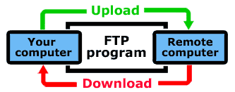
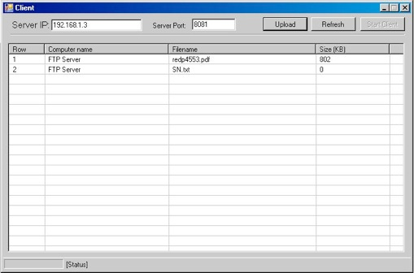

# P2P File Sharing
## Requires
- Visual Studio 2010
## License
- MS-LPL
## Technologies
- Windows Forms
- .NET Remoting
- .NET Framework 4.0
- Windows General
- System.Net Namespace
- Publisher/Subscriber
- Windows RT
## Topics
- File System
- Windows Forms
- Serialization
- events
- .NET Remoting
- Windows Form Controls
- best practices
- IP Address
- FTP
- Inheritance
- Event Handling
- .NET 4
- Delegates
- Files
- Networking
## Updated
- 10/08/2011
## Description

Sharing resources

Sometimes we forget that the Internet, when you strip away all the hype, is really still just a large network of computers. One of the primary purposes of a network is to allow different computers on the network
 to share resources, including files. The ftp process provides a way of doing that.

Here is a simplified diagram of how the ftp process works

Files can be transferred in either direction. &quot;Downloading,&quot; refers to a transfer of a file from a remote computer to your computer. &quot;Uploading&quot; refers to a transfer of a file from your computer to a remote computer.

&nbsp;

Simply put, FTP allows you to enter a directory on a computer connected to the network and transfer a file to or from that directory to a directory on another computer. Normally, you will be transferring the file
 to or from a large, multi-user computer (i.e. your web host) and your own computer.

&nbsp;

Fard FTP

Fard FTP is an open source software that I&rsquo;ve been developed that by Microsoft technologies like .Net Framework and .Net Remoting. This software has the FTP engine to transfer/receive data to/from other
 computers. Fard FTP is using publisher / subscriber architecture to achieve the goal.

&nbsp;

Snapshot

&nbsp;

&nbsp;&nbsp;&nbsp;&nbsp;&nbsp;&nbsp;&nbsp;&nbsp;&nbsp;&nbsp;&nbsp;&nbsp;&nbsp;&nbsp;&nbsp;&nbsp;&nbsp;&nbsp;&nbsp;&nbsp;&nbsp;&nbsp;&nbsp; Client Application.

&nbsp;

&nbsp;&nbsp;&nbsp;&nbsp;&nbsp;&nbsp;&nbsp;&nbsp;&nbsp;&nbsp;&nbsp;&nbsp;&nbsp;&nbsp;&nbsp;&nbsp;&nbsp;&nbsp;&nbsp;&nbsp;&nbsp;&nbsp; Server Application

&nbsp;

&nbsp;

Future Enhancements

&nbsp;&nbsp;&nbsp; 1- Create Directory on remove server.

&nbsp;&nbsp;&nbsp; 2- Filter remote server shared file.

&nbsp;&nbsp;&nbsp; 3- User authentication and set user privileges.

&nbsp;&nbsp;&nbsp; 4- Download Asynchronously.

&nbsp;&nbsp;&nbsp; 5- Upload Asynchronously.

&nbsp;

&nbsp;

&nbsp;

&nbsp;

New Project with Fard FTP engine

&nbsp;&nbsp;&nbsp; 1- Enterprise Video Conference.

&nbsp;&nbsp;&nbsp; 2- Internal Company Messenger.

<ul>
</ul>
<h1>More Information</h1>

<em>For more information please visit my official website at www.hfard.com</em>

