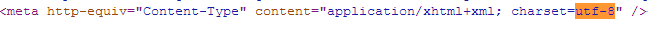
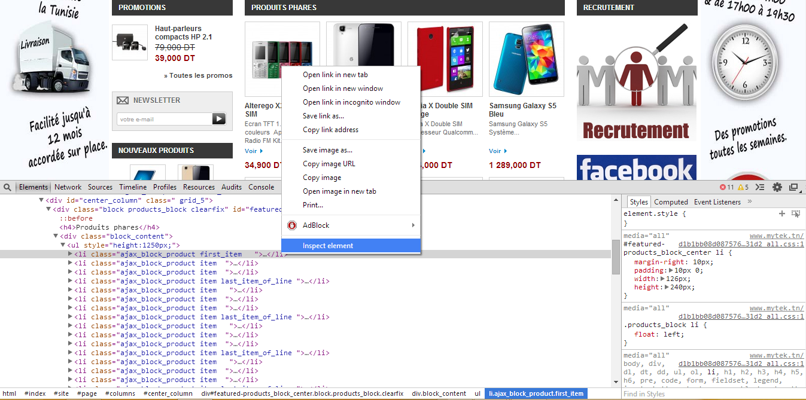
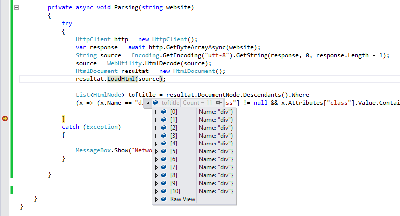

# Parsing Html using C#
## Requires
- Visual Studio 2013
## License
- Apache License, Version 2.0
## Technologies
- C#
- XAML
- WindowsPhone8
## Topics
- Windows Phone 8
## Updated
- 08/06/2014
## Description

<h1>Introduction</h1>

Usually Website has a Rss File then we can parse it to have the latest news , however , there are some that didn't make this Rss file so we should parse directly HTML of this Website.&nbsp;

Building the Sample

Fisrt of all , we should add to the reference the&nbsp;<code><a href="http://htmlagilitypack.codeplex.com/" target="_self">Htmlagilitypack</a>&nbsp;</code>, you can download it from nuget on you visual studio.

Ps : If you are working on Windows Phone , it will have some problems with that dll , so you must add these two dll file&nbsp;<strong><code>System.net.http</code></strong>&nbsp;and&nbsp;<code><strong>System.Xml.Xpat</strong>h&nbsp;</code>you can also find
 it on nuget.

&nbsp;

Description

We creat a new Function that take as parameter the website that you want to parse ,&nbsp;Then we send a request to the website to get all html page.

<strong>Ps : you should pay attention on the Encoding , each website has an Encoding , in this example it uses &quot;<code>utf-8&quot;&nbsp;</code>, you can find it on the attribut&nbsp;<code>charset&nbsp;</code>on the website html.</strong>

<strong> 
</strong>

After that we inspect the element that &nbsp;we want to parse it and get it's id or class then we can retrieve it easely.

 

as you can see on the picture , we want to parse information of these devices that are all wrapped in&nbsp;<code>ul</code>, but before that we must find the&nbsp;ancestor&nbsp;<code>div</code>&nbsp;that has an id or a class , in this example the div have
 a class named<code>block_content.</code>

So now we will filter the html with only the content of this div, then we get all tag&nbsp;of&nbsp;<code>li</code>&nbsp;that contains information that we want to get.

&nbsp;

After each filter you do , it is preferred to beakpoint the project to verify our work.

As a result we get 11 div that have class named&nbsp;<code>block_content&nbsp;</code>, &nbsp;so you should verify which item contains information that we want to get.in his example it' the item N&deg;6.

inside each item of&nbsp;<code>li,&nbsp;</code>we will get the link , image and Title.

<strong><code>Descendants&nbsp;</code></strong>allow you to get all tag with specified name inside the item.

<strong><code>GetAttributeValue&nbsp;</code></strong>allow you to get the attribut of the tag.

<strong><code>InnerText&nbsp;</code></strong>allow you to get Text betweens tags.

<strong><code>InnerHtml&nbsp;</code></strong>allow you to get HTML.

 

&nbsp;

C#

Edit|Remove

csharp
<pre class="hidden"> private async void Parsing(string website)
        {
            try
            {
                HttpClient http = new HttpClient();
                var response = await http.GetByteArrayAsync(website);
                String source = Encoding.GetEncoding(&quot;utf-8&quot;).GetString(response, 0, response.Length - 1);
                source = WebUtility.HtmlDecode(source);
                HtmlDocument resultat = new HtmlDocument();
                resultat.LoadHtml(source);

                List&lt;HtmlNode&gt; toftitle = resultat.DocumentNode.Descendants().Where
                (x =&gt; (x.Name == &quot;div&quot; &amp;&amp; x.Attributes[&quot;class&quot;] != null &amp;&amp; x.Attributes[&quot;class&quot;].Value.Contains(&quot;block_content&quot;))).ToList();

                var li = toftitle[6].Descendants(&quot;li&quot;).ToList();
                foreach (var item in li)
                {
                    var link = item.Descendants(&quot;a&quot;).ToList()[0].GetAttributeValue(&quot;href&quot;, null);
                    var img = item.Descendants(&quot;img&quot;).ToList()[0].GetAttributeValue(&quot;src&quot;, null);
                    var title = item.Descendants(&quot;h5&quot;).ToList()[0].InnerText;

                    listproduct.Add(new Product()
                    {
                        Img = img,
                        Title = title,
                        Link = link
                    });
                }

            }
            catch (Exception)
            {

                MessageBox.Show(&quot;Network Problem!&quot;);
            }

        }</pre>

<pre class="csharp">&nbsp;private&nbsp;async&nbsp;void&nbsp;Parsing(string&nbsp;website)&nbsp;
&nbsp;&nbsp;&nbsp;&nbsp;&nbsp;&nbsp;&nbsp;&nbsp;{&nbsp;
&nbsp;&nbsp;&nbsp;&nbsp;&nbsp;&nbsp;&nbsp;&nbsp;&nbsp;&nbsp;&nbsp;&nbsp;try&nbsp;
&nbsp;&nbsp;&nbsp;&nbsp;&nbsp;&nbsp;&nbsp;&nbsp;&nbsp;&nbsp;&nbsp;&nbsp;{&nbsp;
&nbsp;&nbsp;&nbsp;&nbsp;&nbsp;&nbsp;&nbsp;&nbsp;&nbsp;&nbsp;&nbsp;&nbsp;&nbsp;&nbsp;&nbsp;&nbsp;HttpClient&nbsp;http&nbsp;=&nbsp;new&nbsp;HttpClient();&nbsp;
&nbsp;&nbsp;&nbsp;&nbsp;&nbsp;&nbsp;&nbsp;&nbsp;&nbsp;&nbsp;&nbsp;&nbsp;&nbsp;&nbsp;&nbsp;&nbsp;var&nbsp;response&nbsp;=&nbsp;await&nbsp;http.GetByteArrayAsync(website);&nbsp;
&nbsp;&nbsp;&nbsp;&nbsp;&nbsp;&nbsp;&nbsp;&nbsp;&nbsp;&nbsp;&nbsp;&nbsp;&nbsp;&nbsp;&nbsp;&nbsp;String&nbsp;source&nbsp;=&nbsp;Encoding.GetEncoding(&quot;utf-8&quot;).GetString(response,&nbsp;0,&nbsp;response.Length&nbsp;-&nbsp;1);&nbsp;
&nbsp;&nbsp;&nbsp;&nbsp;&nbsp;&nbsp;&nbsp;&nbsp;&nbsp;&nbsp;&nbsp;&nbsp;&nbsp;&nbsp;&nbsp;&nbsp;source&nbsp;=&nbsp;WebUtility.HtmlDecode(source);&nbsp;
&nbsp;&nbsp;&nbsp;&nbsp;&nbsp;&nbsp;&nbsp;&nbsp;&nbsp;&nbsp;&nbsp;&nbsp;&nbsp;&nbsp;&nbsp;&nbsp;HtmlDocument&nbsp;resultat&nbsp;=&nbsp;new&nbsp;HtmlDocument();&nbsp;
&nbsp;&nbsp;&nbsp;&nbsp;&nbsp;&nbsp;&nbsp;&nbsp;&nbsp;&nbsp;&nbsp;&nbsp;&nbsp;&nbsp;&nbsp;&nbsp;resultat.LoadHtml(source);&nbsp;
&nbsp;
&nbsp;&nbsp;&nbsp;&nbsp;&nbsp;&nbsp;&nbsp;&nbsp;&nbsp;&nbsp;&nbsp;&nbsp;&nbsp;&nbsp;&nbsp;&nbsp;List&lt;HtmlNode&gt;&nbsp;toftitle&nbsp;=&nbsp;resultat.DocumentNode.Descendants().Where&nbsp;
&nbsp;&nbsp;&nbsp;&nbsp;&nbsp;&nbsp;&nbsp;&nbsp;&nbsp;&nbsp;&nbsp;&nbsp;&nbsp;&nbsp;&nbsp;&nbsp;(x&nbsp;=&gt;&nbsp;(x.Name&nbsp;==&nbsp;&quot;div&quot;&nbsp;&amp;&amp;&nbsp;x.Attributes[&quot;class&quot;]&nbsp;!=&nbsp;null&nbsp;&amp;&amp;&nbsp;x.Attributes[&quot;class&quot;].Value.Contains(&quot;block_content&quot;))).ToList();&nbsp;
&nbsp;
&nbsp;&nbsp;&nbsp;&nbsp;&nbsp;&nbsp;&nbsp;&nbsp;&nbsp;&nbsp;&nbsp;&nbsp;&nbsp;&nbsp;&nbsp;&nbsp;var&nbsp;li&nbsp;=&nbsp;toftitle[6].Descendants(&quot;li&quot;).ToList();&nbsp;
&nbsp;&nbsp;&nbsp;&nbsp;&nbsp;&nbsp;&nbsp;&nbsp;&nbsp;&nbsp;&nbsp;&nbsp;&nbsp;&nbsp;&nbsp;&nbsp;foreach&nbsp;(var&nbsp;item&nbsp;in&nbsp;li)&nbsp;
&nbsp;&nbsp;&nbsp;&nbsp;&nbsp;&nbsp;&nbsp;&nbsp;&nbsp;&nbsp;&nbsp;&nbsp;&nbsp;&nbsp;&nbsp;&nbsp;{&nbsp;
&nbsp;&nbsp;&nbsp;&nbsp;&nbsp;&nbsp;&nbsp;&nbsp;&nbsp;&nbsp;&nbsp;&nbsp;&nbsp;&nbsp;&nbsp;&nbsp;&nbsp;&nbsp;&nbsp;&nbsp;var&nbsp;link&nbsp;=&nbsp;item.Descendants(&quot;a&quot;).ToList()[0].GetAttributeValue(&quot;href&quot;,&nbsp;null);&nbsp;
&nbsp;&nbsp;&nbsp;&nbsp;&nbsp;&nbsp;&nbsp;&nbsp;&nbsp;&nbsp;&nbsp;&nbsp;&nbsp;&nbsp;&nbsp;&nbsp;&nbsp;&nbsp;&nbsp;&nbsp;var&nbsp;img&nbsp;=&nbsp;item.Descendants(&quot;img&quot;).ToList()[0].GetAttributeValue(&quot;src&quot;,&nbsp;null);&nbsp;
&nbsp;&nbsp;&nbsp;&nbsp;&nbsp;&nbsp;&nbsp;&nbsp;&nbsp;&nbsp;&nbsp;&nbsp;&nbsp;&nbsp;&nbsp;&nbsp;&nbsp;&nbsp;&nbsp;&nbsp;var&nbsp;title&nbsp;=&nbsp;item.Descendants(&quot;h5&quot;).ToList()[0].InnerText;&nbsp;
&nbsp;
&nbsp;&nbsp;&nbsp;&nbsp;&nbsp;&nbsp;&nbsp;&nbsp;&nbsp;&nbsp;&nbsp;&nbsp;&nbsp;&nbsp;&nbsp;&nbsp;&nbsp;&nbsp;&nbsp;&nbsp;listproduct.Add(new&nbsp;Product()&nbsp;
&nbsp;&nbsp;&nbsp;&nbsp;&nbsp;&nbsp;&nbsp;&nbsp;&nbsp;&nbsp;&nbsp;&nbsp;&nbsp;&nbsp;&nbsp;&nbsp;&nbsp;&nbsp;&nbsp;&nbsp;{&nbsp;
&nbsp;&nbsp;&nbsp;&nbsp;&nbsp;&nbsp;&nbsp;&nbsp;&nbsp;&nbsp;&nbsp;&nbsp;&nbsp;&nbsp;&nbsp;&nbsp;&nbsp;&nbsp;&nbsp;&nbsp;&nbsp;&nbsp;&nbsp;&nbsp;Img&nbsp;=&nbsp;img,&nbsp;
&nbsp;&nbsp;&nbsp;&nbsp;&nbsp;&nbsp;&nbsp;&nbsp;&nbsp;&nbsp;&nbsp;&nbsp;&nbsp;&nbsp;&nbsp;&nbsp;&nbsp;&nbsp;&nbsp;&nbsp;&nbsp;&nbsp;&nbsp;&nbsp;Title&nbsp;=&nbsp;title,&nbsp;
&nbsp;&nbsp;&nbsp;&nbsp;&nbsp;&nbsp;&nbsp;&nbsp;&nbsp;&nbsp;&nbsp;&nbsp;&nbsp;&nbsp;&nbsp;&nbsp;&nbsp;&nbsp;&nbsp;&nbsp;&nbsp;&nbsp;&nbsp;&nbsp;Link&nbsp;=&nbsp;link&nbsp;
&nbsp;&nbsp;&nbsp;&nbsp;&nbsp;&nbsp;&nbsp;&nbsp;&nbsp;&nbsp;&nbsp;&nbsp;&nbsp;&nbsp;&nbsp;&nbsp;&nbsp;&nbsp;&nbsp;&nbsp;});&nbsp;
&nbsp;&nbsp;&nbsp;&nbsp;&nbsp;&nbsp;&nbsp;&nbsp;&nbsp;&nbsp;&nbsp;&nbsp;&nbsp;&nbsp;&nbsp;&nbsp;}&nbsp;
&nbsp;
&nbsp;&nbsp;&nbsp;&nbsp;&nbsp;&nbsp;&nbsp;&nbsp;&nbsp;&nbsp;&nbsp;&nbsp;}&nbsp;
&nbsp;&nbsp;&nbsp;&nbsp;&nbsp;&nbsp;&nbsp;&nbsp;&nbsp;&nbsp;&nbsp;&nbsp;catch&nbsp;(Exception)&nbsp;
&nbsp;&nbsp;&nbsp;&nbsp;&nbsp;&nbsp;&nbsp;&nbsp;&nbsp;&nbsp;&nbsp;&nbsp;{&nbsp;
&nbsp;
&nbsp;&nbsp;&nbsp;&nbsp;&nbsp;&nbsp;&nbsp;&nbsp;&nbsp;&nbsp;&nbsp;&nbsp;&nbsp;&nbsp;&nbsp;&nbsp;MessageBox.Show(&quot;Network&nbsp;Problem!&quot;);&nbsp;
&nbsp;&nbsp;&nbsp;&nbsp;&nbsp;&nbsp;&nbsp;&nbsp;&nbsp;&nbsp;&nbsp;&nbsp;}&nbsp;
&nbsp;
&nbsp;&nbsp;&nbsp;&nbsp;&nbsp;&nbsp;&nbsp;&nbsp;}</pre>

<h1>More Information</h1>

Difficulty of parsing &nbsp;html depends on the structure of website.

 

