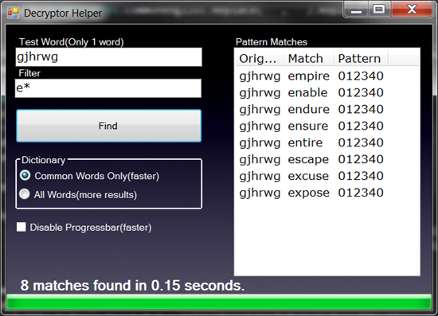

# Pattern Matching For Cryptograms
## Requires
- Visual Studio 2012
## License
- Apache License, Version 2.0
## Technologies
- LINQ
- Windows Forms
- .NET Framework
- Visual Basic .NET
- VB.Net
- .NET Framework 4.0
- Visual Studio 2012
## Topics
- Encryption
- Cryptography
- Encryption/Decryption
- Crypto
## Updated
- 01/18/2013
## Description

<h1>Please Remember To Rate This Contribution!</h1>

Thanks ;)

<h1>Pattern Matching For Cryptograms</h1>

<em>Not too long ago, I answered a question in the msdn forums about pattern matching, and how to isolate the realistic possibilites of words, and skip the jibberish. This example does that.</em>

<h1>Description</h1>

<em>This code iterates through each letter of an 'Unknown word', &nbsp;So let's say for example the word is &quot;kdfygrk&quot;.</em>

<em>The code will search each letter and do something like this:</em>

<strong><em>First Iteration:(k)</em></strong>

<em>The letter 'k' has not been assigned an identifier, therefore we will assign the next available identifier( '0' in this case) to the letter k.</em>

<em>So far our pattern is 0??????</em>

<strong><em>Next iteration(d)</em></strong>

<em>The letter 'd' has not been assigned an identifier, therefore we will assign the next available identifier( '1' in this case) to the letter d.</em>

<em>So far our pattern is 01?????</em>

<strong><em>Next iteration(f)</em></strong>

<em>The letter 'f' has not been assigned an identifier, therefore we will assign the next available identifier( '2' in this case) to the letter f.</em>

<em>So far our pattern is 012????</em>

<strong><em>Next iteration(y)</em></strong>

<em>The letter 'm' has not been assigned an identifier, therefore we will assign the next available identifier( '3' in this case) to the letter m.</em>

<em>So far our pattern is 0123???</em>

<strong><em>Next iteration(g)</em></strong>

<em>The letter 'g' has not been assigned an identifier, therefore we will assign the next available identifier( '4' in this case) to the letter g.</em>

<em>So far our pattern is 01234??</em>

<strong><em>Next iteration(r)</em></strong>

<em>The letter 'r' has not been assigned an identifier, therefore we will assign the next available identifier( '5' in this case) to the letter r.</em>

<em>So far our pattern is 012345?</em>

<strong><em>Final iteration(k)</em></strong>

<em>The letter 'k' has already been assigned an identifier, therefore we will use the previously assigned identifier for 'k'('0' in this case)</em>

<em>So this leaves us with a pattern of '0123450'</em>

&nbsp;

<em>So now we shrink the dictionary to include only words that meet this criteria:</em>

<ul>
<li><em>Words of same length(7)</em> </li><li><em>Words that match the specified filter(* by default)</em> </li></ul>

&nbsp;

<em>So now we loop through each of the shrunken dictionaries words and check each word's pattern against the pattern of the unknown word. If they have like patterns then they are added to the results.</em>

&nbsp;

This is the code involved with comments, but downloading the project is highly recommended, because the controls are already layed out.

Visual Basic

Edit|Remove

vb

<pre class="vb">'''&nbsp;&lt;summary&gt;&nbsp;
'''&nbsp;This&nbsp;function&nbsp;calculates&nbsp;likely&nbsp;word&nbsp;matches&nbsp;for&nbsp;cryptogram&nbsp;words.&nbsp;
'''&nbsp;&lt;/summary&gt;&nbsp;
'''&nbsp;&lt;param&nbsp;name=&quot;Word&quot;&gt;The&nbsp;encrypted&nbsp;word&lt;/param&gt;&nbsp;
'''&nbsp;&lt;param&nbsp;name=&quot;Dictionary&quot;&gt;A&nbsp;list&nbsp;of&nbsp;words&nbsp;to&nbsp;match&nbsp;the&nbsp;encrypted&nbsp;word&nbsp;against.&lt;/param&gt;&nbsp;
'''&nbsp;&lt;param&nbsp;name=&quot;Filter&quot;&gt;A&nbsp;filter&nbsp;pattern&nbsp;for&nbsp;reducing&nbsp;results.&lt;/param&gt;&nbsp;
'''&nbsp;&lt;param&nbsp;name=&quot;PB&quot;&gt;Optional&nbsp;Progressbar&nbsp;to&nbsp;report&nbsp;progress.&lt;/param&gt;&nbsp;
'''&nbsp;&lt;param&nbsp;name=&quot;UpdateLabel&quot;&gt;Optional&nbsp;Label&nbsp;to&nbsp;report&nbsp;current&nbsp;match&nbsp;count.&lt;/param&gt;&nbsp;
'''&nbsp;&lt;returns&gt;&lt;/returns&gt;&nbsp;
'''&nbsp;&lt;remarks&gt;&lt;/remarks&gt;&nbsp;
Function&nbsp;GetWordPatternMatches(Word&nbsp;As&nbsp;String,&nbsp;_&nbsp;
&nbsp;&nbsp;&nbsp;&nbsp;&nbsp;&nbsp;&nbsp;&nbsp;&nbsp;&nbsp;&nbsp;&nbsp;&nbsp;&nbsp;&nbsp;&nbsp;&nbsp;&nbsp;&nbsp;&nbsp;&nbsp;&nbsp;&nbsp;&nbsp;&nbsp;&nbsp;&nbsp;Dictionary&nbsp;As&nbsp;List(Of&nbsp;String),&nbsp;_&nbsp;
&nbsp;&nbsp;&nbsp;&nbsp;&nbsp;&nbsp;&nbsp;&nbsp;&nbsp;&nbsp;&nbsp;&nbsp;&nbsp;&nbsp;&nbsp;&nbsp;&nbsp;&nbsp;&nbsp;&nbsp;&nbsp;&nbsp;&nbsp;&nbsp;&nbsp;&nbsp;&nbsp;Optional&nbsp;Filter&nbsp;As&nbsp;String&nbsp;=&nbsp;&quot;*&quot;,&nbsp;_&nbsp;
&nbsp;&nbsp;&nbsp;&nbsp;&nbsp;&nbsp;&nbsp;&nbsp;&nbsp;&nbsp;&nbsp;&nbsp;&nbsp;&nbsp;&nbsp;&nbsp;&nbsp;&nbsp;&nbsp;&nbsp;&nbsp;&nbsp;&nbsp;&nbsp;&nbsp;&nbsp;&nbsp;Optional&nbsp;PB&nbsp;As&nbsp;ProgressBar&nbsp;=&nbsp;Nothing,&nbsp;_&nbsp;
&nbsp;&nbsp;&nbsp;&nbsp;&nbsp;&nbsp;&nbsp;&nbsp;&nbsp;&nbsp;&nbsp;&nbsp;&nbsp;&nbsp;&nbsp;&nbsp;&nbsp;&nbsp;&nbsp;&nbsp;&nbsp;&nbsp;&nbsp;&nbsp;&nbsp;&nbsp;&nbsp;Optional&nbsp;UpdateLabel&nbsp;As&nbsp;Label&nbsp;=&nbsp;Nothing)&nbsp;_&nbsp;
&nbsp;&nbsp;&nbsp;&nbsp;&nbsp;&nbsp;&nbsp;&nbsp;&nbsp;&nbsp;&nbsp;&nbsp;&nbsp;&nbsp;&nbsp;&nbsp;&nbsp;&nbsp;&nbsp;&nbsp;As&nbsp;ListViewItem()&nbsp;
&nbsp;&nbsp;&nbsp;&nbsp;'If&nbsp;the&nbsp;user&nbsp;specified&nbsp;a&nbsp;progressbar,&nbsp;then&nbsp;update&nbsp;the&nbsp;values&nbsp;
&nbsp;&nbsp;&nbsp;&nbsp;If&nbsp;Not&nbsp;PB&nbsp;Is&nbsp;Nothing&nbsp;Then&nbsp;PB.Value&nbsp;=&nbsp;0&nbsp;
&nbsp;&nbsp;&nbsp;&nbsp;If&nbsp;Not&nbsp;PB&nbsp;Is&nbsp;Nothing&nbsp;Then&nbsp;PB.Maximum&nbsp;=&nbsp;0&nbsp;
&nbsp;&nbsp;&nbsp;&nbsp;'A&nbsp;list&nbsp;of&nbsp;identifications&nbsp;for&nbsp;pattern&nbsp;matching&nbsp;
&nbsp;&nbsp;&nbsp;&nbsp;Const&nbsp;Legend&nbsp;As&nbsp;String&nbsp;=&nbsp;&quot;01234567890ABCDEFGHIJKLMNOPQRSTUVWXYZ&quot;&nbsp;
&nbsp;&nbsp;&nbsp;&nbsp;'return&nbsp;an&nbsp;empty&nbsp;array&nbsp;if&nbsp;there&nbsp;is&nbsp;no&nbsp;word&nbsp;to&nbsp;match&nbsp;
&nbsp;&nbsp;&nbsp;&nbsp;If&nbsp;Word.Length&nbsp;=&nbsp;0&nbsp;Then&nbsp;Return&nbsp;{}&nbsp;
&nbsp;&nbsp;&nbsp;&nbsp;'Create&nbsp;a&nbsp;new&nbsp;pattern&nbsp;table&nbsp;
&nbsp;&nbsp;&nbsp;&nbsp;Dim&nbsp;map&nbsp;As&nbsp;New&nbsp;List(Of&nbsp;pt),&nbsp;I&nbsp;=&nbsp;0,&nbsp;WordPattern&nbsp;As&nbsp;String&nbsp;=&nbsp;&quot;&quot;&nbsp;
&nbsp;&nbsp;&nbsp;&nbsp;'If&nbsp;the&nbsp;user&nbsp;specified&nbsp;a&nbsp;progressbar,&nbsp;then&nbsp;update&nbsp;the&nbsp;values&nbsp;
&nbsp;&nbsp;&nbsp;&nbsp;If&nbsp;Not&nbsp;PB&nbsp;Is&nbsp;Nothing&nbsp;Then&nbsp;PB.Maximum&nbsp;&#43;=&nbsp;Word.Count&nbsp;
&nbsp;&nbsp;&nbsp;&nbsp;'Examine&nbsp;each&nbsp;letter&nbsp;in&nbsp;the&nbsp;encrypted&nbsp;word&nbsp;
&nbsp;&nbsp;&nbsp;&nbsp;For&nbsp;Each&nbsp;S&nbsp;As&nbsp;String&nbsp;In&nbsp;Word&nbsp;
&nbsp;&nbsp;&nbsp;&nbsp;&nbsp;&nbsp;&nbsp;&nbsp;'If&nbsp;the&nbsp;user&nbsp;specified&nbsp;a&nbsp;progressbar,&nbsp;then&nbsp;update&nbsp;the&nbsp;values&nbsp;
&nbsp;&nbsp;&nbsp;&nbsp;&nbsp;&nbsp;&nbsp;&nbsp;If&nbsp;Not&nbsp;PB&nbsp;Is&nbsp;Nothing&nbsp;Then&nbsp;PB.Increment(1)&nbsp;
&nbsp;&nbsp;&nbsp;&nbsp;&nbsp;&nbsp;&nbsp;&nbsp;'search&nbsp;the&nbsp;pattern&nbsp;table&nbsp;to&nbsp;see&nbsp;if&nbsp;the&nbsp;letter&nbsp;was&nbsp;already&nbsp;assigned&nbsp;an&nbsp;identification&nbsp;
&nbsp;&nbsp;&nbsp;&nbsp;&nbsp;&nbsp;&nbsp;&nbsp;Dim&nbsp;Q1&nbsp;=&nbsp;From&nbsp;P&nbsp;In&nbsp;map&nbsp;Where&nbsp;P.Letter&nbsp;=&nbsp;S&nbsp;Select&nbsp;P&nbsp;
&nbsp;&nbsp;&nbsp;&nbsp;&nbsp;&nbsp;&nbsp;&nbsp;'If&nbsp;it&nbsp;has&nbsp;then&nbsp;use&nbsp;the&nbsp;same&nbsp;identification&nbsp;for&nbsp;that&nbsp;letter&nbsp;
&nbsp;&nbsp;&nbsp;&nbsp;&nbsp;&nbsp;&nbsp;&nbsp;If&nbsp;Not&nbsp;Q1.ToArray.Count&nbsp;=&nbsp;0&nbsp;Then&nbsp;map.Add(New&nbsp;pt(Q1.ToArray(0).ID,&nbsp;S))&nbsp;:&nbsp;Continue&nbsp;For&nbsp;
&nbsp;&nbsp;&nbsp;&nbsp;&nbsp;&nbsp;&nbsp;&nbsp;'If&nbsp;it&nbsp;has&nbsp;not,&nbsp;then&nbsp;assign&nbsp;a&nbsp;new&nbsp;pattern&nbsp;identification&nbsp;
&nbsp;&nbsp;&nbsp;&nbsp;&nbsp;&nbsp;&nbsp;&nbsp;map.Add(New&nbsp;pt((Legend)(I),&nbsp;S))&nbsp;
&nbsp;&nbsp;&nbsp;&nbsp;&nbsp;&nbsp;&nbsp;&nbsp;'Increment&nbsp;the&nbsp;next&nbsp;pattern&nbsp;id&nbsp;index&nbsp;number&nbsp;
&nbsp;&nbsp;&nbsp;&nbsp;&nbsp;&nbsp;&nbsp;&nbsp;I&nbsp;&#43;=&nbsp;1&nbsp;
&nbsp;&nbsp;&nbsp;&nbsp;Next&nbsp;
&nbsp;&nbsp;&nbsp;&nbsp;'If&nbsp;the&nbsp;user&nbsp;specified&nbsp;a&nbsp;progressbar,&nbsp;then&nbsp;update&nbsp;the&nbsp;values&nbsp;
&nbsp;&nbsp;&nbsp;&nbsp;If&nbsp;Not&nbsp;PB&nbsp;Is&nbsp;Nothing&nbsp;Then&nbsp;PB.Maximum&nbsp;&#43;=&nbsp;map.Count&nbsp;
&nbsp;&nbsp;&nbsp;&nbsp;'Go&nbsp;through&nbsp;each&nbsp;mapped&nbsp;letter&nbsp;
&nbsp;&nbsp;&nbsp;&nbsp;For&nbsp;Each&nbsp;P&nbsp;As&nbsp;pt&nbsp;In&nbsp;map&nbsp;
&nbsp;&nbsp;&nbsp;&nbsp;&nbsp;&nbsp;&nbsp;&nbsp;'If&nbsp;the&nbsp;user&nbsp;specified&nbsp;a&nbsp;progressbar,&nbsp;then&nbsp;update&nbsp;the&nbsp;values&nbsp;
&nbsp;&nbsp;&nbsp;&nbsp;&nbsp;&nbsp;&nbsp;&nbsp;If&nbsp;Not&nbsp;PB&nbsp;Is&nbsp;Nothing&nbsp;Then&nbsp;PB.Increment(1)&nbsp;
&nbsp;&nbsp;&nbsp;&nbsp;&nbsp;&nbsp;&nbsp;&nbsp;'Assemble&nbsp;the&nbsp;encrypted&nbsp;word's&nbsp;pattern&nbsp;
&nbsp;&nbsp;&nbsp;&nbsp;&nbsp;&nbsp;&nbsp;&nbsp;WordPattern&nbsp;=&nbsp;WordPattern&nbsp;&amp;&nbsp;P.ID&nbsp;:&nbsp;Next&nbsp;
&nbsp;&nbsp;&nbsp;&nbsp;'Get&nbsp;all&nbsp;word&nbsp;from&nbsp;the&nbsp;dictionary&nbsp;that&nbsp;are:&nbsp;
&nbsp;&nbsp;&nbsp;&nbsp;'A.)&nbsp;The&nbsp;same&nbsp;length&nbsp;of&nbsp;the&nbsp;bord&nbsp;
&nbsp;&nbsp;&nbsp;&nbsp;'B.)&nbsp;Match&nbsp;the&nbsp;FILTER&nbsp;specified&nbsp;
&nbsp;&nbsp;&nbsp;&nbsp;Dim&nbsp;Q2&nbsp;=&nbsp;From&nbsp;W&nbsp;In&nbsp;Dictionary&nbsp;Where&nbsp;(W.Length&nbsp;=&nbsp;Word.Length)&nbsp;And&nbsp;(W&nbsp;Like&nbsp;Filter)&nbsp;Select&nbsp;W&nbsp;
&nbsp;&nbsp;&nbsp;&nbsp;'Create&nbsp;a&nbsp;list&nbsp;for&nbsp;holding&nbsp;the&nbsp;result&nbsp;
&nbsp;&nbsp;&nbsp;&nbsp;Dim&nbsp;results&nbsp;As&nbsp;New&nbsp;List(Of&nbsp;String)&nbsp;
&nbsp;&nbsp;&nbsp;&nbsp;'If&nbsp;the&nbsp;user&nbsp;specified&nbsp;a&nbsp;progressbar,&nbsp;then&nbsp;update&nbsp;the&nbsp;values&nbsp;
&nbsp;&nbsp;&nbsp;&nbsp;If&nbsp;Not&nbsp;PB&nbsp;Is&nbsp;Nothing&nbsp;Then&nbsp;PB.Maximum&nbsp;&#43;=&nbsp;Q2.ToArray.Count&nbsp;
&nbsp;&nbsp;&nbsp;&nbsp;'Go&nbsp;through&nbsp;each&nbsp;dictionary&nbsp;word&nbsp;from&nbsp;the&nbsp;LINQ&nbsp;result&nbsp;
&nbsp;&nbsp;&nbsp;&nbsp;For&nbsp;Each&nbsp;W&nbsp;In&nbsp;Q2.ToArray&nbsp;
&nbsp;&nbsp;&nbsp;&nbsp;&nbsp;&nbsp;&nbsp;&nbsp;'If&nbsp;the&nbsp;user&nbsp;specified&nbsp;a&nbsp;progressbar,&nbsp;then&nbsp;update&nbsp;the&nbsp;values&nbsp;
&nbsp;&nbsp;&nbsp;&nbsp;&nbsp;&nbsp;&nbsp;&nbsp;If&nbsp;Not&nbsp;PB&nbsp;Is&nbsp;Nothing&nbsp;Then&nbsp;PB.Increment(1)&nbsp;
&nbsp;&nbsp;&nbsp;&nbsp;&nbsp;&nbsp;&nbsp;&nbsp;'Create&nbsp;a&nbsp;pattern&nbsp;map&nbsp;for&nbsp;each&nbsp;word&nbsp;from&nbsp;the&nbsp;LINQ&nbsp;result,&nbsp;create&nbsp;a&nbsp;
&nbsp;&nbsp;&nbsp;&nbsp;&nbsp;&nbsp;&nbsp;&nbsp;'&nbsp;legend&nbsp;index&nbsp;counter,&nbsp;create&nbsp;a&nbsp;dictionary&nbsp;word&nbsp;pattern&nbsp;to&nbsp;compare&nbsp;against&nbsp;the&nbsp;encrypted&nbsp;word&nbsp;pattern&nbsp;
&nbsp;&nbsp;&nbsp;&nbsp;&nbsp;&nbsp;&nbsp;&nbsp;Dim&nbsp;map2&nbsp;As&nbsp;New&nbsp;List(Of&nbsp;pt),&nbsp;I2&nbsp;=&nbsp;0,&nbsp;DictPattern&nbsp;As&nbsp;String&nbsp;=&nbsp;&quot;&quot;&nbsp;
&nbsp;&nbsp;&nbsp;&nbsp;&nbsp;&nbsp;&nbsp;&nbsp;'Go&nbsp;through&nbsp;each&nbsp;character,&nbsp;of&nbsp;each&nbsp;word&nbsp;from&nbsp;the&nbsp;LINQ&nbsp;result&nbsp;
&nbsp;&nbsp;&nbsp;&nbsp;&nbsp;&nbsp;&nbsp;&nbsp;For&nbsp;Each&nbsp;S&nbsp;As&nbsp;String&nbsp;In&nbsp;W&nbsp;
&nbsp;&nbsp;&nbsp;&nbsp;&nbsp;&nbsp;&nbsp;&nbsp;&nbsp;&nbsp;&nbsp;&nbsp;'search&nbsp;the&nbsp;pattern&nbsp;table&nbsp;to&nbsp;see&nbsp;if&nbsp;the&nbsp;letter&nbsp;was&nbsp;already&nbsp;assigned&nbsp;an&nbsp;identification&nbsp;
&nbsp;&nbsp;&nbsp;&nbsp;&nbsp;&nbsp;&nbsp;&nbsp;&nbsp;&nbsp;&nbsp;&nbsp;Dim&nbsp;Q3&nbsp;=&nbsp;From&nbsp;P&nbsp;In&nbsp;map2&nbsp;Where&nbsp;P.Letter&nbsp;=&nbsp;S&nbsp;Select&nbsp;P&nbsp;
&nbsp;&nbsp;&nbsp;&nbsp;&nbsp;&nbsp;&nbsp;&nbsp;&nbsp;&nbsp;&nbsp;&nbsp;'If&nbsp;it&nbsp;has&nbsp;then&nbsp;use&nbsp;the&nbsp;same&nbsp;identification&nbsp;for&nbsp;that&nbsp;letter&nbsp;
&nbsp;&nbsp;&nbsp;&nbsp;&nbsp;&nbsp;&nbsp;&nbsp;&nbsp;&nbsp;&nbsp;&nbsp;If&nbsp;Not&nbsp;Q3.ToArray.Count&nbsp;=&nbsp;0&nbsp;Then&nbsp;map2.Add(New&nbsp;pt(Q3.ToArray(0).ID,&nbsp;S))&nbsp;:&nbsp;Continue&nbsp;For&nbsp;
&nbsp;&nbsp;&nbsp;&nbsp;&nbsp;&nbsp;&nbsp;&nbsp;&nbsp;&nbsp;&nbsp;&nbsp;'If&nbsp;it&nbsp;has&nbsp;not,&nbsp;then&nbsp;assign&nbsp;a&nbsp;new&nbsp;pattern&nbsp;identification&nbsp;
&nbsp;&nbsp;&nbsp;&nbsp;&nbsp;&nbsp;&nbsp;&nbsp;&nbsp;&nbsp;&nbsp;&nbsp;map2.Add(New&nbsp;pt((Legend)(I2),&nbsp;S))&nbsp;
&nbsp;&nbsp;&nbsp;&nbsp;&nbsp;&nbsp;&nbsp;&nbsp;&nbsp;&nbsp;&nbsp;&nbsp;'Increment&nbsp;the&nbsp;next&nbsp;pattern&nbsp;id&nbsp;index&nbsp;number&nbsp;
&nbsp;&nbsp;&nbsp;&nbsp;&nbsp;&nbsp;&nbsp;&nbsp;&nbsp;&nbsp;&nbsp;&nbsp;I2&nbsp;&#43;=&nbsp;1&nbsp;:&nbsp;Next&nbsp;
&nbsp;&nbsp;&nbsp;&nbsp;&nbsp;&nbsp;&nbsp;&nbsp;'Go&nbsp;through&nbsp;each&nbsp;mapped&nbsp;letter&nbsp;
&nbsp;&nbsp;&nbsp;&nbsp;&nbsp;&nbsp;&nbsp;&nbsp;For&nbsp;Each&nbsp;P&nbsp;As&nbsp;pt&nbsp;In&nbsp;map2&nbsp;
&nbsp;&nbsp;&nbsp;&nbsp;&nbsp;&nbsp;&nbsp;&nbsp;&nbsp;&nbsp;&nbsp;&nbsp;'Assemble&nbsp;the&nbsp;dictionary&nbsp;word's&nbsp;pattern&nbsp;
&nbsp;&nbsp;&nbsp;&nbsp;&nbsp;&nbsp;&nbsp;&nbsp;&nbsp;&nbsp;&nbsp;&nbsp;DictPattern&nbsp;=&nbsp;DictPattern&nbsp;&amp;&nbsp;P.ID&nbsp;
&nbsp;&nbsp;&nbsp;&nbsp;&nbsp;&nbsp;&nbsp;&nbsp;Next&nbsp;
&nbsp;&nbsp;&nbsp;&nbsp;&nbsp;&nbsp;&nbsp;&nbsp;'Compare&nbsp;the&nbsp;encrypted&nbsp;word's&nbsp;pattern&nbsp;to&nbsp;the&nbsp;pattern&nbsp;of&nbsp;each&nbsp;result&nbsp;from&nbsp;the&nbsp;LINQ&nbsp;query(Q2)&nbsp;
&nbsp;&nbsp;&nbsp;&nbsp;&nbsp;&nbsp;&nbsp;&nbsp;If&nbsp;DictPattern&nbsp;=&nbsp;WordPattern&nbsp;Then&nbsp;results.Add(W)&nbsp;
&nbsp;&nbsp;&nbsp;&nbsp;&nbsp;&nbsp;&nbsp;&nbsp;'If&nbsp;the&nbsp;user&nbsp;provided&nbsp;a&nbsp;label&nbsp;to&nbsp;update&nbsp;status&nbsp;
&nbsp;&nbsp;&nbsp;&nbsp;&nbsp;&nbsp;&nbsp;&nbsp;If&nbsp;Not&nbsp;UpdateLabel&nbsp;Is&nbsp;Nothing&nbsp;Then&nbsp;
&nbsp;&nbsp;&nbsp;&nbsp;&nbsp;&nbsp;&nbsp;&nbsp;&nbsp;&nbsp;&nbsp;&nbsp;'Change&nbsp;the&nbsp;label's&nbsp;text&nbsp;to&nbsp;reflect&nbsp;the&nbsp;current&nbsp;matches&nbsp;found&nbsp;
&nbsp;&nbsp;&nbsp;&nbsp;&nbsp;&nbsp;&nbsp;&nbsp;&nbsp;&nbsp;&nbsp;&nbsp;UpdateLabel.Text&nbsp;=&nbsp;results.Count&nbsp;&amp;&nbsp;&quot;&nbsp;matches&nbsp;found&nbsp;so&nbsp;far...&quot;&nbsp;
&nbsp;&nbsp;&nbsp;&nbsp;&nbsp;&nbsp;&nbsp;&nbsp;&nbsp;&nbsp;&nbsp;&nbsp;'refresh&nbsp;the&nbsp;label/app&nbsp;
&nbsp;&nbsp;&nbsp;&nbsp;&nbsp;&nbsp;&nbsp;&nbsp;&nbsp;&nbsp;&nbsp;&nbsp;Application.DoEvents()&nbsp;
&nbsp;&nbsp;&nbsp;&nbsp;&nbsp;&nbsp;&nbsp;&nbsp;End&nbsp;If&nbsp;
&nbsp;&nbsp;&nbsp;&nbsp;Next&nbsp;
&nbsp;&nbsp;&nbsp;&nbsp;'Create&nbsp;a&nbsp;list&nbsp;for&nbsp;returning&nbsp;the&nbsp;final&nbsp;results&nbsp;
&nbsp;&nbsp;&nbsp;&nbsp;Dim&nbsp;Items&nbsp;As&nbsp;New&nbsp;List(Of&nbsp;ListViewItem)&nbsp;
&nbsp;&nbsp;&nbsp;&nbsp;'If&nbsp;the&nbsp;user&nbsp;specified&nbsp;a&nbsp;progressbar,&nbsp;then&nbsp;update&nbsp;the&nbsp;values&nbsp;
&nbsp;&nbsp;&nbsp;&nbsp;If&nbsp;Not&nbsp;PB&nbsp;Is&nbsp;Nothing&nbsp;Then&nbsp;PB.Maximum&nbsp;&#43;=&nbsp;results.Count&nbsp;
&nbsp;&nbsp;&nbsp;&nbsp;For&nbsp;Each&nbsp;S&nbsp;As&nbsp;String&nbsp;In&nbsp;results&nbsp;
&nbsp;&nbsp;&nbsp;&nbsp;&nbsp;&nbsp;&nbsp;&nbsp;'If&nbsp;the&nbsp;user&nbsp;specified&nbsp;a&nbsp;progressbar,&nbsp;then&nbsp;update&nbsp;the&nbsp;values&nbsp;
&nbsp;&nbsp;&nbsp;&nbsp;&nbsp;&nbsp;&nbsp;&nbsp;If&nbsp;Not&nbsp;PB&nbsp;Is&nbsp;Nothing&nbsp;Then&nbsp;PB.Increment(1)&nbsp;
&nbsp;&nbsp;&nbsp;&nbsp;&nbsp;&nbsp;&nbsp;&nbsp;'Create&nbsp;a&nbsp;new&nbsp;listview&nbsp;item&nbsp;with&nbsp;subitem(0)&nbsp;being&nbsp;the&nbsp;encrypted&nbsp;word&nbsp;
&nbsp;&nbsp;&nbsp;&nbsp;&nbsp;&nbsp;&nbsp;&nbsp;Dim&nbsp;Item&nbsp;As&nbsp;New&nbsp;ListViewItem(Word)&nbsp;
&nbsp;&nbsp;&nbsp;&nbsp;&nbsp;&nbsp;&nbsp;&nbsp;'Add&nbsp;2&nbsp;subitems&nbsp;to&nbsp;the&nbsp;item(Dictionary&nbsp;word,&nbsp;the&nbsp;pattern&nbsp;that&nbsp;they&nbsp;were&nbsp;matched&nbsp;with)&nbsp;
&nbsp;&nbsp;&nbsp;&nbsp;&nbsp;&nbsp;&nbsp;&nbsp;Item.SubItems.AddRange({S,&nbsp;WordPattern})&nbsp;
&nbsp;&nbsp;&nbsp;&nbsp;&nbsp;&nbsp;&nbsp;&nbsp;'Add&nbsp;the&nbsp;item&nbsp;to&nbsp;the&nbsp;final&nbsp;results&nbsp;
&nbsp;&nbsp;&nbsp;&nbsp;&nbsp;&nbsp;&nbsp;&nbsp;Items.Add(Item)&nbsp;
&nbsp;&nbsp;&nbsp;&nbsp;Next&nbsp;
&nbsp;&nbsp;&nbsp;&nbsp;'convert&nbsp;the&nbsp;resuts&nbsp;and&nbsp;return&nbsp;it&nbsp;as&nbsp;an&nbsp;array&nbsp;of&nbsp;Listviewitem&nbsp;
&nbsp;&nbsp;&nbsp;&nbsp;Return&nbsp;Items.ToArray&nbsp;
End&nbsp;Function&nbsp;
Private&nbsp;Class&nbsp;pt&nbsp;'&nbsp;Pattern&nbsp;Table&nbsp;
&nbsp;&nbsp;&nbsp;&nbsp;'I.e.&nbsp;The&nbsp;letter&nbsp;can&nbsp;only&nbsp;recieve&nbsp;this&nbsp;ID,&nbsp;this&nbsp;ID&nbsp;can&nbsp;only&nbsp;represent&nbsp;this&nbsp;letter&nbsp;
&nbsp;&nbsp;&nbsp;&nbsp;Public&nbsp;ID,&nbsp;Letter&nbsp;As&nbsp;String&nbsp;
&nbsp;&nbsp;&nbsp;&nbsp;Sub&nbsp;New(ID&nbsp;As&nbsp;String,&nbsp;Letter&nbsp;As&nbsp;String)&nbsp;
&nbsp;&nbsp;&nbsp;&nbsp;&nbsp;&nbsp;&nbsp;&nbsp;'Populate&nbsp;the&nbsp;ID&nbsp;and&nbsp;Letter&nbsp;values&nbsp;of&nbsp;this&nbsp;pattern&nbsp;table&nbsp;
&nbsp;&nbsp;&nbsp;&nbsp;&nbsp;&nbsp;&nbsp;&nbsp;Me.ID&nbsp;=&nbsp;ID&nbsp;:&nbsp;Me.Letter&nbsp;=&nbsp;Letter&nbsp;
&nbsp;&nbsp;&nbsp;&nbsp;End&nbsp;Sub&nbsp;
End&nbsp;Class</pre>

<em>&nbsp;</em>

