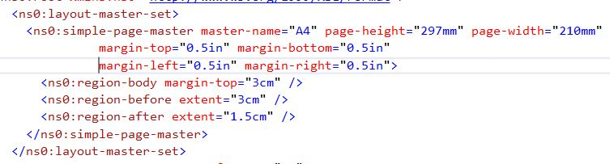

# Pdf writer pipelinecomponent for BizTalk
## Requires
- Visual Studio 2015
## License
- MIT
## Technologies
- BizTalk Server 2016
- FO.NET
## Topics
- Custom Pipeline Component
- PDF
- XSL-FO
## Updated
- 04/19/2016
## Description

<h1>Introduction</h1>

<em>I wanted to find something fun to create for my first BiZtalk 2016 project. As it so happens i had a requirement to create PDF documents from BizTalk.</em>

<em>Strange enough i could not find a pdf writer pipeline, so why not create one.</em>

 
<em>I wanted to use a technique that was close to BizTalk so i wanted to find a component that could create pdf content from xsl-fo source.</em>

<em>The component i found was found at codeplex, of course, https://fonet.codeplex.com/.</em>

<em>FO.NET is very easy to use and i can recommend it to anyone.</em>

<h1>Sample</h1>

<em>The attached file contains pipelinecomponent, sample BizTalk project that shows how you can create a simple table output plus a sample project to test xsl-fo messages before creating a map on it in BizTalk.</em>

Description

<em><em>Use the sample &quot;test&quot; project to test xsl-fo messages before creating a map on it in BizTalk. The xslfo schema is very big so best to create a base to work on.</em></em>

&nbsp;

<h2><em><em>Layout master</em></em></h2>

<em><em>Every xsl-fo message must begin with a layout-master-set wich more or less set's the canvas size of one page.</em></em>

<em><em> 
</em></em>

<em></em>

<em>The rest of the xsl-fo i leave to you learn</em>

&nbsp;

<h2><em>Properties</em></h2>

&nbsp;

<em>I only added 3 properties in the pipeline component from the FO.NET component, it is possible to add more.</em>

<em>Tile,Subject and Password that lets you passwprd protect your pdf file. 
</em>

