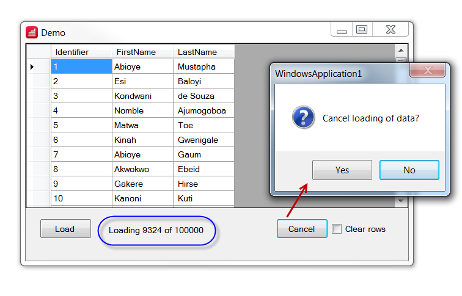
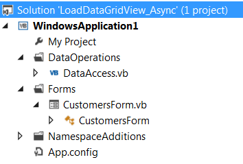

# Populate DataGridView via asynchronously methods
## Requires
- Visual Studio 2015
## License
- Apache License, Version 2.0
## Technologies
- ADO.NET
- Data Access
- threading
- .NET Framework
- Visual Basic .NET
- Windows UI
- DataGridView
- Async
- .NET Framework 4.5
## Topics
- Data Binding
- Asynchronous Programming
- User Interface
- Windows Forms
- Data Access
- threading
- Visual Basic .NET
- How to
## Updated
- 11/02/2016
## Description

<h1>Description</h1>

This article presents one method to load a DataGridView from a backend database table where the user interface remains responsive using features new to Visual Studio 2012 and higher which includes VB.NET Iterator method in tangent
 with Yield statement plus Async modifier and Await operator.

<strong>UPDATE 11/02/2016</strong> Minor changes and included scripts for generating database and table. Also upgraded from VS2013 to VS2015.

<strong>UPDATE 4/15/2016</strong> If using SQL-Server, change RowCount to Row_Count in DataAccess.RowCount&nbsp;

&nbsp;

Visual Basic

Edit|Remove

vb

<pre class="js">Using&nbsp;cmd&nbsp;As&nbsp;New&nbsp;SqlClient.SqlCommand&nbsp;With&nbsp;{.CommandText&nbsp;=&nbsp;&quot;SELECT&nbsp;COUNT(Identifier)&nbsp;As&nbsp;Row_Count&nbsp;FROM&nbsp;[People]&quot;,&nbsp;.Connection&nbsp;=&nbsp;cn}</pre>

&nbsp;

&nbsp;

&nbsp;

<strong>UPDATE 11/21/2015</strong> Added a C# project to mirror the original VB.NET project. Also added an example to use a progressbar to both C# and VB.NET. Lastly, the original database had 1M records which made it a physically
 large file so I reduced the records to 1,000 as when intially uploading strange things happened. 
 
<strong>NOTE:&nbsp;The code presented works with VS2013 or higher</strong>. 

The goal here is to press a button on a form, load rows of data from a class to the caller which is a form into a DataTable where the DataTable is currently the DataSource of a DataGridView. During the load process we allow
 the user to cancel the operation.

Since the managed data providers in the Framework work well I elected to use a table with three fields with one million rows. Okay, that is a lot of rows but it's for demonstration purposes only as when data is presented to
 users 99.99% of the time they never need that many rows at once but I have seen developers wanting this on various forums on the web hence this will appease those developers.

In the class DataAccess there is a function named LoadCustomers which is setup with a Iterator keyword which returns an Object array. The Object elements contain three items which represent data retrieved from the database table
 that is passed to a delegate in the caller (form) which adds a new row to the DataTable in the main form. LoadCustomers is called in a button setup with Async that iterates the items in LoadCustomers but our task does nothing which keeps us responsive while
 the delegate UpDateDataTable in the form does the adding of Datarows to the DataTable in the form.

While populating the DataTable we can cancel the operation via a CancellationToken rather than making the user have to wait even thou they don't want to wait. 
 
Now the backend database is MS-Access yet what is presented can and will work with other managed data providers in the Framework. Also the pattern presented can be used for other operations (I have a upcoming article on doing splash screens which use similar
 methods as shown here). 
 
UPDATE: The original database had three tables and only needed one so two were removed while the one needed was reduced from 100,000,000 records to 100,000 records since the original was very large 126MB and is now just under 400MB. 
 

&nbsp;

<em>.&nbsp;&nbsp;&nbsp;</em>

&nbsp;

<h1>&nbsp;</h1>
<h1>&nbsp;</h1>
