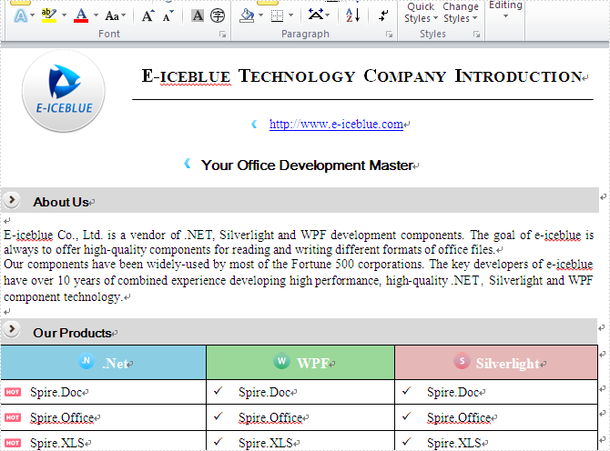

# Print a Word Document in C# and VB.NET
## Requires
- Visual Studio 2010
## License
- MS-LPL
## Technologies
- Silverlight
- WPF
- print
- C# word
- free word API
## Topics
- C#
- ASP.NET
- .NET
- How to
- print
- .doc
## Updated
- 12/03/2014
## Description

<strong>Introduction:</strong>

This code example focus on introducing how to print word documents via a .NET word API. With the help of Spire.Doc for .NET, developers can finish the print function in a few lines codes to print the word documents with the default printer or any other network
 connected printer. You can also print all the word documents or only print the selected pages you want.

<a href="http://www.e-iceblue.com/Introduce/free-doc-component.html">Free Spire.Doc</a>&nbsp;for .NET is totally free word component for commercial and personal use. As a free C#/VB.NET component, it offers a lot of powerful functions. Developers can use
 it to generate, read, write, save, print and convert documents on any .NET applications. The featured function, conversion allows converting Word documents (Word 97-2003, Word 2007, Word 2010, word 2013) to commonly used file format, such as RTF, TXT, PDF,
 HTML, EPUB and Image etc.

<strong>Effective screenshot:</strong>

<strong></strong>

<strong>Online Tutorials:</strong>

http://www.e-iceblue.com/Tutorials/Spire.Doc/Spire.Doc-Program-Guide/Print-a-Word-Document-Programmatically-in-5-Steps.html<strong> 
</strong>

<strong>Tools we need:</strong>

- Spire.Doc dll  
- Visual Studio

<strong>Prepare the environment</strong>

This solution is based on a .NET Word component - Spire.Doc, <a href="http://www.e-iceblue.com/Download/download-word-for-net-now.html">
download the package</a> and unzip it, you&rsquo;ll get dll file and sample demo at the same time. Create or open a .NET class application in Visual Studio 2005 or above versions, add Spire.Doc.dll as a reference to your .NET project assemblies, set &ldquo;Target
 framework&rdquo; to &ldquo;.NET Framework 4&rdquo;.

<strong>Namespaces to be used</strong>

using Spire.Doc; 
using Spire.Doc.Documents;

<strong>How to Use DLLS</strong> 
Users need to add dll files in project as reference to perform Spire.Doc for .NET to compile. 
There are several folders, which save dlls for different .NET Framework version under Bin directory. After creating a project, right click project name &rarr; Add Reference &rarr; Browse &rarr; Spire.Doc folder &rarr; Bin &rarr; .NET 2.0/3.5/4.0/4.5/4.0 ClientProfile
 &rarr; Spire.Doc.dll.&nbsp;

<strong>More Information</strong>

Spire.Doc for .NET is a professional Word .NET library specially designed for developers to create, read, write, convert and print Word document files from any .NET( C#, VB.NET, ASP.NET) platform with fast and high quality performance. By using Spire.Doc
 for .NET, users can save Word Doc/Docx to stream, save as web response and convert Word Doc/Docx to XML, RTF, EMF, TXT, XPS, EPUB, HTML and vice versa. Spire.Doc for .NET also supports to convert Word Doc/Docx to PDF and HTML to image.

<strong>Related Links</strong>

Website:&nbsp;<a href="http://www.e-iceblue.com/">http://www.e-iceblue.com</a>

Product Introduction:&nbsp;<a href="http://www.e-iceblue.com/Introduce/free-doc-component.html">http://www.e-iceblue.com/Introduce/free-doc-component.html</a>

Download:&nbsp;<a href="http://www.e-iceblue.com/Download/download-word-for-net-now.html">http://www.e-iceblue.com/Download/download-word-for-net-now.html</a>

Forum:&nbsp;<a href="mailto:http://www.e-iceblue.com/forum/spire-doc-f6.html">Free Word Library Forum</a>

