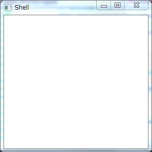
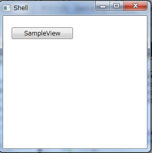

# Prismで複合アプリケーションを作り始めるまでの手順
## Requires
- Visual Studio 2010
## License
- Apache License, Version 2.0
## Technologies
- WPF
## Topics
- Prism
## Updated
- 01/13/2012
## Description

<h1>はじめに</h1>

<a href="http://compositewpf.codeplex.com/">Prism</a>は、MVVMアプリケーションを作るための機能を提供しているライブラリですが、本来はComposite Application Guidance for WPFとして登場した複合アプリケーションを作るためのものになります。

ここでは、MEFをベースにしてPrismで複合アプリケーションを作り始めるまでの手順を示します。

<h1>プロジェクトの作成から参照の設定まで</h1>

まず、WPFアプリケーションを作成します。ここではPrismEduという名前で作成しました。そして、NuGetでPrismで検索して出てくる下記のライブラリを追加します。

<ul>
<li>Prism </li><li>Prism.MefExtensions </li></ul>

そして、参照の追加からMEFを追加します。追加するのは、下記のものになります。

<ul>
<li><a class="libraryLink" href="http://msdn.microsoft.com/ja-JP/library/System.ComponentModel.Composition.aspx" target="_blank" title="Auto generated link to System.ComponentModel.Composition">System.ComponentModel.Composition</a> </li></ul>
<h1>Shellの作成</h1>

次に、Shellを作成します。MainWindow.xamlを消して新規作成からWindowをShellという名前で作成します。作成したら、XAMLを下記のように修正します。（RegionなどPrismの基本についてはヘルプなどを参照してください）

XAML

スクリプトの編集|Remove

xaml

<pre class="xaml">&lt;Window&nbsp;x:Class=&quot;PrismEdu.Shell&quot;&nbsp;
&nbsp;&nbsp;&nbsp;&nbsp;&nbsp;&nbsp;&nbsp;&nbsp;xmlns=&quot;http://schemas.microsoft.com/winfx/2006/xaml/presentation&quot;&nbsp;
&nbsp;&nbsp;&nbsp;&nbsp;&nbsp;&nbsp;&nbsp;&nbsp;xmlns:x=&quot;http://schemas.microsoft.com/winfx/2006/xaml&quot;&nbsp;
&nbsp;&nbsp;&nbsp;&nbsp;&nbsp;&nbsp;&nbsp;&nbsp;xmlns:prism=&quot;http://www.codeplex.com/prism&quot;&nbsp;
&nbsp;&nbsp;&nbsp;&nbsp;&nbsp;&nbsp;&nbsp;&nbsp;Title=&quot;Shell&quot;&nbsp;Height=&quot;300&quot;&nbsp;Width=&quot;300&quot;&gt;&nbsp;
&nbsp;&nbsp;&nbsp;&nbsp;&lt;Grid&gt;&nbsp;
&nbsp;&nbsp;&nbsp;&nbsp;&nbsp;&nbsp;&nbsp;&nbsp;&lt;!--&nbsp;メインのリージョン&nbsp;--&gt;&nbsp;
&nbsp;&nbsp;&nbsp;&nbsp;&nbsp;&nbsp;&nbsp;&nbsp;&lt;ContentControl&nbsp;
&nbsp;&nbsp;&nbsp;&nbsp;&nbsp;&nbsp;&nbsp;&nbsp;&nbsp;&nbsp;&nbsp;&nbsp;Focusable=&quot;False&quot;&nbsp;
&nbsp;&nbsp;&nbsp;&nbsp;&nbsp;&nbsp;&nbsp;&nbsp;&nbsp;&nbsp;&nbsp;&nbsp;prism:RegionManager.RegionName=&quot;Main&quot;&nbsp;/&gt;&nbsp;
&nbsp;&nbsp;&nbsp;&nbsp;&lt;/Grid&gt;&nbsp;
&lt;/Window&gt;&nbsp;
</pre>

そして、MEFからこのShellを取得できるようにExport属性をShellクラスに追加します。

C#

スクリプトの編集|Remove

csharp

<pre class="js">using&nbsp;<a class="libraryLink" href="http://msdn.microsoft.com/ja-JP/library/System.ComponentModel.Composition.aspx" target="_blank" title="Auto generated link to System.ComponentModel.Composition">System.ComponentModel.Composition</a>;&nbsp;
using&nbsp;<a class="libraryLink" href="http://msdn.microsoft.com/ja-JP/library/System.Windows.aspx" target="_blank" title="Auto generated link to System.Windows">System.Windows</a>;&nbsp;
&nbsp;
namespace&nbsp;PrismEdu&nbsp;
{&nbsp;
&nbsp;&nbsp;&nbsp;&nbsp;[Export]&nbsp;
&nbsp;&nbsp;&nbsp;&nbsp;public&nbsp;partial&nbsp;class&nbsp;Shell&nbsp;:&nbsp;Window&nbsp;
&nbsp;&nbsp;&nbsp;&nbsp;{&nbsp;
&nbsp;&nbsp;&nbsp;&nbsp;&nbsp;&nbsp;&nbsp;&nbsp;public&nbsp;Shell()&nbsp;
&nbsp;&nbsp;&nbsp;&nbsp;&nbsp;&nbsp;&nbsp;&nbsp;{&nbsp;
&nbsp;&nbsp;&nbsp;&nbsp;&nbsp;&nbsp;&nbsp;&nbsp;&nbsp;&nbsp;&nbsp;&nbsp;InitializeComponent();&nbsp;
&nbsp;&nbsp;&nbsp;&nbsp;&nbsp;&nbsp;&nbsp;&nbsp;}&nbsp;
&nbsp;&nbsp;&nbsp;&nbsp;}&nbsp;
}&nbsp;
</pre>

&nbsp;

<h1 class="endscriptcode">&nbsp;Bootstrapperの作成</h1>

次に、Bootstrapperを作成します。MEFを使用する場合のBootstrapperの基本クラスは「<a class="libraryLink" href="http://msdn.microsoft.com/ja-JP/library/Microsoft.Practices.Prism.MefExtensions.MefBootstrapper.aspx" target="_blank" title="Auto generated link to Microsoft.Practices.Prism.MefExtensions.MefBootstrapper">Microsoft.Practices.Prism.MefExtensions.MefBootstrapper</a>」になります。このクラスを継承してスタートアップの処理を追加します。

C#

スクリプトの編集|Remove

csharp

<pre class="csharp">using&nbsp;System;&nbsp;
using&nbsp;<a class="libraryLink" href="http://msdn.microsoft.com/ja-JP/library/System.Collections.Generic.aspx" target="_blank" title="Auto generated link to System.Collections.Generic">System.Collections.Generic</a>;&nbsp;
using&nbsp;<a class="libraryLink" href="http://msdn.microsoft.com/ja-JP/library/System.Linq.aspx" target="_blank" title="Auto generated link to System.Linq">System.Linq</a>;&nbsp;
using&nbsp;<a class="libraryLink" href="http://msdn.microsoft.com/ja-JP/library/System.Text.aspx" target="_blank" title="Auto generated link to System.Text">System.Text</a>;&nbsp;
using&nbsp;<a class="libraryLink" href="http://msdn.microsoft.com/ja-JP/library/Microsoft.Practices.Prism.MefExtensions.aspx" target="_blank" title="Auto generated link to Microsoft.Practices.Prism.MefExtensions">Microsoft.Practices.Prism.MefExtensions</a>;&nbsp;
using&nbsp;<a class="libraryLink" href="http://msdn.microsoft.com/ja-JP/library/System.Windows.aspx" target="_blank" title="Auto generated link to System.Windows">System.Windows</a>;&nbsp;
using&nbsp;<a class="libraryLink" href="http://msdn.microsoft.com/ja-JP/library/System.ComponentModel.Composition.Hosting.aspx" target="_blank" title="Auto generated link to System.ComponentModel.Composition.Hosting">System.ComponentModel.Composition.Hosting</a>;&nbsp;
using&nbsp;<a class="libraryLink" href="http://msdn.microsoft.com/ja-JP/library/System.Reflection.aspx" target="_blank" title="Auto generated link to System.Reflection">System.Reflection</a>;&nbsp;
&nbsp;
namespace&nbsp;PrismEdu&nbsp;
{&nbsp;
&nbsp;&nbsp;&nbsp;&nbsp;public&nbsp;class&nbsp;Bootstrapper&nbsp;
&nbsp;&nbsp;&nbsp;&nbsp;&nbsp;&nbsp;&nbsp;&nbsp;:&nbsp;MefBootstrapper&nbsp;
&nbsp;&nbsp;&nbsp;&nbsp;{&nbsp;
&nbsp;&nbsp;&nbsp;&nbsp;&nbsp;&nbsp;&nbsp;&nbsp;//&nbsp;MEFのカタログの初期化&nbsp;
&nbsp;&nbsp;&nbsp;&nbsp;&nbsp;&nbsp;&nbsp;&nbsp;protected&nbsp;override&nbsp;void&nbsp;ConfigureAggregateCatalog()&nbsp;
&nbsp;&nbsp;&nbsp;&nbsp;&nbsp;&nbsp;&nbsp;&nbsp;{&nbsp;
&nbsp;&nbsp;&nbsp;&nbsp;&nbsp;&nbsp;&nbsp;&nbsp;&nbsp;&nbsp;&nbsp;&nbsp;base.ConfigureAggregateCatalog();&nbsp;
&nbsp;&nbsp;&nbsp;&nbsp;&nbsp;&nbsp;&nbsp;&nbsp;&nbsp;&nbsp;&nbsp;&nbsp;//&nbsp;自分自身とカレントディレクトリを対象にして全てのアセンブリを取り込む&nbsp;
&nbsp;&nbsp;&nbsp;&nbsp;&nbsp;&nbsp;&nbsp;&nbsp;&nbsp;&nbsp;&nbsp;&nbsp;this.AggregateCatalog.Catalogs.Add(&nbsp;
&nbsp;&nbsp;&nbsp;&nbsp;&nbsp;&nbsp;&nbsp;&nbsp;&nbsp;&nbsp;&nbsp;&nbsp;&nbsp;&nbsp;&nbsp;&nbsp;new&nbsp;AssemblyCatalog(Assembly.GetExecutingAssembly()));&nbsp;
&nbsp;&nbsp;&nbsp;&nbsp;&nbsp;&nbsp;&nbsp;&nbsp;&nbsp;&nbsp;&nbsp;&nbsp;this.AggregateCatalog.Catalogs.Add(&nbsp;
&nbsp;&nbsp;&nbsp;&nbsp;&nbsp;&nbsp;&nbsp;&nbsp;&nbsp;&nbsp;&nbsp;&nbsp;&nbsp;&nbsp;&nbsp;&nbsp;new&nbsp;DirectoryCatalog(&quot;.&quot;));&nbsp;
&nbsp;&nbsp;&nbsp;&nbsp;&nbsp;&nbsp;&nbsp;&nbsp;}&nbsp;
&nbsp;
&nbsp;&nbsp;&nbsp;&nbsp;&nbsp;&nbsp;&nbsp;&nbsp;//&nbsp;Shellの作成&nbsp;
&nbsp;&nbsp;&nbsp;&nbsp;&nbsp;&nbsp;&nbsp;&nbsp;protected&nbsp;override&nbsp;DependencyObject&nbsp;CreateShell()&nbsp;
&nbsp;&nbsp;&nbsp;&nbsp;&nbsp;&nbsp;&nbsp;&nbsp;{&nbsp;
&nbsp;&nbsp;&nbsp;&nbsp;&nbsp;&nbsp;&nbsp;&nbsp;&nbsp;&nbsp;&nbsp;&nbsp;return&nbsp;this.Container.GetExportedValue&lt;Shell&gt;();&nbsp;
&nbsp;&nbsp;&nbsp;&nbsp;&nbsp;&nbsp;&nbsp;&nbsp;}&nbsp;
&nbsp;
&nbsp;&nbsp;&nbsp;&nbsp;&nbsp;&nbsp;&nbsp;&nbsp;//&nbsp;ウィンドウの表示&nbsp;
&nbsp;&nbsp;&nbsp;&nbsp;&nbsp;&nbsp;&nbsp;&nbsp;protected&nbsp;override&nbsp;void&nbsp;InitializeShell()&nbsp;
&nbsp;&nbsp;&nbsp;&nbsp;&nbsp;&nbsp;&nbsp;&nbsp;{&nbsp;
&nbsp;&nbsp;&nbsp;&nbsp;&nbsp;&nbsp;&nbsp;&nbsp;&nbsp;&nbsp;&nbsp;&nbsp;base.InitializeShell();&nbsp;
&nbsp;&nbsp;&nbsp;&nbsp;&nbsp;&nbsp;&nbsp;&nbsp;&nbsp;&nbsp;&nbsp;&nbsp;//&nbsp;ShellをMainWindowに設定して表示&nbsp;
&nbsp;&nbsp;&nbsp;&nbsp;&nbsp;&nbsp;&nbsp;&nbsp;&nbsp;&nbsp;&nbsp;&nbsp;Application.Current.MainWindow&nbsp;=&nbsp;this.Shell&nbsp;as&nbsp;Window;&nbsp;
&nbsp;&nbsp;&nbsp;&nbsp;&nbsp;&nbsp;&nbsp;&nbsp;&nbsp;&nbsp;&nbsp;&nbsp;Application.Current.MainWindow.Show();&nbsp;
&nbsp;&nbsp;&nbsp;&nbsp;&nbsp;&nbsp;&nbsp;&nbsp;}&nbsp;
&nbsp;&nbsp;&nbsp;&nbsp;}&nbsp;
}&nbsp;
</pre>

&nbsp;そして、App.xamlでStartupUriを消してStartupイベントを登録します。

XAML

スクリプトの編集|Remove

xaml

<pre class="js">&lt;Application&nbsp;x:Class=&quot;PrismEdu.App&quot;&nbsp;
&nbsp;&nbsp;&nbsp;&nbsp;&nbsp;&nbsp;&nbsp;&nbsp;&nbsp;&nbsp;&nbsp;&nbsp;&nbsp;xmlns=&quot;http://schemas.microsoft.com/winfx/2006/xaml/presentation&quot;&nbsp;
&nbsp;&nbsp;&nbsp;&nbsp;&nbsp;&nbsp;&nbsp;&nbsp;&nbsp;&nbsp;&nbsp;&nbsp;&nbsp;xmlns:x=&quot;http://schemas.microsoft.com/winfx/2006/xaml&quot;&nbsp;
&nbsp;&nbsp;&nbsp;&nbsp;&nbsp;&nbsp;&nbsp;&nbsp;&nbsp;&nbsp;&nbsp;&nbsp;&nbsp;Startup=&quot;Application_Startup&quot;&gt;&nbsp;
&nbsp;&nbsp;&nbsp;&nbsp;&lt;Application.Resources&gt;&nbsp;
&nbsp;&nbsp;&nbsp;&nbsp;&nbsp;&nbsp;&nbsp;&nbsp;&nbsp;&nbsp;
&nbsp;&nbsp;&nbsp;&nbsp;&lt;/Application.Resources&gt;&nbsp;
&lt;/Application&gt;&nbsp;
</pre>

&nbsp;Startupイベントでは先ほど作成したBootstrapperを使ってアプリケーションの開始処理を書きます。コードは下記のようになります。

C#

スクリプトの編集|Remove

csharp

<pre class="js">using&nbsp;<a class="libraryLink" href="http://msdn.microsoft.com/ja-JP/library/System.Windows.aspx" target="_blank" title="Auto generated link to System.Windows">System.Windows</a>;&nbsp;
&nbsp;
namespace&nbsp;PrismEdu&nbsp;
{&nbsp;
&nbsp;&nbsp;&nbsp;&nbsp;public&nbsp;partial&nbsp;class&nbsp;App&nbsp;:&nbsp;Application&nbsp;
&nbsp;&nbsp;&nbsp;&nbsp;{&nbsp;
&nbsp;&nbsp;&nbsp;&nbsp;&nbsp;&nbsp;&nbsp;&nbsp;private&nbsp;void&nbsp;Application_Startup(object&nbsp;sender,&nbsp;StartupEventArgs&nbsp;e)&nbsp;
&nbsp;&nbsp;&nbsp;&nbsp;&nbsp;&nbsp;&nbsp;&nbsp;{&nbsp;
&nbsp;&nbsp;&nbsp;&nbsp;&nbsp;&nbsp;&nbsp;&nbsp;&nbsp;&nbsp;&nbsp;&nbsp;//&nbsp;開始処理&nbsp;
&nbsp;&nbsp;&nbsp;&nbsp;&nbsp;&nbsp;&nbsp;&nbsp;&nbsp;&nbsp;&nbsp;&nbsp;var&nbsp;b&nbsp;=&nbsp;new&nbsp;Bootstrapper();&nbsp;
&nbsp;&nbsp;&nbsp;&nbsp;&nbsp;&nbsp;&nbsp;&nbsp;&nbsp;&nbsp;&nbsp;&nbsp;b.Run();&nbsp;
&nbsp;&nbsp;&nbsp;&nbsp;&nbsp;&nbsp;&nbsp;&nbsp;}&nbsp;
&nbsp;&nbsp;&nbsp;&nbsp;}&nbsp;
}&nbsp;
</pre>

<h1 class="endscriptcode">&nbsp;実行して動作確認</h1>

これで、空のShellだけが起動するアプリケーションが完成です。実行すると、下図のようにウィンドウが表示されます。

&nbsp;

<h1 class="endscriptcode">モジュールの追加</h1>

MEFをベースにしたPrismのアプリケーションを作成する土台が出来ました。最後にモジュールの追加方法について説明します。モジュールは、MEFを使った場合は属性を追加することで簡単に作成できます。

C#

スクリプトの編集|Remove

csharp

<pre class="js">using&nbsp;System;&nbsp;
using&nbsp;<a class="libraryLink" href="http://msdn.microsoft.com/ja-JP/library/System.Collections.Generic.aspx" target="_blank" title="Auto generated link to System.Collections.Generic">System.Collections.Generic</a>;&nbsp;
using&nbsp;<a class="libraryLink" href="http://msdn.microsoft.com/ja-JP/library/System.Linq.aspx" target="_blank" title="Auto generated link to System.Linq">System.Linq</a>;&nbsp;
using&nbsp;<a class="libraryLink" href="http://msdn.microsoft.com/ja-JP/library/System.Text.aspx" target="_blank" title="Auto generated link to System.Text">System.Text</a>;&nbsp;
using&nbsp;<a class="libraryLink" href="http://msdn.microsoft.com/ja-JP/library/Microsoft.Practices.Prism.Modularity.aspx" target="_blank" title="Auto generated link to Microsoft.Practices.Prism.Modularity">Microsoft.Practices.Prism.Modularity</a>;&nbsp;
using&nbsp;<a class="libraryLink" href="http://msdn.microsoft.com/ja-JP/library/Microsoft.Practices.Prism.MefExtensions.Modularity.aspx" target="_blank" title="Auto generated link to Microsoft.Practices.Prism.MefExtensions.Modularity">Microsoft.Practices.Prism.MefExtensions.Modularity</a>;&nbsp;
&nbsp;
namespace&nbsp;PrismEdu&nbsp;
{&nbsp;
&nbsp;&nbsp;&nbsp;&nbsp;[ModuleExport(typeof(SampleModule))]&nbsp;
&nbsp;&nbsp;&nbsp;&nbsp;public&nbsp;class&nbsp;SampleModule&nbsp;:&nbsp;IModule&nbsp;
&nbsp;&nbsp;&nbsp;&nbsp;{&nbsp;
&nbsp;&nbsp;&nbsp;&nbsp;&nbsp;&nbsp;&nbsp;&nbsp;public&nbsp;void&nbsp;Initialize()&nbsp;
&nbsp;&nbsp;&nbsp;&nbsp;&nbsp;&nbsp;&nbsp;&nbsp;{&nbsp;
&nbsp;&nbsp;&nbsp;&nbsp;&nbsp;&nbsp;&nbsp;&nbsp;}&nbsp;
&nbsp;&nbsp;&nbsp;&nbsp;}&nbsp;
}&nbsp;
</pre>

&nbsp;このようにMEFを使った場合は簡単に、モジュールを追加することが出来ます。動作確認のためSampleViewというボタンを置いただけのUserControlを表示するように書き換えてみます。まず、SampleViewクラスにExport属性を追加してMEFでの管理対象にします。このとき名前をつけてExportするようにします。

C#

スクリプトの編集|Remove

csharp

<pre class="js">using&nbsp;<a class="libraryLink" href="http://msdn.microsoft.com/ja-JP/library/System.ComponentModel.Composition.aspx" target="_blank" title="Auto generated link to System.ComponentModel.Composition">System.ComponentModel.Composition</a>;&nbsp;
using&nbsp;<a class="libraryLink" href="http://msdn.microsoft.com/ja-JP/library/System.Windows.Controls.aspx" target="_blank" title="Auto generated link to System.Windows.Controls">System.Windows.Controls</a>;&nbsp;
&nbsp;
namespace&nbsp;PrismEdu&nbsp;
{&nbsp;
&nbsp;&nbsp;&nbsp;&nbsp;///&nbsp;&lt;summary&gt;&nbsp;
&nbsp;&nbsp;&nbsp;&nbsp;///&nbsp;SampleView.xaml&nbsp;の相互作用ロジック&nbsp;
&nbsp;&nbsp;&nbsp;&nbsp;///&nbsp;&lt;/summary&gt;&nbsp;
&nbsp;&nbsp;&nbsp;&nbsp;[Export(&quot;SampleView&quot;,&nbsp;typeof(SampleView))]&nbsp;
&nbsp;&nbsp;&nbsp;&nbsp;public&nbsp;partial&nbsp;class&nbsp;SampleView&nbsp;:&nbsp;UserControl&nbsp;
&nbsp;&nbsp;&nbsp;&nbsp;{&nbsp;
&nbsp;&nbsp;&nbsp;&nbsp;&nbsp;&nbsp;&nbsp;&nbsp;public&nbsp;SampleView()&nbsp;
&nbsp;&nbsp;&nbsp;&nbsp;&nbsp;&nbsp;&nbsp;&nbsp;{&nbsp;
&nbsp;&nbsp;&nbsp;&nbsp;&nbsp;&nbsp;&nbsp;&nbsp;&nbsp;&nbsp;&nbsp;&nbsp;InitializeComponent();&nbsp;
&nbsp;&nbsp;&nbsp;&nbsp;&nbsp;&nbsp;&nbsp;&nbsp;}&nbsp;
&nbsp;&nbsp;&nbsp;&nbsp;}&nbsp;
}&nbsp;
</pre>

ここで指定した名前を使って画面に表示します。モジュールのコードを下記に示します。

C#

スクリプトの編集|Remove

csharp

<pre class="csharp">using&nbsp;<a class="libraryLink" href="http://msdn.microsoft.com/ja-JP/library/System.ComponentModel.Composition.aspx" target="_blank" title="Auto generated link to System.ComponentModel.Composition">System.ComponentModel.Composition</a>;&nbsp;
using&nbsp;<a class="libraryLink" href="http://msdn.microsoft.com/ja-JP/library/Microsoft.Practices.Prism.MefExtensions.Modularity.aspx" target="_blank" title="Auto generated link to Microsoft.Practices.Prism.MefExtensions.Modularity">Microsoft.Practices.Prism.MefExtensions.Modularity</a>;&nbsp;
using&nbsp;<a class="libraryLink" href="http://msdn.microsoft.com/ja-JP/library/Microsoft.Practices.Prism.Modularity.aspx" target="_blank" title="Auto generated link to Microsoft.Practices.Prism.Modularity">Microsoft.Practices.Prism.Modularity</a>;&nbsp;
using&nbsp;<a class="libraryLink" href="http://msdn.microsoft.com/ja-JP/library/Microsoft.Practices.Prism.Regions.aspx" target="_blank" title="Auto generated link to Microsoft.Practices.Prism.Regions">Microsoft.Practices.Prism.Regions</a>;&nbsp;
&nbsp;
namespace&nbsp;PrismEdu&nbsp;
{&nbsp;
&nbsp;&nbsp;&nbsp;&nbsp;[ModuleExport(typeof(SampleModule))]&nbsp;
&nbsp;&nbsp;&nbsp;&nbsp;public&nbsp;class&nbsp;SampleModule&nbsp;:&nbsp;IModule&nbsp;
&nbsp;&nbsp;&nbsp;&nbsp;{&nbsp;
&nbsp;&nbsp;&nbsp;&nbsp;&nbsp;&nbsp;&nbsp;&nbsp;//&nbsp;PrismのコンポーネントはMEFから設定してもらう&nbsp;
&nbsp;&nbsp;&nbsp;&nbsp;&nbsp;&nbsp;&nbsp;&nbsp;[Import]&nbsp;
&nbsp;&nbsp;&nbsp;&nbsp;&nbsp;&nbsp;&nbsp;&nbsp;public&nbsp;IRegionManager&nbsp;RegionManager&nbsp;{&nbsp;get;&nbsp;set;&nbsp;}&nbsp;
&nbsp;
&nbsp;&nbsp;&nbsp;&nbsp;&nbsp;&nbsp;&nbsp;&nbsp;public&nbsp;void&nbsp;Initialize()&nbsp;
&nbsp;&nbsp;&nbsp;&nbsp;&nbsp;&nbsp;&nbsp;&nbsp;{&nbsp;
&nbsp;&nbsp;&nbsp;&nbsp;&nbsp;&nbsp;&nbsp;&nbsp;&nbsp;&nbsp;&nbsp;&nbsp;//&nbsp;MainのRegionにSampleViewを表示する&nbsp;
&nbsp;&nbsp;&nbsp;&nbsp;&nbsp;&nbsp;&nbsp;&nbsp;&nbsp;&nbsp;&nbsp;&nbsp;this.RegionManager.RequestNavigate(&nbsp;
&nbsp;&nbsp;&nbsp;&nbsp;&nbsp;&nbsp;&nbsp;&nbsp;&nbsp;&nbsp;&nbsp;&nbsp;&nbsp;&nbsp;&nbsp;&nbsp;&quot;Main&quot;,&nbsp;&quot;SampleView&quot;);&nbsp;
&nbsp;&nbsp;&nbsp;&nbsp;&nbsp;&nbsp;&nbsp;&nbsp;}&nbsp;
&nbsp;&nbsp;&nbsp;&nbsp;}&nbsp;
}&nbsp;
</pre>

&nbsp;実行するとSampleViewが表示されます。

<h1 class="endscriptcode">まとめ</h1>

以上で、簡単にですがMEFをベースにしたPrismアプリケーションの土台を作るまでの手順を説明しました。これをベースにRegionの設計をしたりModule分割をどうするか設計してアプリケーションを作りこんでいくことになると思います。以上です。

