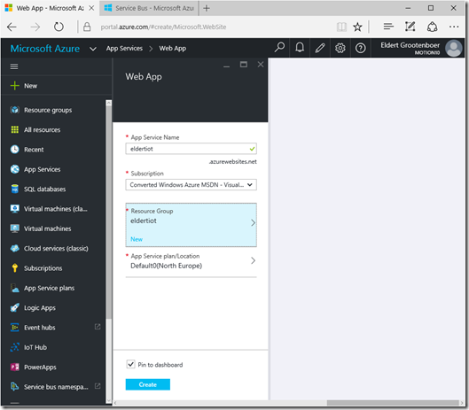
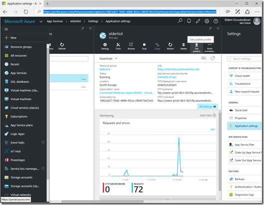
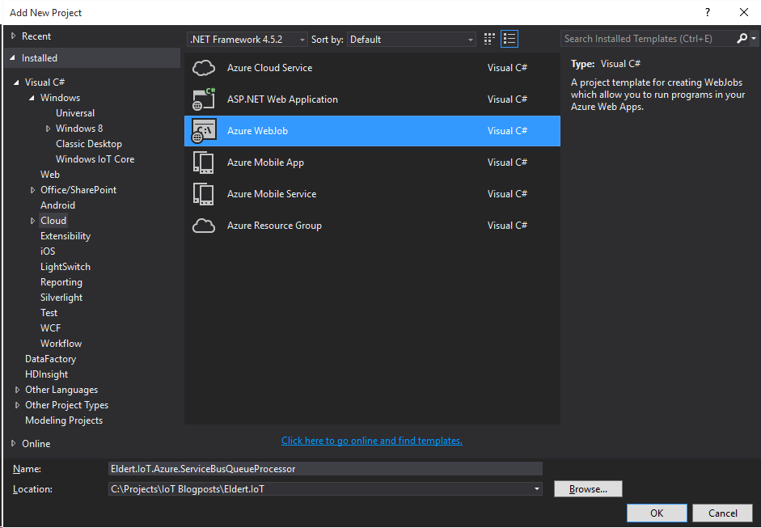
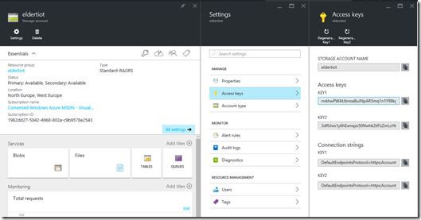
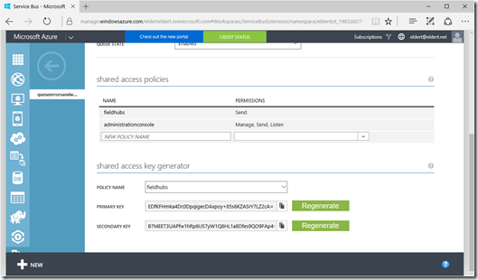
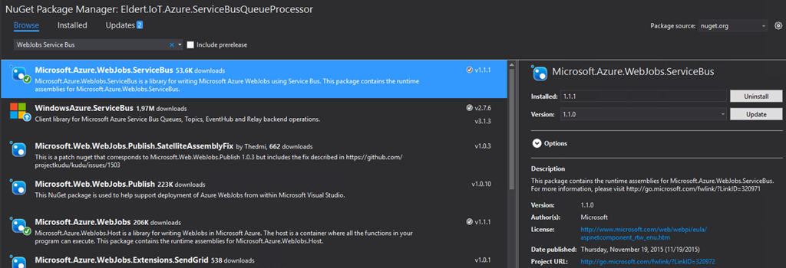

# Processing Service Bus Queue Using WebJobs
## Requires
- Visual Studio 2015
## License
- MIT
## Technologies
- Microsoft Azure
- WebJobs
- Azure SQL Database
## Topics
- integration
- WebJobs
## Updated
- 04/19/2016
## Description

<h1>Introduction</h1>

<em>A WebJob is a simple way to set up a background job, which can process continuously or on a schedule. WebJobs differ from a cloud service as it gives you get less fine-grained control over your processing environment, making it a more true PaaS service.
 This sample is part of my blogpost which you can find <a href="http://blog.eldert.net/?p=1355" target="_blank">
here</a>.</em>

<h1>Description</h1>

We will need a Web App to host our WebJob, so lets create one in the Azure Portal. You can create a new Web App by going to App Services, and selecting New. 
 

To simplify our deployment later on, we will download the publish profile for our Web App once it has been created. 
 

 
Next we will create a new project for our WebJob, so be sure to install the <a href="https://azure.microsoft.com/en-us/documentation/articles/websites-dotnet-webjobs-sdk/" target="_blank">
Azure WebJob SDK</a> if you don&rsquo;t have it yet. 
 

 
Once the project has been created, start by going to the App.Config, and setting the connection strings for the dashboard and storage. This should be in the format DefaultEndpointsProtocol=https;AccountName=NAME;AccountKey=KEY. Both the name and the key can
 be found in the settings of your storage account. 
 

 
We will also need to set the connection string for our Service Bus Queue, for which we will need a Shared Access Key with Manage permissions, as&nbsp;required by the WebJob&rsquo;s job host. 
 

 
And finally, we will also need to add the connection string to our Azure SQL database, which we will use from our Entity Framework library to communicate with the database.<strong>&nbsp;</strong><em>&nbsp;</em> 
 

XML

Edit|Remove

xml

<pre class="js">&lt;connectionStrings&gt;&nbsp;
&nbsp;&nbsp;&nbsp;&nbsp;&lt;add&nbsp;name=&quot;AzureWebJobsDashboard&quot;&nbsp;connectionString=&quot;DefaultEndpointsProtocol=https;AccountName=eldertiot;AccountKey=xxxxxxxxxxxxxxxxxxxxxxxxxxxxx&quot;&nbsp;/&gt;&nbsp;
&nbsp;&nbsp;&nbsp;&nbsp;&lt;add&nbsp;name=&quot;AzureWebJobsStorage&quot;&nbsp;connectionString=&quot;DefaultEndpointsProtocol=https;AccountName=eldertiot;AccountKey=xxxxxxxxxxxxxxxxxxxxxxxxxxxxx&quot;&nbsp;/&gt;&nbsp;
&nbsp;&nbsp;&nbsp;&nbsp;&lt;add&nbsp;name=&quot;AzureWebJobsServiceBus&quot;&nbsp;connectionString=&quot;Endpoint=sb://eldertiot.servicebus.windows.net/;SharedAccessKeyName=administrationconsole;SharedAccessKey=xxxxxxxxxxxxxxxxxxxxxxxxxxxxx&quot;&nbsp;/&gt;&nbsp;
&nbsp;&nbsp;&nbsp;&nbsp;&lt;add&nbsp;name=&quot;IoTDatabaseContext&quot;&nbsp;connectionString=&quot;Server=tcp:eldertiot.database.windows.net,1433;Database=eldertiot;User&nbsp;ID=Eldert@eldertiot;Password=xxxxxxxxxxxxxxx;Encrypt=True;TrustServerCertificate=False;Connection&nbsp;Timeout=30;&quot;&nbsp;providerName=&quot;System.Data.SqlClient&quot;/&gt;&nbsp;
&lt;/connectionStrings&gt;&nbsp;
</pre>

&nbsp;

We also have to add the AzureWebJobsDashboard connection string to the Application settings of the Web App in the Azure portal, so the logs can be stored in your storage. 
 
<strong>&nbsp;</strong><em>&nbsp;</em>

&nbsp;

 
By default a trigger is added to the WebJob for storage queues, however as we want to work with a Service Bus Queue, we will need to add the Microsoft.Azure.WebJob.ServiceBus NuGet package to our project. 
 
<strong>&nbsp;</strong><em>&nbsp;</em>

 
Now that we have all configuration in place, we&rsquo;ll go and implement the code in our WebJob. Open up the Functions class which was created with inside your WebJob project. We will change the trigger type to ServiceBusTrigger so we can get triggers from
 our Service Bus Queue. As we are using a Service Bus trigger, we will also need to change the type of the message to be a BrokeredMessage instead of a string. When we have received the message, we will save its contents to the database, using
<a href="https://code.msdn.microsoft.com/Entity-Framework-Code-e9000ebc" target="_blank">
this library</a>.<strong></strong><em></em>

&nbsp;

C#

Edit|Remove

csharp

<pre class="js">using&nbsp;System;&nbsp;
using&nbsp;<a class="libraryLink" href="https://msdn.microsoft.com/en-US/library/System.IO.aspx" target="_blank" title="Auto generated link to System.IO">System.IO</a>;&nbsp;
&nbsp;&nbsp;
using&nbsp;Eldert.IoT.Data.DataTypes;&nbsp;
&nbsp;&nbsp;
using&nbsp;Microsoft.Azure.WebJobs;&nbsp;
using&nbsp;<a class="libraryLink" href="https://msdn.microsoft.com/en-US/library/Microsoft.ServiceBus.Messaging.aspx" target="_blank" title="Auto generated link to Microsoft.ServiceBus.Messaging">Microsoft.ServiceBus.Messaging</a>;&nbsp;
&nbsp;&nbsp;
namespace&nbsp;Eldert.IoT.Azure.ServiceBusQueueProcessor&nbsp;
{&nbsp;
&nbsp;&nbsp;&nbsp;&nbsp;public&nbsp;class&nbsp;Functions&nbsp;
&nbsp;&nbsp;&nbsp;&nbsp;{&nbsp;
&nbsp;&nbsp;&nbsp;&nbsp;&nbsp;&nbsp;&nbsp;&nbsp;private&nbsp;static&nbsp;readonly&nbsp;IoTDatabaseContext&nbsp;database&nbsp;=&nbsp;new&nbsp;IoTDatabaseContext();&nbsp;
&nbsp;&nbsp;
&nbsp;&nbsp;&nbsp;&nbsp;&nbsp;&nbsp;&nbsp;&nbsp;///&nbsp;&lt;summary&gt;&nbsp;
&nbsp;&nbsp;&nbsp;&nbsp;&nbsp;&nbsp;&nbsp;&nbsp;///&nbsp;This&nbsp;function&nbsp;will&nbsp;get&nbsp;triggered/executed&nbsp;when&nbsp;a&nbsp;new&nbsp;message&nbsp;is&nbsp;written&nbsp;on&nbsp;an&nbsp;Azure&nbsp;Service&nbsp;Bus&nbsp;Queue.&nbsp;
&nbsp;&nbsp;&nbsp;&nbsp;&nbsp;&nbsp;&nbsp;&nbsp;///&nbsp;&lt;/summary&gt;&nbsp;
&nbsp;&nbsp;&nbsp;&nbsp;&nbsp;&nbsp;&nbsp;&nbsp;public&nbsp;static&nbsp;void&nbsp;ProcessQueueMessage([ServiceBusTrigger(&quot;queueerrorsandwarnings&quot;)]&nbsp;BrokeredMessage&nbsp;message,&nbsp;TextWriter&nbsp;log)&nbsp;
&nbsp;&nbsp;&nbsp;&nbsp;&nbsp;&nbsp;&nbsp;&nbsp;{&nbsp;
&nbsp;&nbsp;&nbsp;&nbsp;&nbsp;&nbsp;&nbsp;&nbsp;&nbsp;&nbsp;&nbsp;&nbsp;try&nbsp;
&nbsp;&nbsp;&nbsp;&nbsp;&nbsp;&nbsp;&nbsp;&nbsp;&nbsp;&nbsp;&nbsp;&nbsp;{&nbsp;
&nbsp;&nbsp;&nbsp;&nbsp;&nbsp;&nbsp;&nbsp;&nbsp;&nbsp;&nbsp;&nbsp;&nbsp;&nbsp;&nbsp;&nbsp;&nbsp;log.WriteLine($&quot;Processing&nbsp;message:&nbsp;{message.Properties[&quot;exceptionmessage&quot;]}&nbsp;Ship:&nbsp;{message.Properties[&quot;ship&quot;]}&quot;);&nbsp;
&nbsp;&nbsp;
&nbsp;&nbsp;&nbsp;&nbsp;&nbsp;&nbsp;&nbsp;&nbsp;&nbsp;&nbsp;&nbsp;&nbsp;&nbsp;&nbsp;&nbsp;&nbsp;//&nbsp;Add&nbsp;the&nbsp;message&nbsp;we&nbsp;received&nbsp;from&nbsp;our&nbsp;queue&nbsp;to&nbsp;the&nbsp;database&nbsp;
&nbsp;&nbsp;&nbsp;&nbsp;&nbsp;&nbsp;&nbsp;&nbsp;&nbsp;&nbsp;&nbsp;&nbsp;&nbsp;&nbsp;&nbsp;&nbsp;database.ErrorAndWarningsEntries.Add(new&nbsp;ErrorAndWarning()&nbsp;
&nbsp;&nbsp;&nbsp;&nbsp;&nbsp;&nbsp;&nbsp;&nbsp;&nbsp;&nbsp;&nbsp;&nbsp;&nbsp;&nbsp;&nbsp;&nbsp;{&nbsp;
&nbsp;&nbsp;&nbsp;&nbsp;&nbsp;&nbsp;&nbsp;&nbsp;&nbsp;&nbsp;&nbsp;&nbsp;&nbsp;&nbsp;&nbsp;&nbsp;&nbsp;&nbsp;&nbsp;&nbsp;CreatedDateTime&nbsp;=&nbsp;DateTime.Parse(message.Properties[&quot;time&quot;].ToString()),&nbsp;
&nbsp;&nbsp;&nbsp;&nbsp;&nbsp;&nbsp;&nbsp;&nbsp;&nbsp;&nbsp;&nbsp;&nbsp;&nbsp;&nbsp;&nbsp;&nbsp;&nbsp;&nbsp;&nbsp;&nbsp;ShipName&nbsp;=&nbsp;message.Properties[&quot;ship&quot;].ToString(),&nbsp;
&nbsp;&nbsp;&nbsp;&nbsp;&nbsp;&nbsp;&nbsp;&nbsp;&nbsp;&nbsp;&nbsp;&nbsp;&nbsp;&nbsp;&nbsp;&nbsp;&nbsp;&nbsp;&nbsp;&nbsp;Message&nbsp;=&nbsp;message.Properties[&quot;exceptionmessage&quot;].ToString()&nbsp;
&nbsp;&nbsp;&nbsp;&nbsp;&nbsp;&nbsp;&nbsp;&nbsp;&nbsp;&nbsp;&nbsp;&nbsp;&nbsp;&nbsp;&nbsp;&nbsp;});&nbsp;
&nbsp;&nbsp;
&nbsp;&nbsp;&nbsp;&nbsp;&nbsp;&nbsp;&nbsp;&nbsp;&nbsp;&nbsp;&nbsp;&nbsp;&nbsp;&nbsp;&nbsp;&nbsp;//&nbsp;Save&nbsp;changes&nbsp;in&nbsp;the&nbsp;database&nbsp;
&nbsp;&nbsp;&nbsp;&nbsp;&nbsp;&nbsp;&nbsp;&nbsp;&nbsp;&nbsp;&nbsp;&nbsp;&nbsp;&nbsp;&nbsp;&nbsp;database.SaveChanges();&nbsp;
&nbsp;&nbsp;&nbsp;&nbsp;&nbsp;&nbsp;&nbsp;&nbsp;&nbsp;&nbsp;&nbsp;&nbsp;}&nbsp;
&nbsp;&nbsp;&nbsp;&nbsp;&nbsp;&nbsp;&nbsp;&nbsp;&nbsp;&nbsp;&nbsp;&nbsp;catch&nbsp;(Exception&nbsp;exception)&nbsp;
&nbsp;&nbsp;&nbsp;&nbsp;&nbsp;&nbsp;&nbsp;&nbsp;&nbsp;&nbsp;&nbsp;&nbsp;{&nbsp;
&nbsp;&nbsp;&nbsp;&nbsp;&nbsp;&nbsp;&nbsp;&nbsp;&nbsp;&nbsp;&nbsp;&nbsp;&nbsp;&nbsp;&nbsp;&nbsp;log.WriteLine($&quot;Exception&nbsp;in&nbsp;ProcessQueueMessage:&nbsp;{exception}&quot;);&nbsp;
&nbsp;&nbsp;&nbsp;&nbsp;&nbsp;&nbsp;&nbsp;&nbsp;&nbsp;&nbsp;&nbsp;&nbsp;}&nbsp;
&nbsp;&nbsp;&nbsp;&nbsp;&nbsp;&nbsp;&nbsp;&nbsp;}&nbsp;
&nbsp;&nbsp;&nbsp;&nbsp;}&nbsp;
}&nbsp;
</pre>

&nbsp;

Next we will update the Program class, as we will need to register our Service Bus extension in the configuration of our job host.<strong></strong><em></em>

C#

Edit|Remove

csharp

<pre class="js">using&nbsp;Microsoft.Azure.WebJobs;&nbsp;
&nbsp;&nbsp;
namespace&nbsp;Eldert.IoT.Azure.ServiceBusQueueProcessor&nbsp;
{&nbsp;
&nbsp;&nbsp;&nbsp;&nbsp;//&nbsp;To&nbsp;learn&nbsp;more&nbsp;about&nbsp;Microsoft&nbsp;Azure&nbsp;WebJobs&nbsp;SDK,&nbsp;please&nbsp;see&nbsp;http://go.microsoft.com/fwlink/?LinkID=320976&nbsp;
&nbsp;&nbsp;&nbsp;&nbsp;class&nbsp;Program&nbsp;
&nbsp;&nbsp;&nbsp;&nbsp;{&nbsp;
&nbsp;&nbsp;&nbsp;&nbsp;&nbsp;&nbsp;&nbsp;&nbsp;//&nbsp;Please&nbsp;set&nbsp;the&nbsp;following&nbsp;connection&nbsp;strings&nbsp;in&nbsp;app.config&nbsp;for&nbsp;this&nbsp;WebJob&nbsp;to&nbsp;run:&nbsp;
&nbsp;&nbsp;&nbsp;&nbsp;&nbsp;&nbsp;&nbsp;&nbsp;//&nbsp;AzureWebJobsDashboard&nbsp;and&nbsp;AzureWebJobsStorage&nbsp;
&nbsp;&nbsp;&nbsp;&nbsp;&nbsp;&nbsp;&nbsp;&nbsp;static&nbsp;void&nbsp;Main()&nbsp;
&nbsp;&nbsp;&nbsp;&nbsp;&nbsp;&nbsp;&nbsp;&nbsp;{&nbsp;
&nbsp;&nbsp;&nbsp;&nbsp;&nbsp;&nbsp;&nbsp;&nbsp;&nbsp;&nbsp;&nbsp;&nbsp;//&nbsp;Create&nbsp;job&nbsp;host&nbsp;configuration&nbsp;
&nbsp;&nbsp;&nbsp;&nbsp;&nbsp;&nbsp;&nbsp;&nbsp;&nbsp;&nbsp;&nbsp;&nbsp;var&nbsp;config&nbsp;=&nbsp;new&nbsp;JobHostConfiguration();&nbsp;
&nbsp;&nbsp;
&nbsp;&nbsp;&nbsp;&nbsp;&nbsp;&nbsp;&nbsp;&nbsp;&nbsp;&nbsp;&nbsp;&nbsp;//&nbsp;Tell&nbsp;configuration&nbsp;we&nbsp;want&nbsp;to&nbsp;use&nbsp;Azure&nbsp;Service&nbsp;Bus&nbsp;
&nbsp;&nbsp;&nbsp;&nbsp;&nbsp;&nbsp;&nbsp;&nbsp;&nbsp;&nbsp;&nbsp;&nbsp;config.UseServiceBus();&nbsp;
&nbsp;&nbsp;
&nbsp;&nbsp;&nbsp;&nbsp;&nbsp;&nbsp;&nbsp;&nbsp;&nbsp;&nbsp;&nbsp;&nbsp;//&nbsp;Add&nbsp;the&nbsp;configuration&nbsp;to&nbsp;the&nbsp;job&nbsp;host&nbsp;
&nbsp;&nbsp;&nbsp;&nbsp;&nbsp;&nbsp;&nbsp;&nbsp;&nbsp;&nbsp;&nbsp;&nbsp;var&nbsp;host&nbsp;=&nbsp;new&nbsp;JobHost(config);&nbsp;
&nbsp;&nbsp;
&nbsp;&nbsp;&nbsp;&nbsp;&nbsp;&nbsp;&nbsp;&nbsp;&nbsp;&nbsp;&nbsp;&nbsp;//&nbsp;The&nbsp;following&nbsp;code&nbsp;ensures&nbsp;that&nbsp;the&nbsp;WebJob&nbsp;will&nbsp;be&nbsp;running&nbsp;continuously&nbsp;
&nbsp;&nbsp;&nbsp;&nbsp;&nbsp;&nbsp;&nbsp;&nbsp;&nbsp;&nbsp;&nbsp;&nbsp;host.RunAndBlock();&nbsp;
&nbsp;&nbsp;&nbsp;&nbsp;&nbsp;&nbsp;&nbsp;&nbsp;}&nbsp;
&nbsp;&nbsp;&nbsp;&nbsp;}&nbsp;
}&nbsp;
</pre>

<h1 class="endscriptcode"> 
More Information</h1>

<em>If you would like more information on how to publish and debug the application, you can find this&nbsp;in
<a href="http://blog.eldert.net/?p=1355" target="_blank">my blogpost</a>.&nbsp;<strong></strong><em></em></em>

