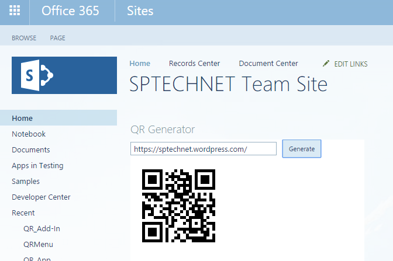

# QR Code Generator Add-In for SharePoint
## Requires
- Visual Studio 2015
## License
- MIT
## Technologies
- Javascript
- Sharepoint Online
- QR CODE
- SharePoint Server 2013
- SharePoint Foundation 2013
- apps for SharePoint
- SharePoint Add-ins
## Topics
- SharePoint
- QR CODE
- apps for SharePoint
- SharePoint 2013
## Updated
- 02/25/2016
## Description

<h1>Introduction</h1>

Using this you can generate QR Code for any text value and&nbsp;URL, this add-in can be add anywhere in you SharePoint Dashboard. Below you can see step by step instructions to&nbsp;develop&nbsp;this SharePoint Add-In.

<strong>Solution compatibility</strong>

This sample is tested with SharePoint Online

This sample also compatible with SharePoint 2013 and SharePoint 2016

 
<strong>To Modify and deploy this solution</strong>

Open visual studio 2015

On the file menu select Open -&gt; Project (Ctrl &#43; Shift &#43; o)

In the Open Project window navigate the directory and select solution file (.sln)

Open solution explorer windows and select project solution and click (F4) to open project propertiesChange the site URL property on the property window&nbsp;

Edit the code if required and click play button or (F5) in visual studio&nbsp;

&nbsp;

<strong>To add new resource file (.js or .css or Images) into project</strong>

Select a folder from solution explorer based on your file type (Images or Scripts or Content for CSS)

Right click and select &ldquo;Open Folder in File Explorer&rdquo; option

Now paste your files into the folderAgain in the solution explorer window at the top, click &ldquo;Show All Files&rdquo; icon

Now you can find the file without active icon, right click and select &ldquo;Include in Project&rdquo; Option

&nbsp;

Add new &ldquo;Client Web Part (Host Web)&rdquo; and select &ldquo;Create a new app web page for the client web part content&rdquo;, Edit newly created aspx page which is located in the Pages folder. Add below JS code and HTML. In the JS function I am passing
 Textbox value and Div name as parameter, JavaScript will generate QR code based on the content in Text box value.

&nbsp;

<h1><em style="font-size:10px">&nbsp; &nbsp;</em></h1>

&nbsp;

HTML

Edit|Remove

html
<pre class="hidden">&lt;%@ Page Language=&quot;C#&quot; Inherits=&quot;Microsoft.SharePoint.WebPartPages.WebPartPage, Microsoft.SharePoint, Version=15.0.0.0, Culture=neutral, PublicKeyToken=71e9bce111e9429c&quot; %&gt;

&lt;%@ Register TagPrefix=&quot;SharePoint&quot; Namespace=&quot;Microsoft.SharePoint.WebControls&quot; Assembly=&quot;Microsoft.SharePoint, Version=15.0.0.0, Culture=neutral, PublicKeyToken=71e9bce111e9429c&quot; %&gt;
&lt;%@ Register TagPrefix=&quot;Utilities&quot; Namespace=&quot;Microsoft.SharePoint.Utilities&quot; Assembly=&quot;Microsoft.SharePoint, Version=15.0.0.0, Culture=neutral, PublicKeyToken=71e9bce111e9429c&quot; %&gt;
&lt;%@ Register TagPrefix=&quot;WebPartPages&quot; Namespace=&quot;Microsoft.SharePoint.WebPartPages&quot; Assembly=&quot;Microsoft.SharePoint, Version=15.0.0.0, Culture=neutral, PublicKeyToken=71e9bce111e9429c&quot; %&gt;

&lt;WebPartPages:AllowFraming ID=&quot;AllowFraming&quot; runat=&quot;server&quot; /&gt;

&lt;html&gt;
&lt;head&gt;
    &lt;title&gt;&lt;/title&gt;

    &lt;script type=&quot;text/javascript&quot; src=&quot;../Scripts/jquery-1.9.1.min.js&quot;&gt;&lt;/script&gt;
    &lt;script type=&quot;text/javascript&quot; src=&quot;/_layouts/15/MicrosoftAjax.js&quot;&gt;&lt;/script&gt;
    &lt;script type=&quot;text/javascript&quot; src=&quot;/_layouts/15/sp.runtime.js&quot;&gt;&lt;/script&gt;
    &lt;script type=&quot;text/javascript&quot; src=&quot;/_layouts/15/sp.js&quot;&gt;&lt;/script&gt;
    &lt;script type=&quot;text/javascript&quot; src=&quot;../Scripts/initstrings.js&quot;&gt;&lt;/script&gt;
    &lt;script type=&quot;text/javascript&quot; src=&quot;../Scripts/qr.js&quot;&gt;&lt;/script&gt;
    &lt;script type=&quot;text/javascript&quot;&gt;
        // Set the style of the client web part page to be consistent with the host web.
        (function () {
            'use strict';

            var hostUrl = '';
            if (document.URL.indexOf('?') != -1) {
                var params = document.URL.split('?')[1].split('&amp;');
                for (var i = 0; i &lt; params.length; i&#43;&#43;) {
                    var p = decodeURIComponent(params[i]);
                    if (/^SPHostUrl=/i.test(p)) {
                        hostUrl = p.split('=')[1];
                        document.write('&lt;link rel=&quot;stylesheet&quot; href=&quot;' &#43; hostUrl &#43; '/_layouts/15/defaultcss.ashx&quot; /&gt;');
                        break;
                    }
                }
            }
            if (hostUrl == '') {
                document.write('&lt;link rel=&quot;stylesheet&quot; href=&quot;/_layouts/15/1033/styles/themable/corev15.css&quot; /&gt;');
            }
        })();

       
        function generatefn() {
            if ($('#QR_URL').val() != '')
                onLoadQrCode($('#QR_URL').val(), 'DivImage');
        }
    &lt;/script&gt;
&lt;/head&gt;
&lt;body&gt;
    &lt;input type=&quot;text&quot; id=&quot;QR_URL&quot; value=&quot;&quot; style=&quot;width:250px&quot; /&gt;&lt;input onclick=&quot;generatefn()&quot; type=&quot;button&quot; id=&quot;btnGenerate&quot; value=&quot;Generate&quot; /&gt;
    &lt;div id=&quot;DivImage&quot;&gt;&lt;/div&gt;
&lt;/body&gt;
&lt;/html&gt;
</pre>

<pre class="html">&lt;%@&nbsp;Page&nbsp;Language=&quot;C#&quot;&nbsp;Inherits=&quot;Microsoft.SharePoint.WebPartPages.WebPartPage,&nbsp;Microsoft.SharePoint,&nbsp;Version=15.0.0.0,&nbsp;Culture=neutral,&nbsp;PublicKeyToken=71e9bce111e9429c&quot;&nbsp;%&gt;&nbsp;
&nbsp;
&lt;%@&nbsp;Register&nbsp;TagPrefix=&quot;SharePoint&quot;&nbsp;Namespace=&quot;Microsoft.SharePoint.WebControls&quot;&nbsp;Assembly=&quot;Microsoft.SharePoint,&nbsp;Version=15.0.0.0,&nbsp;Culture=neutral,&nbsp;PublicKeyToken=71e9bce111e9429c&quot;&nbsp;%&gt;&nbsp;
&lt;%@&nbsp;Register&nbsp;TagPrefix=&quot;Utilities&quot;&nbsp;Namespace=&quot;Microsoft.SharePoint.Utilities&quot;&nbsp;Assembly=&quot;Microsoft.SharePoint,&nbsp;Version=15.0.0.0,&nbsp;Culture=neutral,&nbsp;PublicKeyToken=71e9bce111e9429c&quot;&nbsp;%&gt;&nbsp;
&lt;%@&nbsp;Register&nbsp;TagPrefix=&quot;WebPartPages&quot;&nbsp;Namespace=&quot;Microsoft.SharePoint.WebPartPages&quot;&nbsp;Assembly=&quot;Microsoft.SharePoint,&nbsp;Version=15.0.0.0,&nbsp;Culture=neutral,&nbsp;PublicKeyToken=71e9bce111e9429c&quot;&nbsp;%&gt;&nbsp;
&nbsp;
&lt;WebPartPages:AllowFraming&nbsp;ID=&quot;AllowFraming&quot;&nbsp;runat=&quot;server&quot;&nbsp;/&gt;&nbsp;
&nbsp;
&lt;html&gt;&nbsp;
&lt;head&gt;&nbsp;
&nbsp;&nbsp;&nbsp;&nbsp;&lt;title&gt;&lt;/title&gt;&nbsp;
&nbsp;
&nbsp;&nbsp;&nbsp;&nbsp;&lt;script&nbsp;type=&quot;text/javascript&quot;&nbsp;src=&quot;../Scripts/jquery-1.9.1.min.js&quot;&gt;&lt;/script&gt;&nbsp;
&nbsp;&nbsp;&nbsp;&nbsp;&lt;script&nbsp;type=&quot;text/javascript&quot;&nbsp;src=&quot;/_layouts/15/MicrosoftAjax.js&quot;&gt;&lt;/script&gt;&nbsp;
&nbsp;&nbsp;&nbsp;&nbsp;&lt;script&nbsp;type=&quot;text/javascript&quot;&nbsp;src=&quot;/_layouts/15/sp.runtime.js&quot;&gt;&lt;/script&gt;&nbsp;
&nbsp;&nbsp;&nbsp;&nbsp;&lt;script&nbsp;type=&quot;text/javascript&quot;&nbsp;src=&quot;/_layouts/15/sp.js&quot;&gt;&lt;/script&gt;&nbsp;
&nbsp;&nbsp;&nbsp;&nbsp;&lt;script&nbsp;type=&quot;text/javascript&quot;&nbsp;src=&quot;../Scripts/initstrings.js&quot;&gt;&lt;/script&gt;&nbsp;
&nbsp;&nbsp;&nbsp;&nbsp;&lt;script&nbsp;type=&quot;text/javascript&quot;&nbsp;src=&quot;../Scripts/qr.js&quot;&gt;&lt;/script&gt;&nbsp;
&nbsp;&nbsp;&nbsp;&nbsp;&lt;script&nbsp;type=&quot;text/javascript&quot;&gt;&nbsp;
&nbsp;&nbsp;&nbsp;&nbsp;&nbsp;&nbsp;&nbsp;&nbsp;//&nbsp;Set&nbsp;the&nbsp;style&nbsp;of&nbsp;the&nbsp;client&nbsp;web&nbsp;part&nbsp;page&nbsp;to&nbsp;be&nbsp;consistent&nbsp;with&nbsp;the&nbsp;host&nbsp;web.&nbsp;
&nbsp;&nbsp;&nbsp;&nbsp;&nbsp;&nbsp;&nbsp;&nbsp;(function&nbsp;()&nbsp;{&nbsp;
&nbsp;&nbsp;&nbsp;&nbsp;&nbsp;&nbsp;&nbsp;&nbsp;&nbsp;&nbsp;&nbsp;&nbsp;'use&nbsp;strict';&nbsp;
&nbsp;
&nbsp;&nbsp;&nbsp;&nbsp;&nbsp;&nbsp;&nbsp;&nbsp;&nbsp;&nbsp;&nbsp;&nbsp;var&nbsp;hostUrl&nbsp;=&nbsp;'';&nbsp;
&nbsp;&nbsp;&nbsp;&nbsp;&nbsp;&nbsp;&nbsp;&nbsp;&nbsp;&nbsp;&nbsp;&nbsp;if&nbsp;(document.URL.indexOf('?')&nbsp;!=&nbsp;-1)&nbsp;{&nbsp;
&nbsp;&nbsp;&nbsp;&nbsp;&nbsp;&nbsp;&nbsp;&nbsp;&nbsp;&nbsp;&nbsp;&nbsp;&nbsp;&nbsp;&nbsp;&nbsp;var&nbsp;params&nbsp;=&nbsp;document.URL.split('?')[1].split('&amp;');&nbsp;
&nbsp;&nbsp;&nbsp;&nbsp;&nbsp;&nbsp;&nbsp;&nbsp;&nbsp;&nbsp;&nbsp;&nbsp;&nbsp;&nbsp;&nbsp;&nbsp;for&nbsp;(var&nbsp;i&nbsp;=&nbsp;0;&nbsp;i&nbsp;&lt;&nbsp;params.length;&nbsp;i&#43;&#43;)&nbsp;{&nbsp;
&nbsp;&nbsp;&nbsp;&nbsp;&nbsp;&nbsp;&nbsp;&nbsp;&nbsp;&nbsp;&nbsp;&nbsp;&nbsp;&nbsp;&nbsp;&nbsp;&nbsp;&nbsp;&nbsp;&nbsp;var&nbsp;p&nbsp;=&nbsp;decodeURIComponent(params[i]);&nbsp;
&nbsp;&nbsp;&nbsp;&nbsp;&nbsp;&nbsp;&nbsp;&nbsp;&nbsp;&nbsp;&nbsp;&nbsp;&nbsp;&nbsp;&nbsp;&nbsp;&nbsp;&nbsp;&nbsp;&nbsp;if&nbsp;(/^SPHostUrl=/i.test(p))&nbsp;{&nbsp;
&nbsp;&nbsp;&nbsp;&nbsp;&nbsp;&nbsp;&nbsp;&nbsp;&nbsp;&nbsp;&nbsp;&nbsp;&nbsp;&nbsp;&nbsp;&nbsp;&nbsp;&nbsp;&nbsp;&nbsp;&nbsp;&nbsp;&nbsp;&nbsp;hostUrl&nbsp;=&nbsp;p.split('=')[1];&nbsp;
&nbsp;&nbsp;&nbsp;&nbsp;&nbsp;&nbsp;&nbsp;&nbsp;&nbsp;&nbsp;&nbsp;&nbsp;&nbsp;&nbsp;&nbsp;&nbsp;&nbsp;&nbsp;&nbsp;&nbsp;&nbsp;&nbsp;&nbsp;&nbsp;document.write('&lt;link&nbsp;rel=&quot;stylesheet&quot;&nbsp;href=&quot;'&nbsp;&#43;&nbsp;hostUrl&nbsp;&#43;&nbsp;'/_layouts/15/defaultcss.ashx&quot;&nbsp;/&gt;');&nbsp;
&nbsp;&nbsp;&nbsp;&nbsp;&nbsp;&nbsp;&nbsp;&nbsp;&nbsp;&nbsp;&nbsp;&nbsp;&nbsp;&nbsp;&nbsp;&nbsp;&nbsp;&nbsp;&nbsp;&nbsp;&nbsp;&nbsp;&nbsp;&nbsp;break;&nbsp;
&nbsp;&nbsp;&nbsp;&nbsp;&nbsp;&nbsp;&nbsp;&nbsp;&nbsp;&nbsp;&nbsp;&nbsp;&nbsp;&nbsp;&nbsp;&nbsp;&nbsp;&nbsp;&nbsp;&nbsp;}&nbsp;
&nbsp;&nbsp;&nbsp;&nbsp;&nbsp;&nbsp;&nbsp;&nbsp;&nbsp;&nbsp;&nbsp;&nbsp;&nbsp;&nbsp;&nbsp;&nbsp;}&nbsp;
&nbsp;&nbsp;&nbsp;&nbsp;&nbsp;&nbsp;&nbsp;&nbsp;&nbsp;&nbsp;&nbsp;&nbsp;}&nbsp;
&nbsp;&nbsp;&nbsp;&nbsp;&nbsp;&nbsp;&nbsp;&nbsp;&nbsp;&nbsp;&nbsp;&nbsp;if&nbsp;(hostUrl&nbsp;==&nbsp;'')&nbsp;{&nbsp;
&nbsp;&nbsp;&nbsp;&nbsp;&nbsp;&nbsp;&nbsp;&nbsp;&nbsp;&nbsp;&nbsp;&nbsp;&nbsp;&nbsp;&nbsp;&nbsp;document.write('&lt;link&nbsp;rel=&quot;stylesheet&quot;&nbsp;href=&quot;/_layouts/15/1033/styles/themable/corev15.css&quot;&nbsp;/&gt;');&nbsp;
&nbsp;&nbsp;&nbsp;&nbsp;&nbsp;&nbsp;&nbsp;&nbsp;&nbsp;&nbsp;&nbsp;&nbsp;}&nbsp;
&nbsp;&nbsp;&nbsp;&nbsp;&nbsp;&nbsp;&nbsp;&nbsp;})();&nbsp;
&nbsp;
&nbsp;&nbsp;&nbsp;&nbsp;&nbsp;&nbsp;&nbsp;&nbsp;
&nbsp;&nbsp;&nbsp;&nbsp;&nbsp;&nbsp;&nbsp;&nbsp;function&nbsp;generatefn()&nbsp;{&nbsp;
&nbsp;&nbsp;&nbsp;&nbsp;&nbsp;&nbsp;&nbsp;&nbsp;&nbsp;&nbsp;&nbsp;&nbsp;if&nbsp;($('#QR_URL').val()&nbsp;!=&nbsp;'')&nbsp;
&nbsp;&nbsp;&nbsp;&nbsp;&nbsp;&nbsp;&nbsp;&nbsp;&nbsp;&nbsp;&nbsp;&nbsp;&nbsp;&nbsp;&nbsp;&nbsp;onLoadQrCode($('#QR_URL').val(),&nbsp;'DivImage');&nbsp;
&nbsp;&nbsp;&nbsp;&nbsp;&nbsp;&nbsp;&nbsp;&nbsp;}&nbsp;
&nbsp;&nbsp;&nbsp;&nbsp;&lt;/script&gt;&nbsp;
&lt;/head&gt;&nbsp;
&lt;body&gt;&nbsp;
&nbsp;&nbsp;&nbsp;&nbsp;&lt;input&nbsp;type=&quot;text&quot;&nbsp;id=&quot;QR_URL&quot;&nbsp;value=&quot;&quot;&nbsp;style=&quot;width:250px&quot;&nbsp;/&gt;&lt;input&nbsp;onclick=&quot;generatefn()&quot;&nbsp;type=&quot;button&quot;&nbsp;id=&quot;btnGenerate&quot;&nbsp;value=&quot;Generate&quot;&nbsp;/&gt;&nbsp;
&nbsp;&nbsp;&nbsp;&nbsp;&lt;div&nbsp;id=&quot;DivImage&quot;&gt;&lt;/div&gt;&nbsp;
&lt;/body&gt;&nbsp;
&lt;/html&gt;&nbsp;
</pre>

*****************************************************************************************************

Hope you find this sample helpful, check out my other samples too.

Give five stars if you wish to appreciate my work.

Facebook page URL:&nbsp;<a title="https://www.facebook.com/sptechnet2016/" href="https://www.facebook.com/sptechnet2016/" target="_blank">https://www.facebook.com/sptechnet2016/</a>

Blog URL:&nbsp;<a title="https://sptechnet.wordpress.com/" href="https://sptechnet.wordpress.com/" target="_blank">https://sptechnet.wordpress.com/</a>

*****************************************************************************************************

