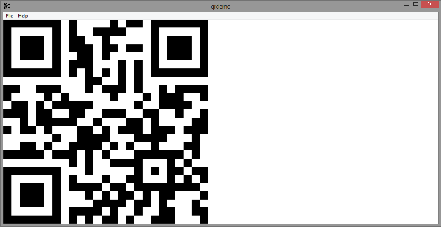

# QR Code Painter w/Fukuchi libqrencode
## Requires
- Visual Studio 2013
## License
- MIT
## Technologies
- Graphics
- Win32
- C++
- Windows SDK
- Windows
- Graphics Functions
## Topics
- Graphics
- Graphics Functions
## Updated
- 05/18/2015
## Description

<h1>Introduction</h1>

The program paints a QR code, using the Fukuchi libqrencode library to generate the QR code<em>.
</em>&nbsp;The code generation painting is done in a helper class that can be used in isolation from the rest of the program.

<h1>Building the Sample</h1>

The sample requires the <a href="https://fukuchi.org/works/qrencode/" target="_blank">
Fukuchi libqrencode</a> library. &nbsp;

Description

The sample is based on the basic Visual Studio Win32 template. &nbsp;The program paints a QR code of an argument passed on the command line, defaulting to 'qrdemo.' &nbsp;Below is a screenshot.

The modifications to the main CPP file is minimal: &nbsp;Some initialization code to include the global QR Painter instance, and a modification to the handling of WM_PAINT in the main window procedure.

Most of the sample code is in QRPainter.cpp. &nbsp;The CQRPainter class takes a string from which to generate a QR code, and a PaintData() method that takes an HWND, HDC, and RECT to paint into.&nbsp;

CQRPainter caches the HBITMAP for the QR code, so that repainting requires minimal work. &nbsp;If the QR code gets changed, which happens through a call to InitializeData() method, the HBITMAP will be invalidated and recreated on the next paint operation.

Since QR readers work best when the QR code image is square, the CQRPainter paint method produces the image inside the largest possible square in the RECT that was passed in.&nbsp;

&nbsp;

C&#43;&#43;

Edit|Remove

cplusplus
<pre class="hidden">	case WM_PAINT:
		hdc = BeginPaint(hWnd, &amp;ps);
        g_qrPainter.PaintData(hWnd, hdc, ps.rcPaint);
		EndPaint(hWnd, &amp;ps);
</pre>

<pre class="cplusplus">&nbsp;&nbsp;&nbsp;&nbsp;case&nbsp;WM_PAINT:&nbsp;
&nbsp;&nbsp;&nbsp;&nbsp;&nbsp;&nbsp;&nbsp;&nbsp;hdc&nbsp;=&nbsp;BeginPaint(hWnd,&nbsp;&amp;ps);&nbsp;
&nbsp;&nbsp;&nbsp;&nbsp;&nbsp;&nbsp;&nbsp;&nbsp;g_qrPainter.PaintData(hWnd,&nbsp;hdc,&nbsp;ps.rcPaint);&nbsp;
&nbsp;&nbsp;&nbsp;&nbsp;&nbsp;&nbsp;&nbsp;&nbsp;EndPaint(hWnd,&nbsp;&amp;ps);&nbsp;
</pre>

<h1>Source Code Files</h1>
<ul>
<li><em>QRPainter.cpp</em> </li></ul>
<h1>More Information</h1>

The sample requires the Fukuchi libqrencode library. &nbsp;You must <a href="https://fukuchi.org/works/qrencode/">
download</a> it separately and the library has additional licensing requirements.

