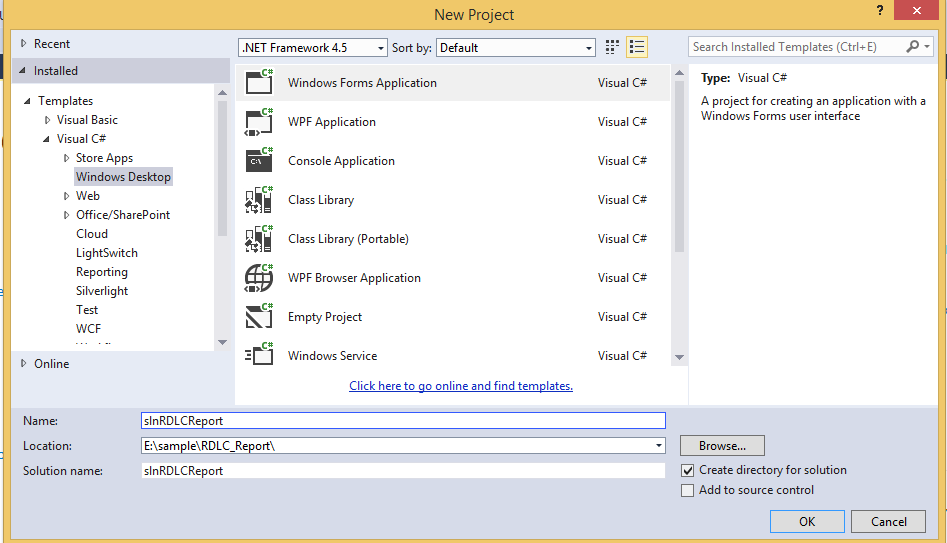
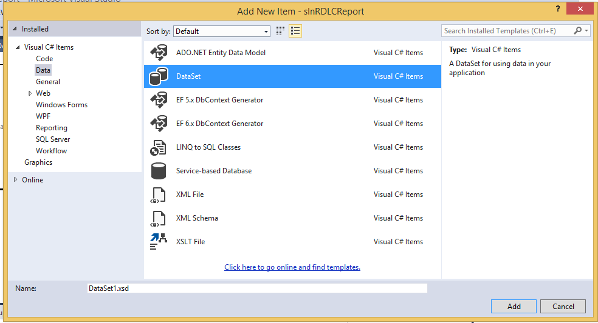
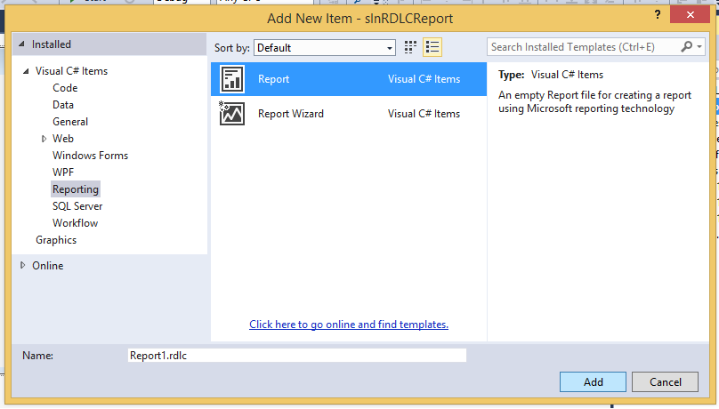
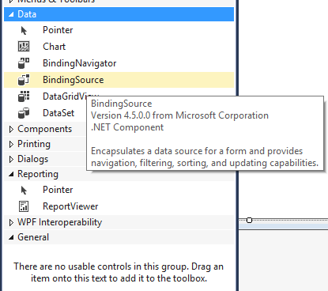
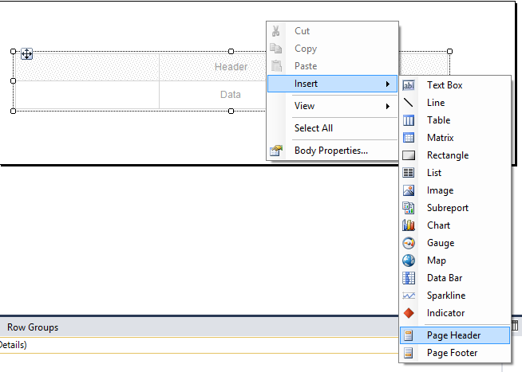
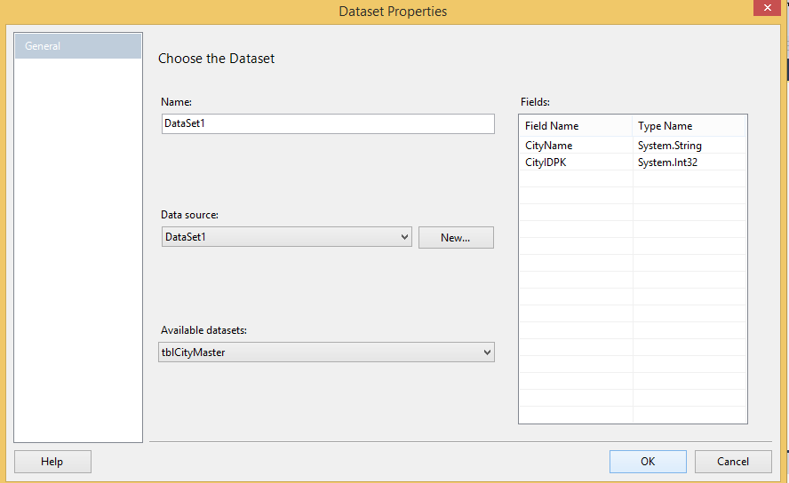
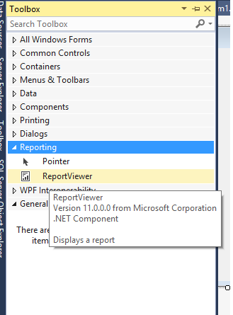
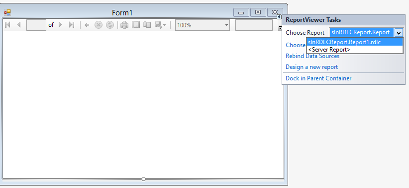
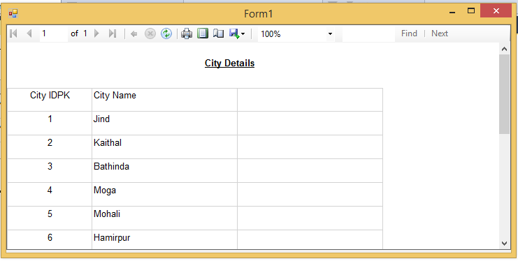

# RDLC Report in C#
## Requires
- Visual Studio 2013
## License
- MIT
## Technologies
- C#
- .NET Framework
- RDLC
## Topics
- Reports
- Reporting
- SQL Server Reporting Services
- RDLC
- ReportViewer
## Updated
- 05/03/2015
## Description

<h1>Introduction</h1>

<em>This sample shows how to generate RDLC report in C#, you can generate reports for small, medium and large scale business.</em>

<h1>Building the Sample</h1>

<em>Visual Studio 2013, .Net Frameworm 4.5, MS SQL Server 2012</em>

Description

<em>This sample shows in detail how to generate RDLC report in c#</em>

I have explained a simple tutorial with an example and sample code to create RDLC Report in Windows Forms (WinForms) application using C# and VB.Net. 
The RDLC Report in in Windows Forms (WinForms) application will be populated using Typed DataSet. &nbsp; &nbsp;&nbsp;

<h2>Create C# Project</h2>

Here you can take your C# project.

<h2></h2>

&nbsp;

<h2>Create DataSet in Your Project</h2>

Create Dataset to populate RDLC reports in to your project.

&nbsp;

<h2>ADD RDLC Report in Project</h2>

Now you can add RDLC report into your project.

&nbsp;

<h2>Add Binding Source to your Project</h2>

Now add binding source to your project so that can fill database to populate RDLC report.

&nbsp;

Insert Table in your RDLC report

Here you can drag required information to display Header and Footer in report.

<h2>Choose Dataset</h2>

Here you can choose dataset to populate report in C#

&nbsp;

<h2>Add Report Viewer to display RDLC report</h2>

Here we are adding ReportViewer to display report.

<h2>Provide Datasource and Path to RDLC Report</h2>

Here we can provide datasource and path of the RDLC report.

<h2>Final View of RDLC report</h2>

&nbsp;

C#

Edit|Remove

csharp

<pre class="csharp">//&nbsp;TODO:&nbsp;This&nbsp;line&nbsp;of&nbsp;code&nbsp;loads&nbsp;data&nbsp;into&nbsp;the&nbsp;'DataSet1.tblCityMaster'&nbsp;table.&nbsp;You&nbsp;can&nbsp;move,&nbsp;or&nbsp;remove&nbsp;it,&nbsp;as&nbsp;needed.&nbsp;
&nbsp;&nbsp;&nbsp;&nbsp;&nbsp;&nbsp;&nbsp;&nbsp;&nbsp;&nbsp;&nbsp;&nbsp;this.tblCityMasterTableAdapter.Fill(this.DataSet1.tblCityMaster);&nbsp;
&nbsp;
&nbsp;&nbsp;&nbsp;&nbsp;&nbsp;&nbsp;&nbsp;&nbsp;&nbsp;&nbsp;&nbsp;&nbsp;this.reportViewer1.RefreshReport();</pre>

<h1>Source Code Files</h1>
<ul>
<li><em>You can view in detail from here <a title="RDLC reports in C#" href="http://www.technologycrowds.com/2015/04/rdlc-reports-in-csharp.html">
RDLC report in C#</a>.</em> </li></ul>
<h1>More Information</h1>

<em>If you go in deep in RDLC report then can view from <a title="RDLC reports in C#" href="RDLC reports in C#">
here</a>&nbsp;</em>

Database is under <strong>DB_Script </strong>folder.

<em> 
</em>

